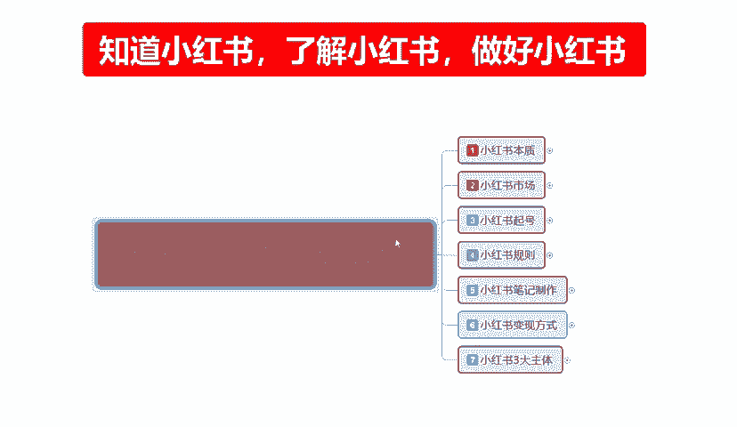
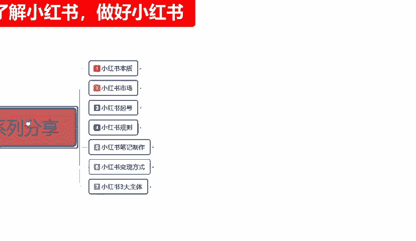
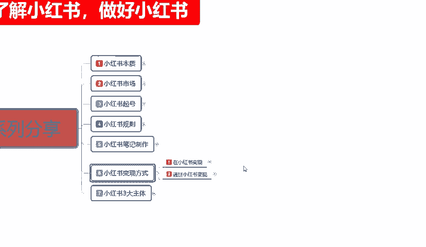
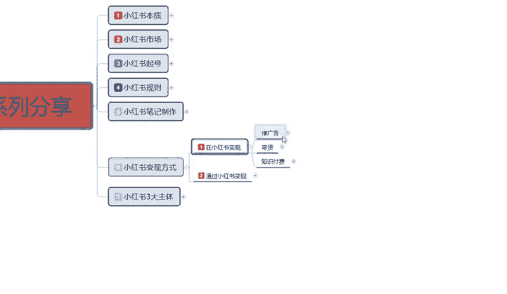
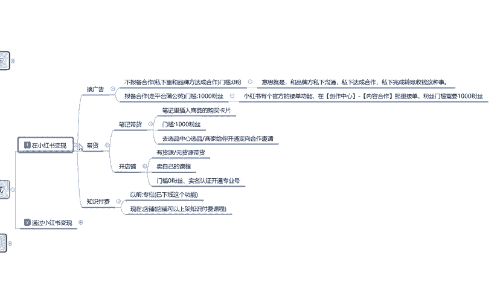
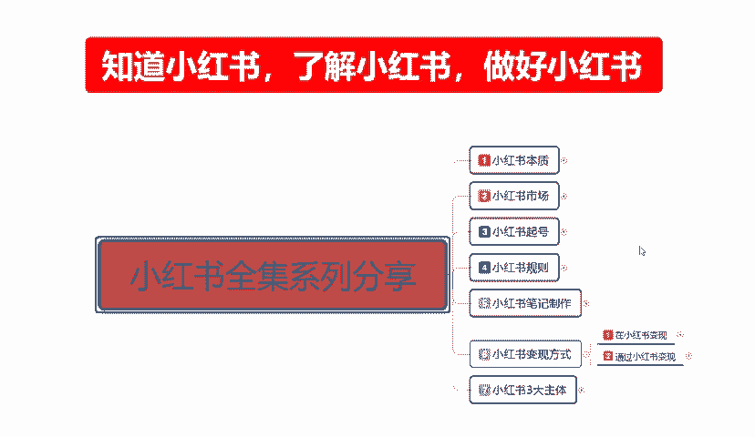

# 140分钟学会小红书运营-原来打造爆款笔记这么简单！！！小白零基础入门必学的小红书笔记公式拆解，最简单的起号教程，快来学！！！ - P44：32、新手小红书运营-小红书变现方式（1） - 红书教程1 - BV1o629YMEjv

大家好，今天给大家分享的是小红书全集系列的第六大课时。小红书变现的一个方式啊。很多朋友的话可能觉得在小红书上面我去卖店不好做的话，我怎么去把它变现啊，就是我这上面有访客啊，有有粉丝，对吧？

但是他们在我这的一个成交数量都是比较小的。那我们在这里呢就今天呢主要是给大家讲解一下小红书变现的几个方式。嗯，整体内容的话说实话不多。但是它的整体框架是非常大的，但是不多，是为什么呢？

因为我在这个地方的话，有些东西没办法跟大家直接说啊，我们大家了解一下小红书对于通过哪些方式去变现就行了。因为整体的话说实话，小红书变现的话，我们具体操作的话，你还要看个人自己去做什么的。

如因为你我不了解你们做什么的话，我瞎跟你们说的话，你们可能会进入误区的，知道吧？小红书变现其实有很多种方式的，不管你是做什么的，它都有一个变现渠道，只是变现这个变现渠道的话，看你们自己了不了解。呃。

小红书变现呢我在这里呢是给大家分为了两个大点啊，两个大点里面的话，其实内容也不是太多啊，没有怎么给大家呃去整理这一方面的资料啊，因为也是一个时间关系的一个原因，包括整体的一个限制吧。

小红书变现两个大点呢，第一个就是说在小红书平台进行变现。第二个就是通过小红书平台进行编现。这两个的话其实内容。都差不多，只说一个是在小红书上面直接进行跟小红红书进行合作的一个变现。

第二个的话就是说通过小红书，它只是说给我们的一个交流平台，就相当于微信也好，QQ也好啊，微博也好等等这种方式。然后的话我通过小红书跟用户联系。然后的话通过线下或者通过其他方式进行的一个变现方式。

首先我们了解一下在小红书变现。小红书变现的话其实是。呃，比较简单的在这里我就给大家列三个点，第一个就是接广告，第二个是带货，第三个是支付付费，这个是网红的啊。有一个我没给大家列上去。

就是小红书在上面直接卖商品变现。这个的话我不用教，大家也会啊，就没在这个地方给大家提。首先我们了解一下小红书借广告。

说实话，这个的话门槛是非常低的。啊，首先这广告它有两种方式，第一种是不报备合作。呃，什么意思呢？就是说私下里面和品牌方达成合作。门槛很低，低门槛它比较适用于的话，就是说游戏主播呀。

或者说是嗯有一定账号基础的。虽然说是零粉丝的门槛，但是你有一点你得跟品牌方去合作。你品牌方吸引任你，你有自己有一定的名气，你才好去。跟品牌的方做这一部分的合作。如果说。你自己什么本事都没有。

你直接上去了以后的话，你拿素人的一个素材去跟品牌方去合作的话，说实话这个的话你。不好做知道吧？而且你的收益也不高。我们如果说借广告做网网红。通过这种方式的话去宣传其他公司的一个产品。

通过我自己的一个渠道，我发布的一个内容，我在里面打打广告用户也能接受啊。这个的话说实话，这广告的一个形式的话，在抖音上面比较普遍。小红书上面也有，但是不多啊，因为它小红书的有些产品的话。

它的用户群体不在这个方面。所以说它的一个整体广告投入量的话没有那么大。整体的意思就是和品牌方呢私下进行沟通，私下达成合作，私下完成转账收钱这种事情就说在小红书，我只说拿它做一个平台进行跨越的一个跳板啊。

这是不报备的一个合作。也可以把它划分为通过小红书进行变现。只是说在这个里面接广告，它有一个报备和一个不报备两个区别而已。报备合作是什么呢？就是走小红书整体平台的一个蒲公英。

它蒲公英里面是小红书对外招商的一个广告平台。广告平台里面的话就是说呃你有一定的粉丝量，粉丝量的话，门槛是1000，你就可以接到广告。小红书的官方接单功能在创作中心内容合作，那里面接单。

粉丝门槛需要1000粉丝，你就可以直接通过小红书的一个呃接单广告去里面找自己适合或者说有1000粉丝，别成需要进行宣传的这种去接单。然后通过你发放的笔记宣传他的一个商品和内容。然后呢，他给你也。赚钱。

通过这种方式来截广告。但是这种的话，说实话你要去做的话，你前期达到1000粉丝还是比较容易的啊。小红书上面达到1000粉丝还是比较容易的，但是它的收益不高。整体收益也就平均一天的话。

在100到150左右，高的话也不超过200。你找的合作方多的话，你的整体数据量下去了以后的话，你后续就是这个账号，你只能做这个，而且每天的一个任务还是比较繁重的。建议的话就是说我们把账号做好啊。

数据权重拉起来以后有个几千上万。的，粉丝你在考虑去接这种广告，然后去赚钱变现。因为这样的话，你的一个呃基础门槛就高了，不能说基础啊，就是。相对于你来说的话，你的收入就会变高很多啊。

大家如果说对这个接广告，小在小红书里面接广告，想了解一下啊，就按照我刚刚给大家说的这个步骤去走。在创作中心里面有一个内容合作啊，那里面去接单就可以了。这个呢就是小红书变现的一个方式接广告。

正常的话你没有产品，没有资源的话，你只有粉丝数量，你可以去试考虑试一下这个这个和抖音上面的差不多，只是说它的价格要比抖音便宜很多，但是抖音不好做，说实在的啊，抖音上面你去接广告，你没点本事的。

别人投都不会投，你鸟都不会讲你。你哪去那接那么多广告啊，对不对？而且你的账号起号非常满。第二个就是带货，带货什么呢？笔记带货笔记里面插入商品的一个购买卡片。啊，门槛100粉丝也是一样的。

去创作中心内容里面去找合作商啊，或者说是去选品中心选品商家给你开通定向的一个合作机型。定向的啊是商家提醒你就是在你你在同行业里面的话，有一定的一个技术权重，或者说有一定的技术宣传。对于内容的话。

比较适合他的产品就做宣传的，他会他会联系你。但这种情况的话很少。啊，你要做起来的以后，别人才会去联系你，你没做起来的话，都是你联系别人，就是笔记带货。发布笔记跟产品相关的去做。也就说我们前面的话。

我自己啊账号创建以后的话，我创建一个商创建一个店铺。店铺里面的话，我暂时的话就随便找两个产品挂上去。我主要的话就是通过这个方式来进行一个产品的宣传。我对这些产品非常了解，然后进行宣传。宣传以后的话。

这个产品但是我没有货，你就可以去。但是我对这个东西的话非常了解。然后你就去可以去找商家了。啊。找商家跟他联系，然后的话你跟他聊，我帮你带货。我这边有粉丝，有笔记，有内容，我有方式，就相当于是带你。

类似于待遇。啊，能拿多少钱就看我们大家自己怎么去。怎么去理解，怎么去操作啊，最后的一个协商结果的话，还是看自己的个人本质。后面呢就是。开店铺啊。

开店铺说实话这个的话就是我们自己开店自己做找货的话就是有货源无货源买，要不就是自己卖客。实在不行的话，就自己找产品，自己找线下产品这种方式去弄。后续的话我会在三叉主体里面给大家讲解一下这个。因为说实话。

对于新手的玩家来说的话，嗯，在小红书上面做，你自己开店的话，比带笔记接广告要现实一点。啊，接广告能做是能做，但是你要有前提基础啊，你要有自己的内涵在这个地方。有粉丝的技术数量才行。但是开店铺的话。

门槛基本上没有啊，自己用点心就能做。实名开通一个账号啊，把我这一套课程全部看完以后学会了，你基本上都能开店都能做啊。只是说你选品选的好不好，你店铺做的好不好，你账号做的好不好，就跟你的收入直接挂边了。

这个就是带货。说实话，你在1688上面去选品的话，你在抖音上面去选品，你在拼拼多多上面去选品，选完屏以后拿到小红书来卖。也是属于带货，只是你带的是别人的货，不是自己的货，也是一个道理啊。

把把他的思维转换一下。就是我们整个的一个带货渠道。然后呢，就是一个付费知识。付费知识的话，以前的话它有一个专栏。什么意思呢？我在小书上面给你讲课讲专业的知识啊，比方说游戏怎么怎么玩，技能怎么怎么放。

连招怎么怎么放，对吧？呃，上课啊英语课、语文课、数学课等等等。就是付费知识的一个麦课内容。比方说一对一指导啊，我教你学英语啊等等。以前有专栏，现在没有了，已经下架了啊。

但是现在的话它有一个店铺可以上架付费知识的一个课程，就比方说我现在的话，我给大家进行了一个分享，对吧？我把我的课程分享给大家，我如果说要去收费。我就把我在小红书上面，我自己创建一个账号。

然后把我的课程放进去。然后把它设置成付费的一个知识，让大家去购买付费。比方说一节课100205010235000全套打包5678001万，类似这一。啊。付费知识的一个推广。当然了。

你对其他行业的一个付费知识的话，你自己也可以去做，对吧？你比方说讲故事讲书，对吧？但是前提是你要有粉丝基础，你才能去付费收费。你的比较要对别人有一定的吸引力，你才能去收费啊，一样的，你做的好才行。

这个呢就是在小红书整体变现的一个方式。呃，时间关系的原因呢，这个呢就不给大家说了啊。那这一节的分享呢就到这里。下一节呢给大家讲解一下我们通过小红书啊怎么去变现。它其实和在小红书变现的话差距是不大的。

