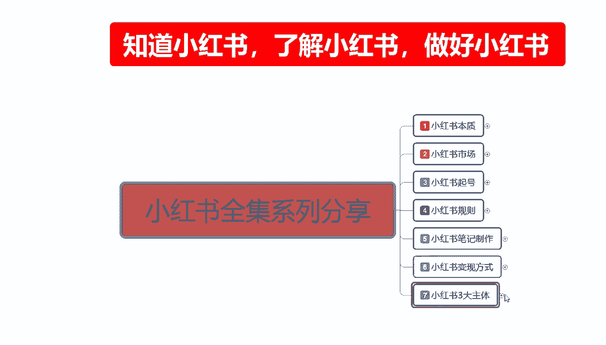
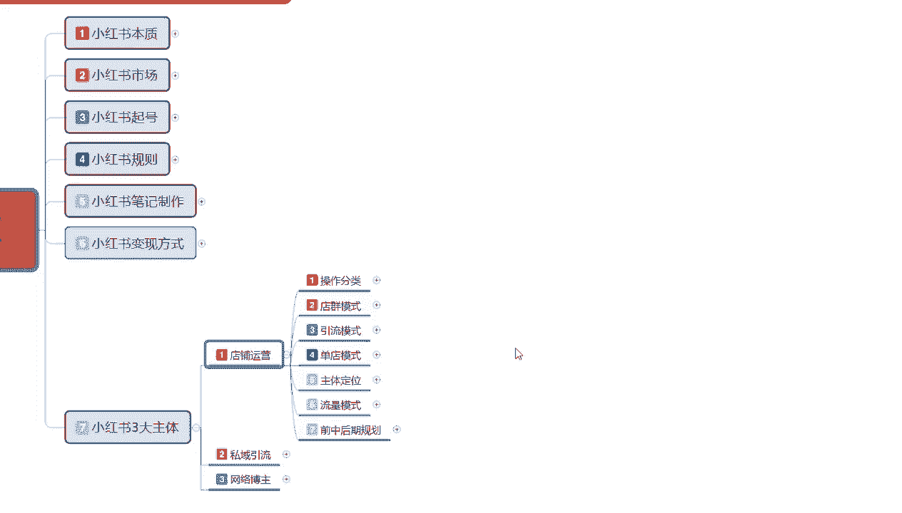
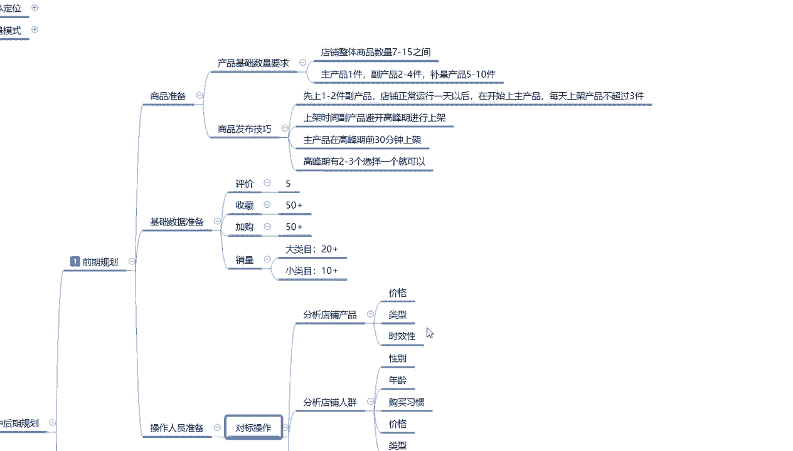
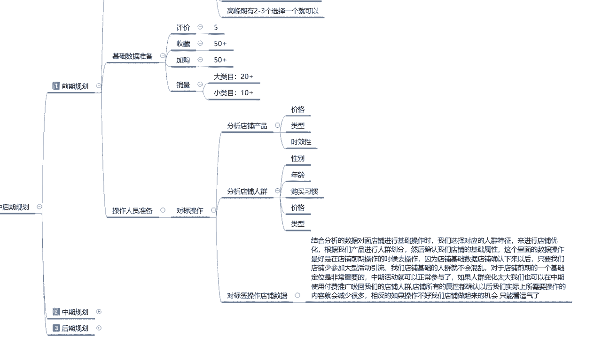
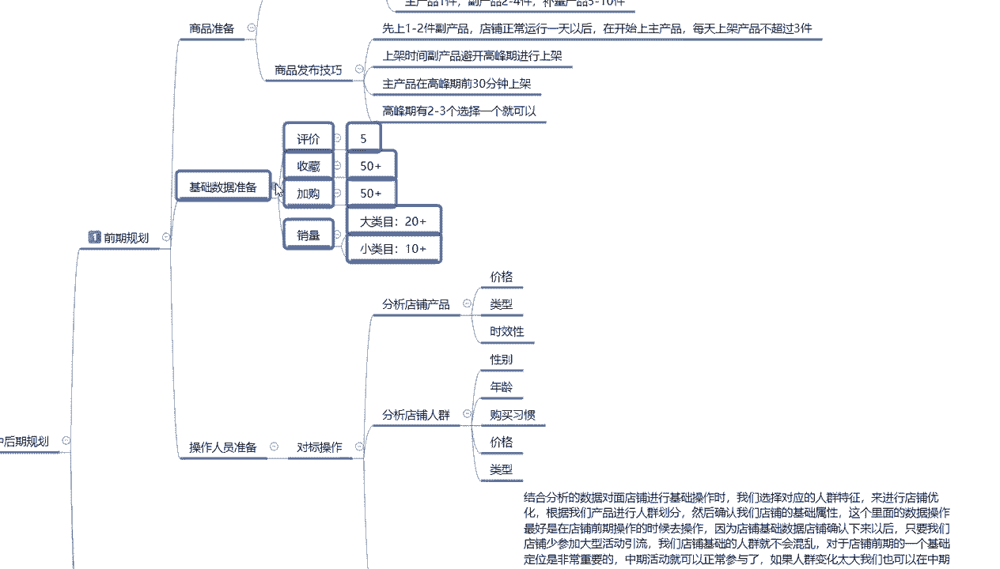
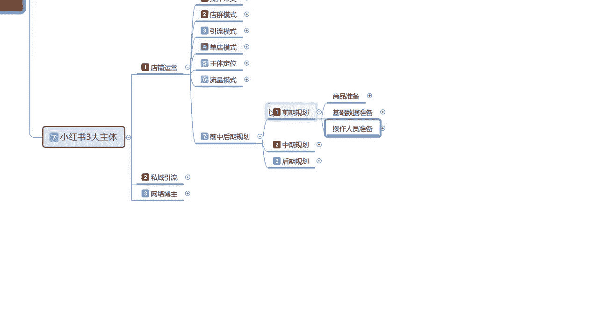

# 140分钟学会小红书运营-原来打造爆款笔记这么简单！！！小白零基础入门必学的小红书笔记公式拆解，最简单的起号教程，快来学！！！ - P44：42、新手小红书运营-小红书店铺规划（1） - 剪辑手机教程 - BV1w22EY7EMD

大家好，今天给大家讲解的是小红书拳击系列，第七大课时的一个内容。

这节课的话主要是给大家讲解一下，我们店铺运营最后一节啊，前中后期三个时间段的一个整体规划。

呃我们直接开始进入正题啊，首先我们了解一下我们前期的一个规划啊，前期规划的话，说实话它的整体内容的话，额就是我们前期店铺小红书，你做店你得要有他的一个基础数据量，这里呢我已经给大家列出来了啊。

就说我们要保证这个基础量的话，才会有自然的一个成交比例，嗯首先呢是商品的一个准备，产品基础数量的一个需求的话，就是说我们整体店铺的一个基础数据量，后面的先给大家关掉，让大家先认真的听一下这个啊。

后面的我们待会再看好吧，就说整体店铺的话，商品数量是在7~45个之间，就说我们商品的话，你就算说是做单品单店的啊，你也要保证在这个数量之间，主产品一件副产品，两到四件补量的一个产品的话就是5~10件。

这个产品的话就是说不用去做额外的数据，为什么说是主产品，一件副产品两到四件和不量产品5~10件呢，他都是有那个怎么说呢，主产品一件就是我们主推广的一件产品，副产品两到四件的话，就是说我们准备做第二爆款。

第三爆款，第四爆款的一个产品，不量产品5~10件的话，就是说他只是为了好看啊，让我们店铺里面有多个的一个选择仁安，然后呢增加我们店铺整体的一个活跃度，和我们账号的一个技术权重的，这个里面呢产品发布的话。

它是也是有技巧的啊，他不是说我们店铺额产品15件产品，我在一天之内就把它上传完啊，它这个产品发布都是有技巧的，产品发布技巧的话，首先呢就是先上一到两年副产品，主产品先不上啊。

主产品的话基本上都是带第二天，第三天或第四天去发布的啊，不要急不要着急，直接把主产品放上去，我们现在要测试一下整个账号的一个权重，而且第一件第二件副产品你上架以后的话，也是让系统小红书。

整个系统认可我们这个店铺啊，就说认可我们的一个账号，让账号进行录入，录入以后的话给账号升级啊，因为我们刚开始上来的时候，你店铺把前期的一套数据做下来以后的话，已经过了过了几天的一个时间了。

过了几天时间以后的话，我们先上副产品，让小红书任务，让认为我们店铺已经开始正式营业，正式营业的话，这个副产品上上去以后的话，只是让小红书再次录入我们的一个产品选项，进行一个基础排名的一个划分。

然后再进行正常的主产品上架，就说我们在店铺正常运行一天以后啊，再开始上传主产品，每天上架产品的话就说不超过三件啊，基本上一件两件都行，三件也可以啊，基本上都是一到两件左右的一个商品，三件也行。

上架时间的话就是说副产品的话，你要避开避开我们所选择的一个行业高峰期，就是搜索这个时间段的一个行业，高峰期，不要在高峰期去和主产品讲流量啊，主产品的流量的话是在高峰期上，你副产品的流量的话。

任何时间段都可以，但是不要在高峰期去上，然后主产品在高峰期前30分钟上架，让系统有一个录入时间，大概的话也就五到10分钟录入进去的话，就是高峰期前你的产品上架开始争夺排名，这个懂懂意思吧。

就是我们产品上架以后的话，你要给他一个空余的时间，让排名上上去，排名提升上去以后的话，我系统在更新的时候又是小红书，后台系统在更新的时候，你的排名就会靠前，获得更多的一个展示和曝光的一个机会啊。

这都是一些小技巧，然后高峰期高峰期的话它是有两到三个，我们选择其中一个进行操作就可以了，基本上的话都是正常选的话，都是在下午啊，找上这个早上偏中午这个高峰期的话，呃人的一个数量的话，他不是太多。

基本上都是在下午这个高峰期去操作，中午的话你如果说是做办公类的一个用品，或者说其他的一个用品的话，你在这个中午的这个高峰期的话，会比较好一点，如果说你这做的是大类目的话，就做下午做的是小类目。

就做中午晚上的话你都可以选，但是晚上说实话，整体的一个成交量的话不会太高啊，这个就是我们商品准备的一个怎么说呢，整体准备前期操作啊，你把这些数据准备好了以后再去操作啊。

你这个的话店铺整体商品数量最少是七件啊，最少是七线，7~15之间，你做单店的话，你就是七件，你做多电的话，你基本上要准备的接近到15个，但是你前期的话，你最少要保证七件商品在你的店铺去运营，去推广。

你后续再补充到15件都可以，但是你前期不能低于七件，寄件商品是这个商品的一个下限数量，你没有七件商品以上的话，你的整体店铺权重你都拉不起来，你想做你都拉不起来的好吧，这个就是商品准备。

然后基础数据准备是什么，评价收藏加购加销量啊，评价的话你就说商品评价，你我们前期操作的时候，你把商品评价你最少要做到五个，他才能做了正常的一个销售量，收藏价格50往上走，这个的话说实话是没有硬性规求。

硬性要求的，但是你的收藏架构越多，对于你后期的一个营销策略，包括别人的一个喜爱程度和推广程度的话，系统它的一个评分都是非常高的啊，就是越多越好，尽量去做到50往上走，越多越好，然后就是销量，大类目的话。

销量就是你必须要有20个以上的销量，你才卖得动，你20个销量都没有的话，你卖不动，这个是基础数据啊，小类目的话十个以上就行，冷门内幕的就不好说了啊，冷门内幕的话，你要看你的产品价格和你的一个产品选项。

那个东西的话要看具体店铺，你做什么来定，前期来定的话你也不好定的，因为他的有的有的是批量的，有的是大件的那种，都不好说是吧，在这呢就没给大家列出来，这个就是基础数据的一个准备，然后是操作人员的一个坐标。

我们需要准备什么，首先对标操作。

这个里面的话就是分析店铺的一个产品，价格类型，时效性，然后分析店铺的人群性别年龄，购买习惯，价格类型，对于标操作店铺的一个数据的话，就是操作人员准备啊，是为了准备这些的啊，基础数据的一个准备。

他是给我们做基础数据达标的，你要用这些标签的一个数据，来做我们这个店铺的一个数据，他就要了解我们店铺的一个属性，价格属性类型属性，时效性，然后是店铺的一个人群，性别年龄，购买习惯，消价格和消费类型。

就是我们在准备前期操作的时候，你的基础数据准备的话，你必须要按照这个标准去做，做对应账号的一个权重，懂意思吧，操作人员的一个账号需求，对标签对标签操作店铺数据的话。

就是结合分析我们数据对店铺进行基础操作时，我们选择对应人群的一个特征，来进行店铺的一个优化，根据我们产品进行人群划分，然后确定我们就是店铺基础的一个基础属性啊，这个基础属性你前期做好了。

你后期就不需要修改，你前期做不好，后期修改很麻烦的，你后期的话数据量起来，店铺人群是乱的，你再想把他拉回来的话，很难的，这个里面数据操作，最好是在店铺前期操作的时候去操作啊。

因为店铺的话就是说基础数量确认，店铺，接下来包括以后，我只要我们店铺少参与大型的一个活动引流，就是呃小红书平台系统，它给你推广的那些呃做引流的一些活动，少参与可以参与，但是少参与，你前期的话少参与。

后期的话中后期就无所谓了，你前期把人群规划好了，后期再去怎么做都可以，你前期不规划好人群，后期你再想去操作的话，那难度就是成倍的往上面翻了啊，你的店铺输出店铺数据有多好，你想把人群拉回来，你就有多难。

我们把这个做好以后的话，我们店铺人群他不会混乱，对于后期的话，就是说店铺你再接着去参加大型活动，对你的影响也就不大了，不然的话你本来好不容易做起来，一个店店铺人群还没完全固定下来，你去参加活动，活动。

做完你店铺就废了，知道吧，你然后再通过活动以后，你再想把店铺人群拉回来，你就拉不回来了，你以后就只能跟着活动走，有活动的时候，你有流量，没活动的时候，你基本上就很少有成交了，这个的话。

我们就要看我们个人自身怎么去考虑啊，后面的我就不给大家说了，我反正已经给大家打上去了，大家想了解的话，大家自己嗯认真的看一下啊，用这个的话说实话，你要在小红书上面做电，你不考虑这些东西的话。

后期很难做起来的，你做前期你赚个一两个月的钱，说实话你投入这么多，和你所收入的不是太成正比啊，这个呢就是我们整个店铺的一个前期规划啊。

包括我们前期的一个基础数量，就是产品主属性的一个基础量，这这个大家不要弄混了啊，这个的话是主产品的一个销售数量啊，副产品的话那就无所谓了而已，或有或无都行对吧，但是主产品的话你不能低于这个数量。

这是最基础的一个需求论。

这个呢是店铺的最基础最基础的一个数据量啊，商品的一个准备啊，基础数据准备，操作人员准备准备好了，我们就可以开始步入正题了好吧，那这一节呢就给大家分享到这。

