# 140分钟学会小红书运营-原来打造爆款笔记这么简单！！！小白零基础入门必学的小红书笔记公式拆解，最简单的起号教程，快来学！！！ - P47：02.哪些账号适合开通小红书店铺 - 有点像大哥Seven - BV1pY2vYcEf2

今天来跟大家讲一讲我们哪些账号适合我们开通我们小红书的店铺。我们会从三个方面来跟大家来讲讲我们这堂课。首先会跟大家讲讲，不管说你人是在国内的，还是在国外的，我们都是有办法来开通我们小红书店铺的。

或者说很多人想了解目前我的账号是一个新号，我们是呃或者是一个老号，我们到底我们的账号是否去可以去开通小红书店铺的，对吧？或者说呃目前我想了解一下我们的账号到底是否被限流的等等这些问题。

我今天课程里面都会跟大家讲的很详细。首先呃不管说你是人在国内还是人是在国外的，其实都是可以去开通小红书店铺的。第一种情况，你如果人在国内，在我们。

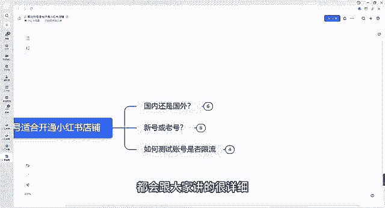

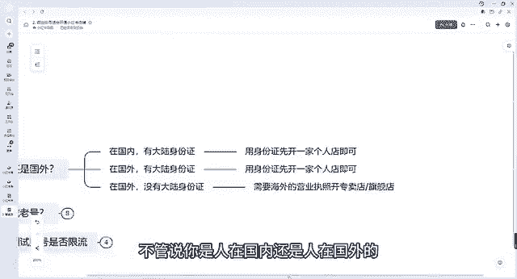

中国大陆类对吧？有我们大陆的身份证的，对吧？那我们直接可以去用身份证开通一家个人店铺就可以了。小红书店铺跟其他平台的一些店铺开通店铺条件还是不一样的。它整体来说还是比较宽泛的。呃，因为你像其他店铺的话。

整个条件还需要你有营业执照。而小红书开通我们个人店的话，并不需要你去有营业执照，开一个个人店就可以了。有一个身份证就可以了。第二个，你如果说是在国外的对吧？但是你也有大陆身份证，那没问题。

我们也是可以用身份证开一家我们个人店，好吧呃，就是你首先第一个条件，你如果说不管人在国内还是在国外，你有身份证就可以开通了。第二个呃，你如果说人在国外，但是你也没有大陆的身份证，对吧？没有大陆身份证。

那怎么办呢？我们就需要有一个海外的营业执照开通可以开通一个专卖店和一个旗舰店，我们也有学员，他是人在国外的，但他有自己的货源，那们自己外国的。些货源，那他想营销到中国来怎么办呢？

那就需要有海外的营业执照就可以开通店铺，就可以呃营销到国内了。好吧，但是他只能开通专卖店跟旗舰店。好吧，呃，这个是一个条件，我们不管人在国内还是在国外都可以开店。第二个就是我们考虑到我们新号还是老号。

我们如何去开店的问题。不管说你是新号还是老号，其实我们都是可以去，如果说条件允许的话，都是可以去开店的，好吧，呃，都是可以去发布作品的。老号，首先我们分为你之前有没有发过笔记。如果说你之前没有发过笔记。

那没有问题，第一种条件，如果说你没有发过笔记之后，这个号之之前是我自己我自己在用的，我经常天天在有对吧？天天在刷一些我自己喜欢的内容，对吧，而且这个喜欢内容可能跟我自己接下来想做的类幕是有点区别的。

所以我们最好是要换一个专门的新号，专门的新号，因为可能这个标签就不精准了，跟我们未来想打进这个人群的标。

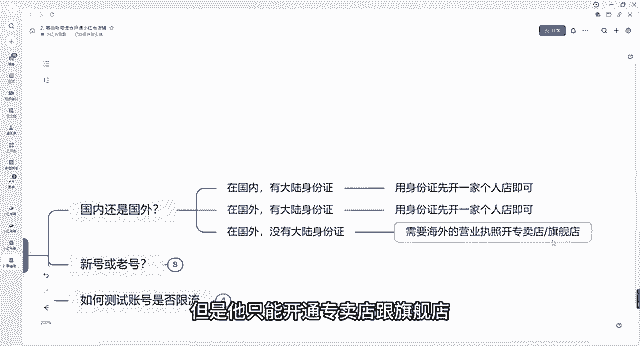

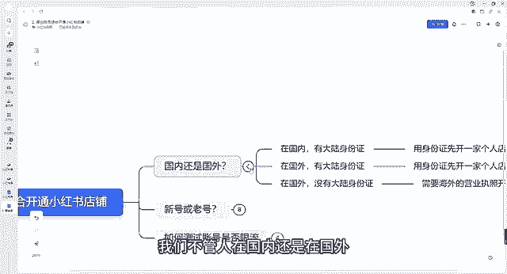

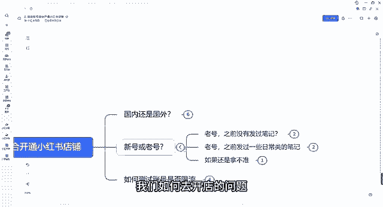

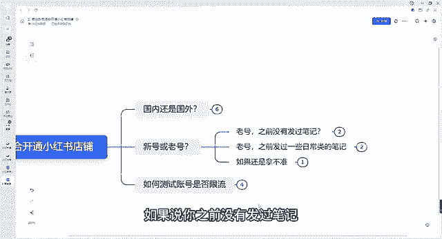

肯定是有点冲突的，有点冲突的。因为我们自己用的账号嘛，标签啊什么都呃都都有了，后续来说不太好养号的好吧？第二个呢，如果说你之前对吧？只是注册过，但是没怎么用的这种情况呢，可以用这种账号。

我们因为这种后续是比较好养号的，比较可以自己自己使用的。如果说你之前发过一些日常类型的笔记，一方面要看这个号自己刷的多不多。如果说你这个号刷的比较多，那我们就需要及时给他换掉，对吧？因为你刷的多了。

你这个发过笔记了，你经常标签我还是那句话，你标签乱了，标签乱了话，你想后期再阳改过来，那难度还是比你重新再培养一个号的难度要大的。如果说哎自己刷的不多，而且发的笔记啊，整体流量也不是很好的情况下。

那因为他没有打上足够的标签嘛，那我们就可以继续使用，另一方面呢要看笔记报没报，粉丝账号的整体的粉丝数量是怎么样的。如果。

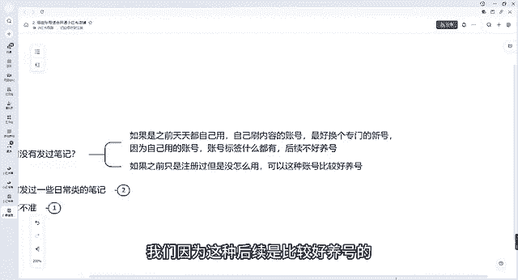

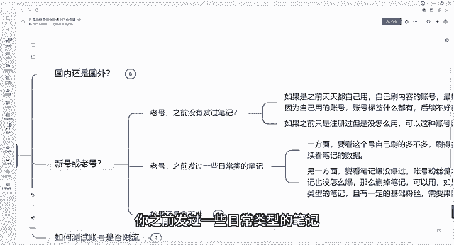

涨的不多，刷的不多，笔记也没怎么报过。那我们可以删掉笔记。因为我刚刚讲到了，对吧你整体的流量不是很多，因为你没天有打上足够的标签，那我们就可以用。如果说你刷的不多，之前发了其他类型的笔记。

且有了一定的粉丝技术，我打上人群标签了，人家都都都能刷到我这账号了，那我们就需要果断。😡。

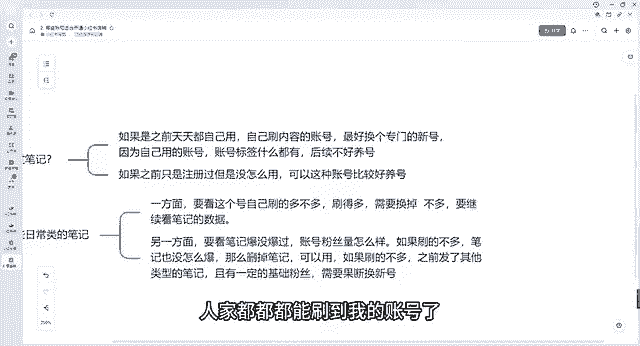

果断的换掉新号，要不然你这个老号，后续如果说标签很乱的话，你你再想把这个标签给它改正的话，难度肯定是比你培养一个新号难度要大很多的。而且我们接下来也会跟大家讲一讲我们新号，如何去养号的问题啊，好吧呃。

这是第一第一个老号的问题。如果说新号的话，其实我们自己如果说我们没有这些问题，我们自己做一个新号也是没问题的我们会对吧？那如果说你还是拿不准我们自己到底是否用自己老号，那我建议大家直接就换新号。

找自己的家人帮忙注册一个新号就可以了。呃，找自己的家人，一定要是比较熟的家人。因为这个的话，后续还得考虑到一个银行卡，人家打的成交额，打到银行卡里面的问题，好吧，这是第一个新号老号的问题啊。

第三个我会跟大家讲一讲，如何去测试账号的是否被限流。呃，正常情况下，我们账号如果说没有出现大量违规的情况下，正常情况下是不会有太多限流的，大家不用太过于担心，好吧，如何知道自己的账号被限流的。

我们可以通过这个方法。

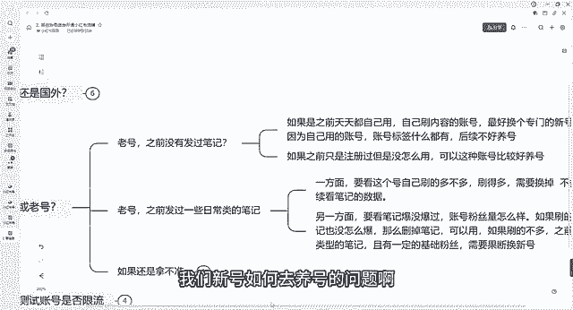

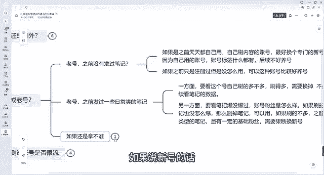

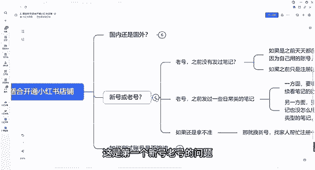

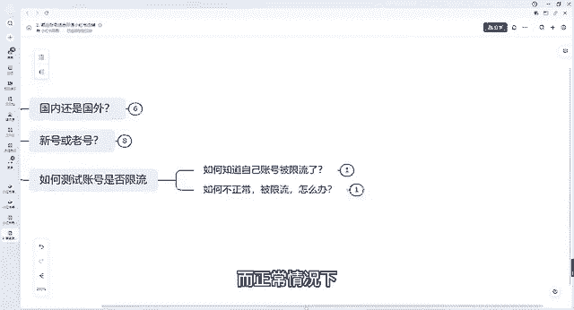

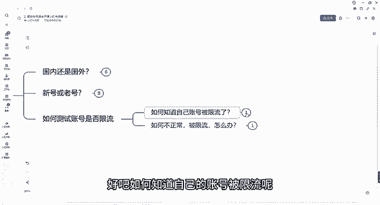

测试账号的限流方法，我们可以发布一个日常分享的一个笔记，发布什么都行，对吧？正常一点的笔记，日常的分分享的生活就可以了。看24小时内的流量情况。如果24小时后流量能达到50左右的，对吧？

那么正常流量是正常的，账号流量是正常的。如果说连50都没有，可能只有一个两个这种呃流量的，那说明你一个账号可能会处在违规阶段的，好吧，如果说不正常被限流了，那我们怎么办？好吧。

上面之前可能有违规的或者存在潜在违规的。我刚刚讲到流量很低的，我们建议注销掉该账号重新注册就可以了。呃，重新注册完之后，这个会是一个新号，我们再做继续培养就可以了。好吧，呃，这个就是大家呃跟大家讲一讲。

我们如果说我们怎么去选择账号，以及我们如何去测试账号的流量的，大家不用去担心，对吧？我们开一个新号，开一个老号的问题。我建议大家呢除非说你之前的账号。

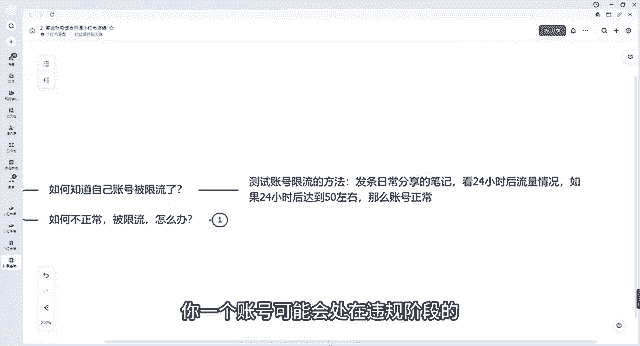

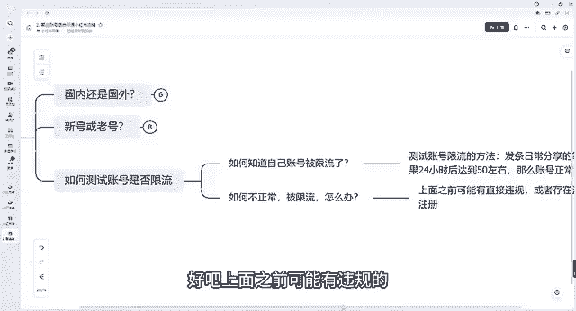

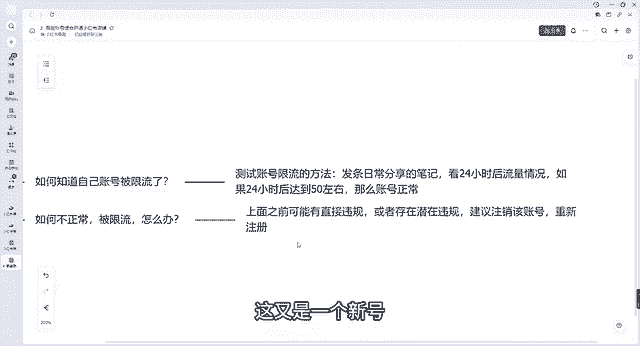

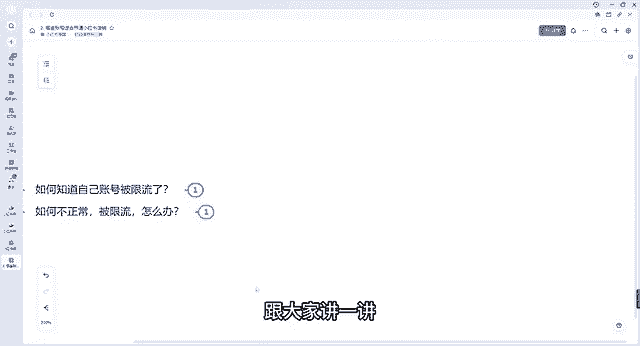

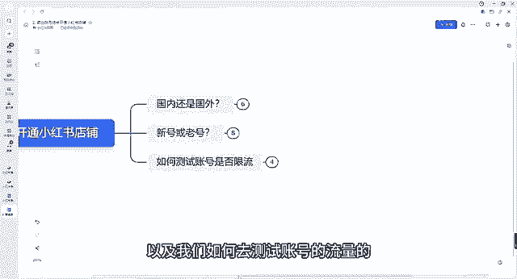

做的很好啦，或者要不然你我建议大家还是去可以注册一个新号，重新养号。好吧，那我们今天这个第二节课程就到这边。

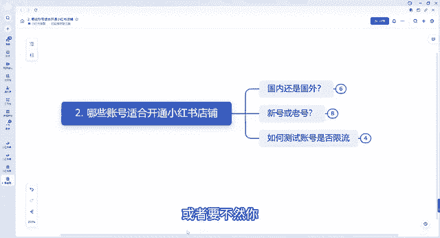

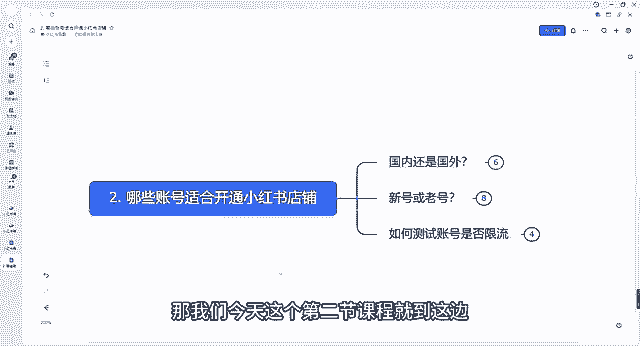