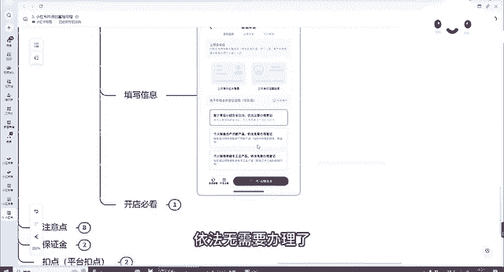

# 140分钟学会小红书运营-原来打造爆款笔记这么简单！！！小白零基础入门必学的小红书笔记公式拆解，最简单的起号教程，快来学！！！ - P48：03.小红书开店的基础流程 - 有点像大哥Seven - BV1pY2vYcEf2

今天我们来讲一下我们第三课程，小红书开店的一些基础的一些流程。我们如何去开通我们的个人店、个体店以及我们的一些旗舰店啊等等等等。好吧，我们先从我们的个人店开始来讲呃。

首先我们个人店的话是可以通过手机开通，也是可以通过电脑开通的。手机开通的话，我们就下载一个我们我们可以用小红书本身的账号，也可以，或者说我们下载一个小红书的签翻，我接下来也会跟大家具体来讲讲小红书签翻。

好吧，我们需要的需要的证件，需要你有一个身份证，以及有一个银行卡，呃，但是这个一定要是同一个人才行，对吧？身份证跟银行卡绑定的是同一个人。呃，这个是必要的条件。

因为它后续所以说这个如果说大家是用自己家里面，然后或者用亲戚绑定的这个身份证的，绑定这个账号的，所以说一定要找比较熟悉一点的，对吧？要不然后续会考虑到一个经济纠纷等等，对吧，这是第一个第二个呢。

就是我们开店。

过程中经营的类目啊，其实可以前期随便选一个，先把店铺开通了再说，反正呃后面反正可以随时再改类目。因为我们交如果说你想持续做的话，你要交交保证金，对吧？但是我们在开店的过程中，保证金可以先跳过，先不用交。

对吧？店铺可以随便取。后面我们后续我们再改都可以，好吧，经营的地址呢也是可以随便填写的，这都没问题。

好吧，那具体的开店步骤我来跟大家来讲一讲怎么去操作。首先第一步打开我们小红书的搜索栏，这就是我们普通的系统。打开我们小红书搜索栏。你看到了，就是我们小红书搜索栏。我们在上面搜索开店两个字。

搜索开店两个字，打开开店了，看到了开店，我们搜索开店这边有个小红书电商，小红书电商官方平台，点击开店，我们就点击这个就可以了。好吧，点击开店之后，点击应即开店这边跳出来之后，我们这边有个立即开店，呃。

我们可以先看一下可开店必要必看的一些材料费用，啊，正常情况下，开店是不需要。你如果说开个人店的话，不需要收费的0元就可以开开通了服务费优惠流量扶持必备工具，对吧？选择立即开店，选择立即开店之后。

我们选择店铺的类型，对吧？我们前期我们可以先选择个人选择个人店，对吧？个人店的话，只需要你有身份证。如果说你想开一个个体店的话，需要有营业执照以及运营人的身份证证件，这个的话是支持一部分的类目的，对吧？

但是如果说你想开通个人店，后期也可以转。😊。

为个人个体工商户店都可以的。好吧，如果说你是企业的话，也可以开通企业店。但是企业的话可能会以呃以及专卖店可能会呃考虑到一个税务的问题。好吧，关于开通店，我们点击店铺选择完之后，我们点击下一步，对吧？

它会里面会有很多店铺的介绍。我们就选择个人店，选择嗯自己想要的店铺就可以了。选择完店铺之后，我们选择点击下一步，点击下一步邀请码，我们可以跳过，对吧？没有可以不填，这是关于服务商的呃。

我们填写其中的一些信息，身份证的正反面照片啊，以及我们这边可以选择属于您星小小额交易依法无需要办理的，以及如果说我们是农副产品的，需要办理的。

对吧开店必备的，我们这里面也是有一些开店必备的个人身份，个体户的企业的等等等等。电商，我们去填写一些自己的一些信息就行了。很简单，好吧，不呃有很多信息，如果说你不需要可以跳过的，你可以先跳过，对吧？

我们选择个人身份，个体店电商用品就可以了选择立即开店，正常情况下，我们的店铺就可以开通了，好吧，这是我们开店的步骤，那有几个注意点跟大家讲一讲，首先呃后续提现的金额会进入开卡身份证人的银行卡。

所以说这个就刚刚跟大家讲过的，我们需要开卡人的身份证跟我们的这个银行卡需要是同一个人，好吧，呃，以及我们如果说多开店的话，最好找熟悉的人来开对吧？亲戚朋友，个人店正常情况下，呃们当天时间。

如果说你这些信息填写的都没有问题的情况下，当天他就可以下来的。小红书的名字，也就是店铺的名字，比如说需要注意的是提前查重，对吧？我们小红书店铺的名字，也可以提。

前可以前前期可以先随便选一个，后面也可以改对吧？但是7天改一次。比如说你这个小红司名称叫11，那你这个店铺名称就叫111的店，个人店不需要缴纳600块钱的证件费用的。好吧。

这个是我们跟大家简单来聊一聊个人店保证金的话，1000块钱，大概在1000块钱左右，也不一定根据不同的类目来分，好吧，最低应该是1000块钱，这个有个平台的扣点，平台扣点大概在每个月成交额的5%。

因为基本上所有平台它都会有一个平台扣点，低于1万元的是不收这个平台扣点的一个自然月订单金额呃结算额小于1万1万0平台免收技术服务费。懂我懂我说的意思吧。假如说你这一个月整体的收入在小于1万元的。

成交额在小于1万元的，它是不收你的技术服务费的。结算额超过1万元部分，平台按5%收。比比如说你今天呃这一个月成交额超过了2万，那你2万，那你有其中的1万，你要收给平台一个。

的服务费是吧，1万元的结算金额已减去退款金额，技术服务费小于5%的店铺不享受万元。

呃，以下的棉容这个大概大家了解一下就可以了。好吧，这个是关于个体店的个体店的一些部分，大家可以去开店呃，了解一下。如果说你想开个体个体店的话，就需要我们实名小红书的账号呃，以及加上我们的营业执照，对吧？

需要是同一个人的。就比如说你小红书是是是谁的，营业执照的法人营业执照上面的人最好是同一个人就要同一个人，然后我们可以通过手机开通，手机打开我们小红书的商家版，目前也叫小红书签翻。好吧，呃。

小红书签翻给大家打一下吧。呃，后续也会跟大家具体来介绍，签翻，然后大家可以下载这个手机开电脑开通的话，去开小红书呃，签翻签翻的官网，就可以打开里面去注册啊，好吧，我们的专卖店旗舰店。

如果说你确实是有专卖店旗舰店，也是可以按照我们刚刚的步骤去开通的。呃，接下来讲一讲我们一些特殊的一些类目，可能是比大家比较想了解的。比如说酒水啊、零食啊、水果啊这些需要。

有营业执照加食品经营许可证，加上品牌授权的这些基本上都需要。但我建议大家就是如果说你不是特别擅长于这几个行业，尽量就先别入局这些好吧，美妆行业呢需要有化妆品备案凭证，家电行业的需要有3C认证证书。

3C数码的需要有3C认证证书，其他的类目的都有具体的介绍，都能在我们小红书的类目里面可以找到。好吧，然后如果说大家有任何关于类目不懂的。好吧，我们接下来也会跟大家讲一讲怎么去选择类目的问题。好吧。

那我们今天这堂小红书开店的一些基础流程，主要是跟大家讲一讲如何去开店，步走操作的。好吧，那我们今天这个课程就到这边。

