# 140分钟学会小红书运营-原来打造爆款笔记这么简单！！！小白零基础入门必学的小红书笔记公式拆解，最简单的起号教程，快来学！！！ - P4：2.小红书店铺分类 - 红书教程1 - BV1o629YMEjv

大家好，今天给大家分享一个小红书零基础开店第三课啊。店铺的一个类型。店铺类型这一节课的话是让大家充分的了解小红书它整个系统里面它的所有店铺类型和它的一个类型区分。

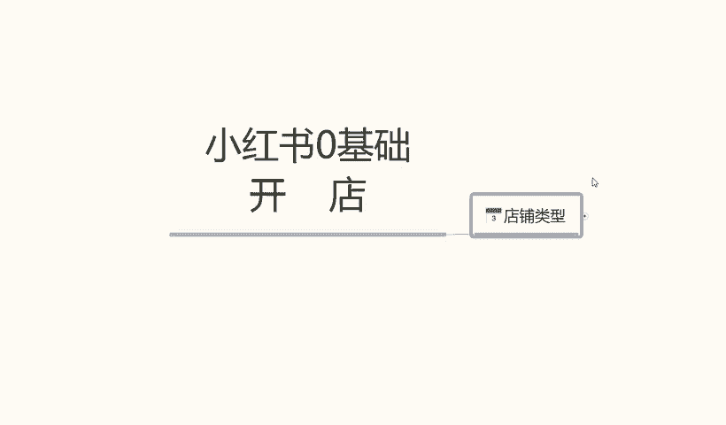

那么直接开始我们这一课的内容。小红书的话，我们正常的一个店铺类型的话，它其实是可以分为很多种的。呃，这里面的话我给大家把它全部都单独的列出来了。哎，因为要给大家详细讲解一下。

让大家了解整个小红书的一个店铺类型的一个体系。我们在什么阶段应该怎么去操作。

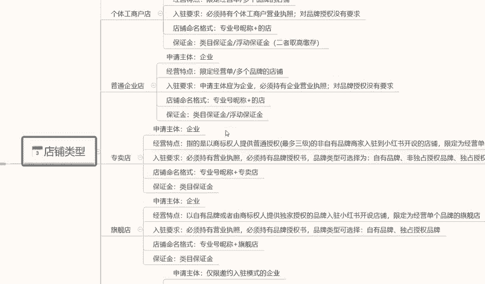

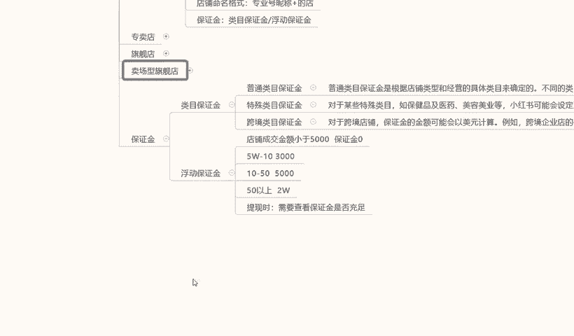

小红书的整体个人呃整体的一个店铺体系的话，就是第一个个体店。第二个呢是个体工商店户啊，第三个是普通的一个企业店。第四四个呢是专卖，第五个是旗舰啊，最后的话就是说一个是卖场型旗舰店。

他这个的话其实也就是品牌推销商已。那首先我们来了解一下啊，个人店，什么是个人店呢？申请主体呃，个人用户就是我们个人使用的就是。我们刚毕业也好，或者说是辞职工作，自己想做点小事情。

就跟我们平常在外面摆地摊一样啊，这就属于个体店。摆地摊的话，你也要注册一个营业执照，或者说是一个小小规模的一个示范营业啊，让银行给你开通卡，然后给你开通支付权限。这个个体店的话就类似于这种啊。

经营特点的话就是说经营。限定的经营零星的小额商品啊，比方说首饰啊、服装、包包啊、包包、手机壳呀啊等等这些啊。多个品牌就是杂货铺什么都可以卖，就看我们自己怎么去操作了啊。入住要求的话。

这个的话基本上是比较简单的，它没有什么特定的一个入住要求，就是我们个人有个身份证就行啊。呃，然后呢店铺命名的一个格式啊，专业号成名就是然后加我们的一个店名。就我们各体店，他自己会系统给我们匹配名称的。

这个的话不用管保证金的话，内幕保证金和浮动保证金。二者区。高这个怎么说呢？保证金这一块的话，我之前也给大家说过啊，就是说1000块钱的保证金，这个是个人店铺的一个数据准备。如果说是超过1000块钱的话。

那都是个体工商或者是说是旗舰店专卖店内容。而且它的这一个整个保证金的话，它的浮动都很明显的。待会的话最后一点我会给大家详细讲解一下它这个整个小红书的一个保证金内目，它是怎么划分等级的。好吧。

那下面呢我给大家讲一下什么是个体工商的一个店铺。个体工商店户的话，它和个人店铺不同呢，就是说嗯他的入住要求可能会稍微麻烦一点，需要我们有一个营业执照。啊，对品牌授权是没有需求的。

只要我们自己有营业执照就可以了，其他的基本上都是一样的。

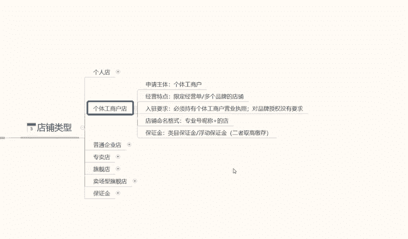

啊，他和个体店的话就是一个入住需求，多了一个营业执照。其他都没什么区别。普通企业店的话，他说和其他的话也是包括下面的一些店铺，它所有的一个区别就是在入住要求这一块啊，入住要求这一块。

它每一个店铺入住的一个要求是不同的。就看我们自己有没有这个资质去认证了。当然了，这个些所有店铺的一个入住要求越简单的，你的权重肯定也就越低啊，越复杂的你的权重也就越高。但是我们前面。

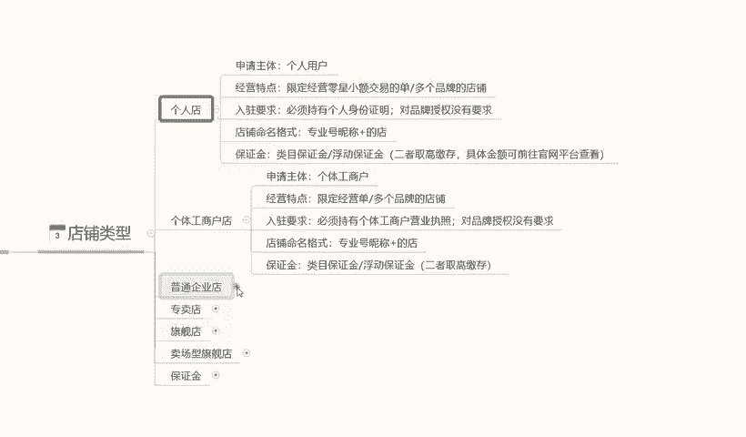

嗯，新人刚开始操作店铺的时候啊，没有必要弄那么高的要求，做个个人店啊，自己测试一下有没有这个潜力。这个产品在这个小红书系统里面好不好做就行啊，没有必要投入太多。普通企业店的话入驻要求的话。

就是说呃申请主体为企业，就是我也有自己的公司，或者我也要有自己的产品。我这个是有国家认证的啊，必须持有企业的营业执照就可以了啊，其他的话没什么需求。

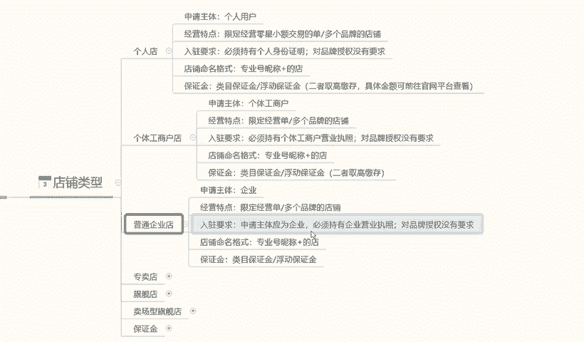

专卖的。

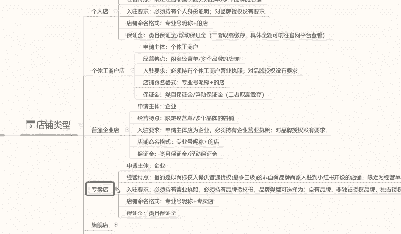

旗舰店。包括卖场型企业店啊，他只是说换了一个名称。专卖店的话入入要求的话就是营业执照啊，品牌的一个认可，自有品牌非独立品牌啊，就是你的品牌，我们自己。呃，像阿迪啊那种都是国有的很知名的这种品牌。

我们自己小企业也有自己的品牌，你只要在国家上面注册认认证认可就可以。这都是属于专卖店，就是我卖我自己的产品啊，把我的资质上上就可以了。旗舰店的话也是一样的。它只不过是啊必须持有营业执照。

必须持有品牌授权书。我自己没有品牌，但是我有别人品牌的一个授权书就行。卖场型专卖店的话，这个具体要求会如的话，可能根据平台的需求不同啊。它的内容也是不一样的，经营特点的话就是说零售的一个资质啊。

并且开设经营多个品牌的一个旗舰店。但是。基本上在小红书里面没有这种店铺啊，因为这种店铺的话，它。小红书的流量和它不对标啊，因为小红书的整体流量的话，它是以女性为主的。所以说它的产品的话不对标。

很多很多的那种大型的旗舰店的话，它不会在小红书上面去操作。所以说它会给了我们一个小卖家很有必要的一个生存空间。就是说它的竞争压力的话，没有其他其他平台那么大啊，就非常适合我们小卖家去操作一些。

小型的卖麦品。这个就是说呃所有店铺类型的一个区分内容。

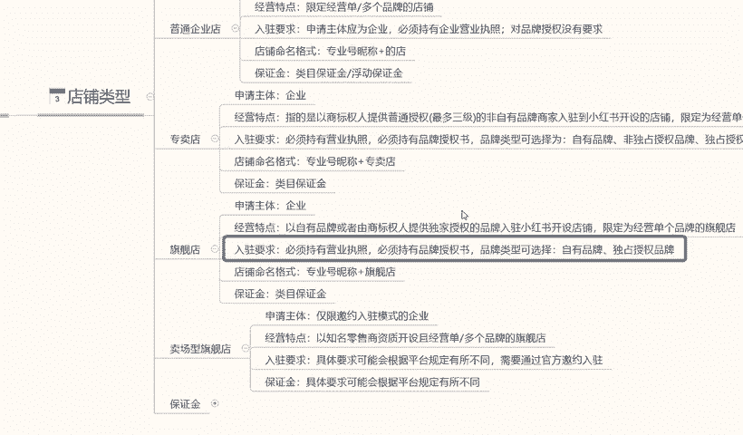

最后一个啊就是给大家讲解一下这些企业划分的一个保证金。因为它这个保证金的话。基础保证金是1000块钱，但是基础保证金保证金之后的话，它还有额外的一个保证金。这个保证金的话呃，在这里呢给大家讲解一下。

内部保证金、普通企业类目特殊类目和跨境内目。这里呢我给大家呃把它具体的内容嗯给大家打出来。大家可以看一下啊，我在这里呢就不过多解释了。

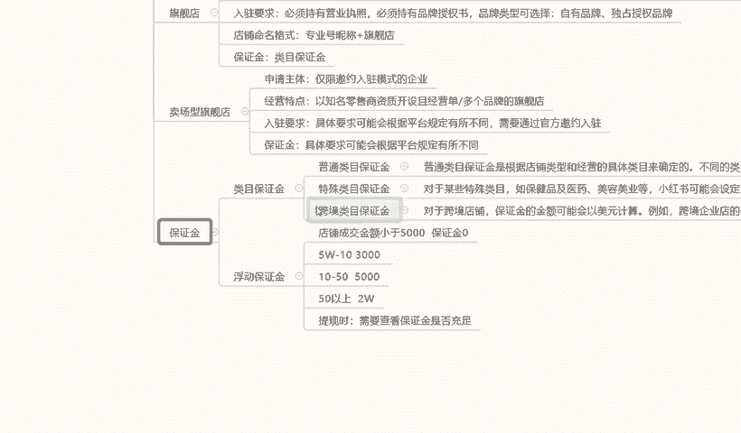

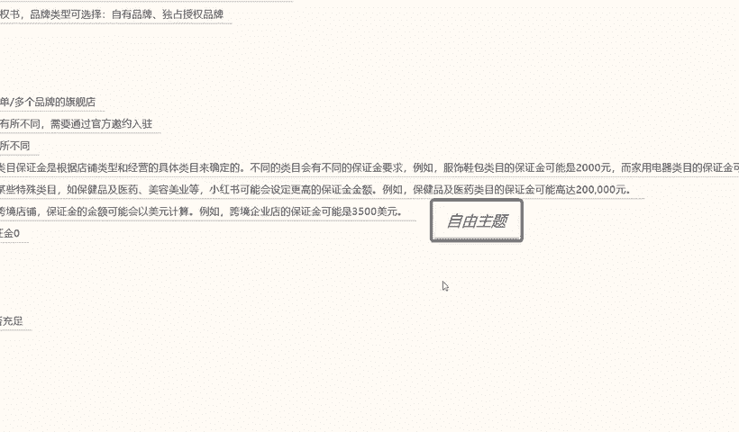

因为解释起来的话，其实大家搜资料的话，其实也能找到。只是说有些人的话嗯。

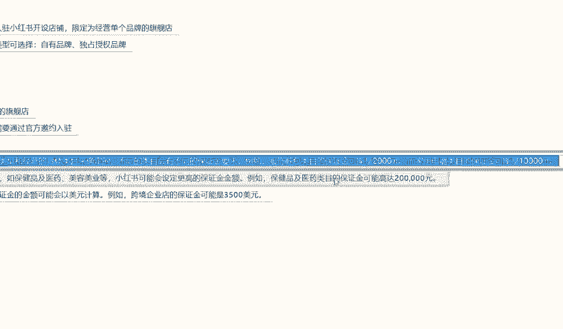

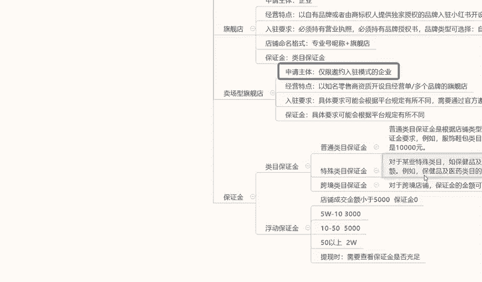

他懒得去说是吧？那我在这里呢就给大家。打出来大家看一下或者截图，对这方面感兴趣的话，可以去看一下。后面呢就是一个浮动保证金。内幕保证金的话，它基本上都是个固定的啊。

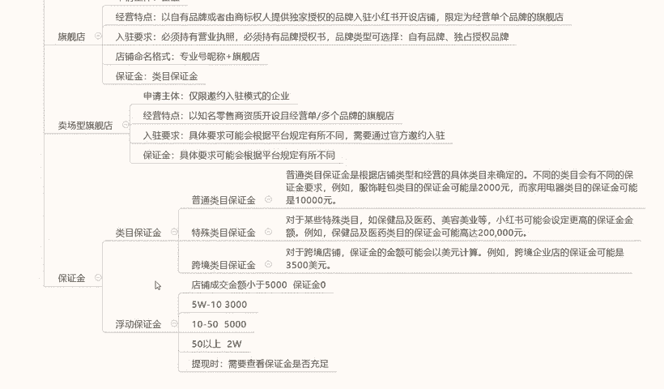

下面呢就是浮动保证金。这个的话就是说所有内容的话，浮动保证金是最重要的。大家一定要了解一下什么是浮动保证金。浮动保证金的话，它是根据我们店铺的一个成交金额来计算的啊。店铺成交金额小于5000。

就是我们店铺前面如果说没有交保证金或者是没有其他东西，成交金额在5000块钱左右的话，它的保证金是0。但是我们起始资金保证金是1000，不交这1000块钱的话，你这个成交金额小于5000块钱是没有用的。

我们交了这1000块钱的保证金以后的话，我们在5万以内的一个店铺，就是一个月的流动资金在5万以内的话都是没有问题的。超过5万的话就不行，5万到10万的一个保证金的话，是300010万到5。

10万到50万是5000，50万以上是2万。它的这个保证金都是浮动的啊，但是大致的一个需求的话都是在这个地方，就是我们店铺成交每个月的成交金额啊超过5万到10万。

我们需要3000万的保证金才能把这个店铺里面的钱提出来，不然提不出来。10万到50万是5000，50万以上是每个月是2万。啊，当然了，我们做到这个时候的话。

如果说每吨的每个月50万以上上的一个成交金额的话，2万块钱的保证金也无可厚非厚非，是吧？提现，然后呢，提现的时候，他会查证我们店铺。就是保证金账户里面的一个资金是否充足。如果说资金不充足的话。

我们的资金一旦超过了5万，就是我交了000块钱保证金，我我资成交资金一旦超过5万，那我一毛钱都提不出来的。啊，所以说大家一定要注意啊，不有时候提提现这个东西的话。

一定要注意自己查看自己的保证金是否充足啊。就是说大家很多时候的话做东西就是往这些点，觉得自己的钱找不出来小红书坑我之类啊，其实不会，它只是说它的一个类目的一个浮动保证金在这个地方啊。

大家把这个这几个点注意好就可以了。

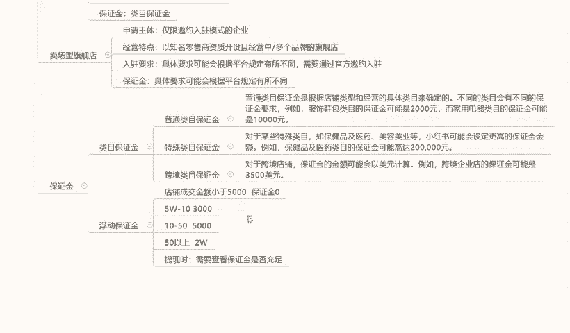

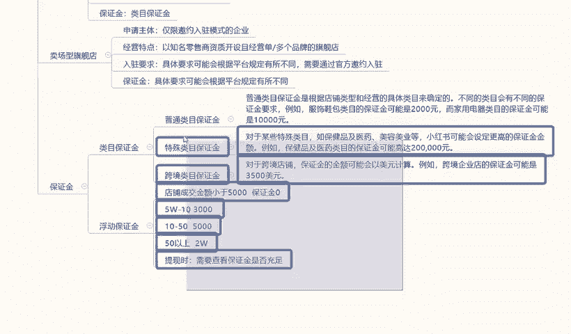

这个呢就是我们这节课的一个内容啊，给大家讲解了一下店铺的一个类型和我们店铺类型里面对应的资金保证金和我们的一个替换方式，好吧。那么下一个节课呢给大家讲解一下。选品与会员小红书上面我们做什么样的产品。

选什么样的会员怎么去操作啊？

