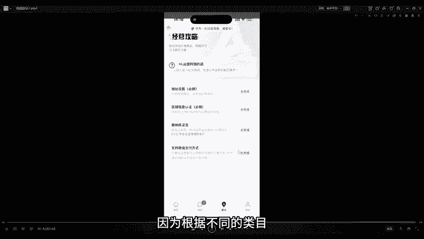
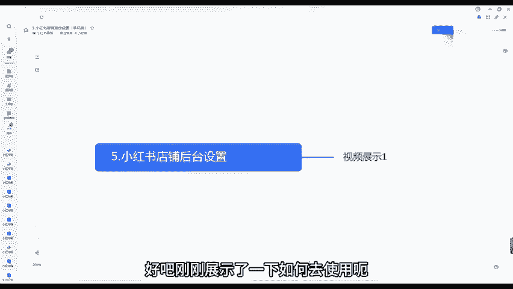

# 140分钟学会小红书运营-原来打造爆款笔记这么简单！！！小白零基础入门必学的小红书笔记公式拆解，最简单的起号教程，快来学！！！ - P50：05.小红书后台的基础操作（手机端） - 有点像大哥Seven - BV1pY2vYcEf2

🎼大家好，今天来跟大家来讲一讲小红书店铺后台。我们如何去通过手机端设置一些内容的。好吧，然后我们会以视频的形式跟大家展示一下。首先呃我们打开的系统是签翻系统来给大家看一下小红书签翻来大家能看得见吗？

小红书签翻的系统，直接我们到应用商店里面去搜索小红书签翻就行了。这个是我们后台呃基本上会操作的。好吧，就直接到应用商店里面去搜搜索就可以了。我们打开之后大家可以看到，我们打开之后，我们正常是这个页面。

这是我们创的一个新店，基本上没有什么操作的。这边有一个消息，我们点击消息，点击消息里面这里面就是我们客服接待的一些通知。如果说有人问我们店铺的一些问题了，我们就可以在里面去回复它，在里面去回复的。

这是客服接待的一些通知啊，都是可以在里面看到的，以及我们配置客服啊等等。这里面都可以看到。看到吗？这是店铺的一些消息，一些通知，一些比如说你违规的通知等等，这里面都会有。好吧，然后我们打开我们的首页。

这里面有个区初始化，我们这边可以去填写一些信息，以及我们这边有个全部工具，我们这边可以发布作品啊、笔记管理啊、电脑端啊等等等等，这边都可以。我们点击。全部工具这里面可以呃给大家看一下。

点击全部工具这边有发布作品，全部全部发布商品，我们可以发布新的商品，我们可以管理全部的商品，全部的订单对吧？售后的订单数据中心呃，商品笔记啊等等等等。这里面都可以以及我们发布商品的类目啊，对吧？

品牌类目啊，店铺的装修群管理，呃，我们打开这边有个成长成长这边正常情况下，我们先要去把这些给它完成，对吧？才能继续后面的操作地址对吧？我们这边有个地址，对填写我们的发货地址。

这是我们这是我们开店铺的第一操作，我们需要填写我们地址，好吧，我们这点击去完成，在这个地方也是可以去填写地址了，看到了吗？地址呢，我们这边可以这个时候我已经填好了，对吧？

我们正常情况下可以去填填具体地址怎么填的，这边可以看到我们联系人随便写我们自己就可以了。地址，中国大陆选择了一改在的地区详细地址呢其实可以随便填。因为我们是做一键代发的嘛。我们这个地址是是可以随便填的。

好吧，我们填写自己的手机号码，你就给买买家留言，一定要之前有这边是可以填写联系客服的，但是现在填联系联系不了了。我们给面一定要联系客服给地址，好吧，这是就是影响到我们一些退货的一些问题。

如果说我们这边填写联系客服的话，他这边平台是不给通过的，好吧，我们要在这个地方来填写地址，好吧，然后我们填写完成之后，这边可以填写我们的物流物流板块，对吧？我物流板块填写我们的名称继续去填添加就行了。

对吧？我们添加呃，这边是可以添加我们的运费版块的，你可以选择。如果说大家开过抖店的，这些应该都明白，对吧？或者说你们不明白的话，我们可以添加运费模板，就比如说你是新疆西藏这些不配送的，对吧？

我们可以直接选择不配送。如果说需要付费的，对吧？买家承担邮费的，我们也可以去这边去选择非偏远地区的，或者说全国包邮的这些模板，我们可以他本身它会有系统默认的，但是我们正常情况下就选择这个模板就行了。

不是全国包邮嘛。因为这些地方我们都需要付邮费的，好吧，这些邮费。😊，也是比较高的。你们就这个是关于地址的选择，我们再看这边发布作品，看到了吧？这个就是大家可能呃这边有一个优惠券。

可以设置优惠券的来给大家具体来跳一下，看一下这边有个营销，这边有个优惠券活动报名，对吧？点击进去，我们可以创建自己的优惠券，对吧？比如说你创建。店铺通用的店铺通用的优惠券，指定商品的优惠券。

店铺的新人券对吧？这些都是可以的。我接下来也会跟大家具体来讲一讲怎么去操作的全网自动推广的对吧？正在生效的已失效的等等，这些都需要大家去了解的这边填完之后呢，地址填完之后，店铺的认证信息，对吧？

我们需要去填写你是个人店啊什么店填写，然后缴纳保证金。如果说大家想长期在呃我们这个平台做的话，我建议大家还是需要去把保证金交了，我们这边一定要注意，一定要去把这个微信支付给它打开，以及我们的支付宝支付。

按照它上面的流程，对吧？你填写自己的身份证号码，以银行卡，只要在这里面操作，我们就可以人家就可以通过微信支付，可以通过支付宝支付了。好吧，我们补交补交我们的店铺的保证金就可以了。因为根据不同类目。

所以说它保证金也不一样。那这个就是我们今天的这个小红书店铺后台手机端的一些操作，大家多去琢磨琢磨多去摸索摸索，基本上这个是。

没什么太大难度的。好吧，刚刚展示了一下如何去使用呃，如何去设置地址啊，如何使用优惠券。好吧，那我们今天课程就到这边。

