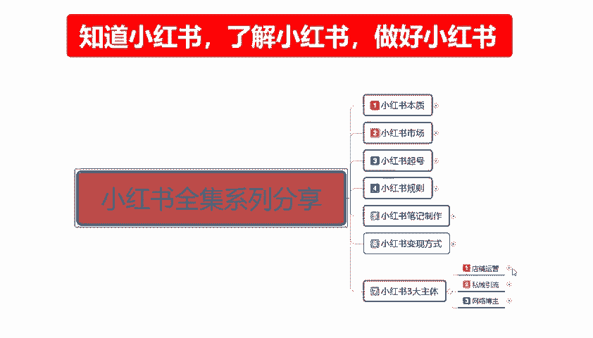
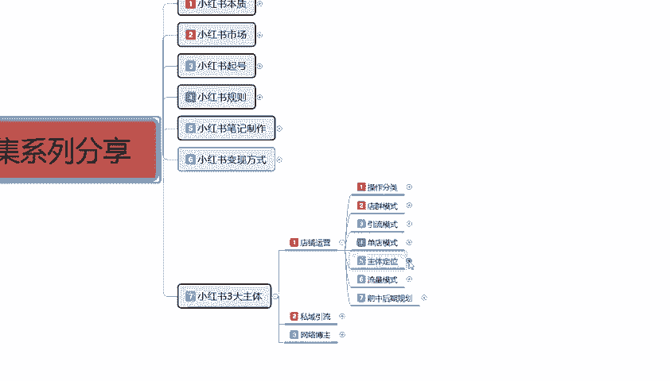
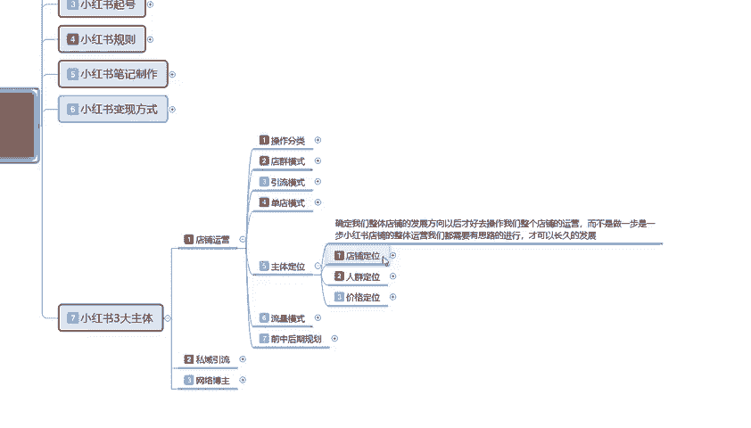
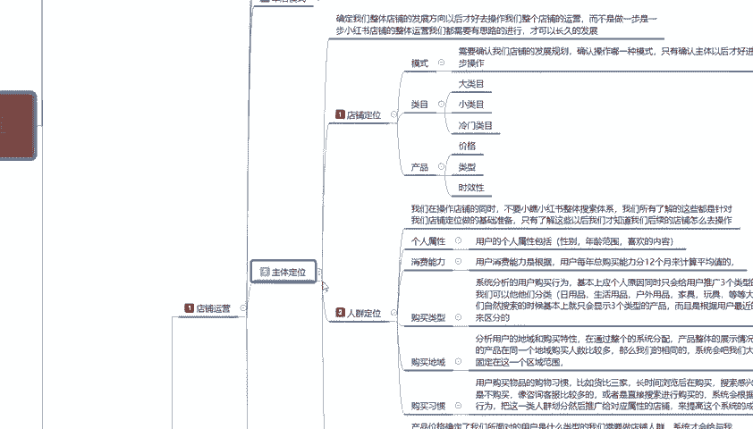
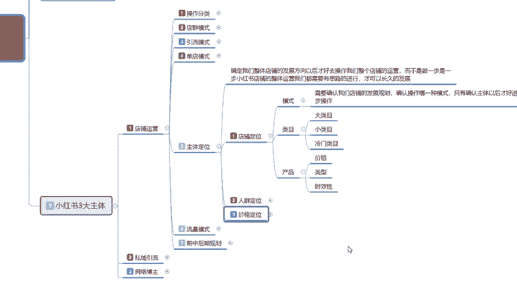
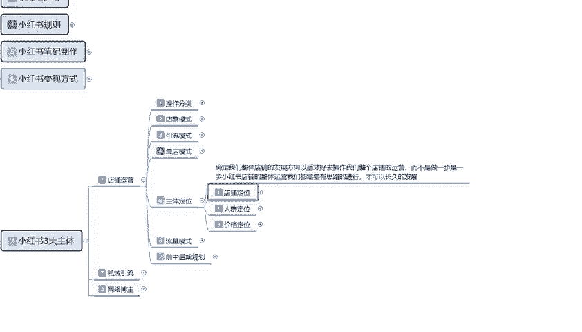

# 140分钟学会小红书运营-原来打造爆款笔记这么简单！！！小白零基础入门必学的小红书笔记公式拆解，最简单的起号教程，快来学！！！ - P50：38、新手小红书运营-小红书主体定位（1） - 红书教程1 - BV1o629YMEjv

大家好，今天给大家分享的是小红书全集系列最后一大课时，小红书的一个三大主体，店铺运营的一个内容。这节课呢给大家讲的是我们。

小红书的一个主体定位。什么叫主体定位呢？这之前呢已经给大家讲解了小红书它的一个呃三个店铺的一个模式，也就是我们运营的一个方式。这一节的话就是给大家讲一下主体定位。这个定位的话，它是以单电模式为主的啊。

因为引流模式和电锤模式啊，他们其实相对来说都是比较简单的，只是单电模式的话，它后续的一些操作啊。会复杂一点，我们需要学习的内容多一点。引流模式的话，只要说是我们的一个产品。

产品和个人的一个因素不存在太大差异的话，基本上都可以做。电池模式的话，就看我们自己有多少资本了。但是单店模式的话，它就比较适合新手去做一下啊。首先确定我们整体店铺的一个呢是发展方向啊。

就说我们做单店模式的话，你就要先给自己定好发展的一个方向。最后的话才好去操作我们整个店铺的一个运营。而不是说做一步是一步。怎么说呢？小红书店铺整体的运营的话，我们都是要有思路进行才可长久的一个发展的。

就是你。前期新手来学可以啊来做也行，走一步做一步不是不行，只是说你。怎么说呢？你没有整体个规划思路，后续的话，你这个店铺你做不到，你坚持不了多长时间，知道吧？你在网络运营这一块的话，你坚持不了多长时间。

说实话你的前景就不是很可观啊。主体定位这个方面的话，我其实给大家分了三个三个大点啊，第一个就是店铺定位，第二个是人群定位，第三个是价格定位。这三个定定位点数它是不一样的啊，它所包含的内容也不一样。

它整体的一个内容的话其实不少呃，我们先从整个店铺的一个店铺定位开始。

店铺定位是什么呢？就是说呃确认我们店铺的一个模式，需要我们确认店铺发展的一个规划，确认操作哪一种模式，确认主体以后才好进行下一步的一个操作。你比方说啊类目先选对吧？类目里面的话。

大类幕小类目冷门冷门类幕。类目里面大类目是什么意思呢？就是说。广泛应用的消耗品啊。衣食住行。这个属于大类目，他因为他搜索的一个人群是非常多的。小类目是什么呢？装饰品。嗯。特产。一个装饰品，一个特产。

还有其他的一些就是搜索人数比较少的这种这个叫小类目。冷门类幕类就基本上就是除了特定人群，他不会去搜的。你比方说定制类的一个产品啊，花画、美国等等这些啊，它属于冷门类幕，我们要做的话，说实话。

你首先要确认你自己到底适合去做什么产品。产品的类幕相关的话，就根据我们后面店铺的一个走向，它是不一样的啊。冷门类幕稍微。怎么说呢？就是好做一点，但是他。呃，需求比较高，因为冷门类目的话。

说实话你没有特定的一个呃产品去做冷门类目的话，你的一个属性不好拉。冷门类目，而且你的一个广泛型人群的话是特别少的，你需要做大大的一个推广。因为他他就是和其他的大类目和小类目反着来的，知道吧？

大类目小类目的话，就是我们只要把人群做精准了。我们的数据是准的，往上面提就行。小类目小类目也是一样。但冷门类目不行。冷门类目的话，你本来人群就小，你再做精准人群的话，基本上就没人看了。

大联幕可能有10万，你可能只有50500，可能还不到。啊，这就是冷门类幕的一个选项。小类幕和大类幕区别的话就是。怎么说呢？你做大类目，你就是前期我们做的话呃。会比较容易一点，做小类幕的话。

你前期可能难一点，后期可能会好一点。啊，它就是三个区别。大类目整体来说的话就是呃服装、化妆品。你因为你在小红书的话，你和其他的一个，你比方说呃拼多多也好，淘宝也好，京东也好，他们这种类目的话。

他们都已经固固定形式了。但是小红书上面的话，说实话它的大类目无非三大点啊。女士服装。化妆品。视频就这三个大类目。你其他的也可以归为大类目，但是它的搜索我热度的话绝对没有这三个组类目的一个高。小类目的话。

你再往其他地方去扩展就行啊，他们基本上都是差不多。我们确认好自己的一个产品内幕以后啊，下一步我们要做的是什么？做产品。第一个是选内幕，内幕选完以后的话是选产品产品这个里面有一个价格类型和一个时效性。

这三个点，如果说我们把它选择不好的话，说实话呃，光这几个。这几个点如果说分开给大家讲的话，它基本上就是每一个点它都是一个类型的一个讲解。因为内容实在是太多了。

我这边的话就没办法给大家啊这一期的课程里面没办法给大家进行一个详细的分解。如果说大家想了解的话，嗯，等我出下一期的课程，再给大家详细讲解一下这个店铺定位里面的所有的一个内目情况啊。

我在这里呢只是给大家大概的介绍一下。产品里面就是我们先选完类目，内幕选完以后选产品。为什么？因为你选的类目的话只是一个大概的。你比方说女士的服装连衣裙，连衣裙里面有长连衣裙，短连衣裙，对吧？

露肩连衣裙等等，这种它都是属于小大类目里面的小类目，你要看看自己怎么去划分的。内幕选完以后的话，就是选价格产品的一个价格的话，说实在的啊，你根据人群的一个年龄去划分的。

你如果说不根据人群年龄去划分我们整体的一个产品价格的话，你不好去做的，知道吧？你首先你得多观察一下同行的一个类目，他们的一个产品价格范围在什么怎么什么样的一个范围。你所找产品的一个价格范围。

你能达到多少的一个范围。然后你想获得多少的一个利润，再去定价的。然后类型的话就是刚刚我跟大家说的。大类目里面的小类目，他选某一特定的类型去操作时效性。这个里面的话就要稍微注意一下的。

就是呃产品里面的一个时效性。为什么说要注意产品里面的一个时效性呢？就是因为你所选的一个产品的话，你。应季的产品一定要做应季的产品，小红书和其他的不一样，它是靠笔记来推广的。别的是别的地方你去。

拿淘宝做比方吧，淘宝做比方，它的一个产品时效性的话，可能是在3个月以后。你比方说现在是马上进入夏天，或者是已经进入夏天了。那我现在卖夏季产品和秋季产品。应该说是入秋的一个产品，为什么？因为小淘宝的话。

我们去做产品的话，它有一个提前性，你最少也要提前一个月开始布置整个店铺的一个方向。一个月以后，你的店铺数据才能做起来。或者说是一个半月两个月。有的你我们以前做淘宝的话，它的一个大的类目数据。

我们最好都是提前3个月左右就要开始布局了。因为你不布局的话，你后期去后期去抢市场抢不到。但是小红书的话和这个。其他的平台不一样啊，因为它本身就是靠笔记来做引流的。你的产品必须要有时效性。

你没有时效性的话，你的一个笔记和你的产品不匹配和你所宣传的内容不匹配的话，我们是没办法去。售卖的懂意思吧？就是你在小红书上面，你开店了以后，你的产品和季节不匹，会让你卖不了。

也就是说你去只需要提前半个月准备。你比方说马上进入夏季了，我现在开始买短袖短裤短鞋，对吧？啊，卖袜子，卖什卖什么都都是一样的。你要提前半个月到一个月入场。

这半个月到一个月就是我们前期店铺运营所需要花的费的一个时间。你要把店铺的基础数据全部做起来。所以说我们在选产品的时候，一定要选时效性的啊，和本季节相关的一个产品。你要选你比方说现在是夏天。

你要去卖冬天的冬装，你在小红书上面做不了。你要卖冬装的时候，你要再提前一个半月，到一个月，你去布置小红书建一个新号再去卖就可以。但是你不能现在去你现在去的话，你一天都卖不出去，别人还把你当傻子。

因为小红书它本来就是一个时现时效性的一个平台啊。它的季节性是非常重要的，我们只能卖当季。的一个产品，而且一个产品的一个有效期的话，说实话只有3个月到6个月。整体来说的话。

基本上就是呃大众类的可能会时间长一点。小众类的话就是就那一段时间卖完卖完的话，你这个店的话就只能等到明天再继续操作。而且这个店铺的一个数据量的话，你暂时不用维护它和其他的呃淘宝拼多多。

你店铺数据这个季节卖完了，你下个季节没没有东西卖了以后，你还没办法去更换啊，小红书的数据的话，你不更换的话，数据不会掉太多，你只要在第二年什么时候你通知好了更新。然后的话把小红书的一个整体数据。

笔记维护一下就行，他成不成交就无所谓了。😡，这个就是小红书的一个整体定位。首先确认内幕，内幕确认以后的话，确认产品产品的产品确认以后的话，在里面选择价格类型和时效型，一定要应记。你不应急的话。

你这个产品不好做的啊，这个就是小红书店铺的一个定位。好吧，那这一节分享呢就给大家讲到这儿。下一节呢给大家讲解一下小红书的一个人群定位。

