# 140分钟学会小红书运营-原来打造爆款笔记这么简单！！！小白零基础入门必学的小红书笔记公式拆解，最简单的起号教程，快来学！！！ - P51：06.小红书后台的基础操作（电脑端） - 有点像大哥Seven - BV1pY2vYcEf2

大家好，今天来跟大家来讲一讲我们的第六堂课。小红书后台的一些技术操作。呃，我们如何通过电脑端来操作的。好吧，我们从几个几个方面来跟大家讲。第一个保证金方面开通方式。

运费保的设置以及地址设置这几个方面都会跟大家具体来聊一聊。先来讲一下保证金保证金的话，其实我前面也跟大家讲了，我们前期的话是可以不用缴纳的个人店的保证金在1000块钱左右呃，在1000块钱左右。

根据不同类目啊，它的保证金不同呃，我们来看一下，这个是我们的小红书签翻系统，我们打开小红书签翻系统，我们搜索小红书签翻这里面有个资金看到了吗？打开我们的首页，这有个资金资金这边有一个保店铺保证金管理。

店铺保证金，我们这边可以充值我们的保证金呃，待待补缴的。这是因为我选的类目比较多，选择了不同类目，它保证金不一样。我们只需要选择自己类目，然后缴纳相应的保证金就可以了。好吧，这边有我们缴纳已经缴。

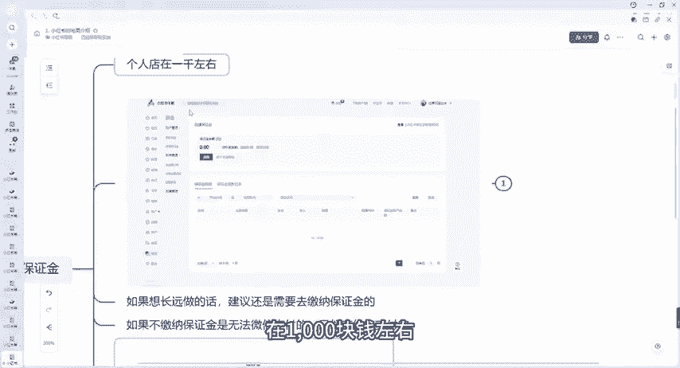

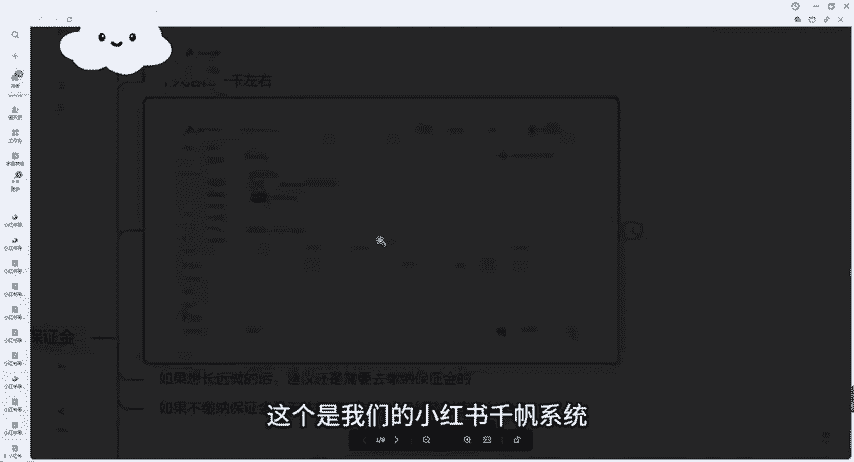

完了或者说保证金退款这个保证金大家放心跟抖音其他平台也一样。它的保证金。如果说咱们后期如果这个店铺不做了，它这个不管多少保证金，它是可以退的。但是这个保证金，他也是会扣款的。

他是会为了保证咱们店铺的一些客户他们的一些权益。就比如说呃答应人家这个退款了，但是我们实际上没有退款的，以及实际上没有去操作一些，他会扣取的。但是正常我们只要在不违规的情况下，他的保证金是不会扣的。

以及不会扣太多的，好吧，那我们也前期也跟大家讲了，前期是可以不用缴纳的。但是我们后期如果说想要店铺做大的话，或者说我们想要开通一些其他的一些方式支付宝方式的话，想想要开通微信的话，那我们必须要缴纳对吧？

如果说想要长远做的话，建议还是要去缴纳这个保证金的，就在我们这个入口去缴纳就可以了。呃，如果不缴纳的话，保证金是无法微信支付的。现在有很多年轻人都是使用微信支付，所以说呃你想要。

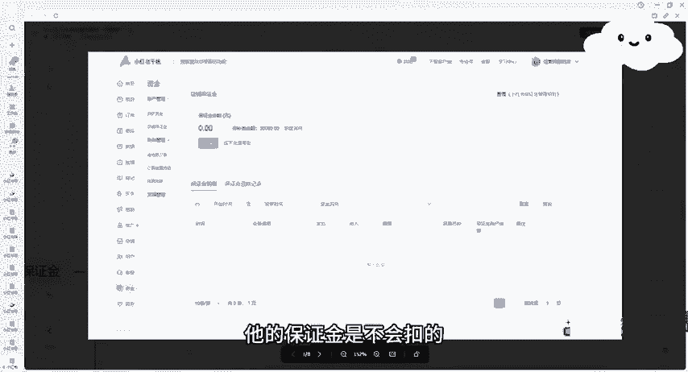

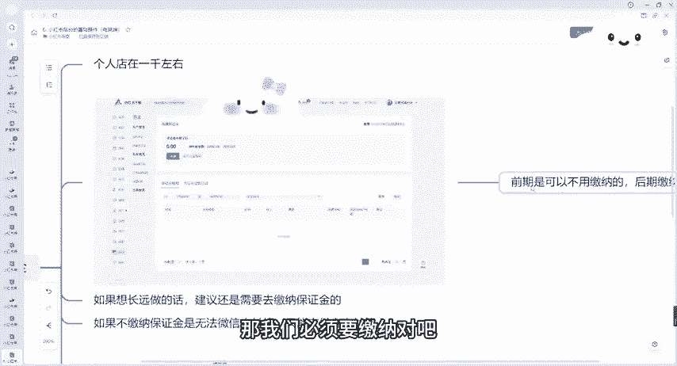

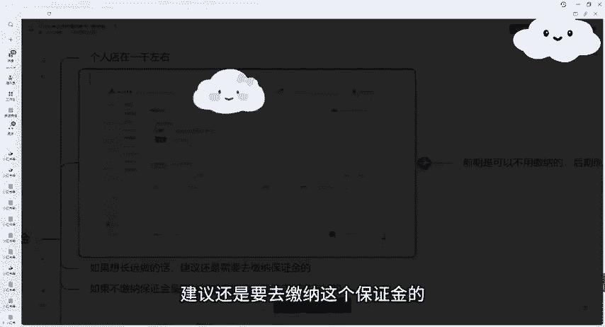

开通这个微信支付的入口的话，我建议大家还是需要去缴纳一下。缴纳完之后，支付宝跟这信都可以支付了。这个是我们的一些保证金。大家可以看到，如果说我们个体店的话，基本上在1000块钱左右，对吧？

当然有很多类目，比如说二奢啊这些全新奢侈品啊、珠宝玉石呀、家用电器啊，这些是我们个体店无法无法开通的啊，个人店无法开通的。我们个体店可以开通，你可以去开通个体店，我们正常类目的话。

你看个人店的个体店的话，也在1000块钱左右。企业店的话也就在2000块钱到1万块钱，2万块钱不等。好吧，呃，大部分的个人个人店的保证金以及个体店的保证金都在1000块钱左右。呃，一些特殊的类目除外。

我刚刚也跟大家展示了，对吧？你如果说想要了解你自己的店铺的保证金，你直接去选择相应的类目就可以了。我们选择相应的类目，可以这边可以查询一下，对吧？里面都是有的，对吧？以及我们的开通方式。

开通我们的支付方式，刚才讲了一个微信支付，一个支付宝支付，那我们在哪在哪设置呢，其实也是一样大家放大看一下，我们打开我们的首页之后，这边有个资金，对吧？

也是刚刚的资金有个贷贷款关资金这边有个支付宝是支付宝以及微信，对吧？我们去开通就可以了，对吧？开通方式其实很简单，好吧，支付宝的话，微信的话。

支付宝当天我们就可以直接去注册了微信需要去微信的话是第二天他才能去设置的，好吧，第二天我们需要去缴纳保证金，提现金额是到法人的账户里面去，我们注册这个是小店支注注这个小店的身份证的法人里面去。

它的微信以及支付宝都是我们去按照它的要求里面去进行绑定就行了。只要填。

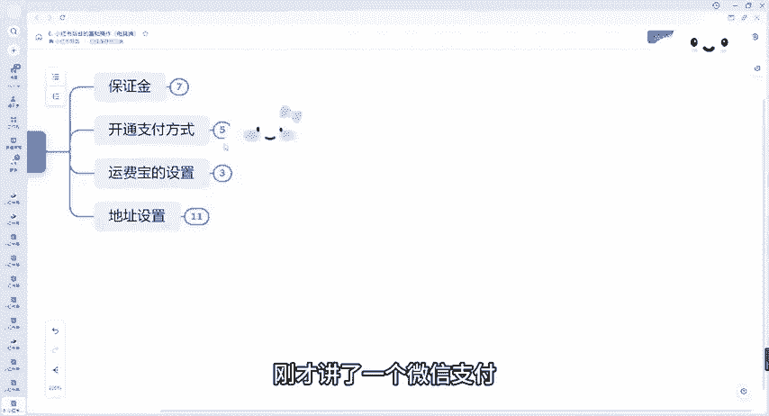

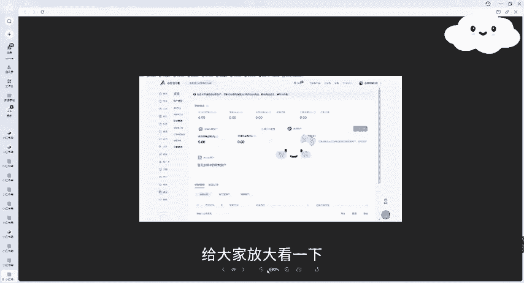

身份证以及呃如果说你开各店的话，需要有营业执照。好吧，这是关于呃开通支付方式的两种方式，大家去开通一下就可以了。运费宝设置运费宝呢推荐大家开通运费宝是什么的。运费宝其实就是呃防止别人就退款啊，退货退款。

我们这个运费它能有一个保障，也是后期别人就是人家7天无理由退货嘛，这种差不多跟抖音的7天无理由退货淘宝填报的一样，我们可以开通一下别人退款的话，就不需要去考虑到一个运费的原因。

推荐开通可能会影响到转化率的问题。来给大家看一下呃，开通全店运费宝服务来放大家给大家看一下。开通全店运费宝服务消费的退货，退换货成功后系统自动补贴，打消下单顾虑，对吧？提升订单的转化率，降低纠纷率。

对吧？这个也是好的，对吧？大家点击开通就可以了，好吧，这是这个也是在售后里面的，售后里面这边有个运费宝好吧，地址设置的话，前面跟大家讲讲过了那个叫手机手机的。

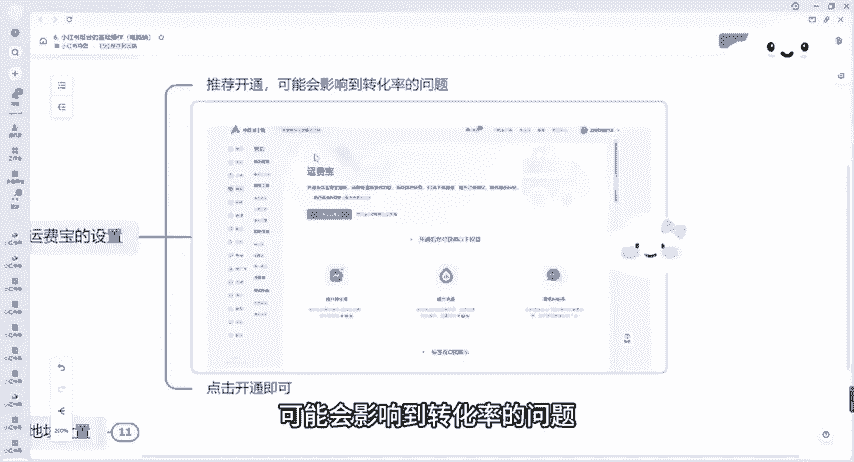

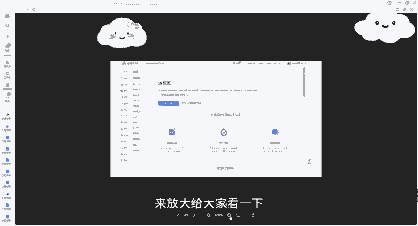

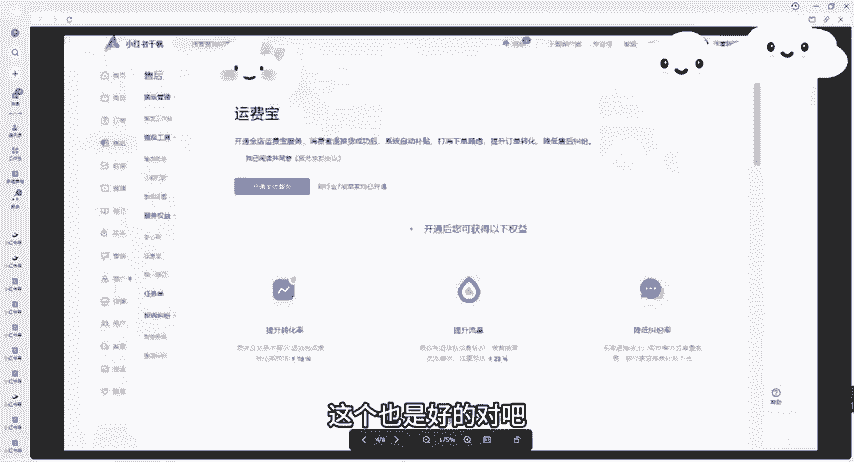

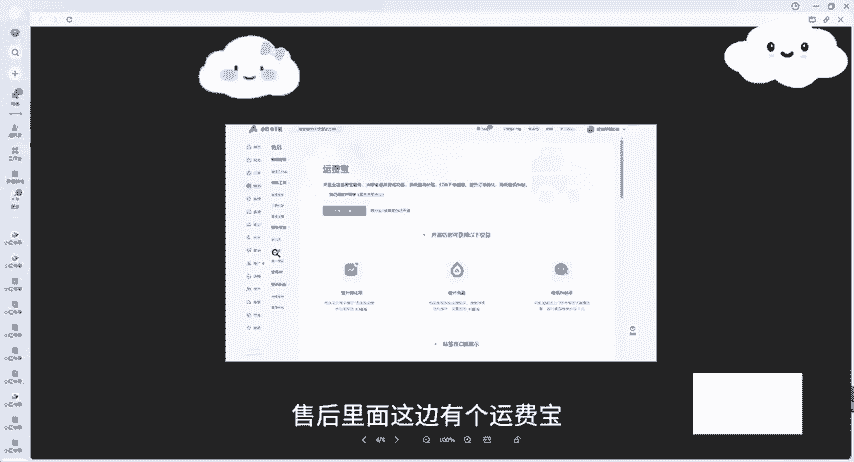

手机端的对吧？7天无理由退货自动可以自动同意退款的对吧？退货地址的话，最好填写一些偏远地区，后面加上联系客服，对吧？正确正确的地址，对吧？我们刚刚跟大家讲了，对吧？我们一定要去添加联系客服啊。

因为我们这个是一件代发的嘛，地址也在订单物流工具放大给大家看一下订单物流工具，这里面有个新建地址，对吧？物流板块运费板块，我前面一节课手机端也讲的很清楚了，我们设计设置相应的地址，对吧？

我们地址填写填写我们这个相应的地址就行了，我们可以填写一个新疆的对吧？呃，这边的话物流模块对吧？如果说是无货源的同步的商家，如果说是有货源的，正常就填写就可以了，对吧？我们这边可以填写我们的运费版块。

如果说是无货源的商家同步商家就可以了。如果说有货源的，我们正常去填写好吧，这个就是简单的跟大家讲一讲我们的一些地址的设置，运费宝的设置，好吧，然后这个就是今天的课程，好吧，那我们今天的课程就到这边。

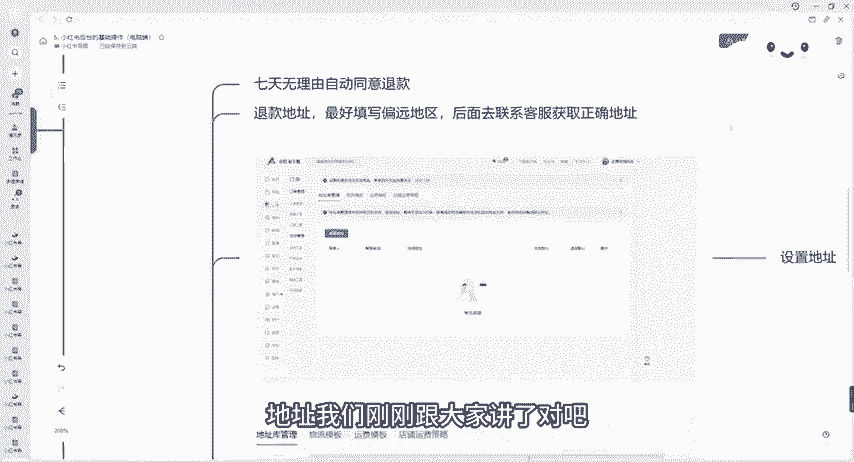

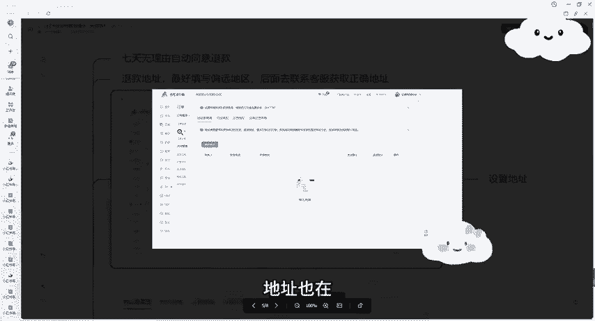

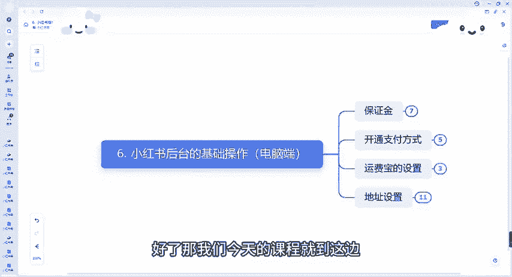