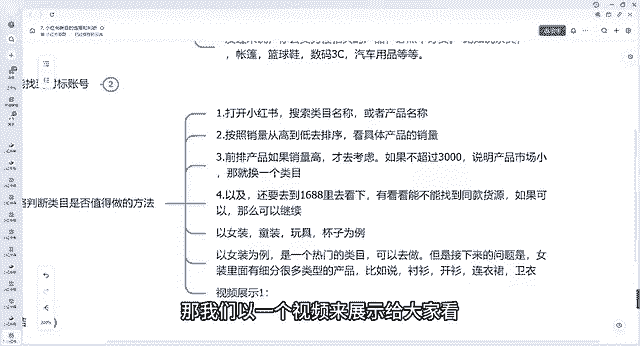
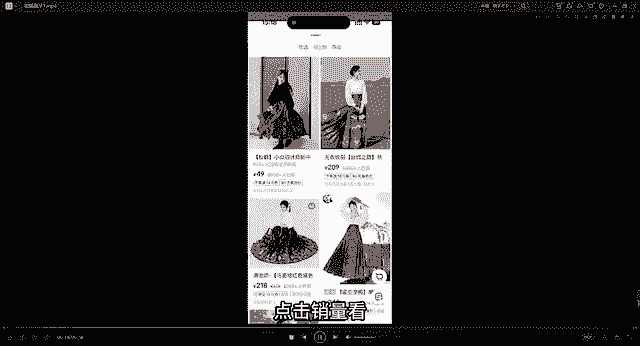
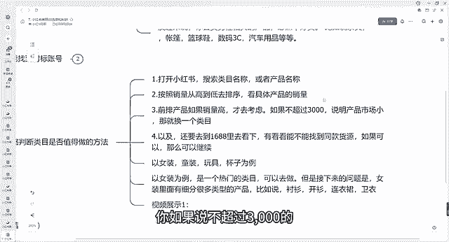
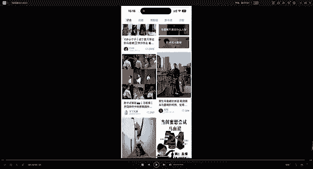
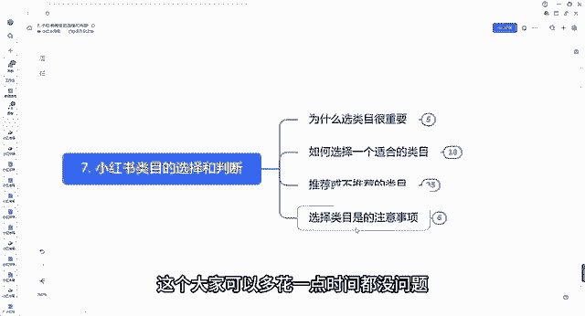

# 140分钟学会小红书运营-原来打造爆款笔记这么简单！！！小白零基础入门必学的小红书笔记公式拆解，最简单的起号教程，快来学！！！ - P52：07.小红书类目的选择和判断 - 有点像大哥Seven - BV1pY2vYcEf2

大家好，今天跟大家来呃聊一聊我们第七节课小红书的类目，我们如何去选择和判断这个类目到底能不能做。好吧，我们从几个方面来跟大家讲，首先呃关于为什么我们跟大家讲选类目其实是非常重要的一件事情。

以及我们如何去挑选到一个适合我们自己的类目啊，或者说有哪些推荐不推荐的类目给大家展示一下，以及我们选类目的需要一些注意事项。是吧？呃，首先为什么我们要选类目啊，为什么我们说了类目确实很重要。

首先呃我再问一下大家，你认为做一件事情其实是什么最重要，是方向重要呢，还是努力更重要，有人说方向有人说努力，方向是最重要的。你如果说方向错了，后面你再努力，可能后面都是白费的，对吧？

选择其实在小红书在我们电商这个行业其实是大于努力的，你如果说选择错了，你这个类目选择错了，或者说你这个行业选择错了，那你想继续再付出再多努力，你也不一定能做出来，有人家方向做的好的来做出来效果好，对吧？

为什么当下要去做小红书，而不是淘宝抖音同理，我们就选择小红书这个方向呀，方向最重要，需要我们呃沿着大的趋势去顺势而为，而不是逆水行舟。你说我们现在去呃去干淘宝去看天猫好做嘛，非常非常不好做。

因为现在这个就不是方向，我们可能付出比现在做小红书三倍5倍的努力也不一定有做小红书还效果好，对不对？就是说方向很重要，要不然努力来费，好吧，选类目就是一次选方向的机会，我们选择一个好的方向，对吧？

那我们后面可能就是非常的顺畅，要不然后面可能如履薄云。那我们如何选择一个合适的类目呢，我们从几个方面，首先呃受众人群和平台的主流人群要相符合了，我们要知道小红书他们目前的人群群体是哪些人？而我们。

做的这个类目是哪些符合哪些群体，对吧？小红书他目前的人群群体啊，年龄在18到40岁的年轻女性比较多。对吧你可以发现你周围的很多女性基本上都在玩小红书，而男性真正玩小红书的，其实很少很少。

所以说要要要求卖给这个人群，他们喜欢的东西投其所好才行，对吧？你不能说我去卖给卖的比较多的，都是男性的，对吧？确实你说可以做，但是卖给男性的并没有女性那么好卖，这个就是平台，对吧？为男性比较好呃。

比较好卖的，有哪些抖音哎还可以，对吧？但是小红书来说，就是没有那么好做，对吧？反过来你要去卖男性产品的话，必然不是很好卖，对吧？比如说茶具鱼竿帐篷、篮球鞋、数码3C对吧？汽车用品等等，这些你去卖。

你说你能有像女性卖的那些产品，比如说衣服呀、母婴用品啊，宠物用品啊，对吧？水果啊、吃的呀，这些对吧？肯定是没有他们比较好卖的，所以说建议大家如果做的话，建议以这个目标人群为主，对吧？

那我们呃能找到对标账号，对吧？第一个A类目不能做B类目能不能做，取决于有没有同行正在做，对吧？我们要了解的是这个类目啊，目前有没有同行正在做，你去小红书里面找了一圈。

你发现没有人做那这个类目我建议你不要去做，不要去找到这种你说这个冷门类目，对吧？人家做的很好了，且具备这个条件了，对吧？你也能想办法做得到，那么就能做对吧？

比如说货源笔记制作这些人家从来就没有人做过这个类目的，你再去做，那你那你你你就先不要把你当成这种能人来做好吧，一些冷门的类目也可以做，对吧？冷门的类目就是但是不是偏的啊，能不能做，就看有没有其他人做。

比如说你是说是一个冷门的，但是已经有人做过了，已经有人做起来对吧？但是做人没有想象那么做，那我跟你讲，这个也是可以做的对吧？如果说从来没有人做出来，那你也不要去做，因为你肯定不是那个天选之子，好吧。

这个是我们通过对标账号的形式来。找一找这个类目到底能不能做好吧。第三个呃，粗略的判断类目是否值得做的方法来给大家看一下。首先打第一步，我们打开小红书，搜索一下类目的名称或者产品的名称，比如说你是做什么。

你说女装的，我们搜索到女装，它那一个小的类目啊，比如说它是女装衬衫，女装开衫、连衣裙卫衣等等，按照销量从高往低去排序，看看产品它的销量对吧？前排产品，如果销量高才去考虑。如果说不超过3000的是吧？

说明产品的市场比较小，那咱们就换一个类目啊，以及我还要去1688里面看看能不能找到同款的货源，如果说可以，那咱们继续做，对吧？因为我们是做一件代发，并不是作有自己货源的。

得去看看他们平台有没有他没有我们做的再好，我们平台做的再好，但是东西没有地方没有地方给我们去呃去发给人家，那肯定也不行。我们可以以女装童装玩具杯子为例等等，我们都可以去搜索以女装为例。

是一个热门的类目可以去做。但接下来问题是。女装里面要细分很多类目，比如说呃衬衫、开衫、连衣裙、卫衣等等。那我们以一个视频来展示给大家看。好的，呃，我们打开我们的小红书去搜索搜索我们想做的类目啊。

就比如说我们以马马面裙为例，比较火的马面裙啊，我们搜索马面裙110那116万家的笔记，说明这个确实能做。而且60万家的商品啊，说明这个这么多人做，过呢咱们肯定是有能做的，对不对。

马美群，你看一下，这个是他的用户6000多对吧？6000多的点赞，以及我们点开他的这边有个商品，点开商品，我们看一下它的销量，我们一定要先啊点击销量看8000多人购买，4000多人购买。

我刚刚这边讲到了，你如果说不超过3000的，说明这个产品的市场小。那咱么就换内幕，但是你可以看到他的产品超过8000了，对不对？超过超过3000了，对吧？那我们就继续往下滑，看到有很多很多。

他正常2000家2000家，2000家1000家，他最起码超过1000家了，那这个类幕就是能做的，以及我们打开它的视频，视频端能看到很多人他的播放量1。4万的点赞，看到了？大几千的大几百的。

说明这个是有流量的，整体来说是有流量的。你不想打开很多其实是没有任何流量，那不能做这些都是我们有案例能找到的那他就是能做的，好吧这个就是我们去粗略的去判断一下这个能不能做好吧，以及呃小结给大家一个小结。

第一个同行同行。😊。

我们最好的老师，你要做的所有事情。其实你的同行已经做过了，而且已经告诉你这个怎么去做了啊，我们一定要去学会参考同行。我不管说所有的平台都是你一定要学会参考同行。第二个呢所以要少靠自己思考。

多当你去没有做过这类视频。当你去没有做过这个东西的时候，你大部分时候只是想当然我们去多去实际调研，多件同行案例，多去积累同行案例，你就会发现原来这样也可以做好吧，多找同行就行了。

目前推荐的一些或者不推荐的类幕，具体有哪些给大家展示一下。常见热门的内幕有很多好吧，常见热门的内幕，比如说服装的服装鞋包的啊，你服装鞋包、女鞋呃，女装服饰配件帽子、袜子，这些是关于女性的。

因为它主要的人群群体是女性嘛呃，特点是爆款多，它是非标品。那什么是非标品。大家有没有知道的，对吧，什么是非标品，没有一个所谓的标准的价格的。我这件衣服啊，我可以。卖多少钱，其实都合适。

我在地摊上面这一件衣服，我可能卖个几10块钱，但是我在专卖店里面可能同样一件衣服，对吧？我可能卖到几百块钱，几千块钱，所以说它可以卖出高的溢价，高的利润的，它没有一个具体的标准的，而不像什么叫非标品。

就比如说一件纸巾，一包纸巾，你整多一两块钱，你最多了最多30块钱，但是不可能你说一包纸巾，一包1块钱的纸巾，对吧？我卖个10块钱20块钱，这种情况下是没人买的，而且衣服不一样，对吧？

几10块钱有人买几百块钱也有买几千块钱几万块钱都有人买好吧，但是同样一件衣服可能从一两百到几千上万都有可能好吧，这就是非标品。我们建议。大家去做一些非标品，因为我们可以把利润提高起来，对吧？

退缺点呢就是这斜式服包的缺点就是退货率稍微比较高。如果说你在抖音里面像女装的话，退货率可能达到百分之七八十都有可能在呃小红书里面能达到一个百分之四五十左右的，退货率比较高。

这个也是所有这个卖女装的都是常见的。因为你这线上看的很好看。但你线下如果说穿的话，可能并没有想象中那么效果好，那人家就退货。好吧，这个你得注意到退货的问题。

第二个家纺家纺比如说床单呀、床笠呀、四件套呀、毛毯呀、夏凉被呀、抱枕呃，地毯、地垫这些也是一些非标品，像床单这些家纺这些其实你也有很贵的价格，对吧？换了一个品牌价格可能就不一样。

母婴用品、童装、童鞋、毛绒毛呃毛绒玩具这些其实它也属于一个小的非标品。因为这些也跟服饰服饰这些相关的。每个节日他都会及六一儿童节，或者说什么过年了，农年农年我换一个。农浓脸的这些童装呃。

有这些图案啊童装，那他就会有机会以及家纺百百货收纳、清洁水杯，这些小的小的非标品，对吧？百货是抖音上面最大的类目，素材很多，我们去寻找素材，我们寻找类目的前提下。

一定要是呃找到这个素材到底能不能有没有素材给到我们价格是透明的，利润可能比较低，这个是它的特这个是它的缺点转化率也可能比较低，好吧？但是这也算一个小的热门的水果特产零食应季的水果。

比如说呃67月份的蜜瓜，9月份的猕猴桃凯特芒果10月份的风水泥，12月份的甘南集橙对吧？这些等等等等，这些比较容易起好，发图瘟它就有流量。我把这个产品展示的非常诱人，那它就会有流量，好吧。

对供应链的要求比较高。如果说你不是一个源头厂家，或者说你这个不知道产品到底你发货的好坏，那我们是很难去做的，除非说你是源头厂家，或者说你对这个厂家确实了解熟悉，对吧？我们以前跟他合。

做过那我们可以没问题啊，以及他需要营业执照以及食品经营许可证。好吧，这些都是我们需要去了解的。常见的一些热门的类目，大家可以截一下图，都可以看一下。好吧，以及呃小众类目的。比如说冷门的冷门的一些类目。

冷门需要靠自己挖掘。其实这个东西呢也是需要去大家长期哪个月的积累的。因为你也不知道这时候这个东西到底是不是冷门的，可能过了这段时间之后，它就不冷门了，好吧，往往竞争比较小，找到一个就能很吃香。

比如说香薰香薰这东西可能贵的也能很贵，几10块钱几百块钱。我们也有学员在做的香薰户外的折叠椅这些东西，但有有人想买买的东西，这个一套可能要几百块钱，几千块钱定制类的。比如说定制的戒指。

这些都是属于比较好奇的，比较新奇的，所以不但好找，所以大家建议先从热门的类目开始搞，不要一上来就从小类小众类目，一旦上来，我们可以搞热门的，可以慢慢去找到这种小众冷门的，或者你觉得这个可以我们可以去。

测试一下小众内冷门的类幕以及不推荐的内幕，大大牌A货，对吧？AA货的话，建议大家不要搞。因为一搞的话呃，风店可能性很大很大，大品牌的产品需要品牌授权，一般人搞不到A货。

建议大家不要搞什么莆田啊鞋啊那些不要搞大品牌的产品也不要搞临时需要品牌授权，对吧？需要营业执照，以及食品经营许可证，没有供应链不好做临时图书需要制造和出版物经营许可证。

没有供应链也不要做美妆插在脸上的东西，知识要求都是非常严格的，对吧？小红书群体购买美妆产品还是比较认品牌的。因为他们整体来说都是属于这种年轻化的女性还是比较认品牌的，你要是没有品牌的。

人家不太认可男性产品。我刚刚讲到了鱼鱼竿对吧？帐篷等等这些太小众的产品，情趣内衣、睡衣，这些内容容易插偏违规的。啊，爆款比较少的，而且购买品次比较低的，也不要搞手机壳饰品穿。很代价市场太卷了。

很难出爆款，的手机壳这些对吧？别人都做了，已经做的很好了，你再去抢这个流量，那肯定抢不过人家。好吧，这是不推荐的一些类目，即选择类目十0。需要注意的一些事项。好吧，首先类目其实是没有优劣之分的。

选择一个类目，我们一定要坚持坚持去干。既然你选择了，那我们一定要坚持去干。很多人选择一个类目，刚做了几天，发现我笔记没有流量，于是就想换一个类目，大家一定要消除这个想法，对吧？你你做几天。

你可能刚开始做，你账号标签还没打准的，不会游泳，我们换游泳池是没有用的，好吧，多去反思为什么同样的类目，同样的产品，别人能有流量，而你没有原因到底在哪里，我们去改不就行了吗？一定不是类目的问题。

所以不要着急换类目，想清楚是你账号权重够不够，你标签精不精准，你是老号新号，你笔记是不是有问题，你的素材处理是不是不到位，不够吸引人，对吧？想一想自己的问题，不要想类目的问题，目一定要垂直对吧？

有两层含义。第一，后期选美的时候，注意产品类目要一致，一个店铺一个阶段只做一个类目，你不要跟我讲，你这个店铺做好几个类目，又做男装又。女装啊，又卖吃的，又卖衣服的是吧？不要做成杂货铺，什么都卖。

这个是切记不要做的。好吧，第二个只做一个垂直人群，就算是女装也要划分年龄段。年龄段他有15到15到220的对吧？18到20的20到25的25到3035到40的等等类，都需要我们就划分的。

或者说划分同一种类。比如说针对相相应的人群，同样是卖女装的，他有很多风格，小香风夜店风上班欧位傲风对吧？做账号的，就针对某一定特定的人群，你只要能把这个某一类特定人群给他圈定了。

我们就不用担心再去做其他的了，就怕你做的很泛，做的很泛，最终会发现你这个谁也卖不出去，好吧，一定要抓准同一的人群。比如说我现在能有的货源就是这种夜店风的那我就面对夜店风这个发发视频发素材对吧？

我就抓住这一步的，人家收到我之后，就很吸引他，吸引他就能产生购买。好吧，特别第三点，特别依靠品牌的类目不要去做。比如说奶粉、尿不湿、化妆品这些日化三C数嘛，人家看品牌的对吧？你如果说没有品牌资质。

你做出来，人家百分之八九十是不认的，好吧，呃，这个就是几个简单的注意事项，以及我们一些品类的类目，大家可以了解一下，一定要选择我们相应的类目坚持去干就行了。不要呃这个是最重要的。

这个大家可以多花一点时间都没问题。好吧，那我们今天的课程就到这边。

