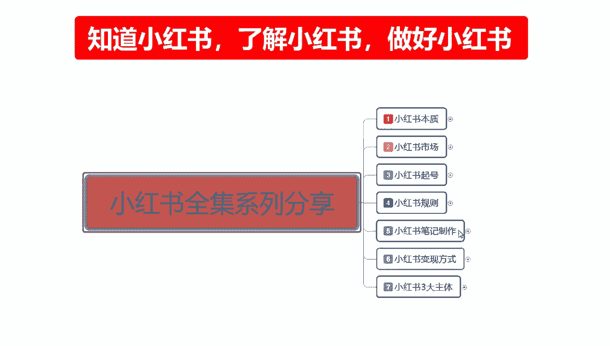
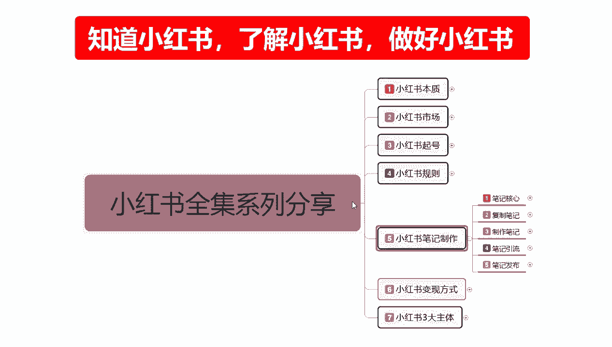
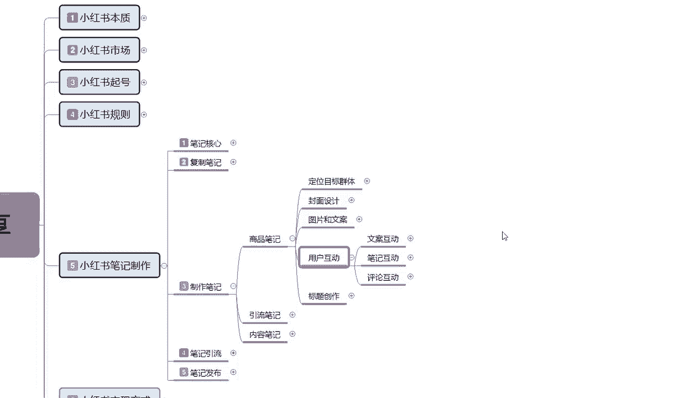
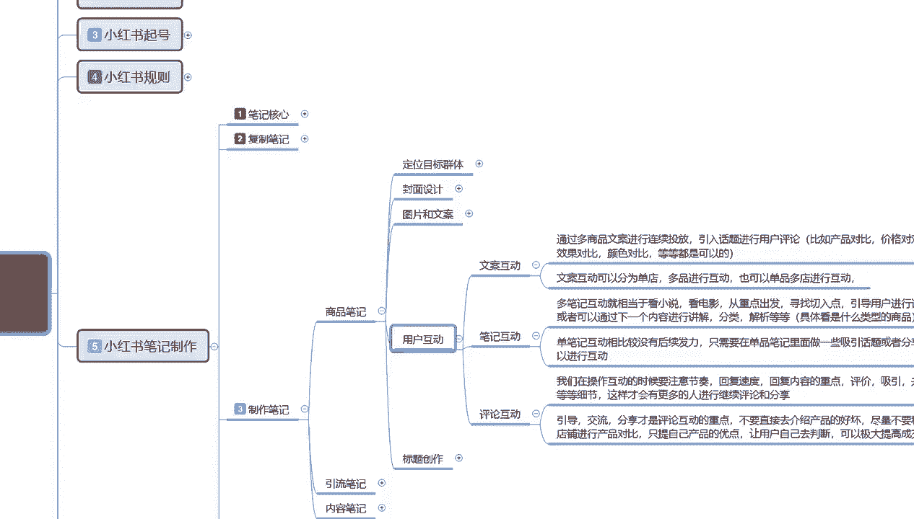
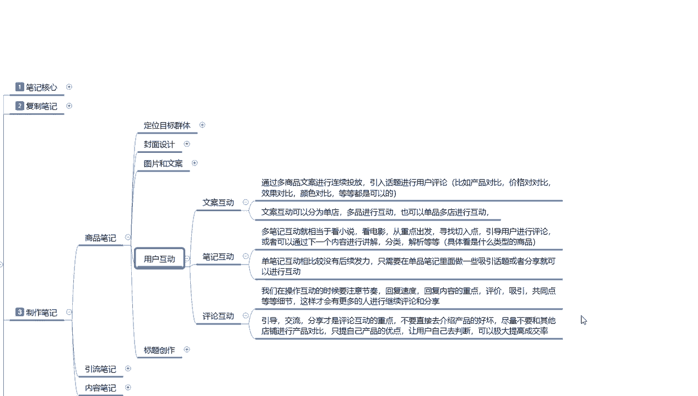
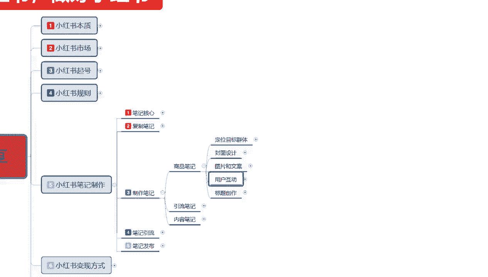

# 140分钟学会小红书运营-原来打造爆款笔记这么简单！！！小白零基础入门必学的小红书笔记公式拆解，最简单的起号教程，快来学！！！ - P52：22、小红书【商品笔记】制作：用户互动设计 - 小红_书教程 - BV1VD2cYDEew

大家好，今天给大家分享的是小红书全集系列，第五大课时小红书笔记的一个制作。

嗯综合我们上节课啊所讲到的一个内容，我们目前的话是在笔记制作里面。

这节课的话主要是给大家讲解一下，我们的一个用户互动和一个标题操作，首先我们了解一下什么是用户互动，用互动的话说实话就是比较简单了，用户的话就说嗯他是在我们笔记生成上传以后，对我们评论区进行的一个互动。

这里面的话是给大家分成了三个部分，第一个是文案互动，第二个是笔记互动，第三个呢是评论互动，他们其实的话都是差不多的。

只是说他的一个选项内容是不一样的。

首先我们了解一下啊，文案互动，通过商品的文案进行连续的一个投放，引入话题，进行用户的一个评论，比如说对产品的一个比对比价格的一个对比，效果的对比，颜色对比等等都是可以的，这种文案互动呢。

他就是不是在评论区里面进行互动，它是通过我们今天发布的一个笔记文案，第二天发布的一个笔记文案，就相当于是字谜解题一样啊，今天我们显示了一个字提，然后的话把昨天的字题的答案公布上去。

或者说我们在刚开始上传产品的时候，我们做的第一个字提，节目是两个字体和一个答案，第二天的话就是一个字提，也是两个字提一个答案，只是说他把第一天的一个额数据放上去了，以此类推，按照这种模式的话。

去通过文案做一个和用户之间的一个沟通，文案互动的话，它可以分为单店的一个操作，和单店多品的一个操作，也可以分为单品多电的一个操作，什么意思呢，就是说呃因为这种文案互动的话，它有一个连贯性。

就是我今天发送了一篇文章也好，发片出了一篇N产品笔记也好，或者说是发送了一件商品也好，我们在发送完以后的话，我们都会再给他进行一个笔记编排啊，对其进行一个宣传和宣广推广，然后我们通过类似的一个笔记。

把它做成一个文案排序，我们做文案的话，就说做笔记也好，做文案也好，做数据也好，我们都是有怎么说呢，固定的时间投放，固定的地点投放固定的一个内容投放，然后这些内容的话，他可有可能的话在一个笔记里面。

他无法完全展示，那么就会有第二个，第三个，第四个，第五个类似的一个连续性笔记，就像我们看小说也好，看电视剧也好，他都是第一集，第二集第三集啊，我们通过这种文案互动的话，可以增强用户的一个粘稠度。

我们不管他拿这个文案，你是做网红引流也好，做数据更新也好，做商品笔记也好，他都可以通过这种方式啊去操作，同样的一个道理，这个有出文案互动，就是我们把文案准备好以后的话，对后续的一个商品进行排序也好。

对我们后续的一个内容进行排序也好，他都是按照这种方式额进行操作的，同时他有一个跨区域的一个操作，什么意思呢，就是说，啊我用这个产品进行推广，下个产品进行连接，就是相当于我同时推广了两件商品。

然后用用户去选择，这是一种方式，第二种的话就是，单品单店单品多店进行操作，我这个产品在这买下一个文案互动的话，我会在产品里面进行引导，引导到我下一个店铺进行，进行它的一个效果推广。

而且也就是下一步的一个讲解，两个店铺同时操作，只是说他们的文案模式，第一个是呃标题，第二个就是答案，类似这种啊，两个店铺进行互动，让别人对你的两个商品，不同类型的商品也可以啊进行互动。

他就是相当于给我们嗯，把所有的店铺的一个数据把他综合起来啊，让别人不在我们店铺里面的额，单一商品进行烦恼，同时呢也是给我们自己增添增加一点那个，可控的一个范围，因为我们单品说实话在小红书上面。

你不管是桌垫也好，做其他的也好，单品的数据永远比单电的数据好操作啊，因为单电的话，你的所卖的东西，所推广的东西砸了以后的话，他后续不好跟进，也就是人群不精准，那我们可以通过这种方式的话。

把电单电的一个数据把它做精准以后，也不影响其他店铺的一个推广，也就是说我有两个三产品，三个产品，四个产品，五个产品，然后他们又是跨区域不同的一个类型的话，可以用这种文案互动的一个方式进行推广。

同时它不影响我们整体的一个发展趋势和，发展的一个数据啊，就是不会降权，这个就是文案互动，下面的是笔记互动，笔记互动的话就稍微简单一点，他学科和文案互动的话差不多多，笔记互动就相当于是看小说，电影。

其实和额文案互动一样，只是说他的一个方式改变了上面的一个文案，互动的话，它是比较适用的话，就是说相当于是多产品的一个多电推广啊，就是给自己创造多个马甲去操作，你比方说我要做网红，做博主对吧。

我这边的话我都想试一下，我前面我可能先是做读书，旁边有个做食品，后面有个做美妆等等，他都是这种连贯性的一个操作，比如说笔记互动的话，它把它范围缩小了，前面是靠账号的一个互动形式来操作的。

下面一个的话就是说靠单店的里面啊，笔记内容进行的一个互动，第一篇笔记，第二篇笔记，第三篇笔记进行连贯的一个切入点啊，引导运用户的话进行一个评论，单机单比去互动的话，比较的话他就是后续发力比较好啊。

只需要在单品笔记里面做一些吸引话题，或者分享就可以了，平等互动呢就是说我们在操作互动的时候，要注意节奏，回复速度，他呢就是说我们再把笔记做完以后，我们不光需要文案进行互动，文案里面下面还有笔记内容。

对不应该说是还有用户的评价内容，对我们这个呃所发布的一个笔记也好，所发布的一个内容也好，所发布的一些商品也好，他对我们有不同的看法，或者他自己的一个见解，我们在操作互动的时候，就要注意这里面的一个节奏。

回复速度，会回复的一个内容，重点评价性共同点等等细节啊，这样的话你才能把这一部分的用户嗯给留住，然后引导交流分享的话，就是说我们在评论互动的重点的话，就是说他就是引导交流，分享才是评论互动的一个重点。

不要直接去介绍产品的好坏啊，尽量不要和其他店铺进行产品对比，只提升自己产品的优点就行了，让用户自己去判断啊，就是提升内在美，不要去和别人做竞争，因为你和别人做竞争，无限竞争下去的话。

说实话对你没什么好处啊，第一个你多了精准对手，第二个你的内化内在优化跟不上去，内在优化跟不上去的话，别人就觉得你这个人不怎么幽默，小红书的话是一个种草好平台，你你得吸引到用户以后。

你才能去做商品的一个成交，别人信任你才会去购买你的东西啊，同样的道理，你做网红博主也是你做嗯，引流也是啊，你要先取得别人的信任，再想办法去套别人的钞票好吧，他那个整体来说的话。

就是说这种互动的一个方式啊，在比商品笔记里面，你把模式和方案选好以后的话，这种方式的话，它可以提，极大的提高我们的一个成交概率，和引流的一个概率，同时的话你就算是做网络博主，你通过这种方式的话。

对于粉丝的吸粉的话是非常有效的啊，就是喜欢同等内容的，他绝对会看第一篇，第二篇，第三篇，第四篇，通过这种方式的话，把你的一个用户粘稠度，和你的所有视频的点击数量，展示数量拉上去，拉上去以后。

你后续所发布的一个新的笔记，那么你初始的一个等级的话就比前面那个高，那你后续的人，后续的一个数据量提上去以后的话，它是一个啧，怎么说呢，循环系统你做得好他就越来越好，你做的不好，那就越来越差啊。

这个呢就是整个的一个用户互动。

然后下一个点是标题创作，说实话标题创作的话，它的一个整体内容是比较大的嗯，我下一节课单独给大家进行一下讲解吧，好吧，这节的话主要是给大家介绍了一下，商品笔记的一个用户互动，通过什么样的一个形式来推广。

我们整体商品的一个效果，好吧。

