# 140分钟学会小红书运营-原来打造爆款笔记这么简单！！！小白零基础入门必学的小红书笔记公式拆解，最简单的起号教程，快来学！！！ - P55：43、新手小红书运营-小红书店铺规划（2） - 红书教程1 - BV1o629YMEjv

大家好，今天给大家分享的是小红书全集系列分享的第七大课时啊，小红书三大主体的一个店铺运营的一个内容。

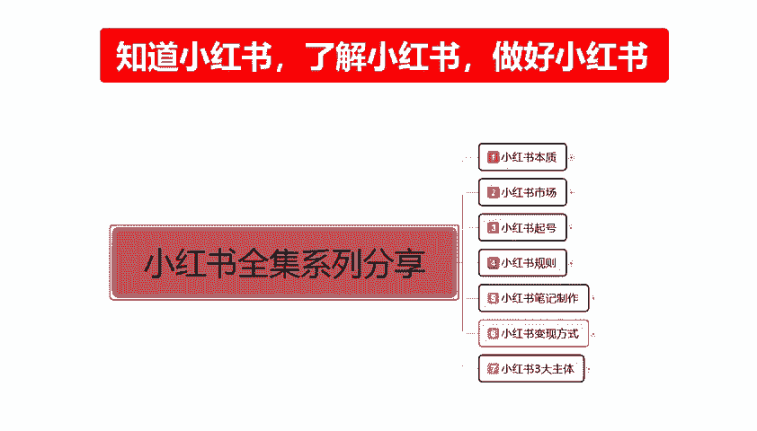

这节的话给大家讲解我们前中后期规划里面的中期规划，就是店铺运营中期，我们应该怎么去操作？整体来说，中期规划的话，他的一个。

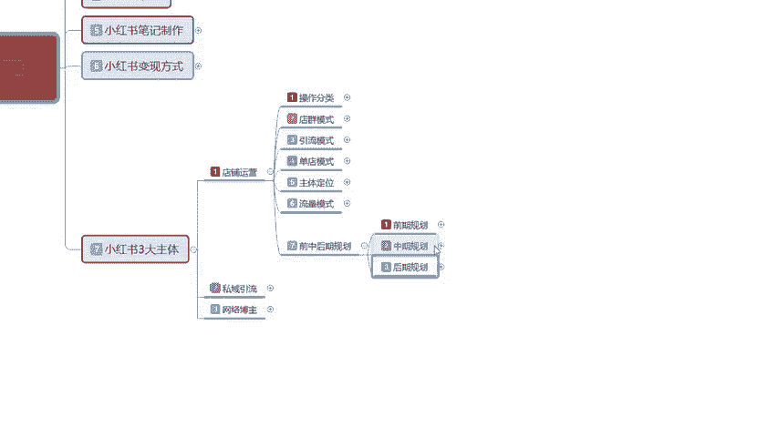

重点的话还是非常多的。在这里呢，我不知道是给大家进行详细的一个讲解呢，还是说我们大概了解一下内容就行啊。呃，因为整个内容的话，说说实话你。

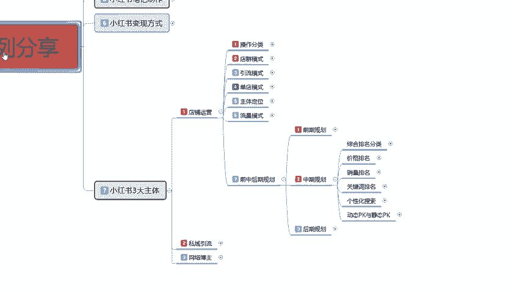

再去多讲的话，很多人他听不下去啊，因为他前期的一个数据属性都没做好的话，中后中期的一个规划的话，我们再去操作的话其实。很难，我们先来了解一下啊，中期规划都有一些什么。

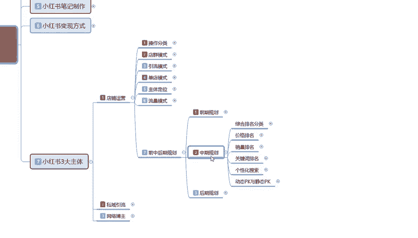

内容有点大，我先给大家把它说放一下。冬期规划的话。

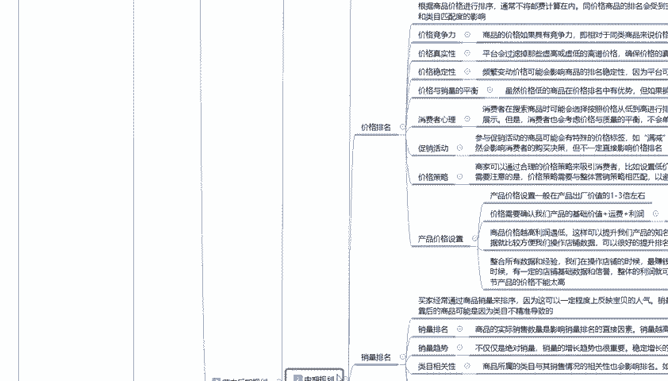

这个里面啊它以首先有一个综合排名的一个分类，一个价格排名，一个销量排名，一个关键词排名，还有一个个性化搜索。然后呢是PK动态PK与静态PK的一个选项。这里面的所有内容的话，它都跟我们的店铺整体有关啊。

我在这里的话，我就给大家讲解一个大概吧。因为我这个内容的话，说实话我是单独给大家讲过一起的。大家有兴趣的话，可以去搜索啊，同类的一个内容去观看一下啊。我在这里呢就给大家讲大概吧。首先是综合排名分类。

综合排名分类的话，它总共分为16项啊。因为中期的话，我们前期数据做好以后，我们中期的话，我们就需要考虑这些排名。你的排名越高给你的展示和曝光也就越高。当然了，这个是我们做的那20%的一个数据属性。

跟我们的80%的额外流量是没有太大关系的啊。你我们正常你小红书售店就是抢的20%流量，看你能抢到多少啊。综合排名分类呢，这个是默认的一个排宝贝排名的一个状态。

主要的话是根据店铺的一个综合因素对宝贝进行排名。考核方面的话，它考核的内容是非常多的啊，它包括商品的描述主图的质量单品的一个综合数据以及店铺的交易情况。然后在这个里面的话。

还有定位和进化个性化搜索的一个趋势，就是你个性化搜索里面，你能不能满足客户的一个需求呢？你能框到多少人都在这个里面。

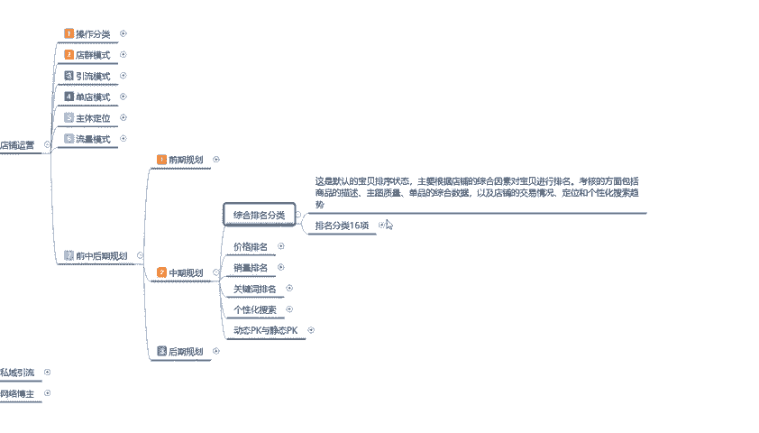

排名分那16项的话，这里面的一个排名的话，它是非常多的。人气销量信誉价格、新店与新品的一个扶持商层优先级下架时间，标题优化橱窗推荐。厨窗推荐的话，说实话这个不在这个范围以内啊，这个是之前找的一些数据。

包括转化率、收藏率、回头客比例、好评率、交易数量，这个就是16排名综合排名的一个。

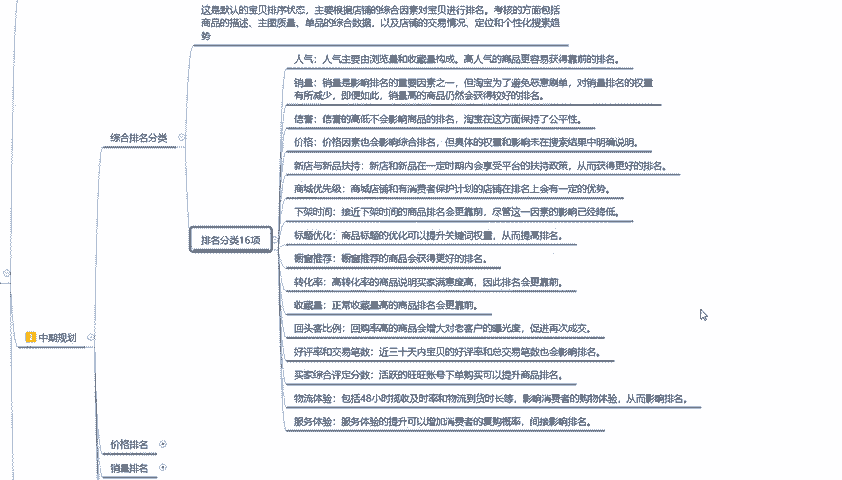

怎么说呢？😡，就是16项选择里面，现在的话是15项，刚刚删除那个是以前有，但是现在没有了啊，大家了解一下就行。这整个1616项排名，你在十6项里面的排名决定了你整个店铺中期规划的时候。

我你能把它做到多优秀。你的排名就有多高。排名高了以后，那20%的流量，你能抢到的概率就越大，你做不好的话，那你排名上不去，说实话，你的一个整体数据量就。

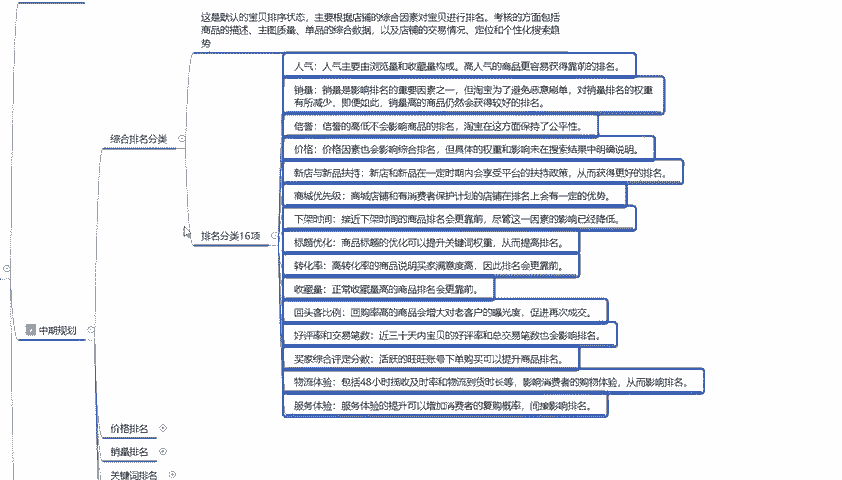

不是太好做啊，这个就是综合排名分类。然后面的话就主要就然后呢，就是价格排名和销量排名。价格排名的话。

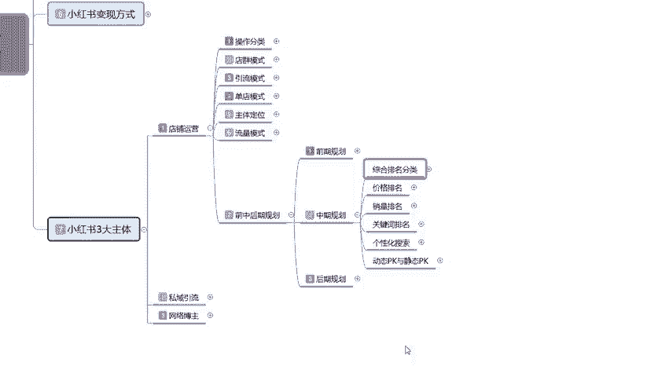

包括它整个内容啊，价格排名和销量排名，它整个内容其实是非常多的。它是根价格排名。首先我们了解价格排名啊，价格排名的话，它是根据商品的价格进行排序的。通常的话不将由非集算在内啊，它。

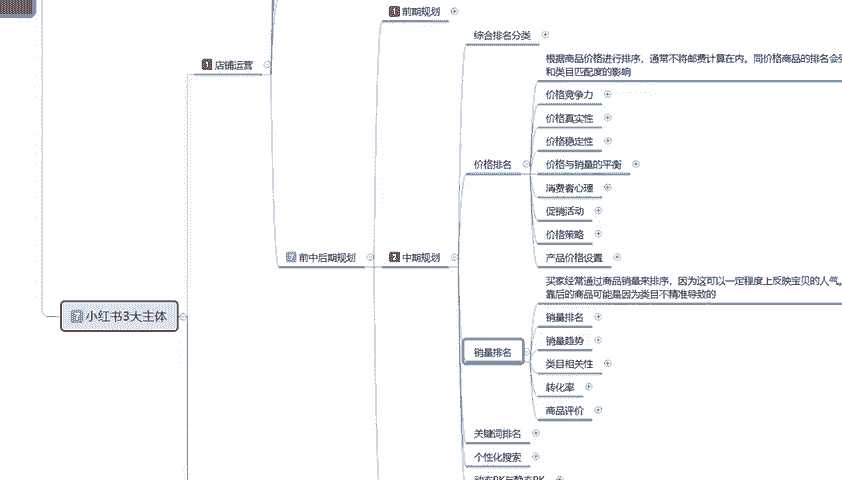

嗯，怎么说呢？基本上都是包邮，同价格的一个商品排名的话，会收到宝贝关键词排名的一个呃匹配度和关键词排名的一个匹配度和类目进行匹配。比如说。😡，你的一个同商品价格。类目决定了你排你所在排名的一个位置。

所在排名的位置。然后的话它通过价格的一个竞争力，价格的一个真实性，价格的一个稳定性，价格与销销量的一个平衡。通过这几个点。来确定你整个产品的一个排名系统。你这几个点如果说你把握不好。

那它整个的一个排名系统的话就是崩溃的。我过这整个前中后期规划里面，说实话这整个一个内容我暂示给大家看的话，其实。很多人他不理解，但是你只需要。怎么说呢？因为我这一期整个一期的课程的话。

是让大家了解整个运营系统。如果说你们单独想了解这一个呃店铺运营前中后期的规划的话，它其实单独列出来，它可以讲60到80节的一个课程内容。就是给大家分享的话，光讲小节的主体内容我可能都会讲60到80。

但是呢我这个如果说把数据量做太大，我后续的话有些东西我没办法上传。所以说我在这里呢就给大家介绍一下啊，大家了解一下我们中期的一个排名它都有什么啊。大家如果说对这里面的内容感兴趣，截个图啊。

自己去研究研究，其实也可以，好吧。多的呢我就不给大家进行详细的一步一步的解释。因为它这个里面的话，说实话每一个每一个重点都需要我们去把控去了解，去关注的，好吧。

这个呢就是价格排名我们所需要注重的一个重点。然后在销量排名里面啊，销量排名的话就是说他通过我们。产品进行的一个销售数量，在小红书店铺运营里面它都是有的啊。买家经常的话就是通过商品那个销量来排序。因为这。

这个的话可以一定程度上反映宝贝的一个人气。销量高，但是排名靠后的商品可能的话就是说因为我们内幕不精准导致的啊，这里面有销量排名，销量的一个趋势，内目的一个相关性转化率和商品的一个评价。

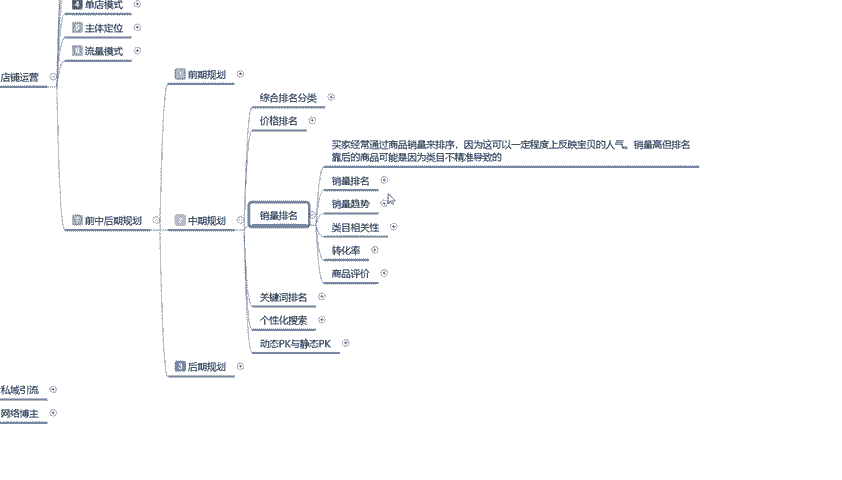

大家进行进一步的了解就行了。因为中期规划的内容说实话是非常多的，不好去给大家讲，知道吧？

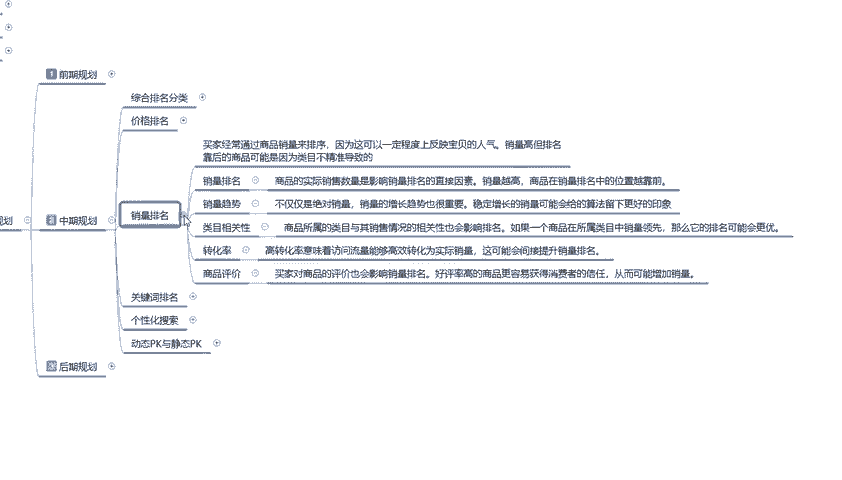

呃，同样的关键词排名啊，个性化搜索动态与静态的1个PK。这整个一套内容的话。

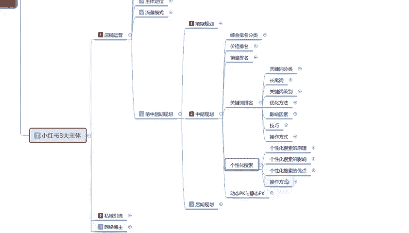

我会单独给大家重新列一个大的一个呃小红书系统课给大家进行分享。因为在这里去给大家讲的话，我这个因为课程录制已经是非常多了，就不再过多讲了。大家先了解一下这部分的内容，好吧。呃。

关键词排名的话有关键词的分类常尾词。长尾词和主关键词它都是有区别的。它每一个词汇，每一个组词的方式它都是有排名的，就是搜索的前后知道吧？你比方说你卖。买短袖吧，买T恤买短袖，男士T恤，女士T恤。

他在搜索T恤两个字是一个排名。男士女士男士T恤又是一个排名，女士T恤又是一个排名。它是所有的后台系统啊，小红书的所有后台系统，它的关键词排名。他都是单独搜索的，知道吧？以这个关键词的排名就是。

同类商品同类价格，同类类目100个排名关键词。然后根据用户分析所搜索到的人群，它都在这个范围价格。然后就看你的排名词汇，你的排名在这个词汇里面在多少名，你去做这个词汇的一个属性。

那么你可以就可以获得这个词汇属性的一个排名的一个展示曝光和搜索量。个性化搜索也是一样的啊，它的一个整体内容的话，说实在的，就是用户的一个属性，结合我们店铺的属性所对应的啊。

给我们招到就是你个性化搜索做的越好。那么你的用户越越精准。那么到后续的话，你个性化搜索做完以后的话，你整体这个数据量的话也就越好。动态与静态PK我在这个地方的话，说实话啊就不给大家讲了。因为这个的话呃。

怎么说呢？动态PK和静态PK你们暂时涉及不到。你们如果说真要涉及到动态PK和静态PK的话，那么你们就基本上在第四。就是基础能量就已经在第四层级和第五层级了。就小红书基础能量都已应在第四层级和第五层级了。

你在这个阶段的话去做动态合并静态PK可以，但是它的效果量不是太大。你在前期去做的话也可以做。但是有提升，但是你后续的数据，你没办法把控这个做和和不做，就看我们自己大家怎么去判断的，好吧。

后期呢我单独把这一个整个前后中期的一个规划，单独再拿一个大的课时给大家进行分享。因为这个内容实在是太多，我没办法继续给大家进行详细的一个步骤讲解。

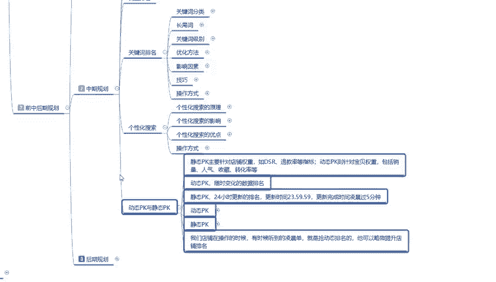

后期规划的话就比较简单了。后期规划的话，它是整个的一个运营思路啊，我们把东期做完以后的话，就是后期发展发展啊。两个节点。什么叫两个节点呢？第一个是加大力度投入，第二个是开心点。加大力度投入的话。

就是我在这个阶段，我觉得我店铺还有提升空间。我然后的话在这个里面做数据分析，店铺店铺分析、数据掌控、店铺优化数据维护和平颈突破。从这五个方面开始，就是我们从第五阶段突破到第六阶段，我们要开始付费推广。

懂意思吧？就是我已经从一个小红书中层用户往大用户方面去发展，提升我整个店铺也好，品牌也好啊，整个一个运营系统的一个内容。它就包含了这些些数据啊，数据的一个分析，店铺的分析，数据掌控包括了这。6条属性点。

如果说我们碰到这个瓶颈期了，我觉得我的属性，我的店铺我没办法再加大投入力度，再去操作它了。为什么？因为我已经到达我产品的一个上线力度了。我再加大推推广的话，说实话呃，一半一半。但是我不想冒这个风险。

那我们就可以考虑下一个点开心店。嗯，吸取我们这个店铺整体运营的一个计划与思路。然后的话和这个店铺做类似的一个商品，然后按照这个模式去做。第二个店铺肯定效果比第一个店铺要好。

然后我们再考虑是不是要做到这个程度以后，再加大力度去进行投放推广。因为这个时候的话，我们的整体的一个。运营思路有了，店铺属性有了，钱也可以说是保证自己有一定的资金，可以开始进行第二步的一个规划。

就可以往这个方面去考虑了啊。做好基础规划以后的话，再做类似的一个商品进行小范围的一个调整就行。这个就是中期和后期的整体规划。说实话，这两个的话是单独啊做大课时讲解的。

在这的话我就啊不再给大家进行过多的一个分。分布去讲解了啊，因为它内容确实是太多了。好吧，主要是让大家了解一下。然后的话这一节呢分享就到这儿，下节给大家讲解一下我们的一个小红书三大主体的一个思域引流。

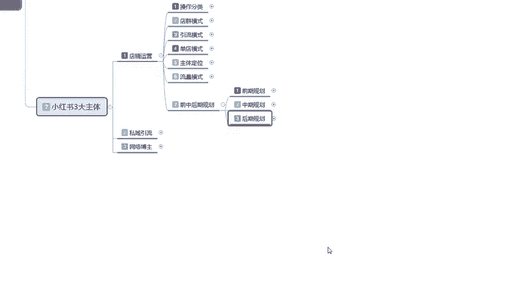