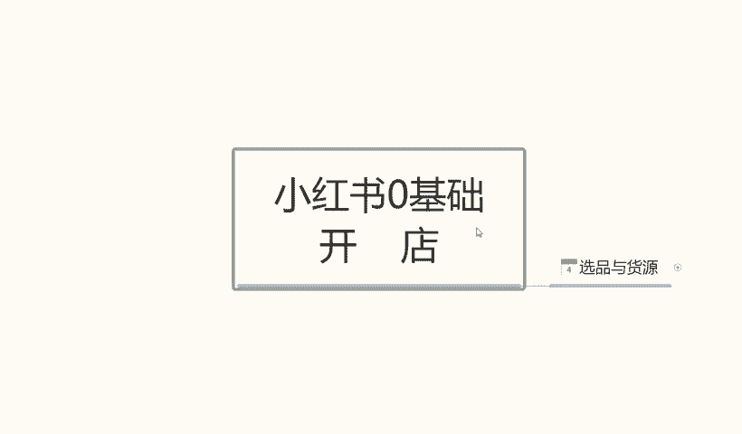
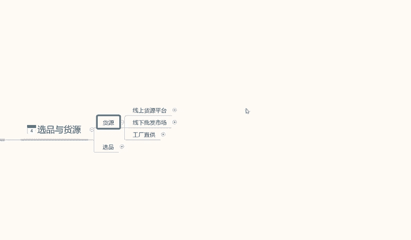
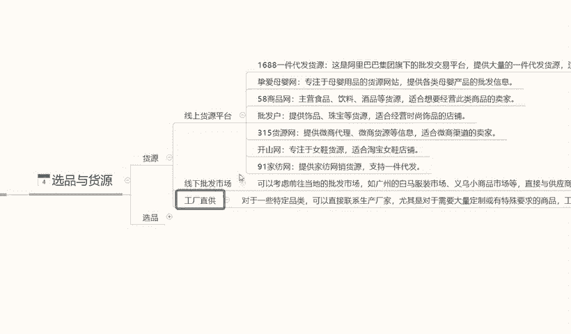
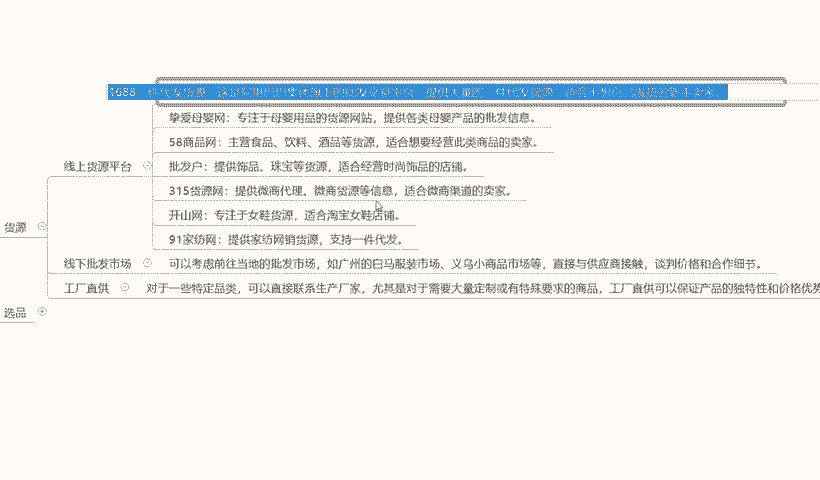
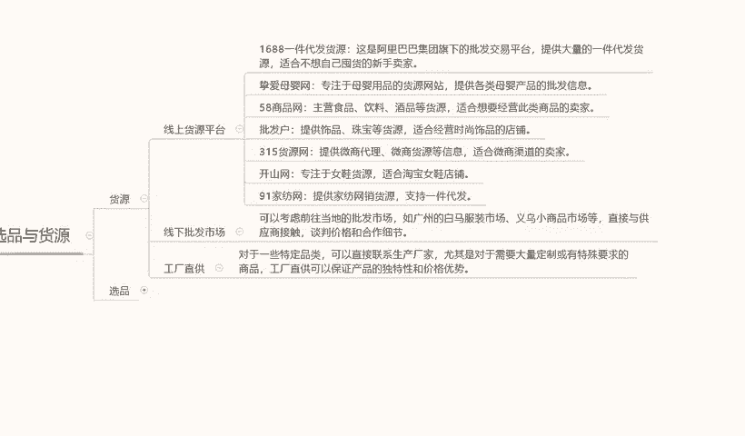
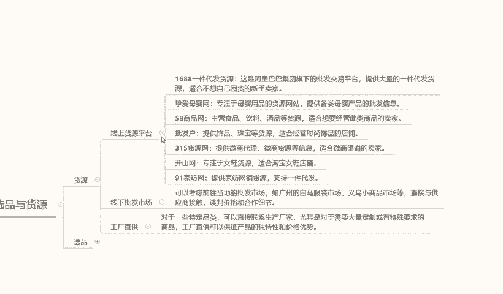
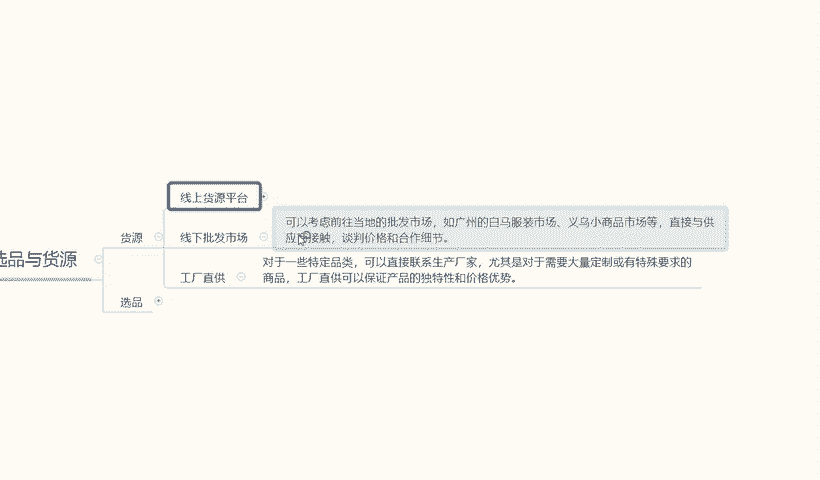

# 140分钟学会小红书运营-原来打造爆款笔记这么简单！！！小白零基础入门必学的小红书笔记公式拆解，最简单的起号教程，快来学！！！ - P5：3.小红书选品和货源 - 红书教程1 - BV1o629YMEjv

大家好，今天给大家分享一下小红书零技术开店选品与货源啊的一个内容。呃，废话不多说，直接进入我们今天的一个内容。啊，给大家分享一下我们怎么去选品啊，怎么去选货。

选品选货的话是我们小红书呃的重重中之重。为什么？因为一个好的货源才是我们一个。赚钱最基本的一个选项的最重要的基础条件。因为我们的货源不好啊，我们选货不正确，我们怎么去操作这个店铺做起来也赚不了多少钱。

我们先不说赚不赚很多钱，你有可能还会亏本。所以说选品有货源的话，它在这个里面的话是非常重要的一个环节。那首先我们了解一下它什么是货源。会员的话，我在这里呢给大家分为了三个例子啊，第一个是线上会员。

第二个是线下会员。第三个呢啊是工厂直销。

首先我们了解一下什么是线上货源。线上货源的话就对我们小卖家来说，或者说对我们新手来说的话比较友好的一个东西呃。网络上面一键代发，或者说是其他网络上面。

或者是我们所在百度啊或者其他地方搜索的一些给我们提供产品的。自质法。这个就是线上会员一个平台。线上会员的话，我在这里呢给大家随便列列了一部分啊。

这里面比较好的一个就是说啊16881件代发它这个里面的话产品比较多，在小红书上面去做的话，其实是非常好做的。而且它的产品价格比较低啊。20。啊，品类多，因为他。做的时间比较久。

第二个呢就是在母婴网包下面呢我就不给大家详细解说它的好处和坏处了。这里呢我已经给大家列出来了啊，一个在母婴网58批发货啊，315会员、开上王91啊，还有一个啊么多多。某多多的话其实和1688是差不多的。

我们可以把其他的资源型产品拿来在小红书上面去操作。因为小红书的话。它对应的产品的话比较会会比较单一，不像呃。PC。啊，木桃。或者说是。京东啊之类的这种店铺一样，因为他们基本上已经形成了一个固定的模式。

小红书的话，它是以笔记为搜索来源。而且他的一个货源的话呃也不是很稳定。它基本上的话和其他的平台一样，但是它的整体的一个。后台系统对比其他平台来说的话，漏洞还是有点多。所以说我就给了我们一个操作空间。

我们可以把其他的产品拿到小红书上面来卖啊，相当于小红书在抢其他平台的一个流量资源。而且它也成功了。它的一个整体的流量数据是非常大的。所以说线上货源的话，我们拿其他产品在这个里面卖啊。

其实也是能赚到钱的啊，就看我们自己怎么去操作，怎么去跟卖家谈。谈完以后的话，我们在小红书上面怎么去卖，怎么去包装我们自己的一个产品。其实就是二手货倒卖。就看自己大家怎么去操作，这个人就比较好理解了啊。

这个呢就是线上会员的一个些平台。

第二个呢是线下批发市场，线下批发市场的话跟线下货源就区别就有点大了啊。呃，我们可以呢考虑全我们本地区啊，你不管是线也好，市也好啊，或者镇营也好，他都当地的话，它都有一个批发市场。

批发市场在他所有的东西出来以后都是成本价。我们只需要去这个里面的话去观察一下，跟批发市场的老板，或者说是我们中意的产品，我总想拿它到小红书上面去卖，我们跟他商量一下价格。第一个我们可以说是二手货源。

或者是三个会员，这种会员的话，第一个价格比较低。第二个的话就是说竞争压力没有那么大，我们非常好去操作。只要谈下来了，我们不需要怎么去囤货，我们或者说是我们每天卖出去是多少，我再去拿货再去直接弄。

这是比较方便的一种方式，而且不需要囤货啊，货源也有保证啊。资金也充足。为什么说资金冲转？因为。钱到账以后，我去发货，他只需要我们之前预留的23000块钱的一个流动资金。基本上就够了。再去怎么操作。

他的一个资金就循环起来。所以说对我们前期要求也没那么高，不需要自己去囤货啊，去做什么。对吧。当发现这个产品有市场以后，我们再去操作，效果就又不一样了。所以说线下批发市场的话，建议大家还是。

如果说网络上面你嫌麻烦，可以在线上平台收入会员。如果说不嫌麻烦，自己想把小红书做好，或者说把我们这一个平台啊这一个产品做好，我们都可以去搜索一下，去各地的一个市场，通过我们自己的一个运营模式。

把我们的产品卖到其他市来赚取这一个额外的流嗯产品的一个交易差额。啊，这个呢就是线下的一个批发市场。

第三个点呢就是工厂直销。工厂直销来说的话。他对于线下批发市场需求和。要求会稍微高一点，因为的话他可能会囤货，而且需要找人家的老板去谈谈什么呢？我从你这拿货，或者是你帮我发货，我帮你去做推广。

就看我们自己怎么谈，而且你的一个所站在的立场是什么样的，你是想让他帮你发货，哎，你只是说帮他代运营而已。然后的话从这个里面赚一些产品的额外的一些成交金额也可以，或者说是。你跟老板谈，我要你的是产品的货。

前期呢我到你这，你先拿拿一点货啊，但是量不多，我先试一下你这个产品在品我这个平台里面好不好卖。等等，看你自己怎么去交流。因为工厂直销的话，是属于一手货源，刚刚的线下批发市场是属于二手货源。

线上货源平台啊，拼多多啊、1688啊这些都是三手货源，他们三个的价格是不一样的啊。线上会员来说的话，他是别贵的。线下会员的话只能算中等，但是工厂直销它是最便宜的。啊，大家一定要注意这个点啊。

这就是三个点的一个区别。利润最大的就是工厂最销，利润最小的是线上会员。主要大一定要清楚这个点。你自己适合做什么啊，想要多少粒的？怎么去谈怎么去聊啊，就看你们大家自己了。所有的产品的话。

在小红书上面其实都可以做的。只要你不要不要去找那种大型的家具啊，电器啊都可以做。小红书的话，它女性居多，我们可以做个视频。服装服饰后面的话我会单独拿一节课给大家讲一下小红书上面的话。

它什么样的一个产品比较适合我们去做啊。这个呢就是货源。下面是选品。啊，货源和选品它是不一样的啊，货源只是说我们有了一个选货的一个渠道，我们怎么去选货？选品的话不一样，它是在选货里面再去挑品。啊。

这个里面的话，我给大家列出来几个点，大家等去参考一下，然后再用我们自己的方式去做一下对比，就知道怎么去选品了。选品的参考内容是哪几个呢？第一个价格第二个人群，第三个市场。

第四个需求选择方式的话就是利润稳定和时效性。先从价格开始啊，参考的参考内容的价格就是首先就是我们这个选择产品的一个价格。我们比方说工厂直销也好，或者是先产批发市场也好，或者说是1688。

或者是其他的一些批发平台也好。首先考虑产品的价格，然后拿这个产品去小红书上面搜索同类产品的一个内容。记住了，不要拿我们注册的店铺去弄，拿一个新号啊，一定要记住开一个新号。去搜索对应的价格，看看这些产品。

然后再。对比我们所找到的货源，不要只要店铺不超过50家以上，就是同类产品价格区间差别不大的情况下。我们如果说利润不是很多，比他稍微卖贵一点的没关系。只要店铺就是收的时候不超过50家以上。

基本上都是可以做的。这是线上货源。线下批发市场的话，只要说是不超过60或者70家都可以做工厂直销更简单，不超过100都可以做。啊，因为利润高。这是价格。第二个是人群。什么是人群呢？

就是说我们对应产品的一个人群。我选产品，我们选女性产品，对吧？因为小红书基本上都是女性为主。那我所有的产品对应的人群就是女性。那我们一定要选择女性喜爱的用产品啊。尽量的话少卖男性用品，男性用品也能做。

但是它整体的话一个对标太高了。我们前期操作的话，对这个系统不熟悉的话，我们去操作是。不好操作那人群里面的话，我们主要就是女性和年龄。年龄小红书的年龄是20到40。那我们选产品的时候一定要去选。

这类人群里面喜欢的一个产品。知道吧？20到40或者再小一点，16到40这个之间的产品，女性用品喜欢什么？我们就可以参照这个一个范围去吃。找我们的产品，这范围就小多了吧，价格有吗？人群有了对吧？

然后就是市场需求。搜索同类目里面的一个产品的市场需求。这个产品在小红商上面，或者说是在这一个。人群使用广不广泛啊，用的人多不多，产品价格在什么范围？把这几个点比出来以后的话。

这价格人群、市场和需求就基本上全部都出来。我们就知道选什么产品，卖什么价格怎么去卖。只要是同类竞竞争店铺的话。说实话。我那会儿前面给大家说的啊，这个价格参考里面50家70家100家店铺里面啊。

我说的是产品销量破500以上的啊，产品销量破500以下，他爱有多少有多少，那些都没有关系的。知道吧？它不会影响我们任何。店铺的一个信息，只要说是产品销量，单品销量在500以上的，不超过50家。

我们都可以去做，好吧。这个就是我们选品的一个参考内容。节后呢就之后呢就是我们选择方式利润稳定时效性，什么是利润？我这个产品在拼多多上在小红书上面，我们能赚多少钱？一旦我们能赚多少钱，一定要把利润算出来。

利润不算出来以后，你别说我产品卖出去了，我小红书店铺也做火了，结果我亏本了，那就是我们利润没算好。所以说一定要把利润利润给串出啊，别自己做到最后自己把价格调错了以后的话，亏本那就得不偿失了啊。

第二个是稳定，什么是稳定呢？产品货源一定要稳定。如果说大家做现上会员的话，建议大家选2到3家做同类产品的去跟老板去谈买家。啊，而且这里面有一个小技巧，就是说不管是两家也好，三家也好，4家也好。

我们谈的时候，每家里面都走一点货。啊，一家走主，三家走父，就是一家里面可能一天。如果说我们出30单，这一家里面的话，我们一天可能25单，另外两个两单的一单一单就可以了。

为什么我们保证一个主店铺里面的货源稳定就行了。货源如果说不稳定的话，我们产品没法做的啊，你去店铺刚做起来。还没多久，哎，产品没有了，你去卖什么去，对吧？那整个店铺就没用了啊。

所以说一定要注意货源的稳定性，非常重要。最恶是时效性。什么叫时效性呢？实际上呢就是产品的一个季节，春夏秋冬四季。我们的产品对应的季节。去卖什么样的一个产品，我们提前做规划啊，所以一定要有个思想性。

比方说我们卖夏季的，或者卖冬季的，卖春季的，卖秋季的也好，提前一个月去做这个产品。因为我们店铺起店的话，前期最少有一个月准备时间。店铺起来以后的话，刚好到应季的时候，我们这个产品去卖啊，是最好卖的。

当然也有四季都使用的产品。但这种产品的话呃比较少，但是它的一个竞争压力是非常大的啊，别人可能做了一年，做两年，做三年，做4年，这个小小红书的一个店铺。而我们只是刚开始怎么去给别人竞争呢？

所以说大家选品的时候一定要注意这个时效性啊。这个呢就是我们今天的一个课程内容，选屏与货源的一个准备。下一节课呢给大家详细讲解一下小红书的一个账号测试啊。因为小红书所有的账号的话，它不都不是都有权重的啊。

它是有区别的。所以说下一节课给大家详细讲解一下小红书的一个账号测试，我们怎么去测试我们的账号能不能做。啊，是不需要换号，好吧。

