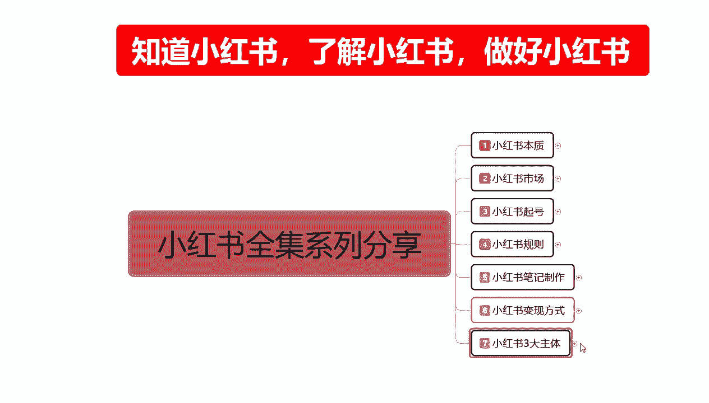
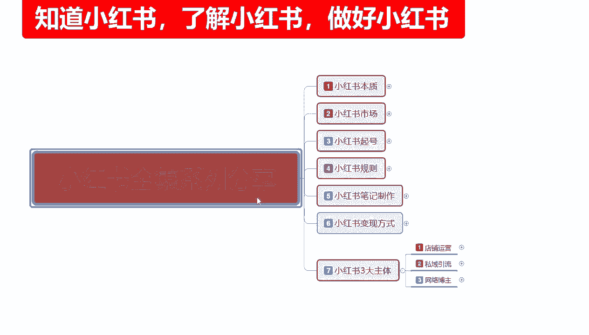
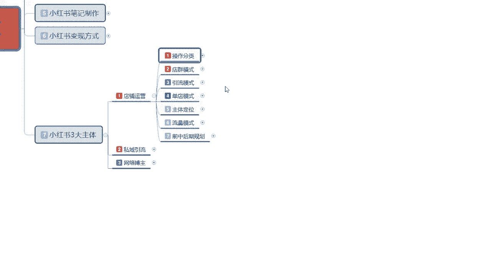
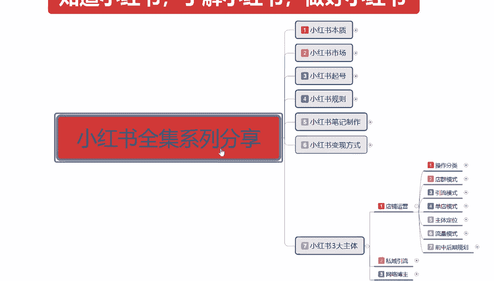
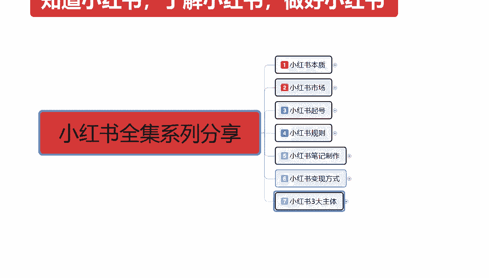

# 140分钟学会小红书运营-原来打造爆款笔记这么简单！！！小白零基础入门必学的小红书笔记公式拆解，最简单的起号教程，快来学！！！ - P64：34、新手小红书运营-小红书店铺运营 - 小红_书教程 - BV1VD2cYDEew

大家好，今天给大家分享的是小红书全集系列的，最后一大课时，第七大课时啊，小红书的三大主体，这一个课时的话内容也是比较偏多的，因为主要的话是讲解，讲解，分析我们整个小红书账号里面的一个三大主体。

这三大主体是哪三个主体呢。

第一个是店铺运营，第二个是私域引流，第三个是网络博主，就是我们要做网红的啊，可以考虑第三个私域引流，就是我们有自己的产品，有自己的一个销售销售渠道，然后的话我们只是说想做私域。

然后在某一个特定的范围内进行宣传啊，可以去做私域引流，店铺运营呢，就说我们这边的话啊，想在网小红书上面啊尝试运营一下店铺啊，去卖一些产品之类的啊，都是可以的，这个呢就是小红书三大主体。

为什么叫它三大主体呢，因为小红书的话正常的一个运营模式，你只要想在小红书上面赚钱，或者是了解这个行当，那么你都要去操作这三个模式里面，选择一个去操作，那这这一节的话主要是给大家讲解一下。

我们从第一课开始啊，店铺的一个整体运营开始。

小红书整体店铺运营的话，其实可以把它分为七个步骤，这七个步骤的话是七个大节的一个课时，而不是小节的课时，当然了，这一节课呢也是最多的一个内容，整个店铺运营的话可以把它分为操作分类啊。

店铺的一个店群模式和，单电模式和额多电模式的一个操作，然后是引流模式，单电模式，主体定位，流量模式和前中后期的一个规划，这个的话是全部是店铺运营的一个内容啊，这个不是其他内容。

这个里面的话全部是店铺运营的一个内容，我们去操作的话，就是说我们做小红书，你不管是做私域引流也好，做网络博主也好，你都要有一个店铺，只是说他的一个店铺，整体的话你的权重做到什么样啊，能给你的店。

给你的账号带来什么样的一个加权，你做私域做私域引流，其实你也要去开一个店，因为的话小红书你在上面的话，你去开一个店了以后的话，你交了保证金，你的账号本来就有一定的权重，懂意思吧。

你然后在后续后续的话你去挂自己的一个链接，或者挂自己的一个介绍之类的，都可以在店铺里面去挂啊，让用户去了解你的一个结构属性是比较方便的，好吧，废话不多说，直接开出我们今天的一个正题。

店铺运营第一课操作的一个分类，什么是超出分类呢，小红书我们在上面做店铺运营的时候，他的一个操作分类是有电驱模式，引流模式，单电模式和整整合分类的一个情况，首先是电群模式，店群模式的话。

其实呃他还是比较简单的，先让大家了解一下什么，什么是小红书的一个操作分类的一个店群模式，就是说我们在小红书里面，我是准备做店群，我是准备做引流还是做单电，还是说我想把它整合分类。

然后再去呃判断我自己做什么，首先是电驱模式啊，它的优点是什么呢，操作简单且要快，可随时变更的一个信息，缺点就是说投入太大呃，但是这个投入太大的话，它是可以回收的，就比方说我们开十个店，开20个店。

30个店，每个店铺需要1000的保证金，这个保证金我们是可以回收的啊，整体来说的话只是说前期的一个投入大，后期的话其实还好嗯，但是他整体的话一个收益是比较一般的，怎么说呢。

就是现在你去操作小红书做店群的话，他收益基本上不比你打工强多少，而且还费劲，那收益是非常一般的，操作时间的话，就是说，你如果说真的想在小红书上面做店群的话，你就没有其他时间做别的东西了啊。

你每天光那几十个店铺来回倒在上面上传数据，下架数据，然后更新你的动态，做笔记发布，你每天花在这个上面的时间，至少要达到六个小时以上，它是比较麻烦的一个模式，但是可以赚点钱，但是赚的不多啊。

现在的话你要是搁一两年前，我们去做店群模式的话，电驱模式还可以做，你搁现在去做电驱模式的话，说实话效果不好，这个呢就是电池模式，第二个就是引流模式，引流模式是什么意思呢，就是，引导用户去微信微博。

QQ这种地方做成交的，怎么说呢，引流模式的话，我们只是说在小红书上面挂一个店铺，在上面就可以了啊，就是我的整个账号里面，我其实有店铺，有产品去卖的，卖不卖是得出确实那时候，但是我有这些东西。

那么有这些东西了以后的话，我的整个账号权重就偏高，那么我发放的发送的笔记的话，小红书他会给我一定的扶持，第一个是扶持，第二个我完成任务以后的话，有额外的一个展示收入，为什么叫散展示收入呢。

因为你做引流的本来就是要做到看的人越多，对你的产品越了解，对你的宣传也有好处，就是你本来就是要来做推广产品的，对不对，你在这个里面做引流模式的话，你无非就是把想把数据扩大，你以前可能是100个人知道你。

你在小红书上面做的话，你可能你想达到10万20万50万这种嗯，知道你这个产品的一个人，知道你是做什么的，一个人对吧，那你作为引流模式的话，其实还是可以的，他优点的话就是说投入一般嗯。

你在上面的话只需要多创建几个号，然后的话分担发送你所发送的把自己的产品，把自己的文案做成笔记去发送就可以了，投入一般啊，投入不会太多，就是看自己想怎么做，大体的投入的话，他是不会太多的。

因为他不需要你去做数据，你只需要在里面无限的发发送，你的一个笔记内容就行，然后的话把基础的全都做起来，然后把笔记优化一下啊，商品之类的，你后续包括销量之类的，什么都不用管啊，收入高，后期的一个维护简单。

但是缺点的话也是比较明显的，你在小红书上面去做引流模式的话，人群范围小啊，有一定的规模限制，因为你的账号初期的话，你本来是没有权重的，我们去操作的话，你需要多个账号同时使用啊，而且成效比较慢。

他唯一的缺点说实话就是成效比较慢，你想把它做大做强的话，你需要坚持最少三个月到半年以上，你才能慢慢的看见成效，这个就是引流模式，第三个的话就是单点模式，单点模式的话呃。

这个就是我们想把真的想在小红书上面去开店，卖产品对吧，我不管我们的产品是从什么地方来的，我自己有产品也好，没有产品也好，在1688上面找的也好，在其他地方找的也好，其实在这上面都可以做啊。

单电模式的话呃，整体来说的话，他的综合能力比较高，对比赛里面两个模式的话就是没有那么极端啊，你比方说电驱模式投入大，收益一般啊，操作时间非常长，你引流模式的话，说实话投入一般，收入是高。

但是他的一个成效确实是太慢了啊，你最少得要三个月到半年的时间，才能慢慢的看见成效，你后续的一个维护啊，或者说是时间的一个变革，对你来说的话，嗯你是集体，你还能承受，你是个人的话。

那你真的是非常需要有耐心，你才能去做那个引流模式的，单店模式的话，就是说综合能力对比上面两个的话，就没那么极端嘛，第一个就是投入低，但是呢啊它相对丑，相对的他的一个整体操作的话是比较复杂的啊。

因为我在单独给大家讲的这一个整个店铺运营，就全部是针对单店模式来给大家进行的，一个讲解和分析，嗯当然了他的收益也是比较高的，同时他的持续时间比较长，你像做电池模式的话，你可能做个两三个月，你就又得换电。

或者换换其他的一些东西来做，你做引流模式的话，说实话它的一个成效特别慢啊，就是单店模式相对来说的话还是比较好的，就是整整合这个几个模式的一个情况下的，你也也要根据我们个人资本来看的啊。

第一个就是店群模式的话，适合的话就比方说怎么说呢，你自己初始阶段有一部分资金，然后的话自己又闲的蛋疼的啊，没事干的想看看网络上面也到底啊，就是你想熟悉一下这种模式，想去了解，因为电群模式的话。

说实话你要做店群模式，你在里面有很多东西可以去学啊，就看你后期学的怎么样了，学完以后你再去做单电的话，你也有自己的一个思路，为什么，因为电气模式的话，他有的号可以起来，有的号他是起不来的，你开十个店。

20个点，30个店里面总有一个电到两个店可以起来，他就是概率学的一个问题，只是说别人做的是单店，你做的是电群而已啊，而且电群的话花费的时间太长，他就比较适合有一定的资金。

然后的话自己真的想在网络上面做好啊，有一定了解，对网络这个运营营销都有一定了解，可以去做一做，第二个就是引流模式啊，他比较适合的话是有经验和产品的一个用户，什么意思呢，就是说你自己真的是想往网红方。

网红方面靠，你可以去做引流模式，你有自己的产品也可以去做引流模式，你想给给给用户分享，你自己的一个社会的一个经验，一个历练啊，你也可以去做引流模式，这个的话就是比较适合网红这种嗯，你做博主啊。

做网红啊啊做搞笑宣传，这种的话比较适合做引流模式，单点模式的话，说实在的啊，他比较适合的话就是新人的一个操作，他整体的话就是需要耐心和执行力，因为他怎么说呢，自己没有一技之长，你做不了引流模式。

你自己又没有一个稳定的资金投入，你也做不了店群，那你就只能做单电模式，它就比较适合刚步入社会的一个新人阶段，比较操作，或者说是你有网络运营经验，或者说我线线下有产品之类的，也可以去做单店模式。

因为单店模式的话说实话它投入是非常小的，这个的话就是操作分类，看你们自己选自己往哪个方面去靠啊，这个就是整个店铺运营的一个操作分类好吧，因为时间的原因呢，啊这一节呢就给大家分享到这。

下一节呢给大家讲解一下店群模式，它是怎么运行，怎么去操作的，然后的话嗯往后就是引流模式怎么操作，单店模式怎么操作，主体定位啊，流量模式。

还有我们后面的前后中期的一个整体规划。

