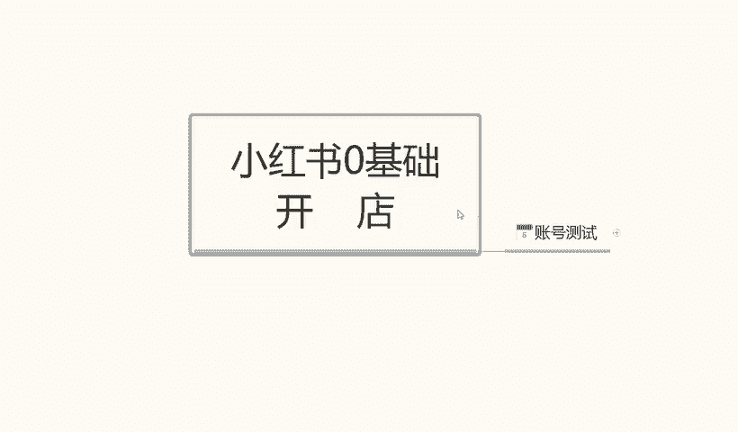
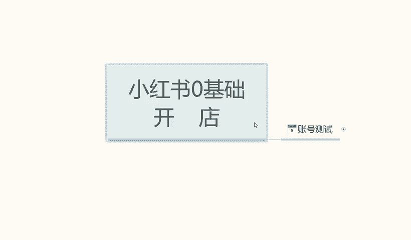
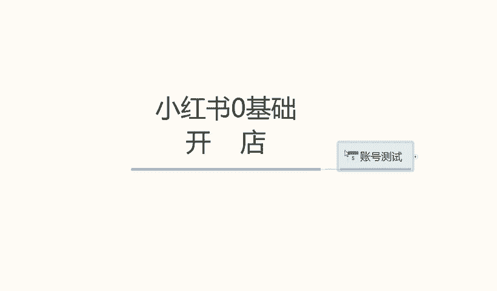
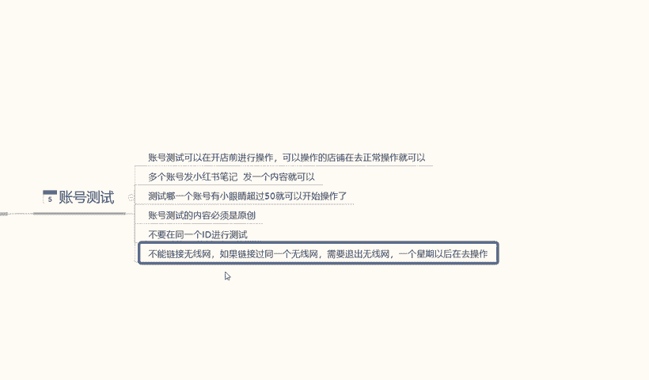
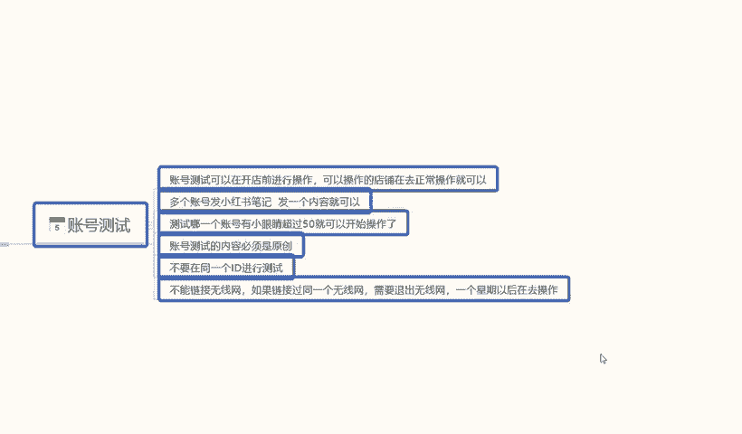
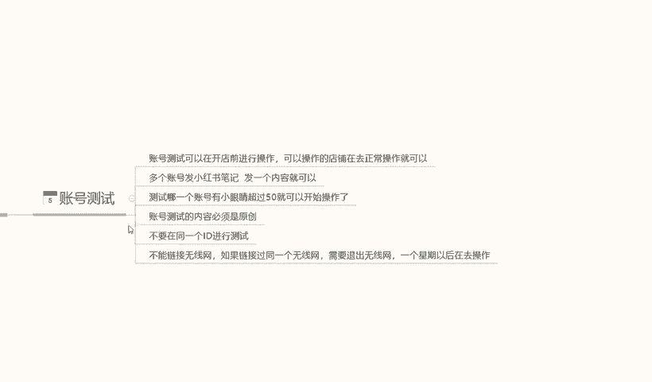
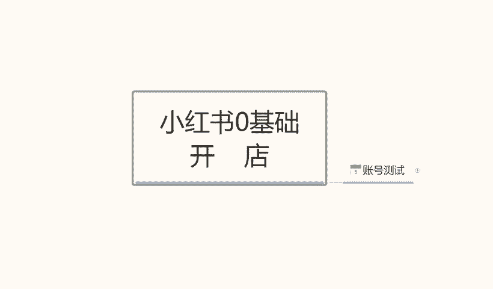

# 140分钟学会小红书运营-原来打造爆款笔记这么简单！！！小白零基础入门必学的小红书笔记公式拆解，最简单的起号教程，快来学！！！ - P6：4.小红书店铺测试 - 红书教程1 - BV1o629YMEjv

大家好，今天给大家分享小红书。林技础开店。第五课时啊账号的一个测试。为什么说是今天给大家分享一个账号的测试呢？因为小红书店铺的话，它和其他的平台不一样，所有的账号创作出来都有权陷。小红书的账号不一样啊。

小红书的店铺账号号，我们创建好以后的话嗯，它不一定都是有权重的啊。就说有的账号的话，拿新号也好，新的手机号也好，而是新人的一个身份证也好，或者说是我们拿有的时候运气不好，拿老号去做。

就是手机号使用3年以上5年以上啊，去注注册小红书的账号的话，有时候这种账号都没有权重的，它这个东西虽然说不是百分之百啊按是10%的概率。

就算是5%的概率，我们去操作你这5%的概率你中纵遭人类，对吧？整个账户都没有权弄，我们做菜做的一个东西去。操作这个小红，投入再座的精力去操作小红书，店铺也没用啊，对吧？因为你账号本来本身就没有权做。

所以说我们在做店之前一定要测试找好，然后再去做小红署啊。

那今天呢主要就给大家讲解一下这个账号测试，我们怎么去操作就可以了。

小红店铺账号的一个测试的话，其实在测试之前啊，我先给大家讲解一下啊，账号测试可以在开店前进行操作啊。就是我们测账号的时候，不要把店铺注册完什么信息全部填写完了再去注再去测试这个账号。

我们一定要在开店之前去测试。也就就是小红书店铺没有开始之前，我们就可以去操作店铺正常的一个操作了。啊，就是。呃，在小红书上面发笔记啊，发同类的一个产品信息啊，测试我们这个店铺有没有权重就行了。啊。

操操作方式呢也比较简单，准备三个账号就可以了，多的也不用三个就我，三个里面的话肯定有一个人操作。或者说我们如果说想多做一些店铺的话，呃，多准备一些账号也可以。但是在这里呢给大家说一下。

就是说我们前面做的话，准备个2到3个账号就可以了。基本上都是百分之百过的。就差了就怕百分之内5%啊，把我们这个号引漏的话，如果说账户内全做，我们操作以后。前期怎么全浪费了，没必要啊。

你测试一下也花不了多长时间，基本上的话也就3天左右吧。3天到5天左右就可以出结果了。这里呢我给大家把操作步骤列了一下。第一个呢是多个账号发小红书的一个笔记，发一个内容就可以。内容不用多。

这个笔记发出去以后的话，它起始之源就是我们笔记纯新的一个账号，纯新的一个笔记发出去以后，大概2分钟以内。他那个小眼睛的话，大概是在20个以上。啊，但这个小眼睛的话基本上没有太大的作用。

它是小红书的一个强推流量啊，它不能确认我们这个账号有没有权用的。我们要观察3天以内的一个数据量，3天以内数据量怎么去观察呢？每天小眼睛在50以上，3天以后整体的一个小眼睛在150以上就可以了。当然了啊。

测试账号里面的话嗯。有几个点要注意下啊，鉴点的我也得给大家列出来啊，测试账号哪一个账号一小金，小眼已经超过50就可以了。每天啊三天要超过150。这个账号的权重的话就基础权重就是有的。

第二个就是账号的一个测试内容是必须是原创啊。必须必须是原创视频，而且你的原创视频时间要超过15秒。啊，最好是控制在20秒钟左右，一定要超过15秒，不然视频的发布不上去啊。视频也好，图片也好。

不管是什么内容，你就算是打个相互的交流，点赞关注之类的都可以啊。但是一定要注意了啊，账号账号测试小眼睛。就是我们这个小眼睛的话，就是我们单品的一个流量推广啊，小眼睛越多，代表我们的账号权重越高。

观看我们的用户越多啊，3天150个小眼睛左右。账号测试内容必须是原创。如果说不是原创的话，没有权重的。你复制别人的产品过来做的话，可能你这个账号有权重，你复制别人产品过来就没有权重了啊，一定要注意。

内容必须是原创，我们可以做稍微做一些修改啊，或者是把别人的产品拿过来以后的话做修改以后也是原创啊，就看我们自己怎么去操作。下面一个点呢就是说不要在同1ID进行测试。我们这两三个账号的话。

就是什么叫不要在同1ID下进行测试呢？一个手机我准备了3张卡，换卡操作，那样是不行的。手机的ID是绑不定的。它绑定的是我们整个手机，不是绑定的手机卡的ID啊，手机卡是没有ID的，手机才有ID。啊。

就是不能换手机操作。我们拿拿这个操作的哈，你用电脑操作都可以啊，但是不能用手机操作。电脑操作里面的话可能需要运用到哪些。呃，一部分对应的一个软件，也就是。插件啊，我去操作也可以，但是会比较麻烦。嗯。

如果说。嫌麻烦的话，建议大家就是拿自己家里面人的手机用不同的ID去测两三个手机就够了。因为我们前面测账号的话也不用那么多，除非我们去做店群，可能用15个20个或者是30个。但我们前期的话没有必要。啊。

一定要记住啊，不要在同1ID进行测试啊。同1ID进行测试的话，账户是没权中的啊。本来你有权重的两个店铺或一个没权重的两个店，11个没权中店铺。用为1个ID去测测的话，这三个店铺都没用了啊。

一定要注意这个一点。最后一个是不能连接无线网。啊，如果说这个手机或者说册这三部手机，我们曾经在同一个wifi下面。啊，使用无线网去操作。需要退出无线网，一个星期以后再去操作。大家一定要注意了啊。

测试的时一定不能使用无线网，一定要用手机流量。同时手机流量操作的时候，我们这个手机里面的无线网就是wifi。绝对不能在一起。如果说这三个手机都连过这个wifi，一定要一个星期以后把wifi断开。

一个星期以后再去操作，不然的话没有权通，也测不试不出来效果。它的一个数据全部是叠加的啊。

那样的话就这整个测账号测试的话基本上就白做了。所以说大家一定要把这几个点分分辨好。分配好了以后的话，我们再去操作，把这些准备做好以后的话，我们再怎么去操作都没关系了啊。

比如说所以说我给大家说的这个账号设置的话，一定要在开店前就去做一下啊。

这个呢就是我们今天的一个账号测试内容。下节课呢给大家详细讲解一下。小红书的一个整体操作模式啊，我们怎么去做我们的小红书店铺啊，它的模式也是不一样的，操作方法也不一样。

