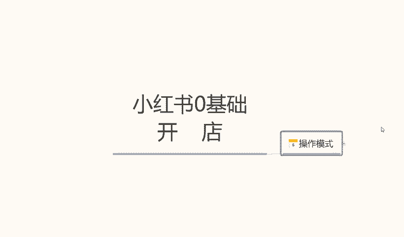
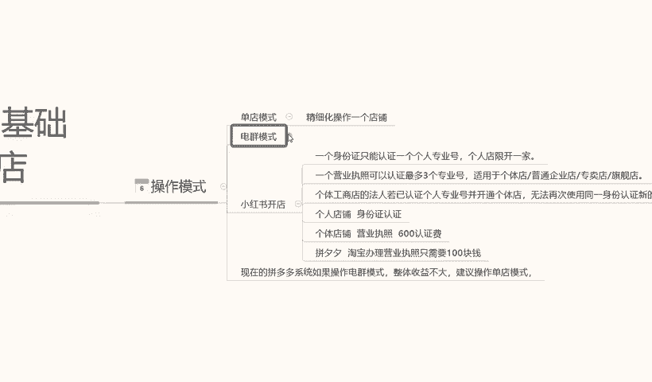
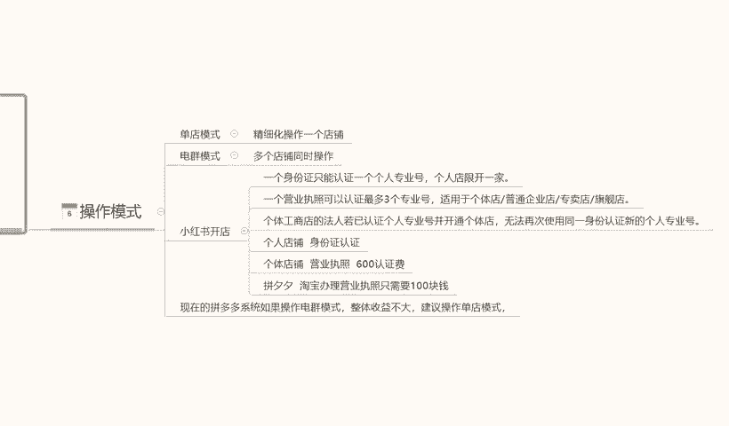
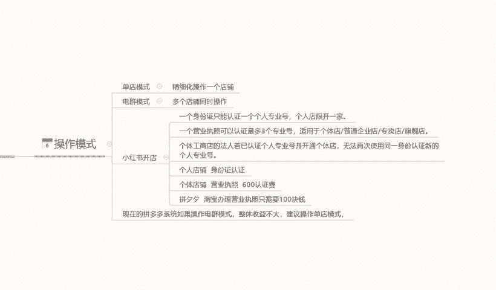

# 140分钟学会小红书运营-原来打造爆款笔记这么简单！！！小白零基础入门必学的小红书笔记公式拆解，最简单的起号教程，快来学！！！ - P7：5.小红书店铺开店 - 红书教程1 - BV1o629YMEjv

今天给大家分享小红书宁技础开店的第六课时。店铺的一个操作模式。

小红书店铺的操作模式的话，我们其实可以把它分为几种的一个类型。

这里呢我给大家简单列了两个点啊，第一个呢是灯电模式，第二个呢是电池模式。后面呢是讲解我们小红书开店我们需要准备的一些数据。首先我们讲解一下什么是单店模式。单店模式的话，它其实呢是比较简单理解的。

它就是精细化操作。我们做一个店铺就可以了。就是小红书店铺我们不用做多，做一个店铺就可以了。第二个呢是店群模式是多店铺同时操作。

就说做的是店群我们可能拥有的店铺是10个、20个、30个、40个或者是50个店铺越多，我们投收益也就越大。当然了，它相对的一个投入也比较多。首先呢我们了解一下单店模式，精细化操作一个店铺。

这个的话就是说。我们在操作小红书的时候，我们不需要把这个精力的话全部用在那个电区模式里面。它和电区模式的区别就是一个是单店，一个是多店。单店操作的话，它会相对来说我们新人玩家操作整个店铺的一个数据是。

简单一点啊，而且前期投入也比较小，呃，不像电池模式投入的话可能会稍微大一点。但定模式它的优点在什么地方呢？嗯，投入小。侧重点高。什么叫侧重点高呢？就是说我们操作这个店铺的话，它可以一直操作。

而且店铺的话不需要经常更新啊，只需要定期的发布一下我们的一个笔记，或者是更新一下我们的产品的一个内容。然后呢参与整个小红书店铺里面的一些活动啊。等等之类的。他整个。

整个投入的话对比电讯模式来说的话要小很多。但是它的一个利润点的话，其实和电驱模式的话差不多，呃，可能会比电讯模式还要高啊。也可能如果说我们操作不当的话，就会比电讯模式稍微小一点。这个呢就是单电模式。

它的一个操作模式的一个。大概框架啊，为什么是大概框架呢？因为单店模式操作的话，它精细化要求的话比电取模式要多很多。它所有的内容全部都是精细化的。也就是说我们要把这个单店啊做的非常精致。

电池模式呢多电的操作。这一里呢我就给大家讲解一下什么是多电操作啊。多店操作的话，它和单店模式不同的字素，就是说我们一个人要控制很多个账号。正常的话，我们一个人控制小红书的。多店里的话。

一个人大概可以控制10个店铺左右。也就是说我们在操作店区模式的时候啊，一个人一天。因为它的操作是比较重复的，只能控制10个店铺左右，就是每天不不停的更新我们店铺里面的数据，一个一个人的话。

大概可以操作10个。如果说说操作店区模式，我们有很大的规模，或者说是我们整个产业链啊，就是我单品产业链里面的话，我想把这个店铺做起来，我可能会找4个人，5个人或者6个人做5到60个店铺。

然后每个店铺里面去操作啊，当然操作它都是统一的。因为不统一的话，我们没办法操作这么多店操作模式是统一的。但是它的内容的话是每天重复的需要去更新发送。也就是说我们这个店区模式的话。

是没办法像单店模式一样去精细化，我们整个店铺里面的一个数据的。它这个就是单电模式和巡电模式两个区别。第一个呢，单电模式要对于个人来说的话呃，投入小简单一点。电池模式的话就是投入大啊，操作复杂一点。

但是它的一个收益效果的话，会比它起店啊比单电模式会容易很多。收益的话其实是差不多的。只是说它起店的话就不像小红书那样。呃，小红书我们做的话可能兼职啊或者是做些什么的，其他的事情都可以做单电模式。

但是电去模式的话，就一定要全职了。为什么呢？因为你没有其他精力再去做别的事情了，你每天光管理这10个店铺的一个时间量。就被你忙的。所以说这就是单电模式和群电模式两个区别。

那么下面呢我给大家讲解一下啊单电模式。嗯，今天在这节课里面呢，我就不给大家多讲，因为它的一个内容特别精细化，啊，会涉及到的点非常多，没办法多讲。那我这里呢给大家今天主要着重讲解一下电池模式。

电池模式的一个操作方式。电池模式的话。嗯，它整体的一个操作模式的话其实都是差不多的。这里面的话开店它这里面唯一涉及到一点就是我们店池模式开店怎么去开。小红书开店啊，我们前期呢也有课程给大家讲解了。

小红书开店的话，一个身份证只认认证一个专业好啊，限定开机啊店铺。但是如果说我们有营业执照的话，是可以开三家店铺的啊。也就是说我们一个身一个一个本人的身份证，可以开三家的小红书的一个店铺，找三个人。

或者是4个人就可以开12家左右的一个店铺，适用于个体店铺，或者说是企业店，普通店的一些营收。然后呢，这个里面给大家讲解一下啊这个。讲解内容是什么呢？讲解的就是说我们怎么去办理。多个店铺的一个认证。

个体工商的话，法人。

若已认证个人专业店并开通个体店的话，无法再使使用同一身份证。所以说我们要找两三个人的身份证拿它去注册。你自己注册也可以，你找别人代办也可以啊。这个里面的话看你们个人代办的可能话可能。

价格方面的话可能还便宜一点。如果说自己办的话，就是说安全稳定一点，代办的话有一定的风险性啊，这里能给大家说清楚，然后个人店铺的一个身份认证，个体店店铺营业执照认证费是600。啊，如果说我们去。

PCC或者说是某保办理营业执照的话，只需要100块钱。但是营业执照个人认认证费是。我们自己出的啊。你要大家要搞清楚啊，营业执照认证费是自己出的，让找别人帮你代办。

只是说帮你去完成完成了一个跑腿的一个工作而已。啊，也就是700块钱左右办一个下来，一个下来的话可以开三个店。三个店的话，你整个一个人一个人操作十几个店铺下来的话，大概就是需要。两四千万，11块钱左右。

啊，这10个店铺你就能申请下来。也就是说你可以开4家店，但这10家店的话，我们再去操作的话，每家店有1000的保证金。就相当于是1万块钱，也就是1300013000的话，再加上我们其他的一些投入。

其实他基本上也没什么投入了。因为它不需要像单店模式一样，需要去啊整理资料啊，囤货呀，或者说是一个资金周转。因为它不需要啊，它只需要我们前面它也需要资金周转，但是没有像单店的话可能需要总的没那么多。

它这个里面的资金周转的话会费用会少很多啊。但是他前期的话费高，不过这些钱呢都是可以取出来的，就看我们自己怎么去判断了。只是他前期第一笔投入的话，比对比单店的一个投入的话会大很多。单店前期投入的话。

大概在5000块钱左右。像店区模式一个人一个人啊自己去操作的话，可能就要1300015000左右。如果说是你要操作更多的店，220个点、30个点、40个店，那么按照我这个方式。

你们大家自己可以算一下大概需要多少钱。5万块钱左右。就是说整个电区模式做起来的话，大概前期投入的话，需要5万块钱左右。所以说大家一定要注意的啊，单店模式和电讯模式它的区别就在这个两个点。

第一个单店模式的话，投入小啊，收益可以，但是整体精细化的一个操作的话，就看我们个人的一个操作能力了啊，能不能把自己的小红书店铺做起来。电区模式就不一样了。电锯模式的话，它的操作会简单一点。

但是我们做小红书店铺之前还可以走入电梯模式，现在做电信模式的话，收益其实也没那么高了啊。所以说大家呃对于整个小红书店铺的一个操作模式的话，怎么去操作，自己选什么模式去操作。就看我们大家自己了。

然后现在的话。嗯，说实话啊，现在整个系统里面的话，就是说呃某淘也好，某多也好，它的一个电讯模式都是不适合的。但是在小红书里面的话，整整体来说电驱模式可以操作，但是。对比其他两个平台啊。

它可以操作小红书里面建设操作店区也有一定的收益，但是这个收益时间的话不能保证了，因为它的整个系统的一个体系的话正在慢慢的成熟。所以说我们大家在选择操作模式的时候啊，大家多注意一下。

建议大家的话还是说去做单电模式好一点。电曲模式的话，因为前期投入太多了，没有必要啊。我们把单电模式学习透了以后的话，再去做电群也会容易很多。那么这节课的内容呢就到这里，下一节课呢给大家详细讲解一下。

我们整个的一个。小红书的一个商品管理啊，它里面包含了单店模式的一个商品管理和一个店全模式的一个商品管理。

