# 140分钟学会视频号运营-原来打造爆款视频这么简单！！！小白零基础入门必学的微信视频号视频公式拆解，最简单的起号教程，快来学！！！ - P10：5.如何制作引导下单的视频 - 少年镜是 - BV1kqsheLEQM

好，同学们，大家好，这节课给大家录制一下，就是我们如何制作那个引导视频啊。我们知道就是我们视频号里面这个。就是让别人下单的这个可以说在简介里面去留啊。简介里面。我就直接复制了啊。在简介里面去留也可以。

然后别人点开你的主页之后就可以看到了。然后还有一个就是在这个视频的这个没错，评论区自己去引导也可以。然后这个模板大家就模仿我的这个就行了啊。

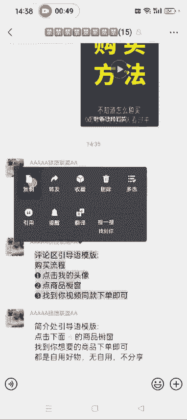

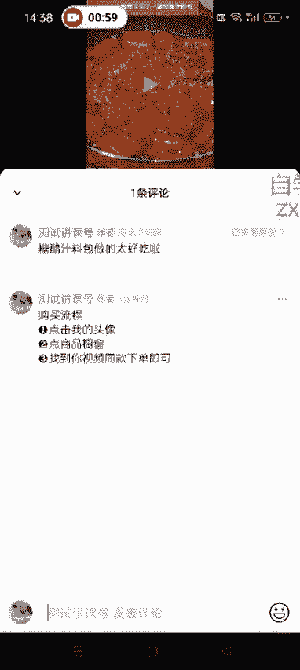

然后觉得不好，还可以把它删了啊。

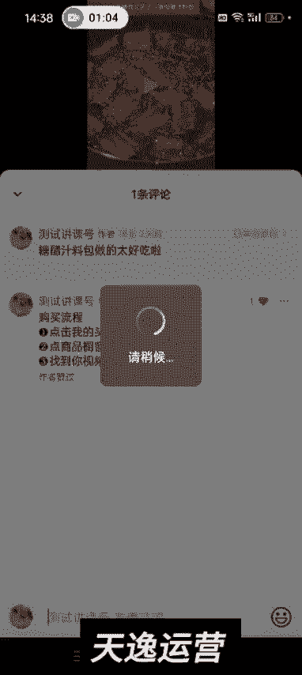

还可以删了，然后重新去编辑就行了，知道了吧？就是你那个视频一般发了之后，就可以在评论区去这么引导一下。呃，然后你那个设置你你的头像名名称的时候，就直接在简介里面去设置。嗯。

把那个就刚才那句话复制过去就可以了啊。嗯，还有一种方式就是我们在那个制作一个置顶的视频，就是大家我估计刷视频号也看到过这种啊，你你像他这个。

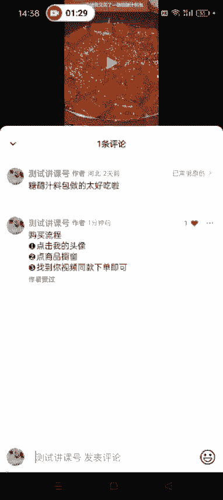

就如何购买的这个不知道怎么购我们点开它的主页之后，可以看到它第一个视频就是置顶的这个就是教别人怎么购买的啊。不知道怎么购买同款好物的家人看过来在这里点击商品橱窗，然后在这个搜索栏里面打上关键词。

比如猪油罐，点击进去下单即可。

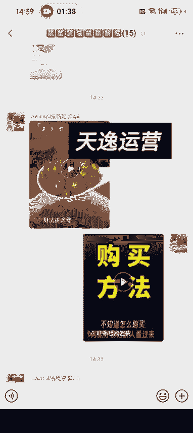

不知道怎么购买啊。可以模仿他这个去做啊，呃，做的方式呢就是你点开自己的这个视频，没错。

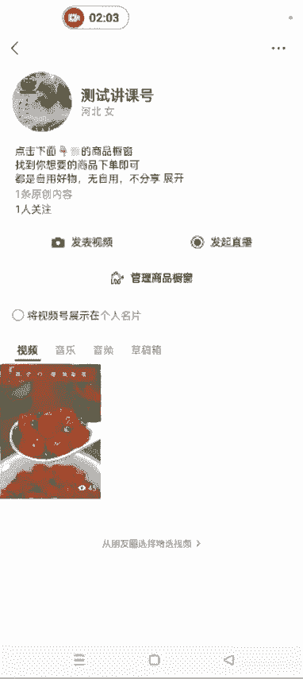

然后随便发给你的一个微信号。

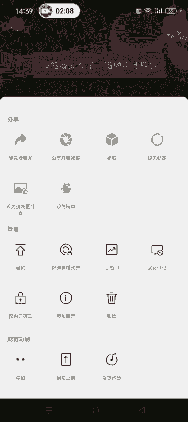

比如说这个啊我随便发。

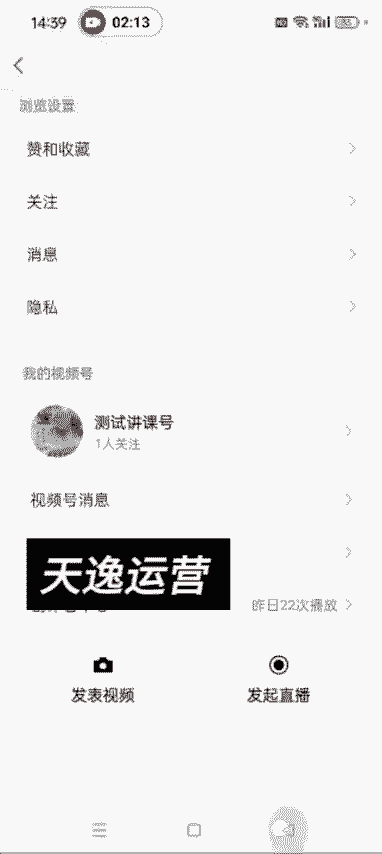

然后我换一个视频去录屏。我点开这个视频之后，换一个视频去录屏啊，就是录刚才你转发的这个视这个视频。特别喜欢吃。这样的话，你才是这个观众的这个能看到的这个界面，知道了吧？我现在正录着屏呢。

我就不那个不实操录了啊。刚才我已经提前录好了。

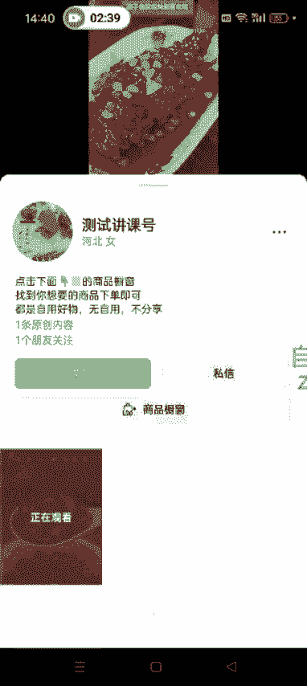

然后我们录好的那个视频直接添加到剪映里面，就这个就是刚才我录制好的那个视频啊。呃，我录的用确实是咋做咋好吃，录的有点长啊，就是大概知道大家大概知道是怎么个意思就行了。然后我们就可以在这个地方添加贴纸。

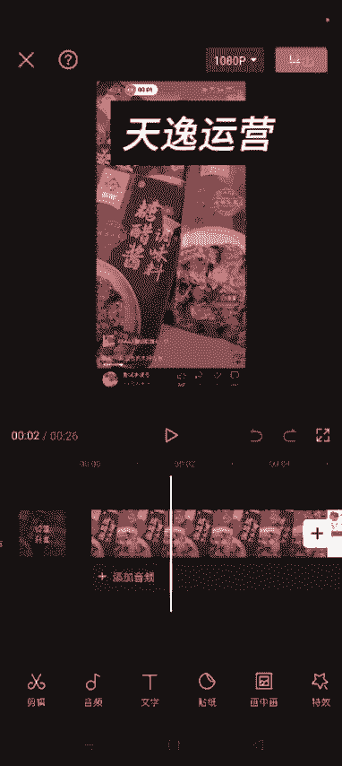

箭头直接搜箭头。

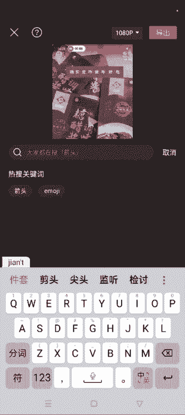

它会出来很多箭头，对吧？然后我们随便添加一个这个方向可以调啊。然后把它拖到这个位置。然后可以添加文字。文字模板。然后样式啊什么的就可以随便选啊。点击我头像。还有这个位置啊什么的也可以调啊。

颜色啊什么的都可以编辑啊。还字。随便找一个免费的就行。比如说这个吧，然后点。把它。调大一点放到这儿。然后你看这个位置啊，跟这些都对齐啊。跟上面这个都对齐。然后大概就是大大家知道你怎么个意思就行了。

然后到了这个这个界面之后，我们继续添加贴纸。

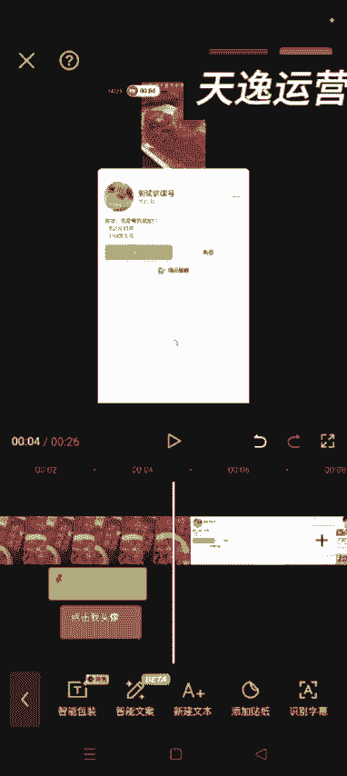

圈儿。

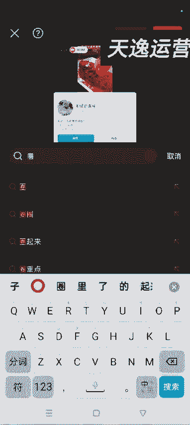

🎼哎，是孩子在家。

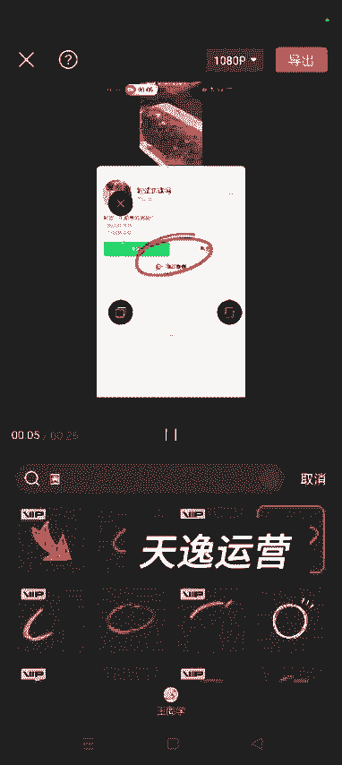

如果太长的话啊。太长的话，就把它缩短一点。

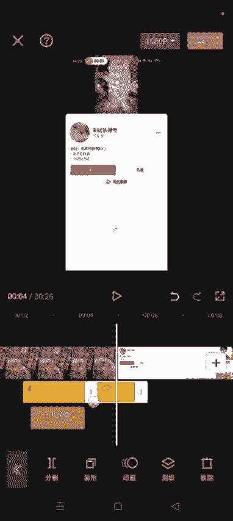

然后继续在这个地方添加文字就行了啊。

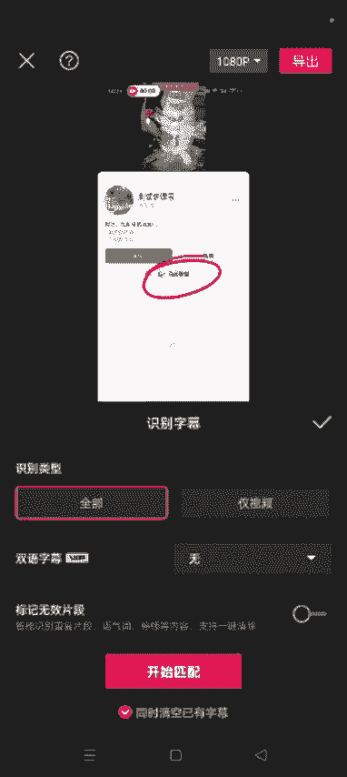

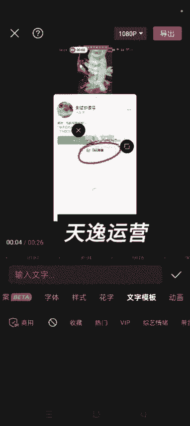

点击。商品橱窗。

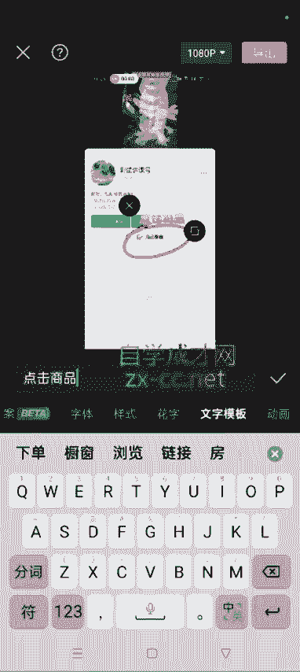

嗯，就可以了。看到没是吧，就大概就是这么做啊，我就给大家演示一下。后面你们这个剪映熟悉了之后，做这种视频那就是小意思了啊。就现在就是先知道一下怎么做，怎么去引导就OK了，好吧。好，这节课讲到这儿啊。

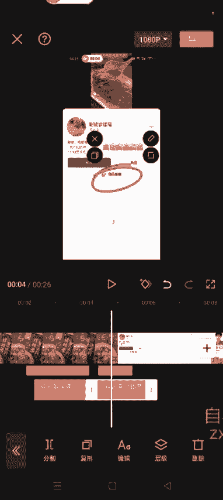