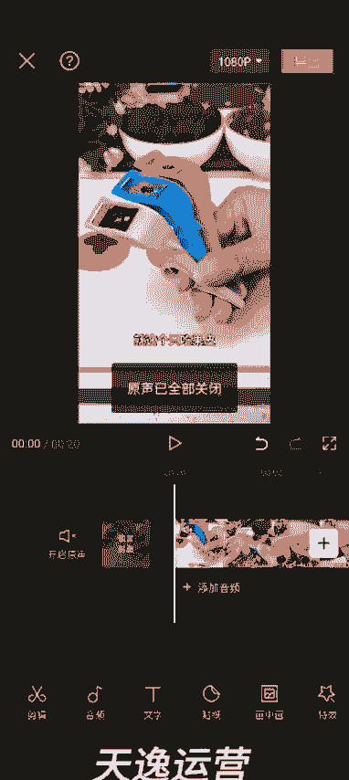

# 140分钟学会视频号运营-原来打造爆款视频这么简单！！！小白零基础入门必学的微信视频号视频公式拆解，最简单的起号教程，快来学！！！ - P18：8.短视频变声，配音的两种方法 - 少年镜是 - BV1kqsheLEQM

好，各位同学大家好。这节课我给大家讲一下，就是我们呃在混剪视频的时候，如何给这个视频的声音去做驱重啊，两种方式，一种方式是直接在剪映里面实现。第二种方式是用配音神神器重新生成新的配音。我先讲第一种啊。

就是我们今天上午做的这个视频，20秒的这个啊，然后高清添加进去，就这个只吃果皮不。然后他这个视频的原声是一个女生，对不对？然后我们选中这个视频。左边儿。滑动找到声音效果。

直接在剪映里面可以给他这个声音做一下变声啊。🎼就这个皮，这个是圣诞老人的，这个是台湾小哥。🎼就这个只吃果皮，不吃果肉的削皮细啊，🎼呃，很多种选项啊就是免费的，完全够我们用。比如说这个男生的消帅狗共同。

然后像这个男生的这种，他还可以调节参数。🎼做这个只吃果皮，不吃果肉的消不然。

这样的话也可以做到这个声音的去重啊。嗯，大家在做混检的时候尽量都做一下，呃，这是一种方式。这种方式呢就是它这个声音变了，但是它这个视频的背景音乐是没有变的啊。还有一种方式就是我们通把这个视频通过。呃。

配音神器。去把他这个视频的文案提取出来。相册里边找到我们做的那个视频，这个20秒的这个，然后把文案提取出来。重新用配音神器去生成新的配音啊。然后这个文案文案的话，我建议大家简单的修改一下啊。

这修改一下文案，就是他说的这些话也可以做到这个驱虫的效果啊。呃，修改文案的话，就是尽量的不要让他多字或者少字。你要是呃多的话，多一个半个的也没事儿啊，尽量的不要多。你比如说里面这个老人，你给他换成大人。

然后就按照我说的这个逻辑啊去改就行了。大人给小孩砍皮的时候，我们还不放心。怎么办呢？怎么办呢？咋办呐？是吧改成咋办呢？不知道是谁研究了去皮气，直接把它放在水果上面转。几圈水果皮就下来了。呃。

大概的话就是嗯水果皮就。Xiao。掉。了啊，就是大概就按照我这个逻辑去改就行了。改好了之后，我们把这个文案复制，重新用这个配音神器去生成新的配音就OK了啊，制作配音。然后把它粘接进去。

然后选择一个你喜欢的声音。比如说我选择一个男生，对吧？然后合成配音。就这个只吃果皮不吃果肉的消脾气啊，不分享给你们，然后导出配音。😡，下载配音。歌取。

哎，这个时候我们打开剪映。点开始创作，找到这个原来的这个视频高清添加进去，这个时候把原声关掉，然后添加音频，提取音乐。

就是用我们刚才这个。就可以了啊。就这个只吃果皮不吃果肉的削皮屑。哎，这样的话，它这个呃原来视频的这个背景音乐什么的也都变了啊。这个时候我们可以添加自己的音乐进行。

🎼我们的。然后这个音乐声音你可以给它调小一点，就这个只吃果皮，不吃果肉的小皮气啊，不分享给你们，我真怕你们水果吃白虾啊，明白了吧？这个时候然后我们再可以把这个。诶。呃让他识别出这个文案来啊。

再按照我们之前教的那个混检的方法去搞就可以了啊，好吧。好，这节课就讲到这儿啊，大家知道一下这个方法就行了。

