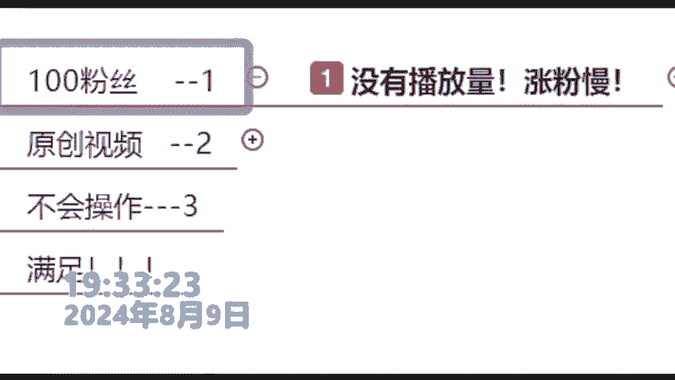
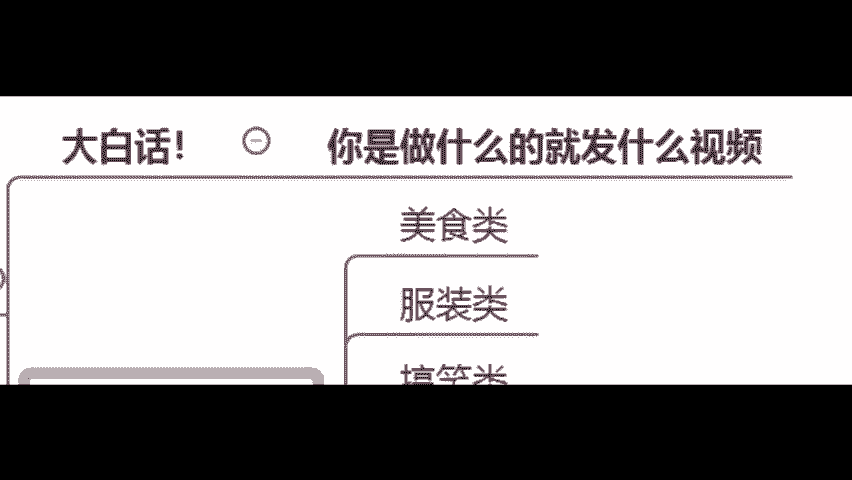
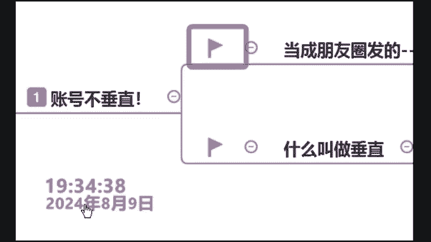
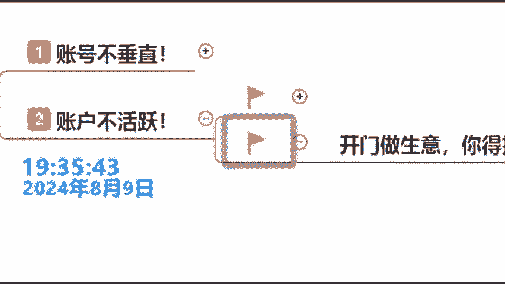
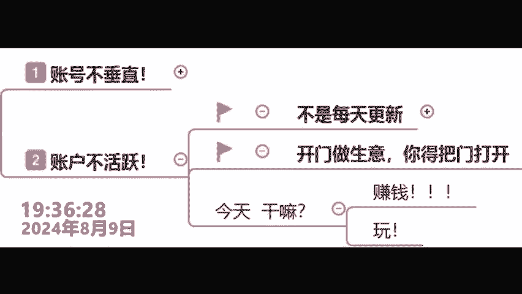
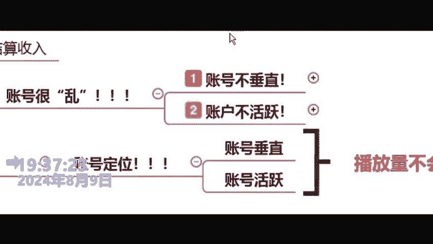
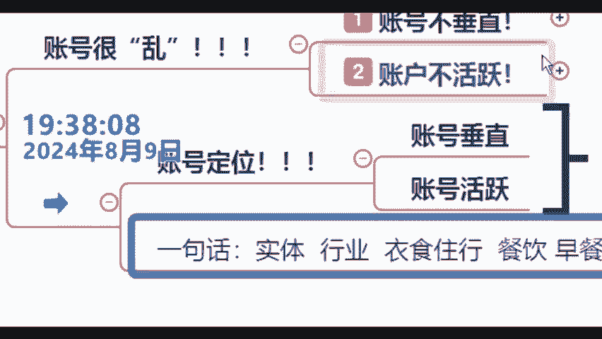
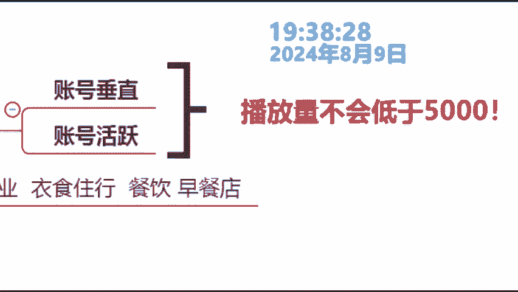
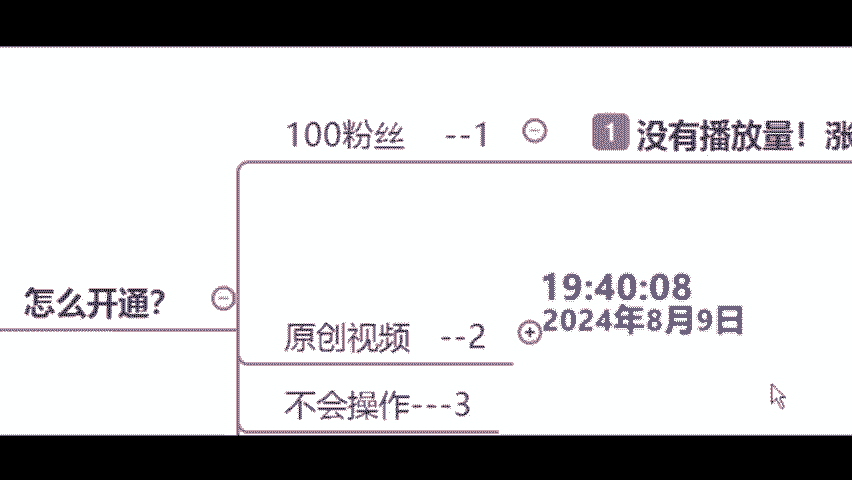
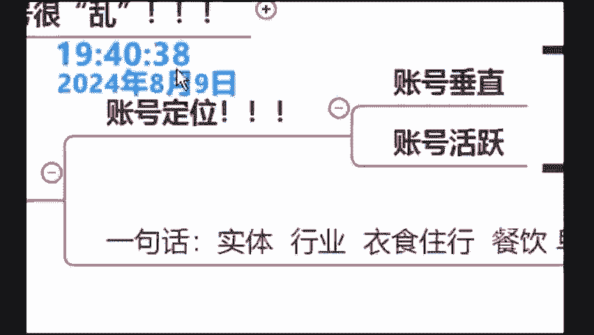

# 140分钟学会视频号运营-原来打造爆款视频这么简单！！！小白零基础入门必学的微信视频号视频公式拆解，最简单的起号教程，快来学！！！ - P22：6.如何开通视频号 - 视频号教程_ - BV1obxLebEWZ

首先我们来看一下啊。100粉丝我跟大家讲，其实很简单哪。那各位为什么你到现在没有100粉丝啊？我告诉你为什么？因为你们现在你们的这个账号啊播放量比较低，涨粉比较慢，那为什么是这个情况呢？来，各位。

你们现在的播放量是不是只有几十几百是这种情况来试的话，你给老师我打上一个什么市字那哈不限制年龄哈，不限制年龄哦，你得有呃你得有你得成年呢？各位你得你得成年，不然呃你挣的钱是没有办法提出来的哈。

必须要成年，你就没什么限制啊，但是必须得成年嗯。😊。

那为什么你只有几十几买了？因为各位同学记住啊，因为你的账号很乱，什么叫做乱呢？因为你的账号不垂直，你的账号不活跃，听到没有？那什么又叫做垂直呢？各同学好好听啊。那张老师我用这种大白话来讲呢。

就是说各位你要做什么东西啊，你就发什么样的视频，怎么说呢？比如说你想做个美食类的账号，你就发美食视频，听到没有？你想做一个服装账号，发服装账号就可以了。你想做个搞笑账号，你做搞笑类的视频就听懂了啊。

听到没有被限流了，是不是会给大家解决的啊，包括说隐藏啊，这种东西告诉大家怎么进行转型O房产也是一样的好吧？各位同学你来看清楚好吧，那为什么很多同学老师我每天也在兼持发呀，比如发一个那为什么不行呢？

听清楚来各位你们现在是不是把视频号当做朋友圈来发来试的话，你给老师打上一个数字一样啊，我给你举个例子啊，各位。😊。

啊，举个例子，比如说你今天啊你自己认为啊你发了一个什么啊，这个美食视频，对不啊？那就是一个美食的账号啊，明明天又发一个什么搞笑类的，就变成了搞笑视频了，你又发一个风景了，又变成了风景。所位所谓的垂直啊。

它就叫做专一，听到没有啊，这个专一懂不懂？来懂的话，给大家打个懂字，你如果就一直发一个类型的嗯。😊，听到没有？你就要一直发一个类型的来比如说我们来看一下刚才这个同学他的账号来，你们看一下啊。

你看这个同学他的账号。😊，全部都是搞笑类的，看到没有啊？比如说这个滑冰啊，对不对啊，包括这个啊冬天之后长得什么，看到没，是不是全都冰雪相干的？😊，啊，全都是跟冰雪相关的这个就叫啊垂直专移。

听到没有垂直专家听到没有？那第二个是什么东西呢？来各位那就是你的账号要活跃啊，这一点其实比较简单了。这位同学怎么说呢？各位就是说各位很简单，我们现在啊你在互联网上是不是想要挣钱。

那你想要挣钱就相当于你在线下开了一个实体店只不过说你这个实体店在什么在互联网上啊，在互联网上对天天发，那你开门做生意，你是不是得天天开门呢？来同学不是你是不是每天更新的，是的话，打个是不是的话。

打不是对不对？你想要挣钱，你肯定要干什么呢？肯定要什么把门打开呢？比如说你比如说我心情好，我开一下门，我心情不好，我就不开门。各位同学，那这样肯定是不行的听到没有啊，三天打一两台晒网。

所以说今天我希望大家搞清楚一件事情，你今天过来你是来干嘛的？听到没有？那有同学老师我是来学学赚钱的好吧，那你就把赚钱两个字给老师打公屏上啊，老师我是来玩的。哎，我是来打。😊。

时间的各位同学，那你就把玩儿字打在公屏上。各位，如果说你是来玩的那我告诉你啊，张老师我讲的话啊，你就不用听，听到没有？各位，但是如果说你想要来赚钱的话，我告诉你，那张老师我讲的每一个字，你倒要听清楚。

听明白，为什么这样讲呢？因为对于张老师，我而言，各位同学啊，赚钱是最重要的东西啊，你不要跟我讲那什么七戚八里乱七八糟的东西。各位同学钱是什么东西啊，钱对于我们男人来说是我们的脊梁啊，对于很多女人来说。

就是他的自尊啊，对于老年人说就是他的底气啊。😡。

啊，赚钱才是最重要的。各位同学认不认可来认可的话，打成这个梁字是吧？现在这个时代，我跟你讲，钱能解决99。99%的问题嗯。😡，能你吧？你看一下啊，你好好感受一下，大老师我一节课能不能让赚到钱，好吗？

这是鬼。😡，那刚刚几分钟，张老师呢，我就把关于咱们的这个什么账号定位啊，这一句话啊就给大家去讲清楚了。各位同学，你按照张老师我搞这东西，对吧？你的账号定位搞清楚了，账号垂直了，账号也活跃了。各位同学啊。

现在关于定位明不明白好吧，明白同学打算明白，不明白同学打的不明白发生明的很难啊各位同学好好听啊，一心赚钱，那这节课就好好听，明白对不对？O所以说各位啊你们听了很多的课啊，觉得这个定位搞的这个就不明白。

我说实话，张老师我一句话就给你们教明白，就我说的大家应该都是经过实体跟我们的线下的啊实体当中你想做一个行业，你是不是要选择一个行业啊，行业，比如说这个衣食住行啊，你得选一个，比如说选择我们餐饮行业啊。

做一个什么早餐店，听到没有？你你在线下做生意不是这样做的吗？不是这样选的吗？那一样的，你在互联网上也是一样选了啊来都懂了吧？来懂的话。😊。

唱歌当然也可以啊，嗯，OKOK好吧，各位所以说各位如果说你按照张老师我所讲的对吧？你的账号地位搞清楚了之后，来，你去参加我们的创作者分争计划，你每个月的收益啊。

每个月的播放量每一条作品的播放量是不会低于5000的那对于5000的收益是多少呢？😊。

如果说你有幸参加我们创码收益是多少？okK我看有多少同学是认真听课的，好吧，我来看一下。来恭喜这位啊老郭同学回答正确啊，就是咱们的50啊啊，简简单同学啊，不是咱们的500啊啊，是咱们的50块钱啊。

包括我们的杨淑敏同学啊也回答正确，就是咱们的50块钱。各50块钱不多啊，50块钱不多，但是各位你买个菜，你买包烟是不是没有问题啊？各位同学，你们说是还是不是，而且我跟大家去讲各位同学啊。

千万不要瞧不起这50块钱，各位同学什么意思啊啊，各位同学就是我不知道大家有没有发现一个问题啊，对吧？很多有钱人他很抠，就你发不发财的，跟着50块钱，有很大的关系，对吧？各位，为什么很多人他发不了财。

因为他大钱呢他挣不到，他小钱呢他又看不上，各位同学晒是不是你包括有同学说老师50块钱，我打工也可以啊，来跟同学，你不要着急啊，那今天张老师，我为什么推荐大家去做这样的一个计划呢？各位同学，你看清楚。

我刚才是不是跟大家去讲的一个点啊，讲了一个什么点呢？各位。😊，就是我们这个玩法除了有咱们的一个什么啊提成之外，还有一个什么东西呢？还有咱们的一个什么保底啊。各位同学还有咱们的一个保底啊。

各位同学听懂没有？所以各位你不用着急啊啊，张老师我今天这前说了，一节课教大家把这个钱挣到来1。1点给大家去讲，因为刚刚几分钟，张老师，我是不是把咱们的这个什么100粉丝给大家解决了。

现在这个100粉丝大家学会了没有？来学会同学给老师打上一个会子啊，你按照张老师我说的，把你的定位搞清楚，把你的垂直搞清楚，把你的活跃度搞清楚。来，你一般来说啊，张老师。

我自己应该是一天时间就可以涨到100粉丝。但是各位呢你们可能需要2到3天，为什么这样说呢？因为你们的账号之前有发过啊，包括有同学说老师之前东西嗯。😊。

稍等一下，各位啊，喝口水。

