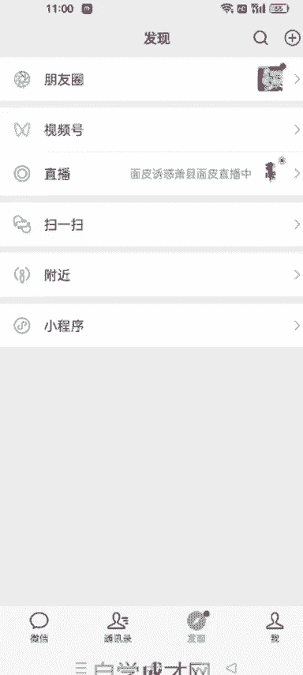
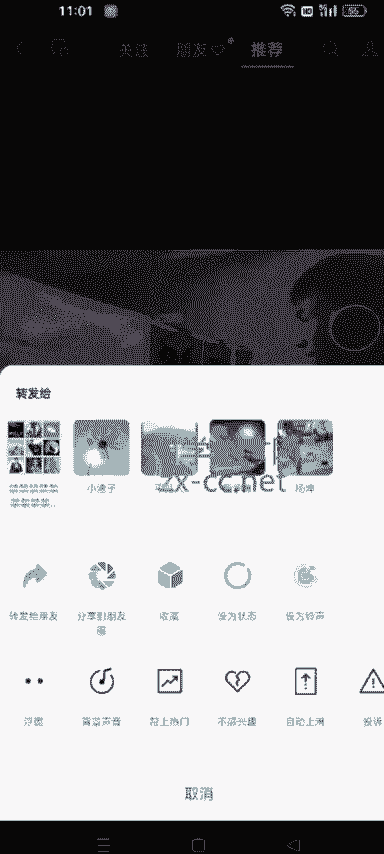

# 140分钟学会视频号运营-原来打造爆款视频这么简单！！！小白零基础入门必学的微信视频号视频公式拆解，最简单的起号教程，快来学！！！ - P30：4.如何刷垂直账号 - 泪水大师猪脚饭 - BV1uCs8epEd3

呃，各位同学大家好，这节课给大家讲一下，就是我们如何半个小时之内把自己的账号全部刷成是带货视频的这种账号啊。因为我们做短视频带货嘛，就是把自己的账号刷成这种类型的。有助于我们后面呃就是找对标账号。

或者说有了什么最新的爆款之后，大家也可以第一时间去看到啊，呃这节课呢就以视频号为例。呃，其实抖音的话，它跟视频号道理是一样的啊，就是呃视频号你像前两年它还没有这个功能，就是这个兴趣推荐还不太精准。

抖音的话一直是可以啊，就是十几分钟的话，就可以把自己的账号全部是刷成你喜欢的这种类型。然后呃为什么要要这样去刷呢？就是因为很多时候视频号的一些大爆款啊，就是你看着那个视频可能也没怎么样是吧？

但是人家就是评论区，很多人在问。怎么买这种视频，你如果不经常刷视频号的话，呃，可能就是系统他如果不给你推荐的话，对吧？你有可能一辈子你也刷不到啊。然后我们可以看一下，我不知道你。

我不知道你们有没有在抖音上见过这个人仁和匠心的这个洗面奶啊，前段时间火的时候，这个视频有的点赞能到40多万，就是他那个点赞量40多万，评论区全部是在问这个东西怎么买，大家可以看一下。미。Just。

你看这个视频，它它其实没有什么技术含量啊，这些画面什么的都是通过混剪拼凑弄到一起的。然后前边的话就是哎呃看到自己前男友，看到自己的前女友了是吧，长得这么漂亮，改变了很多，然后也想着自己也要改变。

因为自己脸上有黑头是吧？然后觉得一定一定要改变。有黑头一定要改变。有的视频就是一个中间这一块，就是一个男的满脸黑头，完了之后用了这个洗面奶之后，脸特别白了，然后后面再突出什么什么样的效果，这样的话。

比你直接去讲这个人和洗面奶要好的多。你如果在视频号直接我们如果发带货视频的话，如果你直接发这种的这样啊，就是这个人和洗面奶，他如何如何好，像这种的，他系统是不会给你流量的，知道吧？

但是你以他这个视频的这种方式发出来，流量就会好，对不对？这个就是网感，其实很多人做短视频，我发现就是呃他那个逻辑就是以为我把这个东西，把他那个简介啊，几张图片发到视频号就以为就会有人买。

其实不是这样的啊，那个就是真的是非常小白的想法，就是没有网感。就是我们在比如说搬运视频是吧？然后去水印这些我一教你就会。但是网感这个东西你需要你去刷大量的视频去培养的，知道吧？你刷上一两个月。

你的网感会有一定的提升。这个其实呃就是我跟你我跟你说是说不明白的，就是靠自己去多刷，知道吧？网改这个东西真的是靠培养的，后天形成的，它不是说你与生俱来的就有啊。

所以说我们把自己的账号刷成这种全部是带货视频的这种账号，你看看那些大的爆款，就是他那个点赞量几万的这种是吧？在视频号点赞量几万的这种，包括评论区都在问怎么买的这种视频，它是以什么样的方式突出这个视频。

呃，就是刚开头什么样，然后中间什么样结尾什么样是吧？然后带货于无形当中，然后下边很多人，而且也在问怎么买。就是我们刷多了这种视频，后面你在搬运视频的时候，你也会有对应的这种网改，知道了吧？

啊。王者续然后比如说我刷视频号，我想刷带货的是吧？你像这种呢，它就是跟我们这个兴趣不相关的这种，就就直接划走。就是一秒钟也不要停，就直接滑走。呃，有很多人在刷的时候可能遇到自己喜欢看的。比如说汽车的呀。

或者说搞笑的这种可能会停留啊。如果你那个大号，你你平时想看的，你可以这样去搞。然后你小号的话，就一定要按照我这个方法，遇到不喜欢的，不是带货的就一秒钟滑走，一下都不要停。今年。他这个应该是带货的吧。

是吧应该是带货的。🎼或者说点不感兴趣，为什么大家都讨厌特斯拉？因为特斯拉都不管喝多少始都没有用，这种感觉别提多难受。怎么也想到到，经历了摊刀片之后，还有无尽的意义吧，像他这种应该就是就是带货的了。😡。

而且是还是在直播当中是吧？你看而且在直播当中，它里面有挂商品，就是卖的他这个。视频里边显示的这个东西，像这种的我们可以看完，然后点个赞啊是吧？评论区那个留个言啊什么的都可以啊。1。遇到不喜欢的。

要不然就直接划走，要不然就是长按视频点不感兴趣。

来来，你就按照我这个方法去刷，大概有半个小时的时间。呃，你这个后面你再打开视频号的话，基本上有10个视频，有最少有一半以上的，他会给你推带货的视频。这样的话，比如说视频号有什么大的爆款。

我们就会第一时间收到，知道吧？这样的话就是我们参考别人这个视频是怎么发的。这样的话，网感慢慢就会提升啊，是这样。一个方法就是啊。不感兴趣朋友们要不然就直接划走啊。然后遇到喜遇到这个带货视频的这种点个赞。

然后评论区留言一下，知道了吧？两家养驴鱼会兽合伙应用。他这个应该是带书的啊。方法呢就是这样啊，大概你就按照我说这个方法。不是带货视频一秒划走，要不然就是长按点不感兴趣，是带货视频就看完。

然后点赞、评论区留言。后面你再打开视频号，你就按我这个方法刷上半个小时以后，你后面再打开视频号，他就一直会给你推送那个带货的视频啊，这个是。今天教的这个方法啊。呃。

目的就是让大家培养做带货的这样这样一个网杆。你看看别人那个视频，他是怎么突出你的这个商品的啊。并不是说很多人可能小白的话，他上来就是发一些啊，就是看这个东西介绍啊，说明书啊，这些东西。

几张图片以为这样就能带货。呃，不是这样的啊，现在这个观众很挑剔的。你这个东西如果跟你这个视频，你卖的这个东西跟你这个视频没有强关联性。但是你突出痛点的话，别人也会去下单，明白了吧？好，嗯。

这节课就讲到这儿啊。