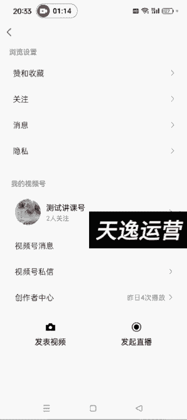
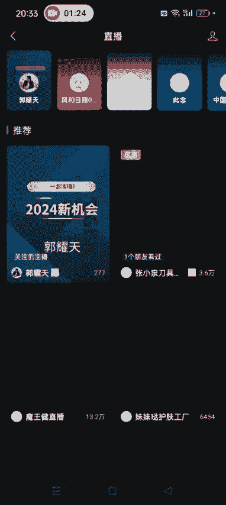
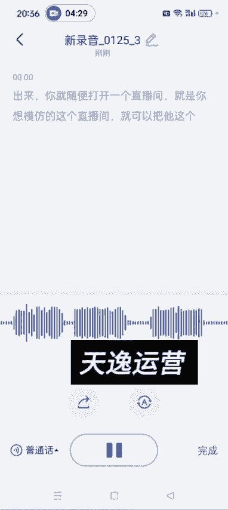

# 140分钟学会视频号运营-原来打造爆款视频这么简单！！！小白零基础入门必学的微信视频号视频公式拆解，最简单的起号教程，快来学！！！ - P31：4.如何扒别人直播间话术 - 少年镜是 - BV1kqsheLEQM

嗯。好，各位同学大家好，这节课给大家讲一下，就是我们如何把别人直播间的这个话术啊。嗯通用的话术就是看我课程里边给大家发的那个详细的就是你比如说你看着某一个人他的直播间呃，卖的很好是吧？

然后他卖的那个品你也可以低成本的复制。然后他发的视频你也可以自己做他那种视频，哎，剩下的就是呃看他这个直播话术了，对吧？你像这些品，他有的时候可能这几这个月卖的好，下个月这这这个品卖的可能就不好了。

另外比如说过年的时候是吧？年货你像什么春联啊，这些他卖的好，然后你又不知道这个话术怎么去去搞，这个就是如何去扒别人直播间的话术啊。嗯需要用到的工具就是你下载一个飞书。然后工作台有一个点开这个工作台啊。

有一个飞书妙计，看到没有？啊，飞书妙记这我们可以去。录别人直播间的这个话啊。比如说我随便点开一个直播。

随便点开一个直播啊。嗯。

谢叶子这次考试韩语是没猜出来嘿嘿。😊，草色遥看俊切无，最是一年春豪处角胜烟柳满皇都。现在几点，现在8点33，你有女朋友吗？你为什么要问这个问题？

why do you have this kind of question？you请。今いきたりの。带了一包一块、2块、3块。既能切又能砍。

一块2块、3块、4块、5块、6块、7块平满叠起来想怎么都就能改。一个好评好几天没见了，尊珠假珠，人间4月芳菲尽，山寺桃花始盛开。这把刀呢听下声音，专柜卖。看到没有？

就是他这个可以实时的录这个直播间的车这个声音啊，就包括我现在说话，他也能录进来，知道了吧？大概就是这么去用。然后他直播间的这个声音呃，大家大概就是呃用这个飞书妙计搞上15分钟。

基本上你就知道他这个他是怎么介绍品的，怎么逼单的。然后你把这个弄完的这个话术导出来啊，导出来就可以了。然后点完成点完成之后。点开它。然后。这儿有一个分享啊。可编辑也行，可阅读也行啊。可编辑了。

然后你复制这个链接，到微信聊天记录去打开它。打开之后就是他这个刚才说的这些话啊。你就可以复制出来。然后看他是怎么说的，然后你提炼出来之后，形成自己的话术就可以去开播开播了啊。

他这个生成可能需要几分钟的时间啊。然后我这个那会儿录了一个其他的直播间啊。你像这种的是吧，然后分享。然后复制这个链接打开。我发的。发进来，然后点开对吧？你像他说这些话，我们都可以复制下来吗？然后复制。

发到微信聊天记录里边，你编辑一下，看看他应该怎么说是吧？你把这些话都编辑好，形成自己的话术，可以写在纸上，也可以放到你的备忘录里面。开播的时候，如果忘了，你可以对照着这个话术去念，好吧，嗯，方法呢就是。

嗯，打开飞书之后，工作台。工作台啊，最下面有个工作台，找到飞书妙计，然后点一下右下角这个语音，它就开始录了。啊，你就随便打开一个直播间，就是你想模仿的这个直播间。就可以把他这个话实时的。呃，录下来啊。

好，那个。这节课就讲到这儿啊。