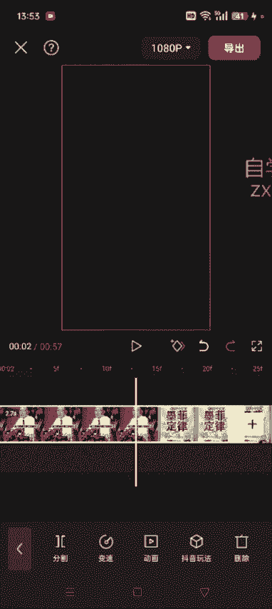
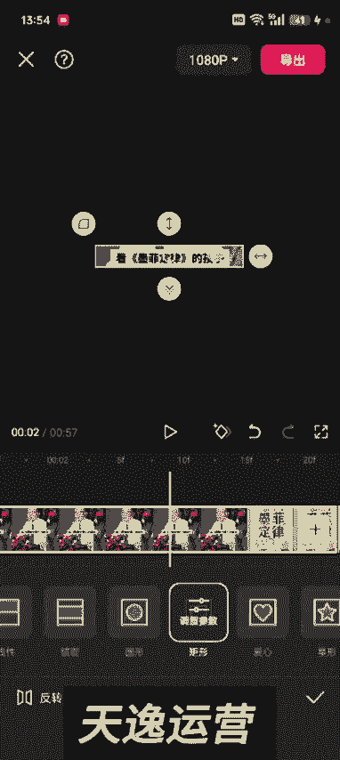
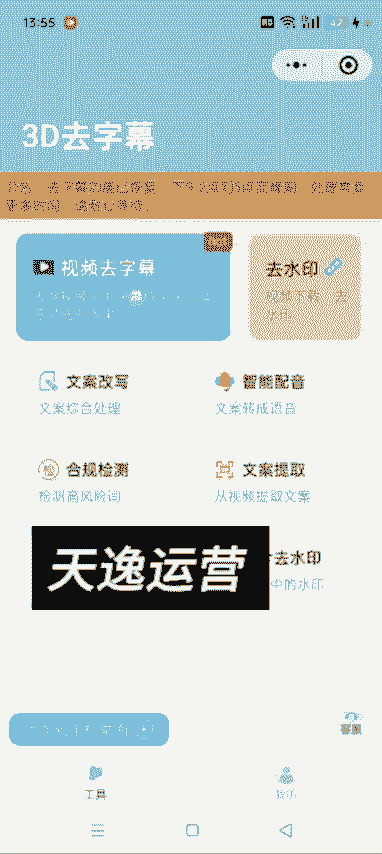
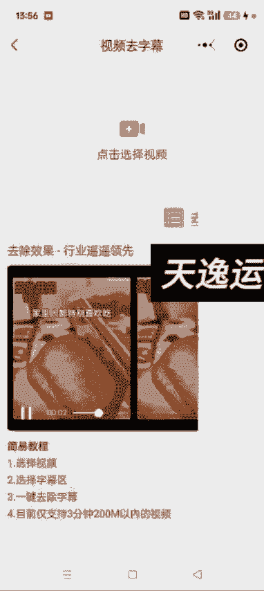

# 140分钟学会视频号运营-原来打造爆款视频这么简单！！！小白零基础入门必学的微信视频号视频公式拆解，最简单的起号教程，快来学！！！ - P32：2.如何去视频里的字幕 - 泪水大师猪脚饭 - BV1uCs8epEd3

好，各位同学大家好。这节课给大家讲一下如何给这个视频去字幕。去字幕的话其实也有两种方式啊，就是我之前课程里边有讲过，就是我们把这个视频通过蒙版的方式，然后把它这个字幕去掉，你比如说这个视频，对吧？

你看他这个。呃，前半部分这个字幕在中间的地方，然后后面呢它这个字幕在下面的就是靠下一点。像这种的，我们应该怎么怎么整呢？这种的其实你把它分割一下啊。你看他那个字幕在上面的在哪？

然后我们把这个视频分割一段一段的去给他去啊，这样也可以。来在这儿给它分割。然后分割选中这。

这一段，然后我们就通过蒙版的方式给他去字幕。选择矩形。呃，跟之前的方法一样啊。

然后调到合适合适的位置，然后点反转，然后返回一级，找到背景。我们点画布模糊，哎，这样的话这个原字幕就去掉了。后面的这一部分呢就是我们分割的这儿道理是一样的啊，然后我们选中它。

如果就是它这个字有的字幕是一直在一个位置，像这种呢，我们就不需要分割。如果没有在一个位置的，哎，然后我们就分割一下啊，分割一下，然后再就是逐断的去给它通过蒙版的方式去字幕啊。还有一种方式呢。

就是我们在微信里面去搜这个去字幕。它跟去水印道理差不多啊，去字幕也有呃去字幕视频去字幕一一键去除的这种小程序。很多很多这种小程序啊，你看有很多很多是吧？然后呃好相对好用一点的，就是这个3D取字幕啊。

跟那个去水印道理差不多。然后我们把这个视频选中。选中之后。我们进来之后啊，就是他这不是有一个视频去字幕嘛，然后点进去点进去之后，把你想去字幕的这个视频导入进去就可以了啊。

然后完成。🎼千万别让一说就掉眼泪的孩子读墨菲定律，不然他内心。然后这个哎我这个已经去过了啊。呃，找个没有趣的。这个吧。千万别让一说就掉眼泪的孩子读墨菲定律，然后把这个位置调整一下。他这个可以调大小啊。

呃，通过这个去字幕的这个小程序，去的这个字幕，其实跟我们用蒙版去的差不多。我尝试了很多这种小程序，它多多少少会有一点痕迹。呃，视频短的话，效果相对来说比较好。如果你像超过一分钟的这种。

它去出来效果跟我们用蒙版的方式去差不多。如果碰到就是。它这个字幕上下位置不一样的这种，我们可以把视频分割，然后逐段的去通过这个小程序去水去水印啊，去这个字幕，然后这个位置可以调，大小也可以调。

你想弄到哪都可以啊，然后提交去字幕就行了。大概就是这么这么呃去实操啊。然后这这种情况下，我们就直接去。

关了它就行了，一会儿再进来去看就行了啊。然后用法呢跟我们其他的像像那个培音神器啊，这些一样，直接下拉微信，然后找到这个小程序就可以了啊，很多啊很多。呃，有的是收费的，像3D这个他还不收费。

然后效果也差不了多少，都差不了多少啊。好，这是两种去字幕的方式啊。今天这节课就讲到这儿。