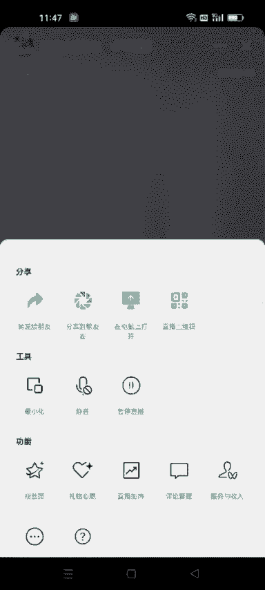
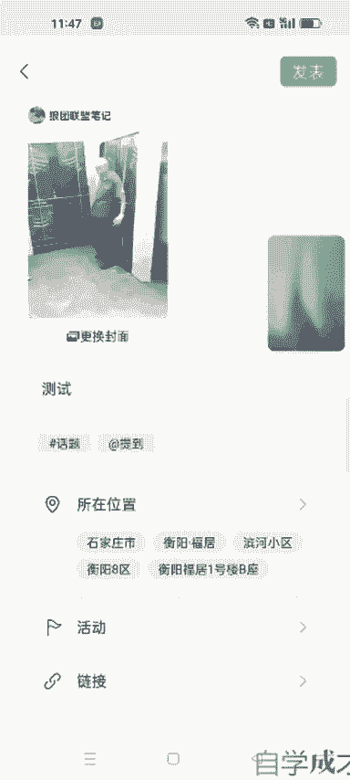
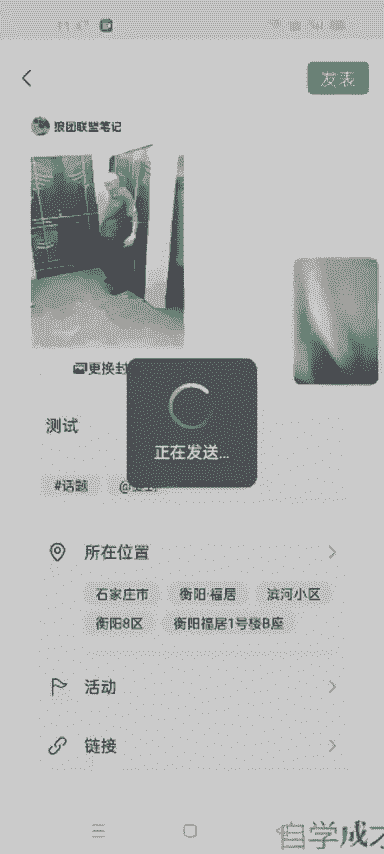
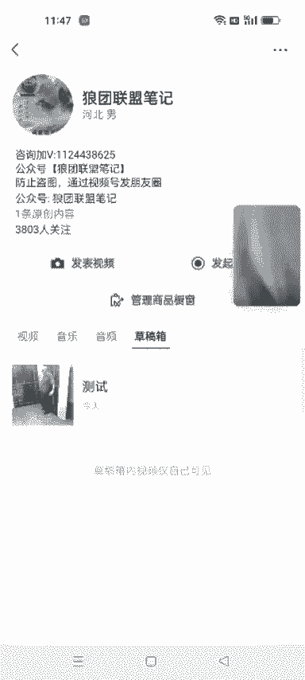
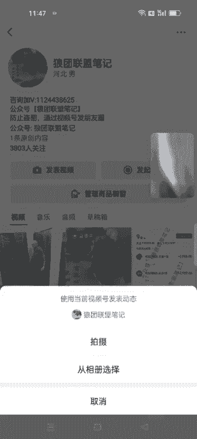
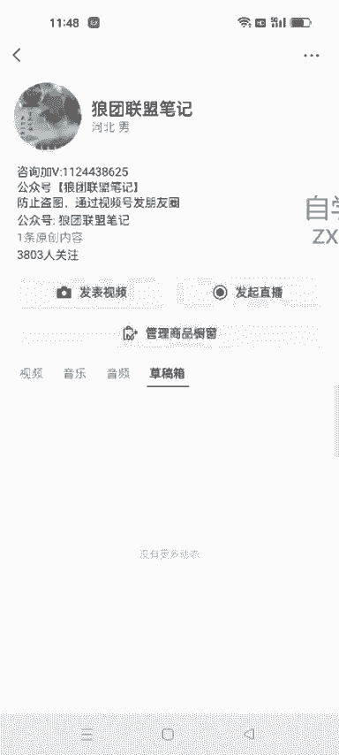
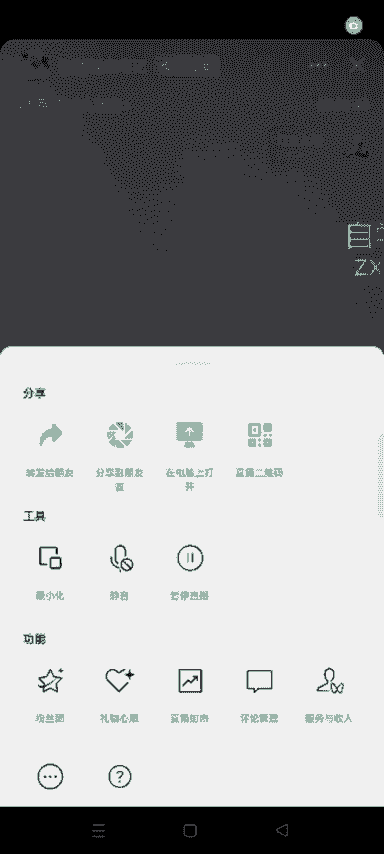

# 140分钟学会视频号运营-原来打造爆款视频这么简单！！！小白零基础入门必学的微信视频号视频公式拆解，最简单的起号教程，快来学！！！ - P36：1.直播时如何把草稿箱视频发出去 - 泪水大师猪脚饭 - BV1uCs8epEd3

开播后啊开播后，如果你的直播间不进人的话，呃，然后我们点击右上角这三个点。然后。让你的直播间最小化。这个时候。呃，你可以点开你的这个视频号的主页啊，视频号主页。把你提前屯好的这个视频。

发出去就可以了，然后点发表。

他这儿显示正在直播中，请稍后，但是他这个视频依然可以发出去啊，你看可以发出去。

是可以发出去的，但是你要是直接点这里去发表视频的话，它是发不了的啊。

知道了吧？所以说你如果呃怕直播间不进人的话，提前在淘宝箱去囤一些视频。另外的话我们这个直播间啊。

我们这个直直播间你还可以分享出去，分享到朋友圈，或者说转发给你的朋友都可以。

呃，可以提前准备一些群啊，你把这些把你的这个直播间分享到一些群里面，或者说你用你的小号去把你这个直播间去分享出去也可以啊。然后呃上个月是你私域导流。比如说你私域能导流10个人到你的直播间。

就是通过微信群啊，朋友圈进到你直播间的话，他公寓再给你推10个人。嗯，官方这方面是有扶持的啊。

嗯，大家可以注意一下这一点。嗯，如果这是这些问题都做了之后，直播间依然没有人，或者说来人了之后，他们就秒走，你就考虑自己的话术问题。直播这个事儿它是需要你去练的啊，然后工厂能力啊。

包括你是不是身采神采飞扬的在直播啊，是吧？好多人可能一进直播间一看你死气沉沉的，他就秒走了，对不对？你考虑自己的问题，不要老考虑那个呃咱们这个品啊什么的，别人能做好呃，你做不好，那就是自己的问题。

知道了吧？呃，嗯，能做的就是我上面说的这几点，一是说你提前囤好视频去发。另一个就是你把这个直播间分享到一些群啊什么的。如果。呃，如果你自己不愿意分享到自己的家人群啊，或者说业主群什么的，没有的话。

你可以用小号啊，用小号去分享这个直播间。呃，你把这个直播间分享给你的小号，然后让小号进一些什么业主群啊，或者一些乱七八糟的群。如何进群的话，呃，方法也有很多啊，你们可以看一下我公众号里面如何找群。

这些有很多。比如说像锅圈群啊，什么那个呃一些那个。就是一个做护肤品的那些群，他都有那个全国的那个用户群啊，你们去想办法去找一些这些群提前发出去，或者说一些广告群有上十几个就可以了。

到时候你可以把直播间转发出去，好吧。好，这是今天要讲的啊。