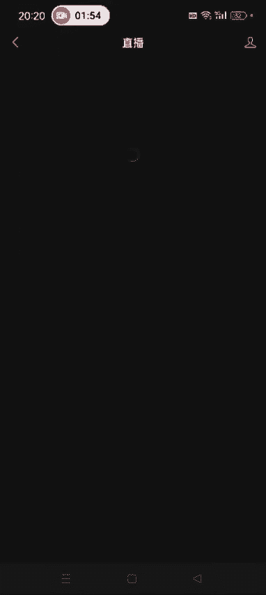
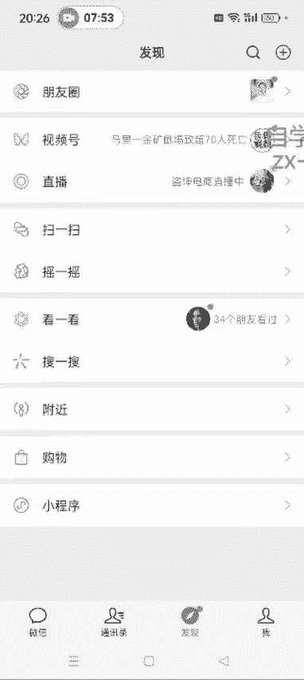

# 140分钟学会视频号运营-原来打造爆款视频这么简单！！！小白零基础入门必学的微信视频号视频公式拆解，最简单的起号教程，快来学！！！ - P37：2.如何找直播对标账号 - 泪水大师猪脚饭 - BV1uCs8epEd3

好，各位同学大家好啊，这节课给大家讲一下如何去找那个。直播的对标账号啊。呃，我们这个直播的对标账号其实跟那个视频号，纯视频带货的那个对标账号寻找方法也差不了多少啊，就是逻辑是相通的。嗯。呃。

但是我一个是在视频里面找，一个是在那个直播广场去找啊。然后我们其实没事了，可以刷刷视频号的直播广场，看看呃，最近哪一些就是卖货的这些人是吧？只要他不是那个团，你一看就其实都能看出来。如果是团队的。

或者说某一个公司的卖货，他那个直播间都特别的牛逼啊，高大上。然后我们纯素人带货的这种直播间，就就相对来说他就是一个人，然后卖一个单品，挂一个9。9块的这种商品去卖。所以说大家在直播选品的时候。

也是选尽量选择这种9。9块的这种单品啊，然后也可以看一下他发的那个视频，我们是不是可以去复制模仿。呃，逻辑就是打开视频号的这个产品中心。视频上小品中心里面，我们还是点开那个爆款排行榜。

看爆款排行榜里面哪一个东西卖的比较好。

然后我们就可以直接去搜这个直播间了啊，搜这个直播间，然后看看他是怎么发视频的，发的哪种视频。然后他这个话术是什么样的，然后我们就可以直接去模仿。只要他这个橱窗出的这个品还行，我们就可以直接去模仿啊。嗯。

比如说第一个呃我们看这个吧。秦妈糖醋酱调料包这个吧。然后我们打开直播广场。

直播广场打开之后。然后这个人头旁边啊。可以搜索。Tang。醋。调料包。然后我们搜出来之后可以看一下啊。🎼哎，这个时候就能搜出来了，直接点可以点进去看他这个直播间。🎼然后也可以把他这个直播间关了。

点他这个头像，看他进去看他是发的哪种视频啊，看我们是不是可以模仿。然后也可以点开他的这个橱窗，看看他卖了多少。这个可能应该是刚开播，还没出单啊。哎呃不同的时间点去搜啊。

一般白天的话呃可能直播直播的人会多一点，也没准儿。呃，就是大家想搜的时候就随时可以去搜啊。这个哎如果你想复制的话，其实可以复制啊。然后。可以再找其他的啊，像这些品啊，你觉得差不多的都行。

比如说厨房用的一些东西啊，最近不是快过年了吗？厨房。😔，清洁。然后就搜。有很多是那个官方的旗舰店啊，那种的我们就不建议去模仿。清洁布。像这种的。你看他这个商品橱窗啊，一售122。

然后他这个视频发的是那个短句混剪的是吧？然后他这个直播间。🎼你看他平时在说什么，其实我们也可以模仿嘛。🎼欢迎新进直播间的家人们啊。😊，咱们家的这款油乌最。这个也是短句分解。这个是发的这种卡通的这种。

像这种应该是那个。他这个是属于企业店的是吧？然后我们想做的话，就可以模仿前两个账号是吧？呃，原则就是看他这个品是不是低价品是不是好卖。另外是不是刚需的这种消耗品，对不对？另一个就是看他发的这个视频。

你是不是可以模仿复制，低成本的模仿复制，我们直播其实就是只需要一个手机支架和一个散热器，然后花9。9块买一个样品就OK了，对吧？其他的也不需要嘛。嗯，就是主要就是在于你这个话术什么的。

话术其实呃开场话术还和那个B单话术都差不多，就是介绍商品这个你看他是怎么介绍的，直接加进来就行了，是吧？其实也很简单啊。嗯。你像这种的。黄石双。你像这种啊，我给大家说一下。

就是你一看这个佣金率比较低的这种啊，佣金率比较低的这种。1%的这种这种肯定是可以跟商家去谈合作的，就是呃开定向佣金，可以点进去联系他们那个商家啊，去联系他们。可以联系他们。

看就是他这个屏可以给你开一个定向的佣金啊。可以去联系，像这种的知道了吧？比如说这个黄石双。很多人在卖嘛。是吧。有的可能搜出来，他就一两个直播间在卖，有的可能有很多。像这种的。上个周末啊。

我会带儿子去超市买，像他这种玩法，就是真人口播去呃发一些这个情感语录。比如说婆媳关系啊呃，家庭的孝顺父母的，你像他这个标签里边不都有吗，是吧？哎，然后通过这种方式去获取流量，然后去开播啊。然后看看这个。

这个一受灵。看他这个卖了多少也是0。有的可能刚开播啊，这个瘦了455了。你们俩可你像这种的就是真人出镜。自拍的这种像这种呢我们都可以去复制啊，都可以去复制。好吧，这个大概就是这么一个方法。

然后你你比如说你平时你搜了这个直播间，后续他官方还会给你推送。只要他们这种直播间开播，他就在直播这有一个提示啊。在桌就有一个提示。你像我这个视频号，你看现在。呃，我经常看的那些东西。

他就会给我推送到这儿。比如说直播这是吧，刀括电商直播中啊，他就会给你推送。

好，这个就是大概的一个方法和思路啊。