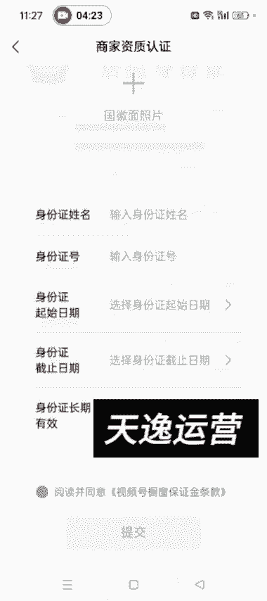
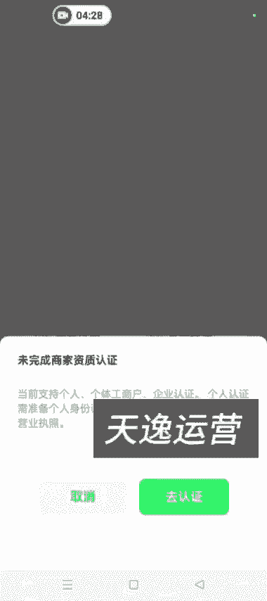
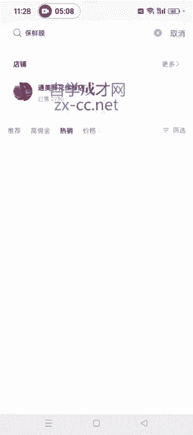
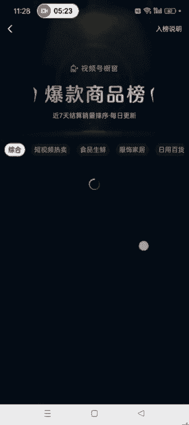
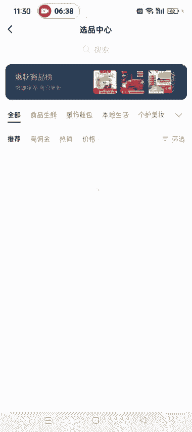
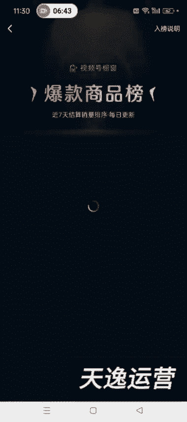
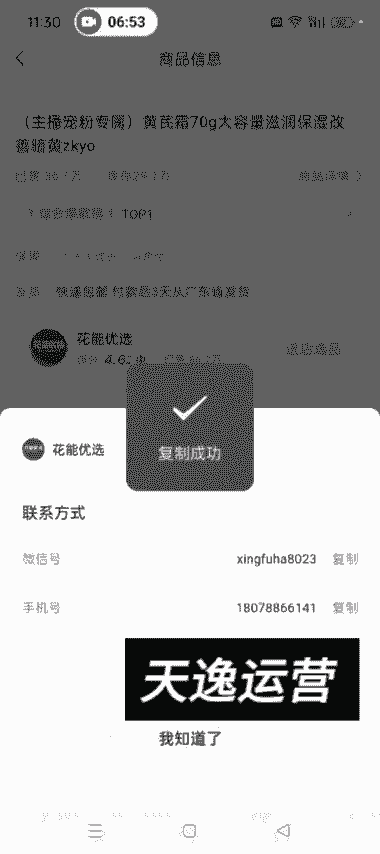
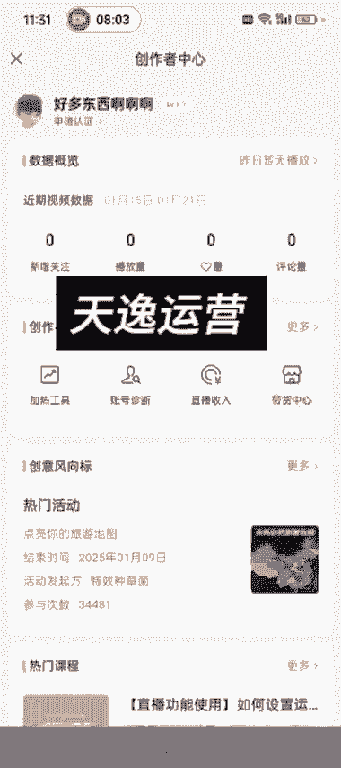
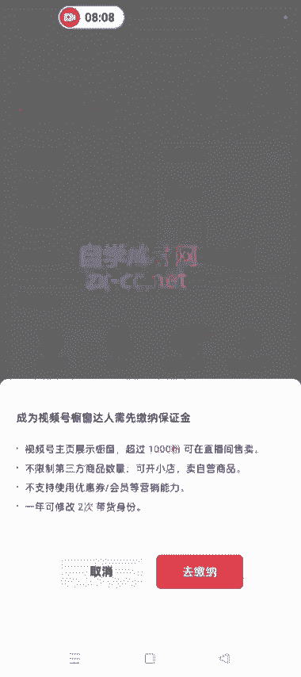
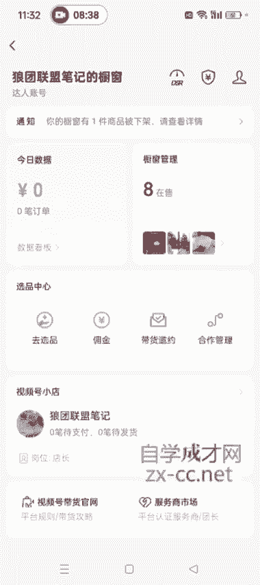

# 140分钟学会视频号运营-原来打造爆款视频这么简单！！！小白零基础入门必学的微信视频号视频公式拆解，最简单的起号教程，快来学！！！ - P8：3.视频号的制作者分成讲解 - 少年镜是 - BV1kqsheLEQM

好，各位同学大家好啊。这节课呢我开始给大家讲这个视频号创作创作者中心这个界面啊。然后我们点开创作者中心之后，然后就是首先映入眼帘的就是这个数据概览这一块就是我们可以看到自己这个账户的这个呃关注啊。

关注数据、粉丝画像和这个播放量什么的啊。呃，然后下面有一个热门课程，这个有兴趣的可以看一下啊，它这个。特别特别多。然后这有一个创意风向标，这个我们其实也不需要关注啊，这个我们也不需要关注。呃。

重点看一下这个加热工具。这加热工具是什么呀？就类似抖音的那个抖加，它这个加热的话，就是说你给自己的视频付费去推广，它是需要花钱的啊，呃我们一般玩自然流也不需要用这用到这个加热工具。但是这个加热工具呢。

可以呃就是帮助我们就是其实我们看一下我们自己的账号有没有那个违规呀，这种这种情况啊。呃。一般那个。有的时候就是你你点开这个账号诊断，这儿它是并不准确的啊，账号诊断这说说你这个账号正常，如果是正常的话。

它就是绿色的啊。看一下这个号。え？你看账号状态正常，有的时候账号状态正常，但是它你这个视频它是依然不可以加热的啊，这个就说明我们这个账号它已经隐性限流了。呃。如果引性限流了之后，我们可以去申诉。

申诉的话，后面我会教方法啊。但是这个入口我告诉你怎么怎么去找入口一个是你在这个。他这会让你带申诉或者去申诉这儿啊，你点点进去。点击此处申处看到了吧，然后你就可以去申诉了啊。申诉这儿。

然后提交你的这个申诉的内容和这个证据照片什么的，就是在这个入口去申诉啊。还有一个入口是我们这个视频号私信这，他视频号团队给我们发的。你可以去申诉，看到没是吧？不管你有什么违规，你就可以在这个地方去申诉。

一共是呃三个入口啊，今天先讲两个，还有一个入口，就是后面我会详细的给大家讲那个关于如何申诉这个事啊。这个是申诉。然后我们点开带货中心去看带货中心这儿嗯，这个数据就是你今天卖了一共卖了多少GMV。

然后出了多少单嗯，卖的哪个商品，然后来源这些这儿都可以看到啊。然后商品橱窗这儿我这个号啊，这个号是已经交了保证金的。你点开之后，它就是这个界面。如果没有交保证金的话，点开你的那个视频号之后。

它是这个界面。点开带货中心之后，它是这个界面。看到没是吧？暂无带货权限，然后我们点一下橱窗这儿，然后就前往缴纳就可以了。然后点充值缴纳，然后点去认证，选择个人啊选择个人，然后传你的身份证正反面。呃。

这儿这个身份证认证一定是你的这个你的这个微信号啊，这个微信号。实名认证的是呃谁的身份证和呃谁的身份信息，你就上传谁的身份证正反面啊，输入名字、身份证号，然后这个身份日期。然后勾选同意，然后点提交就行了。

点完提交之后，大概等个10分钟左右。有的时候可能一两个小时啊，这个时间不等，就是大家再进去呃，再再再点到这个界面，然后点充值缴纳，你就就不需要这个去认证了。然后你因为你已经已经认证通过了嘛。

然后交上100块钱，你这个橱窗就打开了。

然后开通之后就是我这个号的这种状态啊。然后我们就可以在里面去添加商品，其中去选品这儿可以再点开这儿去选品，或者说点这儿去选品啊。选品的话可以直接加橱窗，对吧？然后你想带哪个商品，直接加橱窗。

或者说你搜啊，比如说保鲜膜。直接去搜就可以出来。然后高佣金啊。热销啊是吧。你就可以去搜出来，把这些东西搜出来，然后去加橱窗。

道理是一样的啊，这需要注意一下。点开去选品，如果能找直接主页有的话，直接去找，或者说这个爆款商品这儿啊。看哪一个商品卖的好是吧？

食品生鲜啊，它这个分类挺细的，现在宠物绿植这些。爆款商品榜这哎，我们就可以直接加。就是如果他这个销量跟佣金什么的，佣金，我们一般最少是选择30%以上的啊，选择这种的你佣金太低的话，带它也没什么意思啊。

这是视频号橱窗，如何添加商品这呃，一般是带这个爆款商品榜，或者说你直接在这个呃选品中心里面去搜索你想带的商品即可啊。然后我们添加到橱窗的这些东西，如果你不想带了，然后可以点这个管理，然后。

移除点完移除之后，一定要点右上角的完成，看到没有？你点完完成之后，它才可以把它移除成功。如果你不点完成的话，它是移除不了的，知道了吧？点管理，比如说这个。啊，移除，然后你返回你看它你不点完成。

它还是8g，对不对？啊，这是这儿。然后这个呃上节课我不是讲了那个视频号的ID嘛？呃，比如说。你想带某一个商家的商品的话啊，想带某一个商家的商品，你感觉他这个佣金比较低是吧？佣金比较低，我们可以联系商家。

你比如说这个对吧？你感觉他佣金低，我们可以在这儿去联系商家，直接复制他的微信号或者手机号，到微信里面去添加他，跟他去谈就可以了啊。呃，如果谈好了，他给你开一个定向佣金，开定向佣金的话。

然后我们就在这个合作管理这边去去找就行了，知道了吧？

还有带货邀约这去去找就行了，知道了吧？他给你，你把ID发给他，他会给你开一个定向佣金。然后我们在这边这个带货邀约或合作管理这去去找如何呃，这个都有提示啊，会给你发通知，明白了吧？然后上面这儿这个。

这个带货评分，这个就是你橱窗的评分啊。这个是这个保证金。点开之后，你交完之后，它就是这种状态，明白了吧？然后你的保证金如果提现的话，直接在这去提现，满足条件之后就可以提现了。诶。你就可以提现啊。

然后这个佣金这儿。

佣金证。

佣金这它有的时候就是会提示又开那个联盟账户嘛啊这个号没有显示。呃，我们不不需要开那个联盟账户啊，有的时候你们点进去之后，它这个界面会有一个联盟账户让你去开通。那个你不需要开通。联盟账户开通的话。

就是提现要收百扣6%的点，嗯，可以可以不不弄啊，可以不弄。嗯，这是这个界面也没没有什么特别的需要讲的。好，就讲到这吧啊。

