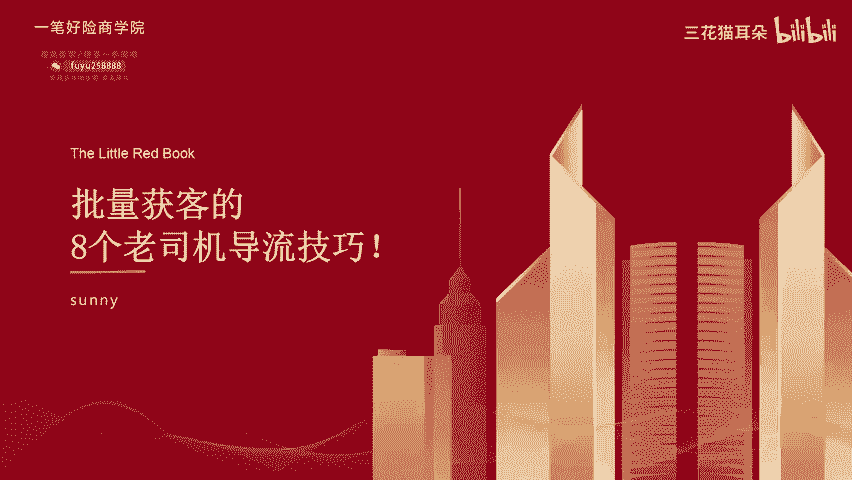
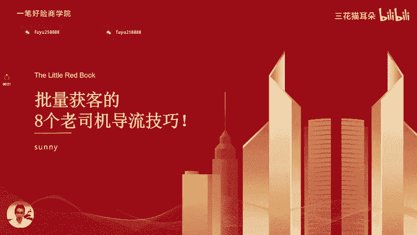
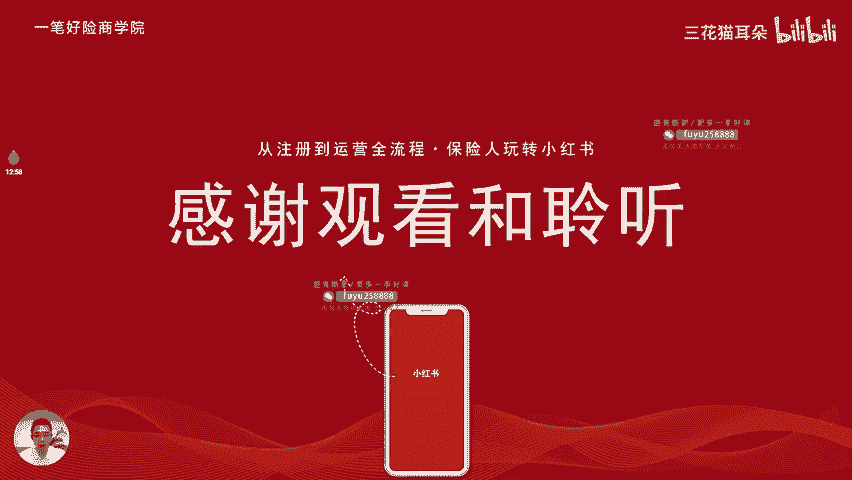

# 18_13、私域引流：批量获客的8个老司机导流技巧_ev - P1 - 三花猫耳朵 - BV1ky2tYzEG3

🎼我是。🎼如此相信。🎼没有自己。🎼大家好，我是张脸，欢迎来到异地好险商学院保险人做小红主系列课程第十三节课批量获客的8个老司机导流技巧。

啊，我们再回顾一下我们正确做小红石的一个流程。现在讲到了私引流这一块。然后先给大家梳理一下一个闭环的一个引流链条是什么样子的。我们要做小红书，要实现一个闭环的一个变现链条。首先啊功率造流量。钩子加微信。

发穿件信任。思域促成交要紧紧围绕着这四个核心点进行。优化和。运营，然后促成私域的一个成交。下面重点跟大家讲一下我们引流的几个方法。第一个引流方法，通过私信引流。

其实私信的话是小红书里面最大的一个引流的一个入口啊，但是我们说引流的话，我们也不能够太明直接的去写微信啊，联系方式啊的一些方式。那可能会导致你啊啊就可能会导致你发了之后呢，就可能会及示违规这些情况。

所以说大家在。在做的时候，一让自己的内容安全的情况下去做一些引流的一些动作。比如说你用发表情啊或写音字啊代替一些敏感词，或者是通过啊一些照片来带一些微信的一些微信号。比如说我们右边这两个图片。

它就是通过照片上面一些啊字母来。带微信号啊，比如这个衣服上面的来带微信号。然后还有就是引导对方留微信，就尽量不要自己去留微信，尽量让对方主动留微信，这样的话自己就可以规避自己，就可以规避自己。

因为留微信到期的一个违规啊，就让对方去留就可以了。还有一点就是说我们尽量去先交流交流，再引导有微信。因为我们只有跟用户聊起来了，在私信端跟用户出备了了解了用户的一些需求，跟他已经建立了。一定的沟通。

铺垫之后再让他留微信，这样的留微信的概率会更大的。如果你是一个用户，你在小红上面呃加一个呃跟一个博主聊天，都还没聊两句，博主就让你留微信，那可能你就不是很想留。

所以说我们尽量在私信区跟用户先聊先聊一会儿，再让用户留，这样的概率会更高一点。然后就是说不短时间内不短时间内多次去复制粘贴同类的回复，就我们可能让用户留微信的一个话术啊，我们要重复的去粘贴翻粘贴粘贴。

复制粘贴。这可能会导致系统识别，你有在一些违规的操作啊，尽量不要这样操作啊。还有一个就是用语音调引流啊。小红书它是可以发语音调的，你可以发个语音调，然后然后通过语音去说相关的引流的方式啊。

比如说啊我们小红书经常不在啊，然后为了方便我们及时沟通，你看方不方便加上你的个人号，个人其他联系方式，啊后我们好详细的沟通，通过发个语音这样子跟客户啊。说这种会比文字来说的风险要小很多。

然后还有就是发视频或者是转发小号的一些笔记的一些引流。就在视频里面比如发一个小简短的一个视频内容，里面也放上一个呃呃。引流的一些一些一些动作，或者是你用一个小号发一个笔记啊。

在笔记里面提加微信的一个动作。然后你通过你的主号去转发小号的一个内容给客户看客户看到小号内容就知道要加微信了。但这个如果是设计违规，他也违规是会违规，你会封掉你那个小号也对主号是没有影响的。

所以用小号也是一个比较好的一个方式。然后就是批量引流2啊批量引流2通过评论评论区也是我们跟用户互动的一个主阵地啊主阵地。我们首先呃跟用户在评论区互动之后呢，我们会主动的跟用户私信。因为用户知道。

因为有用户评论的，他肯定是有需求的嘛。如果对于精准的需求的用户，我们可以主动去私信。企业号是每天可以主动私信用户20次个人号只能主动私信5次。然后我们要引导用户关注我们。如果用户关注我们。

我们私信主动私信用户，他是没有限制的啊，这是已经是你粉丝了，就可以呃一直去打扰用户，这种没影响的。还有就是我们可以在评论区置顶一些呃一些引导私信的话术啊，比如说我们右边这边的老师的啊。

老师的嗯那个小张老师啊，他放了在评论区置顶了一张图片，他有意向的，请私信啊，就是引导大家主动给我们私信啊，主动给我们私信我们。再去回复客户，这种情况也也是不会有私数限制的。因为用户主动给我们私信的嘛。

然后还有这种呃张振云老师，他在评论区也会置顶的，每天陌生人数的一个私信消息是有限的。麻烦大家先关注啊，或者是呃发案号啊呃免费领取一个呃相关的一个方案啊，这种也是引导大家互动啊，或者是主动私信的一个方式。

还有就是我们在给用户主动私信的时候，尽量去点赞一下用户，或者是对一些高端用户可以关注一下用户，让用户重视啊，有也有时候你去关注用户，用户也会反关注给你的，互关的这种情况下。

你就可以去跟用户主动的去私信了，也不会有次数的限制。然后第3块日签这个很多账号都会去做，就是你在啊主页去通过那个日签的方式啊，去引导用户私信啊，用用户主动私信。只要用户主动给你私信，你去回用户的。

次数就不会设限啊，就是引导用户主动给我们私信啊，通过这种方式啊设置咨询请私信啊这种啊把这种主页装饰的更加呃有更加有引导感啊。用户进来之后，他就会啊我知道啊我我咨询你要私信啊。

他就会用户去点击那个呃消息那个那个出入口进行私信。然后导流的第四个方式，简介和小红书账号。简介的话其实就是我们的自我介绍啊。自我介绍目前它是可以放一些联系方式的。

目前最公开的联系方式就是邮箱邮箱是官方任何安全的方式。如果你去去放邮箱的话，你可以在邮箱里面呃，搞一个自动回复。用户如果通过邮箱给你发了一个消息之后，你可以自动回复用户一个微信号。让用户加你微信。

你可以在邮箱设置一个自动回复啊，可以的。然后还有就是我们的小红红书号啊，我们小红书号是可以改一次的啊，终身只能改一次。你可以把小红书号改成你的微信号啊，在后期的引导过程中。

你可以引导用户去看你的小红书号，或者是加你的小红书号，或者告诉用户小红书号，就是你联系方式啊，然后让用户去加你就可以了。然后引导引引导引流的第五个啊，第五个是私信群啊。

粉丝群是呃比较好的一个引流的一个入口。就是我们自己可以建一个群，让一些用户啊自己申请加群，然加入群里面的用户肯定都是有高诉求的用户嘛。因为他有兴趣加加入你的群聊。然后你可以把你的笔记啊。

直播啊的一些内容发到群里面可以增加流量。另一方面你可以把一些关联笔记的啊，把一些笔记啊，关联群啊关联群关联群。然后然后在评论啊或或者是是主页啊引导入群啊，就你发笔记的时候发内容的时候。

在国末引导大家入群或者是在主页引导大家入群，让大家通过啊你的内容去进群，在群里面，你可以分享一些内容，也可以直接引流。这容的时候也是比较安全的。然或者是在群高中群公告里面引流群。公告的话。

你就设置一些群公告，让大家看你的群名，你可以把群名改成你的微信号，或者是引导大家去看你的小红书号啊，都是可以的。你看右边的这种，它其实就是。直接就告告大家怎么去加他像绿泡泡其实就是微信的一个简称嘛。

其实就把纯名改成你的微信号，让大家去加你的微信号就可以了。通过这种比较隐晦的方式，也是非常安全的一个导流方式。然后还有一个就是小号。如果你用一个小号在群里面去引流，那是非常安全的。如果要封的话。

也只会封你的小号，不会封你主号。你可以用一个助理的号在群里面去引导大家加你的微信啊，这种是非常安全的。呃，批量引流第六步小号引流法，其实小号是目前嗯最安全移动引流方式。你可以用助理的小号。

发一篇引流的笔记啊。这篇笔记的话就是用来引流的那你大号的话呃，可以去转发你这个小号的这篇笔记。比如说你大号的文墓去艾特一下小号啊，就让用户啊想找你的时候啊，就去找小号去找你用户点关注。

或者是进入你的小号直接就可以知道啊，怎么加你了。或小号去大号的评论去留言啊，啊，然后把那个评论置顶，你可以用小号去做一些引流的动作，然后大号把小号置顶这种方式也可以的。

还有刚才说到的小号去大小号的群里面去引流啊，即使你用小号的话，你相对来说就是一个试水的号码。就是他如果是有违规，有封号，他其实也只会处罚你这个小号不会处罚你的大号，所以说你小号用来引流是相对安全一点的。

批量引流。第七种就是聚光司进通。前面跟他讲了，其实如果你是有投放的需求的，你可以去做一些投放。投放之后呢，你可以获得一些啊引流的一些组件啊，包括欢迎语啊，自动回复啊，相关的。

其实你就可以不要公开的去引流了，不要公开去引流了。不同的时期，它的那个每个月的要消耗的投放的数额，它是不一样的啊，你可以根据啊你的需求去。但是我是建议大家如果是有相关的内容啊。

首先一定要确定有相关的投放内容再去做一些投放的动作，是最好的，不要。不要拿着这个想去引流的想法，引引流的目的去做投放，那可能就会呃投放效果也比较差。但引流可能因为你没有流量投放效果没有客户来。

其实你再怎么有私信通，你也没有客户资源进来，你也引流不到你的微信端嘛。所以说你首先要保证到你流量要大啊，流量大，流量大内容是呃有热度的，然后再去投放投放之后呢，有客户来咨询。

那通过但然后再通过私信通引流到微信，这种方式才是一个闭环嘛。那如果你的内容本来就不优质，你就刻意的去投放，就可能花很多钱，也没有客户咨询，有有有这种私信通的权限，你也没办法去引流到客户。

批量引流第八个及时跟进，及时跟进是小红书的一个特别重要的点啊。因用户其实在刷到你的内容之后，他刷到第二个内容可能也是保险相关的。所以说他可能评论你之后私信你之后，他还会去私信别人。

如果你不及时去回复评论，不及时去私信触达用户，用户可能就会去别人那里，就会被别人触达了，就会去别人的私信去去别人的微信上面去了。所以说我们尽量做小红书呃，关于留言这一块，私信这一块一定要及时去回复啊。

提高我们的一个工作效率啊，这个是非常重要的啊，因为因为在这个公寓的话，谁都不知道用户会下一步会干啥啊，很多用户他可能会加很多人的，特别是关注保险用户，很多用户我了解很多户可能就会加十几个保险经纪人。

所以说你能不能及时的回复用户的消息，能不能及时的跟用户解决问题啊，用户能就就会。先跟用户建立信任，后续的转化成交的概率就会更大。所以说这个及时性很强啊，建议大家如果要真的要做小红书的话。

一定要啊及时的去回复客户的一些私信和评论。🎼好，这节课就到这里，欢迎大家的观看我。😊。

