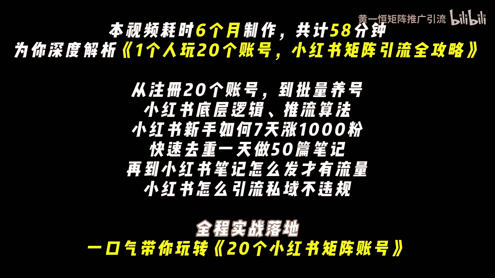
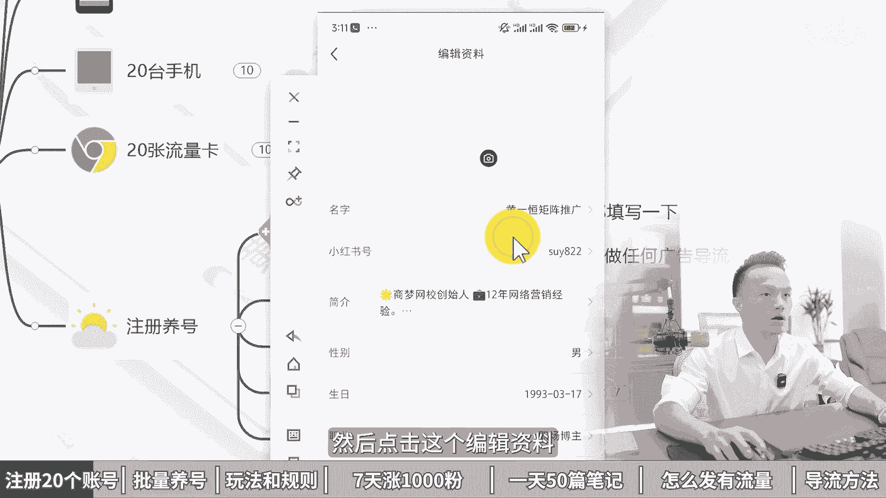
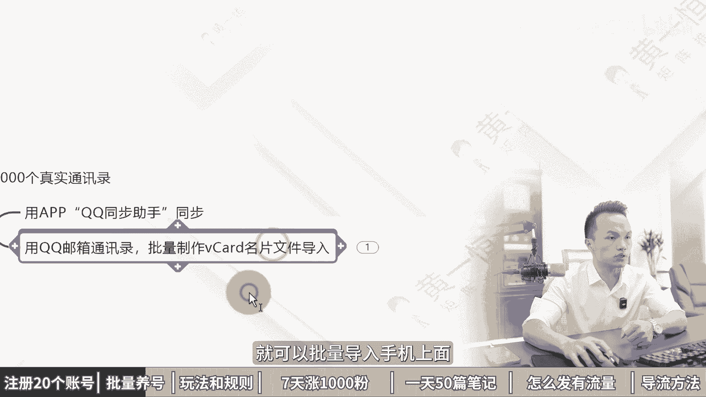
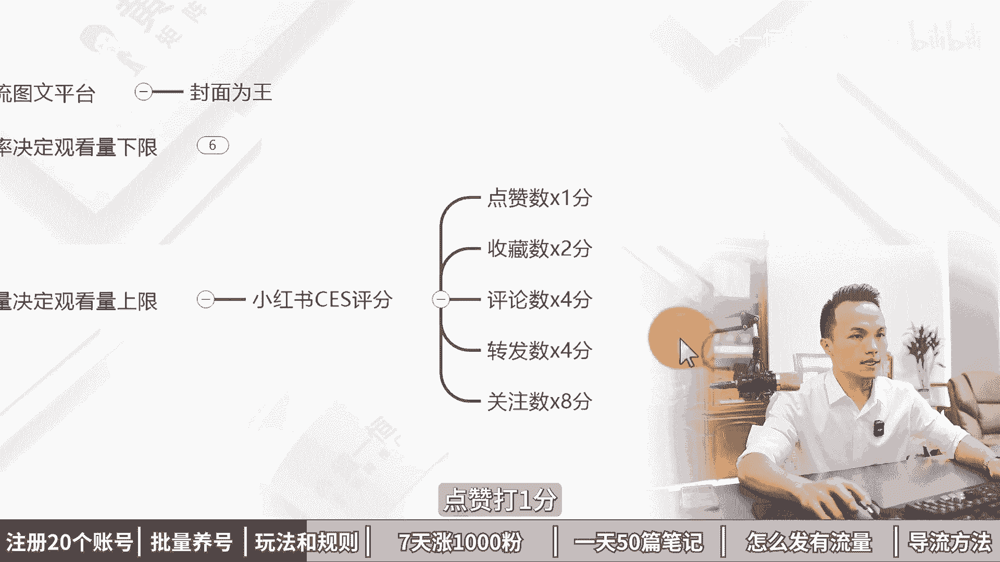
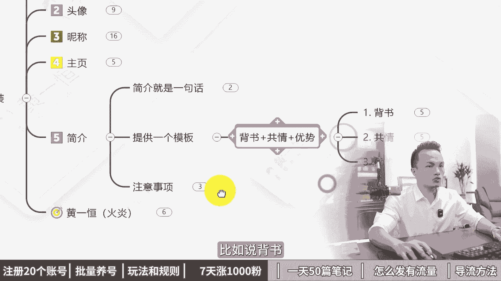
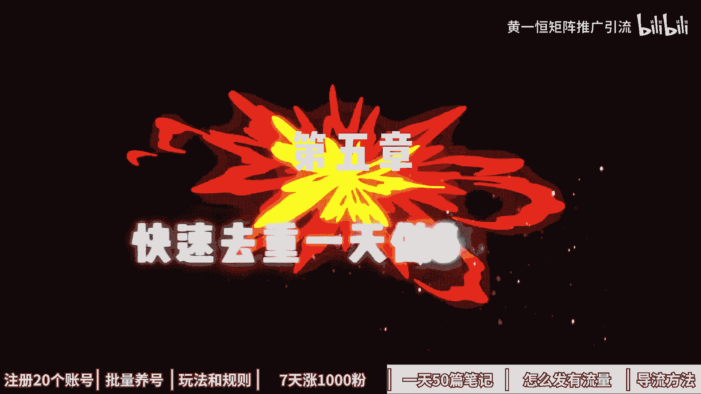
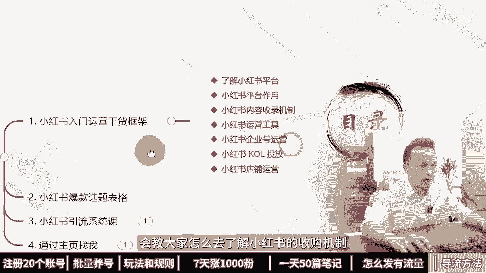
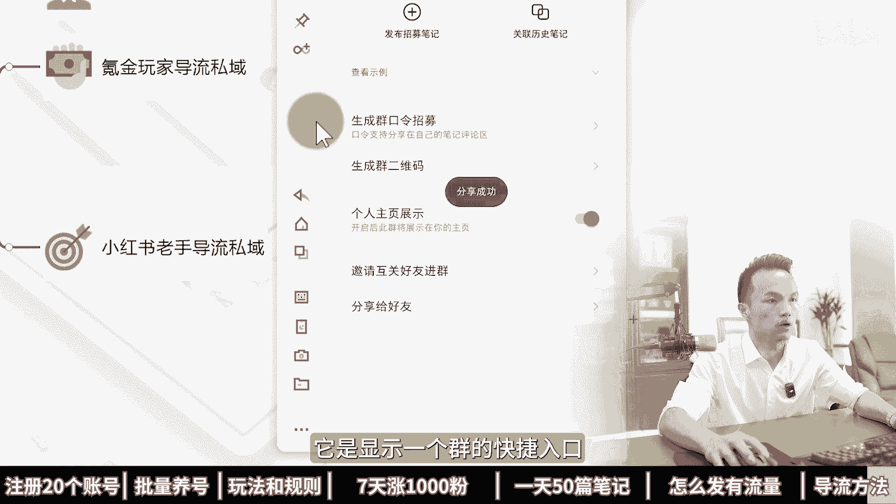

# 1个人玩20个账号，小红书矩阵引流全攻略！2024版小红书运营教程，小红书运营技巧，小红书矩阵账号怎么做，小红书矩阵运营，小红书引流加微技巧，小红书引流教程，小 - P1 - 黄一恒矩阵推广引流 - BV1sJame7EwT

本视频耗时六个月，制作共计58分钟，为你深度解析，一个人玩20个账号，小红书集证引流全攻略，从注册20个账号到批量养号，小红书底层逻辑推流算法，小红书新手如何七天涨1000粉，快速驱虫。

一天做50篇笔记，再到小红书笔记怎么发财的流量，小红书怎么引流，失业不违规，全程实战落地，一口气带你玩转20个小红书启登账号。

第一章批量注册20个小红书账号，又注册了20个小红书账号，我们公司刚来实习生，我叫他去注册小红书账号，他花了几个小时就注册好了，我们一起来看一下他怎么注册的啊，用实卡注册，然后换绑营业租租的卡。

Nice，真是个人才，这个方法不错，可以无限搞小红书高质量账号，一起来看，会告诉你注册小红书的前提是什么，怎么准备20个手机卡，20台手机，20张流量卡进行批量注册养号，首先来看注册前提。

当我们在操作小红书的时候，都需要注意这个点，否则后期基本上都会走弯路，就是一机一耗一网络，我们在操作小红书时不多开，不使用任何的系统，多开，包括第三方多开软件，防止设备关联，也不去连接WIFI。

很多伙伴习惯多个账号连接一个WIFI，很容易导致IP关联，轻则限流，重则直接封号，那如果我们遇到封号之后怎么办呢，建议大家可以把设备恢复一下出厂设置，然后再继续进行使用，如果出现了封设备。

这时候就只能更换设备使用了，因为小红书这个平台比较特殊，它是会出现放设备，只要封了设备之后，在这台设备上面登录过的所有账号，都会关联配方，那如何去注册20个小红书账号呢，首先我们得准备20张手机卡。

在注册的时候优先使用这个实卡来进行注册，因为经过我们这一测试，实卡发布的流量它会大于这个信息卡，那什么是实卡，也就是我们在注册的时候，号码是18151319号段的这种都是实卡，那如果咱们在注册的时候。

手机号是1716的号段，这种呢就是心里卡，那怎么去搞这么多实卡，我们可以自己去办理三大运营商的卡，一个运营商能办五张，30天最多办一张，但是呢我们短时间之内也搞不到，那这时候怎么办。

我们可以找20个亲朋好友，因为在我们周边，其实很多的亲朋好友，他们都没有使用小红书，我们可以用他们的号码来进行注册，注册完之后，这个账号嘞是实卡注册的，整体的质量是比较高，推流也比较不错。

一个月之后我们在换网上营业，足足的卡，通过这个方法就可以无限的产账号，这里呢我们也是需要配合上，这个林业租的注册卡种，注册卡怎么去找呢，非常简单，我们只需要去搜索林业租空格注册就可以买到，价格比较便宜。

如果你买的比较多的情况下，十张大概需要花30块钱，一个人的话，可以实名30~50张卡，这些卡的都是正规卡，都是需要进实名的，第二个，我们还得准备20台手机，因为我们做小红书需要遵循一机一号一网络。

搞20个账号就得配20台手机，手机这一块我们使用的比较多的，有这个红米note8或者pro，那么其他型号呢也可以，并不是不能使用，之所以使用这个红米，最主要的还是什么，性价比实在太高了。

咱们如果去购买这个664G的配置，价格在350~400左右，那么手机这一块呢，大家可以直接通过，像我们是通过闲鱼进行购买啊，价格会比较优惠，如果你闲鱼上面怕翻车，你也可以找一些店铺进行购买。

也可以购买这个红米note8或者pro，价格在450~500左右，可以进行参考，咱们在购买手机的时候呢，只买这个664G配置，以及这个以上的，否则当我们手机上面如果安装的app比较多，消息比较多的时候。

这个手机非常卡顿，一旦太卡顿的话，我们基本上做起来的时候就非常难受啊，购买渠道可以通过啊闲鱼上面去购买，价格会比较便宜一些，也可以通过某东某宝找专业的卖家购买，会有售后服务，一台来贵30~50块钱。

这个大家可以自己选择，有了手机卡和手机，接下来我们还需要配两张卡，为什么，因为我们手机里面它是没有流量的，我们的林业租租的卡，它只能够收发1065短信，不能够打电话，也不能够上网。

所以这时候我们得单独给它配流量卡，流量卡这一块呢，目前我们自己用的比较多的是这个物联网卡，为什么用它呢，最主要还是因为性价比比较高啊，大家如果有其他卡也是可以的，性价比高到什么程度呢。

如果咱们去购买的时候，69块钱能够使用两年，每个月有40G的流量，40G流量对于我们玩小红书来说，是完完全全能够满足的好，这种套餐价格啊，整体是什么，比较实惠的，大家可以自己找一下。

如果实在找不到这种卡起到的，你也可以来找我，我把我的渠道来分享给大家，也是可以的，接下来咱们来看一下成本核算，如果我们现在一个团队，我们去搞熊数矩阵，我们搞20个账号一起来做，我们需要多少钱。

首先20张林业租租的卡，我们假设五块钱一张，需要100块钱，20台手机400块钱，我们合计，那么20台需要8000块钱，20张流量卡，假设69块钱一张，我们需要花1380块钱，合计需要花9480块钱。

平均运营一个账号的硬件成本，我们就需要投资500块钱左右，大家可以自己有一个啊心理预期，当我们有了手机卡，手机流量卡之后，接下来就要开始注册账号以及养号，那怎么注册呢，注册这个非常简单。

大家直接下载app，然后刷着刷着它会提示你进行注册就可以了，注册完之后，我们需要把这个资料都给他完善一下，那么资料这一块呢，我们只需要打开这个图片，手机给大家示范一下，我们点击我，然后点击这个编辑资料。

在这里面我们把这些选项能填写的，尽量给它填写一下，更像是一个真实账号，另外前期新账号，大家比如说我们的昵称，签名里面不能有任何的广告信息，否则呢都很容易导致账号重置，甚至直接就疯掉。

包括大家如果你的行业比较敏感，也不要填太敏感的关键词，这第一个第二个呢我们还需要正常的活跃账号，如果你账号注册完之后就不管了，就发布也是没什么流量的，咱们每天需要浏览30个作品，点赞收藏20个作品。

然后来评论5~10条，关注5~10个博主，这些都是可以的，只要是像正常的用户就行了，有活跃度也就可以了，那如果我们账号被封，那这时候该怎么办，账号被封其实还有一种办法，因为我们的手机就会被占用。

想把手机号空出来来，我们可以配合上一些啊，比如说解码平台啊，然后呢把这个账号给他换出来，你原来手机又可以继续进行注册，金码平台这一块呢会比较难找一些，大家可以自己找一下，实在找不到的，你也可以找我。

我把我的渠道分享给大家，这种方式也是可以的，好了，各位板，那么当我们有个账号，如果想把小红书做好，光有账号还不行，如果你不会运营小红书，这些账号对你来说都是炮灰，那怎么办。

这个时候我们需要有小红书的一个运营干货，框架，会教大家了解小红书的评价作用，内容收入机制，运营工具，企业号的投放，以及我们小红书的爆款选题模板，我们做的每一个小红书笔记，都是从爆款模板里面去挑选。

收藏比，评论比，转发比比较高的来进行操作，建立在别人的数据基础指标之上，也就是我们会看数据等于什么，开卷考试，其实呢因为咱们的这个视频做太长，大家也看不完，也不太喜欢看，流量也比较小。

所以我们还单独做了小红书的系统引流课，那么大概有接近两到三个小时，会系统的教大家怎么去做这个小红书，这些呢都可以通过主页啊来进行一个领取学习，第二章小红书养号技巧和注意事项。

一共50部手机全部限流了，我们公司刚来实习生，我叫他去养小红书账号，他把这些账号全部搞限流了，what我们一起来看一下他怎么养的啊，直接给我连一个WIFI弄的呀，嗯现在小红书对账号特别严格。

一个不注意账号就限流，一起来看，会告诉你什么是高推流账号，什么是低推流账号，以及如何批量养高推流账号，首先来看什么样的账号推流会比较高，什么样的账号流量会比较好，经过我们不断的测试。

发现正常的社交号他的流量整体是比较不错的，比如现在一个正常的用户，他既注册的小红书分享了自己笔记，分享完之后有几百上千个人看，他就会有动力和信心继续进行分享，那如果一个真实的用户。

他花了很长时间搞了一篇笔记，发布之后就只有几个人浏览，谁还去发小红书笔记来，那什么样的账号是正常社交号，第一个通过实卡注册，因为大部分人的手机号都是通过实卡进行注册，比如说18151319号段的。

有的伙伴可能是心里卡，但是有的信息卡号段像我们自己测试，发现它的这个流量质量非常差，发布完之后就只有几十个浏览量都没有破百，所以大家如果是1716号段的这点呢，就需要重点注意一下，第二个能够访问通讯录。

当我们打开软件，它会提示一个是否引起访问通讯录，我们点击的是，这时候就能够获取到熟人流量，在我们的软件里面就会有一个发现好友，这里面就能看到你的通讯录里面，哪些用户也在使用这个小红书，你发布的笔记。

包括他们发布的笔记，都会优先进行一个推荐，第三个正常的回度，我们会打开去浏览点赞收藏评论，这些作品有正常的回度，那反过来什么样的账号流量不好推，流会比较小嘞，目前平台是重点打压这些批量注册的小号。

因为现在有很多人，他们通过一些啊方法，通过一些漏洞bug之类的，搞了很多的账号，这种账号就是几千上万个搞出来之后呢，去扰乱平台的一个生态平衡，也就是批量的用来做广告，或者做一些恶意推广平台。

再重点打压这些账号呀，大部分都是通过什么虚拟号注册的，这也是为什么我们通过虚拟号单注册，流量会比较小，就是受他们的影响，被他们操作的时候呢，给我们也关联了，第二个，有的伙伴可能会通过一个手机多开。

搞很多个账号，或者说是手机有封号记录，那么你的其他账号也会被关联封号，或者是我们连接了啊，共同的一个WIFIIP都是一样的，或者没有去访问通讯录以及账号没有活跃度，这些呢并不是绝对的。

有可能多个结合在一起，你的能量就会非常小，所以大家在操作的时候需要重点啊，把这个注意一下，那具体我们又该如何去批量的养，这个高推流账号，我给大家总结了几个点，第一个咱们在操作的时候一定要遵循一个前提。

1G1号一网络，因为小红书这个平台比较特殊，它不像其他平台不会出现什么方设备，小红书一旦把设备被封了，比如说举个例子，假设我这台手机，那么备放设备在这台手机上面登录过的，所有账号都会被关联封掉。

这个影响非常大，所以咱们不多开，也不去连接WIFI，就是为了防止设备或者IP关联，而且这些关联它轻则导致你账号限流，重则导致直接钱不放掉，第二个提前导入通讯录，我们可以在手机上面把自己的通讯录同步一下。

也可以单独把一些客户名单导入到手机里面，一台手机它可以导啊，500~1000个真实的通讯录，那这种导通讯录嘞，我们是可以通过比如说像什么QQ同步助手啊，或者QQ邮箱啊，制作这个VCARD软件。

VCARD的一个名片格式，然后呢就可以批量的通过手机的联系人，一键导入进来，我们只要把这个表格就给批量导到手机上面。

不需要一个一个的去单独进行添加，那么第三个啊就是通过实卡来进行注册，比如说咱们在注册小红书账号的时候，有个伙伴说哪里搞这么多死卡，根本就不太现实，毕竟我们三大运营商，每个运营商能办五张。

每30天能办一张，你要搞下来太麻烦，那我们可以找身边很多亲朋好友，他们都没有使用小红书，用他们的手机号注册完之后，隔一个月你在换板上，你也注册的卡，因为前期你注册的时候，他是属于实卡注册的。

也是在白名单里面，这种账号来推流也是比较不错的，第四个，我们只使用4G或者5G网络，不连WIFI，防止IP关联，那么这里就需要单独去买这个流量卡，流量卡的话，目前我们用的是这个物联网卡。

主要的特点呢还是价格便宜啊，69块钱能用两年，每个月还有4G流量，这两张卡呢大家可以去搜索这个纯流量卡，可以找一下，如果实在找不到，你也可以找我，我把我的渠道分享给你啊，就省得你去啊摸索去找了。

万一找他还不好用怎么办，那么第五个呢就是我们账号每天要保持活跃度，不能注册完这个账号就一直放在一个地方，每天我们需要浏览30分钟，收藏几个作品，评论一下，关注几个博主都正常的。

就像是一个真实的用户就可以了，那有了这些，我们这算你去发作品，只要发布完之后，在3~5天之内都能够破300，500甚至破一千两千的技术推牛，这就是一个正常的高质量的回账号。

否则你发完之后一个星期吹牛都没超过100，明显就是你账号出现了问题，那有的账号如何去做好，小红书，能够让我们每天通过小红书这个平台，搞到100家的客户来，好，这里我给大家准备了几个资料。

第一个就是小红书的运营干货框架，让大家知道小红书的收入机制，运营工具，包括其他的投放以及店铺怎么去运营，第二个呢就是小红书的爆款选题表格，当我们发什么笔记，本，报发什么笔记能量多，我们要建立一个表格。

在表格里面优先挑选收藏比，评论比，转发比比较好的，从这些笔记里面，那么挑一些精品笔记拿过来进行操作，也就是我们会看数据等于什么开卷考试，第三个，因为咱们这个视频呢没办法做太长，就太长之后没什么流量。

所以咱们只能做短一点，那么小红书的系统课，我们是两到三个小时，会教大家系统的去玩这个小红书这一块呢，大家都可以通过主页来找我，然后来学习这些课程，第三章小红书运营的玩法和规则。

新起的小红书账号流量又爆了，我们公司刚来实习生，我叫他做了几个新的小书账号，他做了一周笔记又爆了啊，嗯哼我们一起来看一下他怎么做的啊，原来掌握了这三个流量密码，真是个人才nice。

这个方法不错，新账号也能报，一起来看，会告诉你小红书的推流机制是什么，小红书的底层逻辑是怎样的，如何玩明白小红书的推流算法，首先来看小红书的推流机制跟抖音不太一样，抖音是根据账户标签来进行推流。

而小红书是根据笔记内容标签进行推流，咱们一个账号有很多篇笔记，不同的笔记标签不一样，比如说我们第一篇笔记是情感的，他就会推荐给情感用户，第二篇笔记是婚姻的，他就会推荐给婚姻用户，第三篇笔记服务器的。

他就会推荐给关注服务器的用户，这就是小红书的用户信息标签，它会根据用户的点击，用户的互动来打标签，一个用户呢会有很多个标签，而且不同的时间段标签也不一样，这也是小红书的重定向机制。

那小红书到底是如何推的的呢，这里面它会有一个流量成绩，这个流量成绩不同账号是不一样的，它是根据我们账号30天的观看量，互动量来进行一个推流，就比如说A账号，他的推流可能是150个浏览量。

这150个浏览量，就是他30天综合下的数据，而B账号能够达到500浏览量，这个就代表B账号他30天的观看量，互动量整体来会比较高，再来看小红书的底层逻辑，小红书你要知道他是一个瀑布流的图文平台。

而瀑布流图文平台就是封面为王，就比如说现在我们打开投屏手机，在这里面我们刷笔记，之所以我们能够点击这篇笔记，就是因为它封面做的比较好，而封面的点击率，它就直接决定我们观看量的下限数。

小多伙伴发布完笔记之后，发现笔记只有不到100个的点击量，这100个的点击量什么原因，大部分原因就是你封面做得不好，所以封面做得好，推流能够保持，比如说500~1000，甚至有的账号封面做的特别优秀。

能够达到基础流量都维持在两三千，所以小红书的点击率，它就等于抖音的五秒完播率，所以点击率为王，而点击率主要由什么决定，第一个主图，也就是我们看到这个笔记里面，最重要的这一列封面，所以咱们在做的时候。

这个主图一定要做的比较好，第二是标题，标题写的好也能够提高点击率，一般我们可以在标题里面，适当的加上一些羽毛解，特别是可以把乙卯解进行前置，像这种引卯解都是放在后面的，有的人会被解体掉，显示不完全。

好的方式是，直接在我们标题的最开始就放上这种引猫剪，能够提高点击率，其他的就是一些竞争度，如果我们的行业竞争非常激烈，那我们的点击率自然会下降，毕竟呀太多太多笔记了。

如果行业竞争比较小点的自然就会比较多，第四是点赞数，小红书的笔记之会，强者越强，强者因为有基础数据支撑点的人，只会来多而弱的笔记，来回来弱，没有基础数据支撑点的也越来越少，吹牛自然也就什么越来越小。

第二个互动量决定我们观看量的上限，有的基础的，比如说两千三千推牛，那能够达到多少上限推流呢，这时候就决定我们的互动量，这里有一个小红书的CES评分，我是这样给他打分的，点赞打一分。

收藏打两分，评论打四分，转发打四分，关注打八分，所以咱们在操作的时候，如果这篇笔记比较好，收藏的比较多，评论比较多，转发比较多，甚至有人关注，自然就能够获得更高的推流，至于说流量上限到底有多少。

就看我们整个笔记它的一个互动数据，到底能够做到多少，来看第三个小红书的推流算法，那小红书如果你想获得比较好的推牛，首先我们的笔记得收入，那收入这里呢有两种收入，第一种就是我们搜索标题。

可以搜索到咱们笔记就视为收入，比如说好，这是我们的笔记，我们可以直接去搜索厨下净水器选购必夺，然后你搜索完之后，如果能够看到这篇笔记代表已经被收录了，或者我们可以搜索，比如说24年值得入手的四款净水器。

如果能搜得到代表这篇笔记收录了，第二种方式呢，就是我们可以在话题里面看到收入，比如说我们打开自己的小红书笔记，滑到下方，在这里面我们关联的话题，如果你打开这个话题，在话题里面你可以去找一下。

也可以点这个最新在这里面找，如果能够找到自己笔记，也代表是收入的，那什么笔记不收录呢，有许多伙伴发现自己的笔记啊不合规，那么最直接的体现就是不收录，然后嘞不给推流，那么如果你发布完之后。

在两天三天五天之内，你的观看量基本上达不到100，这种就代表你的账号出现了这个限流原因，一般我们发办笔记之后呢，并不会立马收录，正常一般24小时左右都会被进行收录，一旦收录了。

接下来系统就会给你进行推流，那怎么推流，每个新笔记系统都会给200的曝光，记住这个不是小眼睛，它仅仅只是个曝光，那曝光之后到底有多少人进行点击，如果点击人比较多，自然就会给你更大的推流。

所以它是根据CES得分来进行层层推流，比如说啊点赞收藏评论转发关注都比较高，这时候他给你进推，那推多少流量呢，这里面有八成流量池，那么如果一级流量是0~200，二级流量是200到500。

只有二级流量达到标准之后进入到三级，500到2000，三级能量达到之后进入四级，那么5000到2万，然后五级是2万到10万，六级是10万到100万，最高是八级流量，也就是500万以上。

这种已经是属于什么爆款的大热门笔记了，那么还有一些情况就是诈尸笔记，有的伙伴发现上周或者前两周发布的笔记，突然就火了，这种就代表你的笔记啊被搜索之后激活了，这种情况也是比较常见的。

所以咱们的笔记只有收入之后，才可以获得更多的推流，这就是小红书的推流算法，那如何能够做到小红书每天获取100家客户，这里面我给大家准备了一些小红书的资料，首先是小红书的运营干货框架。

带大家搞明白小红书的内容收录机制，硬功绩以及企业号运营，还给大家准备了小红书的爆款选题表格，当我们在做笔记的时候，让我们有据可依，建立数据表格，优先挑选收藏比，评论比比较高的来进行操作，更加容易爆。

还给大家准备了小红书的引流系统课，因为咱们这个视频啊做太长，大家也不喜欢看，也没什么流量，所以呢我们只能做短一点，如果你想学小红书，我们有系统的课程，两到三个小时带大家系统能玩明白，小红书。

这些呢都可以通过主页来领取进行学习，第四章小红书新手如何涨1000粉，小红书又涨1000多粉丝啊。

嗯我是如何做到的，一起来看会告诉你如何做大锤行业涨粉，怎样做爆款笔记快速吸粉，以及如何做账号包装来提高转粉率，首先来看做大锤行业能涨多少粉丝，完全取决于我们做什么行业，如果你想快速的涨到1000个粉丝。

并且在七天之内就要做到，建议大家做大锤类行业，因为他的涨粉比较快，能够在短时间之内涨到很多的粉丝，毕竟需求比较大，而且上限比较高，比较容易做到几万粉丝，甚至有的头部账号能做到一二十万粉丝，那怎么变现呢。

我们靠接广告或者带货进行变现，接广告我们可以去开通蒲公英平台，就可以接到很多官方派发的广告，如果想带货，咱们可以升级为买手号，就能够挂车带货，然后来赚取相应的佣金，有的伙伴做的是细分类行业。

要涨到1000个粉丝，还得花很长的时间，因为他的涨粉会比较慢，毕竟需求比较小，特别是一些冷门的垂直细分板块，但是这种流量来特别精准，怎么变现，我们靠导流到10亿卖货来进行变现，大家如果想快速的涨粉。

大锤类行业到底有哪些，这里面给大家准备了18个大锤类行业，我们可以根据自己的兴趣爱好来进行选择，有兴趣能够做得更加有深度，毕竟我们做这件事情是能够感受到快乐的，咱们打开投屏手机，在小红书发现页最上方。

我们点击这个小三角，这里面就会有小红书的热门的大锤类行业，可以根据自己的爱好来定选择，比如说摄影美食穿搭，旅行夹击露营汽车，这些都是受众非常广，而且流量比较大的板块，从这里面大家可以来选择。

毕竟48个大板块，总有一个我们比较感兴趣的，第二个，我们如果想快速涨粉到1000，还得学会做货款笔记，那怎样做爆款笔记呢，记住做小红书，选题高于一切，之所以你发布这个内容没有人看，没什么推流。

没有破1000的浏览量，最主要的原因就是选题的问题，所以选题的前重呢可以说是大于80%，那选题这一块我们要学会会看数据等于什么，开卷考试随性而发，等于盲人摸象，所以咱们制作发布的笔记。

都需要建立在别人的数据基础指标之上，最好的办法就是我们学会去做一个选题表格，在选题表格里面可以整理所有的数据，我们优先挑选一些收藏比，评论比数据指标标好的优先拿过来进行操作。

特别是时间比较接近的这种笔记来，很容易二次火，比如说这里面有一篇笔记，它的收藏比达到148%，相当于100个人点赞，会有148个人进行收藏，这种笔记呢就很容易二次爆，咱们就可以什么重点进行操作。

这就是我们讲的学会看书记，那怎么去做这个选题表格模板，大家可以来找我，我把我的选题表格模板分享给你，你把里面的数据替换一下，唉就可以了，所以做小红书你会发现火锅内容呢还会再火。

因为小红书的公式一定要记下来，70%的相似爆款乘以足够多的尝试次数，就是小红书的人量密码，这些我们通过拨款选题表格就能够解决问题，那怎么去建立这个小红书的爆款选题表格呢，这里面给大家分享三种方法。

第一种方法叫做搜索选题法，比如几滴，假如现在我是做这个净水器的，我只要在右上角的搜索框，在这里面输入关键词净水器，然后我们点击搜索，搜索完成之后，这里面就会有很多的爆款选题，比如这里面有个昨天发布的。

就获得了200多个赞，这个代表已经上了小热门，我研究了三天三夜净水器好，这时候我们就可以把这个选题给他镇定下来，放到我们的选题表格里面，然后再往下方滑动，这里面有一个选题，家用净水器哪款好好。

这又是一个爆款选题，再往下看好，这里面还有净水器有必要吗，然后除下净水器选购指南，你看这些都是数据指标比较好，咱们先整理一个选题表格，在表格里面建议大家先整理至少30~50篇，然后再进行操作。

因为在整理的时候，你就会有很强的网感，你就知道哪些内容能够火，哪些内容呢不能够火，这第一个方法，第二个方法是对标账号法，什么意思，就比如说当我们找到一个人是专门做净水器的，我们就可以打开他的账号。

把他账号里面跟净水器相关的全部拷贝过来，比如说这里面有一个叫做我们打开他的账号，打开他账号之后，可以看一下他账号里面有哪些跟净水器相关的，如果有的话，我们就把这个账号里面，只要是数据指标大于三位数的。

都给他拷贝过来，因为他发布的笔记很多，你看到这些都只有三个十个，然后呢，这里面有300多个代表，这一个确实是比较受欢迎，再往下方滑动，你看他的数据指标都是两位数，一位数的比较多，三位数的比较少。

三位数的，这就是什么流量密码好，第三个方法下拉选举法，我们可以直接在下拉框里面输入关键词，它会推荐很多高频词，这些词能够出现在这里，就代表是高频需求，搜索量非常大，比如说怎么选，然后呢，净水器推荐。

家用净水器评测，净水器标买吗，净水器显著功率净水器，那么，管线机推荐套餐，这些咱们都可以把它整理下来，放到这表格里面，那有了选题表格，接下来我们就可以从选题表格里面整理，那些数据指标比较好的。

优先进行操作，这种笔记来很容易爆，只要我们报了一到两篇笔记，你就能够涨1000个粉，就比较容易了，其次咱们的更新频率，想在七天之内涨到1000个粉丝，最好是能够做到三更，比如说上午下午晚上各发一篇笔记。

因为爆款它是有概率的，对于我们这种普通账号，草根账号来说，我们发布的频率高一点，更加容易爆，一周我们发21篇笔记，21篇笔记里面能够报1~3篇，基本上你涨1000个粉丝，这件事情呢就比较稳了。

那除了做个爆款笔记，能够涨到1000粉之外，我们还有一个方法，也就是做这个账号的包装，账号包装它能够直接提高我们的转粉率，什么叫转粉率，小红书的转粉率，正常的账号能做到十比一。

也就是十个战场至少要有一个关注，那么1000个粉丝，我们只需要做1万个展长就可以了，那怎么做呢，比如说我们看一下刚才这一张哈，这些账号他们的这个展场到底怎么样，我们可以滑下来给大家看一下。

比如这里面有个程程妈妈育儿分享，可以看到他的一个粉丝量8。3万，展仓的话是156万，那这个账号的他的转粉率就不是很高，正常这个账号应该得有15万粉丝左右，好你再往下方滑动，可以去看一下其他的账号。

比如说咱们在下方找一个，相对来说比较垂直一些的，因为账号垂直定位比较好，他的涨粉呢就会相对来说会比较快一些，比如这里面有个做评测的，我们打开看一下这个账号58。3万，然后呢只有3。1万粉丝。

他的一个转粉率也稍微低点，正常这个账号应该能做到5。8万粉或者，6万粉丝左右才是比较正常的，好这些呢大家需要优化一下，那怎么优化好的账号，用户看到之后，第一个头像能够加分，头像的话尽量的真人出镜。

能够增加辨识度，能够增加信任度，尽量用智能的，千万不要用一些无法代表你的头像，其次如果是企业号或者专业号，可以选择用抽象的logo或者品牌logo都可以的，重点就在于记住五个字，真实且开。

这样的话可以拉近用户的距离，用户自然会关注你，第二个呢就是昵称，昵称的话最重要的就是让别人知道你是谁，你是干什么的，你能够提供什么价值，所以好的昵称用户看一眼他就知道，这是我需要的，直接关注你。

有的昵称，你看它的名称根本就不知道他到底是干嘛的，比如说像这里面有的昵称，我们可以挑，像这个做装修的，我们可以看到他是搞装修的啊，像这个第四节气，你知道干嘛的，根本就不知道我列乌龙不加冰，你也不知道。

像这种用户来，他的关注率就比较低，所以咱们起昵称的时候，大部分人都是随手起名，名字呢可能有乱码，也可能有一些不认识的，那么生存根本就普通用户啊，到底他不知道你的医生到底是什么样的啊，一个名字。

然后呢还有个伙伴加个英文，英文的话虽然逼格很强，但是呢用户也是不方便记忆的，咱们这里面有一个昵称的爆款公式，就是昵称加所在的细分领域，第一个让别人能够啊搜索到理，同时呢又能够获取到这个搜索流量。

也就是当我们在搜索关键词的时候，用户能够搜索到你，比如说我搜这个重庆摄影，这里面就能够看到很多的账号，这种账号呢它自然就能够增加一定的这个曝光，第四个主页，这里是一个天然的广告位，很多伙伴都容易忽略。

咱们也可以把这个背景墙给它设置一下，比如说这里搞了个箭头，引导用户来进行关注，也能够提高转粉率，另外咱们在设置主页背景墙的时候，需要注意它的图片比例是五比四，避免重要细节被卡掉或者被截取掉。

导致展示不完全，第五个简介，那我们在操作的时候，简介最简单的就是一句话，告诉用户你是干什么的，你能够提供什么样的价值，他自然就会关注你，这里面给大家准备了一个模板，叫做背书加共情加优色，比如说倍数。

我们可以围绕自己的一些奉献，包括达到的一些领域的成就，还可以数字化的给他展示，比如说啊三个月啊，涨粉20万或者30天瘦身10kg，这些都可以，第二个共情，跟读者有共鸣的话，比如说读书博主。

咱们可以这样写，让我们一起来共同进步，减肥博主我们可以写，让我们在100天之内共同努力，也就告诉这件事情是我们一起来完成的，让用户呢也有参与感，第三个是优势，也就是你真的比别人厉害，有哪些厉害的点。

也可以把它放到我们的简介里面来，看一下注意事项，当我们在撰写简介的时候，尽量的配合上emoji表情，这样的话可以让我们的整个简介，更加能够分清层次，看起来来更加省力，当我们能够把这四个点做好头像。

昵称主页简介就能够做到一个比较高的软粉利，当你在操作的时候，更加容易做到1000个粉丝，第五章快速去重。

一天做50篇笔记，一天做了50篇小红书笔记，我们公司刚来实习生，我叫他去做小红书推广，他做了一周，每天能搞50篇笔记，我们一起来看一下他怎么做的啊，找模板批量器充的呀，真是个人才nice。

这个方法不错，可以批量搞小红书笔记，几分钟一篇还容易爆，一起来看，会告诉你咱们不生产低质量笔记，只生产高质量笔记，而且是通过气虫批量的方法，每天可以产50篇高质量笔记，那到底该如何去做呢。

首先来看如何不生产低质量笔记，很多伙伴可能刷到一些视频，看到一些介绍，通过一个工具一键就能够生产几百上千篇笔记，这种工具到底有没有用，我们自己也花钱买来测试，发现这种工具纯粹的就是一个噱头，忽悠小白。

割韭菜专用，因为当我们去搞这工具，首先浪费金钱，这种工具便宜的几百块钱，贵的有的需要花几千块钱，当你用工具生成了几百上千篇笔记之后，还需要浪费大量时间去进行发布，发布的时候才刚开始，你的账号有权重。

还有些流量，到后期基本上浏览量不破百，甚至出现发布之后浏览量直接是零，账号纯粹的就是个消耗品，而现在我们去搞账号本身成本就比较高，代价又比较大，账号最后变成死号，严重情况下还会出现封号，封设备。

手机都无法进行使用，那如何去生产高质量笔记，这里我们首先需要对高质量笔记做一个定义，首先高质量笔记它是有一个爆款框架的，而不是我们随便用软件去一键生成，这里面要包含三个点，第一个就是测试比较火的选题。

第二个测试火的方面，第三个测试火的模板，这个啥意思，相当于我们做的所有的笔记，都是建立在你的同行或者你自己测试下来，这个选题流量比较大，这个封面呢非常受欢迎，点击率比较高。

这个笔记模板目前在行业里面认可度非常高，用户非常喜欢点赞，收藏品整体都比较不错，好有了这一个，接下来我们第二个还需要有比较高的原创度，首先我们不搬运，如果你搬运，后期你去发布的时候，就会提示你账号搬运。

很容易导致秋算账，那到底什么样的素材是原创的，如果我们制作一篇笔记没有被发布过，就是原创，或者说是系统识别这篇笔记对比之后，有超过30%的内容是不一样，而这时候也可以识别为是原创的。

第三个呢还得有一个比较高的新鲜度，这个新鲜度是什么意思，有的伙伴可能不是很理解，就是我们去发布笔记，有的伙伴他找了爆款框架，也原创度非常高，但是发布之后浏览量都没有破百，这种到底什么原因。

很大的程度就是你找的这东西啊过时了，可能是几个月前或者是一两年前的，咱们在做笔记的时候，只做近期受欢迎的内容，也就是最近一段时间大家都非常喜欢的，没有审美疲劳或者过失。

因为小红书你会发现就四个字叫喜新厌旧，他是一个喜欢新鲜的东西，旧的东西呢基本上大家都不喜欢看，已经是完全麻木了，记这个三个点，那我们如何去通过气虫批量的方法，每天可以搞50篇笔记嘞。

首先我们需要找近期爆款的选题，最好是能够建立选题库，从选题库里面进行挑选，咱们在做笔记的时候，所有的笔记都要学会整理数据，有数据指标做起来数据也会更好，相当于就是会看数据等于什么开卷考试。

那怎么去做一个这样的选题表格，我们前期啊需要花个半天，一天时间先整理30个，50个甚至100个，然后嘞从选题表格里面优先挑选一些收藏，比评论比分享，比数据指标标好的，拿过来进行操作，这种才更加容易爆。

这样的选题表格，大家如果不知道怎么做的，也可以来找我，我把这个模板分享给你，你套一下哎，就可以做出这个模板出来，接下来第二步，我们需要去制作模板框架，模板框架什么意思。

也就是说我们从这里面挑选了一个爆款笔记，这个笔记他有个方便，它有个排版，它有个样式，这个我们就把它定义为叫做模板框架，刚开始制作第一套会比较费时间，可能需要花一个小时，两个小时，甚至有的复杂的。

我们需要花三个小时才可以制作，但是制作出来之后，后期我们就可以直接去套模板，这种棋怎么做呢，我们可以配合上一些在线作图的工具，比如说像什么搞定设计啊，创可贴红原相机都可以。

这里面目前我们在使用的是这个搞定设计，不用会员也可以用，我们这个也是一个个人版的账号，打开这里可以看到，这里面有我们制作的很多很多的模板，这些模板我们都可以直接拿过来，进行一个使用啊。

比如说这里面我花时间做了一个爆款的模板，这个模板呢大概我们是花了接近，比如这一个模板我们花了一个小时啊，搞了这个模板，这个模板，接下来我们就可以通过这个模板，裂变成5~10分笔记，那该如何去裂变呢。

其实最简单的就是这些填充内容，我们可以把这里面的标题，笔记内容和图片素材替换一下，就变成一篇新的笔记，替换十次变成十个新的笔记，所以我们一天如果你想搞50篇报刊笔记，你得有五个模板。

每个模板裂变出十个比例出来，就能做到50个，那如何去裂变，我们来看一下如何对笔记进行一个器重，这里面给大家分享四个思路，你玩零货了，你可以自由组合，首先就重写文字，我们可以把上面的文字直接改写一下。

就可以变成原创的，这里面如果咱们手动改写的，可以说非常费时间，那怎么办，为了提高效益，我们可以通过这个什么AI来进行改写，这里面我们用的AI是这个叫做C6AI，我们打开之后在这里面找到AI创作。

然后有两个重写功能都可以使用，第一个是小红书里面的小红书重写，第二个是智能重写，里面的这些重写功能都可以来进行使用好，接下来我们打开这个小红书重写，然后找到我们这里面的内容，那这里面的内容呢。

我们可以把这个内容给他复制一下，复制完之后我们粘贴进来，然后选择上相应的通道，接下来我们点击一个生成，它就可以进行重写，为了给大家对比效果，我们也可以打开这个AI创作，找到智能重启，在这里面。

为了提高这个精准度，我们可以通过精准重写，精准重写它的字数，包括框架基本上没有什么太大变化，因为有的时候他重写出来之后，这个文字会变得特别多，我们得手动删减啊，会比较费时间。

我们直接配合上这个那么精准重写，这种重写出来之后呢，他的框架逻辑你可以看到是保持一致的，我们来对比一下啊，那么疑难问题分析变成了难题透视，问题解剖，问题剖析变成了核心分析。

解决方案展示变成了什么策略呈现，方案解读变成了什么其他的文字，而且他给你换了不同的emoji表情，我们复制一下，复制完之后，然后咱们给他什么啊，粘贴进来，好链接进来之后你会发现文字不一样了。

是不是就变成了一件新的笔记，答案是肯定的，包括我们刚才撰写的另外一个版本，你可以看一下，这是我们撰写另外一个版本，这个版本你复制出来，是不是又可以变成一个新的笔记，包括下面这些。

你也可以放到里面进行一次两次，三次四次甚至五次，六次重写都是可以的，每重写一次就可以变成一篇新的笔记，只不过重写之后来有的文字可能不是特别通顺，不是特别通俗易懂，这个时候大家就需要手动的润色修改一下。

这样的效果会更好啊，这第一个通过重写就能够裂变，至少十篇笔记出来，第二个修改排版和布局，这个啥意思，就比如说刚才咱们这个笔记我们做出来之后，这个排版我们能不能调整一下，是可以调整的，那怎么调整。

比如说举例，我们可以把这几个图标挪到上面来，好挪到上面来，然后来把下面这段话挪到下面来，那这样的话就变成了一个新的模板，我们大的框架，大的爆款主题模板是没有变的，但是我们只是修改了一些细的东西。

好这就是还可以调整顺序，你可以把这里面的比如这个互动共情IP风格，可以把这两个给他颠倒一下，那么颠倒一下之后呢，它也可以识别为新的这个什么原创内容，这些都可以的啊，可以自由的灵活变通。

还可以在上面修改颜色，比如现在我们用的背景色是红色，那我们能不能给它改成蓝色，能不能改成啊，那么这种暗色哎都是可以的，这个颜色你可以随便调，因为这里面的颜色可以说无数种，你调一个他立马变成另外一个版本。

再调一个立马又能够变成另外一个版本，好可以不断的进行变动，包括这里面的这些啊，都可以对它进行一个调整，还可以换封面，我们可以把A内容用B方面呈现，B内容用A方面呈现，这样一换你的笔记就出来了。

所以咱们在做的时候，你可以定个目标，你需要10分钟，15分钟搞一篇笔记，一个小时你就能够搞4~5篇笔记，一天的话，基本上你搞个50元笔记啊，咱们搞快一点，基本上就没什么太大问题，那当我们已经学会了。

批量去生产这个爆款的笔记，那如果你想把小红书做好，每天定个目标，一天加100个客户，我告诉大家，光靠这个还不够的，我们得系统化的去学习这个小红书，这里面我给大家准备了小红书的运营干货框架。

会教大家怎么去了解内容收录机制，有哪些运营工具，企业号怎么运营等等资料，还有我们小红书的爆款选题表格，就前面讲的很多伙伴发笔记就像发朋友圈一样，咱们发的每篇笔记，都是建立在你的同行数据基础指标之上。

所以会看数据等于什么开卷考试随性而发，等于什么，盲人摸象，这个点呢非常重要，而且我们还给大家准备了小红书的系统性游课，教大家系统的去玩这个小红书，因为这个视频咱们不能做太长，做太长，大家没有耐心去看啊。

然后嘞平台也不给推流，所以咱们有单独的小红书的系统课，课程有两到三个小时，教你小红书的全流程，一要怎么设置，钩子怎么设置，怎么导流，常见问题包括怎么变现，都会给大家进行分享，这些呢只需要通过主页来找我。

我就把这些资料分享给你，而且是免费的啊，就可以进行学习，第六章小红书笔记怎么发才有流量，小红书这样发流量又爆了，我们公司刚来实习生，我叫他去发小红书笔记，他发了一周，账号又99。

加我们一起来看一下他怎么发的啊，用了五个流量密码，真是个人才，这个方法不错，新账号也能99+1起来看，会告诉你如何拿流量补贴卡，关键词排名进流量池获取推荐流量，如何做同城附近流量以及做冷启动流量。

首先来看怎么拿流量补贴，当我们在发布笔记的时候，不要直接通过下方的加号发布，通过这里发布，它是没有办法获取到流量补贴，那如果我们通过创作中心笔记灵感，特别是针对新号，咱们可以获取到流量补贴。

比如说我们进入到笔记灵感里面，针对新号，它会有个订阅灵感中心的一个按钮，我们只要点击一下，立马就可以获得一张200的流量曝光券，这种曝光键呢它是有使用期限的，大家尽量在有效期里面使用，超过的话就会失效。

那该如何操作，给大家演示一下，我们打开投屏手机，点击我，然后找到左上角的三条杠，在这里面点击创作中心，然后找到下方的创作灵感，我们点击这里的按钮进入之后，在这里面如果是新账号上方就会有个定义按钮。

咱们订阅就可以领到流量券，后期咱们在发布笔记的时候，该如何去进行发布呢，我们可以在这里面选择自己相应的分类，然后找到一些比较关联的灵感进行发布，通过这里面发布，我们就可以领到流量补贴。

比如说这是我们自己在操作的时候，拿到的流量补贴，很多都是一圈的曝光件，这1000的曝光键，它就能够给我们账号带来很多的流量，毕竟我们花钱，如果你5000个流量，大概也得花至少是100多块钱。

这第一个第二个，当我们在操作的时候，如果咱们的笔记出现违规或者出现散户通过，这时候呢我们可以进行申诉，申诉之后，如果是系统误方误拦截，平台就会给我们分发笔记，审核流量补贴件，这种也是非常多的。

像我们在发布笔记的时候，很多笔记我们都会拿去进行一个申诉，那么这个该如何操作，给大家示范一下，我们打开图片手机，然后返回到前面，返回之后我们在下方点击这个帮助与客服，在这里面找到一个叫做笔记参数。

如果咱们的笔记有问题，在这里面选择相应的笔记就可以进行申诉，申诉完成之后，系统就会给我们分发相应的流量补贴券，这个流量补贴件呢还是非常多的，像我们每个账号基本上都能领到，至少超过五张以上的流量补贴件。

第二个我们还要学会卡关键词排名，因为现在很多用户啊，他在刷小红书的时候给大家模拟一下，比如现在我们是一个真实的用户，咱们打开之后在发现页称之为推荐列表，但是如果我有一个直接明确的需求。

我就会直接通过右上角的搜索框，在这里面进行搜索，比如现在我打算去给家里面安装净水器，我在这里面搜索净水器，它就会产生很多的下拉词，比如说我们找一个净水器怎么选，这里面就有很多的笔记。

为什么这些笔记能够排名在前面，就是因为他们卡的关键词排名，那如果我们在发布笔记的时候，为了获取到搜索流量，我们就可以部件好小红书的ISO排名，这样呢就可以让用户搜索关键词的时候，也可以找到咱们的笔记。

我们的笔记又多了一个流量，那这里该如何做呢，其实方法非常简单，我们只需要把自己的项目，放在小红书里面进行搜索，搜索完成之后，会在下拉框里面推荐很多的关键词，从这里面挑选一个关联性比较强的。

然后把它放置到布局到我们的标题以及话题，包括笔记内容里面，就会有一定的排名概率来看，第三个进流量池，拿推荐流量，当我们在发布笔记的时候，更多的还是靠推荐流量，那推荐流量怎么来嘞。

怎么能够获得几千上万的推荐流量，这里面有一个非常重要的就是选题高于一切，有的伙伴做了一个月，甚至做了两个月，发现他的流量都没破1000，这个到底什么原因，很大的一部分就在于选题。

所以能做多少粉丝能做多少流量，不在于咱们的方法，更多的在于我们的一个选题，如果选题做的比较好，流量自然比较大，所以选D的权重啊大于80%，那选题这一块呢，大家一定要学会一个方法。

就是会看数据等于什么开卷考试随心而发，等于盲人摸象，也就是说，我们做的所有笔记，都要建立在别人的数据基础指标之上，不要自己会什么发什么，想到什么发什么，而是我们需要去看我们的对标账号，看我们的竞争同行。

他们发什么报了，我们再把这个选题拿过来修改，优化之后再进行发表，因为在小红书里面有个规定，火锅内容呢它还会再火，这里面有个公式，大家可以认真的把它记下来，70%的相似爆款乘以足够多的尝试次数。

就等于什么小红书的流量密码，那在我们操作的时候呢，最好是能够建立一个小红书的爆款选题表格，咱们做的每一个笔记，都需要从选题表格里面去进行一个筛选，而不是看到一个立马就做一个，当有了选题表格之后。

我们就可以从这里面挑选一些收藏比，整体比较高的，比如这里面这篇笔记，收藏比达到139%，也就是100个人点赞，会有139个人进行收藏，还可以选择一些评论比相对来说比较高的，毕竟评论越多。

我们或者推出来自然就越大，那么怎么去做一个这样的选题表格，大家如果不知道操作的，可以来找我，我把这个爆款选题表格的模板来分享给你，你套一下就可以进行使用，那么第三个就是我们的封面吸引力。

咱们在操作的时候，如果咱们没有什么经验，也不太懂这个设计，千万不要自己弄，方面，最好的办法就是直接找近期对标账号，在使用的方面，并且这个方面一定要数据指标比较好，如果你的对标账号他的数据非常差。

咱们就不用，如果他的数据反馈非常好，咱们一定要拿过来进行使用，而且方面呢没有办法说一个方面用很长时间，一般一个封面的周期差不多也就一个月左右，一个月之后我们要去更新迭代，不迭代。

咱们发布的笔记基本上就很难获得高点击，很难进到流量池里面，那么第四个叫做同城附近流量，当我们在刷小红书的时候，刚才我们讲到了两种方式，那么第一种方式呢我们是通过发现的推荐来刷。

第二种方式呢我们是通过搜索框搜索关键来刷，第三种方式我们还可以刷这个同城，比如说我们点击发现右侧有个附近附近，也就代表我们能够看到周边的一些小伙伴，他们发布的这个笔记，你可以看到啊，这里面这些都是附近。

那我们在发布笔记的时候，如果把这个位置选择一些流量比较大的地方，就可以获得更多的同城流量，那这该如何操作呢，咱们在发布的时候可以通过一个软件，比如说像我在操作的时候，如果我对一个城市不是很了解。

我会选择通过这个地图，在地图里面我们可以去打开这个图层，在图层里面选择上啊热力图，找到这个人流量热力图之后，这时候你会发现地图上面所有的，它都会显示颜色，那我们在选择发布位置的时候。

就可以尽量勾选一些颜色偏红的奇异，这种奇异呢人流量比较大，我们发布完之后，如果在这里面有人刷小红书，我们的笔记就可以获得什么更多的一个曝光，来看，第五个，很多伙伴做了前面四个决定，流量还是不够大。

那怎么办，其实我们也可以自己给他做一下冷启动，那人启动到底是怎么玩的，比如第一个，我们可以通过自己的私域流量池，导流到笔记上面，给笔记增加一些初始流量，从而撬动到平台的系统推流，那这种该如何操作呢。

比如说咱们如果有一些铁粉，你可以把你的笔记通过分享告诉铁粉，让铁粉去搜索我们的笔记，标题，找到之后啊，进行一键三连，提高文笔记的基本书籍，第二个粉丝群推广，当我们在操作的时候，可以准备几个素人号。

添加一些竞品的粉丝群，把自己的笔记分享到粉丝群里面，也可以获得一定的曝光，这个在操作的时候呢，咱们尽量的选择下班时间操作，因为上班时间当你把笔记分享出去之后，你的同行他也看到，立马就把这个消息撤回。

曝光量呢非常少，还被踢掉了，大概如何操作呢，我们打开小红书，在小红书里面你可以去找到你的竞品笔记，在他们的账号主页就给粉丝群，你可以去加很多粉丝群，他是不需要同意，可以直接进，有的群呢是需要对方同意。

进去之后，我们就可以通过下班的时间来进行分享，那么通过这五种方法，我们的初始流量就可以增加，就可以撬动平台更多的流量，那如果咱们想做好小红书，达到每天能够搞到100家的客户，那这种该如何做。

首先我们得对小红书有个系统的了解，这里面我给大家准备了一个，小红书的运营干货框架，会教大家怎么去了解小红书的收入机制。

有哪些运营工具，包括企业号怎么来进行操作都有，其次我们还给他准备了一个，小红书的爆款选题模板，我们通过这个模板，把里面的笔记换成这一行业的，咱们做的每一篇笔记，都要建立在别人的数据技术指标之上。

也就是我们会用工具会看数据，就等于什么开卷考试，第三个呢，大家如果想系统化的做小红书，因为咱们现在时间关系啊，视频拍太长，大家可能没有耐心看完，所以咱们只能做短一点，如果你想系统化的学习小红书。

这里面我有一个小红书的系统流课，会教大家怎么去，比如说小红书的前流程怎么设计，钩子怎么导流，常见问题以及变现都会给大家进行详细的分享，那这些怎么去获得呢，非常简单，可以通过主页啊来找我。

我就把这些资料来分享给大家，第七章，小红书怎么引流，私域不违规，一共60部手机全部封号了，我们公司刚来实习生，我叫他到小红书上面引流到生意，他把这些账号全部搞封了，what我们一起来看一下他怎么做的啊。

直接私聊发的微信号啊。

现在小红书引流导失忆特别严格，一个不注意账号就封了，一起来看，我会告诉你，普通玩家在用的导流失一方法，氪金玩家又是如何导流失意的，以及小红书老手，他们是如何导游失忆，并且不违规。

首先来看普通玩家怎样导流失业，很多伙伴胆子比较大，既然直接在私信里面回复微信，这种方式，只要你发送的条数过多，轻则导致你账号限流，重则导致你直接封号，相当于是什么，从零开始，有的伙伴又研究了其他方法。

比如说在简介里面留邮箱，但现在发邮件的人呢其实非常少，还有的伙伴做了瞬间引导，新账号呢很难设置，很容易导致资料被重置，甚至直接封号，还有的伙伴用的这个艾特小号，因为小号的步骤非常多。

用户需要先到你的小号，然后再去进行操作，多了好几个步骤，引流效果大打折扣，那如何去做呢，咱们再来看一下氪金玩家，他们是如何保留11的，相当于就是给平台交了保护费，首先我们需要去开通这个蓝V。

然后来进行激光投流，当我们的头牛每个月也就是最近30天，超过1000块钱之后，这时候我们就可以去申请开通这个私信服务，组件，以及最高级的私信通，能够做私信自动回复，相当于只要我们最近30天。

能够消耗达到1000块钱，保持这个我们就可以开通私信白名单，你可以在私信里面，大摇大摆的去发这个手机号码，去发这个微信号，他都不会出现啊，站外短路的提示，更不会出现封号，但是呢这里面的缺点就在于。

每个月你都需要交1000块钱进行激光投流，那有的伙伴说我现在刚开始做小红书，是一个新手，我又不想花钱，又想安全导流，要有没有方法好，这里来看一下，目前我们自己做矩阵，因为如果急着每个账号都要统流。

那成本太高了，我们是如何导流的，来看一下老小红书，老手在用的安全导流设计方法，首先呢我们会去创建这个粉丝群，粉丝群啊，最好是取名称带一点钩子效果，这样的话能够增加吸引力，吸引更多人去进行添加。

比如说举个例子啊，咱们打开投屏手机，这里我创建了几个群，学科资料合集，一恒推广资料包，都是带一定的购置效果，咱们只需要点击右上角发起群聊，在这里面就可以创建名称，名称里面带钩子，可以让更多人去进行添加。

创建完之后，接下来我们需要去自定义流信息，这里呢咱们一定要使用一个小号，去群里面发送消息，千万不要用自己主号，很容易导致你的账号违规，这个小号的目的相当于就是个背锅侠，我们用A账号建群。

用B账号发送消息进行一个制定，这里面我已经提前在这个群里面发送的消息，发送完之后，我们长按这个消息，然后在右侧这里面就有一个置顶，这里我已经置顶了，置顶之后嘞，在上方这里面。

用户一打开群就能够看到这个消息，点击之后就可以看到咱们的一个信息，接下来我们需要在笔记里面，去关联我们的粉丝群，那该如何操作呢，咱们点击右上角的这个群招募，然后在这里面点击关联历史笔记。

如果你的笔记没有关联过其他群，在这里勾选之后就可以进行关联，关联之后显示的效果是怎样呢，我们来看一下这里面，比如说这是我发布的笔记，已经做了关联，在我们笔记上方就可以显示一个群聊窗口，有的伙伴说。

那如果有用户给我发私信，我又该如何去引导来私信，我们也可以先让他加群，相当于我们把目标全部都导到群里面去了，我们打开这个消息，在消息里面，我们打开这个群，打开群之后啊，这时候我们点击群招募。

在群招募的时候，这时候它会有一个叫做分享给好友，或者邀请互关好友进群，你只要点这个按钮，然后呢发送给这些伙伴，发送之后，你就会发现它是显示一个什么群的快捷入口。

这种快捷入口的添加力啊是比口令要好很多的，点击之后就可以直接进行一个添加好了，各伙伴，这就是小红书老手在用的安全导流示意方法，并且呢不容易违规，大家可以尝试着接近使用一下，那如果我们想做好小红书。

每天定个目标，搞到100家精准客户，该如何去做呢，这里面我给大家准备了小红书的前导资料，有小红书的运营干货框架，给大家分享小红书的内容，收录机制，运营功绩，还有企业号运营，其次我们还给大家准备了。

小红书的爆款选题表格，让你做的每一篇笔记都有迹可依，会看数据等于开卷考试，这里面给大家准备了点赞比，收藏比，分享比，有这些数据之后，你就可以从这里面挑选一些数据指标比较好的，优先拿过来操作，更加容易爆。

更加容易什么带来这个流量，其实我们还给大家录制的小红书的系统课，这些课程呢有合计两到三个小时，因为咱们这个视频没办法做太长，太长的话你也没耐心看完，同时呢也没什么流量，所以咱们只能做短一点。

关于小红书的系统课，我们有全流程钩子设计，导流，常见问题以及便利项目都会给大家进行分享，这些呢都可以通过主页来领取进行学习，最重要的是什么，免费的，不用花钱就可以进行学习好了，各伙伴，我是黄一涵。

只做落地推广方法，关于互联网推广，我还整理了18个平台的详细打法，小红书就是其中的一个平台，主要是教大家怎么做多管道流量渠道，比如说我们做小红书，一个行业并不是很热门，一天只能够加十个客户。

那十个客户怎么能够养活我们的团队呢，非常简单，我们可以去搞六个流量渠道，一个流量渠道加十个人，六个流量渠道就能够加60个人，那该如何去做这些呢，都是我原创的，可以通过主页来领取进行学习。

如果觉得这个视频不错的，请大家一键三连，感谢大家支持。