# 2024 全新首发小红书 AI 矩阵克隆系统 9.0 震撼登场！一键轻松克隆爆款笔记和视频，让你的创作瞬间开挂。每天自动引流 2000 + 精准 - P1 - 渡鸦科技-法叔 - BV1JPpEeYEcD

🎼这一期给大家讲一下小红书AI矩阵克隆霍克系统9。0版本，它的效果是非常暴力的。在开始之前给你们看一下效果。

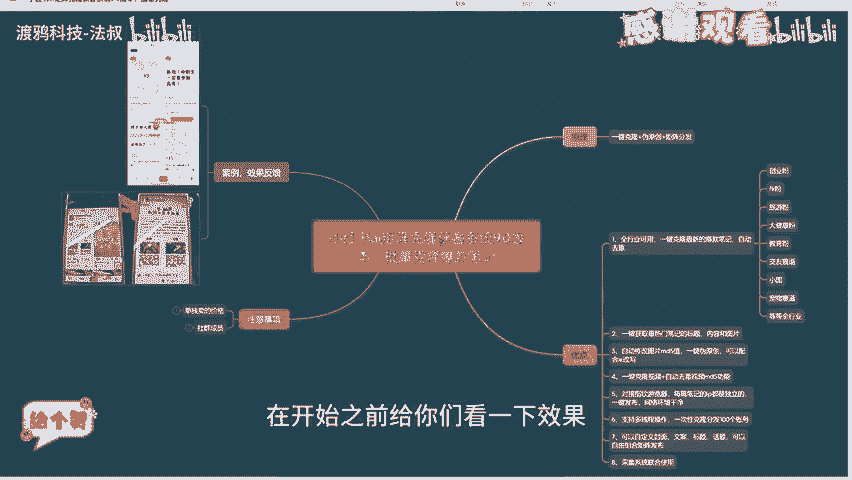

🎼这个是做教培赛道的，可以看到我们克隆的笔记，眼睛8000多7000多，报的概率是非常高的。因为我们克隆的是爆款笔记，他这个爆款笔记爆过之后，它还会再爆，所以报的概率是非常大的。

还有这个做旅游赛道的2万多小眼睛可以看到是非常猛的，它的原理是什么呢？通过一件克隆，我们的爆款笔记，然后进行伪原创，进行矩阵发布，优点是全行业可用，一键克隆最新的爆款笔记自动的去重。

像这种创业粉复刻粉旅游粉等等。全行业都可以用，可以一键的获取最新的笔记标题内容和图片，然后自动的修改图片的MD5值，配合AI改写，一键进行伪原创。

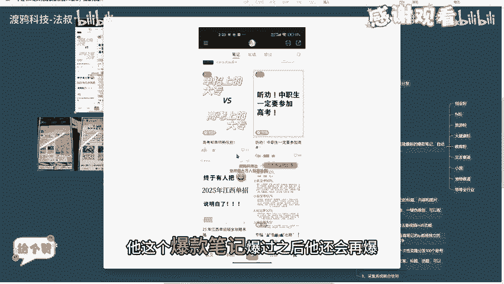

🎼还可以一键克隆视频，自动的去虫视频的MD50。第五是对接我们的指纹浏览器，让它发布的每一篇笔GIP都是独立的。🎼网络环境非常干净。第六，支持多线程操作，一次性克隆分发100个账号都是没问题的。

还可以自定义封面文案标题话题可以自由进行组合矩阵发布，我们还加入了采集系统联合使用。上面给你们看一下我们的系统。🎼打开我们的软件之后，是这个登录界面。首先我们要注册一个账号，注册好之后。

我们直接登录进去。🎼然后大家使用的时候一定要规范使用，不要侵犯人家的知识产权、肖像传什么之类的，一定要规范使用。🎼信息这里。🎼我们每日签到是可以领取200积分的。

🎼然后我们社群成员的话是可以免费领取一个一年的卡密。在这里输入激活之后，我们就可以无限使用。然后非社群成员的话，就要消耗我们对应的积分。然后邀请一个朋友注册，可以获得两0版积分。

然后给你们看一下我们对应的功能。

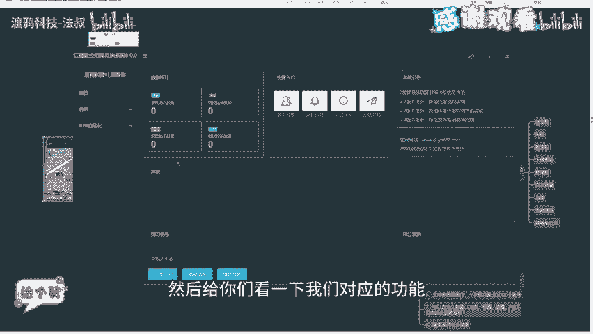

🎼第一个是克隆图片笔记，在开始使用之前，我们要先在比特浏览器这边新建我们账号对应的窗口。这里我们点击创建窗口这里。这里可以输入窗口名称。🎼还可以配置我们的纯净IP我们设存内部是有纯净IP的，配置好之后。

每个窗口的IP就是独立的，还可以一键随意生成我们指纹。🎼比如这些设备名称，这些它都可以进行随机，还可以启动这个每次启动浏览器时，随机指纹。这样配置好之后，我们每个窗口的IP设备信息都是独立的。

这样就不会被官方检测出来，让官方觉得它这个浏览器是干净的。如果我们用普通的浏览器。它的设备信息IP都是一样的，这样就很容易被官方检测出来，对我们的账号进行各种限流。这些纯净IP指纹设置，我们配置好之后。

直接点击确定就可以了。这个纯净IP我们设存内部是有的，然后我这边没有准备。我就选择一个直连模式给你们做一个演示。这个就是我们刚才创建的一个浏览器窗口。我们直接打开。🎼打开之后。

我们在我们电脑的浏览器里面，我们把小红书创作者服务平台的链接复制一下，把它粘贴进来。

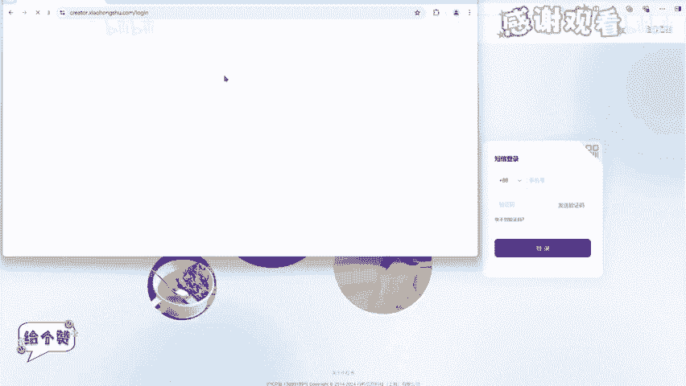

🎼然后登录一下就可以了。🎼登录好之后就可以直接删掉了。🎼下面演示一下各隆图片笔记。首先打开我们的小红书首页，这边随便找一篇笔记。

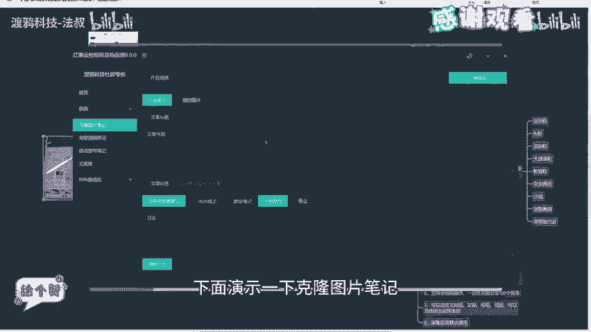

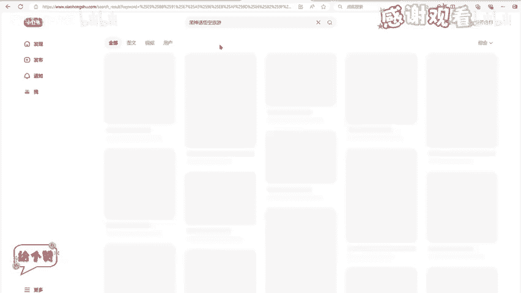

🎼就以这篇笔记为例。🎼我们复制上面这个链接，然后打开我们的克隆系统，把它粘贴到这里了，直接点击一键获取，可以看到我们的内容很快就获取出来了。然后这些图片都是经过MD50修改的。

然后我们的文档内容可以用AI进行委原创一下。然后我们点击选击浏览器窗口，点击刷新窗口信息，这三个窗口就对应我们的比特浏览器这边三个窗口，我们可以选择多个浏览器。🎼它就进行多个账号，同时举证发布。

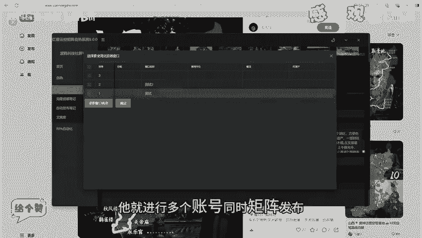

🎼然后这里选择MD5模式，然后我们点击开始发布。🎼Yeah。🎼可以看到已经在正常的编辑发布了。🎼已经发布成功了。然后我们看一下我们刚才发的笔记。🎼可以看到这个就是我们刚才发的笔记，已经发布成功了。

下面看一下我们的克隆视频笔记，我们还是一样回到小红书这边。

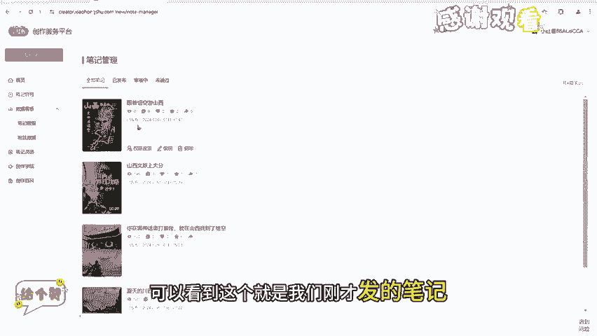

🎼找一个视频。🎼这边随便找一个。🎼复制我们的链接。🎼张贴进来一键过取。🎼可以看到已经获取出来这些文章标题、文章内容、文章标签。然后它这个视频已经进行过MD5值修改的。

然后这些文章内容我们可以进行适当的修改一下。这个标签我们把它删了，然后选择我们的浏览器。🎼MB5模式。🎼点击开始登录。

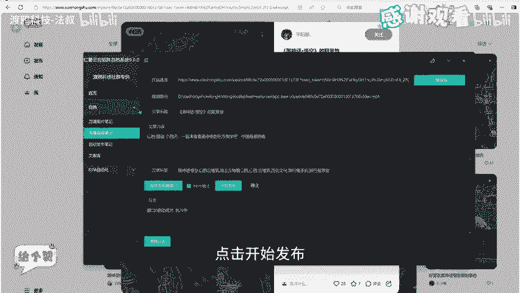

🎼可以看到已经在编辑文章内容。🎼发不成功。🎼这个就是我们刚才发布的视频，可以看到我们刚才发的笔记已经34个小眼睛。

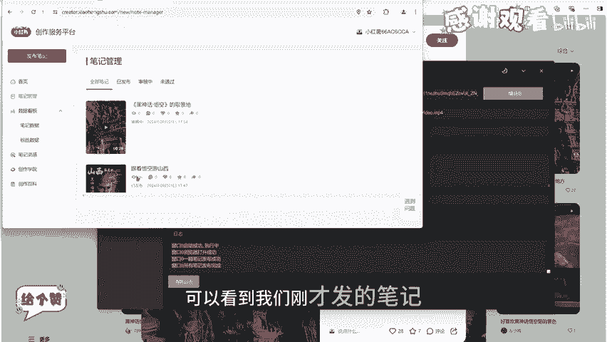

🎼然后这个自动发布笔记。🎼我们首先要在我们的文案库里面导入内容。🎼这个添加标题。🎼添加图片。🎼添加内容。🎼添加标签。🎼我这边已经添加有内容了，我就不给你们演示了。🎼选择标题。🎼这边随便选择即个。

🎼选择酒店。🎼选择内容。🎼选择标签。🎼选择浏览器窗口。🎼然后我们选择随机组合。🎼随机组合就是标题图片。🎼内容标签进行一个随机的组合。🎼然后我们点击发布。

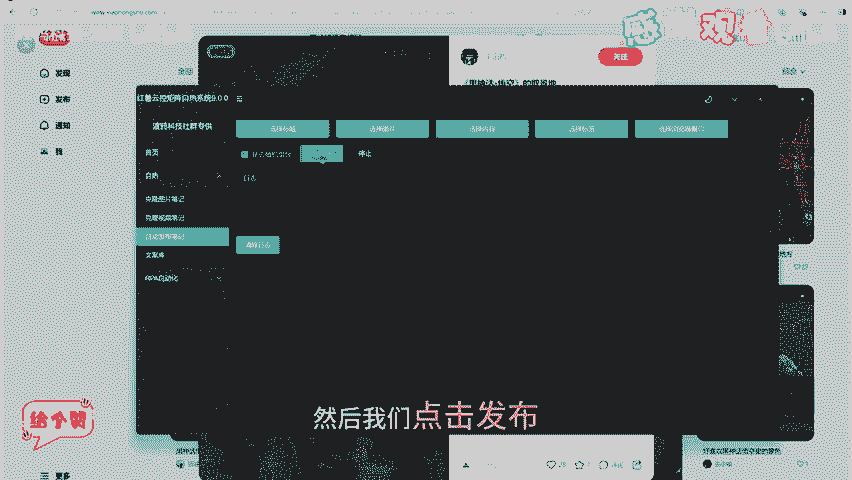

。🎼我们刚才选择的是两个窗口，然后两个窗口同时发布，可以看到随机组合的内容都是不一样的。🎼再输入表签。

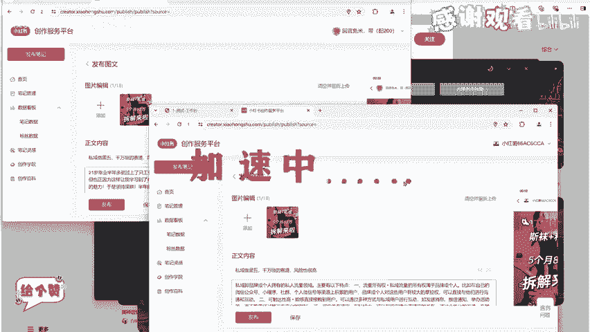

🎼已经在发布第二批词，比如兼职创业。🎼这些都可以进行一个筛选文章日期、点赞数量、文章评论，这些都可以进行一个筛选。

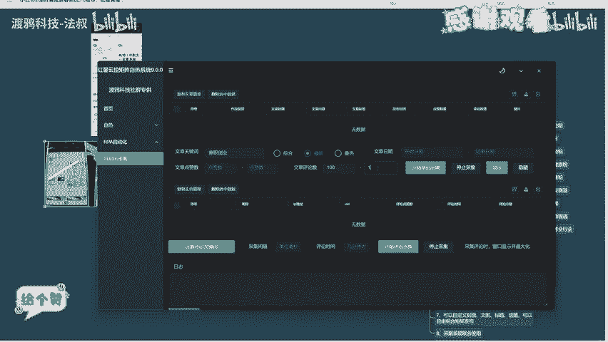

🎼う。🎼然后我们点击开始采集。

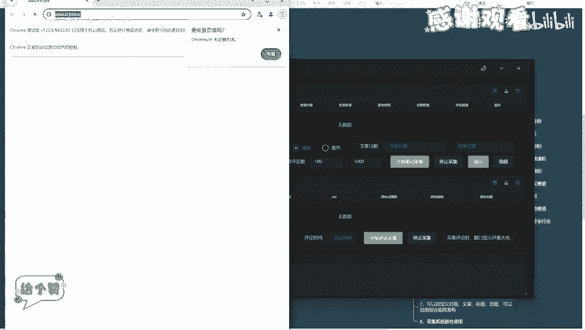

🎼登录一下账号。🎼我们可以看到，很快就筛选出了8篇符合条件的文章，这边做个演示。🎼我就不采集这么多，我们采集好之后点这里可以导出。🎼这个就是我们导出之后的一个文件。

你看这些作品链接、标题、文章内容、文章标签、发布时间，这些都保存下来了。还有我们的图片都保存到这个路径底下了。我们可以去这个路径底下看一下。🎼你看这些图片都保存在这里了。🎼你平时搞小红书调研。

要去搞这些素材。因为我们这个软件是非常方便，非常方便的，就把它扒下来了。🎼不用你一个个的去保存。🎼下面我们采集文章的评论内容，我们选择要采集文章，我这边就传选，然后设置我们的筛选关键词。🎼比如酒带。

🎼拜拜。🎼只要他的评论内容带有这两个关键字的，就可以被我们筛选出来。

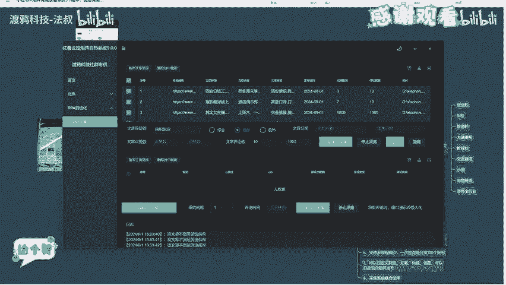

🎼一天1440分钟，就相当于采集一天内的评论内容。我们点击开始采集。🎼可以看到这里已经采集出部分球带球带。

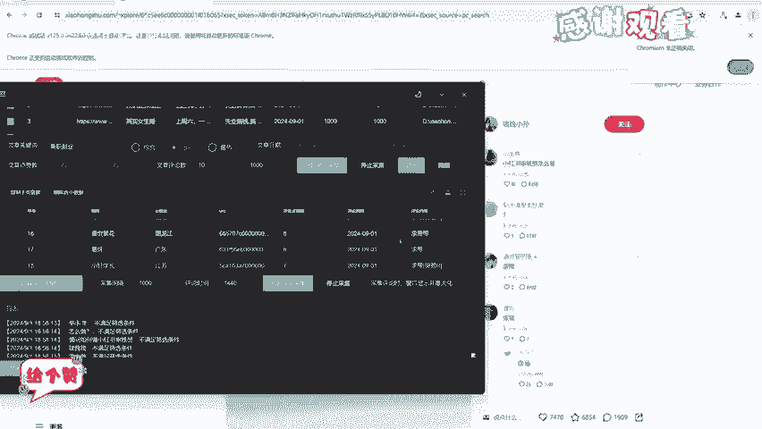

🎼作为一个演示，我就采集这么多，然后我们采集好之后。🎼点在里导出。🎼导出去之后就是我们这个表格，然后我们就可以配合我们的小红书曝光炮机去使用，去进行一个精准的曝光。

这个小红书曝光炮机我在之前的视频就讲过了，我这里就不一一讲解了。🎼感兴趣的可以去看我之前发的视频。🎼然后最后所以上注意事项。🎼本次引流教程工具效果暴力，仅供社群内部测试使用，切勿用于非法操作。

否则任何后果与作者无关。然后我们的社群成员的话是免费使用一年，感兴趣的话可以一键三连支持一下。然后看我的主页地球链接，我找我领取，然后今天就讲到这里，我们下一期再见。

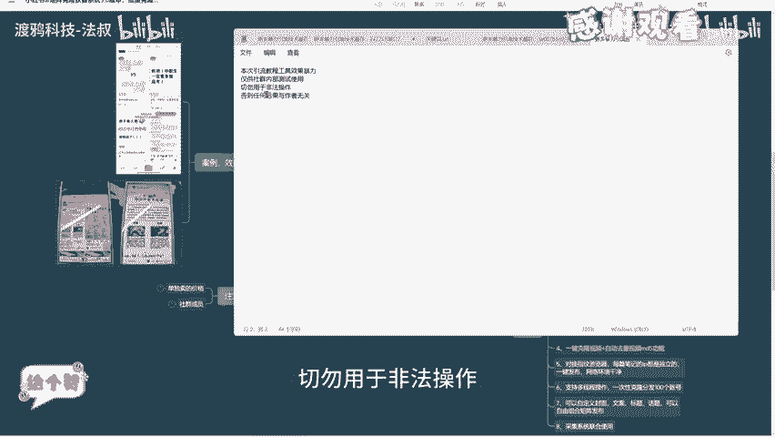

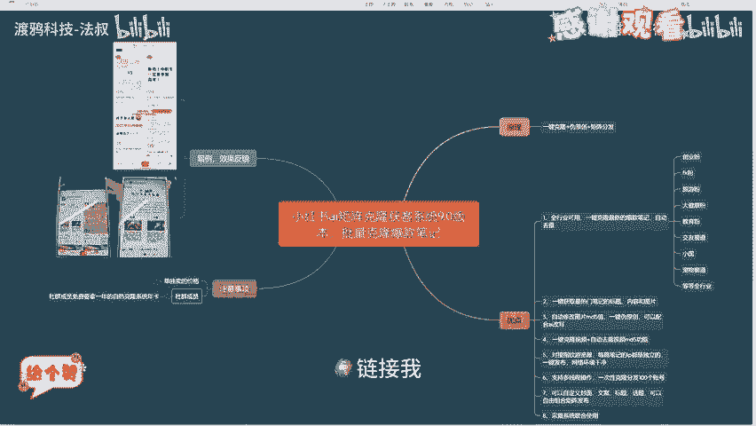

