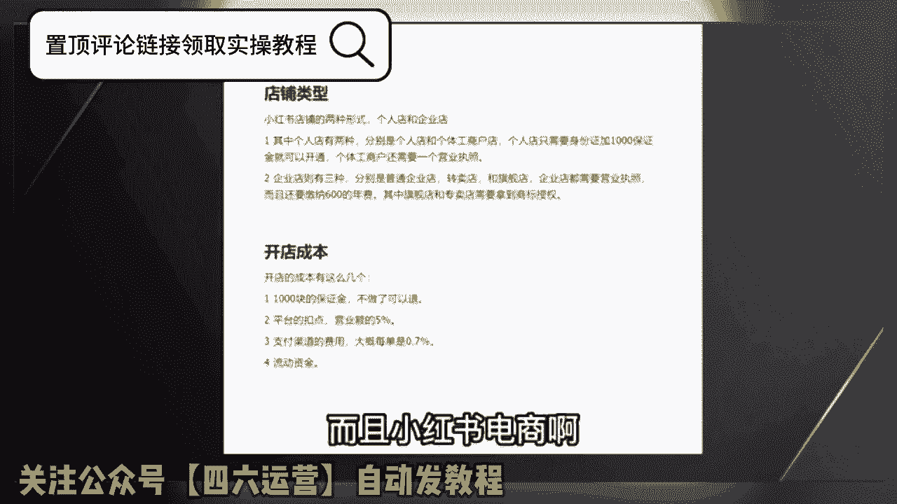
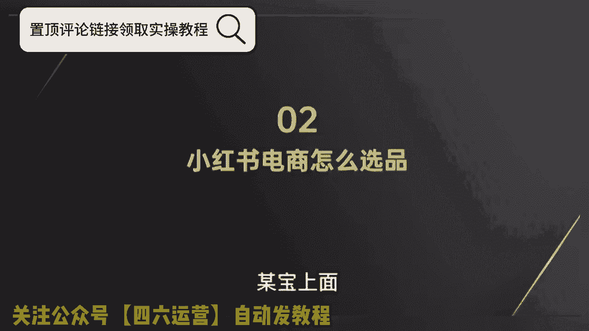
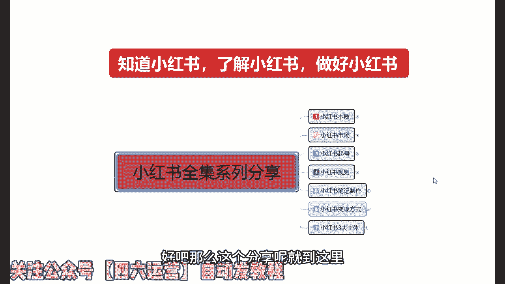
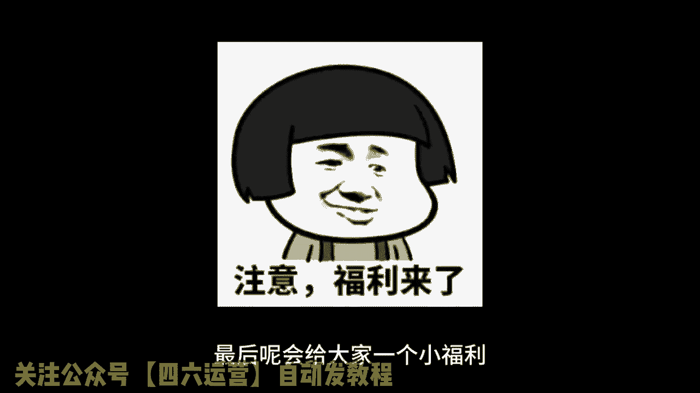
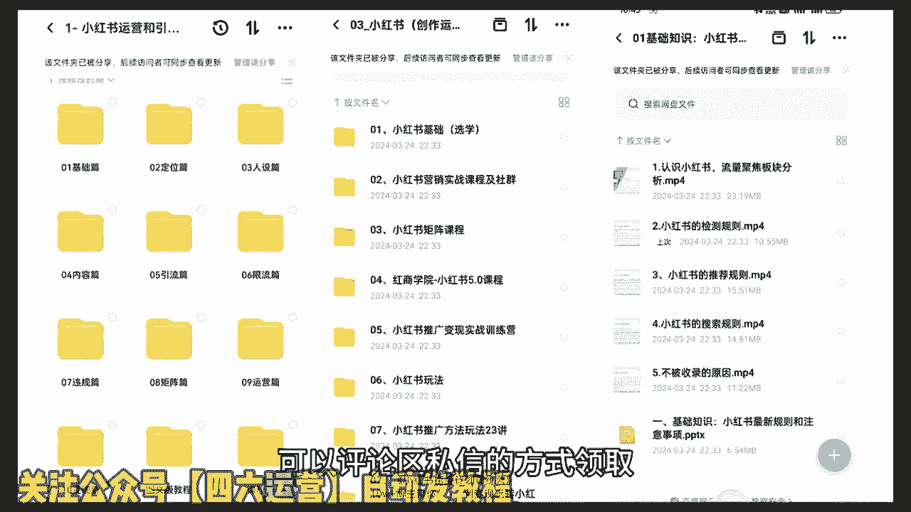
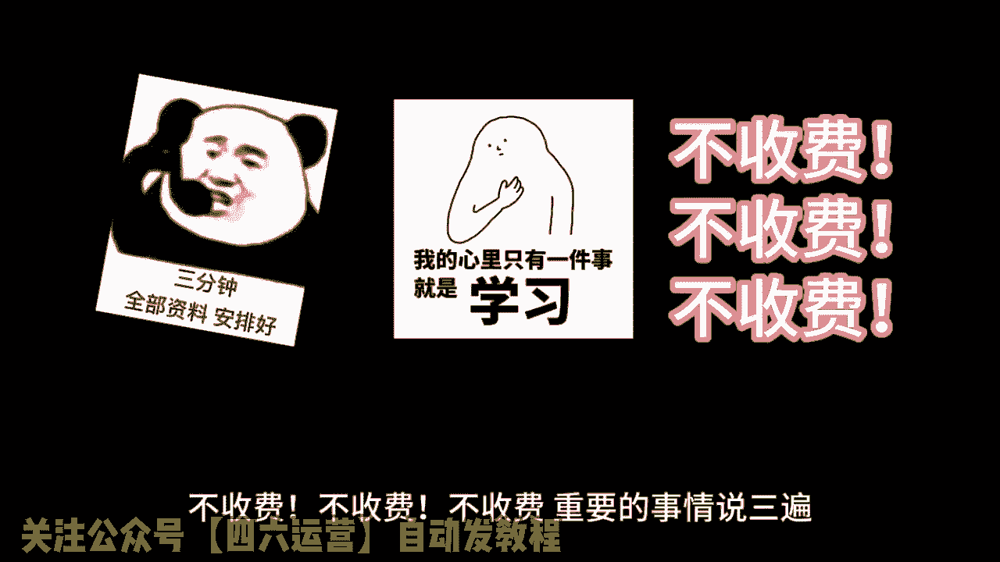
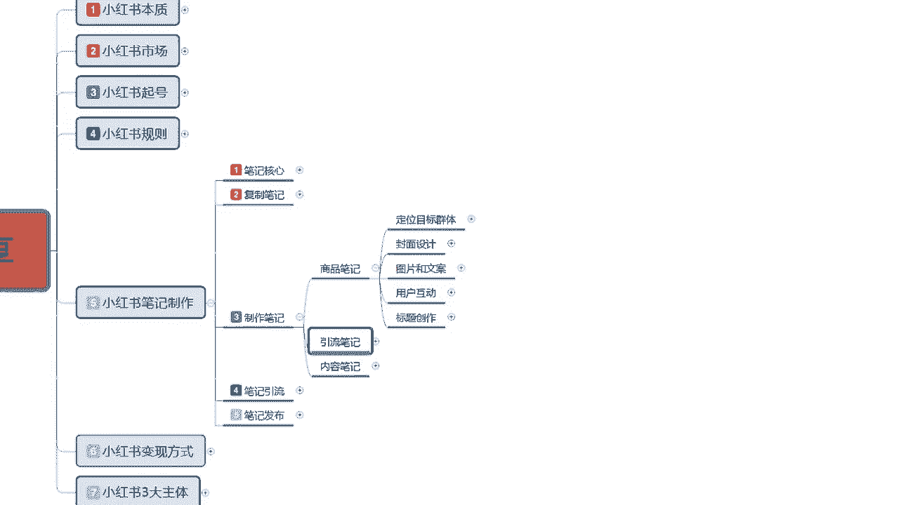

# 2024-小红书官方完整开店教学！从新手开店到爆款店铺，零基础入门小红书起号涨粉运营教程！纯干货，无私分享，电商创业｜小红书运营｜开网店！ - P1 - 李维红书运营教程 - BV1m1421y7GK

钱呢赚钱哎，钱要不要钱，我要啊，还有谁要说最近什么项目最火，那就必须要提到小红书电商，最近几个月，几乎整个互联网都在讨论小红书电商，我关注的几个商业博主啊，包括一些付费社群都在讨论他。

我朋友圈月入五位数甚至六位数的比比皆是，这个项目在年初的时候，我其实就让团队跟进测试，我还在市面上买了一些课程学习，到现在单人单店一个月也能做个一两万块吧，今天我就用一个视频详细的给大家拆解一下。

就是小红书电商到底怎么玩，我会把整个小红书电商的流程，包括一些注意点，比如怎么开店，怎么选品，怎么做流量，一次性给大家讲清楚，你甚至都不用再去看别的相关视频和培训了啊，你就跟着我的视频去按图索骥就足够。

你在这个事情上开始盈利了，视频的结尾呢我还会给大家准备一份资料，里面有我找的课程啊，对你运营小红书电商呢会有很大的帮助，有需要的直接去拿就可以了，言归正传啊，整个项目的逻辑啊其实也非常简单，它就三件事。

第一个呢开店，第二个选品，第三个流量，我们一个一个来讲，先说开店呃，开店其实没什么好说的，首先就是打开小红书，然后点击左上角的菜单图标，再选择创作中心，然后点击更多服务这个选项，选择店铺。

点击立即入住就可以了，你就按他官方要求的提交资料入驻就行了，我居然看到有人把小红书开店包装成一个项目，拿出来卖，居然还有不少人买，这也是很奇特，这里跟大家说一下小红书店铺的两种形式，个人店和企业店。

其中个人店有两种，分别是个人店和个体工商户店，个人店只需要身份证，加1000保证金就可以开通了，个体工商户呢还要多一个营业执照，企业店呢就多一点，企业店有三种啊，有包括那个普通的企业店。

有专卖店和旗舰店，企业店都需要营业执照，而且还要缴纳600的电费，我们刚开始运营小红书电商的时候，你直接选择个人店就可以了，我们实测下呀，企业店和个人店一样，平台并没有对企业店有什么流量倾斜。

唯一的区别是个人店你只能开一家，而一份营业执照呢，你可以开三个店，你一个店如果都没做好，你开再多的店都是没有用的，而且小红书电商啊。

我觉得是不适合店群形式去做的，这是因为小红书的流量机制，它的电商自然流占比非常低，那你铺再多的电量，再多的货有什么用呢，所以只要你看到有博主跟你讲什么小红书店群，我都觉得是在扯淡，小红书是要做矩阵的哈。

但不是店铺举证，而是账号矩阵这个后面的流量获取，那里我会跟大家细说，开店的成本呢有这么几个，第一个就是1000块钱的保证金啊，不做了可以退，第二个呢是平台的扣点营业额的5%，第三个呢是支付渠道的费用。

大概每单是0。7%，第四个就是自己的流动资金啊，一开始大家做呢可以用无货源的方式去做，是对资金要求也不高，你刚开始呢准备个2000块，3000块完全够了呃，开了店以后呢，我们下一步就是选品。

我们应该在小红书上卖什么的，选品其实也简单，在其他平台上的爆款，大概率在小红书上也能报，目前小红书呢我是推荐三个渠道进行选品的，第一个是通过某东，某宝上面找那种小红书平台调性的爆款产品。

呃，身边有做电商的朋友，他自己在某宝的店铺卖的爆款，搬到小红书上，第一篇笔记就开始出单，第二篇笔记单量就已经破百了，第二个呢是通过某音的那个精选联盟，你在某音的精选联盟排行榜。

你可以看到现阶段哪些品卖得好，只要符合小红书用户调性的产品，直接搬运测试就可以了，第三个就是某多多的这个销量排行榜，选择适合小红书的类目排行榜，从中选择相应的爆品搬运到小红书，整个选品的逻辑。

就是我们要利用市场来帮助我们选品，而不是自己在那瞎想，我们要借助大卖家的选品能力，来弥补自己选品上的不足，所以我们只要判断一个东西啊，就是这些排行榜上的爆品，是否跟小红书的人群有匹配的可能，如果有。

我就搬过来测一下对吧，相当于是借助了别人的能力来帮我们自己选品，这样反而是最快捷，而且是最稳妥的选品方式，肯定比你瞎测成功率要高很多，然后等你这个产品上架以后呢，就到了最重要的环节了。

我们应该如何获取流量，小红书它是个种草平台，你店铺九成以上的流量都是来自你发的，发的笔记，这就是为什么我之前说小红书不要铺店群，而要做账号矩阵，尽可能多的发笔记耗流量，它的通路就是用户通过你的笔记啊。

对你推的产品产生兴趣，然后到达你的店铺完成购买，你堆一堆店铺对吧，你铺一堆店铺一个还不如多发笔记，多发几篇笔记的这个效果好，所以怎么在小红书上发笔记对吧，就是你小红书电商是否成功的关键。

小红书这个平台你直接发硬广，我觉得效果非常差对吧，本来小红书的用户群体认知就比较高，你直接发广告也没有办法获得信任的啊，更不要提转化了，你发笔记的时候一定要用一个素人的角度，你知道吧。

就是用户的角度去切入，站在用户的角度去做种草内容，而不是官方视角，这才是真正有效的呃，这种种草笔记怎么做其实也很简单，就是去各大平台的商品评论里找，比如某音某宝，某东的商品买家秀，找到好看的素材。

你直接copy下来用嘛对吧，文案呢在买家评价上去做修改，这些买家的评价就是商品用户的使用体验，天然的适合用来做这个中考笔记，而且可以说是取之不尽了啊，然后当你单个账号的SOB跑通了是吧。

我们就可以开始举证引流了啊，通过批量上小红书账号，批量发布笔记给我们的店铺来引流来放大，那基本上整个小红书的电商的运营啊，就是我上面分享的这些，外面不管多少钱的培训啊，3000块也好，6000块。

1万块也好，其实就是这些东西，有些培训可能还没有讲清楚啊，根据上面几个点，我给大家准备了一份资料，里面包括了小红书账号起号运营的方法，以及一份小红书电商的视频课程，你如果打算经营小红书电商。

你也不用看别的东西，就跟着这份资料做足够，你开始盈利了，有需要的点赞加关注，在评论区回复红书电商，我分享给你，要有自信啊，你是最好滴，知道吗，大家好，今天给大家分享一个小红书全集系列的一个。

整体的一个分享啊，这整个系列呢是我们从小红书，从他的一个本质到小红书整个三大主体啊，全部的一个内容啊，包括我们整个小红书市场的一个运营起号呃，创建，包括我们的一些网络博主啊，引流啊，店铺啊怎么去操作。

就是全集，为什么要整全集呢，我呢是从小红书最基础一直给大家讲到最后啊，进行一个系列分享，因为这期的课程的话它是非常多的一个内容，而且只有一个分享内容的话，我也准备了比较长的一个时间。

首先呢我们就需要知道小红书，了解小红书，然后才能去做好小红书啊，我呢会分成好几十节课啊，大致的内容的话我给大家先看一下啊，从小红书的本质开始，什么叫小红书的本质呢，就是说我们只有先了解小红书。

它到底整体的一个小红书平台，它的主作用是什么啊，我们要了解它整个主作用以后的话，把它进行拆分，拆分的话，就是说小红书它这里面包含了六个内容在里面，我们从这六个内容里面，我们自己结合自身啊。

我是想做小红书开店也好，想做网络博主也好，想做小红书引流到其他平台也好啊，在这个里面的话，我们要先了解小红书整个系列的一个分享，就是把小红书把它拆分开来，我们在这个小红书里面。

结合我们自身能够在小红书做什么，这个呢就是小红书的本质，第二个呢是小红书的一个市场，它的整体市场的话怎么说呢，就说小红书主要定位的话，它都是中高端人群，但是没有那么多啊，普遍的话都是女性用户为主啊。

高校学生及网红等，其中的话你年轻女性用户占比的话，年龄呢多都集中在15~18到35，但是正常来说的话，它里面包括从12岁一直到45岁左右，基本上都是这个概括年龄，但是整体集中的话，就是说在18~35。

这个范围以内是最多的啊，而且是女性，所以说小红书它的一个市场，为什么说小红书上市场，小红书市场的话，我们要考虑在小红书里面开店，它就分为一个热门商品和一个热门话题，热门话题的话就是说我们在小红书上面。

什么样的话题比较适合小红书的一个用户啊，对我们的一个发展的话比较熟悉，所以说我们要从这个热门商品和热门话题，里面去选，第三个大课时呢，就是说给大家分享一下小红书起号，为什么用小红书的话怎么说呢。

账号的权重越高，它整体系统给我们的权重也就越高，我也就是说我们把基础把它做好了以后的话，我们后面这个账号你想把它做爆才容易，如果说你前期的一个小红书起号定位之类的，你都做不好。

那我们这个小红书整体来说的话，你想把它操作起来是非常困难的，这就是第三大课时，第四大考试啊，小红书的一个规则，为什么说要想了解小红书的规则，我们前面了解了小红书的一个本质，把它解析以后啊，了解它的市场。

然后通过市场啊判定我们要做什么账号，我们把小红书的账号做起来以后啊，我们要规避小红书平台的一系列的规则，这个就是整个全套系列网下面的啊，包括了解规则规则以后，小红书它的一个主体就是小红书笔记。

了解规则以后呢，就是小红书的主体笔记怎么去制作，这是第五课时，第六啊，大点就是说小红书变现方式，什么叫小红书变现方式呢，就是说我们通过小红书怎么赚钱，小红书我们前面做的只是基础啊。

就是说把前面的东西全部学会以后，我们才去了解小红书变现，但是你要也要先了解变现的方式，你然后再把它整体结合起来啊，然后从1~5，你我们就可以了解到这个小红书到底要怎么做，他通过什么样的一个方式进行变现。

变现以后我们怎么把钱弄出来啊，这是一个整体，最后一节课呢也就是第七大课时，也是内容最多的一个课时啊，小红书的三大主体，什么叫小红书三大主体呢，第一个是小红书开店，第二个是私域引流。

就是我从小红书上面我自己创建一个账号，然后把这些啊对我发布的内容感兴趣的人，引流到我自己的私欲，最后一个主体就是网络博主，网络博主整个来说的话，他还嗯就是网红，相对来说的话稍微简单一点啊，包括网红啊。

你我到后面我们的一个小红书变现啊，包括接广告啊啊等等，都可以在这个上面进行实现，所以说我整个一个小红书系列的话，我是我在这里呢，是给大家把它分为七大部内容啊，七大部内容里面的话。

它这个内容大家要了解一点啊，他不是只有七个课时，他是七个大的组成部分，然后分成无数个，因为我现在就整体来说的话，我自己都不知道这整套课程下来，我需要给大家分析分享多长的一个时间段。

因为它的整个内容的话是非常多的啊，从小红书开头一直到小红书结尾，它可以贯穿我们小红书整个，前中期的一个操作啊，中后期操作的话不包含在这个里面，为什么，因为中后期的话，他要看我们自己整体规划的一个思路和。

规划的方向方式不一样，它的操作方式也是不一样的，就相当于我们怎么说呢，就说以前很多答疑分享啊，或者说是你在其他地方了解做规划，中后期说实话你不了解，你不了解对应属性的一个产品，不了解对应属性的一个利润。

还有对应属性的一个怎么说呢，就是说目的你让别人嗯定个小目标，定个一个亿对吧，不知道你的中中期目的在什么地方，你要通过什么方式，通过投入多少，来判断你中期和后期的一个投入和规划啊，只有了解这些以后。

你中后期才好做，所以说我们要把小红书做好，你前中期的话，一定要把这一套整个全集系列全部都了解一下，你才能去把整个小红书做好，因为这一期的话我给大家分享的就是说，我们从第一期第一大节到第七节课。

整个大姐你如果说真的用心的去听去了解的话，那我相信大家对小红书会有一个字的跨越，对小红书，也就是说你后续不管怎么去操作，包括你小红书不好做了，你去做抖音也可以啊，你觉得抖音不好做了，你想做店啊。

你去淘宝去拼多多，或者去京东，去其他任何地方，这一套方式都可以用的下去，因为我这个整体的话，我是拿小红书做主体来给大家进行分享的，但是我们其实所有的一个网上运营平台，它基本上都是差不多的。

只是说他有的一个模式多一点，复杂一点，有的模式少一点啊，精细化一点，但是小红书对于其他的平台模式来说的话，目前对我们新手来说是最好的一个平台模式，为什么淘宝时间太长了啊，有市场，但是说我们想挤进去。

你没有一定的基础，我们把它做不起来，你一个新手，你不可能说你做了刚了解，你就去跟人家十几年的老店去拼不过的，对不对，拼多多更不用说了，那是做批发的啊，全是商家，你怎么去拼抖音，抖音的话，他不是卖货啊。

他没有那么直观的商品带货渠道，他的话就是说网红博主什么都有啊，他带货也是只是说一个小部分，他只是说给市场啊，主要是做网红做广告，给大家一些了解一些喷漆，但小红书不同，小红书的话，他因为是出来。

虽然说啊也出来几年了，但是整体来说的话，对于网络营销平台的话，他还是刚入门的一个小新手啊，那我们一个小新手在小新手里面去找的话，它也有很好适合我们的一个市场，所以说这整个一个系列的小红书全集。

系列分享啊，主要是让大家了解小红书，知道小红书，并且呢最后做好小红书，从这个里面获得我们的一个经济来源，或者说是一个精神支柱啊，从下一节开始呢，我会从第一课到第七课对大家进行。

给大家进行一个全系列的一个分享，好吧，因为时间的一个原因呢，这节课主要是给大家讲解一下，让大家了解一下我的一个小红小红书，全系列分享给大家分享的是什么内容，让大家进行一个初步的了解好吧。

那么这个分享呢就到这里。

下节课呢我们从小红书的一个本子开始，最后呢会给大家一个小福利。

整理了小红书运营实操资料，可以评论区私信的方式领取。

通过之后会第一时间发给大家，注意领取资料，不收费不收费不收费。

重要的事情说三遍，大家好，今天给大家分享的是小红书全集系列的，一个第五大课时，小红书笔记的一个制作啊，从这节课开始，包括我们第六节第七节三大主题课程，嗯这三节课程的话。

是我们小红书正式入门的一个课程内容，学习上面四个，说实话上面四节整体的一个课程的话，我们不管是本质也好，市场也好，起泡也好，规则也好，只是说我们了解了整个小红书他是做什么的，他的市场有哪些啊。

我们应该在小红书上怎么写根号，最后呢就是我们小红书它里面有一些规则，我们可以去利用和规避，从第五节课小红书的一个笔记制作，包括小红书怎么去通过什么样的方式去变现，最后包括小红书的三大主体，第三节课拆除。

我们正式步入小红书整体操作的一个实操步骤，好吧，废话不多说，开始今天的课程，第五课时，小红书笔记的制作，小红书笔记在这里啊，我给大家强调一点啊，笔记它分为很多种的类型，但是它万变不离其宗的话。

说实话也就是四个点，笔记核心，产品封面标题和话题，这个产品是什么意思呢，小红书如果说你想把小红书店铺整体把它做好，我们在小红书上面光起号是没有用的，正常你就算说是都做网络博主也好，做引流也好。

你必须要有一个商品账号挂上，也就是你必须在小红书上面去开一个商品店，这个商品店里面的产品你卖或者不卖，你卖资料也好，你卖商品真的真正的卖商品也好，或者说你随便挂个链接也好，但是你一定要有这个店。

为什么小红书账号你开店以后，他有额外的加权，就是给你提升我们基础账号的一个权重，而不是说我们普通的网红店也好，引流店也好啊，它不像商品店一样，商品店里本来你在小红书上面，我就是准备去卖商品的。

所以说小红书的核心，你要真想把在小红书上面去赚钱，不管你有没有产品，你在小红书上面啊，不管你有没有产品，一定要去开一个店，只是说这个店运营或者是不运营，就靠我们自己啊，怎么说呢，自己怎么打算吧对吧。

你是想在上面小红书上面边宣传边做，还是说在小红书引流到外面去，或者说我准备做直播带货之类的，但是你做直播带货，说实话啊，你去帮主家推广产品也好，你去帮主家打广告也好，你最好也是要开一个店。

在你的店铺里面去对别人进行一个宣传，同时的话，你自己的话术话题，也是要通过这种店铺的形式去传达给用户的，所以说小红书开店必不可少，你要真想在小红书里面赚钱，或者说想把小红书玩好，你做网红做博主。

这个店你必须要开，你就算是开完以后放在这个地方啊，一件产品不上一个笔记，不发不发笔记，不可能不发商品笔记就可以了啊，个人正常笔记要发的，就说你这个产品放上去，你不用去管它了啊，其他的就跟你没有关系了。

你就是开个店，只是说给自己增加一点基础权重，如果后期我们店铺遇到瓶颈，或者遇到其他东西了，我们再通过这个店铺，我得把这个店铺运营起来再去操作也是可以的，但是小红书你真想去赚钱的话，你不得不开店。

你就算是做引流的，你都不得不得不开店啊，你如果说小红书在小红书上面，你的一个整体的话，你不去开店，你的核心笔记，它的一个就是我们推广笔记的时候，小红书我们做笔记的时候，你的正常笔记发放出去。

要比普通的用户权重少接近1/5，接近1/5或者说是2/10啊，就是平白无故减少十百%分之20的流量，你愿意吗，对不对，而且小红书开个店的话，说实话就1000块钱保证金，保证金的话，你到时还可以退出去。

花个十来块钱，他有一个税收，但这个的话我们就可以不用去在意他了对吧，1000块钱的事情，你增加10%到20%的一个流量，对于我们来说的话，其实是差别很大的，你本来正常短信曝光1000的话，给你1200。

1200，那么你在技术属性上面，你根据我们之前讲的课给大家起的那些数据量，我们再去分析你的一个点击啊，数据啊，你再把这个账号做起来的权重就会又会高很多，而且这个钱你又不是不能取出来。

所以说我们在小红书上面做笔记的时候，一定要有产品好吧，这是给大家讲课之前让大家先了解一下啊，就说我们小红书你是发笔记也好，你是嗯做网红也好，你做引流也好，你做商品也好，你必须要有一个店好吧。

然后笔记的核心是什么，就是我们小红书我们去发布笔记也好，其实在这个里面的话，小红书的一个整体笔记的一个核心是什么，我们打开手机，在小红书上面会显示很多不同的内容，但是一个画面的话。

就是我们手机打开小红书以后，它正常显示画面是四个，就是四片笔，往下面拉，这个是推荐的，有推荐的一个笔记啊，往下面拉大概有20个左右，然后会进行一次刷新，20个刷新里面的话。

他有一件事是嗯小红书自带的推荐笔记，这个笔记的话他会挂一个店铺上去，这个是什么，这个是产品笔记，就是这个店我正在开卖产品，这样吧我给大家这么讲的话，大家可能没有什么太大的印象，你们如果说真的感兴趣的话。

那我给大家边说啊，我因为我这边手机的话投屏它不是很方便，所以我在这里呢就直接给大家讲，我们小红书笔记的一个核心产品，封面标题话题，这个里面就说我们小红书笔记的话做核心，我们打开手机在小红书上面的话。

它会显示很多的内容，不管我们怎么去搜索啊，我们或者是不用搜索，我们直接在发现里面，小红书发现里面他直接给我们推荐的，推荐的笔记也好，视频也好，直播也好，艺术也好，穿搭也好，摄影也好等等。

这些东西都是一样的，知道吧，我们打开的话，打开小红书以后，进来以后的话，它都是四个四个笔记页面，这个B页面当我们往下面拉的时候，我们偶尔会在右下角啊，就是小红书笔记右下角看的，看见赞助两个字。

这个是小红书商品通过投流啊，进行了一个封面抢抢占，也就是说大概有8~10个，正常笔记里面会附带一个商品推送，以前的话还没这么多，以前的话可能20个左右才会出现一个，那个赞助的一个商品。

现在的话基本上就是十个左右，七八个也有可能他是随机投放的，看他现在的一个推广力度，不如往后的话，他这种嗯商品的类型的话可能会越来越多，因为以前的话我们想找商品都找不到。

但是现在小红书他在这个里面发现商机了以后，他把这个小红书商品的一个数据量放大了啊，由以前的百二十分之一，现在提升到接近1/10，提升了一倍的一个展示量，说说产品笔记，你如果说要把产品笔记做好的话。

这个里面的话它有一个产品笔记推流，但是不适用于新手，因为你们点进这些赞助里面有，我们大家可以发现啊，嗯我这边随便点了一个笔记，我们去看他的一个基础粉丝数量和一个货，在与收藏基本上都是粉丝。

起码是在3000加到5000家往上走，获赞与收藏的话是1万8到2万，2万5万10万这种形式，因为别人是已经把店做起来了，账号已经做起来了，然后去开始推广的产品，然后再提升它整体的价值。

卖它的一个产品属性，通过这种方式来获利的，所以说我们前期的话不需要去投这个，但是我们要知道小红书核心笔记里面，他是有这个成分的，就是它的推广力度是越来越大了，以前我们看笔记的话，可能很少有人会注意。

他的右下角这个地方有一个赞助，这种的话是现阶段小红书刚推出的商品，头牛就和我们做淘宝也好，做其他的也好，它都有一个付费付费的一个直通车，推广啊，转转等等之类的，他都是类似的，这个是花钱弄的好吧。

然后小红书整体的一个核心笔记，如果是抖音，我们每回刷的时候，它只会显示一个产品，但是小红书的话它是四个笔记，所以说从这个里面我们要去抢流，我们现在要了解的是，小红书核心笔记在产品封面。

标题和话题四个当中什么是最重要的啊，在这里的话其实也是非常简单的，封面最重要标题，第二产品和话题其实跟我们去产品的核心啊，影响不是太大，但是它也是一个步入点，如果说我们没有这个没有这个封面和标题。

我有封面和标题，没有产品和话题的话，我们它是没有后续力量，它和抖音不一样啊，抖音的话，每次我们去刷抖音，他都只会给你显示一个文章，一个视频，一个内容，你不愿意看，就两秒钟就两秒钟，第一视眼的两秒钟。

你看见这个抖音不舒服，啪就下一个，下一个又不说哈，就又下一个抖音，只有两秒的展示时间，但是小红书不一样，小红书每次显示的是四个，大概的展示时间是在五秒钟左右，也就是说你的小红书要在五秒之中吸引到用户。

那么你的封面就是最重要的标题，排其次你这个笔记里面的内容，我们现在不说产品内容啊，我们说笔记里面的内容和你的内容话题，别人是看不见的，也就是说你在五秒之内，你的这个封面能不能写封面和标题。

能不能吸引到用户进行点击，然后进行你的一个笔记观看，或者说是话题的一个欣赏讨论啊，就在于封面和标题，封面整体占比达到了70%到80，标题的话说实话只有20%到30。

他们两个整体结合起来就是笔记的一个核心，当然这只是表面核心，我们还有后续的一个核心，后续核心是什么，我们做产品也好，做笔记内容介绍也好，做网红也好，做引流也好，做话题也好啊，这两个才是后续核心。

也就是说封面和标题是表面核心，内容的话是产品和话题，这个才是最真实的一个核心，我们只有把这四个点结合了，你的一个小红书笔记核心就找到了，围绕这四个点先去做封面，前期70%的投入也要放在这个上面。

因为你的封面吸引不了用户，别人不会点进来四个展示画面，或者说20个，你从20个里面去挑啊，20分笔记里面你能不能达到你的一个点击率，达到11%，接近13%以上进入下一个成绩，就靠你的封面和标题。

这个就是整个小红书笔记制作的一个整体核心，如果说我们把这个核心把握住了，你后续操作再怎么去操作都简单，如果说你把这个核心把握不住，我们笔记核心一般都把握不住，你不管做复制笔记也好，做制作笔记也好。

笔记引流也好，笔记发布也好，你后面你做的任何东西都没有用，因为你没有把握到用户的心理层面啊，你的话题不够吸引人的，封面做的不够漂亮，不够好啊，内容不是我感兴趣的，那你觉得你的整体数据流量会爆发起来吗。

不可能的，对不对，所以说封面是第一要义，70%，接近80%，应该说是75往上标题是占25%，因为你封面再好，你的标题不吸引人，标题内容做的不好也是白扯，那后面产品话题你就更不用谈了对吧。

我们把起号起完以后的话，就说笔记核心一定要了解掉，嗯用课程的一个原因，那这一节呢就给大家讲到，这，主要是给大家介绍一下，我们小红书笔记制作里面，在制作笔记之前，我们应该把重点放在什么地方好吧。

下一节课给大家讲解一下复制笔记，什么叫复制笔记呢，就是说把别人的笔记啊内容复制过来，用到我们的一个账号上面进行一个宣传推广，我们前期操作嗯，对于很多新手来说的话，我不知道自己怎么去做笔记也好。

我不知道自己怎么去排版也好，我没有材料，我没有素材啊，我不知道等等这些内容，我们其实可以用复制笔记这种方式去操作，让我们先熟悉整个小红书的一个体系，再接着进行下一步的操作好吧，下节课呢给大家讲解一下。

我们复制笔记的一个整体实操模式，那这节课就到这里，大家好，今天给大家分享的是小红书全集系列，第五大课时的第二课啊，父子笔记的一个内容，整体来说的话，在上课之前呢，先给大家说点其他的啊。

就是说我们在了解笔记的时候，因为上一节呢已经给大家讲过了，笔记的一个整体核心，说实在的就是一个封面和标题，把这两个做好的话，后续的一些操作其实都是比较简单的，但是对我们新的一个小红书用户。

或者说我们新刚入行的一些朋友来说的话，虽然说我们了解这个封面和标题，但是我们自己的话就是说缺少资源的情况下，我们是没有办法去真正的自己去制作，这种小红书笔记的，为什么。

因为小红书笔记整体制作的话看似很简单，但是它其实选择性很多的，你负面也好，标题也好，产品也好，话题也好，你要围绕你自己的组织去操作，你虽然说对自己的产品，或者说对类似的东西很熟悉。

但是我们前期真要去操作的话，你首先你还得玩转小红书整体的一个规则，这是我们在操作小红书笔记的时候，这整体里面的话其实我们有多个选项，而不是单独的，只有制作笔记这个选项啊。

包括之前给大家讲的我们的一个整体笔记核心，这里我要额外给大家讲的是什么呢，就是说我们小红书笔记制作，对我们前期来说的话，我们不熟悉的情况下，你可以拿一到两个账号整体熟悉一下。

把自己的模式方式全部弄清楚以后，再自己重新再开一个账号，把这个账号拿去做组件，如果说你觉得你的时间比较急啊，资金比较紧张之类的，那你可以怎么说呢，就是说先拿别人的作品复制过来，进行修改以后再进行上传。

这就是整体笔记里面，我们需要注意到的一些事项，小红书笔记制作这个里面的话，我给大家分为第一个是核心笔记，主要就是说让我们了解这个笔记的重点，在什么地方啊，我们的内容说实话你前期的封面做不好。

内容的话效果不大，所以说我们在这个方面的话，你封面做的不差的情况下，那你的笔记想火起来的话，其实是很容易的，但对于新手来说的话，我们没有这方面的资源，那么我在这里给大家分享的就是说四个部分。

两三个部分呢是和笔记有关，最后一个笔记发布呢是给大家讲的一个技巧，这里面复制笔记部分，复制比一部分的话，说实话这个比较适合，我们这个刚接触小红书没多久，或者说是对我们网络运营这块不是太熟悉的人。

不知道自己怎么去操作，怎么去了解的人去操作这个数字笔记可以，如果说我们有一定基础的话，说实话有自己的商品，有自己的渠道，有自己的信息的话，自己去做，用制作笔记这个方式。

后续呢我会给大家一个一个的进行讲解，第四个点就是第四大节的时候笔记引流，它整体的话是讲我们这个笔记做出来以后，他得到的一个引流效果，包括最后一个笔记的一个发布方式啊，因为笔记的话，他发布方式。

它会给你那个流量的一个权重是不一样的，知道你在什么时间段发，在什么，选择什么样的话题，选择什么样的发布时间，选择什么样的发布方式，它的权重都是不一样的，所以说有些东西我们要慎重的去选择好吧。

那这节课呢直接步入我们的一个正题，主要是给大家讲解一下，我们整体的一个复制笔记内容，说实话复制笔记内容的话，我们在这里进行讲解的话，可能内容会偏多啊，我们能讲到什么地方，就讲到什么地方，这个展开太大了。

那我们一条一条来吧，今天给大家主要讲的，就是说我们父子笔记的一个内容，复制内容的一个选择，小红书笔记分享，我们可以把它分为三个点来进行分享啊，第一个是产品内容，主要的话就是说针对我们主商品。

就是我在小红上面，我想去卖商品对应的一个展示内容，但是这部分展示的话，他只会在搜索页面进行展示，在我们的那个推荐页面里面，它不会进行展示的，这个大家要弄清楚啊，就是主商品就是商品笔记。

它只会在搜索页面进行展示，不会在主页面进行展示，主页面进行展示的那种商品的话，那都是和小红书有合作的，就是他花钱买的流量啊，这个我们暂时不考虑，第二个就是引流的，如果说我们要做小红书的整体。

账号权重和商品权重的话，我们不光要做商品笔记，就说我们店铺里看真是卖货的话啊，你不光要做商品笔记，你还要做引流笔记，引流笔记，你还要做内容笔记这三个组点啊，那什么是引流内容，引流内容的话。

他就是说显示的是呃产品的特点，优点，材质类型等等，但是这个的话我们不发商品，比我们直接把这个产品相当于做了一个包装，做了一个介绍，对大家进行宣传，发普通笔记就可以啊，就是发搜索推荐的那个笔记就行。

分享内容也是发这个笔记，只是说他分它的一个内容的话，也是对产品或者对我们店铺，对我们整个账号，或对我自身的信誉进行的一个优化和升级，这个叫内容分享产品的使用方式，场合时间性类型，风格等等。

通过这种方式我们就确认了啊，我们小红书你不管是坐垫也好，不做电也好，他都有三个风格，你不做电的话，那么只有两个，但是你坐垫的话基本上都是有三个风格，这三个风格的话，就相当于是我们的一个产品内容。

一个引流内容和一个分享内容这三个点，这三个点我们操作的时候，它的复杂太多的话就又体现出来了，在这里呢我给大家是把它单独列了三条，我们首先来看第一条产品的内容，产品内容主体商品的笔记的话，就是说不是原创。

我们这个给大家讲的是副词内容啊，我不管大家是怎么想的，我说的这个整体副词内容，但是我们可以把它用到自作笔记里面去，其实内容是差不多的，也就是说我们在复制笔记的时候，你也要围绕这三个点去走，知道吗。

就是你不管卖什么产品，你一定要围绕这三个点去找，你不能说是别人做的好的，你把它复制过来，然后直接去发那些没有用的，知道吧，也要围绕这三个点子，因为它的内容不同的话，你发布的一个方式是千万不能一样的。

你发布方式说了，别人有效果，到你这儿来，那就没有效果了，所以说发布方式是很重要的，还在这里呢给大家分成了三个步骤啊，进行一个详细的一个讲解，产品内容主体上面笔记不是原创复制过来的啊。

不存在投诉的一个风险，就是说嗯这整个笔记的话给大家介绍的呢，就是说我们产品的内容主体上面笔记啊，不是原创复制过来的，什么意思呢，我们我和他卖的产品差不多，但是我把他的所有东西全部负责。

然后拿到我这边来了，然后我进行去卖，或者说是我这边没有货源，我去淘宝去1688，别人给的一些货源啊，拿着他们给我们的一些资料，然后把这些资料稍微修改一下，进行的一个更改，然后去进行发布。

这种的话它就不存在投诉风险嗯，但是呢它存在很多同款的一个笔记啊，整体权重的话就不高了，这是复制产品，我们选择的产品内容进行复制的时候，就是本身我们商品的一个排名，本来的话就是说新品笔记你放上去。

虽然说都是在同一层级，但是如果我们选择复制笔记的话，在同一集里面我们有很多类似的一个产品介绍，那你觉得你在1000个1万个10万个里面，你的产品能排上名吗，对吧，所以说我们在选择产品内容的时候啊。

虽然说主体商品它不会遭到投诉，有权重就是基础权重大概给你50到200，但是正常的话只有50~70个小眼睛，因为产品过多，只有50~70个小眼睛，但这些小眼睛过来的话，它的转化率也不高。

这就要看我们前期账号做的怎么样啊，你的选产品宣传做得怎么样，就是说我们主体商品我们实在是吸什么啊，你刚接触不久的，实在是找不到资料了，你可以用这种方式直接找主体商品，那个比你去找放假，直接拿资料。

然后进行修改，然后提交就行，这个就是产品的内容，然后商品的类似笔记的话有一定的投诉风险，就是和我同商品呃类似，但是说我和他卖的有稍微有一点点区别，我把他的东西拿过来，改成我的那一点区别，我把它修正以后。

重新做我的产品推广图，做我的产品介绍文案，做我的一些方式啊，这个的话它是有一定的投诉风险的，产品本身差异不大啊，但是同款比例比较少，有一定的权重量，这个权重量的话就看你复制的选择怎么说呢。

就是他的笔记可能有2万到3万的展示，你把它的内容复制过来修改一下，那么到你手上的话可能就2000左右，10%左右，你做的好的情况下，10%啊，你做的不好的情况下，那就不一定了，但是做得好的话。

最大效率也就是10%到20%之间，2000到4000的一个小眼睛数量，这个就不是展示数量了，这个是小眼睛数量的啊，就是商品类似的笔记，因为你的话不是直接从厂家也好，或者从其他地方也好。

网络上面没有这么多重复的一个产品，那么它的有一定的权重，权重量还是比较不错的，对我们芯片来说的话，嗯新的账号也好，新的店铺也好，你去操作这种方式的话还是非常不错的，第二个。

第二个难点就是说还有一点没给大家讲啊，就是大众的一个商品啊，人体全部都是父子分享发送，有技术曝光，但是没有权重，这个是什么意思呢，就是说呃我们在选商品的时候，你选择的文案文文件描述那种的话。

你前期用可能有点效果，但是中后期用的话对你没有什么提升，你比方说，别人用AI制作的，你把AI的数据都给复制过来了，因为你自己不会用，后期的话我可能会嗯，有时间的话单独给大家讲讲AI吧。

AI这个整体的话对于现在小红书来说的话，还是比较方便的，我们不管是做笔记也好，做图片，做文案也好，都还算可以吧，就说大众内的一个商品，整体的话它全部都是负次发生分享的，就是小红书刚开始的时候。

这两年可不就行了，就是从去年6月份以后吧，做店群的不行，但是在之前因为小红书他累计数据的时候，他做了很多电竞，他的店群模式是什么，无线的发布产品，无限的粘贴复制，那个时候发了很多重复类的一个笔记。

重复的一个内容，虽然说你很多都进行淘汰了，但是它的商品的一个权重属性的话，就基本上他把他的起步阶段提高了，以前的起步阶段可能是零，慢慢的十二十，五十一百到我们这可能已经是五百一千了啊。

所以说他起步阶段的话，我们的起步阶段本来比别人慢一步，你现在要去做的话，那么你可能比别人慢十步，那你再不做，可能慢50步100步，因为它的后续权重会越来越高，所以说大大众的一个商品。

一个包含性内容太多以后的话，它整体是没有权重的，就你发上去以后的话，它是根据你你每天有两到五个笔记发放量，但是我们基本上只发两个左右，因为这个效果是最好的，你发多了也没用，那你两个权重的基础量的话。

你发这种类似的一个复制笔记数据的系统，它只会根据你账号的权重给你基础展示和曝光，不会有额外的一个提升空间，就是这波流量展示完了，这个笔记两天到三天就下架了，没用了啊，虽然说还在你的那个后台能看见。

但是他没有权重，这个就是产品内容，我们选择的时候也要把它选择清楚啊，你复制的时候，我说实话在这里的话，建议大家的话，我们做第二条啊，做商品类似的一个笔记就可以，不要做完全遮盖的一个复制。

因为那种的话你想起号的话实在是不容易，除非说是你，你真的是对什么都不懂，你可以完全去你对美工不懂，对剪辑不懂，对AI不懂对吧，对小红书的一个系统不懂，那你可以完全负责，先把所有的步骤了解清楚。

一步一步做啊，先学习后强化，也可以只是说我们的一个节奏，把它放慢一点，跟着别人走就行，也能做起来，就看大家的一个选择思路是什么样的，相信自己能做的，我们就选第二条，不对自己没什么太大信心的。

选第一条和第三条都行好吧，这个呢就是整体的一个产品内容，因为时间的关系啊，后续的内容呢，我会在下一节课给大家进行一个详细讲解好吧，那这节课就到这里，大家好，这一集呢给大家分享的是小红书全集系列。

分享的第五大课时，小红书笔记的一个复制笔记内容，废话不多说啊，接着我们上一节课给大家进行了一个分享，内容继续进行一个分享，上节课呢给大家讲到的是产品内容的一个选项，因为整体的话就说嗯。

因为后三节都是大课，它的内容分布很多，我们只了解这些东西以后，我们才能说是把小红书，你真的想做到我上面给大家说的制造小红书，了解小红书啊，做好小红书，你这些东西你不弄好的话，你说实话你做不到这三个点。

你想在小红书上面赚钱的话，说实话难度是非常大的，好吧，接着我们上一节课的内容，上节课呢给大家讲解的是我们父子选项内容，里面的一个产品和我们的一个主题介绍，这节课的话先给大家讲解一下，我们的一个内容引流。

说实话啊，人体的话它的模式都是差不多的啊，你不管是产品也好，呃内引流内容也好，分享内容也好，它其实三个三个点大致都是一样的，只是说我们的一个侧重点不一样，产品内容说实话呃，之前给大家讲的时候。

这里面大家了解清楚啊，我说的这个产品内容，我们做的是那个搜索啊，大家弄清楚了这个搜索权重啊，通过商品笔记进行发布的啊，通过你的商品商品里面有一个编辑笔记，从这个方式里面发布的，这个引流内容是做搜索的啊。

它不能通过商品比去发送，因为你做本来做的就是引流内容，你要是做通过商品去发布的话，他没有自然展示的没意思吧，就是你放上去，它只有一个基础流量，他没有没有扩大的趋势，他本来就不是用来做成交的。

所以说我们一定要把这个弄清楚啊，引流内容的话，就是做小红书平台给我们的一个推荐流量，做的好吧，引流内容怎么做呢，就是说复制笔记的话，所选的内容不一样，所需要的整体必须包括我们所卖的产品啊。

小红书适种草平台，我们在有产品的时候，也需要发布相关的产品引流内容，对产品进行整体的一个介绍，包括这个产品的嗯优点，对其进行无限的放大，就是我这边给大家说的引流内容的一个展示啊。

引流内容显示的是产品的优点特点，材质类型等等，就是给产品寄一个完美的精品包装，你把产品把它泰勒也可以，就是你像零件一样把它拆分了，一步一步去讲解，一步一步去优化，也行，如果说你没有这种的话。

说实话你去那个嗯抖音也好，去淘宝也好，去拼多多也好，你去这三大平台里面找同类的产品，你把别人的细节把它抠下来，然后自己拿到自己的那个账号里面去编辑好，然后进行发布，其实效果是一样的啊，反正是复制过来的。

我也不指望他完全报警了，他有一部分给人，能给我前期引来一部分的流量就行啊，但是我们要选择的内容的话，就是引流内容的显示，显示的是产品的一个优点特点，材质等等，就是说通过这种方式对我的产品进行一个宣传。

针对我产品感兴趣或者对同类产品感兴趣的人，他一定会进入我这个引流内容，进入我这个引流内容，他就会去看我的后台，看我的后台，他就会通过我的后台看到我的产品内容，就是产品笔记，懂我意思吧。

这个是把流量引到我们的账号后台，然后观看我们的产品笔记，通过产品笔记在观察我们的商品，然后进行成交，是通过这种方式来运行的，它的整个模式的话，它是一环套一环的，缺一不可，有意思吧，然后引流内容的话。

他从分享从特点开始到材质结束，什么意思呢，引流内容的分享，从特点开始到台词结束是什么意思呢，就是特点介绍产品的重点和特殊性，你比方说老环对吧，耳环显示一个女性外在美，内在美，对不对，大耳环，小耳环。

耳钉耳饰对吧，指甲油啊，红色黄色蓝色粉色绿色，他们每一个都代表的是不同的意思，对不对，这个就是产品的一个重点和它的一个特殊性，我们选择引流内容分享的时候要往这方面靠，从特点开始，一直到材质结束。

因为材质是安全的，考虑好吧，优点是什么呢，对比其他同类型产品的一个优点，你不要把别人的这个里面有一个污点啊，任何对比型的产品不要显示它的品牌名称啊，和实际的一个效果，效果可以展示。

但是你不能把别人的那种嗯，中性化内容给计算出来，就是我们去做复制笔记，把别人的东西别人做对比的时候，你把它复制过来了，也不能展示这些东西啊，侵权容易被封号，封电没必要吧，就说有优点进行对比就行。

没有优点也可以做啊，但是特点一定要注意一点啊，特点最重要，材质排结尾，这就是整体的一个小幅度笔记的思路，特点优点缺点类型材质，按照这五个点，我们去选择复读笔记的内容，或者说别人有这种方式。

我们需要把它综合一下，你把这些东西材料找资料找过来以后，从这五个点去进行排序，为什么介绍特点就是对这个产品感兴趣的人，他会进来观看，那么你的产品特点在什么地方，就是第一吸引力，第二吸引力展示产品的优点。

第三特意的曝光我们产品的一个缺点，给用户，让用户觉得我们的宣传不是什么虚假，第四点类型类型是什么，产品本身的类型，或者说是使用方式，给客户介绍这个产品在什么时间，什么地点，通过什么方式进行使用。

最后是才子表示，保证我们的材质对人体没有伤害，或者说对我们的一个不过敏等等，这种类型的让客户有一个安全感，他通过我们引流内容的一个分享，了解到我们的一个产品以后，对我们这个东西真的感兴趣以后。

它就会进入我们的一个产品内容，然后仔细观察我们的一个商品，商品观察完以后，他就会去我们的推荐店铺进行传销，这个就是我们整体的一个模式啊，当然我这个给大家选的是数字内容啊。

这个还不涉及到我们制作笔记的内容，比如说给大家进行选择的时候，我们制作笔记也可以参考这种方式，只是在这里呢我给大家进行了一个讲解，我们选择父子笔记，也不能说是完全就是照搬别人的东西。

我们也要有自己的思路啊，店铺怎么去做，怎么去优化对吧，知道自己该做什么，选择什么样的一个图片，视频效果，图片文案对吧，我产品该怎么去弄这些我们只有了解了，我们才能把整个店铺做好，我们不了解的话，说实话。

你想把小红书店铺做起来难好吧，这个就是整体引流内容啊，最后一点的一个特点，到材质结束，这里也给大家讲解了，然后第三大点分享内容，分享内容的话其实和引流内容是一样的啊，只是我们把里面的实际内容感想。

什么叫实际内容感想呢，我们引流内容做的是特点，优点缺点类型和材质，但是分享内容的话，我们做的就是另外一种，它是结合物嗯，怎么说呢，结合类型这个里面的我们的一个使用方式，往后延伸的内容。

分享里面我们主要分享的是什么，对应商品，对应商品的使用，整体的话就是一个产品使用时间，你比方说涂红车自驾游啊，代表自己的心情怎么怎么样啊，在什么场合使用等等，这些这一类的一些细小的一个变化。

你比方说啊我是一个女性，我交了个男朋友，我今天心情不好，我出去玩啊啊也怎么表达我愤怒的心情，我男朋友犯错了等等这一类啊，然后是服装搭配也好啊，耳环醉四这种都有一个新型描述。

就看我们自己怎么去包装我们自己的产品对吧，所有的产品它都有包装，对内容分享就是包装包装再进一步升级，我们上面的引流内容，我们不管怎么去讲，拖动了一下，我把它恢恢复一下啊，就是引流内容，我们不管怎么去讲。

我们只是说介绍这个产品的一些特点，我们特点介绍完以后的话，分享内容就是你真的要把这个粉丝也好啊，对你用户的一个信任也好，你只有把这种人牢牢的抓在你自己手上，你不管是后续你做这个账号。

就是你把这整个一套模式做好以后，你后续不管是做真的是卖商品也好啊，做引流也好，做网红也好，做博主也好对吧，你想自己去额外的去引导其他平台赚钱也好，你把这几个方式弄好以后都非常好做，他都是用。

就是说我们在分享内容里面的话，对应的商品的一个使用的人体时间场合，吸引的一个类型，适合的一个风格，结合我自身他的女人适合什么样，瘦的女人适合什么样对吧，年轻女性适合什么样，中年女性适合什么样。

在这个里面它都是有划分的，我们要把这几个点弄清楚，我就知道我的分享内容我们要去怎么做，因为我不知道大家的一个产品，我给大家的话只是说介绍整体的一个小红书的，一个，对吧，节奏和思路，我们了解这些东西以后。

你整个小红书你才有进步才能做好啊，这个呢就是分享内容，因为分享内容的话，我不会去给大家把它那个嗯，简单来说就是我不会把上面给大家讲过的东西，再去给大家重复一遍啊，没这个必要，我们了解实质性的内容就行。

就是说我们复制的内容选项，我们不管怎么做，小红书里面无非三个点，产品引流，分享分享是为了加固我们群体的一个牢固度，引流内容是展示给自然搜索，给我们带来更多的一个小眼睛。

访客和点击产品内容是给用户指引一个方向，我对应的商品去什么地方买，你就算是后期做广告对吧，你也要挂一个链接上去，我说实话啊，你就算做网红，做博主啊，做引流，你也要给人家一个平台进入你的消费中心法。

你才能做到成交，这个就是整体复制选项的一个内容，就是我们在做小红书的时候啊，说实话你不管怎么选，我们去复制别人的笔记过来到我店铺里面，我新手前期不会操作，你也要按照这个方式去找找同类型的产品好吧。

最后呢啊因为这个复制选项内容的话，内容是这这么多啊，我呢很多内容都是给大家压缩的，我只讲重点，我不讲废话啊，很多任务都是压缩的，所以说嗯讲的话可能会稍微快一点，最后一点呢就是我们在操作小红书的时候。

也不要一味的需求，只是说发布产品内容的一个小红书，包括我们复制产品的也是一样，我们需要有自己整体操作的一个思路，才可以长久发展，就是我们选择发布的时候哈，这个的话正常应该是在笔记发布的时候。

给大家讲的一些小技巧，在这里呢给大家提一点，就是我们发布的时候产品内容，说实话啊一天一个我都嫌他多，基本上都是两天一个啊，就是跟我们商品相关的产品内容，两天一个差不多了，引流内容一天一个是最好的啊。

然后再再分享内容，两天一个就是我们把它结合起来的话，说实话按照小红书账号一天五个笔记，我们只发两个来计算的话啊，我们把它轮播来，就是第一天产品加引流，第二天引流加分享，第三天产品加引流。

第四天引流加分享，但是这种模式无限循环，进行一个长久的发展，那么你的店铺数据啊，包括店铺活跃，店铺评分呐啊店铺的一个小眼睛，所有的数据只要说你不是做的太重复的话，他每天都有进行增长。

那么你的权重就会越来越高，如果说你今天发两个产品，明天发两个引流，后天发两个分享内容，这种方式去做的话也可以，但是他的权重的话绝对没有，我刚刚给大家建议的这种方式好好，因为他所吸引的人群是不一样的。

你产品内容你每天发两个，说实在的他效果不大，因为他不在推荐流量里面，他只有50个到70个，正常的一个笔记，就是商品笔记的小眼睛咨询的都没有，能给你点个赞就不错了，好吧，这个就是整个一个复制内容。

负责内容选择的一个方式，下节课呢给大家介绍的是内容修改，就是我们这些好产品内容选好了，引流内容就选好了，内容分享选好了，但是我们还要把这些复制过来的东西进行修改，下一节课呢给大家讲解一下。

怎么去修改我们产品选项的一些内容，那这节课就到这里，大家好，今天给大家分享的是小红书全集系列，第五大课时的小红书笔记制作啊，当然了，这节课呢也是父子笔记的，第二个内容，应该说是第三个内容。

内容的一个修改方式，包括之前呢给大家讲解的呢，我们都是啊一步一步来进行讲解，这一节课呢也是节奏，结合我们上一节课的一个内容，进行下面的一部分的讲解，上节课呢主要说是给大家进行了一个，我们内容复制啊。

所需要选择的产品内容引流内容以及分享内容，给大家进行了一个分享，这节呢主要呢就是我们在内容选择完成以后啊，对于内容进行的一部分修改，这里呢我也给大家安利了三个点，第一个呢就是完全复制。

第二个就是主体复制，第三个是格式复制，这三个点他们有什么区别呢，首先我们来了解一下什么是完全复制啊，完全复制的话就是整体发展的小红书啊，嗯进行就是对小红书整体发送的一个笔记，进行三次的一个小修改。

那就可以提升它的一定的权重属性，包括怎么说呢，就让系统判定我们重复的内容，发布的一个笔记，内容在系统，整个小红书平台系统里面不那么过多，只需要对我们完全复制过来的一个产品，你说你从1688上拿货。

或者说从抖音上面截取的别人的资料，把资料复制过来以后，进行三次的一个小修改就可以了，这里面的话它就是包括我们的视频也好，图片也好，文字文案都可以进行修改，只需要修改三次就行，首先呢是视频。

视频的话就比较简单了，你用手机修改也行，用电脑修改也行，一般的话嗯前期操作你为了方便的话，我们都是用电脑，但是你用手机修改的话也是一样的，下个剪映就行，或者其他的一个剪辑软件。

对整体商品就是把我们的这个笔记，你要修改的内容，如果说是视频，你把视频放上去放到剪映里面，你把它的格式啊，在这个里面的话，我用这个的话是非常简单的，大家随便说一下，基本上都有这样的一个类似江南。

我就不交了，就是你只需要把它进行三次分割就行了，别的都不用操作，你怎么抽帧啊之类的，太复杂的操作，你们也不需要去操作了啊，只需要把它进行三次分割，基本上就不会有太多的重复量。

就是把一个整体的视频把它剪切成三段就行啊，就是让系统去识别我们的时候，怎么说呢，就是我们要欺骗小红书的一个系统，因为小红书它所有的内容的话，它都是按照你的发布的笔记发布的视频啊，他都是按照读秒读帧率。

视频里面的内容进行区分的，我们把它一个完整的视频，把它分成三段分解，然后再组合再发上去的话，他在里面的话，我们就会多一些操作的痕迹，这个操作的痕迹的话，说实话就算有5万个10万个同类型的一个产品。

我们再去操作的时候，只要进行了这一步动作，我们最少可以排除90%，到95%的一个重复数据量啊，因为你再次重复你进行修改过，再次重复的概率是非常小的，所以说我们只需要这一点点呃，了解这一点就行了。

就说我们完全复制的，你也不能说是直接把人家拿过来，然后你不管是分享也好，复制也好，粘贴也好，拿过来，你直接拿到自己的那个账号里面去发，第一个它的权重属性本来就不高啊，它整体本来就没有太大的一个权重。

属于我们再这么操作的话，那权重就更低了对吧，所以说我们拿过来以后的话，为了避免系统对我们进行了一个，常规操作的一个规定，它系统重复的内容发多了以后，他直接给你屏蔽掉，他连基础的一个属性都不会给你的啊。

他还要进行审核，懂我意思吧，就说我们把它修改以后的话，你就可以去随便修改一下啊，就可以进行发送，它的一个整体效果量的话还是有，但是不多，第二个就是图片，同样的一个操作啊，使用任何的一个图片软件。

你不行的话，你拿个截图，你把它截下来，你再放上去，都比你直接把别人的图片给抠过来啊，然后放上去效果要好得多呃，在不显眼的地方上面，你拿个图片修改器随便点两个小黑点，点两个小白点在上面。

基本上我们拿肉眼去看的话，是判断判断不出来的，他只有说是通过系统电脑的后台扫描系统，才能百分百还原进行修改，和视频一样，他也是说改完以后只需要两到三次的一个操作，排除95%的竞争对手啊。

文字同样的只是说文字它更简洁一点啊，我们把文字复制下来，把文字的字体改一下，文字的大小，改一下文字的一个，显示形式繁体啊，简体啊，这种你把它改一下都行，你横着放，斜着放都行，你这种文字改的话。

比视频和图片的话嗯效果还好一点，虽然说同样的文字，但是它整体展示的一个文字，效果大小之类的就不一样，它系统判定你就是一个全新接近全新的，比如说同类的一个内容吸引力有没有啊，就看别人发的早或者发展完。

或者说他的一个同等形式下，它的一个整体规划怎么样，就去看内容啊，内容不行的话，也没用完全复制到我们在这个的话，说实话它只能做嗯引流，因为动画同类的一个产品比例比较多，所以普遍的话他本来本身权重就不高。

对我们不熟悉，小红书和整体操作的话，就是说新用户比较适合你，拿去做店群呢也可以，店群的话你可能直接就复制过来，连修改都不用，但是现在做点群的话，想输出点群，基本上100个里面看能不能做起来。

那么一两个店就是100个店里面一两个有销量，整体来说的话基本上没没用好吧，第二个就是主体负责，主体复制的话，包括格式复制，这个的话其实和完全体复制的话是有区别的啊，主体副词的话，因为完全体复制。

我们只需要进行小的一个范围修改，整体一个笔记文案的话，我们花个12分钟就能解决，但是主体负责的话，它就不一样了啊，主体负责，什么叫主体负责呢，复制产品整体不要他的文案文案，我们自己去编。

对产品的一个宣传和折扣，或者说标题进行修改，就是我把他的图片文案进行了反超过来以后，我们再对它进行一个小范围的手术，把对我们有用的留下，把对我们没用的把它修改掉。

把我们自己的产品的一些内容放上去就可以了，或者说是我们把它的标题也给改掉，尽量的话就是不要重复，你如果说想蹭他的流量啊，你用完全体复制就行，你不想蹭他的流量，你只想要他的一个文案格式。

包括他的视频的录制方法，视频的话可能你们使用完全复制多一点，主体复制的话比较适用于图片和文字，因为你去做视频的话，你没有有些东西没办法操作，别人视频是一整套完全的系统下来的，主要就是针对图片和文字。

而且小小红书里面，文字文案的描述和图片文案的描述占比，在超过85%，反而视频没有那么火，视频的话一般都是抖音比较火啊，最后一个呢就是格式复制，格式复制的话，这个怎么说呢。

就是不要他的产品保留产品的一个推广格式，对产品的主图图片进行更换，保留他的文案，就是他的文案非常精彩，但是他的图片一般，而且他的图片跟我产品不符，我们把图片换掉，把它的文案包括它里面的内容。

把主关键词啊，就是我们产品的名称，或者我要宣传的东西进行切换就行，这个呢就是说格式格式复制，整体的话，说实话啊，内容修改的一个方式的话还是比较简单的，只是说我们不管是把别人的笔记怎么复制过来。

你都要进行修改，你如果说不进行修改的话，他基本上百分之百有重复，只是说看这个重复后面是1万加还是2万加，或者是10万加的一个产品，没意思吧，就算是你自己的产品啊，你自己的产品对外没有公布过的那种。

别人也能找到，所以说你对你的产品的话，你一定要进行修改啊，这个呢就是这一节给大家讲了，一个整体的小红书笔记的一个内容，修改方式，他们比较简单，但是实际效果的话还是非常不错的，因为你能避免90%到95%。

那种店群嗯，因为小红书之前的话，他那个为了上产品，它有很多店群，店群里面他不管是自己有货的或者自己没货的，他们会在全国各地，他就能去帮卖，知道吧，他卖了以后，你帮我发货，赚到钱了，我赚我的。

你赚你的对吧，你产品一天赚多少钱，我从我这边，我从中间赚差价，就相当于属于黄牛的一种形式，这个就是店群，而且店群的话它一个电可能有1000多款产品，一个人可以开多了，一个人可以开十几20个人。

多了以后有人做店群的群体，做店群的一般都是一两百个电起步，一百两百个点，赞成，以前的，他光店铺里面的产品可能都是20万往上走，所以说在这种情况下，小红书它的后台系统，但不管它有多发达啊。

它的内存空间不够的，他要判断这么多的一个笔记内容发送，我刚刚还只是给大家说了一个商品的一个内容，那商品里面的话它还有笔记笔记，一个产品，按照他们的趋势的话，一个产品一天可以发五次，他虽然说发不了那么多。

但是他用格格式批量操作的话，那20万×5次就100万了，同内容的一个产品，你想想我们有多少竞争，而且这只是一个群体，淘宝前期小红书前期刚开始的时候，它整体的一个用户量的话，就是商家入驻量达到了20万。

那我们算一下，你同类的一个产品有多大的规模市场，对不对，那么我们避免了95%的一个重复市场，以后的话，我们才有新的一个竞争空间，如果说没有这一步操作的话，我们后续的一个小红书啊，我们想去操作。

基本上做不了的，他这个的话和模式和以前的淘宝吸取用户进来，就是和十几年前淘宝的一个模式是一样的，前期我们他做店群的话，可能会赚一部分钱，但是到中后期的话，基本上就是全部淘汰掉了。

但是系统又需要他这一部分商品在里面给他称，他的一个整体支架，就是后台支架商品的一个支架，这个支架他又不能撤掉，所以说他只能把他的重复的多余的，或者说是没有作用的一些产品，一些笔记，一些内容给他屏蔽掉。

我们避免这一部分的一个数据量就行好吧，这个呢就是内容修改的一个方式，下节课呢给大家讲解一下，我们整体的一个实际效果概况，就是笔记负责啊，我们不光要复制他的笔记，我们还要了解这个笔记复制过来以后。

对我们整个店铺有一个什么样的刺激效果好吧，那这节课就讲到这里，大家好，这节课给大家分享的是小红书全集系列，第五大课时的，第四小节，主要呢就是给大家讲解一下，我们后续的一个内容啊。

复制笔记里面的一个实际效果概况，包括我们它的一个整体用店铺范围，这节课的内容的话其实不是太多，但是他对我们前期的一个选择来说的话，还是比较重要的，首先我们来了解一下什么叫实际效果概况啊。

结果我们上节课所讲的一个live，就说我把它整体分为了两大部分，第一个是内容分类，第二个是副词分类，内容分类是产品内容，引流内容和分享内容，小红书复制产品内容的话，实际效果只能原有商品的5%。

到20%的一个作用，引流效果就是说，在小红书上面同类的一个笔记，你去复制同同类产品，别人的一个笔记效果，你把它复制过来的话，它整体的一个引流效果，就是只能达到5%到20%。

所以说我们在选择复制笔记的时候，选择的话基本上都是小眼睛在5000以5000以上，两一直到2万左右，如果说超过这个范围内以上的话，我们再去复制那个别人会投诉的啊，第一个你的店铺会违背。

就是说不要复制太过于爆款的一个文案和笔记，你可以复制它的一个内容，但是超过2万以后的，千万千万不要去那个再去复读了，因为这里面的话其实有两点，第一点就是说容易被投诉，导致整体店铺降权。

我们本来就是前期刚开始操作，你降降一下权的话，你后续后续的话就不好操作，第二个就是他的小眼比单个笔记小，眼睛超过2万以后，它的整体流量你把它拉不过来，懂意思吧，你只能给他继续增加成功。

就比方说他现在有2万，你然后拿他的一个笔记文案的一个效果，然后你自己做了以后再进行发布，你可以从中蹭流量，我们正常的话应该是5%到20%，的一个流量嗯，拿1万计算，5%的话就是500个。

小到20%的话就是2000，这只是拿1万的计算，就靠我们自己选择一个比效果，但如果说超过2万以后的话，我们整体效果的话可能就是在5%左右，他不会超过太高了，基本上就固定在5%，就是超过2万以后只有5%。

而且还面临一个投诉的风险，同时你还给这个原笔记增加了权重，让很多小红书的用户的话，他看到你的笔记，觉得你是作假的，对你的话嗯信任度不那么高，他会直接跳转到他之前看过的这篇笔记去懂，我意思吧。

就是泰国网红爆款的那种，不要笔记，不要去抄，超的话，就是选择在5000到2万这个范围之内，去做商品的一个引流就行啊，这是内容部分的一个选项，产品内容，第二个就是产品内容不同啊。

它整体复制效果的话就是展示也不相同，最多的话复制效果也就是20%左右，就比方说我们选择任何内容的一个产品，我们去复制它，不管怎么负责它整体效果的话都有一个局限性，这点我也给大家列出来了。

大类目里面服装饰品食品还包括其他，就说嗯其他的话就是产品大销量小，产品大销量小，就相当于那种木质家具啊，定制类的这种啊，他的一个复制效果就会超过15%，其他类的话就说服务商是5%到7%。

服装同款同款类型的笔记复制量，别人怎么拍的，你把它弄过来，放到自己店里面，引流的效果只有5%到7%，也就是说，你选择复制这个行业里面的一个类目量的话，就是嗯同款的爆款比别人有2000万。

有2万的一个展示量，那么到你手上可能就一千一万的一个小心翼，展示给一千一万偏多了啊，有1万50%了，基本上只有5%到7%，就是1000~1200左右的一个相应数量，就是这种类似的一个产品。

服装的话效果还算嗯，因为他的那个大众内部太多了啊，第二个就是四品，四品的话就是说它整体的话，因为四品它属于小件，而且省很多样式和款式，所以导致它整体的话别人看见以后，他会以为你是新的。

所以说它整体的一个笔记效果的话，那可以达到10%到15%，食品类的也是一样的道理，他的一个也是在10%以上，但是具体数额的话我们没办法确定，因为食品的话它的怎么说呢，你要是做嗯居家的那种。

就是厨房我们自己能做的那种类型的视频的话，它的整体搜索量的话可能在15%往上走，二十二十五都有可能，但是概率不大，如果说我们做那种精致的小蛋糕啊，或者说是美食分享之类的，这种话。

就基本上只有10%左右啊，这就是大类目的一个范围，小类目的话整体都在10%左右啊，什么叫小类目啊，就是搜索人比较小，你比方说那个什么发泡的鱼啊啊等等，就是说搜索目的很小。

整体这个笔记在这的话大概就在10%左右，就是原视频有2万，那么你可能的话就是2000，这是产品内容的一个选项，第二个就是引流内容，什么是引流内容呢，引流内容相对于产品的话，就是说用这个是产品。

就是根据我们的商品进行发放的选项，他所得到的一个比例，后面的引流内容的话，它相对于产品引流效果的话，它会好一点，它不属于直接和店铺有关联的，引流效果端一般都在20%左右。

但是还是要看我们账号整体的一个权重啊，你如果说是基础账号的话，你全做你复制类似的笔记的话，最多升到第二级，可能达到七天的引流效果，它的引流的量的话就是20%，你比方说你复制了一个1万的。

那么到你这里的话，小眼睛可能达到1500到2000样啊，就20%左右，效果还是不错，同样的别人也会增加权重的，因为同类型的一个笔记复制的越多，它的权重也就越高，这里面涉及到一个点，就是小红书说矩阵的。

他有很多很多的小账号去帮他做这个举证，也有一定的效果，但是你要内容是精品的，但是我这一套整整一套课程，说实话没有给大家讲举证，因为的话现在做矩阵的话，小红书说举证投入太大，不是一般人能做的。

就是我在这里呢就是给大家提醒一下，大家有这方面的意思，了解什么是矩阵就行好吧，然后呢是分享内容，什么是分享内容，分享内容的话嗯，如果说是完全复制展示概率的话，只有5%以下，基本上就是这个的话。

说实话就是需要去自己去制作的，其他人都只能做参考，就是别人怎么分享他的产品的一个介绍啊，特点啊之类的东西，这个东西说实话，那你复制过来也没用，基本上都是根据产品本身店铺的一个产品也好。

或者根据自身的一个属性和内容去，你就说你网红博主，你不可能完全复制仿造别人模仿啊，你做模仿秀的话，现在虽然说很火，但是你没有一定的特长，你做不了，所以说整体的一个分享内容，我们去做复制的话，效果不好。

只有5%，最高也只有5%，所以说这个分享内容，还是大家自己做比较好一点，这个呢就是内容分享里面产品引流三个点啊，给大家进行了一个效果分析，就说我们前期做的时候，你选的时候。

让大家明白你自己的店铺不是做不起来啊，让大家明白你的店铺不是做品牌，只是说我们把别人的东西复制过来以后的话，肯定是没有原创的一个属性，高，懂我意思吧，就说我们不管怎么去弄，把别人的东西复制过来。

它的属性的话永远不可能有别人原创的高，偶尔有那么一两个复制的产品比原创的高，但是这种概率的话太小了，不要去赌这个概率，千分之1万分之一的概率，你去赌，你还不如去买彩票呢对吧。

这个就是整体的实际效果概况啊，包括后面一部分的一个复制分类，那因为课程的一个时间原因，这一课呢就不给大家往下面讲了，大家这一部分的话，主要是先了解一下我们的一个内容分类。

下一节的话就给大家讲一下我们复制分类，还有我们最后复制笔记的内容，适用的一个店铺范围，那这节课程就到这里，大家好，这一节给大家分享的是小红书全集系列的，第五大课时父子笔记内容的第五小课时。

也是最后一节课时，父子笔记内容里面的最后一节课时呃，主要是给大家讲解一下我们后续的一些内容嗯，包括实际效果概况，里面的一个复制分类和整体复制笔记，它通用的一个店铺范围，废话不多说，接近我们的一个正题。

上节课呢已经给大家讲解了，就是说我们按照内容分类，我们去复制别人的一个小红书作品过来以后，它整体笔记达到的效果，这节课的话就是说父子分类里面还有完全体，主体和格式复制，因为之前也跟大家说过啊。

三个主体复制它实际是实际用的一个效果，亮度是不一样的啊，完全体复制聚落实际商品引流效果的话，它整体引流效果只有1%到5%，基本上不会有什么观看，不做修改的商品，复制的话只能做进群，提高整体展示而已。

就说我按照我教给大家的方式，这种的话我们可以避免95%的重复，商品以后的话，它还是有一定的访客流量，但是这部分的流量的话是不大的嗯，正常的话也能复制5%左右，到10%左右，就是你进行修改了以后。

完全可以复制，你进行修改了以后的话，大概可以有5%到10%一个实际效果，就是通过商品啊进入我们店铺的，意思就是对方小红书每天有500个访客，那么你可能就有20个左右，懂我意思吧。

但是成交这个概率就不好说了，因为成交概率的话要通过你的产品价格，包括你的产品内部里面的一个销量，价格活动质量，还有你自己的一个描述去讲解，它只能达到一个引流的效果，它不能达到成交的一个效果。

你不管怎么去复制别人产品，他都不能达到成交效果的，所以这个点大家一定要注意啊，它实际商品是达到引流效果的，1%到5%，就是完全可复制，不做修改，你修改过后的话，基本上就是5%到10%啊。

这是得到的一个实际效果，说实在的，我们按照正常的来计算，就是你复制了一篇1万小眼睛的一个笔记，商品笔记它的一个整体展示量的话，在他店铺里面可能达到了，200到300的一个访客，但是通过我们分析的话。

就是稀释以后，因为我是我们是复制他，他他的一个产品的一个笔记，包括他的一个文案和内容，过来以后本来就是200，他能达到200的一个访客，但是到我们这边的话，我们可能只有20个访客，20个访客。

因为它在往下面计算，它整体是实际商品的一个引流，我们只能达到1%到5%，那给我们引流的一个访客也就占五个左右，懂我意思吧，就是别人一天可能赢500个访客，但是到我们这边来的话，可能就是3~5个。

5~7个，通过这一个笔记进来的啊，为什么说父子比小红书上面做原创稍微好一点，但是做完全内复制的话，他的访客量你复制一个爆款的访客量过来，那每天给你的一个商品访客数也就在3~5，主体负责，主体负责的话。

跟跟刚刚那我给大家介绍的一个模式差不多，主体的商品的话，它是有一定的权重的，只是说展示权重不是自己制作，只能有30%的整体效果，对小红书信息，前期的话就是对我们前期不懂的人来说的话。

选择这个方式进行操作，有一定的概率做出爆款笔记啊，不过可能性的话比较小，这个概率的话你按概率学算的话，这种30%的一个概率，别人做出来可能100个笔记里面报一个，那么到你这儿的话。

可能就是3000个比一报一个三1‰的概率，概率不够小，要看要看你的展示文案一二要看你的运气，运气好的话能不运气不好的话，同类的一个3000个笔记，你觉得要多久对吧，虽然说小红书的一个笔记内容。

每天更新的是非常多的，但是3000个报一个轮到你的时候，估计也是十天，半个月，也一两个月以后了啊，而且还看你店铺权重，店铺权重没做起来，你想包都包不起来，还是要看整体店铺的一个规划。

不过我们拿它的一个主体布置作去去做，店铺前期的一个规划，做起来以后再去修改，我们小红书笔记的内容的话，整体店铺还是非常好做的，最后一个呢就是格斯父子，罗斯福子已经算是半个自己制作的一个笔记了。

我们展示要的是他展示的一个思路和整体，比较效果，就是说它整体的话就是按照格式复制，我们去把它的一个内容全部复制下来以后，自己再去发笔记，整体效果的话可以在60%到80之间，这也是效果最好的一个。

就是我们选择内容是否符合我们的产品，就可以了，把他的一个格式模式全部套过来，然后把我们的产品放上去，再把内容稍微修改一下，按照这种方式的话，格式不足，我们其实只占了30%，到40%的复制量啊。

就赋值比按百分之百计算，我们只占了30%到40%的一个量，剩下50%或者也好，60%也好，70%羊都是我们自己制作的对吧，他已经可以算是我们半个自己的笔记了，它的整体效果可以达到60%，到80%。

笔记爆款的效果可能有70%，就是同类型的一个产品，它的爆款率可能是百分之百，到你这就有70%，它的整体效果也就是我们在做复制笔记的时候，效果是最好的，但是它有一定的上手难度，对于新人玩家来说的话啊。

难度可能会大一点，对于老玩家来说的话，可能就有自己的思路，我知道自己只要他的一个模板对吧，比如说今天怎么怎么着啊，然后把下面的文案给他列个列个几条，列个五六页，然后把你它的内容复制过来。

然后把主题改一下，把内容的它所展示的内容改成我们的一个内容，然后把他的图片换成我们的图片，这种方式去操作的话，整体效果可以达到60%到80，也就是最适合我们负责做精细店铺的一个方式。

这个就是复制笔记的整体的一个实际效果，最后呢就是它的一个通用店铺的一个范围，这个还是比较简单的，为什么只是说告诉大家这三个模式完全体负责，主体负责和格式负责，它适用于什么店铺，完全体复制的话。

他这个的话就说嗯，你做店群可以通过多电每天上传的一个笔记，每天的话就是重点，每天每个笔记不超过两，每一个商品不超过每两篇笔记，店铺笔记不超过五，他必须要去做店群，你才能把店铺做起来，你不做店群的话。

你用完全复制的话，你店铺基本上是做不起来的，而且会打乱你整个店铺的一个属性状态，主体负责的话就是说它适用于新人，整体的话想出操作起来的话，比其他平台还是相对要简单很多，所以我们在操作小红书的时候。

用这个方式可以快速的缩写我们前期小红书，他给我们流量来源方式方法，还有我读取我们店铺的一些数据做过渡，可以，也就是前一个星期用这个方式是非常不错的，后与后面接近两周左右，14天到15天左右的话。

用格式组织，因为我前面七天，我已经了解了整个小红书的一个规则变化，而且我对我自己宣传产品有一定的了解了以后，就可以用第三个模式，他的话适用于一定有经验，但是没有固定产品固定来源的人。

降低整体的一个需求成本和投入，使用一键代发去操作，有一定自己操作经验和店铺的一个构思就会，这个的话方式是很简单，但是你要有思路才行，你没思路的话，说实话前期先做主体，做主题，做熟悉了以后的话。

你后期做格式复制，你就有思路了，你知道别人怎么排版的，怎么编文案的，怎么写术语的，怎么做图片的，你有了这个数据以后，你再去做格式，数值是非常好的，就是前七天做这个，七天以后的话，大概两周左右做这个。

看完两周以后的话，就要做制作笔记，就是纯笔记，我们自己制，前面只是以它整体复制笔记来说的话，它的整个使用效果时间段就是小红书刚开店，我对这边不熟悉，我想了解一下，用这个方式去做是最好的好吧。

我们前面你直接上来，我就说我自己要制作笔记，我有我有商品，我要推广，我要做什么，拿这个别去做，我说实话你还不如先做复制一下，你先看看别人怎么做，因为你盲目的去投入啊，第一浪费时间，第二浪费金钱。

第三会消磨你对小红书的所有兴趣，你觉得这个平台我自己带产品，我带着我带着人员过来，设备过来了以后，我去小红书上面，我自己做笔记，然后去推广，但是没人看，这就是区别，知道吧。

所以说我们在了解不了解小红书的情况下的话，不要去盲目的进行一个整体投入啊，包括我这为什么说，主题给大家选的是制造小红书，了解小红书，然后才是做好小红书，对我们不怎么说呢，就是对我们思想上面不熟悉的东西。

我们一定要对他进行充分的了解和分析以后，你才能去接触这个行业，你不能说像我们刚才嗯以前吧，大学刚毕业也好，初中刚毕业好，小学刚毕业哎好他小学刚毕业，就是高中刚毕业，行业刚步入社会以后的话。

对什么都很新奇，觉得我能行，我无敌对吧，结果出去找个工作，3000块钱一个月的困难，所以有些时候你要我们要先自我认知啊，你才能去做好其他的一个内容，数字笔记的一个方式的话，就是让我们先了解小红书。

它整体一个运营规划的一个思路，和流量的一个来源，结果啊我们弄好了以后再去自己制作，自己结合自身的一个能力，再去进行自我推广的一个宣传，才是最好的一个方式，好吧，那这节课呢也就给大家讲解到这。

下一节课的话给大家讲解小红书笔记制作，第三大点啊，我们自己怎么去制作笔记，那这节课就到这里，大家好，今天给大家分享的是，小红书全集系列的第五大课时，小红书笔记制作第三点内容，制作笔记，小红书自作笔记啊。

这个的话和之前给大家讲的那个复制笔记，它是不一样的，数字笔记的话只是说我们在前期嗯，对小红书不理解，不了解和对自己不信任的一个自我感官，上面进行了优化，制作笔记的话，它适用于的话。

就是说我们小红书前面店铺，前期的一些基础已经全部做完以后，我们开始需要推广自己的一个产品，推广自己的产品也好，或者说是你从别的地方拿到产品过来也好，觉得这个产品能卖，就说我已经给自己去定位。

全部找准了以后啊，我要开始卖我的商品也好，我要做我的一流也好，我要做我的内容也好，我不管我们大家是真的在小红书上面去，卖产品也好啊，卖内容也好，卖情怀也好，不管你是做什么，你都有一个主体。

那么所有的主题都是围绕这个笔记来制作的，也就是小红书最重要的一点，笔记制作他和复制才有笔记的一个区别，在什么地方呢，复制笔记你是把别人的东西拿过来，放在自己的一个账号上面进行推广宣传，然后进行销售。

制作笔记不一样，它是根据我们自己自身的一个产品啊，我们去做他的一个商品笔记也好，引流笔记也好，内容笔记也好，第三个点，围绕我们单独的一个商品，进行的一个推广和宣传，目的性明确啊，实用性效果好。

同时呢容易爆款，它整体来说的话比父子笔记要好报的多，为什么父子笔记里的爆款就可能不到1‰，但是我们自己制作的笔记，你可以达到，1%到2%的概率，就是你的账号整体起来以后，内容发的好，笔记做好了。

很容易就把访客，还有我们的一个粉丝数量，包括你引流的数量，就是很容易去吸引一对这个商品也好，对我们个人也好，对我所发的内容感兴趣的人群也好啊，很容易吸引到，但是它有一定的制作难度啊。

那这节课呢给大家主要就是讲解一下，我们制作笔记里面的一个商品笔记怎么去操作，整体的制作笔记里面我还是给大家分了三个点，第一个就是商品笔记，第二个是引流笔记，第三个是内容笔记啊，还是和之前一样。

我们先看商品笔记，商品笔记啊，我们在制作商品笔记之前，我们要先确定五个点，第一个定位目标的一个群体，第二个封面的一个设计怎么去创作，第三个是图片和文案，最后呢是用户我们和用户之间的一个互相沟通。

因为笔记里面的话它就会抖音，类似的啊，别人给你评论留言，你怎么去给别人用户互动，最后一个就是标题的创作，为什么把标题放在最后啊，虽然说我之前在给大家讲笔记核心的时候，也给大家说过啊，笔记核心的几个点。

我不知道大家忘了没有，封面是第一要义，标题是第二要义对吧，产品和话题就是我们中间的一个互动环节，是补充物，是粘合剂，增强用户对我们的一个信任，包括一个喜爱程度，那首先我们来了解一下啊。

商品笔记的一个定位，目标群体，它是怎么个定位，商品笔记里面啊，定位目标群体，就是我的产品已经选好了，或者说我要宣传的内容也选好了啊，我要推广的一个方式我也选好了，那首先第一点我们要选择定位目标人群。

这个定位目标人群，第一个在这里我给大家重复一遍啊，小红书平台上面我们一共要定三个点，第一个用户的人群，第二个商品的人群，第三个是我们自身店铺的人群，那制作笔记它对应的是什么呢，对应的是用户人群。

就是笔记制作出来以后，它是由我们通过这个嗯所定位的人群，通过我们账号的一个调节去选择，用户我们这些产品我发的所有笔记，对面向的用户是什么样的人群，在这个里面商品笔记的一个人群的话，是确定我们的一个产品。

也是确定用户的一个人群，这两个要两相结合，相互匹配，才能达到精准人群，精准人群结束以后的话，我们的店铺会定型达到第三阶段啊，店铺人群定位，只有通过这三个阶段的一个人群定位，我们才能把自己这个。

整个小红书的账号权重给提升起来，首先我们来了解一下啊，商品期商品笔记制作，第一个范围就是说确定我们产品的一个人群，定位商品的人群定位，确认了我们产品的规模和人群的一个喜爱程度。

就是我们把产品选择明确了以后，其实我们就已经把我们的市场选择好了，那我们在市场里面的话，其实这里面还有人群的年龄啊，人群的性别，年龄类型，消费能力和购买习惯这五大点，这五大点分别是什么呢，人群。

男性女性其他小孩小孩老人啊，或者说是呃男性之间给朋友互相购买东西，女性之间给朋友朋友互相购买东西，一个人群选择范围非常重要，小红书是以女性为主，但是女性给男性买东西的概率也有啊，虽然说没那么大。

那么我们在选择产品的时候，有些朋友的话，他可能喜欢做冷门产品，因为懒冷门产品的市场虽然说小，但是它的转化率包括它的利润是非常可观的啊，这就看我们自己大家怎么说呢，商品选择的怎么样了啊。

在这里我就不过多重复，就是说我在这里的话，就是说把人群的一个范围是把它单独划划，划分开了，男女和其他三个选择类型，男性的我们只做就只做男性，女性就只做男性女性，如果说男性和女性满不满足不了。

因为我在这个地方给大家划分的这个男女的话，它是有年龄限制，18~35只做这个范围之内，低于18，高于35，都是其他类的一个性别范围，因为他们的话我们要去大范围撒网，为什么他们的整体用户对比。

男性和女性用户的话少很多，18~35小时是3亿，用户里面可能在2。5亿，剩下5000万，可能的话就在其他范围内，所以说其他的话要全抓，你再从其他里面去挑，挑年龄，挑类型，挑消费能力，挑购买习惯。

那你说实话你的店铺做的太精准了啊，意思就是说你起步很难，后续发展更难，因为你整体就没什么人来观看你的产品，那你能卖得出多少呢对吧，所以说我们在选的时候，三个里面只选其一啊，要不说男性产品要做女性产品。

要不做其他产品，产品定位选择好以后选年龄，年龄的话，在这个里面有十八十四到十八十八到26，26到四十四十到55，我只是给大家划分了大概四个范围，这四个范围就是我们所选择的一个年龄，因为14~18的话。

他们属于小孩子，小孩子的一个消费能力，平均的话他普遍不会太高，18~26有一定的消费能力，但是比较理性，什么叫理性化，不是太舍得花钱花钱，他的目的性很强，要达到什么目的才可以，24~26。

26~40比较随意，为什么有一定的经济基础实力啊，比较在乎实用性的一个产品，40~55，那就是捡便宜了啊，或者对自己觉得有用的东西，什么自恋啊啊保养啊，年轻美化等等这些啊，显得有气质啊之类的。

所以说我们在选择完性别以后的话，选年龄只能做这一个范围之断之类的啊，你超过这个范围之内以后的话，你比方说我选个女性，18~26，我去做26~40的一个产品，一个笔记去做推广，笔记的格式。

形式的话都是按照26~40岁啊，进行了一个笔记发布的一个文案去操作，不一样，为什么说我们制作笔记的时候，一定要先选选择这些东西啊，每个年龄阶段他所喜爱的内容不一样，喜爱的风格不一样，喜爱的画风不一样。

虽然说它都有包含性，但是我们要找准确性的啊，所以说我们要先了解这些东西，第三个就是类型，选完人群，选年龄，年龄，选完选以后选类型类型，什么学生屌丝少女，妇女阿姨大妈，这个里面的话，其实在年龄阶段里面。

他有不同的一个基础，你比方说学生14~18基本上全是学生啊，你现在的话你不像以前现在初中毕业的很少，基本上都是高中以后，再正常一点，熟悉一点的话，就是我如果说选14~18这个范围的话，基本上都是初中生。

他没有高中生以上，他玩小红书的这个范围的年龄，14岁以后到18岁以后的话，去做小玩小红书的基本上都是小女孩，男性基本上为零，从18岁以后才会有慢慢的有男性用户进来啊。

这个大家一定要把这个小红书的一个特点，给大家弄清楚，小红书的特点的话，我相信大家对小红书进行一定的了解的话，也是比较熟悉的啊，所以说在这里呢不过多的一个讲解啊，学生也好，屌丝也好，少女也好，妇女也好啊。

他们在小红书里面的目的是非常明确的，所以说我们在选择人群年龄类型以后的话，选择的消费能力什么意思呢，你选择了前面三个以后，你还要观察他的消费能力，能不能购买起我的产品，你做产品也好，你做内容也好。

你做其他的一些宣传也好，那么我们选的话消费能力差的，我们不考虑，一般的，说实话你要是卖大众类的一个产品啊，产品不贵，就是底价低于20块钱以下，或者低于50块钱以下都可以去做。

但是如果说你的产品单价又高啊，人群选择年龄的话，你就只能往这方面去靠的话，我建议大家不要在这个地方去卖这个东西啊，你再想想其他办法怎么样，而且这个要根据产品的一个特定去选，如果说我们盲目的选择的话。

说实话你这个产品卖不出去啊，对于一般的消费能力来说的话，他对这个产品的选择可有可无的，那你说实话这个产品真不好做，然后是中等和高，正常来算的话，小红书里面的女性的消费能力。

基本上都是在中等和偏高的范围之内，这两个选项又是不一样的，高等的一个选项，你的产品必须要做的精致精美，有自己的特点，有自己的历史等等啊，就必须要自己的产品要对他非常了解，而且适用的一个范围，适用的场合。

也就是说我们在做这个年龄选择的时候，内容笔记啊这一部分的消费高的这一部分，他主要最在意的就是内容，通过内容笔记引流到引流笔记，再到三分笔记这个方式，但是中等的话就可以直接从引流笔记开始，直接到商品。

因为他们的选择性是很多的，最后一个就是购买习惯，大小样式类型和频率，这个的话说实话这个是判断用户的一个能力，就看我们用户他喜欢的一个，简单的说就是投其所，你卖产品的话。

你店铺里面的产品可能达到6~10件，十十五件左右，但是我们正常卖的话是买一件，那么你在这个里面选择的时候，一定要对应啊，先选前面四个，最后对应大小样式类型，频率大小是什么呢，产品的大小样是什么。

产品的样式类型啊，实用型，经济型啊，实惠型这个病例，我们产品的一个商品折扣价格是打边的，最后一个是频率，频率是什么，小红书网购频率，他一个月在小红书上面购买多少件产品，是靠这些东西来定位的，好吧。

这个呢就是整体商品笔记的一个定位目标群体，我们只有了解了用户的一个需求以后，我们才能根据我们的产品选择用户，选择完用户以后，选择他们的年龄，选完他们的年龄以后，选完他们的一个类型类型。

选完以后查看消费能力，然后根据这些综合数据，就能确定我们对应的一个消费人群是什么样，消费人群，对应了以后的话，就先根据年龄选择设计的封面形式，封面的形式和标题的一个展示，最后选内容。

这几个方面相结合就是一个好的笔记，当然了，这些听着很复杂，其实做起来的话，我们把目标一个个定下来以后，其实非常简单啊，就看我们自己大家有没有这个理解能力，来跟着一起操作好吧，那么因为时间的原因。

这节课就到这里，下节课呢给大家讲解一下什么是封面设计，大家好，今天给大家分享的是小红书全集系列，第五大课时的第三小节课时里面的第二条内容，封面的一个设计啊，结合我们上节课给大家进行了一个定位。

目标群体的整体讲解，这节课呢啊进入到我们小红书笔记，最关键的一点封面的一个整体设计，封面设计其实在这个里面的话，我在这里呢封面因为它是根据我们产品也好，根据我们所宣传的内容也好，他进行了一个设置。

整体来说的话，就是说针对我们所设计的商品人群，确定我们产品封面的一个风格啊，封面的话它是我们笔记的第一要素，如果封面做不好，后续笔记基本上报不起来的啊，所以我们在制作封面的时候。

一定要按照我们需求的内容进行操作，需求的内容是什么呢，第一个封面的尺寸，第二个封面设计原则，第三个是封面的类型，第四个是封面视频的一个方面，第五个是注意事项啊，这里面的话为什么说它是有一个视频封面。

视频封面说实话它比图面，纯文字的一个图片封面的话，做商品要好一点，如果说你做引流的话，那个怎么说呢，做内容分享的，或者说是做引流分享的，用图片文字的比较好，做商品的话。

尽量的话还是用那个视频封面比较好一点，这是区别，首先了解一下封面的一个尺寸啊，封面尺寸对于图文类的一个内容，小红书官方推荐的一个尺寸比例有呃，竖屏三比四，正方形，一比一和和平平四比三三种形式，说实话。

我们在操作小红书的时候，商品笔记一定要选择三比四，包括其他的所有的尽量不要用一比一，或者说是四比三竖屏的一种方式，小红书本来就是放松心情的一个娱乐平台啊，它只是上面有我们所需要了解的一些东西。

用户才会去观看，如果你说放横屏，用户点进去以后的话，发现横屏倒过来以后，他光看信息就下去就阴险，兴趣就已经减少了50%，就像你看抖音，你觉得你们以前的话看抖音，刷抖音或者是了解抖音。

那时候他还偶尔还会出现一些横屏，但是评论区里面说的都是什么大板啊，这么多年了，还没人敢让我把手机横着放，都是类似这样的话，所以说横屏的话给人的印象不好，我们又是图文的形式。

所以说我们做小红书所有的数据比例，图片比例都是三比四，其他比例不考虑也不选择啊，这个是图片的一个比例，第二个封面设计原则，封面设计原则是什么呢，第一个我们在做图片文案和文字文案的时候。

图片清晰度一定要高，什么叫清晰度一定要高呢，就说我们照片拍下来以后截图也好，或者说是你原创的图片也好，你必须得拿高清的一个手机或者相机去拍，你想办法都得去弄一个，因为如果说你的第一张图片清晰度不够。

很模糊的，你类似于别人拍摄以后发给你的截图，或者说原文按原文档不是第一手文，原文件的话，他的那个图片清晰度是有点模糊的，模糊模糊的产品看上去的话，它的效果和高清图片就和我们看电视时一样啊。

你电视里面有好几个选项对吧，标清高清超清对吧，这几个类似的一个形影像，看的话只是说越高清的图片流量越来越多，大理但是在小红书里面的话，他不会在乎这一点，所以说越高清的图片对我们的效果也就越好。

第二个就是风格一致，什么叫风格一致呢，我们所发的所有笔记，大家记住了，是所有笔记，你发笔记不可能今天发了以后就不发了，不可能的，你本来一天发一到两天，或者三天发一到两天，你有一个时间线的阶段。

那风格一致呢，就是我们所发的笔记文案模板要用一样的图片，只是你们的内容不同，风格一致，它可以有助于系统快速识别和分发，就是我们所发的笔记内容类似的呃，笔记效果发上去以后，系统会反应很快。

同时给我们匹配精准的人群，前提是你店铺人群做好了，他才会给你匹配精准人群，你店铺人群没做好的话，他匹配到的，它有助于系统快速的一个识别和分发，就是没有延迟，我们正常做的话，到时候后面还会给大家讲解一下。

那个笔记发放的一个时间，笔记发放时间的话，说实话你的笔记自动做完成以后，你发放上去以后的话，它系统会有反应时间的，你如果说不是统一的风格和统一的一个标识，在里面的话，系统反应会很慢。

你本来是提前多长时间发的，结果两个小时以后系统才给你识别出来，那个时候就已经辞了啊，第三个点封面原则，突出重点是什么，确保的是图片有焦点，激发用户的点击率，这个怎么。

这个的话其实就是看我们图片的一个效果，然后看我们拍摄效果以后，结合文案对他进行了一个描述，看我们到不到位，为什么这么说，图片其实拍出来效果都是差不多的，但是他图片的一个聚焦，是不是有重点。

你在重点上面有没有做详细的讲解，他能不能激发用户的一个点击，就是你看小红书的时候，你看我们我们正常刷小红书，你看着哎这女装不错，哎真没怎么说啊，对不对，这个小女生长得真乖，或者说是我们看新闻，看广告。

看报纸的时候特意宣传夸大内容都行，就看我们自己怎么用啊，能不能激发用户的点击率，这个是重点，要突出，包括，封面设计原图啊，你把封面设计不好，后续都是白色的好吧，下面一个是封面的类型。

为什么封面还要分类型呢，封面类型是分为什么高颜值单图啊，图片拼接拼图抠图的一个图片拼接拼接以后，把它组合到一起，然后海报大片对比图，纯文字封面，这些它都是有特点的，它对应的人群是不一样的。

这里呢我也是给大家列出来了，首先是高颜值单图，高颜值单独是什么意思呢，就是美女路径或者不路径，或者说是我们把这个图片放得非常清楚，非常清晰，这叫高颜值单图，就是你有模特和没模特都可以做这个图片。

它比较适合的就是嗯美妆的一个教程，家居装修穿搭分类，产品介绍等等这一类的笔记，他去做这个是非常好的图片拼贴啊，抠图拼贴它比较适合的话就是旅游攻略，美食等内容，可以在拼图上面压制。

就是我把图片全部抠出来以后，比方说这个是旅游景点对吧，这种的话，他是做那个网络博主比较适用的一种方式，我把图片拼贴下来以后，某某某某几点啊，相当于做个宣传，好吃不好吃，很难吃，住着舒服不舒服等等。

有一个详细的解释，类似于这种的图片拼贴，他比较适合的话就是旅游攻略，美食这种，然后是海报大片，它比较适合旅游生活方式，知识类学习的一个笔记，包含主题副标题，什么意思呢，宣传就是笔记，它的类型是很多的。

你的图片封面的类型，我们要把它选好，你到底是宣传啊，食品也好，旅游攻略也好，生活方式也好，穿搭也好，它都是有一种宣传方式，知道吧，它所宣传的方式的话，就说对应人群的一个选项啊，他只是更加细分而已。

我们把它划分出来，结合我这么长时间的一个经验啊，给大家做了一个对比，然后是对比图，对比图的话，说实话它比较适合的就是实用性的产品，口红指甲油，假指甲，睫毛小饰品，耳环项链首饰都可以使用。

它通过前后对比的一个展示，比方说传统建，网红界传统鞋，网红鞋，传统衣服，网红衣服等等，他都是它比较适合去宣传商品的一个对价，最后一个就是纯文字，纯文字的一个封面啊。

说实话纯文字的封面的话就比较适合我这样啊，那我给大家进行分享，基本上都是纯文字封面，我很少给大家去，基本上没有啊，给大家做过什么演示示范，那种存托时间的一种解说和讲解，因为我觉得我不屑于去这么做。

能听懂我课基本上都能听懂，听不懂的，那就是真的听不懂，所以说我给大家分享的，基本上都是纯的一个干货啊，硬核的一个教程，所以说我给大家分享的基本上都是强调啊，标题等等之类的，他就比较适合我这种啊。

给大家做分享的一个是吧，多的就不说了，大家理解一下好吧，封面的一个类型，看我们大家自己根据自己所选择的类目，产品进行选择，效果都是不一样的啊，大家不要小看我整理的这些资料，它的效果是真的都是不一样的。

我后面呢就是视频封面啊，视频封面我之前给大家说过了，视频封面的话，就是说没有必要做其他的一个引导，整个视频的话，你从头到尾把它一遍拍下来就行了，这上面什么文字啊，图案之类的都不要有。

但是第一印象亮度一定要够，视频拍摄下来，整体的结果效果要好，你不行，多拍几遍，选个最好的都可以，但是你不能说是我觉得拍它好麻烦，那你还不如不拍，你还不如直接去做那个文字文案的一个封面啊，视频封面的话。

它比较适用于那个产品的一个介绍，和我们那个穿搭之类的，比较适合这个去操作，就是说视频拍下来以后的话，你把它格式改正确就行了，其他的都不用改了啊，是什么样的视频，又是什么样的视频，要保证它的一个实际效果。

本来我们就是原创视频，制作笔记里面本来就是原创视频，没必要去改啊，视频内容呢还是那会跟大家说的四比三，不应该说是三比四好，不要搞错了，是三比四，不是四比三啊，他只是说给我们提供了一个四比三。

16比九全屏，但封面尺寸的话只有横版和竖版，我们一般都是选竖版三比四的啊，其他的都不考虑，最后一个呢就是注意事项，第一个确保图片的尺寸，适当，避免过于压缩，压缩的一个片。

你猜小红书笔记里面内容太大以后的话，它有一个延迟的，但是小红书整体的话，因为它的数据量还没有达到那么大的一个规模，它的后台系统还能承受，所以说我们看小红书的时候，他的反应速度还是很快的。

偶尔你的手机网络速度不卡，可能卡个零点几秒，0。5秒到一秒钟左右，那都是正常显示，其实也还好，然后就是标题的风格与位置的话，基于账号内容来定的，保持一致的风格就行，就是我们把标题你在图片上面加文案也好。

在文字上面加文案也好，你把标题换成旁边，竖着也行，横着也行，但是你后续的所有笔记都要按照这个方式去做，保持它整体之间的一个风格，就是你不要前面五个笔记本来标题，在上面像横幅一样拉着一长条。

后面那个后面的一笔一，你就把它做成竖条那样不行的，别人看不懂好吧，所以说一定要保持风格的一致，然后封面图的像素要求的话是800乘以下，和你的摄像素密度为150~300PPT之间，这个就是整个封面设计。

我们所需要了解和注意的一个思想，同时呢给大家提供了一部分的选项内容啊，让大家知道什么类型的一个封面图，什么类型的一个封面图片效果，它所适用的人群范围，让大家进行了一部分的了解，好吧。

那么这节课呢就给大家讲解到这，下节课的话给大家讲解一下图片和文案，图片和文案要到达选择人群的时候了，我之前给大家说过啊，商品笔记里面定位目标群体的一个人群范围，年龄性格，消费能力是选用户了对吧。

我们后面还要靠我们图片文案去选好吧，那这节课的内容就到这里，大家好，今天给大家分享的是小红书全集系列，分享的第五大课时，小红书笔记制作，第三小节笔记制作的一个内容，就我们上节课给大家讲的啊。

上节课给大家讲到哪了，封面设计啊，我们所方面了解的一些设计方式，和比较适合的一个类型，这节课呢给大家讲解一下图片和文案，图片和文案这里面的话，说实话它整体内容是非常大的，但是我给大家把它优化掉了。

就说只给大家讲重点，同时呢要让大家理解一下什么叫图片和文案，首先我们从人群的一个特点来进行，进行分析和选择啊，他只是说进一步的了解，我们目标的一个定位群体，让我们好确认到底怎么去做好吧。

首先是人群特点的一个选择嗯，小红书用户的话，他是以年轻人为主的，特别是九零后，他们的话就说目标性人群的话，你我们所选择的，只要是你在做小红书的购买商品的选择性的话，他基本上都是在一线二线城市。

三线四线五往后五线城市也好啊，其他城市也好啊，都比较少，他主要的消费能力集中的话就是一线城市啊，二线城市，北上广深啊，一线城市包括二线城市，各大武汉这种大型的一个聚会场所。

他们女性对于自身的要求的话是非常高的，同时他们也具有较高的消费能力，因此设计的时候就需要考虑这一群体的审美偏，好和消费习惯什么意思呢，小红书上面它有一个搜索区域搜索啊，我们展示的时候。

他有一个推荐一个搜索一个同城，知道吧，一个通常这是三个点，还有第四个点关注收藏更新的，这个我后续会给大家详细解释，就说大家现在只要了解这四个点，我们在这个里面的话，其实每个城市都有每个城市的特点。

同时在小红书上面，每个城市所展示的特点里面它又不一样，那我们选的时候基本上都是选一二线城市，但是我们所居住的话可能是三线城市，四线城市或者是其他的一个偏远地区，只说我这边我有我好多东西。

我想推荐的医药城市，但是我没有这个能力，通过小红书这个方式啊，把我的商品卖给一线城市，二线城市喜欢漂亮学院，时尚的女性用户或者是男性用户，所以我们在选择的时候，想用数字的话，它整体都是以年轻女性为主。

那么我们在制作笔记的时候，每一个城市它每一个的风格不一样啊，大家要搞清楚一点，城市与城市之间的风格都是不一样的，而且城市与城市之间人的一个习惯，穿搭它都是不一样的，我们选的时候。

一定要把它的整体的位置范围弄准确，通过一个城市辐射到另外一个城市，比方说上海吃的喜欢甜的啊，他们吃饭也好啊，花砖也好甜的，然后穿着清凉的保守对吧，虽然说每个城市都有，但是他们有一部分的区别范围。

你做甜品，做食品的，你往上海那边推，绝对没有错对吧，你在北京要庄重一点，优雅一点，对不对，你在广州深圳要活泼一点，开朗一点，这个都是产品人群特点选择的一个方式和方法，我们要往这个方面去靠。

就是说我们在选择的时候，制作商品的一个笔记也好，你制作引流笔记也好，制作内容笔记也好，都要往这方面去靠，吸引他的一个人群，通过这部分人群反复的进行发酵，懂意思吧，用人群扩散人群，你就是时尚的引导者。

你就是时尚时尚的引流者，或者说是美食的宣传者，你要给自己定位的时候，要给自己明确自己的定位目标，第二个点就是用户注重的内容，它是真实性的一个质量，他们倾向于宣传专业和真实的一个评价。

因此文案和图片应体现出商品的实质性内容，和真实的一个用户体验，意思就是说，我们在做小红书的时候，不要弄虚作假，因为这帮人非常挑剔啊，我说句实在话，小说小红书女性用户，你可以说他们笨，你可以说他们傻。

但是你不得不承认他们非常挑剔，所以说一定要满足这个点啊，真实性和质量产品不过关，在小红书上面卖可以卖，但是你只能做一次性过场，这个号卖两个月，废了换一个号，但是你有多少时间多少精力。

这种收割韭菜的行为的话，在小红书上面你做不长久的啊，你包括在其他地方，你都做不长久，所以说我们在注重点的时候，一定要注重内容的真实性和质量，同时呢用户偏好的话就是说啊图文并茂，什么意思，图片要有文字。

要有内容，要有文案，也要有缺一不可，根据产品我们自己去划分啊，因为我不知道各位的话，就说看我视频的朋友也好，兄弟姐妹也好，我们在了解这一部分内容的同时啊，你们是根据自己的产品去设计自己的logo也好。

自己的产品外观也好，自己的产品美图也好，都是要根据自己去做，而不是说我只是给大家一个方式，方法和方向，让大家进行了一个了解，第四点呢就是说什么呢，具有浓厚的社区氛围，像我刚跟大家说的。

一个人可以穿上十个，十个人可以穿上100个，他觉得这个好看，这个妆容，这个妆呀对吧，这个饰品戴着不错，这个指甲一个颜色非常好看对吧，这个口红涂得非常漂亮，从这种一传一一传十，一传百分这种方式去哪加的。

所以说我们要把氛围做好，对不对，我们做图片的时候，可能你可能宣传的话是一个人，但是你想把它做大，你要宣传群体潮流潮流时尚新导向啊，口味独特等等风格，你要把它凸显出来，包括后续的这些，大家可以看一下。

当然了，我在这里直播啊，通过我所查到的资料和我个人的一个分析，给大家一个建议，小红书呢它是许多用户消费的一个决策入口，他们习惯了在这里搜索产品信息，和用户的一个评价。

因此文案应该包含关键信息和正面的一个评价，帮助用户做出购买的决策，就是他喜不喜欢你，在这个地方需要我们去引导的啊，不要靠用户来引导，这个里面的话，就涉及到人与人之间的一个思想沟通，你要想办法去引导用户。

搜索你们的一个产品信息，这个的话说实话，它主要的话就是说针对内容笔记进行宣传，懂我意思吧，通过内容笔记引流到引流笔记，引流笔记的话，它的扩散面积比较大，内容笔记的话它是精美的笔记，故事也好，图片也好。

文案也好，情节也好，通过这种内容的一个笔记，让顾客吸引到了对你的产品，对你的账号，对你这个人或者对你其他的东西感兴趣，然后观看你其他的一个产品，其他产品是什么呢，引流产品和商品笔记。

应该说是引流笔记和商品笔记，然后他们会去观察引流笔记偏多，为什么它是我们流量的主要来源，观察流量笔记，然后在不经意间发现你店铺的商品笔记，然后去你店铺里面成交，因为小红书他本来就是一个。

本身就是一个种草平台，而不是收割平台，你不是割草机啊，你想在小红书上缅甸去拿割草机，一茬一茬的歌，不可能，所以说你要先种草，等他长大了啊，他自己慢慢的脱落也好，慢慢的接受你也好，再去割，38对吧。

这就是你丰收的果实，下面呢就是说用户群体多样化啊，品牌说实话，品牌应该品牌的话应该挖掘不同的一个行业，细分和品类的用户特点，说实话你们如果是真的是团队去做的话，前期的话尽量也不要投入太多啊。

因为小红书你前期投入太多，说实话他对于这个消费能力这边的话有点坑，就是它的平均税收的一个税点有点高，你前期如果说直接大规模的投入的话，你的收入和投入不成正比啊，这个大家要注意一点啊。

它整体方案就是解析人士的一个标签，行为标签，例如针对金子妈妈或者新锐白领啊，或者说是就是我们做团队的时候，你们在设计这一方面的，突出他们的生活和兴趣相关的一个元素也好，或者是其他的一个方面也好。

你想去做引流也好，做产品也好，做商品也好，做博主也好，突出重点的去介绍，把自己包装了，你就算是一个人，你要想办法把自己包装成行业大佬，你才有吸引力，懂我意思吧，就是我们在操作小红书的时候，你没有团队。

别人问你，你都要告诉他，我这边的话有很多同类的一个兴趣分组啊，群也好，内容也好等等，宣传你自己，你只有宣传多了以后加了一个人，加了十个人，加了百个人，他们结合到一起，你把他们拉一个群。

他们也不知道你到底是什么样的实力，这就是信息差，好吧，最后三个点呢，在这里呢就给大家大概的讲一下啊，因为时间的话也比较紧，用户对新的一个消费场景，比如说口罩装也好，新式茶饮营业好嘛。

宅家的一个健身器材也好，得有兴趣较高的一个形象，说实话啊，在小红书里面，女性她是很注重自身的，是不是又胖了，我要减肥等等，他就看你们自己怎么选啊，这小红书市场是非常大的，只要你针对的目标是对的。

人群是对的，商品没有问题，非常好做，价格方面啊，说实话，小红书用户对价格有一定的敏感度，他们在追求品质的同时也关注性价比，在文案中可以适当的强调，产品的价格优势或者性价比，说实话啊，这一部分资料里面。

大家在小红书上面做价格的时候，价格可以稍微高个0。5到0。7左右，懂我意思吧，把自己的产品价值拉起来，不要做低端消费者，你要做的是高端和中高端的一个用户群体，他们是什么呀。

一二线城市的女性对自身要求很高的，他们所选择的内容的话，虽然说他们很挑，但是他们舍得花钱，所以说我们尽量的话就不要找那种，一般的和差的，一般和差的话，说实话你做那种小众的，做三千三四千三四才行。

小红书上面说一二线城市的话，你必须选得选高端和中高端好吧，嗯因为时间的一个原因，那这节课呢就给大家到这，我们还有一点点内容没给大家进行讲解啊，最后呢就给大家讲解一下，就是用户啊。

小红书的用户对流行的趋势它是非常敏感的，设计的时候应该把我当成一个简单说，当前那个流行元素，你们去找找那种美妆博主啊，或者说是那种抖音上面跳舞啊，啊那种穿搭的一个视频，截个图，做产品图片都是非常不错的。

第二个大点就是产品的一个特点，选择这个的话说实话是比较容易的，大家看一下就可以了啊，根据产品的特点去选人群，也是反向操作作用一种方式，之前给大家说的是根据系统匹配的，上面这些是根据系统匹配的。

下面的话就是说有一部分，它是根据我们这个反向操作啊，大家要理解反向操作这个词，你就会做，你不理解的话，说实话你先走正路啊，再去考虑反向操作吧，先给大家说的话，就是说嗯从产品本身去找客户群体好吧。

然后客户群体里面的话一个定价，一个定位，一个类型筛选人群，把它用反的一个思维去操作就可以了，就是我的用户，我的产品适合什么样的用户，适合什么样的人群，就是我之前给大家讲的时候。

这个里面反着来通过产品去找人群，之前我们是通过人群来找产品，好吧，那这节课就到这里，下节课呢给大家讲解一下，用户的一个互动和一个标题制作，大家好，今天给大家分享的是小红书全集系列。

第五大课时小红书笔记的一个制作，综合我们上节课所讲到的一个内容，我们目前的话是在笔记制作里面，这节课的话主要是给大家讲解一下，我们的一个用户互动和一个标题操作，首先我们了解一下什么是用户互动。

用户互动的话说实话就是比较简单了，用户的话就说嗯他是在我们笔记生成上传以后，对我们评论区进行了一个互动，这里面的话是给大家分成了三个部分，第一个是文案互动，第二个是笔记互动，第三个呢是评论互动。

他们其实都是差不多的，只是说他的一个选项内容是不一样的，首先我们了解一下啊，文案互动，通过商品的文案进行连续的一个投放，引入话题，进行用户的评论，比如说对产品的对比，价格的对比，效果对比。

颜色对比等等都是可以的，这种文案互动呢，他就不是在评论区里面进行互动，它是通过我们今天发布的一个笔记文案，第二天发布的一个笔记文案，就相当于是致密阶梯一样啊，今天我们显示了一个字体。

然后的话把昨天的字题的答案公布上，或者说我们在刚开始上传产品的时候，我们做的第一个字题，节目是两个字体和一个答案，第二天的话就是一个字体，也是两个字题，一个答案，只是说他把第一天的一个数据放上去了。

以此类推，按照这种模式的话，去通过文案做一个和用户之间的沟通，文案互动的话，它可以分为单店的一个操作和单店多屏的操作，也可以分为单品多变的一个操作，什么意思呢，就是说呃因为这种文案互动的话。

它有一个连贯性，就是我今天发送了一篇文章也好，发送了一篇产品笔记也好，或者说是发送的一件商品也好，我们在发送完以后的话，我们都会给他进行一个笔记编排啊，对其进行一个宣传和宣传推广。

然后我们通过类似的一个笔记，把它做成一个文案排序，我们做文案的话，就说做笔记也好，做文案也好，做数据也好，我们都是有怎么说呢，固定的时间投放，固定的地点投放固定的一个内容投放，然后这些内容的话。

它可有可能的话在一个笔记里面，他无法完全展示，那么就会有第二个，第三个，第四个，第五个类似的一个连续性笔记，就像我们看小说也好，看电视剧也好，他都是第一季，第二季第三集，我们通过这种文案互动的话。

可以增强用户的粘稠度，我们不管他拿这个文案，你是做网红引流也好，做数据更新也好，做商品笔记也好，他都可以通过这种方式啊去操作，同样的一个道理，就是有出文案互动，就是我们把文案准备好以后的话。

对后续的一个商品进行排序也好，对我们后续的一个内容进行排序也好，他都是按照这种方式进行操作的，同时它有一个跨区域的一个操作，什么意思呢，就是说，啊我用这个产品进行推广，下个产品进行连接。

就是相当于我同时推广了两件商品，然后用用户去选择，这是一种方式，第二种的话就是，单品单店单品多店进行操作，我这个产品在这买下一个文案互动的话，我会在产品里面进行引导，引导到下一个店铺进行。

进行它的一个效果推广，而且也就是下一步的讲解，两个店铺同时操作，只是说他们的文案模式，第一个是标题，第二个就是答案，类似这种啊，两个店铺进行互动，让别人对你的两个商品，不同类型的商品也可以啊进行互动。

它就是相当于给我们嗯，把所有的店铺的一个数据把它综合起来啊，让别人不在我们店铺里面的单一商品进行烦恼，同时呢也是给我们自己增添增加一点那个，可控的一个范围，因为我们单品说实话在小红书上面。

你不管是坐垫也好，做其他的也好，单品的数据永远比单店的数据好操作啊，因为单店的话你的所卖的东西，所推广的东西砸了以后的话，他后续不好跟进，也就是人群不精准，那我们可以通过这种方式的话。

把电单店的一个数据把它做精准以后，也不影响其他店铺的一个推广，也就是说我有两个产品，三个产品，四个产品，五个产品，然后他们又是跨区域不同的类型的话，可以用这种文案互动的一个方式进行推广。

同时它不影响我们整体的一个发展趋势，和发展的一个数据就不会降权，这个就是文案互动，下面的是笔记互动，笔记互动的话就稍微简单一点，他学科和文案互动的话差不多，多，笔记互动就相当于是看小说，电影。

其实和嗯文案互动一样，只是说他的一个方式改变了上面的一个文案，互动的话，它是比较适用的话，就是说相当于是多产品的一个多店推广啊，就是给自己创造多个马甲去操作，你比方说我要做网红，做博主对吧。

我这边的话我都想试一下，我前面我可能先是做读书，旁边有个做食品，后面有个做美妆等等，都是这种连贯性的一个操作，如果笔记互动的话，它把它范围缩小了，前面是靠账号的一个互动形式来操作的。

下面一个的话就是靠单店的里面啊，笔记内容进行的一个互动，第一篇笔记，第二篇笔记，第三篇笔记进行连贯的一个切入点，引导运用户的话进行一个评论，单机单比去互动的话，比较的话，那就是后续发力比较好啊。

只需要在单品笔记里面做一些吸引话题，或者分享就可以了，平等互动呢，就是说我们在操作互动的时候要注意节奏，回复速度它呢就说我们再把笔记做完以后，我们不光需要文案进行互动，文案里面下面还有笔记内容。

不应该说是还有用户的评价内容，对我们这个呃所发布的一个笔记也好，所发布的内容也好，所发布的一些商品也好，他对我们有不同的看法，或者他自己的一个见解，我们在操作互动的时候，就要注意这里面的一个节奏。

回复速度会回复的一个内容，重点评价，吸引共同点等等细节啊，这样的话你才能把这一部分的用户嗯给留住，然后引导交流分享的话，就是说我们在评论互动的重点的话，就是说他就是引导交流，分享才是评论互动的一个重点。

不要直接去介绍产品的好坏啊，尽量不要和其他店铺进行产品对比，只提升自己产品的优点就行了，让用户自己去判断啊，就是提升内在美，不要去和别人做竞争，因为你和别人做竞争，无限竞争下去的话。

说实话对你没什么好处啊，第一个你多了精准对手，第二个你的内化内在优化跟不上去，内在优化跟不上去的话，别人就觉得你这个人不怎么幽默，小红书的话是一个种植好平台，你你得吸引到用户以后。

你才能去做商品的一个成交，别人信任你才会去购买你的东西，同样的道理，你做网红博主也是，你做你牛也是啊，你要先取得别人的信，再想办法去套别人的套票好吧，它的整体来说的话，就是说这种互动的一个方式啊。

在笔商品笔记里面，你把模式和方案选好以后的话，这种方式的话，它可以极大的提高我们的一个成交概率，和引流的一个概率，同时的话你就来说说网络博主，你通过这种方式的话，对于粉丝的吸粉的话是非常有效的啊。

就是喜欢同等内容的，他绝对会看第一篇，第二篇，第三篇，第四篇，通过这种方式的话，把你的一个用户粘稠度，和你的所有视频的点击数量，展示数量拿走，拉上去以后，你后续所发布的一个新的笔记。

那么你初始的一个等级的话就比前面那个高，那你后续的人，后续的一个数据量提上去以后的话，它是一个怎么说呢，循环系统，你做得好，他就越来越好，你做的不好，那就越来越差，这个呢就是整个的一个用户互动。

然后下一个点是标题创作，说实话标题创作的话，它的一个整体内容是比较大的，我下一节课单独给大家进行一下讲解吧，好吧，这节的话主要是给大家介绍了一下，商品笔记的一个用户互动，通过什么样的一个形式来推广。

我们整体商品的一个效果，好吧，那这节课就到这里，大家好，这一节给大家分享的是小红书全集系列，第五大课时的笔记制作流，结果我们上节课已经给大家讲到了，我们的一个用户互动，这节课的话主要是给大家讲解一下。

我们笔记制作里面，第二大组点标题的一个创作啊，之前给大家说过了，笔记的核心的话其实就是两个主要点，其他的话都是附带的一个影响，第一个主要点呢就是封面的一个设计，第二个的话就是标题的一个创作。

这节课主要是给大家讲解一下，我们的一个标题创作，标题创作其实的话看着其实很简单，但是我们选词选内容的话，它方式方方式方法和多样性的话是非常重要的，首先标题的话应该简洁明了，适当的添加表情符号和颜色。

因为小红书的标题的话，它没有那么多的一个限制，尤其是我们引流的一个标题，你商品标题的话不行，商品标题的话他要靠关键词的，然后呢他使用数字类的一个标题，针对特定的人群的一个标题，以增加冲击力度。

懂我意思吧，就是我们在创作标题的时候，你有收获的话，你在上面打个一些连贯性的数字的话，其实我们在内心里面的想法，对于这些数字游戏的话，我们了解的比较多的，比方说520521或者说是其他的嗯，148等等。

这种的话，你下意识的就会把这种标题的数字内容的话，把它更改为对应的数字，你不管是骂人的也行啊，赞美的也好，他这个里面感性的也好，他在里面的话，就说我们对数字标题的话还是比较敏感，也有吸引力的，当然了。

这种的话比较费脑筋的事情，啧怎么说呢，就是吸引特定人群的话还是比较好用的，但是你整体去推广的话，对于那种脑子笨的来说的话，差不多好吧，有有利也有弊啊，然后整个标题创作的话。

其实在这里呢就给大家分了三个点，第一个是主题突出，第二个是内容明确，第三个是吸引力要强，这三个点的话，其实我们理解的话还是比较好理解的，这个内容有点大，先给大家说一下，我们先了解一下什么是主题突出。

小红书的话，它是根据嗯喜欢分享的一个内容啊，不要我就说我们不要看搜索进行推广五，所以我们嗯怎么说呢，就是小红书的主题，它的一个整体标题创作的话，笔记的一个标题也好，你是商品笔记，搜索笔记，引流笔记。

它所有的一个标题，它显示的位置是不一样的啊，我们在创作的时候，你要根据针对你所发布的一个位置和范围，进行推广，所以说不要看搜索进行推广啊，它是分类的，你的商品笔记的话，它是在搜索里面的。

你的引流笔记的话，它是在，就是推荐的一个流量，在这个里面的内容笔记，说实话你内容笔记他也有推荐流量，但主体来说的话基本上都是吸引粉丝，怎么说呢，就是吸引粉丝附带推荐流量啊，看你的主题够不够吸引力度。

所以我们在第一步展示的时候，就要注意产品的一个关键词，一定要突出重点啊，可以在正向和反向两个方面进行操作，什么意思呢，就是说呃关键词我们在操作的时候，他有正面介绍和反面介绍两个类型。

正面介绍就是产品的好，在小红书上面的话，说实话它反面介绍用的稍微多一点，正面介绍的话反而没那么多，因为我们平常的话在不管是男性也好，女性也好，或者说其他的用户类型也好。

我们所看的内容很多都是介绍正面的一个因素，但是小红书上面的话，说实话他逆反心理的人占比35%以上，什么叫逆反心理，逆反心理的意思就是说好的看多了，我现在想看点坏的啊，我对社会的不满，我对社会的不满。

我想去了解这一方面的一个信息，或者说预防我以后上当受骗，去了解这方面的信息，避免踩坑的一些反向吸引力度，这个大家如果说明白意思的话，就说明白，不明白的话，大家可以学一下什么叫正面形。

什么叫反面形一样的道理的啊，待会的话，我会把给大家，把正面吸引和反面吸引的词汇给大家列举一下，大家可以去了解一下，当然这个词汇的话是网络上面，我给大家找的资料啊，我就不一一介绍了。

然后关键词的排序和内容的话，它要符合整个产品的一个内容才可以进行发布，如果说我们发布商品的话，就是商品笔记，我们在发布的时候，一定要符合产品的内容特征去发布，就是产品标题，为什么我刚刚之前给大家说。

你的一个产品标题也好，引流标题也好，内容标题也好，他们都是不一样的，产品标题你要根据产品的实际情况去发布，内容和嗯和你的产品标题要相关，你不能说是我本来是卖女装的对吧，我们连续你发个短袖的一个标题出去。

那肯定是不行的，所以说你的标题要和你的产品匹配，系统才会搜索你，如果说你的标题和产品不匹配的话，系统无法输入的你的数据，你的数据量是错的，别人给你展示，你没有展，就是相当于没有点击。

你的后续数据做不起来的，你拿冷门词，拿其他的词汇去做主标题的话，搜索出来的结果也不好，所以说我们要把主题突出，这里面的两个重点给大家啊详细的讲解一下，让大家整体明白。

然后这个正面性的一个词汇和反面性的词汇啊，先展示给大家看一下吧，这两个词汇的内容是非常大的都，而且这个词汇的整体数据的话，它是小红书上面使用比较多的啊，这个是我通过网络数据给大家找到的，一些词汇组合。

重赏种草这个词，我们对小红书有过一定了解的人，其实他并不陌生的，这个词语的话在小红书上面是非常流行的啊，表示推荐某样东西给别人，但实际情况是什么呢，就是说我要去收割这个潮流啊，潮涨好了，长出了，长大了。

我们才能去收割这种词汇的话，说实话在小红书上面就相等，嗯我们下意识的认为啊，因为以前的话我们听词汇，听什么词汇，听多了歌唱什么叫割草呢，对不对，更有钱人的草根没前任的草，我通过一个项目。

一个计划的话去进行割草，那割草的前提是你得有草，所以说他这个词汇里面是一个种草，但是很多人对这个词汇的话，他还是比较敏感的，所以说现在的话，这个词汇搜索词量和用词量比较大，但是说实话我们做商品也好。

做网红也好，做其他的一个推广也好，做网红用的比较多，做流量博主用的比较多，做商品的话基本上不会用这个词，因为它的弊端太大了，听着就像有点坑人的感觉是吧，所以我们一定要把所有词汇的一个词语了解到。

包括下面这个必备踩雷秘籍等等，我不光是给大家把组词汇列出来，同时呢也给大家介绍一部分的意思，因为这个内容的话实在是太多，我单独给你们讲这些词汇的意思的话，说实话我不是语文老师，我对吧。

给大家讲这些东西的话，大家也不愿意听，所以说我就给大家讲点击一下啊，这里面的内容呢，我就不给大家一个一个解进行介绍了好吧，然后的话大家对这个里面的一个词汇内容，比较感兴趣的话啊，你们截个图自己保留一下。

或者说是有时间慢慢的看，我呢从头到尾给大家从上面往下面拉一下，这个整体的词汇用表，大家主要的话就是说了解一下这个词汇，我们在什么时候，什么场合应该怎么用，这句话我们大家自己去体会和体验了好吧。

第三把主持念想啊，种草必备秘籍，不必踩雷，亲测有效，这种的话它的一个词汇包括后面的整体效果，其实我在后面的话，大家听我这么讲了这么多节课，能听到这啊，对这些东西的话都是或多或少有一定了解的。

一直到趋势避坑指南，毫无种草到，这基本上就是正面词汇的一个结束啊，结束了我就把它给大该解的解完了就给关掉了，然后下面这些就是反面词汇，从正经开始，今天疯狂啊，一直往下面走到令人作呕。

反面词汇给大家找到一个词组，具体有多少词组的话，我也没继续计算，只是说给大家把这个词汇列出来，在这个地方让大家对小红书上面的一些组词啊，进行了一个了解，当然这些说话说实话，这些组词只是说做引流也好。

做标题也好，或者说做商品笔记的一个内容吸引也好，他们只能说在里面用一到两个，也不能用，多用多了以后不好用的啊，其他的词汇还是要靠我们自己想办法去弄的，这个呢就是主题突出。

我们要在里面的话添加一个到两个的，一个正面或者反面性，让用户对标题产生浓厚的兴趣，然后进来观看我们的一个作品，也就是笔记，他现在还没到观看商品的时候，说实话小红书上面你要成交，要把商品做起来的话。

你要先把内容做好了以后，你再去做商品成交才可以，你这些东西你做不出来的话，你想把它做爆难度非常大啊，那纯靠运气的一点技术含量都没有，说实话不好做，这个就是整个标题的一个嗯主题突出，标题主题突出以后的话。

说实话这里面还有一个内容明确和一个吸引，这两个的话就给大家做一个简单的介绍，主要的就是内容明确的话，就是对商品进行明确的介绍或者使用方法嗯，但是呢可以使用正正面和反面两个方向去操作，主题突出。

选关键词啊，就说选我们的一个标题词汇的话，在正面和反面取消嗯，做吸引，内容明确，也可以用正面和反面，就是看你自己怎么介绍啊，他都是可以通过正反两个面方面来吸引的，说实话，反面的吸引效果在小红书上面的话。

占比35%不少了，而且这帮人的话，他对反面吸引的效果嗯和认可的话，会比正面效果还好看，他要怎么去用好吧，最后一点呢就是说在操作的时候，我们需要一个完整的文字呢，文案进行吸引用户的一个引导。

评论的一个关键点，什么意思呢，就是说也要在标题上面挖坑，懂我意思吧，你不能说是把标题上面所有的内容全部打上去，以后，全部在标题上面显示，你要在标题上面挖坑，让别人对你的标题感兴趣，我想知道后续你要看。

你要看小说也好，或者说玩游戏也好，或者感情做其他的也好，你做一个项目，还有下一个项目，你才能吸引住人对吧，那下一个项目是什么呢，我比较好奇，我就需要点进去观看，这个就是标题的一个重点力，吸引力强。

这个标题的一个创作，我们把它了解清楚以后的话，就相当于是我们这整个的一个商品笔记，基础内容了解清楚了啊，大家要弄清楚啊，制作笔记里面，我们这边了解的只是商品笔记里面的一个，基础内容啊。

对目标的群体后面的一个设计，图片公关的一个设计，用户的一个互动标题的创作，这几个点做完以后，你才知道什么叫商品笔记，文案笔记后续的一个内容的话，我会给大家讲解一下引流笔记啊。

说实话我在给大家讲商品商品笔记的时候，其实已经附带了很多引流笔记的内容，因为它是通用的，我们后面的一个引流笔记也好，一个内容笔记也好，他们其实整体的话和商品笔记差不多，只是说他定位的目标不一样。

提供的价值不一样啊，标题的吸引力度，吸引的方式方向不一样，让大家进行了一个整体的一个了解，好吧，下节课我开始给大家讲，笔记制作里面第二大主题，引流笔记的一个整体操作。

