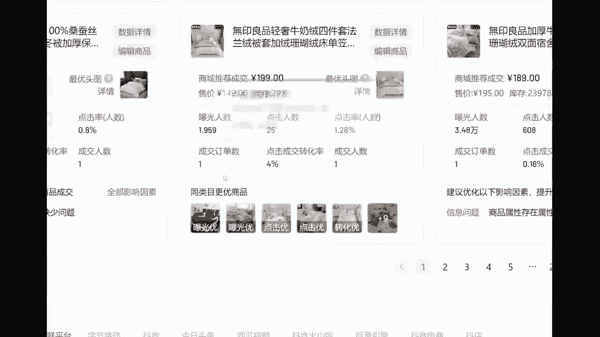
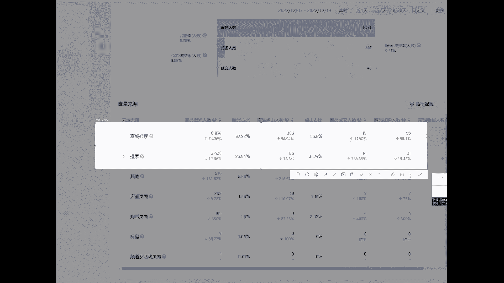
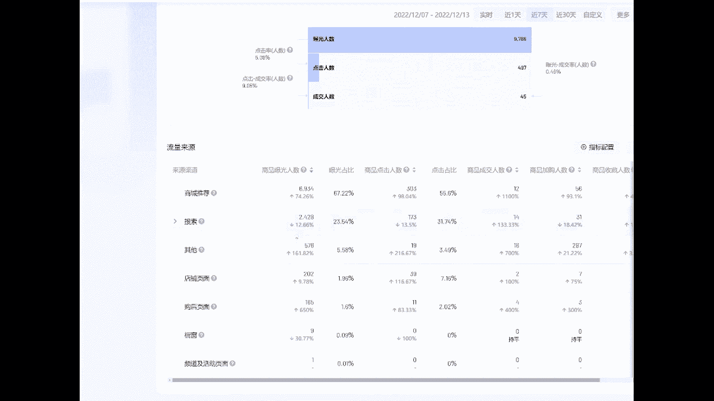

# 2024-抖音小店起店先起号全过程详细讲解，全类目开店教学！零基础也能轻松打造爆款店铺 - P11：抖音小店教程 - 倒芭垂杨柳 - BV1SgssezE1z

啊团长，你就是个，你记住我说的话，嗷，我就在沈阳大街骂你，就在这等你来不录你们师徒三人，面对我们师徒三人来，小亮给他整个活草，走出去沈阳等你哦，啊徒弟团长。

我跟你没完，你等着我，你等着是吧，先跟大家做一个简单的一段自我介绍，好吧啊，但那可能很多新手朋友，可能很多朋友呢，他是第一次进入到我的这个直播间，他不太熟悉我是谁啊，那么先跟大家做一个简单的自我介绍。

大家呢可以叫我一声啊，天哥也可以啊，我叫天应，这个字可能有点复杂啊，我也是咱们这个喜哥的合伙人啊，可能大家都是奔着这个起歌来的，对不对啊，我是企鹅的合伙人啊，然后呢可能跟企鹅合作的时间非常非常久了。

大家应该也都知道，企哥经常在直播间所说的一些东西，我们呢啊先暂停一下音乐啊，我们跟曲哥呢是从去年啊，21年12月份的时候呢，就在第一批做的这个直播带货。

那么我们先看一下这个直播带货的数据吧，啊这个也是经常拿出来给大家去看到的东西来，但是我没有像奇哥那样经常去给大家看数据啊，因为我觉得这个都是很表面的东西，对不对，我们在12月份的时候呢。

成交金额是1600万啊，花了多久，时间差不多是一个星期左右吧，从12月25号开始操作的啊，到今年刚好是差不多一年的时间，整个店铺的吉姆维伦也是达到了差不多嗯，4~5个小目标吧，来1600万。

然后1月份的时候呢3600万，2月份呢2300，3月份那2600，4月份2800万。

这个是成交金额啊，我们这个账号呢是做的一个直播带货的项目，那么像我们除了这个直播带货之外呢，啊可能很多兄弟他们最了解的，最想去了解的是，你们作为一个啊可能是新手朋友，我们应该怎么样去做好这个抖音小店。

这个相比较于抖音小店来说呢，啊他的直播是非常非常繁琐的，我们得找达人，对不对，我们得去选品，对不对啊，我们还要有场地呀，还有设备呀，还有得运营啊等等，很多很多的这个成本啊都非常的大。

那么像我们这个抖音小店兄弟们，这个呢是做的一个啊百货的类目吧，按照全传之前的分类来说，这个是一个传统的那个百货类目，昨天是成交了875单，今天的成交金额是1万1300多啊。

像这个抖音小店呢，我们说实在的啊没有去经营多久的时间，从10月份的时候来，兄弟们看到我们的这个，流量情况和订单的情况啊，就是只是简单的出了一波咱们的这个体验分，然后后期的运营怎么去把这个单量啊。

慢慢的给他拉起来啊，起起伏伏的啊，看着还挺有意思的，对不对，那么我们还有一家这样的新店，做的是一个家纺类目啊，榜上也有名，那我们的一个流量情况啊，但是也目前也是在慢慢的给他去拉升，这个流量的交易情况。

那突然我们突然出道一波体验分之后，突然给到了我们32万的流量，然后我们现在啊每天的话成交八九十单啊，利润还是可以的，兄弟们80多单能够每天1万多的曝光。

能够成交个80多90单还是挺OK的，而且像我们这个类目的话呢。

利润啊说实在的挺高的，兄弟们这个利润真的不是跟你们去吹啊，一单的利润真是真的挺高的啊，63单，今天来简单的看一下咱们的这些店铺的数据。

好吧好。

来啊。

那么咱们今天的课程就正式的开始，好吧哈，上车陪跑，然后啊跟大家强调一下课堂纪律啊，就是不要聊与咱们这个课堂无关的内容，可以吧，好吧，来兄弟们准备好的，给我扣个一，啊准备好的兄弟来给我扣个一啊。

好给你们讲课之前呢先啊搞一根干货啊，嗯好，那么我想再跟大家去讲这个方式方法之前啊，还是想对你们有更多的一点了解，先了解一下你们目前的状况吧，好吧嗯，了解大家的状况好吧，然后来兄弟们开过店的，扣一啊。

没有开过的，扣二，然后这个开过店的，你们是做什么类目的，啊发在咱们的评论区啊，来怎么引自然流量呢，啊今天会给大家带来这个自然流量的玩法啊，还没有出体验分的啊，还没有出体验分的。

你就当做你是你也是开过的吧，好吧，来兄弟们啊，开了店开了店，来你们开过店的，把你们的内幕发在咱们的这个评论区，没有开过店的兄弟朋友们呢，你就简单的扣一盖好吧啊，因为如果说你们都开过店的。

那我觉得有很多最基础的东西，我没有必要去讲啊，因为很多东西大家都应该知道，跟你们去讲一下，我们的起店流程和最近的来啊百货，然后牛肉酱食品吧，好吧，这个算食品吧，来还有呢，兄弟们嗯，数码汽车，数码啊。

新店来，还有呢，兄弟们就这四个类目吗，你们是开什么类目的，兄弟们来先了解一下啊，服装啊，服饰内幕，服饰内幕我还是挺喜欢做的啊，运动也算是服饰了啊，今天能讲一下服装吗，啊也可以啊。

可以跟大家去讲一下这个服装类目好吧，然后像我们做的这个玩法呢啊，是针对于很多类目的好吧，我们今天跟大家去讲到的这个玩法啊，会针对很多很多的类目，就是你们这期聊到的类目啊，我们这个玩法起店的这个流程啊。

都都都适用啊，宠物，好吧，跟今天这些兄弟，你们讲到的这些类目啊，在我的这个玩法过程当中啊，包含包含很大部分的，因为像我们自己去开店的话，也是针对这个全类目去运营的，可能一次性开个十家店呢。

两家店的类目都是差不多的，然后十家店我们会包含五个类目啊，什么家访啊，然后什么啊服饰啊，还有什么一些汽车用品啊，宠物类的我们都会去做的啊，还有玩具啊，玩具这个也可以啊，兄弟们，像这里面的这个数码的利润。

服装的利润啊，应该都OK，然后这个玩具玩具的利润也是挺高的，好吧啊，看不到别人发的消息啊，因为我们这边后台需要通过一下啊来啊，能看到的啊，好吧来不要着急啊，我先把你们的这个评论通过一下好。

那么啊好这些包含的类目呢，今天跟大家讲到的这个玩法呢，很多类目都是包括的，那像除了那些啊百货的话其实是最简单的啊，像这里面的有一点难度的是哪一些呢，像这个服饰啊，玩具，还有咱们的这个食品啊。

他的一些后期的运营是比较难的，像这个服饰类目啊，你要去注意那个体验分，你要注意崔好评，而且这个玩具呢你要去避免那个品牌，要注意那个打假好吧，那么我们在这个里面抽一个类目，来带大家去选品吧。

啊抽一个类目来带大家去选择产品，像做那个搜索流量的啊，搜索流量我们选这个玩具吧好吧，然后这个商城推荐的话，大部分应该都是啊服饰服饰类目的话，大部分都是商城推荐啊，针对这两个类目来跟大家去说一下。

这个选品的方式，来你要记住啊，看一下我的这个关键点，第一个搜索流量我们怎么去选品，第二个我们的商城推荐怎么去选品，我们先来拿一个玩具的类目吧，带大家去选品，那么我们首先进入到这个电商罗盘当中来。

随便去登一个子账号也好，主账号也好，进入到咱们的这个电商罗盘，点开这个啊引流来选择这个行业搜索词，那么我们去选择到我们自己的一个类目啊，玩具，来玩具乐玩具乐器啊，然后你们是想做什么呢，啊全部吧好吧啊。

这个就不选了啊，来选择这个玩具的类目，玩具吧好吧，全部来，那么像我们点开这个按照自己的类目去选，择完之后呢，这边是不是有很多的关键词呢，我们在这个榜单当中根据这个成交指数啊。

把这个成交指数能给它刷新一下啊，成交指数对它进行一个排序啊，玩具我们点开它玩具这个类目的话呢，它这个词是很概念很广的啊，那么我们也可以看一下这个热度啊，奥特曼，因为他们的搜索流量是通过这些搜索关键词。

去成交的来，我们在这个右边看到没有，点开这个啊，搜索此诊断来点开一下，测图和测标题，测图和测标题需要通过动销的方式啊，兄弟们好，那么我们点开这个之后呢，能够看到啊，他各方面的数据还都是比较OK的吧。

关联商品数在上涨，成交指数呢也还算是比较OK的，那么我们来你们要做这个搜索流量的话，那么我们是一定要赶上这个平台的热度的啊，跟大家一步一步的去做一个记载啊，来我们应该怎么去操作。

应该选择什么样的东西，跟大家去记录一下，第一个选择这个行业搜索词，OK然后呢在这边去选择到你们自己的类目。

给你们粘贴进来好吧，来然后呢在这边选择玩玩具的类目也可以啊，我们这个家访呢它也是一个一个搜索流量啊，做家访的大部分都是一个搜索流量啊，那么我们就直接拿这个家访跟大家举个例子，好吧啊，这个不要搞得很复杂。

你们只要学会我的这种方式方法，不管是什么类目，都可以利用我的这个方式方法去做，那么我们点开这个成交指数啊，床垫四件套，被子牛奶绒四件套，是不是这些流量呢都是比较大的，看到没有啊。

这里面这两个榜单你们都可以去做啊，热度指数跟这个成交指数啊，最好是选择这个成交指数，来选择到这个搜索词详情，好那么我们选择完这个搜索词详情啊，搜索流量和推荐的玩法是一样的吗。

你们前期其实没有说太多的一些啊，不同的点点啊，兄弟们，你们那个推荐和搜索，你们在前期是没有太多的一个啊差异化的，那么我们像这个床垫这个词，我们点开这个搜索词详情之后。

下边是不是出现了很多这种同类型的产品呢，对不对。

我们点开这个产品啊，然后呢跟大家手机投一个屏吧，好吧啊，带你们一步一步的去操作一下，我们应该怎么去选择产品啊，应该怎么样去上架产品，那像我们刚刚做的是那个搜索流量的，一个家纺类目，来我投一个屏啊。

带大家去实地的啊操作一遍，而不是跟大家去讲一些有的没的，这种理论知识啊，理论1万遍不如实战一遍好吧，那么我们刚刚找到找到这个产品啊。

我把手机打开投屏，嗯看到了吗。

然后呢选择到咱们的这个抖音，进入到咱们抖音当中啊，有一个购物是不是点开这个购物，选择这个拍同款，那这个有个相机选择拍同款，把这个主图呢啊给他找下来，那去看到咱们这个同行啊，是不是哪个应该是这个啊。

是这个吗啊这个是做了一个无人直播是吧，那我们点开这个嗯来重新找一下啊，嗯那个投屏呢来去看到一个商品那一样的主图，对不对，那么我们把这个主图进行一个截图，然后呢再次进入到咱们的多多啊。

你们也可以直接打开这个多多啊，以图搜款，刚刚是重复操作了一下啊，但是也不影响啊，看到没有，那么这个产品在咱们这个平台当中，他能够上到这个搜索词的榜单，我们是不是可以把它上架到咱们店铺里面呢。

啊这个是没有任何问题的，兄弟们要记住啊，你们把这个产品呢上架到咱们的店铺里面，是没有任何问题的，知道吧，在这个搜索词当中有一个详情诊断，看到没有往下滑，把这个榜单你上架个十条，20条都OK的。

那么像我的这个产品啊，我是上架了这个同类型的产品，而且可以看一下啊，那么像这个产品我是上架到咱们店铺里面的，来看一下它的这个流量情况，是不是啊。

星期天刚上架的产品啊，今天他的流量还是可以的嘛。

对不对，3000多实时的呢啊实时啊，十时不好意思，他没有上榜，那是不是利用这个方式方法呢，你们能够去找出有搜索流量的关键词，知道吧，有那些关联商品关联啊，商品像你们这个店铺的话呢，我们会去怎么做啊。

一个关键词，一个热词关联十个宝贝，关联十个宝贝啊，你不可能说你一家店铺，你就靠这一个热词去撑起来，对不对，那么我们会选择啊10~20个热词，知道吧，最多关联十个，然后我们新店的话呢会上架啊。

100个左右吧，100个左右，你们可以自己去分配啊，10~20个热词，那么就是十道或者每个产品五个宝贝嘛是吧，这样的话能理解吗，知道怎么通过这个关键词去选择产品吗，啊他也没有说想象中的那么复杂，对不对。

直接进入到咱们的这个搜索流量，然后点开行业搜索词，选择你们自己相对应的类目，然后下滑那点开这个成交指数，然后在这个右边有一个搜索词诊断，看到没有，啊一步一步的去教你们操作一下。

来啊选择这个搜索词诊断之后呢，啊床垫我们刚刚看了床垫，对不对，再次选择到这个啊四件套啊，像这一些四件套呢，你们直接上架，但是你们要记住啊，不要去上一些什么有品牌的啊，什么水星啊，然后什么罗兰呐，凡娜呀。

像那种有品牌的产品，你们千万千万不要去上架照吧，那像这个啊，都能够在咱们多多里面去找到同款的商品，都可以去上架，像这一些产品呢，它都是自带一些搜索流量的，看到了没有，那交易指数100分94分。

他的流量是非常非常高的，是不是啊，那这个他的交易指数都是OK的，学会了吗，兄弟们来这个搜索词选品的方式方法，学会的兄弟来给我扣个一，接下来跟你们去讲第二种啊，通过那个商城推荐榜单当中去选品来搜索。

有问题吗，通过关键词选品没有问题的选品来给我扣个一，嗯还有呢兄弟们抓紧时间啊，快一点啊，配合度高一点好吧，不要耽误太久的时间，因为我你们不扣一，我不知道你们哪个点不缺会啊，我不知道你们哪个点知不知道。

清不清楚，如果说你们有问题的，把你们的问题发在咱们的评论区，集中的帮大家回答一下，好吧，OK啊，大家看来都啊理解能力都很高啊，好过，来跟大家讲第二种选品方式，那个榜单选品啊。

这个榜单的话也可以称之为啊截流选品吗，兄弟们截流选品，那么我们来看一下，那么我们截流的话啊，商城跟搜索它完全是两个概念，对不对，那么我们点开这个商城概览啊，在这个概览当中呢。

我们能够看到这边是不是有一个榜单，来点开这个点开这个榜单，首先呢直接进入到这个商城推荐啊，你们是做什么类目的呢，来这次的话带大家去做一个服饰吧，啊做一个服装女装，来女装的话呢。

男装女装他都是有很强的季节性的产品啊。

虽说他是一个商城推荐，但是它也是很强的一个季节性的产品，那么我们进入到这个榜单当中呢，啊要选择什么样的成交题材呢。

啊看到没有，他这家店他虽然排第一名，但是他是直播间成交的这个产品。

我们能去选吗，你不能知道吧，你要去选择那种同行选择同行的店铺，然后像这个啊商品卡，但是他的商品数太多了，知道吧，你们不要去选，选择那种商品数在100个左右的啊，100多200多左右的。

来找一个以商品卡为成交题材的啊，啊最近呐掌上优衣库啊，这个可能是一个品牌来，啊这个挺难找的啊，来看到这个啊，我们直接进入到这个商城成交榜单吧，选择那种以商品卡加上这个商城推荐的店铺，来从头往后面找一下。

昌平卡夹搜索，拿这个啊，像这个产品，这个什么，我是摩羯的衣帽间，你们可以来打开看一下好吧，我们直接用那个抖音来搜索一下吧，来啊，但是这个的话找同行做无货源的概率很小啊。

像刚刚那家店去找那个无会员的概率会很小，啊换一个吧，换一个女装，最近做直播的确实很多，不太好找啊，看一下男装，男装的话，这边就很多了呐，这个这个什么军胜朝品啊，想都不用想，这肯定是做咱们同行的。

做无货源的，来我们去打开抖音去搜索一下啊。

能看清吧，兄弟们来去搜索他的这家店铺，军胜潮品，那么像这种的店铺，他既然能够上到咱们的这个榜单里面啊，说明他这家店还是多多少少有一点东西的，看到没有，教你们怎么去分辨一下做同行做无会员的啊。

他这个里面的单价呐有小数点后两位的，你要知道做这个后两位的，他是大部分都是做无会员的，兄弟们，你们像像那种旗舰店，他都是整数啊，139，138。8，知道吧，你们直接进入到这个店铺，他绝对是做无货源的。

那么我们来看一下点开它的这个销量啊，最终的最热的他这个什么四块多钱的，是利用那个最低价的SQU，知道吧啊怎么四块多钱哈，这个产品就不需要去找啊，然后这个来看一下领券去购买37块钱。

我们把这个产品呢给他截一个图。

然后呢再次进入到咱们的这个多多当中，选择以图搜款，好看一下啊，这个产品的利润OK如何啊，来这个一瓶10万件的，看一下他的评价，100多个人有点假了啊，那这个九个啊，来这个30啊，这个评价也不多。

但是它的利润不高啊，他的利润的话呢不是太高，50多块钱啊，你们要找到一个进货价还OK的，那这个这个产品已售3万多件，平价500多哈，还算OK，那么我们来看一下24块五毛九。

那么我们这个同行呢他是卖多少的啊，37块钱对不对，那么像这个产品也有一个13块钱的利润吧，13块钱，再减掉这一个平台的5%的扣点啊，还算是OK的，十多块钱的产品嘛，那么他卖了多少件啊，已售700多件啊。

他的利润还是比较可观的，一个产品能够给他带来算一笔账吧好吧，看一下这个产品它的利润在多少。

来用这个进货价，售价37块钱吧，好像是37，减掉他的一个进货价，24点嗯，啊一十三一十三块钱的利润，那么我们再看一下他平台的扣点。

37×0。05啊，一块八一十三减掉1。85啊，一单差不多11块钱的利润。

再乘以他卖的不是750单吗，呐看到没有，也能够产生8000多的利润，一个产品能够产生8000多的利润，还是非常OK的，那么你们进入到哎重新投一个屏啊，那个时间到了，你们进入到他这家店铺里面呢。

你也不要说全部去给他搬下来，知道吧，那些有流量的，有销量的，销量在100往上加的，你就全部给他搬，搬运过去就完了，兄弟们知道吧，来看到没有这家店这个产品能搬这个裤子，能搬这个卫衣。

能搬这个什么外套也可以做啊，这个这个产品的话，如果你要看利润啊，兄弟们，你们是要结合这个利润来做的，知道吧，那看一下哪个产品啊，哪个产品你那十几块钱啊，然后像这个单一啊，他只不过是一个低价引流的方式啊。

兄弟们知道吧，他这家店铺的产品有销量的，那200多个，100多的都可以去抄，直接搬到咱们店铺当中，像这个产品啊，已售70多件，80多件的啊，流量不高，那就没有必要去搬了，知道吧，这是很快的方法啊。

直接去找到那种同行的店铺，怎么去区分呢，就只看小数点后两位，知道吧，在榜单当中去找出那种商品卡，加商城，推荐的，店铺啊直接去看一下，怎么去区分，其实很简单，你看他那个产品的客单价有没有，啊小数点嘛。

后两位啊，有的那就一定是咱们的这个同行，如果说没有的话，来给你们去找一个不是做无货源的，好吧啊，他那个定价可能定价区分的比较严格，一点的话呢，我随便去搜一个卫衣吧，来，看到没有。

你们大部分的能够发现像这一些产品，它不会说去卖一些有零有整的，它就是一个整价45啊，简单便捷，那么像这个呢，我们能够把它区分为一个无货源吗，其实也能啊。

像这一家店呢，你们也能够把它区分为一个无货源的店铺，知道吧。

我们来打开咱们的这个，多多搜一下有没有同款呐，是不是一模一样的同款吧，看到了没有，35块钱我们这个同行能卖多少啊，卖41块八啊，六块多钱的利润还是挺OK的，是不是怎么去区分，现在知道了吗。

就看后数小数点的后两位啊，他这个35。9的，他也不是看到没有啊，在这里面你们可以看到，好像这个那也一定是做无货源的，兄弟们也是无货源无货源的啊，一眼就能区分出来，现在知道怎么去区分同行了吗。

来兄弟们这个榜单截流，学会了没有，学会的，扣个一来，这是前期的选品方式啊，前期的选品方式给你们把一些重点记录下来吧，啊小数点后两位销量在100往上的，往上走的，知道吧，去把这些产品给他搬下来。

没有销量的，你搬它干嘛呢，没销量就代表没有流量吗，还有你们要看利润啊，你们这个产品找到一个产品，及时对比利润，哎我们要做就做利润高的，有流量的，知道吧，你们那那些一块一单赚个什么两三块钱的，你干嘛呀啊。

又不是乞丐，我们是坐垫的，知道吧，你不要去找那些低价的产品，而且兄弟们跟你们去讲一个类目的选择啊，你们不要去做这种什么百货啊，这个什么食品啊，嗯都是很简单的内幕啊，已经玩坏了的类目。

要做就做有门槛的类目的选择，兄弟们，做有门槛的啊，那些没有开店的兄弟们听听好了啊，要做就做中有门槛的，最简单的一个门槛的标准保证金，你的保证金决定了你的这个门槛，保证金从2000到5万不止，知道吧。

你们选那种保证金高的类目，你们是不是能够筛选出很大一批的同行呢，是不是这个是很简单的啊，还有什么有门槛呢啊需要认证的什么玩具啊，这种东西需要认证的，你们如果有精力的，你可以搞一个品牌试一下啊。

玩一玩品牌，呐像我做的这个家纺店，我就是做的品牌啊，兄弟们做的无印良品啊，是不是你们要干这个，你们的利润才会高啊，所以说这个品牌的话，他有一个品牌的扣点，品牌也是会扣点的啊，啊一个品牌扣点。

我们这个是5%，你们看自己去谈知道吧，类目的选择要做就做有门槛的好吧，需要认证的，然后维护比较难的，维护很麻烦的，知道吧，可能很多兄弟他会觉得哎呦卧槽，我作为一个服装，我后续的评论呢，我后期的评价呀。

我的体验分呐很麻烦，他就直接迎难而退了啊，他没有说这么多的人都挤到这个里面去干，那么这是我们前期的选品方式，这两个点应该我想很多兄弟应该没有问题了啊，那么我们后期应该怎么去过渡呢，啊品牌怎么去认证。

这个点在直播间讲不了啊，这个点在直播间的话就不讨论这个好吧，跟大家讲的这个无货源，我只是说一下啊，跟你们带过一下，你们可以去玩一玩品牌怎么去认证，你们自己去想办法，那么我们来后期应该怎么过渡。

我的店铺有了流量的进来，有一些没有流量的产品，是不是我的店铺里面100个宝贝，我不可能说100个宝贝全有流量吧，对不对，全有流量，这是不可能的，兄弟们啊，除非你是某一个直播间，某品牌。

你才能够100个宝贝，100个宝贝都有流量，那么我们后期应该怎么过渡呢，下架没有流量的产品啊，再去上架有流量的，那么这个有流量的产品在哪里找呢，第一个我们的商城推荐啊，商城，啊也是针对这两个流量渠道。

第二个呢我们的搜索流量好，这个是你们可以一起上架到店铺里面的啊，可以一起上架两个流量渠道的宝贝啊，可以一起上架，也并不是说我干搜索的，我就不能做商城推荐，没有这么一说，知道吧。

那么我们这两个点怎么去上架呢，首先我们点开这个商城推荐分析啊，往下滑滑到我们自己的产品来看一下，在这边是不是有给我们很多很多的诊断呢，来点开近30天的来看到没有，在我的这个单品当中。

它下面有一个同类目更优的商品，看到了吗，啊在这个里面去上架啊，给你们截个图啊，来，卡了啊来，看到没有，为了避免一下啊，来给你们框出来，第一个选择这个商城推荐分析，把这个同类目更优的商品啊。

有九个你就上架九个，有十个你就上架十个，通过这个方式呢去上架上新品，然后第二种搜索的话呢，我们看关键词，关键词流量在你的店铺当中有一个搜索啊，引流搜索词进入到，然后点开点开这个每一个关键词。

它这个右边是不是有一个搜索词诊断呢，羽绒被来点开啊，点开下滑之后看到没有同类目曝光更优的商品。

因为它的产品的话可能是因为主图的原因，可能是因为这个啊权重的问题，它的一些产品它是实时的更新的呢。

把这些产品你就及时给他上架上去，你那些所有店铺里面所有有流量的关键词，你都可以去上架，知道吧，羽绒被有流量，OK在我的店铺当中有流量，对不对，那么我们再点开这个搜索词诊断啊，再下滑。

那么这些产品你给他去上架，知道吧，搜索当中啊，点开这个引流搜索词。

然后呢有一个详情诊断啊，已经很详细了吧，兄弟们是不是来学会了没。

有，后期怎么去过渡，你们店铺里面那一些有流量的产品，你们应该怎么去放大，你们都可以通过这种方式知道吧，然后选完产品之后呢，我们还是需要进行一些基础设置的，我们的关键词的位置呢，我们是需要进行一个调整的。

我们怎么去调整呢，因为这个标题的话，可能我在直播间跟大家去讲过，非常非常多次了啊，还有不知道怎么制作标题的吗，兄弟们标题怎么制作来，不知道的扣一啊，不知道制作标题的，给我扣个一，兄弟们让我看一下啊。

如果搜索词那里没有同类目曝光更优的呢，你就点开你的那个啊，兄弟你就点开这个呀，行不是有一个行业搜索词吗，啊你是不是有行业搜索词呢，你在这个行业搜索词当中去看呀，你店铺里面你的关键词喏。

羽绒被来搜索一下啊，我店铺里面排第一的是不是羽绒被吗，来搜索羽绒被，他这边是不是有个搜索词诊断呢，点开，看到没有，这里面是不是有产品啊，有没有产品啊，这么简单的东西啊，喏我的这个还已经上榜了，兄弟们哈。

学会了没有啊，一来来来集中兄弟们快速一点快速一点啊，不要拖拖拉拉，不要磨磨唧唧来，不知道制作标题的扣一知道的啊，就不要说话了，好吧啊，知道的兄弟就简单的听一下，好吧啊。

因为很多新手朋友他可能是第一次进到直播间，他不知道应该怎么去制作啊，跟大家聊一下，哎不能够是说制作标题吧，我们应该怎么去优化标题来OK啊，很多兄弟都不知道啊，跟你们讲两个点啊，第一个简单一点的。

很快速的也能够去优化你们的标题，简单一点的，你们要记住啊，你们这个优化标题是在上架产品的时候去优化，你们不要说你做了个动销流量进来了，你去优化啊，千万千万不要在上架，宝贝的同时你们要去制作的，知道吧。

来先跟大家就简单的说一个这个怎么去优化吧，我们首先进入到咱们这个抖店的后台，来抖店的后台首页，看到没有有一个搜索，点开这个搜索商品诊断啊，在这边像我的这家店铺添加热词啊，在这边直接去优化就完了。

看到没有，来给你们框出来搜索啊，在这边直接去添加，这是最简单的，知道吧，那些很难的，很复杂的，那就没有必要讲了，好吧，还有第二种，但是这种的话很麻烦很麻烦啊，要听吗，麻烦一点，但是它的效果是比较好的啊。

跟大家简单的讲一下吧，在这个行业搜索词当中，同样的你要根据这个行业搜索词当中去看呐，点开这个词，你能把他的这个词语给他下载下来啊，根据你的这个产品去选择有热度的，有成交指数的关键词啊，选择，有热度的。

添加在，标题的，开头和结尾的地方，啊有一个嘶，有一句那个啧顺口溜啊，首尾权重高，小词，放中间啊，就这么个标题，除法，知道吧，你们这个表格其实很简单，就把它都去下载下来之后呢。

根据这个热度指数对它进行一个排序就完了啊，很简单，看到没有，在这个里面是榜单当中，这个平台当中所有有流量的关键词，都在这个里面能够出现的啊，你不去上架这些关键词，你哪来的流量呢，而且你们一家新店。

你不去优化这个标题，你是获得不到什么搜索流量的，兄弟们，我们的关键词，我们刚刚做的那个家访的类目，每一个关键词我们都去做了基础优化啊，是用利用这种方式方法去做的，我们店铺在前期搜索流量非常非常巨大。

你一家新店3000多的流量，一天3000多的曝光，你见过没有啊，没有见过，知道吧，还有我们的价格，价格应该怎么去制定呢，啊你们可以按照这个方式方法啊，我们现在你可以批量的两倍上架，两倍加五去上架。

然后后期你再去开设一些什么活动啊，然后什么限时限量购啊啊，优惠券等等去通过这个调低咱们最终的卖价，因为我们为什么要去两倍上架呢，第一个，如果说我们后期想要高利润，你突然啊今天给到你100个成交订单啊。

你觉得这个利润很少，我的原价去原价，如果说是50的话，我上60块钱啊，你们同行卖80，卖90，你看了你不眼红吗，对不对，我们只能通过前期把这个原价调高，后期通过这个活动和优惠券去调整，咱们的利润空间。

知道吧，啊好那么我们来啊，今天的重点是这个起点步骤啊，像这个前期啊选品啊，像这个基础设置我都是准备不讲的，因为很多兄弟他开过店的啊，跟大家去重复一些这个东西呢，没有太多的一个必要是吧。

那么今天讲都讲了啊，你们就知道吧，多学习一下来这个点还有问题吗，有有什么问题的啊，你们一定要及时的发在咱们的这个评论区，帮你们回答一下，来怎么去激活流量，在前期选品有问题，没有没有问题的扣一啊。

基础设置没有问题的，给我同时给我扣一好吧，OK啊很多旋律都没有问题了是吧好，那么我们应该怎么去做一个起电的步骤呢，可能这个流程是很多人的一个啧一个近点啊，就是说我连坐垫，我在坐垫，我坐了半个月一个月了。

我连流程都不清楚，很多兄弟呢他会出现这种情况的啊是吧，很多兄弟，因为我们可能跟很多一些新手的朋友啊，他们去聊聊到这一些最简单的起店的步骤，我们前期应该干嘛，中期应该注意什么。

后期应该怎么去控制咱们店铺的流量啊，像这一些流流程呢，他们都不清楚，那么我们先来跟大家去讲一下，这个起店的步骤和流程啊，讲的非常非常的详细啊，细致到我们的出体验分，我们前期你需要去做一个激活的流量。

那么像我们一家新店来问大家一个问题，我们一家新店，一个是商城推荐流量，一个是搜索流量，他会出现在哪一个啊，兄弟们，一家新店呢，它是会出现这个商城推荐，还是会出现这个搜索流量，觉得商城推荐的。

把商城打字两个字打在咱们的评论区，你们觉得一家新店前期只有搜索流量的，把你们的搜索两个字打在咱们的评论区，知道吗，我们一家新店在前期你没有体验分的情况下，没出体验分的情况下啊，会有哪种流量嗯。

这个兄弟说搜索还有呢一个还有呢，没有人说商城推荐吗，他不会有商城推荐流量吗，嗯定价高能截到吗，啊虽然我们用优惠券拿下来，能的啊，兄弟们啊，能的啊，啊刚刚我说了价格那方面有什么问题的啊，你就不讲话。

你就不吱声，我现在跟你们去说这个起店的步骤，你现在来问我定价能不能怎么怎么样，就这个兄弟吗，搜索流量没有了吗，啊搜索是的，我们一家新店，你在没有去出体验分的情况下，你只会获得这个搜索流量，兄弟们知道吧。

只会获得这个关键词的搜索流量啊，从标题进入的流量啊，我们的这个商城推荐，你要怎么才能够满足这个要条件呢，要达到一个入职的标准，第一点我们的体验分啊，体验分呢我们要大于4。3分。

第二个点呢我们的这个信息质量里，信息质量里我们要去达到100分啊，这个也是很简单的，那么还有第三个点，我们的这个层级，我们新上架的宝贝，一般都处于哪个层级，新上架的宝贝呢，他都是处于这个G1的层级。

虽然平台说啊非G10的产品，非G10的产品怎么怎么样，那么你看一下，如果说我出了体验分，我的产品你还是处于G1的层级化，你有流量吗，其实你没有什么流量的啊，可能一天100多200多的曝光。

那么我们应该怎么去做呢，来第一个点，我们这个体验分要大于4。3分，怎么去出体验分，30个订单啊，就能够去出分，但是呢我们店铺的前期你想要体验分越高的话，那么你的单量订单越多啊，在前期啊。

你家新店还没有出体验分的前提下，订单越多，你的体验分越高，要记住啊，订单越多，你的体验分越高，那么我们的宝贝他是不是要上到G2这个层级，上到gr这个，层级我们才能够拿到啊，才能，拿到商城的推荐流量呢。

那要记住这个点啊，那么我们信息质量里啊，这个点你们大家先不用管，你们想要去做到这个入职的标准就两个点，第一个体验分，第二个点，你们这个宝贝的层级要去上到gr，你们才能够去获得所谓的一个商城推荐的流量。

好吧，那么我们来讲一下流程，第一个点我们怎么做呢，我们上架完产品之后，应该怎么去集中的啊，体验分怎么出这个宝贝层级，怎么了，怎么提上去来，很简单的一个点，我们首先要知道我们这个宝贝层级。

它是根据什么东西去判断的啊，它有没有一些考核的指标，它有分别是什么信息质量力，品质力，销售力啊，履约利这四项，那么我们来看一下，在我店铺当中的这些产品当中啊，看一下G0的没有吧，啊，看一下G1的。

看到没有，G1的宝贝大部分都是什么，看到没有，大部分都是这个销售率不及格吧，那么如果说我们需要让它上到这个G2，上到gr呢，你才能够去简单的把它判断为，你能够去拿到这个商城的推荐流量。

那么我们这个G1的产品怎么做呢，啊简单一点跟大家点开这个键优化。

看到没有。

平台给我们的建议是什么，你这个产品你需要先产生销量，你即可达到及格啊，对不对，那么我们利用什么方式去产生这个销量呢。

很简单啊，有的兄弟说S单，有的兄弟说动销，那么到底怎么去做，你们通过那个S单的方式啊，S单刷单嘛，通过搜关键词也好啊，你的店铺你这家新产品你没权重啊，知道吧，你有的兄弟说你是卡什么搜索词。

卡搜索卡首屏啊，你不被清销量吗，你这个产品你没有权重的，你去做这个搜索首屏的，你同样的会被轻销量，要记住啊，清洗销量，清洗，销量，那么我们还有第二种方式有吗，动销啊，动销的方式，我们一家新店。

你在没有出体验分的情况下，他有两次上到精选联盟的机会，知道吧，哪怕是你们出了一个体验分突然掉了，掉到了零分，那么你还能够去做第二次动销，去上到这个精选联盟，让咱们在直播间产生销量，直播间产生销量。

知道吧，最稳妥的方式是什么，你找一个同类目的，知道吧，最稳妥的不掉销量的玩法，啊前提是你要对这个你的货源啊有保证，对你的这个产品质量可控度非常高，啊这个是针对那些有自己的货源的兄弟，你们可以这样去操作。

知道吧，你们通过直播间啊，直接AA单动销AA单，把每一个产品呢去做一个一到两个，或者说是两到三个销量直接去卖，直接通过直播间的方式去卖啊，可能一单你亏个五六块钱，十块钱，这个没有任何的问题的。

前提是你找的直播间是同类目的啊，同类目的，达人直播间，好那么还有第二种，你们也可以啊，同人同类目达人直播间的，如果说我这个原价产品啊，我是卖150的，那么我在直播间我卖145。

通过这个一单亏个几块钱去最快速的产量销量，他是不会被清销量的啊，他也虽说也有可能啊，不是说百分之百不被清啊，哪怕是真实出的单，他的销量都有可能会被清洗啊，这也不知道是什么原因好吧，那么还有第二种。

你可以通过那个啊AA单低价AA单，这改主图改主图的方式去做那个动销，这个的话动销成本一单是15块钱左右吧，15元左右的成本，那么我们来给大家去计算一下，像你们去做一个出分啊，同样的出分。

激活流量他是一步，兄弟们，你只需要一次给他做完就好了啊，你不要分什么两次做一次出分，你再去做一次激活流量，没有必要知道吧，你们宝贝层级，你们在拉动宝贝的层级，你们是不是产生了销量呢，产生了销量。

我们的体验分是不是能够出的出来了啊，要要这样去理解啊，那么我们怎么做呢，出分和激活流量一次性做完，那么我们店铺当中啊，100个宝贝，你每个宝贝呢你去做个一单一单的销量，我们出了100单，对不对。

100单，然后每一单我们算最高一点，资源好一点的，15块钱一单啊，他是保证你不被清销量啊，也不是说保证你不被清销量吧，他的这个清洗率非常低，能够留存在你的店铺里面的时间很长很长，这是资源的问题。

而且呢你们后期清洗的话，清洗包赔啊，这是资源的问题，越贵的资源肯定越好嘛，那么我们来算一下，15块钱一单，我做100单的话就是1500块钱，对不对，那么我们还有一个拍单的资金，拍单的金额来他们在直播间。

在直播间他的那些买家以5。9元，的价格把我们的这个产品拍下了一单，我们拍了100单有多少钱，有595块钱，是不是用这个1500减掉这个590，差不多是个900多块钱吧，啊是不是920块钱。

910块钱的成本啊，这个590在你的店铺里面可以提现的，知道吧，可以提现啊，所以说还有一个什么0。05%啊，0。05的扣点啊，这个很多吗，扣几十块钱无伤大呀，对不对，你们总共就花个900多1000块钱。

你们就能够去把你们店铺的体验分给他出出来，能够去把你的宝贝的层级从G1拉到G2，就这么简单，通过一轮动销的方式，去把我们店铺的流量给它激活，来给大家看一下，在我的店铺里面，我就简单的做了一波流量激活啊。

来订单，这边50单啊，60多单，看到没有几天的时间，因为你们动向像之前不一样，他们可能就是几分钟，一个多小时就把你的那个100多，200多甚至300多单的销量给你做完了，那样不惊喜嘛，肯定会被惊喜啊。

是不是，那么我们分开去做，现在做动效，而不是说一天给你集中去做完，它可能呢会分分为很多个直播间，知道吧，你们现在去做动销，他会他会分配个很多直播间给你们，而且不是一天做完，不是一天动完的啊，分几个。

直播间啊分两道，三天的时间啊，去给你做完，他才能够保证你的这个销量不会说是清洗的，像外面那么那么的严重啊，斗客也会被清洗吗，肯定会被清洗，没有不经销量的玩法，兄弟们，你们要记住，不管是动销也好。

唉还是S单也好，没有不清销量的玩法，记住了吗，它销量只不过是一个时效性的问题，我们前期那么我们在做完这波动销之后，我的体验分出出来了啊，有了真实订单，那么这个时候我的销量在掉了，有问题吗。

没有任何的问题好吧，来第一个点学会了没有，通过异步伦的动销方式，去激活咱们店铺的体验分，去激活咱们这个产品的流量，好吧，我们在这边给你们总结一下啊，全店动销一轮啊，你们如果说你想你的体验分越高。

那么你可以做200单啊，甚至300单，如果说你们的资金不够100单也是可以的啊，好那么我们在嗯等一会啊，那么我们在做完这一轮动销之后呢，我们是不是所有的产品哎，不能说所有的吧。

大部分的产品上到了什么层级，是不是上到了jr，上到了jr这个层级，那么我们来看一下我们的这家新店，跟大家详细的去拆解一下，我们每一天的单商品卡的流量来流量分析，我们看一下自然日榜是从什么时候开始做的。

忘了啊，23号那没有任何的数据。

对不对，来我们点开没有任何的数据吧，来再往后24号搜索啊，新店上架了产品，出了搜索流量36个，24号的数据来25号啊，搜索一天，26号搜索27号商城推荐，因为在27号的时候，我们出了体验分。

是不是27号来，我们看到首页，看到首页这个体验分类情况，是不是27号出的分，啊这看不到了啊，11月27号的数据我看不到了啊，嗯看不到了，应该是在那个11月27号就出的天分来。

那么我们来再看一下每一天的流量情况，100多的商城推荐激活了没有，因为我通过前两天的动销，去把我们这个单商品卡，每一个产品的层级给他拉上去了呀，来27号吗，直接看到27号看到没有。

之前通过东沙的方式去出了体验分，出完体验分之后就开始有流量了嘛，呐400多，500多，500多，900多，2000多，19万，通过这个方式，你们就能够去筛选宝贝啊，好那么我们大部分的宝贝上到了jr之后。

我们应该怎么操作啊，应该怎么去操作，我们店铺当中100个宝贝，对不对，你觉得这100个宝贝他都会出单吗，都是爆款吗，啊不是的，可能在这个宝贝当中啊，多多1。10个有流量啊，剩下的90个呢没有流量。

我们怎么去看，在单商品卡流量里面，我们是不是近30天当中啊，总共的流量有哪些存在的呀。

我店铺里面是不是由这几个产品来承载，我的流量的，300万起始，3万26万18万6万2万多啊，就是排名前五的这几个产品啊。

我店铺里面总共几个产品啊，200多条，200多个产品，因为是后驱去补单呐，去做一些上新啊，所以才会上到200多个产品，看到没有，你们店铺的流量，它是由单品承载的，由，单品承载流量，而不是说全店的宝贝。

那么我们在这个时候呢，就需要针对这一些有流量的产品去运营了，能理解吗，针对这一些有流量的单品去运营，那么我们在做店的过程当中，平台会考核哪一些数据啊，平台考核什么数据啊，有两个点，第一个呢广度。

广度第二个点呢，我们的深度广度是什么，我们全电，全电点击全电转化啊，我们全电，成交金额，那么我们的深度呢，啊，你们想在前期，你们一家新店能够去把前期的广度给他做起来，那么如果说你们是一家老店的话。

你的全电点击全店转化，那肯定达不到啊，兄弟们知道吧，你们点击这么高，你们的浏览这么高，你要去做它的转化率能吗，肯定不能的呀，对不对，那么我们的转化率呢，来看一下近30天我们的一个转化率，哎看到没有。

你不可能去把他全电的转化率给他做起来，所以说我跟大家说的这个广度，他只针对于咱们的新电，没有流量的新店，那么我们应该怎么去做呢，还有第二个深度，深度从单品啊，单品还有咱们的这个关键词去做关键单品的。

什么单品的点击转化，还有咱们的这个成交金额，还有咱们的这个收藏加购人数，啊这一些都是咱们平台当中考核到的单品数据，那么我们的关键词呢啊他也考核点击，点击，哎呦点击还有咱们的这个转化率啊。

关键词大考的这个就没有这么多了，那么我们来一个一个的，先从广度带大家去了解一下，你们要清楚的知道我们坐店有一个流程，先是做好这个广度，你的广度起来了啊，你的单品你全部做了一波东销。

是不是做了咱们店铺的广度呢，激活了咱们所有的产品的数据，对不对，那么所有的产品有了数据，那么我们能够从这100个宝贝当中去筛选出，有流量的产品，就好像你们去送学生上学嘛，一个学校50多个学生。

你不可能说所有的学生都是100分，对不对，OK广度做好了，你才能够去做深度，才有深度可言，那么我们全店的点击啊，这个东西的话你们不需要考虑，不需要考虑点击率的问题啊，这个点有点玄幻了。

那么我们全电的转化能做吗，能做，那么我们来有新店吗，我们拿这个电吧啊这个电你说新吧，他也不行，说的拉老吧啊他也不太老好，那么像我的这个店铺呢，看到没有41万的曝光，1。2万的点击。

同行业优秀值成交订单1000多单，你要我去做个几百单，上千单，这个可能吗，啊也可以，并不是说舍不得花这个钱，但是你们做了这个近30天的转化率啊，没有太大的作用，你们只能针对那个刚出体验服的芯片。

去做全店的点击，我来给你们去举个例子吧，啊拿这个跟你们去嘶演示一下吧，好吧也不知道这个东西标不标准，你们新店可以用这个方式去做啊，用这个点击人数1万2100个人，乘以他的这个同行业优秀的转化率，乘以5。

95100分比，来看一下多少单，719单，其实我的点击率啊是远远高于哎呦，算错了啊，算错了啊，刚刚算到了那个点击率1万2000，100个人来乘以转化率，乘以这个6。300分比多少单呢。

763单，你能够看到我的转化率呢，其实是远远高于这个同行的，远远高于它的这个百分比的啊，因为他的流量层级。

我的成交金额啊，或者说是我的一个流量情况不达标，不转化，因为它的这个每一个数据呢都是不同的，流量层级也好，你的点击率也好，你的转化率也好，都是给你匹配的不同层级的商家，所以说我们计算出来的这个转化率呢。

它会有多多少少有一点偏差的，因为我们有数据，你们一家新店没有数据的情况下，我们看一下啊，来自然周吧，自然周我们去看到这个一号啊，来从12月8号到4号的情况，那是不是我们的点击转化率，是远远低于同行的啊。

来计算一下7015乘以它的一个转化率，5。6，100分比，393单，所以说我们说这个点击转化率呢，你们只能针对这个新店去做，看到没有，我们用这个点击率，点击人数乘以它的转化率。

我确实是比咱们的同行低了呀，呐看到了没有，所以说我们要把这个订单要给它做上去，减掉我们254个订单，那么我们要做多少单，最低标准130个订单啊，130个订单我们做高一点，超过咱们的同行。

我们的点击转化率我们做到150单，我们的转化率是不是上去了呢，同样的来我们去看到我们近七天的转化率。

我们是不是高于同行啊，同行优秀值5。87%，我的曝光6。79%，近一天的呢我也高于咱们的同行。

他才会在不断的给我们去推荐这个流量，看到没有啊，所以说今天今天的话商城推荐啊，我们这家店商城推荐没有昨天的多，看到没有，今天大部分都是搜索，我们搜索的转化率啊，远远高于咱们的这个同行，看到没有。

商城推荐70个点击50单，这个50单是通过我人为的方式，去给他补进来的，我们要这个商城推荐流量给他放大，但是呢我们来看一下昨天的来，我们商城推荐转化率1%，我的搜索呢4。7%，这个是真实的数据啊。

看到没有，所以说你们要做的新店啊，针对这个前电的转化，用这个点击率乘以优秀，转化率再去减掉，当前的订单这个就是你们需要去补的啊，你们要看你的流量渠道，看流量渠道，如果说在我的店铺当中。

单商品卡流量里面来点开，这个产品的曝光是不是最高，在近七天当中，这个产品的曝光最大，对不对，我们点开这个流量分析，你要看它是通过什么方式进入的。

是通过咱们的商城推荐呢，还是通过咱们的这个搜索呢，每个流量它的占比在多少，喏看到没有。

62%，67，这个23%，那么我这两个流量渠道我是都要去补的。

商城推荐这个流量渠道呢。

通过什么方式去补呢，来啊我们商城推荐通过卡猜你喜欢啊，用这个软件啊，有那个小斗小斗的软件，可以去生成那个猜你喜欢的二维码，然后第二个我们的搜索呢直接搜搜索词，直接找搜索词，我们点开点开这个搜索来源。

它是不是有一个搜索词呢，搜索词的表现，然羽绒被，鹅绒被这一些产品的关键词啊，减的话是减前一天的还是减实时订单的，减你近七天的数据，兄弟们，我们说的是广度，广度是看今七天到近30天的，7~30天的订单啊。

你们是新店的话，你们直接看30天吧，30天之内你新店你都没有去开，30天的时间对吧，好吧来你们要及时要提问啊，你们有什么不懂的，一定要及时提问理解吧，好，我这个我这台电脑上面没有那个小抖的软件啊。

那么我们来给大家演示一遍好吧，演示一遍这个搜索词应该怎么去做啊，这个就很简单。

要演示吗，用你们的手机用抖音啊，鱼塘找鱼塘的人安排这个订单来，根据这个转化率去计算，来我们啊这个数据的话呢就会非常非常的啧，麻烦去计算啊，近七天呐，这个产品的流量嗯还算是OK的，成交的话135%。

我们刚刚计算出来要多少单啊，来计算机，用这个150单乘以它的流量情况啊，来看一下曝光的流量情况，那这个产品11%，用这个150×11。37，我要我这个产品我要做17单，那么OK我给他四舍五入。

我要算20单，那么我们再次点开到这个单商品卡流量里面，来流量分析去计算一下他的流量渠道，这个商城推荐的占比，我要去做多少个，猜你喜欢用这个20×67。22百分比，我要做几单，我要做13单，甚至是14单。

那么我要搜索词，我的关键词要做多少单呢，20×23。54百分比啊，四单嘛是不是开始是一时三单嘛，那这里是四单嘛，15单，这里做五单，通过这个方式去计算，看到没有，我要做多少单啊，我的猜你喜欢。

我的商城推荐，做15单，我的搜索词关键词五单，而且这个关键词啊，你们点开这个搜索词来源，你不要只做到一个词里面，你不要只做到一个词里面啊，我的羽绒被做一单，冬被加厚，做一单被子，加厚被子，做一单被子。

羽绒被做一单，知道吧，你也可以做这个羽绒背背心，95%加厚背心，你们这个关键词你不要去做到一个关键词里面，关键词分开做啊，不要集中，到某一个关键词啊，你们要广撒网，啊多去测一下哪些关键词的流量情况。

那补出来之后，一天还是几天，一天补完就完了呀，一天给他去补完呢，知道吧，你的转化率，你的流量情况，兄弟们，你们的流量情况，根据实时数据来推送的，你的流量情况是根据你的实时数据来情况的，去推推去推送的。

我们为什么要去做这个全店的转化率，全店的点击率呢，我们是为了流量的层级啊，做这些数据，是为了提高店铺的流量层级，知道吗，流量层级上去了，我们的实时数据还OK，那么我们在第二天你就会获得更多的流量。

推荐呢，能理解吗，啊一天你给他做完就完了，兄弟们，来啊，刚刚单品的点击转化也教你们怎么去计算了吧，这个还要去做吗，单品的点击转化率和成交金额，还有收藏架构啊，来这是我们全店的150个订单。

根据你们的这个点击率乘以优秀转化率，减掉当时的订单啊，7~3天之内都是OK的，因为我跟大家说的是一个新店的玩法啊，新店的玩法，新店的一个啧运营流程吧，啊你们老店那肯定不一样了，老店的话肯定是不一样了。

数据不同，那么我们来我们还需要去做什么呢，我们除了转化率来决定我们的流量层级，还有咱们的这个店铺的成交金额，你的成交金额越高啊，你们能够去获得到这个榜单的流量推荐，知道吧，你们如果说你们纯靠坑惨。

纯靠坑铲去做，就是你什么数据都不敢，什么数据都不做，你们做完动销之后，你只做坑产，你都能够做到排名前200，排名，200这个排名前200的店铺在哪里看呢，我们在这个商城概览当中。

是不是他这里是不是有一个排名啊，看到没有，有一个排名吧，你在你觉得在这个榜单当中的排名没有用吗，这个排名前200的店铺，他多多少少都会获得咱们这个平台的流量，推荐的，能理解吧。

所以说我们一定要去做这个成交金额，那去拉动咱们店铺的一个排名排名权重啊，你的店铺排名越靠前，你店铺的权重越高，那么我们这个成交金额你要做多少呢，我们想要去干到这个排名前200的店铺里面去，对不对。

那么我们要分析啊，分析店铺来，我们怎么去分析啊，首先呢我们点开这个榜单啊，来看一下商城推荐啊，我们这个榜单呢商城推荐也好，商城推荐那个搜索也罢，那么我们直接看到在这个啊榜单当中，我们往后面发。

往后面翻找出那种商品卡，加上商城推荐的，来这个什么水星家纺精品，我来登一下啊，来登一下那个什么数据分析的好吗，等一会啊，哎我不知道是在哪个浏览器来着。

这个账号还没有登录啊，好你们可以自己去看一下这个辉腾数据，知道吧，你们针对你们这个排名前后面的哎呦，那个榜单呢完了，嗯给你们讲一种，因为这个灰豚数据的话呢。

它是需要花钱的，一个月的话也得大几百上千块钱啊，你们怎么去计算啊，你们在这个榜单当中去看最后面的，看排名前200的，第二两百名的，那像这个的话。

我们来搜索一下水星精品家纺投屏啊，来投一个屏水星家纺，如果说你们不想去看那个实时数据的话，因为在那个辉腾数据里面呢，你能够看到那个店每天的成交金额在多少，针对那家店呢，你去干他的坑产，他今天干了多少。

你就干多少，这是最简单的，那么我们还有另外一种，我们刚刚看到的是哪个店来着啊，这个什么水星家纺，呐精品水清精品家纺。

嗯来搜索一下，乃去到他的店铺里面啊，那这个新店做的商品卡流量，点开它的销量，看一下他这个产品，那第一个产品它的成交金额在多少，238，对不对，238啊，就算最低价了嘛，我们按最低标准来算。

238乘以这个销量418，238×438来着啊，嗯238×438，那10万吗。

我再看一下，啊418，238×418，差不多吧，10万块钱的成交金额啊，有钱的直接干10万，你就能够去上榜，如果说你的资金不够的，你可以分五天内，分五天把这个成交金额给他做上去，知道吧，3~5天做递增。

我们刚刚计算出来，因为他这个可能是一个品牌，它的卖价比较高，那么你们去找那个同行的啊，他的想要定金额低一点的，针对你店铺的平均客单价去做，去算一下同行，你要找什么类目的，你要找客单价在多少的店铺啊。

根据这个东西去算知道吧，然后这个成交金额我们怎么去做呢，这个1万多也好，10万多也罢，我们通过什么样的方式，通过退款单的方式去做。

来我们退款单应该怎么做呢，首先啊我们点开这个首页。

在这个商品分层当中找出这个jr的产品来啊，怎么补商城推荐，除了卡手屏，卡手屏是补搜索的兄弟，卡手屏是不搜索的，搜商城推荐去卡那个猜你喜欢，好我们进入到这个jr里面呢，去找出只有销售率不达标的产品。

那么像这个它只有销售率不达标。

对不对，点开这个产品给他复制一下，复制完了之后呢，对这个产品呢进行一个优惠券的设置，我们需要我的这个朋友让他们领取这个优惠券，去产生一个成交金额，因为这个优惠券呢是平台官方给到我们的。

优惠券，能够去产生一个私有渠道的成交，把刚刚复制的id给它粘贴进来。

来确定，OK提交。

看到没有，有一张这个优惠券来点开这个推广，它会生成一个这样的二维码，你们去扫描这个二维码呢，他会给你去领取到这张优惠券里面的啊。

他这个二维码你能够去领取这个优惠券的，领取这个优惠券自有渠道卷，下单不要发货啊，下单可的话，你可以一个人拍十件，20件，30件，这个都是OK的，不要发货，隔天退款，这是针对咱们店铺的广度去运营的。

来有什么问题，没有咱们店铺的广度应该怎么去运营，有问题吗，兄弟们嗯，最近斗客进小店也会被清的，兄弟们，来没有问题吗，啊减的话是减前一天呢还是减啊，只过刚刚发的信息啊，有问题没有，兄弟们是没有任何问题吗。

全部都理解了吗，点击怎么去做转化率啊，点击视频你们不用去看转化率怎么计算，成交金额怎么计算，没问题吗，你们只有把店铺的广度数据给他做好了，你们才能够针对这个深度去运营，知道吧啊怎么补商城推荐订单呢。

我刚刚说了，通过那个小斗去卡那个猜你喜欢的二维码，通过小斗那个软件去卡那个猜你喜欢的二维码，如果说你没有这个软件的话啊，你可以让人去卡，猜你喜欢，你们去百度一下怎么卡，猜你喜欢啊，有方法的，怎么卡。

猜你喜欢，怎么计算点击率，怎么计算，是计算近七天的还是精计算近30天的，你们是新店的话，你们计算近30天的，如果说你们是老店的话，你们不要去计算这个转化率，点击率不需要你去计算，兄弟们。

你去做点击率干嘛，你的点击率是计算你的曝光人数的，你们是新店的话啊，兄弟们，你们这个转化率如果是新店，七天或者30天都没问题，啊他不是说一个很刻板的东西，知道吧，主要是做转化率和成交金额。

针对你们店铺的广度，针对店铺的广度去做转化和成交金额，这两个数据给他拉上来之后啊，可能就是一个3~5天的时间吧，你只要看到你的流量在涨，你的单品的流量已经在爆发了，什么是单品的流量在爆发，来看一下啊。

那这个羽绒被啊，看一下羽绒被啊，来羽绒被700多，然后呢七百九三千多，这是不是突然一下曝光了，从100多突然涨到3000多的时候，O，那么我们这个开始呢，需要针对这个单品去做点击，做转化了呀，知道吧。

来流量分析，转化率在多少啊，我的成交转化率在1%，看到没有1。9%，像你这个单品的转化是很低的，那么像我们这个成交转化率一般会做到多少呢，啊当天的转化率，我们当天的转化率会做到10%啊。

虽说这个点击它考核，但是你没有办法通过人为的方式去做点击照吧，那么你的成交金额呢，你去人为补了订单，它的成交金额是不是在上涨呢，啊来我们计算一下啊，我们做了两单的话，我的点击人数啊，10%嘛。

一十一十二单嘛。

是不是我去补十单就完了嘛。

10%转化率做到10%来，是不是我做了十单，我的成交金额，是不是上去了，对不对，我的收藏架构要做吗，那也要做，兄弟们，我的收藏加购人数他也是需要去做的，来给大家看一下我们是怎么去递增做的呢。

来看到每一天的自然日啊，来从5号开始100个收藏，对不对啊。

之前七个嘛是不是一百七百的曝光，收藏加购人数七个。

来第二天它这个产品，因为我能够发现它它有一个增长的趋势。

那么我在第二天集中大量的看到没有，去做他的收藏架构，人数3000多的曝光，你觉得3000多个曝光，100多个点击，你会产生120个收藏加购人数吗，这不可能啊，是不是。

这个收藏架构人数是我通过人为的方式去做的，来3000多，第二天啊，200多，因为他没有转化，我那天的转化率非常非常低，看到没有，只有两个订单，我的转化率没有达到10%，所以说他在第二天。

他不会给到你更多的流量的推荐来接着做啊，同样的OK我们今天开始做他的一个转化率，来人为的做了两单收藏加购，停了一天，九单嗯，加够十个，一直在做，一直在补转化，看到没有，成交人数。

十个1400来成交订单啊，这边因为是今天的啊，看到没有，你们要针对实时的数据去做转化率，你们单品的转化率每天干到10%就完了，收藏加购你们可以怎么去做呢，一个单品20个人去做，收藏加购。

这是我们单品的数据，那么我们这个单品的关键词要做吗，也要做，OK那么我的成交转化率，我来看一下这个单品的流量分析，来点开这个流量分析来看一下这个产品啊，转化率22%，OK那么我来看他的商城推荐占比多少。

它的搜索占比多少，是不是差不多是持平的呀，一个60%，一个28%，我们来计算一下我是补了多少单，昨天补了18单，今天11单，六单是不是根据你的实时转化人数去补单的，那么我们来点开这个搜索词，羽绒被吗。

羽绒被这个关键词我们应该怎么去补呢，在我的引流搜索词里面来点开这个右边的啊，搜索词诊断停开，他这边告诉了我们，我们要补多少点击，补多少转化，这边都有看到了没有，来用计算机计算，用这个曝光人数1316。

乘以它的点击率乘以14。49啊，你的单品的点击，你能够去做的兄弟们单品的点击人数，你能够去去去做的啊，通过搜索关键词进入来190个，我要补多少个点击，减掉162个，我要去补28个点击，我做30个人气嘛。

我做人气的时候，我就会产生这个点击人气啊，是不是我的转化率呢来用这个190，190乘以它的转化率20%，优秀比吗，38单我多少单，我15单，我的转化率上不去，那么我就不会获得流量来减掉这个15。

我要补多少单，我去补23单，我的转化率，单品的流量层级它就会上去的，能理解吗，我们只能针对每一个单品向细节化学操作，点击率怎么计算嗯，曝光乘以优秀点击率，减掉当前点击，转化率呢啊要去深度的运营这个单品。

而且是针对每一天的实时数据，他一些操作方式很多人可能在外面听到的啊，我今天去补十单，你明天去递增20单，你那20单你补到哪一些单品去，你们清楚吗，啊不清楚对不对，那么在我的直播间。

我跟你们说的非常非常的透彻，我的点击要补多少，我的转化要补多少，是不是你们要清楚，这个我要去补到哪一些单品里面，这个才是最重要的，那么我们的转化率呢，用你的曝光人数乘以优秀点击，我们能够计算出优秀同行。

他的一个点击率，再乘以优秀转化，优秀的转化再减掉当前订单啊，针对这个深度的新运营，你们把这三个点，第一个转化率，第二个成交金额，第三个单品的成交转化去给他做好你的流量哈，是前一天的订单。

如果我今天没有15个订单，那我是不是要去补39单，是的啊，如果说你没有这个订单的情况下，那你就要去补这么多，知道吧，嗯可以要回放才行啊，讲的很细节了，兄弟们是吧，点击率单品的点击率。

你可以人为去做关键词的点击率啊，主要去看一下你的这个单品搜索流量的来源，它的点击率，它的转化率如何能理解吗，而且你们在做电的过程当中，他并不是说啊固定的，不是说有一个固定的公式的，你的流程要清楚。

难道你知道一个公式好，我现在有一个X加Y等于十啊，那么给到你一个公式，你要去学会这个数据怎么计算呢是吧，那么好，我的X今天是五啊，这是很简单的小学数学题吧，你加YY等于多少呢啊。

是不是你要学会去根据公式去算数据啊，哈退款单是针对新店吗，退款单新老店都可以去操作，你们只有把这个公式给他掌握了，要学会怎么去计算，因为这个东西你去补单也好，你去做坑产也好，你去做点击也好。

它是有公式的，但是他的这个公式里面的数据里面的值，它不确定，知道吧，你们要学会这个，而且整个的流程，你们在坐垫的过程当中，第一个点，你的流程首先一定一定要清楚，你连流程都不清楚，你怎么坐电呢。

我坐垫我先去干这个单品的成交转化，OK吗，这肯定是不行的呀，我们是从广度，然后呢做深度，深度做完了之后呢，做单品，单品做完了做关键词，这是流程好，我们做这个是为了激活流量，流量激活之后呢。

我们还需要怎么去操作呢，是不是我的一个好评的维护，好评的维护啊，我的体验分的维护，我的价格后期的价格啊，应该怎么去调整，利润怎么调整啊，这都是一些流程，在直播间兄弟们那个层级如果一开始没有订单。

突然退1万多的订单会被杀吗，啊不会的，兄弟们，好吧来兄弟们在直播间，今天在晚上有没有收获，有收获吗，来有收获的兄弟们，666扣起来，看一下我们这个服装店啊，好吧，哈34万轮胎还没有平时的成交金额高啊。

看一下直播大屏。

啧哎呀。

这个怎么不跳动呢，啊就喜欢看这个成交金额，慢慢的在跳动的情况。

来哈这个是付费课吧，这个直播带货是什么，付费全电的转化。

那个能再说一声吗，啊我说今天晚上所有讲到的东西啊，只跟大家去讲一遍好吧，如果说全电的转化，来跟你们再简单的说一遍好吧，就是没有什么太多的公式。

兄弟们就是你的这个点击人数乘以优秀转化，兄弟点击乘以优秀转化，你再去减掉这个你的订单。

来还有很多没有开过店的，很多开过店的，是不是我们今天针对的这个玩法啊，很多类目你们都能够去做，我在这个直播当中，我拿了咱们的这个一个嗯一个家纺店，我的家纺店也是这样去起电的，我们的这个来这个店铺。

这个相当于是一个各户加亲吧，各户加亲的内幕啊，他也是去这样去企业的，刚刚直播的时候，多少单830多单，今天已经900单了，成交金额1万多，看到没有，像这家店的利润呢，我们是在30%左右吧。

而且还有一个卖那个的，卖那个酒精跟那个什么什么要的哈，今天的话应该是2000多单，3000多单了，想不想把店铺做好，兄弟们啊，想不想把店铺做好啊，还有后期我们应该怎么去裂变，其实后期裂变子很简单。

你一个玩法，一个方式，你能够去做通，你给他做精了，你难道不能裂变吗，你这个方式方法对，你难道不能去开十家店吗，我们就是做店群啊，我们不可能说只靠着这一家店吧，啊1万多的成交金额去撑一个公司吧。

你的这个方式方法对了，一家店开起来了，其实你同时你开个两家店，三家店，五家店甚至十家店，你的流程，你操作的公式其实都是一样的，兄弟们，只不只不过你们每天要去花的时间就更多啊，后期你的利润起来了。

你是不是能够去请员工呢，对不对，这样去裂变啊，方式方法对了，你就能够去裂变，想不想把店铺做好啊，兄弟们啊，想不想先把这一家店铺做好，想把一家店铺做好的啊，还有什么问题吗，来扣个一啊，而且现在年底了。

兄弟们，你们就是一个弯道超车的石头，知道吧，很多公司很多同行，他们的一个公司都已经放假了啊，就是想着明年再做，明年再做，开年了再做，很多人都是这个心理啊，我现在我先休息一会儿，我明年再去开店。

你为什么要有这种心思呢，你今年还有这么多一个多月，两个月的时间，起电的周期就那么7~15天呢，兄弟们啊，7~15天你起来了一天，你转个也不说什么店群吧啊几百上千，这个难道拿不到吗。

1万多的成交金额减掉退款啊，也有一个7000多块钱，7000块钱乘以30%来，7000×0。3，那差不多也有1000多2000块钱的利润，是不是一家店，我在这个上面花费的时间很多吗，不会的。

你的数据起来了之后，你最大的工作其实就是拍单，拍单现在也有拍单软件，拍单软件去操作的，知道吧，每天去安排一下你的关键词的补单啊，你的坑产金额，你每天你抽出一到两个小时就够了，很难吗。

为什么要想着明年再去做呢，啊来兄弟们想在今年年底前把店铺开起来，想把店铺在年底前给他做好的，给我扣个一，嗯行啊，就一个兄弟想是吧，这个三德，你年前你不超车，你年后你怎么有机会竞争呢，啊兄弟们。

一开年你人数越多，你的这个蛋糕，你分到的蛋糕越小，好吧来想做的，今天带你们去实战好吧，今天我带你们去手把手的教你们去实战，想不想啊，其实每天能够抽出的时间很少很少，你还有大把的时间在外面去玩啊。

带你们实战吧，带你们手把手的去做点啊，也不是我一个人跟企哥啊联合吧，和咱们启哥，我们也是在上课之前跟企哥打好了招呼的，今天的话呢，今天是我啊，我和企哥两个人，因为像启哥的课程这样，他带徒弟啊。

他要求贼贼高，我不知道你们跟他聊过没有，反正他带徒弟去坐垫的是很高很高的，今天呢是我和几个人，两个人两个人指导，一个人，啊就相当于是2V2对一嘛，二对一的指导方式，然后我们两个人呢，你说他要求低吧。

啊你说他要求高吧，我的要求也不低，我先跟你们说一下我们带你干的流程啊，一个方式方法怎么带你们去做呢，首先你们有店铺的，有店铺在手上的，啊有店铺的把你们的子账号开给我，因为我是每天要帮你们分析数据的。

我跟企哥两个人，每天先帮你们分析你们店铺的数据，分析数据啊，你们的店铺的全店全店数据啊，然后你们的转化率啊等等啊，这是最简单的东西，还要帮你们分析市场大盘，啊你们的这个竞争对手，为什么要分析竞争对手呢。

你们的流量在哪里，兄弟们，你们这个店铺的流量在哪里，你们店铺都在同行的手里面啊，都在同行的店铺里面，所以说你们是要去学会，分析同行店铺的数据的啊，怎么带来，我再说我带你们去干的流程，来第二个点呢。

先帮你们分析数据嘛，分析完了我们安排任务给你啊，而不是说你这个产品我亲自帮你上架，那样没有用，我要让你们让你们学会怎么开店啊，我的店铺应该怎么去运营，教你们去分析数据，这是你们要学会的东西。

学会分析数据，后期自己安排任务啊，这是我希望你们去学会的，我们在前期我会教你们怎么去安排任务，为什么这个任务为什么要这么做，这样做的目的是什么，知道吧，他做完之后有什么好处啊。

就是对你的这个店铺有什么正向的反馈，这是我带你们去做的流程好吧，然后啊我也是有要求的，要求第一个点你的时间时间方面来，兄弟们问一句，你们想做的，你们大年30有空吗，大年30晚上，来大年30晚上都有空的。

给我扣个一，我就在这个大年30里面，我找三个人啊，找两个人吧，好吧，我跟企哥每人每人去带一个好吧，两个名额啊，两个人大年30晚上晚上有空的两个人啊，因为我们在做电的过程当中，实时的数据我们都需要去看。

针对每个每个小时的实时数据，针对这个数据去补单啊，去补他的成交金额，点击转化率，这是最基础的要求啊，能够检验一个人你到底有没有精力去给他干好，知道吧，有空OK啊，你们等会儿要拼手速啊，时间要求。

那么你除了这个过年之外呢，啊其实我只是苛刻一点，跟你们把你的要求给你提高一点，是为了筛选出更有一个经历的人，能够更更好的跟着我们去做店啊，其实你们平常的时候呢就那么3~4个小时啊，3~5个小时吧。

3~5个小时去操作一下店铺啊，说真的没有，这只是我已经扩大了很多很多的时间，第一个点，每天3~5个小时要有啊，全全职的，最好是全职啊，如果说你兼职，我给你们发信息，你人不在的时候，那我是我会骂人的啊。

我跟喜哥喜哥脾气大，你们知道好吧，第二个点，你们的执行力执行力啊，这个是很重要的一个点啊，我们帮你们安排任务，安排任务，我虽然说7~15天起天，对不对，啊但是你们前提是执行力到位啊。

啊我帮你们安排个任务，你拖上个三天五天的，你怎么可能呢，啊是不是帮你们安排的任务，一定要及时的去啊，去落实，好吧，然后第三个点你们坐店的资金方面，坐店的周转资金，你们后期啊前期吧你们需要去拍单。

需要去激活流量，激活流量啊，这都是需要花钱的，你的什么动销啊，什么收藏架构这些人气数据啊，你们的补单啊啊都是需要花钱的，知道吧，这是起店的流程，起电的资金的话，其实我们控制的还算是比较好的。

有的人起电你可能花个一两万，两三万能够起电，我们的起电资金差不多是5000~8000左右吧，啊也中等，我们起电的是中等好吧，但是我们的效果非常非常快啊，这是你们做店的资金，后期的话呢你们需要去拍单。

拍单的资金要有吧，你的成本价50块钱，我我的买家在我的店铺以80块钱下单了啊，我今天产生了100单，你这个100单的话，你至少得有5000块钱来成交，这个你到上家去拍单的资金吧，好吧也不需要你们太多。

两到3万，就是除了这个坐垫的资金加起来啊。

