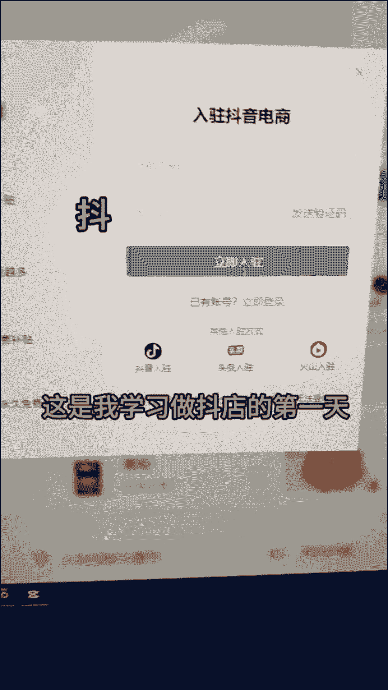
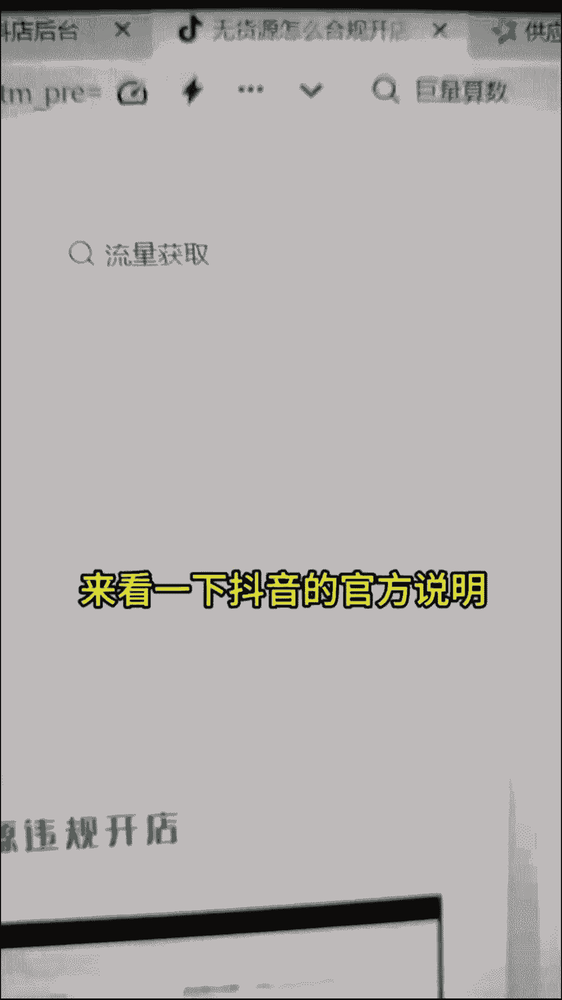
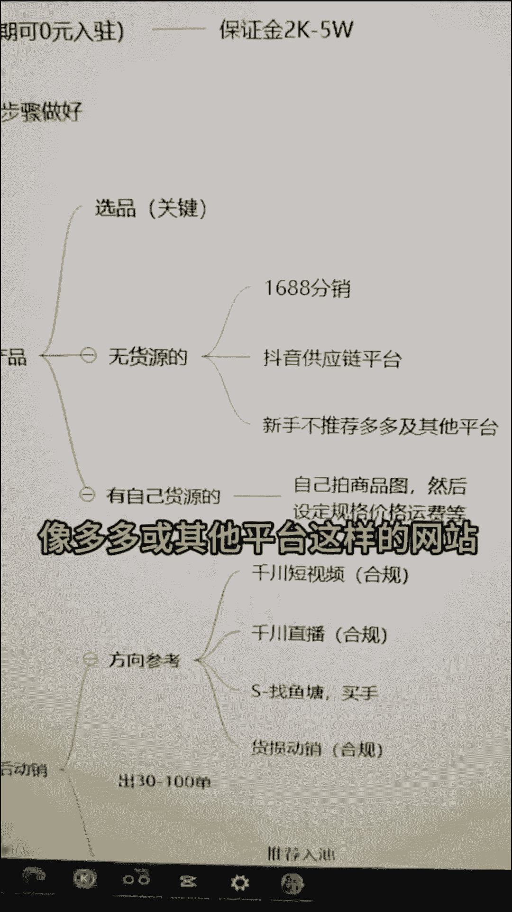
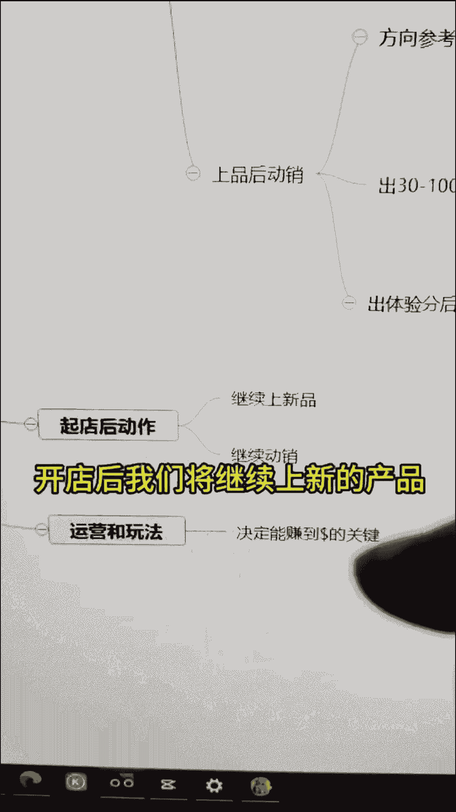
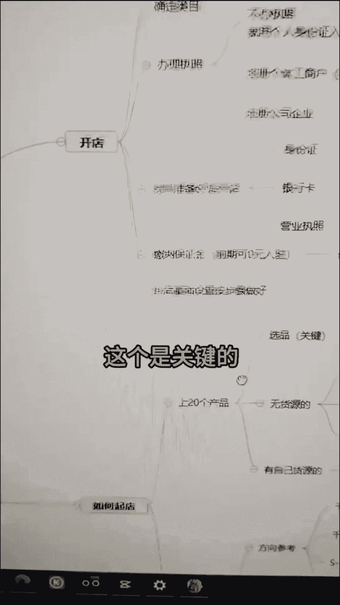

# 2024-抖音小店起店先起号全过程详细讲解，全类目开店教学！零基础也能轻松打造爆款店铺 - P3：抖音小店竖版 - 倒芭垂杨柳 - BV1SgssezE1z

啊是我啊啊38岁我辞职了，打算做一家抖音小店，这是我学习做抖店的第一天。

这个抖店我前段时间就注册了，但是一直没有做，从今天开始记录一下我的抖店日记，我的视频重在质量，所以时间会长一些，听他们说抖店成功爆单之后可以一夜暴富，不知道是真是假，我花时间整理了坐垫的流程。

第一步是开店，开店之前呢，我们需要先确定做什么类目，也就是说你想卖什么，确定类目之后，我们需要先申请执照，个人店也可以开，但是限制比较多，建议做个体店或者是企业店申请营业执照。

我们可以去当地行政管理局或者网上申请，准备好材料后点击申请开店，不要用抖音和这些账号申请，因为万一你的抖店违规后，会关联到你的店铺，用手机号注册就行了，入驻审核通过后，我们开始开店。

前期开店我们至少需要上传20个产品，这是抖店的要求，在上产品之前，我们需要先选产品，然后才能上品，选品是开店很关键的一步，后面我会更新一个视频来讲，选品无货源也是可以做的，不要听别人说无货源不能做。

来看一下抖音的官方说明。

无货源怎么合规开店，12月份刚更新的无货源，商家可以选择精选货源或者是供应链平台，经销货源一般是6688的，就是抖音供应链平台，当然有些人不想使用1688或者供应链平台，你也可以使用其他平台。

但好多平台因为面单问题，我们很容易被判处无货源处罚，保证金，对新手来说，1688或者是供应链平台比较推荐，像多多或其他平台这样的网站不太推荐啊。

对新手来说不太友好，容易出事儿，怎么选品，有没有货源，怎么分销，怎么设定价格运费，这些我后面都会更新，商品完成后，我们将进行动销，动销是什么意思呢，就是让你的产品有销量，这些可以人为干预。

动销完成后给你的商品推送流量，这是比较容易理解的，动销的方法和方向，大部分人会找S单，找鱼塘买手刷，但这样很容易被倾销，量也容易出事，很多人就卡在这个问题上，我推荐两种动效方式。

一个是直播动销或短视频投钱穿，前期出分只需要30单，这个很好完成，这也是合规的，另外一种就是做货损动效，就是你找一些几块钱的福利品，卖的比别人低一到两块，这个很快能出单，一般出30单到100单。

这样出30单会给你体验分，100单会出新手村，切记把控好产品的质量，就是你去选那种好评比较多的产品，商家这里提到一个体验分，体验分就相当于衡量你店铺权重的标准，也是你店铺的生命线，要维护好。

只有你出体验分之后，你的商品才能够入职，才能有更多的流量推给你，入职之后可以去精选联盟啊，你的产品进入精选联盟之后呢，也会有更多的流量，完成这些步骤之后，你的抖店算是成功开启了，开店后。

我们将继续上新的产品。

然后继续动销，你之前是20个产品，然后是50个产品，然后再铺到200个品，这样就可以了，抖店能决定你能不能赚钱的，是后期的一些操作和玩法，比如说选品啊，上品动销这些东西是个人都可以玩的。

主要是后期的打法，这个是关键的。

后期可以赚到钱，我现在才做好基础设置这一块儿，明天我开始选品，上品，我之前是有一点点经验的，所以我对流程比较熟悉，这是删减版的啊，这样大家容易理解，很多东西没办法讲的很细，视频长度也不允许。

从第一步到这，后面我基本上都会操作，后面我会制作一个完整版的教程，一起做抖店的朋友可以追更一下。