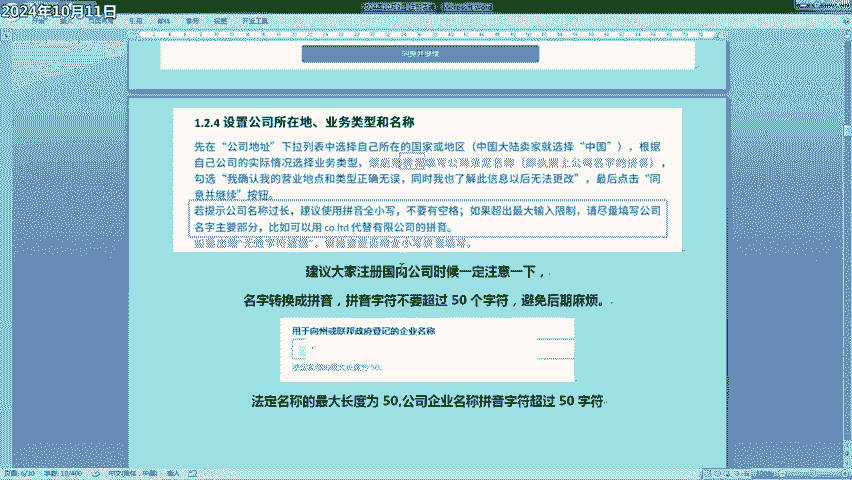
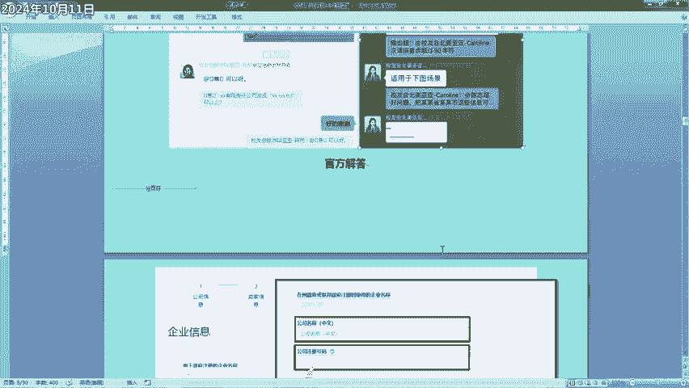
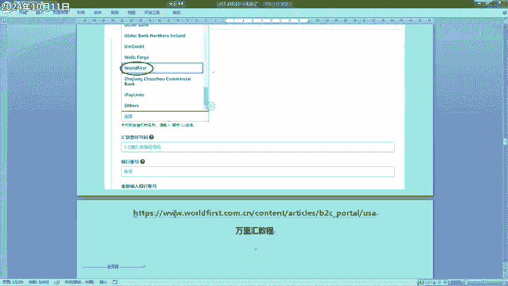
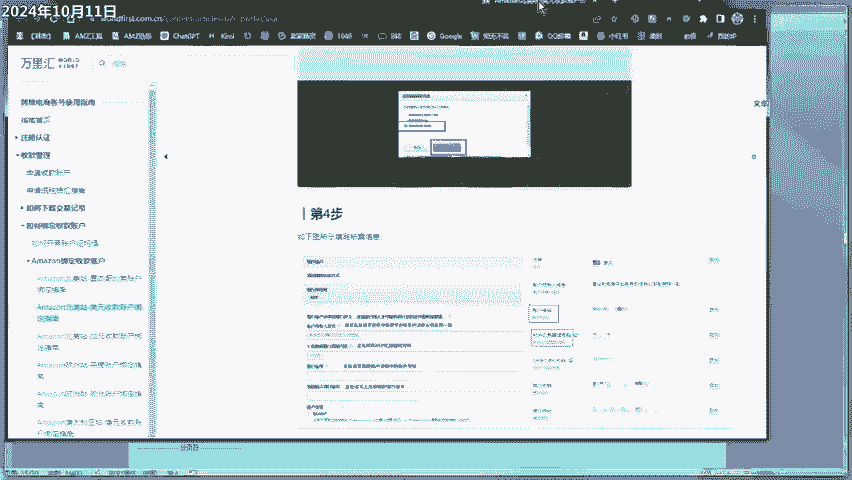
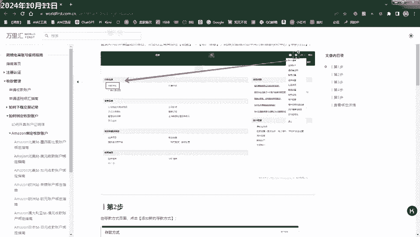
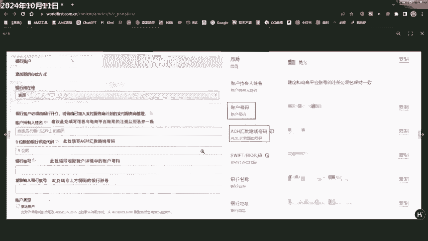
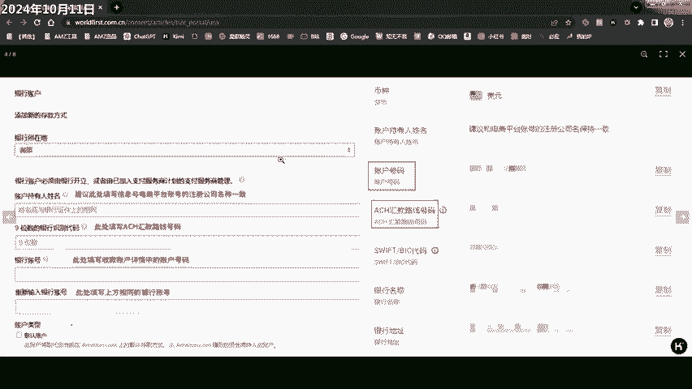
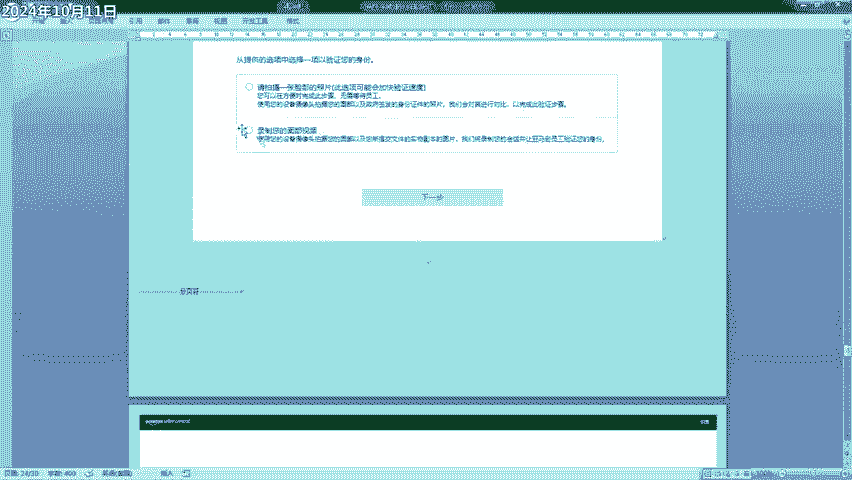
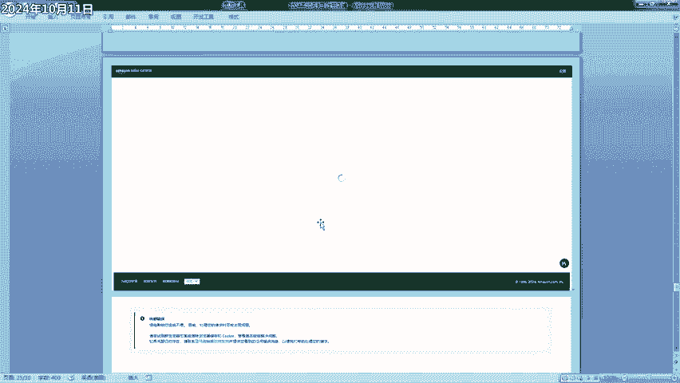
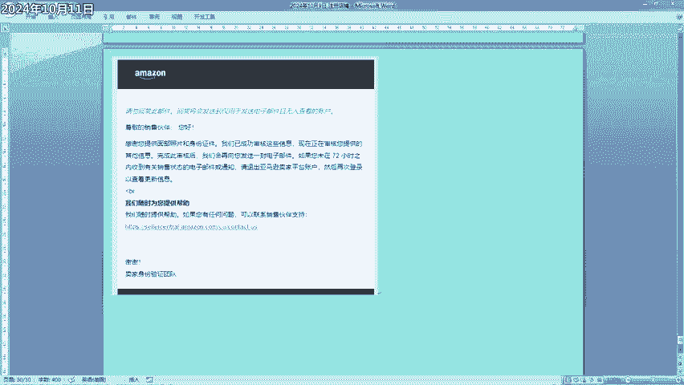

# 2024.10月亚马逊注册新店铺过程记录 - P1 - 無上清凉AMZ - BV1wP28Y1EHk

给大家录制一个。亚马逊新店铺。注册的一个过程，这是现在是2024年10月11日。嗯，收到邮件以后呢，先点开注册按钮，不要点上面的登录。然后呢，这里建议输入就是法人的名字，按照这个格式出。书写拼音。

然后这个格呢写你注册申请之后那个邮箱不要变更。密码可以随意填，6位以上好像就可以。然后点到下一步以后，它就会有一个拼图的验证。拼图验证完成以后，会向你邮箱发送验证码，按照实际填写就可以。

然后后面就来到验证手机验证码了，这个选86的选86中文、中国的，然后输进去手机号。嗯，他是给我验证了两遍，第一遍是英文的一个验证码。嗯，也是一串数字，然后呢又要输一遍。是中文的。短信也是来两条。

按照按照这实际情实际情况输就可以。嗯。然后第一页就填写商业信息。公司地址，中国，这个是私有企业。然后呢，这里填写你的公司的全称，要求是拼音，小写，不要有空格。然后我在这里遇到了一个问题。

就是出现了这个法定名称的长度超过了50个。就是把公司的名字变成拼音以后，字符超过了50个。然后这是官方的一个一个这个问题的解决办法啊。他说，如果你的名字提示公司名字过长，建议使用小拼音小写，不要有空格。

但是这样如果还有很多人超过的话，然后呢，他就建议填写公司的公司名称的主要部分。然后后面这个什么有限公司啊，有限责任公司可以用用这个CO点limit。代替。嗯，我为了这个呢也也是转天以后才继续注册。

因为我咨询了一下这个这个招商经理，他是这样给我回复的，就说第一个是这个，他说可以变成这样。然后呢，另外后来我就加了一个群儿。呃，群儿群里面的这个招商经理也是有其他的群友问这怎么解决。嗯，他是这样回复的。

大家可以参考一下。那就说可以把比如说是河北省是石家庄市这些都去掉，就保留最关键的信息。大家可以参考一下。

然后后面就来到了。填写企业信息这，然后我印象第一个格，它是自动出来的，和你之前填写的一样拼音。然后第二行填写这个中文的，你公司的名字，注，然后是那个注册号码。然后填到这里的时候呢，这个邮编你先填。

先去百度一下自己的邮编，填进以后填进去以后，这个地区和这个城市它会自己显示出来。然后其他按照要求。填写就可以了。呃，然后这个是地址的填写的一个要求。用中文填写。然后。符号要求用半角符号输入。

但是这个是官方的一个说明，现在官方后台的那个就是这个这个界面已经变了，就是没有再让你填手机号和验证码的这一项。因为之前已经验证过了，登录的时候我是没有遇到过。然后后面填写法定代表人的信息。

这里呢这个是官方的一个一个解释呃，中间名中国人没有就填星和名的拼音，一定要注意是拼音。然后其他咱看下一页啊。然后然后在下面单填完了以后，它会弹出来让你填中文名和中文星，这这按照它的顺序正常填写就可以。

然后这个身份证有效期如果是长期的，就选择一个最远的日期就可以了，这也是官方的解释啊。然后。地址这里点这个查看保存的地址，直接选上咱之前的地址就可以。你的居住地址。然后对一般的小卖家来说呢。

那个咱光杆司令只有一个人。是不是？然后就在这里全挑勾就就可以了。是否唯一受受益人是啊，是法定代表人，也是受益人。如果如果你的营业执照是呃。法人是两个人的话，嗯可以关注一下，好像是超过25%以后。

这个地方要选否，后面它会出来再出来其他的表单让你填。写完了以后，就后面该填写付款信息和其实就是一个咱收亚马逊美元的一个账号和一个付广告费的一个信用卡信息。啊，这一部分呢是填写。嗯。

收款信息这里呢我查我在网上查了一下，这里都是建议选择公司的名称。因为这里有一个是法人名称，一个是公司名称，这里建议选择公司的名称。然后呢，剩下的这一部分都需要按照你实际的呃第三方的收款账户。来填。

然后我是注册的是万里辉万里辉，我们就拿万里辉来讲解一下啊。办理会的英文名称是这个。Wordfor。选上第一步，先选上这个，然后后面有两个格，我们我们看万里会的教程啊，稍等一下。

这个就是上面万里会教程打开的那个连接。它呢显示的是就是你店已经有店铺以后再填写万里汇的信息。但是咱这里这前面用不上，我看了一下，只有这一步可以用上。

呃。这个现呃这个选项现在这个注册的页面已经没有了，只有这三个，一个是9位数。这个9位数填写填写这ACH，这直接复制复制过来就可以。然后银行账号和重新输入银行账号，直接就选择这个账户号码就可以。

这直接填进去就行。

然后填完了以后，点下一步。我这个。没显示出来。听完了以后，选下一步，然后直接它就当时就能显示关联成功。然后开始填写这个付款的信用卡。信息。卡号正常填到期日期，看卡片上面的时间。然后持卡姓名。

这个要写拼音，注意啊，这个要写你信用卡上面的名字。比如你叫张三，它上面应该就是顺序写的张三，而不是像之前写的是3张，这里注意一下，然后这个收费地址也注意一下。

这里填弹出来的应该是你之前填写的中文的收费地址。但这个但是这个就是官方的说明，要求这个收费地址是用拼音或者英文填写。这我也把这个官方的这文件也也复制一下。他明确要求用英文或者拼音填写。

尤其检查默认的收费地址是否与信用卡地址相同，如果不同，请添加新地址，使用英文或拼音填写。他说了三次一次两次，然后这里又又一次三次，大家注意这个。嗯，然后这个添加新地址，它会弹出来框。

你就照着正常填就可以。然后店铺名称，这你提前想好写个店铺名称。呃。起完了以后，它这里有个选项是否被别人占用。然后关于这一块呢，嗯我是这样填的，然后我在网上也是搜了一些，基本上都是就是这是。都是这样天的。

所以我就这样天了。然后后面就是让你上传这个营业执照照片。大家注意这个商传营业执照的时候呢。嗯一定要拿手机拍车，不要P图，不要扫描，然后四个角都得都要露出来。身份证也是同样的要求。

然后现在这个身份验证之前验证的时候都是视频和亚马逊的工作人员。直接面对面的验证，但是现在没有那个选项呃。我看群里边也有群友选用选的第一个就直接拍照片，但是我没敢用，我查了查大部分人都是用这个面部视频。

点上这以后，点下一步。

然后我到这里还卡了一下，卡了一下，我就直接。

刷新了一下，然后就到了这一步，这一步注意也是我也是在网页上显示的截的图，然后呢把网页链接直接复制的复制到手机上，然后直接登录。登录输验证码，然后就可以继续了。验证完以后，它就是。

显示这个画面验证的过程呢就是让你拍用手机，其实还是拍照。嗯，只不过是在录的过程，然后。拍你的身份证正面，身份证反面，还有营业执照。然后点确定就可以了，全程都是自助完成的，没有人工。嗯，完成了以后呢。

网页上直接一刷新就变成这样子。然后在当时呢是没有收到邮件，大概有个5分钟。就收到了一封邮件。他大概就说已经成功审核这些信息，但现在现在正在审核您提供的其他信息。嗯，大概就是这个情况。

我还还有一个注意的点，就是这个身份证明文件，我这个身份证明文件呃，就是身份证照片用的是中文命名的。但是我看看它最后后台提示的时候，它显示是乱码是问号。所以建议大家呢尽量用拼音或者英文或者数字来命名。

避免它这个系统又有问题。亚马逊的系统。比较。比较严格吧。然后整体的情况就是这个样子，大家有什么问题？可以留言，然后需要招商经理的呢，也可以私信我或者留言。好，谢谢大家。

