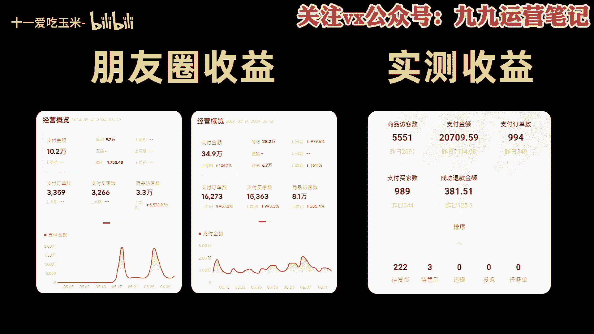

# 2024B站全网最强最良心新媒体运营教程】2024最干货的小红书运营起号高阶教程，比付费还强十倍的自学款课程 涨粉／就业 直播运营从入门到实战全干货！月入3万 - P1：保姆级教程，小红书开店拆解，小白也可以上手！ - 十一爱吃玉米- - BV1UDiKeSEUe

他们都是为了挣钱努力奋斗的年轻人，要说最近什么项目最火啊。

那就必须要提到小红书电商，我朋友圈月入五位数甚至六位数的比比皆是，我还在市面上买了一些课程，学习，到现在单人单店一个月也能做个一两万块吧，今天我就用一个视频详细的给大家拆解一下。

就是小红书电商到底怎么玩，你就跟着我的视频去按图索骥就足够。

你在这个事情上开始盈利了，整个项目的逻辑它就三件事。

第一个呢开店，第二个选品，第三个流量，先说开店嗯。

首先就是打开小红书，然后点击左上角的菜单图标，再选择创作中心，选择店铺，点击立即入住就可以了，你就按他官方要求的提交资料入住就行了。

这里跟大家说一下小红书店铺的两种形式，个人店和企业店，其中个人店有两种，分别是个人店和个体工商户店，个人店只需要身份证，加1000保证金就可以开通了，个体工商户呢还要多一个营业执照，企业店呢就多一点。

企业店有三种呃，有包括那个普通的企业店，有专卖店和旗舰店，企业店都需要营业执照，而且还要缴纳600的年费，我们刚开始运营小红书电商的时候，你直接选择个人店就可以了，我们实测下来，企业店和个人店一样。

平台并没有对企业店有什么流量倾斜。

开店的成本呢有这么几个，第一个就是1000块钱的保证金啊，不做了可以退，第二个呢是平台的扣点营业额的5%，第三个呢是支付渠道的费用，大概呢每单是0。7%，第四个就是自己的流动资金啊。

一开始大家做呢可以用无货源的方式去做啊，对资金要求也不高，你刚开始呢准备个2000块，3000块完全够了，呃，开完店以后呢，我们下一步就是选品，我们应该在小红书上卖什么的，选品其实也简单啊哈。

在其他平台上的爆款，大概率在小红书上也能爆，目前小红书呢我是推荐三个渠道进行选品的，第一个是通过某东，某宝上面找那种小红书平台调性的爆款产品，第二个呢是通过某音的那个精选联盟，你在某音的精选联盟排行榜。

你可以看到现阶段哪些品卖的好，只要符合小红书用户调性的产品，直接搬运测试就可以了，第三个就是某多多的这个销量排行榜，选择适合小红书的类目排行榜，从中选择相应的爆品搬运到小红书，整个选品的逻辑就是。

我们要利用市场来帮助我们选品，而不是自己在那瞎想，相当于是借助了别人的能力来帮我们自己选品，这样反而是最快捷。

而且是最稳妥的选品方式，肯定比你瞎测成功率要高很多，然后等你这个产品上架以后呢，就到了最重要的环节了，我们应该如何获取流量。

小红书它是个种草平台，你店铺九成以上的流量啊。

都是来自你发的发的笔记，小红书不要铺店群，而要做账号矩阵，尽可能多的发笔记耗流量，它的通路就是用户通过你的笔记啊，对你推的产品产生兴趣，然后到达你的店铺完成购买，所以怎么在小红书上发笔记对吧。

就是你小红书电商是否成功的关键，小红书这个平台你直接发硬广，我觉得效果非常差，你发笔记的时候一定要用一个素人的角度，你知道吧，就是用户的角度去切入，站在用户的角度去做种草内容，而不是官方视角。

这才是真正有效的呃，这种种草笔记怎么做，其实也很简单，就是去各大平台的商品评论里找，比如某音某宝，某东的商品买家秀，找到好看的素材，你直接copy下来用嘛对吧，文案呢在买家评价上去做修改。

这些买家的评价就是商品用户的使用体验，天然的适合用来做这个中考笔记，而且可以说是取之不尽了啊，然后呃当你单个账号的SOP跑通了是吧，我们就可以开始矩阵引流了啊，通过批量上小红书账号。

批量发布笔记给我们的店铺来引流来放大。

那基本上整个小红书的电商的运营啊，就是我上面分享的这些，根据上面的几个点，我给大家准备了一份资料，里面包括了小红书账号的旗号运营的方法，以及一份小红书电商的视频课程，你如果打算经营小红书电商。

你也不用看别的东西，就跟着这份资料走足够，你开始盈利了，有需要的啊，点赞加关注，在评论区回复红书电商。

