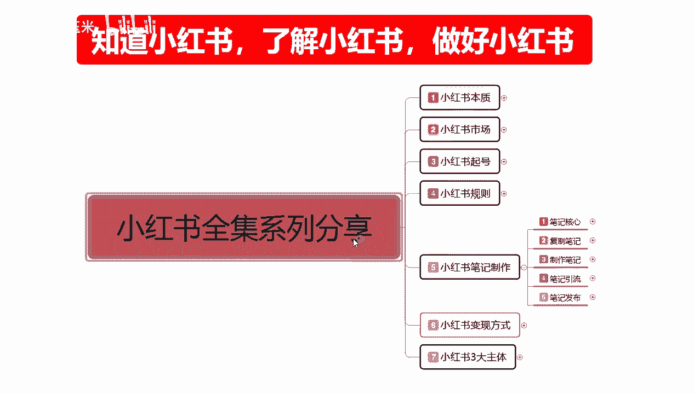
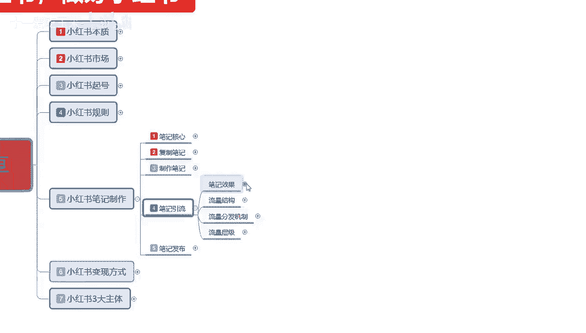
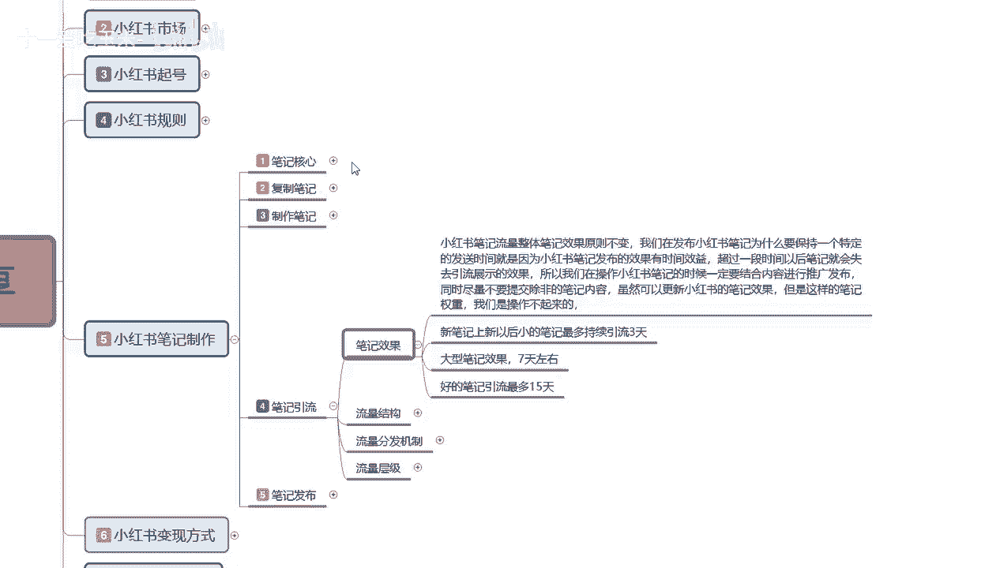
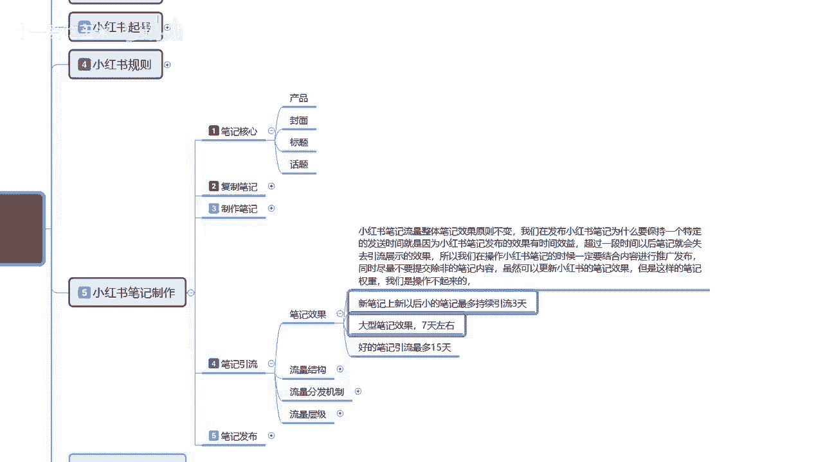

# 2024B站全网最强最良心新媒体运营教程】2024最干货的小红书运营起号高阶教程，比付费还强十倍的自学款课程 涨粉／就业 直播运营从入门到实战全干货！月入3万 - P28：28、小红书笔记引流：笔记效果 - 十一爱吃玉米- - BV1UDiKeSEUe

大家好，今天给大家分享的是小红书全集系列，第五大课时笔记引流的一个内容，呃，之前呢已经给大家把笔记的核心，复制笔记和制作笔记，两种方式呢已经教给大家了，包括我们笔记核心所需要注意的一个重点。

这节课呢主要给大家讲解的呢。

是笔记牛的一个内容，笔记引流啊，他相当相对于上面三节课的话，他不是一个实质性的内容呃，它整个内容的话是给我们大家讲述一下，我们小红书整个系统平台，它的一个笔记发布以后，我们所获得的一个整体效果。

首先我们来了解一下笔记，它整体获得的一个效果是什么样子的。

小红书笔记流量整体笔记效果的话，原则它是不变的啊，我们在发布小红书笔记，为什么要保持一个特定的发送时间发送，就是因为小红书笔记整体发布的一个效果，他有时间效应，超过时间超过一段时间以后。

笔记就会失去它的一个引流展示效果，所以我们在操作小红书的时候，一定要结合内容进行推广发布，同时尽量的话就是不要提交，除非笔记的一个内容以外的其他内容，因为你一个账号的话，说实在的一个小红。

一个小红书账号每天发两篇笔记就已经不错了，也最多的话是发五篇，但是我们正常的话一天发两，一天发两篇笔记就可以了，你再多的话，它的整体效果的话就没那么好，嗯所以我们在操作小红书的时候。

一定要结合我们整体的一个内容，进行推广发布啊，虽然小红书可以嗯，怎么说呢，它更新小更新的一个笔记效果的话，这里的话我给大家呢是列了三个大点，在这个地方，第一个就是说新笔记上新以后啊。

小红书他是根据账号权重来的，新笔记上新以后，笔记最多的持续引流时间是三天，大型笔记效果的话是七天，最好的笔记的话效果是持续15天，他这个是怎么划分的呢，第一个是根据账号权重，第二个是根据我们展示以后。

小红书前期给我们的一个展现，获得的小眼睛数量来判断的，我们新账号什么都没做的前提下，我们直接去发布的话，我们一篇笔记它可以给我们持续引流，三天前5分钟效果最好，5分钟过后他是慢慢的自序引流。

他就要靠排名了，前5分钟对于新笔记来说的话，前5分钟是最好的，他能给你获得20~30的一个小眼睛点击量，也就是小红书，一次性给你投入了大概500个左右的一个，推广流量给你，你能获得的小眼睛数量。

也就是我们获得的一个点击数量能达到多少，决定了我们下一个层级在什么地方，正常的新的笔记的话，最多引流效果持续三天，也就是你的小眼睛数量不达标，最多就推广三天，三天以后的话，他就没有推广了。

他就放在这个地方，除非有人偶尔搜索，可能会点进来一个，不然的话他的那个小眼睛它不会增加，知道吧，就是不会有人去点击的，所以说我这就是为我为什么说我们做小红书啊，做笔记推广也好，做其他的也好。

他都是靠爆款文章来火的，它和抖音的一个效果是差不多的，只是抖音它是四屏为主，小红书它是以文字图片为主啊，内容讲述不同，小红书的话，一次展示他是一个空格，不小红书是四个空格，抖音是一次一个空格。

简单点说就是抖音是强制型的小红书，你只要靠我们整体数据了，抖音强制性什么意思，你整体没有权重，没有推广账号，什么属性都没有，也那么直接去做抖音的一个推广推送，投诉的话，你的那个基础曝光量给你以后。

你后续就没有了，没人搜没人看了啊，就算你就说点赞关注加收藏给你了，你这个展示量它也起不来，那小红书不一样，你的整体数据前期可能是维持三天，但是你到中期后期以后，你的数据笔记爆了以后。

就是你只要有一篇笔记报了你其他的笔记，他的点击量就是小眼睛会慢慢的慢慢的增加，你笔记爆款的观看的人数越多，那么你后续前期做的这些小笔记，他慢慢的也会增加，增加以后的话，他还会同时再给你进行一部分的推流。

但是这个推流的话，肯定是没有，第一次直接给你投送，1000到2000的一个展示流量那么大啊，但是你可以通过其他爆款的一个数据化，引动这些小的一个流量，但是整体效果也就那样，所以说我们在做的时候。

小红书根据账号的权重，根据我们所发的一个内容来判断的话，就是小红书第一篇笔记，你不管怎么发上去啊，你的粉丝量在没有达到一定范围以后，它的局限性就在这个地方，就给你这么多展示，你能获得点击，你就上去。

你获不得点击，获得不了点击，就三天，三天过后，你这个笔记就相当于是没什么用了，而且你还不能算错，大型笔记的一个效果的话，它的持续时间是七天，是什么意思呢，基础点击数量就是给了你1000展示以后。

基础点击数量超过一15%，你技术点技术展示是1000，超过15%，就是你要有100个小150个小眼睛，超过这个百一百五十个小眼睛以后，这个笔记的效果他会帮你连续推广七天，好的笔记的效果。

超过20%到30%以后，他会连续帮你推广15天，这个就是笔记整体发送以后，就是我们把笔记制作完成以后，通过第一次展示的一个主页面显示，也就是笔记核心里面的一个什么图片效果，一个标题效果，靠这两个获得。

前期最基础的也就是基础步骤数，怎么说呢，就是给了你1000展示你点击达标了，那么可以给你展示点击没达标，就三天展示点击达标了，就是七天，点击超过了就是15天，这个就是整个一个笔记效果。

为什么说我们在小红书账号权重是非常重要的，因为你基础的账号权重，你的基数越大，你所发布推广的一个笔记，前面给你引流的效果也就越好，你后续的话它都是断断续续的，它不是连贯性的。

然后他这个里面每天是两篇笔记，效果为最佳，也就是平台给你扶持流量的话可能是3000个，第一篇笔记可能是700，第二篇笔记可能是800，第三篇笔记可能就只有300~400，一直到第五篇。

把你整个账号权重的一个展示量用完，但是我们为什么说只用前面两个呢，精简精简的效果，他后面的话会把流量慢慢的给你增加以后，你发放的笔记数量和你的一个内容吸引力，达标以后，你的账号权重提及，知道吧。

我们在第一层级的话，说实话你的这整体展示就是零到200，一个小眼睛的点击数量，所以说我们一定要注意这个点啊，这个呢就是整个笔记引流的一个核心，所需要做的最重要的一步，笔记引流我们要明白。

我所发不放的笔记，不是说因为我的内容的一个原因，做的不好，小红书平台他不给我一个流量，不是它是根据你账号权重，根据你小眼睛的一个点击数，和我们所发布的内容综合来进行评价的。

你不能说我的笔记做完了以后的话，我发不上去，今天怎么只有20个小，20个人来观看我的一个产品啊，观观看我的一个笔记内容，观看我所发布的一些信息，是因为你账号权重不够，不是因为你小红书整体来说不够。

第一个是账号权重，第二个就是我们的一个笔记效果，所以说我们要把这个点做好以后，后续你才好展开。

这就是我们笔记核心里面啊最重要的一个点，封面和标题，封面标题做好以后就可以达到这个效果，你的封面如果说点击封面和标题，点击能达到15%以上，就可以做到大型笔记的效果，超过30%。

你就能做到15天的一个推流，你做不到的话，那你就只有基础流量三天，前期我们想把它做到，七天到15天的一个效果很难，但是你保证三天的一个基础流量，这个就是小红书平台和其他平台不一样的，效地方啊。

你不管怎么做，你笔记做的再差，他也会给你三天的一个推流，主要这三天的推流流量的一个入口量大不大啊，就看账号权重了，当然这个里面还有一个点，就是有的小笔记的话，我们发上去可能只有十个点击。

20个点击也就是小于零，那是因为你的整体作品点击率都不高，导致我们账号权重它会越来越低，所以说整体的话你做不起来，就是这综合的一个因素，而不是单独的因素啊，就是你准备的内容再精美，你账号权重不高。

你发数据，他的技术展示量也在这个地方啊，这就是笔记效果，后续呢还有一个流量的一个结构，流量分发机制啊，我们就在下一堂给大家进行一个整体分解。

