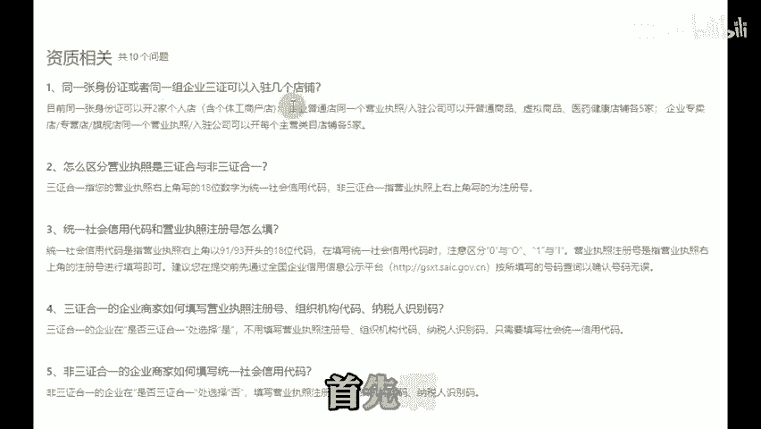

# 2024下半年做拼多多获取自然流量第一步——筛选➕裂变 - P1 - 独白uup - BV1qcmTYGEi4

🎼听说最近拼多多啊有很多对商家利好的政策，这不我又带着我的案例店铺来给大家分享了。这个店铺呢是一个纯自然流量的店铺，没有直通车数据啊。那今年下半年如果说还在坚持做多多的朋友啊，一定要看完本期视频。

我会把这几个月运营的一些心得以及运营步骤啊分享出来，能学到多少呢？就看各位的本事了。首先想要做自然流量的第一步呢就是筛选加裂变。那么什么是筛选呢？当你只有一个拼多多店铺，那么你会显得非常被动。

因为一旦你运营的这个店铺啊，数据流量都不好的情况下，那么你的时间资金精力都浪费了。而且压力也会非常大，所以筛选出一个各项数据都很优秀的店铺就显得尤为重要了。那么这个时候就会有人有疑问的。

多多一个人只能开两家店铺，我怎么去筛选裂变呢？首先啊你可以线上办理一张营业执照，只要大几百就能解决。现在多多所有类目的保证金啊，都从1000下调到了500。以前你开两家店。😊。

🎼需要2000，现在2000呢可以给你开4家店铺了，大大节省了我们前期的投资成本。其次，如果你家里或者办公室只有一根网线，担心注册这么多店铺会IP关联，影响到流量。首先呢其实这个问题啊根本不用担心。

因为我们已经测试过店铺只有被限流或者售假以及商品品质问题，才会互相影响流量。当然了，你要是想IP不相关联也是有办法的。就是用这个浏览器，一个店铺，一个IP互不关联。你如果在广州，那么你的IP呢。

就可以定位在四川或者湖南一个店铺，一个定位，非常适合一些小众且暴力的类目去做。至于是哪些类目呢？我就不一一举例了。懂得都懂。那解决了店铺问题，你就会遇到新的问题。就是一个店铺啊需要绑定一个手机号。

我们一个人手上呢，最多也就两个手机号码。如果你想开10个店铺所需要准备的就是10个手机号码，自己去当地的营业厅办理，不仅麻烦。而。😊。

🎼每个月的固定套餐费用呢就是一大笔开销。当然了，我也有解决办法，就是用这个云号码工具，一个手机啊就能够绑定上百个手机号码，只需要一个主账号用来接收验证码就行。操作简单，使用便捷。

这就是我们作为免费流量必须要用到的一些工具。今天呢由于时间有限。后续操作啊，请持续关注独白的干货合集。这个系列应该会持续一周，直到把大家教会为止。最后上述的电商工具以及操作步骤，到到发期，你懂的。

我们下期再见，拜拜。😊。

