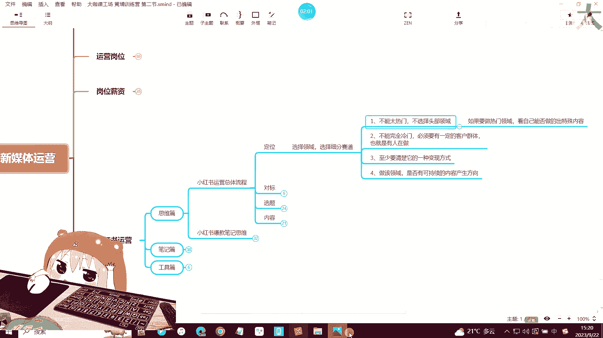
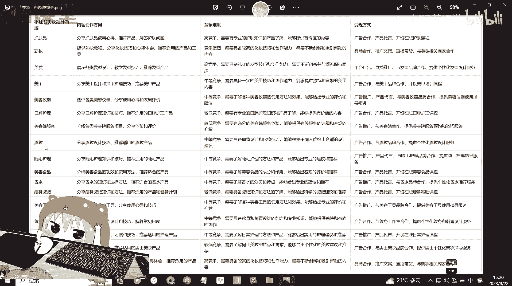
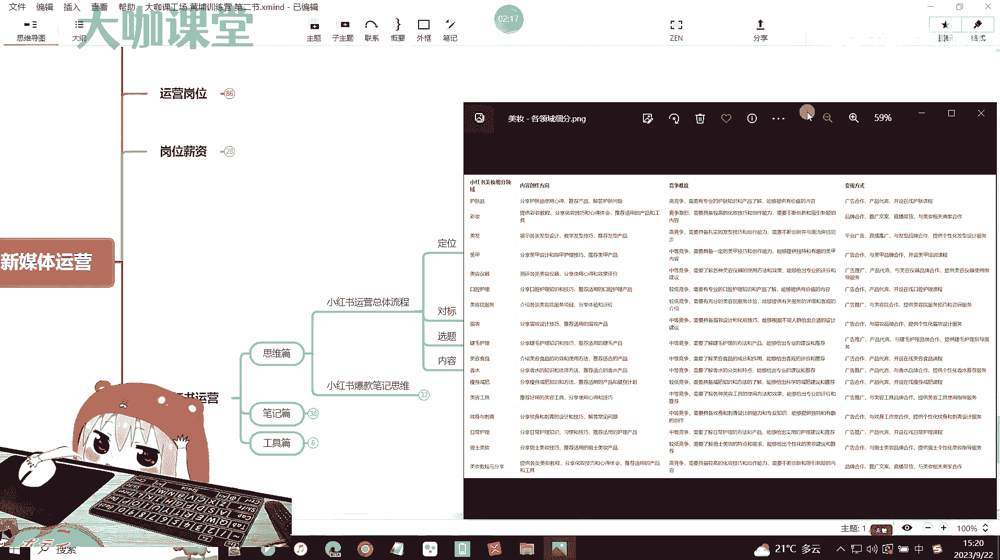
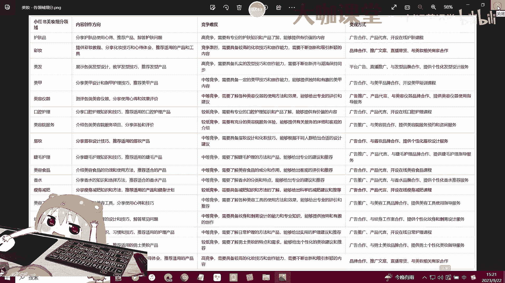
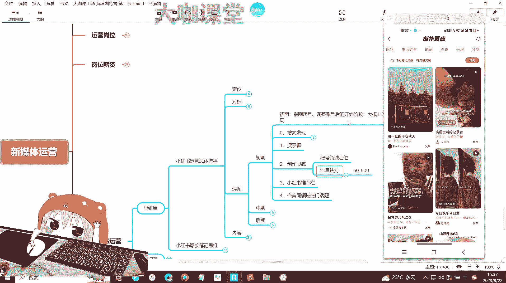
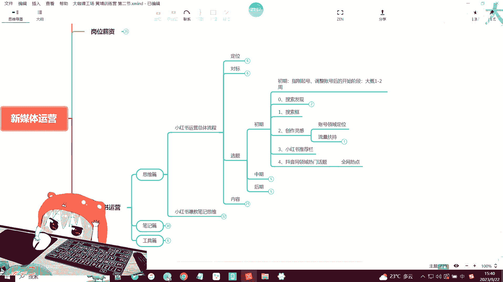
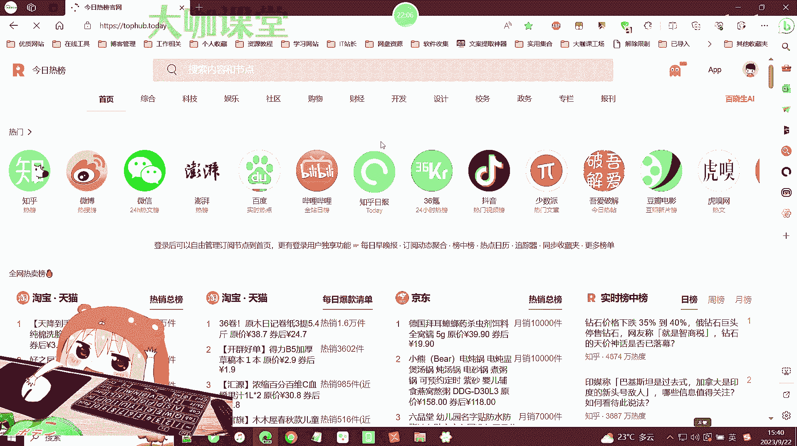
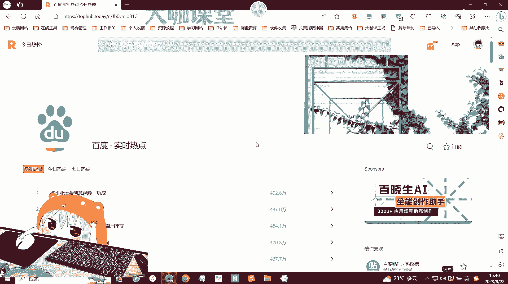
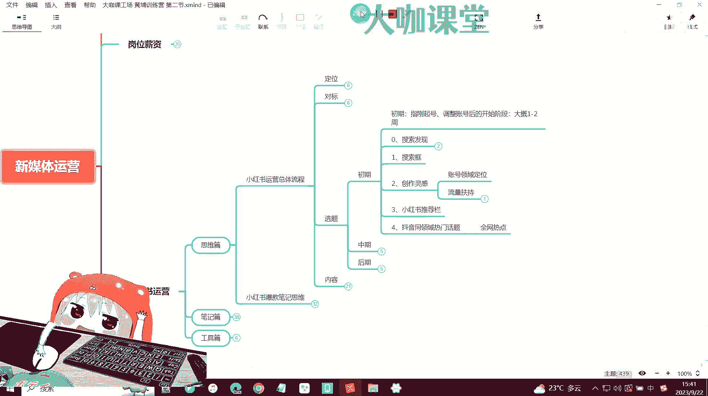

# 2024全套新媒体运营课程／小红书运营学习路线／抖音直播带货／短视频运营新手0-1起号零基础必学课 - P37：19：新媒体运营-小红书内容选题-账号初期 - 方老师运营课堂 - BV1Zb421b7Ff

OK好欢迎大家来到我们这一堂课，那么这一堂课的话呢，我们主要讲一个就是关于小红书运营里边，思维篇的这个总体的一个小红书运营流程，那么所谓的总体的一个运营流程，其实在我们之前的课程当中也跟大家讲过对吧。

我们小红书运营它其实总共只分为四部，也就是说从你的一个账号刚起号，刚注册，一直到你后面发出第一篇笔记，以致到你最后这个账号能够出爆款，能够有自己这样的一个数据产生的，这个完整的一个流程。

那么首先第一步对吧，我们讲是定位，那么定位呢，也就是说我们需要去选择自己的一个，细分的赛道和领域对吧，也就是说这个账号我在小红书上去做的，那么我就得明确，我这个账号里边要提供什么样的内容，我做哪个领域。

哪个方面是美妆，母婴或是其他家居好物分享等等，这些赛道你定好了之后，那么后面你去做选题的时候，你才能确保你的账号里边有一个一定的垂直度，然后平台呢它也能成功的给你的账号打上一个。

领域专家这样的一个标签好吧，那么定位我们讲究选择细分赛道对吧，我们讲究几个原则，首先第一呢你的这个赛道我们刚起号的时候啊，尤其是前期不要选择这种太热门，太过泛的这种领域啊。

就是尽量我们不去选择这种竞争特别大的，头部领域，那如果说你的产品一定是必须要做这种头部的，比如说小红书里边最大的美妆赛道对吧，你要去做美妆赛道，那么这个时候你就得考虑，你要去从美妆赛道里面去细分对吧。

我们去找更多其他领域可以做的内容，比如说我们举个例子，啊比如说我们举个例子啊，领域细分，那么关于美妆，这里之前有一个简短的一个图片给大家看一下。

好那么比如说你是做美妆的美妆领域呢，我们有很多的细分领域，对不对，像美容仪器，口腔护理，美妆睫毛护理。

美容食品，香水啊，瘦身减肥对吧，这些都有。

那么像男士美妆这些细分赛道，你可以去给他做一下拆分，你具体做哪个领域，然后如果你是做眉庄的话，那么眉庄里边你刚开始起号的时候，还有没有可以再细化的这种领域，这个时候就是我们要考虑不要去做太竞争。

太大的好吧，我们要去做细分化的赛道，能够让你这个账号能够缩短，它的一个前期的新手期，快速出成绩。

出效果，也能对我们账号的一个总体权重，带来一个非常大的帮助对吧，那么第二个呢就是不能做完全冷门，对不对，那你一定要有，就是说这个平台上一定要有你的一个客户群体，也就是说你要知道他是有人在做的，有人在做。

而且有数据代表着这个平台有你的客户，对不对，那如果说你像你是做一些什么大型设备的对吧，我们前期讲过，还有一些你是做什么新能源设备的，这种呃机械化的东西，大型的这个单价比较高的这种几万几10万。

上百万的这种产品，那你适不适合在小红书做呢，啊，这个时候呢你可能要考虑一下，小红书上面有没有你的群体，对不对，那上面如果没有人在做，你去做了啊，可能你觉得这是一个冷门的行业，对不对，有可能你能报。

但是有些东西啊，现在的互联网就是有些东西没有人做啊，反而代表着可能有一定的问题，OK而第三个呢，如果你是给自己做账号，那么你要明白，你得知道它的一个至少有一种的这个，变现方式对吧，然后做该领域的话。

你后续你可以考虑一下，就是你后期是否有可以持续去生产啊，产出的这个内容方向，那不管你是去从对标账号那里copy，还是说你自己有这一块的资料或者创意，那你必须确保这个领域你有内容去做产出对吧。

我们不要求说你做这个领域，你一定是这个领域的专家，但是你得要对他懂，那么这个好，方便我们后期做内容的去做规划好吧，做优化，那么这是关于定位，我们就不过多讲，因为已经讲了很多了，然后对标的话很简单。

我们的要求就是你做小红书起号的时候，你的同领域优质对标账号，至少要选择大于等于五个这样的一个标准对吧，对标账号它的一个作用我们也讲的很简单了，首先找到你这个爆款对标账号的一个表。

然后在里面登记你的这个爆款账号，也就是说呃，你这个行业里边，这个有爆款的这种优质的账号对吧，作为你的对标账号，然后呢就是我们选择这样的一个对标账号啊，我们选择这样的一个对标账号。

其实就是在选择你的创作方向，创作风格以及创作内容，其实这三个点你在你的这个爆款的，也就是说你对标的这个账号里边，都能够分析出来，你通过分析他们爆款的这种内容，你可以知道他们什么样的内容。

就是你这个领域当中，什么样的内容是你的客户喜欢什么样的内容，可能是平台喜欢的，那这就是我们前面跟大家讲的，我们运营一定是围绕两个原则，一个是用户，一个是平台对吧，那么找对标账号。

我们还要分析一下这个对标账号，他最开始的一个真实的一个数据情况，那么他有没有隐藏这个笔记，那如果你关注的不是很早的话，我们这个暂且不考虑，我们需要看一下这个账号，比如说他只做了三个月，他的第一篇笔记。

我看到的时候他是第三啊，也就是说他三个月前出的第一篇笔记，然后现在一共更新了，维持了三个月对吧，那么这段时间他的账号呃，他请了多少粉丝，他的数据有多少，那么既然能够成为你的对标账号。

那我相信他的数据肯定不是差，那也就是说三个月之间他做到了这种程度，那这个账号你一定要仔细的去研究好吧，那如果说你找到一个账号，他的第一篇笔记的更新周期时间呃，在两年或者说一年半以上。

也就是说在22年的年初，或者说呃像在这个21年的时候，甚至19年的时候更新开始做的这种账号，那他们初期的这个数据，也就是说给你提供的参考意义，可能不是并不是特别大，你可以参考一下他们后期数据报。

出报起来这些笔记，那么他们上面这些笔记的内容，笔记的这个封面，标题文案等等，这些可能作为你的参考，但是前期的数据没有参考价值，因为小红书在前期的时候呢，只要你坚持做，那么可能是个傻子。

你上去你都能把它做起来，OK那么这是小红书，我们去观察对标账号的一个，前期的一个数据情况，然后对标账号的更新频率，还有它采用了哪些标签，对吧，这些标签呢可能是你后期需要参考的一个点。

OK那么这是我们讲对标它的一个重要性，那么接下来我们就讲今天的这个，关于内容选题了，OK内容选题非常非常的重要，那么所谓选题，我们其实是把它分为初期中期后期，那么什么意思呢，就是说我们的账号在我们写的。

发布的每一篇笔记，他都一定是要有一定的依据的对吧，一定的依据，那这些依据在哪里，为什么说我们要采用这篇这些依据，我们稍后来一一跟大家讲，就是说你去做小红书，你希望能把这个账号做起来。

你一定要按照这种思路去做好吧，你写的每一篇笔记，每一个内容，它都一定是要有有他的这个呃基础的这个内容，或者方向去做支持的，OK那么首先我们来看一下初期啊，初期我这里写的就是初期。

指的就是我们刚开始起号啊，或者说你有一个小红书账号，你从现在开始去做调整，那么调整之后大概你按照这个方向去做，一到两周是大概率可以出爆款笔记的，OK是大概率可以出爆款笔记，那么我们来看怎么去做。

首先第一个选题方向是关于搜索发现，那如果研究小红书比较多的，应该知道这个东西啊，这个东西其实是什么呢，它就相当于是抖音的一个热点，OK我们来看一下搜索发现在哪里，就是你点击你进入小红书的这个主页。

然后你点击这个搜索图标，点击完了之后呢，在这个区域，这个区域这个区域它会有一个搜索发现，那这个搜索发现就是平台的热点，平台的热点，那如果说你的笔记或者说你的领域，在这个时候跟他的这个搜索发现里面的内容。

有所关，有所关联或者挂钩，那这个时候你就可以去做这一块的内容，OK那么这就是我们讲的平台的一个热点，其实你可以理解为像抖音的这个平台，热点是一样的，这是第一个，这个我放在首位，那一旦这个地方有出现。

跟你的领域挂钩的这种热点，你可以持续去发布三天啊，你可以持续去发布三天，关于这个热点的笔记，那么如果说报了，它能够给你带来非常高的这个增益啊，数据增益，粉丝等等都有可能。

OK那么这是第一个关于搜索发现对吧，那其实搜索发现还有一个点，我们很多人就是没有没有去理解这个东西啊，就我们讲你去利用搜索发现，去利用平台的这个热点去创作内容的时候，其实有一个东西，就是，我们并不是说。

一定指望着这篇笔记能够最终去出爆款，那如果说真的没有出，我们连续发了三天，他还有一个好处，你潜在的好处就是可以让平台去注意到你，因为你作为一个新号，我们现在讲的是初期你作为一个新号。

或者说你刚对这个账号做了一定的调整，领域重新规划之后，那么这个时候你就要让平台看到你，平台注意到你发布的帖子，你要有一定的几率能够参与平台的收入，懂不懂啊，这个时候就是我们一般啊我们做新号的时候。

其实我们做小红书的新号，你的笔记想要参与收入是不是一件很容易的事，那么如果你去蹭了热点，你能蹭上的话，OK那么不管说你这篇笔记有没有报，那么大概率，你这篇笔记有可能会被啊搜索收录的。

那如果说你收入参与了这个收入之后，那这个时候你的账号相当于是给了平台，一个注意到你的一个机会，那么后期你的相应的一些潜在的这种分值，会得到一定的提高啊，可能提高的不多，但是这是一个优化的点。

OK让平台去注意到，你好吧，那么就是参与平台的一个热点，第二个搜索框啊，搜索框是什么意思呢，就这个地方啊，这个地方，那么我们进入到主页，然后还是一样点击一下搜索搜索，这里呢有一个搜索框。

然后在搜索框里边我们输入相应的内容，比如说我们现在搜一个穿搭好，我们搜索穿搭了之后，OK不要点击，不要点击搜索，我们来看一下这个地方，我们来看一下这个地方啊，这里呢我框出来的一些数据。

这些东西是你们一定要注意的啊，一定要注意的，包括你们后期如果说你们做其他平台的运营，那么只要它有搜索功能的，那么你们一定要注意，这个地方给你们提供的这种暗示，也就是平台给你们提供的一个数据啊。

你们如果说自己有搜索过，就是很多人现在拿小红书作为一个问答平台嘛，对吧，那么你们搜索过之后，你们有没有可能在这个地方，平台给你推荐的这些词里面去选择一些内容，去做点击呢。

那么这个是有很大概率的很大概率的，那么我有时候搜索习惯，包括现在百度啊，或者说我用抖音或者小红书，我去搜索的时候，他下面给我提示的词还是非常精准的，就是说这些提示词跟你的主要搜索词。

之间的关联是非常高的，那这个关联是怎么来的，就是小红书这个平台，他去统计他这个平台所有搜索关联，穿搭这个词的一些用户，他们搜索的穿搭之后还会搜索哪一些词，那么搜索的越多，他有可能就会在这个地方去出现。

比如说穿搭的长发啊，他有一个这样的一个排序好吧，那么我们默认的话排得更前的，就代表着是这个关键词，它的拓展搜索更高，也就是权重更高的词，那如果说你前期你的账号去做内容，你要保证你的这个内容做的。

也就是说你输出的笔记是用户喜欢的，而且是平台喜欢的，那么你就要根据这个搜索提示来做好吧，搜索提示来做怎么做啊，找到这里边几个几个关键词靠前的，跟你的业务，或者说像一些有一些没用的词，这种词啊。

有一些没用的词啊，这个词其实也可以啊，那如果说有一些没用的词，你就要考虑把它剔除一下啊，全白或者什么样的呢，像这个穿搭的视频脚本怎么写，那很显然，这不是你的一个穿搭用户可能会喜欢的东西。

那如果你是做穿搭分享的这个东西，就就把它过滤掉，那么其他筛选出来的关键词怎么做，每个关键词你可以去每天发一篇，比如说你今天是三篇笔记对吧，你发一篇关于穿搭博主，现实或者穿搭怎么搭配，穿搭韩秋秋韩系。

你今天的三篇笔记你就发这，你就发这三篇，OK然后明天你再围绕着这样做一个顺序，你把你的关键词做一个排序，你在做这个高级感的早秋，还有这个其他的，也就是说你每天可以去找几找，找准这个搜索下面的几个词。

来分几天去发，每天发不一样的，OK每天发不一样的，然后以至少说3~4天为一个循环，3~4天为一个循环，那么这个地方的搜索框里面的内容，我告诉你们，他们是很少去出现变动的啊，也不是很少，就是说小红书。

他现在的一个就是笔记里边的一些呃，搜索更新周期大概是一个礼拜左右吧，一个礼拜他会更新一下这些数据，但是就是据我们观察的一个情况，小红书平台，他更新这些搜索词并不是特别那个啊，也就是说大部分用户。

他的搜索需求并不会出现一个特别大的变化，除非是一些特殊的行业，或者说我们到了换季啊，像我们穿搭这个行业，对不对，你到了换季的时候，他可能这个地方的搜索词肯定会出现变化对吧。

那如果说我们去搜索这样的一个安安排，这样的一个搜索词，它没有没有特别大的变化，那么你三天到四天的一个周期，其实里面更新的这个笔记内容，你就围绕着这个搜索词来做，是对你有非常非常大的一个好处的。

OK那么这个时候其实听过我之前的课的同学，应该都知道啊，我们这样做的一个主要目的，就是让我们去创作的内容，符合平台的一个喜好对吧，这个地方呢可能说呃我们搜索这一块，它展现的这些内容。

并不一定真的是用户特别需要的，但是我要告诉你们，一个是你的账号，前期啊，也就是刚起号的时候，你不要想着你做的内容会被用户多么喜欢，这个时候你的账号还在起号阶段，你一定要想办法让平台注意到。

你让平台察觉到你把你的这个内容，你尽量往平台喜欢的这个方向去靠，那这些搜索词就代表的是平台喜欢的，因为平台觉得这些内容是用户喜欢的，OK那么你就往这方面去靠，你就做这一类的内容，能明白吧。

OK那就是我们讲的一个关于搜索框的一个选题，好那我们接下来再看创作灵感，那么创作灵感的话，有过实操经验的应该也知道啊，我跟大家简单展示一下啊，创作灵感这一块，首先它有两个重要的一个东西。

就是第一个啊账号领域的定位，它能够协助你去完善，就是快完成你的一个账号，在这个领域的一个垂直定位，那么我们之前讲过啊，你在一个领域里面的定位周期长短，其实并不好去判断，因为你的账号的定位。

是通过平台系统的一个算法去实现的，也就是说平台根据你的账号的一些数据，关键词，还有你的这个人群浏览的一些数据等等，根据这些来判断你的一个账号领域，但是我们如果说在创作灵感里边，去偏好我们创作的内容。

OK这个时候有助于我们快速提升，我们的一个账号领域定位，也就是说让平台给我们打上这样的一个标签，能够加快进度，能理解吧，那么这个我们看一下啊，我们来看一下创作灵感，创作灵感就在我们的主页。

OK我们的主页这里有一个创作灵感啊，进入到主页，如果说你没有关注的话，你需要关注一下这个创作灵感才会出现，我们点击一下进去之后，那么这里呢，就是我们的一个创作灵感的一个广场，在这个地方。

我们可以找到与我们行业相关的这种话题，我们去参与这个话题的发布，也就是说点击一下这个发布按钮，那么我们就可以进入到这个日常碎片，PLOG的PLOG的这个一个发布的界面，那么选择我们相应的这个呃照片文案。

它会自动就是与你这个话题挂钩，然后里边呢也会打上一个日常碎片，PLOG的一个标签，那么现在有710万人，710万人发布，OK那么如果你没有的话呢，你在这里面找一找找一找。

那如果说你在这里找不到你自己的这个领域，详细的，就比如说你是做职场的，还有你是做一些知识分享的，还是做一些娱乐搞笑的，那如果这个地方你找不到，OK那你就要去那个我们就要先发几篇笔记好吧。

我们先发几篇笔记，笔记的话是垂直的，符合搜索，符合我们搜索发现里边这样的一个两个规则，那么你的创作灵感后面会给你推相应的东西，OK那么创作灵感还有一个东西，就是流量的一个扶持。

你刚开始呢其实呃你关注了这个创作灵感之后，他会给你一个简单的一个流量，分享流量的一个奖励，OK那么比如说这个地方它又显示了订阅的笔记，流感得啊灵感啊，得这个流量奖励，那么你点击一下订阅。

他会给你送个200左右的一个啊，两百两百左右的一个流量扶持，那么这个流量的话你可以用在你的笔记上，笔记上啊，当然这个时候呢他给你扶持的这种流量呃，正常来讲啊，是没办法完全达到200的。

除非说你账号后期做的还可以，那么这个时候呃，他可能给你200的扶持，最终能够被啊完全体现出来的数据，可能只有50个50个，但是它是有增幅的，好吧有增益的，那么这个我们可以持续去做，OK持续制作创作灵感。

那么第三个呢就是我们的小红书的一个推荐栏。

那么什么是小红书的推荐栏，我们来看一下，比如说我们现在进入一个搜索界面，我们还是一样，那么这里呢我们搜索一下这个秋天穿搭好吧，好我们搜索完了，然后点击搜索按钮，进入到了一个搜索展示结果页面。

这个时候我们来看一个地方，我们来看这里综合后面所提供的这些内容，可以看到这里有秋天穿搭，梨形身材微胖大学生，高级感胖妹妹等等啊，那么这个我们可以把它，也就是我们把它称为叫做小红书的一个推荐栏。

推荐栏也就是推荐浏览的地方，那么这些就是假如说你现在作为一个真实用户，你做的是秋天穿搭的领域，那么除了下面给你展示的结果之外，系统还会告诉你啊，很多搜索秋天穿搭的用户，他还会去看一些梨形身材。

微胖大学生等等这些相关的内容，那么这个时候就相当于是平台，给了我们一个创作的提示，如果说你现在正在做穿搭，你就要考虑这上面的这些内容，你有没有去做你的这个笔记里边，也就是你的账号里面的笔记。

有没有覆盖这些内容，比如说你有没有做梨形身材的这样的一个，穿搭的笔记，微胖类的你有没有做，但是微胖在这个穿搭里边，可能是一个单独的领域，OK大学生高级感等等这些词，你有没有放到你的标题里。

你的文案里面有没有包含这些词啊，有没有达到平台想要的这种效果，那么这个也是我们刚才跟大家讲了，一个跟搜索比较类似的这些地方，就是相当于是系统给我们的一个暗示啊，平台给我们的一个暗示，用户喜欢的。

这个是平台认为是用户喜欢的，OK那么这个时候我们就要去迎合平台的喜好啊，平台可能是觉得，我们通过一些简单的数据分析啊，他认为我们的内容确实做的还可以，那么就可能产生我们第一个这样的一个，爆款笔记了。

好吧，这个就是我们讲的关于小红书推荐栏这一块，那么还有是像抖音的一个同领域的热门话题，对吧，这个不用我多说，其实不光抖音，还有全网都是啊，全网的热点啊，全网热点，那么这个地方呢我给大家推荐一个工具啊。

就之前昨天的视频应该应该已经有讲过了，一个热点的一个分析工具。

那么就是这个热榜的一个今日热榜的网站，在这个网站里边呢，你可以去分析各个平台的一个热点，比如说你现在是做的小红书，或者说你做的这个类型比较泛，你可以去看小红书或者抖音，还有哔哩哔哩。

像这个百度等等这些平台，你看一下他们当下有哪一些不同的这种热点啊。

百度可能和抖音比较像。

然后B站的话可能会有一点有一点点区别啊，B站内的它的一个平台的站内热榜呢，是根据这个视频啊，根据视频的一个播放量和，这个它站内的一些数据的增幅来做的，而不是根据我们当下的一个社会的热点。

像百度和抖音这种平台呢，就很多会跟我们这个社会啊，也就是说我们社会热点挂钩，那么我们就需要看我们去做的是哪些内容，这个里边有没有符合我们可以做的一个，内容的需求好。

那么我们今天讲的这个关于去选题的这一块，我不知道大家有没有吸收啊，但是我可以告诉你的是，你在起号了之后，你做了小红书账号，你按照这个方法去做，你把我们教的小红书的所有的关键词，标题封面。

以及你创作方向和领域，对领域定位这一块做的没有问题的话，你坚持下来，大概一到两周，你的数据肯定会有一定的增幅的，可能说这个报还不是报的特别明显，但是会有啊会用，而且也跟你的领域所有相关。

那如果说你现在做小红书，你不知道怎么去做，你就照着这个去做好吧，你就照着我提提供的这个思路去做，Ok，那么这是我们今天讲的关于小红书定位，选题的内容。

