# 2024完整版新媒体运营教程／B站最良心的小红书运营开店高阶课／千万级爆款短视频运营技巧／新手起号0-1运营必学课！ - P4：01.2：运营核心 关键词库搭建+关键词自动分组 - 方老师运营课堂 - BV13M4m1r7U9

Hello，大家好，欢迎大家来到我们这一节课，那么在之前的课程当中呢，我们跟大家讲过，我们要去做一个我们自己的一个关键词库，要去做筛选对吧，呃为什么我们要做关键词呢，呃这是因为一个很重要的因素啊。

就是我们的所搭建的这样的一个关键词库，里边的所有的关键词，每一个关键词都对应了一个用户的真实需求，好吧，都对应了一个用户的真实需求，为什么这么理解啊，就是我们要知道有一件事。

就是我们现在的这个互联网用户呢，在互联网上获取信息的这个方式只有两种，只有两种，第一种呢就是被动接收信息，被动接收信息，这个很好理解啊，就是类似于抖音小红书，还有我们现在各种新媒体平台的这种兴趣推送。

也就是说用户喜欢什么内容，平台主动把他喜欢的内容推送到他的面前，这个叫做被动接收，第二个呢就是主动接收啊，主动接收，主动接收是什么呢，主动接收的渠道就是来源于搜索，也就是说用户他需要去查找诶。

我对某一个点感兴趣，我现在想知道某个东西平台没有推送给我，我就必须得去搜索，不管你去哪搜，你在抖音上搜也好，你在小红书上搜也好，还是百度或者说哔哩哔哩上面搜索，这些都不重要，重要的是搜索这个行为。

它必须对应的一个什么东西啊，搜索这个行为它必须对应了一个东西，叫做关键词，也就是说用户去查找这一块的内容呢，他就必须得通过关键词去搜索，那么关键词搜索出来的才是他想要的，对不对。

那么这具体至于具体是不是他想要这个，我们不说呃，我们在这一点大概就能明白一个东西，关键词这一块呢，它代表着用户的一个实际的真实需求，而且还有一个非常重要的因素，我们所有在做企业运营的客户啊。

我们的这个群体，或者说呃屏幕前的各位同学也好，你们自己做项目，或者说你们去给企业做运营，你们都要明白，我们做互联网运营最终的一个目标，就是要找到我们的最终的一个目标是什么呀，互联网运营的目标啊。

就是要找到我们最佳的呃对标需求，用户意思就是说呃我们平时去投放广告也好，我们做内容也好，呃我们的视频观看的这些群体呢，肯定是有一部分是精准用户，有一部分呢他又是泛用户，这一部分人群呢不是我们想要的。

我们想要的一定是最佳的对标需求用户，也就是我们的精准用户，那这个地方呢所谓的这个精准用户，其实就在搜索关键词这一块，也就是说所有人他去搜索这个时候，他肯定是有这一块的一个需求的，那么有需求。

OK我们就可以根据关键词的这个类型，来对用户进行一个区分，我们只做我们最需要的这一块业务的一个呃，用户就可以了，比如说我举个例子啊，假设你现在是一家做这个考研的培训机构对吧，那么可能你的用户。

他想搜索一下这个考研的资料对吧，考研的时间，然后呢复习呃以及搜索培训机构，那么这几个词当中你去考虑一下哪些用户，他是由可能去你到去到你那里学习的，或者说他有可能成为你的这个呃。

最终下单成功的这样的一个客户对吧，那么培训机构是不是呃，找学习资料的这一类都有可能，是不是，那么这就是代表着我们去根据关键词来区分，我们客户的一种类型，OK这是我们关键词类这一块的一个重要性，好吧。

我们把它打上啊，用户需求加精准用户群体，区分OK，那么我们这一节课的一个重点，就是要教大家怎么去搭建我们的关键词库，还有我们跟大家分享的一个关键词，自动分组的这样的一个工具，OK我们先来看一下好吧。

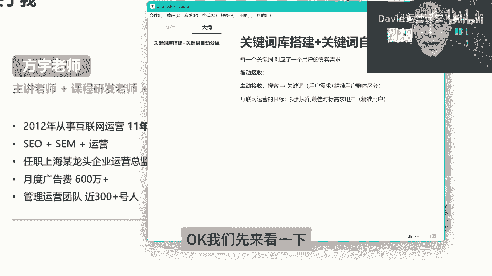

我们先来看一下关键词库的一个搭建，首先呢我们关键词库这一块，我们需要利用到一些工具啊，工具并不是说我们自己去想，你，有时候呢你哪怕你对一个业务产品了解的再透，靠你自己去想，你想不出来多少词好吧。

我们用户的同一个产品的一个搜索行为，和搜索方式一定是多种多样的，并不是说我们觉得一个词，就代表了用户的一个需求，那么可能我们能够考虑到的只有那么一部分。

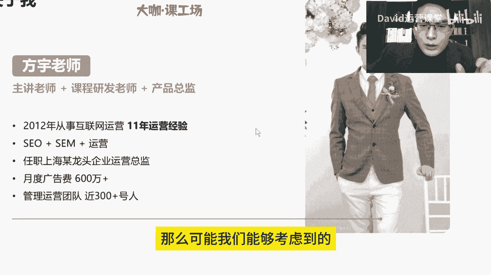

十几个几十个词，但是平常呢我们去搭建一个关键词库。

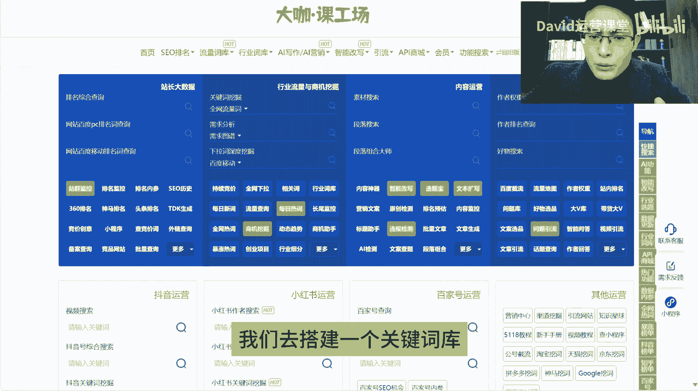

可能有几百个上千个词都有可能，OK那么比如说呃。

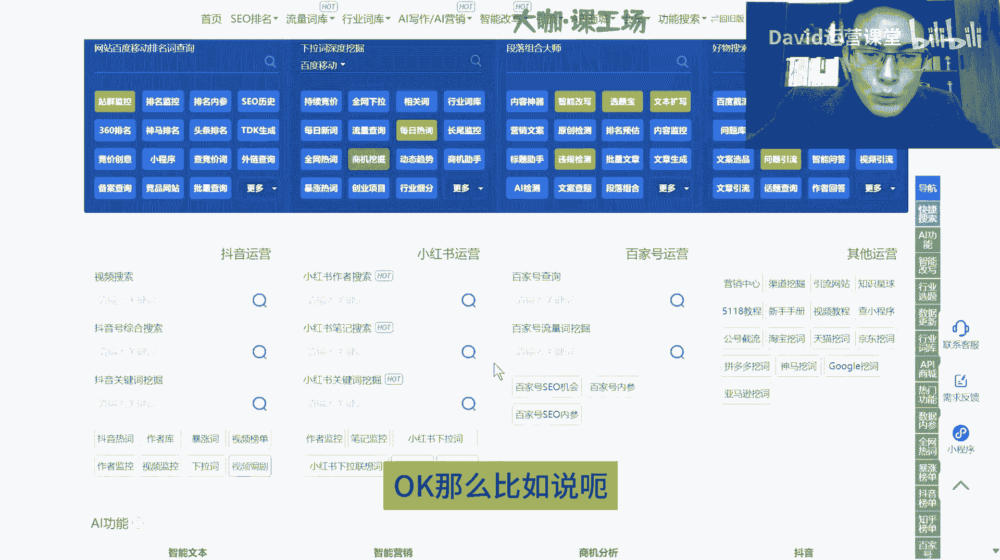

我们以刚才我们讲的这个考研为例，好吧，我们现在要呢又做的是小红书的平台，那么我们就在这个地方，我们找到这个关键词挖掘，这里我们输入呃。

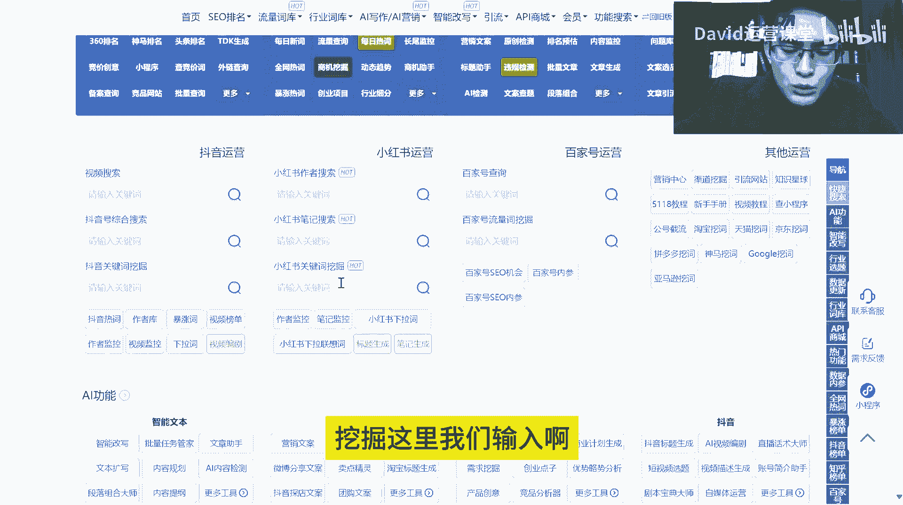

我们输入输入考研啊，我们输入考研嗯，输入考研之后呢，那么这个时候呢，他就会把这个关键词在左侧给我们列出来。

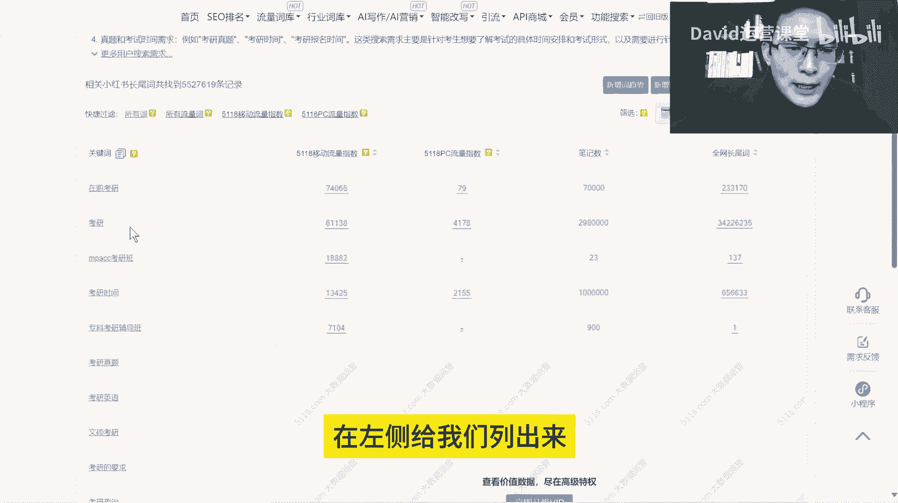

列出来了之后呢，我们就通过这个导出数据，把我们的关键词给导出一下。

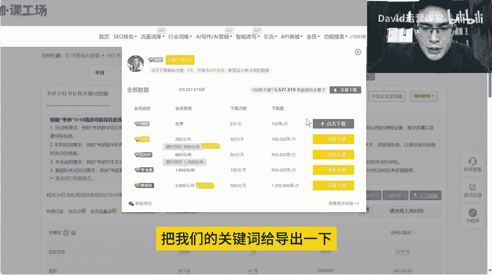

那么呢我这里是已经下载过了啊，我我这里是已经下载过了呃，我给大家看一下，下载完成之后是什么样子啊，嗯呃下载完成就是这样的一个表格。

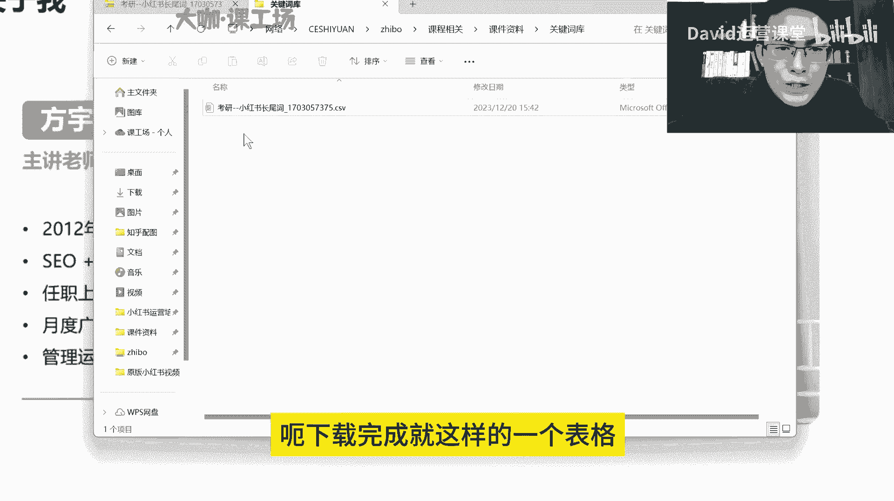

然后呢我们打开这个表格之后呢，它显示就是这样的呃，这些数据呢能够提供一个一定的参考意义，我们先根据我们搭建词库，我们先根据左侧的这个词来看，这里呢有这些搜索词对吧。

这些搜索词呢现在暂时看起来还比较凌乱啊，还比较凌乱，我们搭建自己的一个关键词库的，一个结构的步骤，就是要先把这些词拿到手，再根据这些词库来做这个筛选和排序，OK我们先把这些词拿到啊，拿复制一下。

OK我们把这些关键词复制一下，CTRL加C复制，然后呢我们再打开另外一个工具，这是我们的一个关键词的分组分组工具啊，我们打开这个工具呃。

这个工具呢它需要启用宏啊，我们把这个表格，也就是说不管你是WPS还是这个呃office，你需要把这个表格的这个excel的这个宏给打开，当然呢如果说很多人用的这个WPS呢，嗯你开启不了红。

或者说需要付费的话，那么你可以自己想办法，或者说你去网上搜一下，找一下这个解决方案，或者说你来问一下老师都可以呃，如果说你用的是office的话，那么这个宏就是可以直接启用的好吧。

那么这个时候呢我们打开这个表格之后，我们先注意一下呃，这个地方呢是我们要粘贴的关键词，我们先把关键词粘贴到这个地方嗯，OK那么这里有一个清空首列，清空首列的话呢，就是把这个地方的内容清空。

然后清空内容呢是清除我们待会筛选之后，所有的这个呃内容清除，然后呢呃这有一个快速分组，我们待会要用到这后面呢这个未分组词呃，代表的是我们待会儿把这个分组做完了之后，所有没有经过我们筛选的词。

它会展示在这个地方，那么接下来我们就要把这个词拿到了，我们就要来分析一下这些词的一个性质，把同样类型的词我们把它归类到一起，OK我们先来看一下这个词啊，在职考研考研NPCC考研时间辅导班真题啊。

我们来浏览一下啊，嗯我们先找多的啊，时间咳咳倒计时考研时间时间，OK那么这个地方呢有很多时间相关的啊，我们先放上一个时间，在这个地方蓝色区块啊，记住了放在这里，然后我们再来找时间。

OK然后的话呢我们再看一下几月几号，考研的话是几月几号哈，这个我们待会儿再说呃，什么时候考研呃，课程机构好吧，我们先把课程放在这里呃，机构这里教给大家啊，就是课程跟机构这两个东西呢，它可以理解为一个。

也就是说是我们的业务词对吧，也就是我们刚才说的精准用户，它的一个搜索词，那么这个地方我们就要把它呃有关于课程的，有关于机构的词放在这么一个分组下面，我们就要用到一个技巧，就是一个符号。

我们呃输入按住shift键以及你键盘上的数字，7号键，打一个这样的符号，我们再来把机构打进来，OK那么待会我们来看一下是什么样的，呃，我们先点一下吧，我们看一下啊，呃我们点快速分组好。

那么快速分组之后呢，他就会把这个时间考试时间，报名时间，考研时间，考研时间安排等等这一类的词归类到这里，也就是说只要包含时间的词放在这里，然后呢有涉及到课程，考研呃，机构等等这些他会分类在这里。

那么这个地方呢就是我们刚才跟大家讲的，没有分组的词好，那么我们在这个未分组的词里边，我们再来找啊，我们再来找再来做分呃，这里有一个考研日期啊，考研日期，然后我们刚才是不是看到有一个几几月。

几号来着是吧啊几月几号，那么这种词呢，因为我这个词现在基数少啊，我那个呃那个账号是没有会员的，只能下载100个词，我们现在呢我们就基于这几个词，我们给大家做一下演练，呃，有一个日期是吧，额日期。

那么我们把七放在这里，额日期额，我们把日期放在这里，还有一个叫什么来着，还有一个是号对吧，假设你的词很多的话，那么这样的话能够节省我们很很提高，我们很大的一个词库的一个筛选的效率，然后呢这里有条件是吧。

呃条件条件科目，还有福岛哎辅导的话可以放在这里，科目，还有什么总分复习资料，总分复习资料，嗯资料，题型还有题对吧，还有题嗯，题的话呢可以根据什么呢，可以跟资料放在一块儿，嗯单独放一块吧，几天科目成绩啊。

还有一个成绩，考研成绩，这里有一个成绩，辅导班，倒计时，什么时候出成绩成绩OK那么还有一个成绩，这个东西我们要把这个成绩放在这里，成绩也要提上来啊，因为成绩查询的话呢，或者这一块也有额。

他是具备流量的啊，它是具备流量的，我们把成绩放在这里，然后呢我们来筛选一下，OK成绩什么时候出成绩什么时候出，嗯几月几号时间表啊，考研时间表，考研日期OK嗯这个是没有问题的啊，考研的资料真题。

那么我们在这里就对这个东西呢，做出了一个基础的筛选啊，就是我们的词库，我们看一下还有没有呃，条件条件这个东西呢其实也是啊，也是条件，这个东西也一样，是我们可以做的内容，考研需要什么条件。

有人可能会去搜对吧，我想参与考研，我需要具备什么条件，这个呢就代表着用户的一个呃搜索需求，他需要看这块的内容，我们就得去做这一块的内容，还有报名呃，什么集训营这种啊，就是属于明显的业务词了啊。

这里还有一个什么时候考研对吧，什么时候考研，嗯那这个东西呢我们这样，我们把时间这里我们把尖去掉啊，然后呢我们来分个组考研时间啊，什么时候考研，什么时候出成绩，什么时候考，OK其他的都还好。

然后这里有一个考研成绩，什么时候出，什么时候出成绩，这两个东西呢其实应该放在成绩这一块的，那么这里我再跟大家讲一下呃，他的这个搜索排序以及关键词的排序的规则，分组的一个规则就是哪个东西放在最前面。

哪个词放在最前面，它就优先分哪一些词，那么后面的假设说我们刚才想要提取成绩，这个东西词应该分类在这里的，但是它出现在这里，那么我们就要考虑把这个成绩呢，给他放在靠前的位置，OK要把成绩放在前面。

然后呢我们把这个十兼呃相关的内容放在这里，那么它就可以正确的去分类了，好吧，那么这里呢我们的词库呢展示的还比较少啊，因为什么呢，呃呃因为刚才呢这个这个这个我说啊，这个我还我这个账号没有会员。

但是呢通过这样的一个形式，我们能够看到一个什么呀，就是你的一个关键词库搭建好了之后，你能够根据每一个类型的关键词去考虑这一个，比如说跟时间相关的，很多人想去了解了解考研的时间，那么这一块有可能。

一些关键词是你没有涉及到的，你的标题里面没有包含到的，你没有发到相关的内容的，你就得考虑，比如说考研时间诶，我要去做一篇考研时间的这样一个呃笔记，然后呢，我还得考虑考研考试时间，这个词有人搜索的时候。

他能不能搜索到我的笔记，我需不需要做一篇这样的一个笔记，去发一下我的内容，然后考研倒计时我要不要发所有跟时间相关的，你不要以为诶，我发布了一个考研时间的这样一个笔记，他所有搜索需求都能够跟这个匹配。

这不是的啊，你一定要考虑呃，搜索关键词的一个完整的覆盖率。

也就是说用户需求的这一块的覆盖的角度，那么当你的词库量足够了的时候。

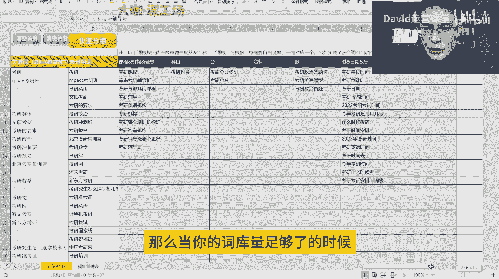

你就能够根据这样的一个词库去呃，规划你整个运营的方向和内容的一个体系好吧，那么这个工具呢他可能说呃，提取的关键词库还比较少是吧，那么我们现在就把这个词库我们去扩大一下呃。

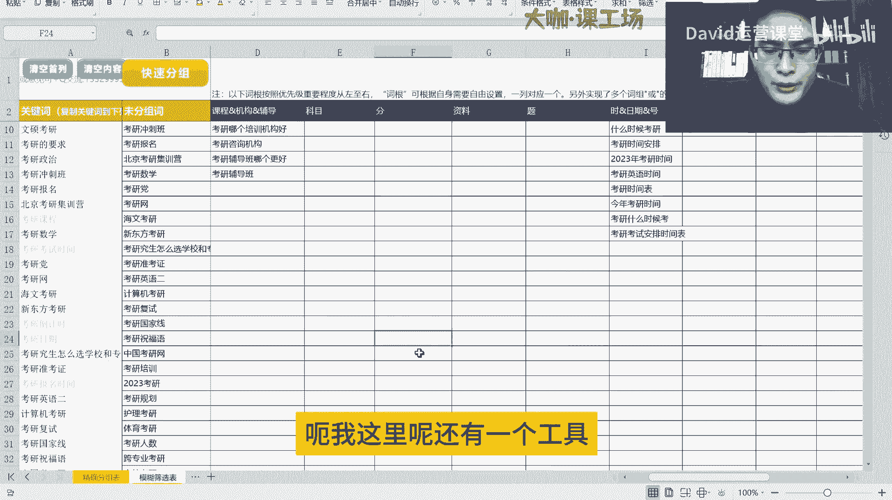

我这里呢还有一个工具呃，这个工具呢是一个百度的推广营销后台呃，现在呢如果说你没有企业在做这个推广的话，你是开不了这个这个后台的额，那么假设我现在呢我进入到这个后台了之后呢，我进入到这个搜索推广。

然后呢在搜索推广里边有个工具中心。

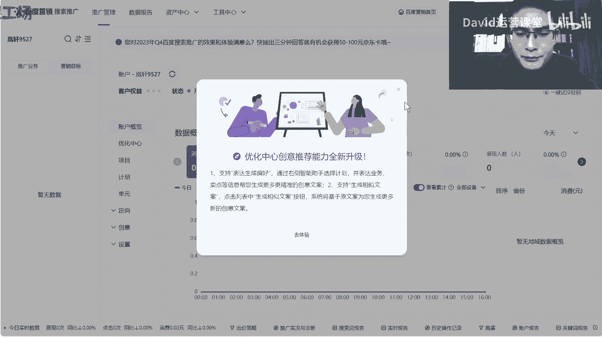

工具中心这里有一个关键词规划师，这里呢是可以下载我们的关键词的，我们还是一样，我们在这个地方搜索考研，好然后呢呃这里的很精准的关键词就来了，很精准的关键词就来了，OK那么呢接下来我们怎么弄呢。

我们就呃点击下载，我们把这些关键词给它下载下来，嗯稍等一下啊，呃我存一下啊，是放哪儿了来着，哦放在这里了，然后的话我们的关键词库我给他存到这里。

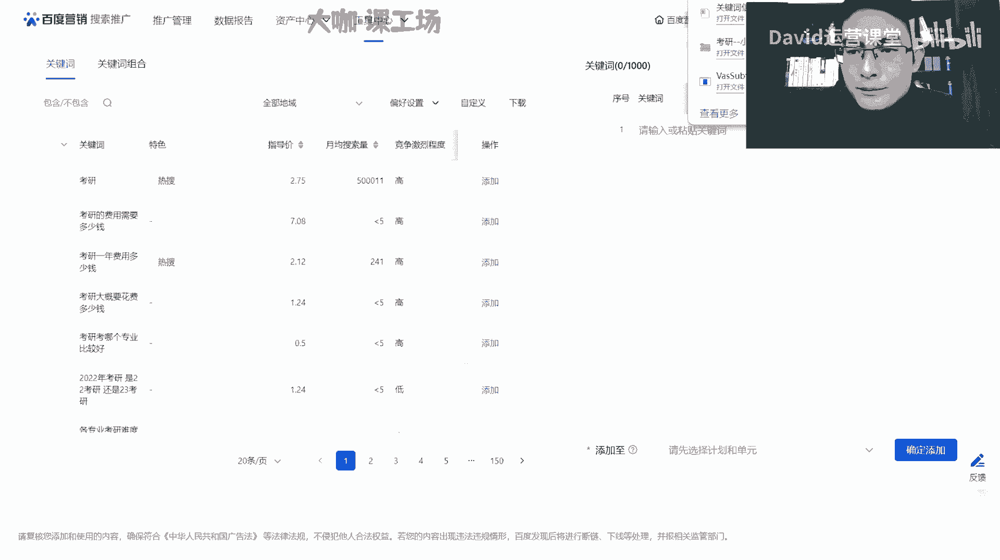

啊这是我们提取的一个关键词库，我们看一下它有多少词啊。

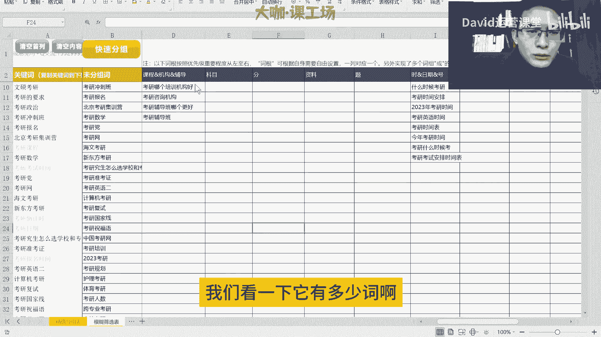

这个词库的量考研这么大的一个体系，这个词库量应该是非常大的，呃他只给了3000个词啊，应该还是还有更多的词，那么呢我们先把这些词呢我们给它，嗯我这个笔记本没有拖布键。

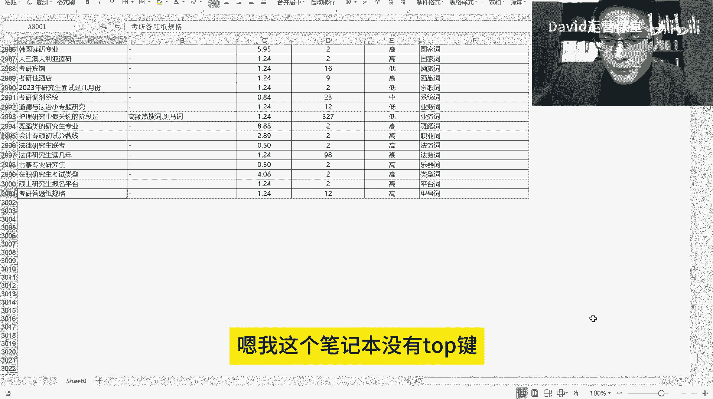

我们先把这个词给它放到这个地方。

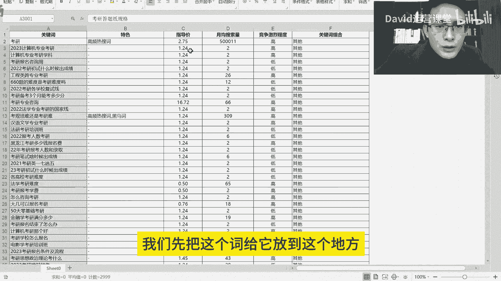

咳咳好，那么呢这里呢词是非常多的啊，应该是覆盖了我们很大一部分，这个呃精准的用户的这一块的一个需求好，然后呢我们点击快速分组，Ok，那么这个时候你就能看到你所搭建的这个词库，它里边缺了哪些内容。

这里边还有哪些内容是你可以做的，比如说费用对吧，我们刚才看到了我们提取词的时候有费用，对不对，然后呢还有这个呃还剩多少天考研，这个嗯计算机考研等等，培训等等，这些都是属于你的业务词。

你要在这个地方去分组的话，你就能够通过这些能够得到非常非常多去搜索，你这些精准的啊，就是代表着精准搜索需求的你的用户啊，锁定它们，我们再去通过矩阵的方式去复刻，那么你做这一块的内容呢。

你就大概就有一个很清晰的方向了啊，这里呢大概还有几千个词，这里应该是还有两千七八百个词还没有弄吧。

就是你要根据这些信息去筛，筛出你的一个关键词库，根据这些关键词库呢去确定你要做哪些内容，OK这是我们这节课要跟大家讲的一个重点，好吧，讲的一个重点，因为怎么说呢，就像我刚开始跟大家讲的，现在呢互联网上。

我们所有的用户接收信息的方式就两种嘛，一个是主动，一个是被动，我们通过主动接收信息的这一群用户群体，他们通过搜索，他们本身就是我们的一个精准的用户群体，我们要想办法抓住这部分用户群体。

我们就能够提高我们的成交和我们所有的业务，这一块的一个呃营销能力啊，营销能力，那么包括我们其实如果说我们在做投放的对吧，我们现在呢包括千川对吧，还有小红书的这个信息流，还有其他的这个推广都是通过什么呀。

他的后台都是通过人群的画像啊，其实也有关键词包这样的一个东西，但是呢他们目前呃还没有，这么就是可能说已经进化了吧，啊他们这个人群划分的形式会更加的多样化啊，更加的多样化，但其实无非就是什么呀。

无非就是根据用户的一个标签啊，用户的一个需求来区分我们要找的用户，他们在哪里，这就是关键词它的一个魅力，和我们之前啊做运营，包括现在做运营，我们要玩的一个东西，好吧，OK那么这节课呢就给大家讲到这里。

