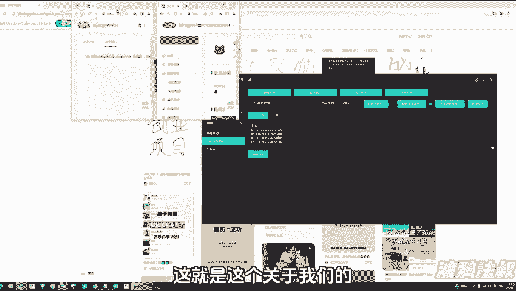
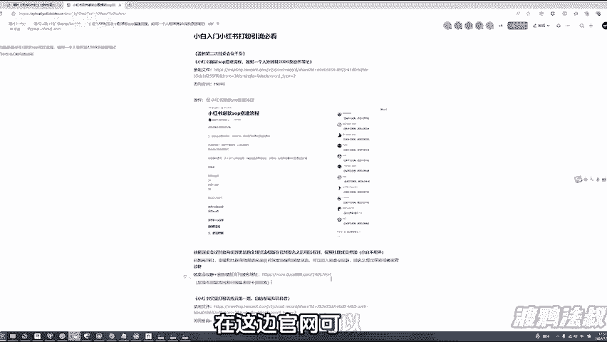

# 2024小红书克隆爆款笔记引流神器。单号引流 5000+，一键克隆爆款笔记+自动去重+自动引流，可瞬间带来自热流量，且对接比特指纹浏览器进行操作。 - P1 - 渡鸦法叔_ - BV1WvWse8EUb

想挣钱是吧？还有一款。🎼多亚科技社群兄弟们下午好，所以今天给大家补录一下咱们红薯云空惧症自热系统7。0的一个详细版教程啊，你不会用的，一定要把这个教程看到最后，所有的这个小细节我都会讲到啊。

首先我先强调一下咱们这个多亚科技开发所有软件已经申请这个商标和著作权啊，未经允许，不要用于这个任何商业操作或者违规破坏啊，这个平台，否则将会追究这个法律责任啊。

大家自己这个工作是自己用正经绿色后端的就可以了啊。然后这个软件是纯粹为了减少人工操作啊，开发的这个RP自动化工具。그 그。🎼那么我们分为两个板块，一个是账号管理这边，一个是自热这个具体的功能。

首先账号管理这边大家点击手动登录账号，这边会存储一个这个账号的CK，我们叫做cooking啊，也叫做CK简写叫CK你点击手动登录之后，打开浏览器啊，它会自动弹出这个啊，然后自动弹出这个页面。

你可以点击这个，然后用你的手机扫码登录，登录着完了之后，点击确定点完确定登录再关掉啊就可以了。那么这里就会提取到一个账号的CK。

🎼啊，然后呢你也可以手动在这边新建这个窗口啊，这边这个有有这个新建创建窗口，你可以自己创建一个这个浏览器出来啊，然后呢把这个账号的。🎼这个IP地址，包括一键随机生成指纹，这些可手动操作一下。

这里可以我们可以这个呃放入买购买的这个代理IPSK5的代理IP点确定。好，那你这个窗口记住你的序列号啊，我们可以直接的在这个呃发布笔记这边啊，或者克隆这边选择这个窗口类型啊。

🎼那么你在这边自己如果是手动创作，创建完了之后，你要手动打开它，然后搜索这个创作者中心，你得手动把CK给登录上去啊，这两种登录方法，一种是你在这填完了之后，系统自动把这个账号填进去登录。

一种是你手动已经创建完了。你想第二次，比如说你发完也篇以笔记了，呃，隔一会儿你还想再发，你就不用重新的在这这边再去呃重新开开端口了，你直接选择这个浏览器窗口，直接打开之前已经发过笔记的窗口就可以了啊。

不用每次都新建了。那么这个窗口数，每天你可以刷新一下啊。这边如果总数满了，是发不出去了啊，然后打开数满了也发不出去。这个自己大家检查一下啊。如果满了，你可以自己去买个套餐啊，几10块钱一个月也不贵。

🎼然后这里点击更新信息啊，这里就会出现你的这个窗口的名称，备注的名称，以及这个对应的账号的这个平台啊，包括你有这些备注啊等等，它都会提取出来。🎼啊，然后我们这克隆记功能很简单啊，现在不需要去填CK了呃。

不需要去自己提取账号CK了，直接把作品地址发复制上去然后点击获取啊，他就会获取到这个了。然后我们把这些这个多余的标签给它去掉，就可以发布了。那我这边如果是启动一个线程，就是一个账号，启动两个。

就同时启动两个账号啊。如果你是四个账号，那你启动两个账号结束之后会把剩下两个账号也给发布出去。那我这边比如说我启动两个账号，然后间隔两秒，两秒就2000。🎼啊，然后这边配置IP如果你是让它全自动打开。

你就可以配置。如果你是手动已经在这个比特界面这边配置过了啊，你这边配置过了，那你就不需要啊，大家可以第一次使用的时候，让它自动去填，自动去配置。第二次的话就选择用浏览器的方式。比如说我选择第一个窗口啊。

我看一下刚刚是哪个是搞的啊。第一个窗口以及这个。🎼呃，第二个窗口啊，这这里是第一个窗口，然后我们这边可以再选择一个这个第五个窗口啊，前提是你这个第五个窗口大家需要先手动的，你先登录的有账号啊，登录一下。

🎼好，我们登录好了之后，给他给这个呃关掉也可以啊，然后这个。🎼我们给它关掉吧，就是第五个窗口记一下就行了。我们这第五个窗口和第一个窗口。🎼我选择确定完了之后啊，这边也要选这个账号，两两个号就两个啊。

然后我们选择MD5模式，直接开始发布，它就会打开两个这个窗口啊，一个是这个一窗口，一个是这个。

🎼5窗口啊这两个，那么这个IP地址大家自己去修改。因为我这边演示为主啊，我就是随便无所谓两个。那你自己去测的时候，你单窗口加IP就可以了。🎼啊，你像这个账号，这个账号是未绑定这个手机号，没有绑定手机号。

它就会卡住，发布发布不了啊，这个是绑定的，正常的就没问题。🎼啊，我这边我就不过多演示了，克隆非常简单啊，然后自动发笔记这边我重点讲一下。🎼这边标题库啊，你可以填标题库图片、内容、标签啊，一对一。

到时候你可以在这边选择这个不同的标签，你去排列组合去发笔记啊，这功能是非常牛逼的。🎼那么你这边标签，比如说我这边随便再找一篇笔记啊，大看一下。Yeah。🎼嗯，比如说这篇是。标签是这个呃标题是这个。

🎼除了这个我们再找一个。🎼找这个。🎼这两篇笔记，然后我们确定好，它就会出现这个标题啊。图片这边你可以选一个，你可以选两个，也可以选三个作为一组啊。那你可以单照片为一组，单照片为一组。我这边比如说。

🎼我选两个，你可以看到第二组，他就是有两张照片，内容这边啊也是一样的道理。🎼啊，我可以以这个笔记啊，这个笔记的内容配合这个笔记的这个标题啊去做。🎼这就完成一次驱重了。然后标签这边随便选啊，但是注意这点。

你要以英文都号隔开，比如创业。🎼大学生创业。🎼嗯球带啊等等等等一系列的自己想啊，让你空格再来一个这个球代啊，它就是两个标签啊，一个空格为一组标签。好，这边就三组标签了啊，这个是很很简单很好懂。

那么标题这边，比如我选择这个5万以内，我图片选择这个第一个啊，选第二个吧。然后呢我内容选择这个第二个标签，我随便选个选这个或者两个都选我选一个好，然后我这边就可以启动账号了。那么唯一这边要注意的一个点。

就你这个启动线程和这个账号数量是匹配的。比如说我这边两个号，我可以启动两个线程。那如果我这边有4个号，我也可以启动两个线程，那么他发完两个号会轮换发下下面两个号。但是如果你这只有一个号。

你要启动三个线程，这个是不可以的。所以大家还是要把这个账号往这个管理那边提取一下。你做完这一次动作，后面就不用重复做了啊。比如说你这边有10个号，那你这边线程启动两5个是没问题的。但是你不能启动3个。

因为如果你启动三个，那么它就会多一个，没法没有办法发出去啊。🎼一定要是倍数，很好理解啊。然后这边选项，比如说2000。🎼啊，然后这个选择浏浏览器窗口。🎼二号。🎼然后开始发布啊，还是老样子。

5五是发不出去的，我做个演示，因为我这个号没有绑定那个手机号，你们自己去做，肯定都是绑定手机号。🎼这个演示为主啊。🎼他就会全自动的去发这些笔记啊。🎼那么这个是7。0，大家有好的更新建议。

回头我们官网上会更新这个反馈，大家可以把反馈放在官网上。那么8。0过段时间如果更新的话，就会把这些东西加上啊，持续性的更新。🎼牛逼的技术。🎼啊，这个是这个这篇笔记发布失败的，因为它没有上传手机号。

那么这篇就是发布成功的。正常的啊，大家可以看一下笔记管理这边啊，这边发出去了正常的审核中啊，这就是这个关于我们的这个矩证发布啊，文案库怎么用？

🎼那么我再说一个点啊，大家如果想进阶学习，可以在这边看一下必看的一个这个回放啊，全是干货，非常干啊，好几个小时的这个点大家一定要把这个这个点给好好看一下啊，我给他加个这个。🎼打个这个标签上去吧啊。

然后大家点开这个给他，这里是有很多干货的，包括嗯SOP怎么搭建啊，以及这个基础自热基础科普这些回放都是一两个小时2个小时的啊。如果你这个跑通了，或者想深度沟通的，可以选择加一下这个圆桌会议啊。

里面会更新，每个每每天都会更新全赛道最新的自热模板啊，你基础软件跑通之后，需要模板呢可以选择报一下这个月刊啊，每个月都会更新这个自热模板很多，加上每周四次的圆桌会议啊。

在这边官网可以报名大家这个成为官网会员之后才能报名啊，不然是100多块钱的，1980的啊，你是官网会员才能这个是99啊，就是关于自作的模板这一块啊，那么这个别的就不多说了啊。

大家这个有问题的设群里面沟通即个。

