# 2024小红书晚进场新人救星｜ 小红书自动化运营工具 ｜ 小飞薯RPA详细介绍 - P1 - 及辞要学习 - BV1xehSeQEKf

好，那么这期视频就带大家详细的介绍一下，我们的小飞鼠RPA软件啊，因为近期后台收到了很多私信和留言啊，大多数都是呃一些新手小白啊，或者是一些呃不是很懂电脑的人士，或者是一些嗯老的传统的一些运营啊。

那他们嗯通过互联网关注到了，我们的这个软件啊，然后呢就来做一个询问啊，那么所以就有了这么一期视频，带大家详细的去介绍一下，我们的软件到底是干什么的啊，一个视频给你说清楚好。

首先呢呃我想说的是我们的这个程序的初衷，或者说我们这个软件的初衷，就是为了针对晚进场的一些新人啊，因为大家知道自媒体这个行业，现在啊已经快趋于饱和，那么对于晚进场的新人啊，他该怎么样养号。

他可能没有那么多时间去研究啊，然后呢我们就开发这个软件啊，用来做小红书相关的一些啊自动化操作啊，这就是我们开发这个软件的初衷，就是用来帮助这些晚进场的新人，或者是帮助呃。

一些职业运营来更好的去管理和运营，我们小红书的这个平台账号啊，好，那么我们的这个小飞鼠RPA，是有很完备的文档的，无论是在互联网上啊，无论是在这个互联网上还是在我们的群里面，都有非常非常完备的文档啊。

文档是什么，就是说明书啊，你使用一个软件，并不像你使用一些电器，比如说电吹风电风扇一样啊，我们不需要看说明书，我们就会啊，那么你使用软件，我们非常非常的建议你去查看我们的这个，相关的使用手册和文档啊。

因为对比同类型的一些软件，或者我知道的一些啊非针对性那么强的软件，他们手册都远没有我们的完备啊，这也是我们的优势之一啊，这是我一再强调的啊，那为什么会有这么一期视频呢，是因为呃针对刚刚说到的一些人群。

那么他们可能不习惯于去查看我们的文档啊，所以呢嗯这时候就决定做一个这个呃，小飞鼠RPA的这个详细的一个使用说明啊，介绍啊，包括回答一些呃私信一些问题啊，好那么下面我们就开始吧。

嗯在我们的这个呃哔哩哔哩上啊，我们会发布一些演示视频啊，包括一些新的功能，包括一些介绍啊，在他下方的描述栏里面都有我们的群号啊，以及我们的软件介绍啊，每一个视频我们的描述栏上都会是这么写的。

这就是在哪里可以找到我们项目，在哪里可以找到啊，我们的群啊的一个途径啊，都是有写到的啊，那么就在这里可以找到啊，好那么我们来到我们的软件介绍的一个项目啊，那么这里我会说提到了两个啊，一个是国外的。

一个是国内的，那么国外的啊就是我们使用GITHUB啊，他是国外的一些人群来访问我们的网站，是比较方便的啊，我们就可以访问我们这个网站啊，比如说有一些是来自于澳洲的一些呃运营。

他想要来做我们国内的这个小红书平台，那么它可能呃需要这样的一个呃软件，来帮他做这个养号啊，包包括呃来做一些其他的操作啊，啊那么对于这些国外的一些运营人士啊，或者在国外要做国内的自媒体的这些人啊。

那么你就可以访问这个GITHUB这个网址啊，也是在我们的这个描述栏里面啊，那么如果你是国内的啊，那就访问我们的GTREE啊，那就是会访问我们这个网站会比较方便啊，这两个网站上面是一模一样的内容啊。

是实时同步的，那么它就有我们的软件的详细介绍，那我们就以国内的啊为例啊，它分为这几个板块啊，一个是介绍，一个是功能，一个是亮点啊，然后就是问答专区啊，这一些的好，那么介绍我们刚刚已经说的很明白了啊。

相信大家也应该啊听懂了，那我们就不过多的介绍了，那么软件功能呢，我们主要是做了这么一些功能啊，后续还会继续的呃，添加主要是根据小红书平台来做的啊，因为平台在变那么多软件会实时的在变的啊。

这也是我们的优势之一，那么软件亮点就是这么一些啊，那么不细不说，下面这几点我们就说啊，这一点啊我们的安装十分的简单，操作也非常的方便啊，不需要你去啊，做任何复杂的操作，就可以实现自动化的一个流程啊。

那么这里有个问答专区啊，都是我们一些实战的一些案例，以及一些用户对我们的提问啊，我们进行归纳整理啊，来添加到我们的问答专区里面，基本上你遇到的呃99%的问题啊，都可以在问答专区或者在我们手册里面啊。

找到对应的解释以及解决方案啊，这也都是来自于真实用户的一些额问答啊，我们添加到这里，也是为了方便大家进行一个查看，那这里啊大家如果还没有遇到好，那么我们也就不讲了，如果遇到的话。

可以来这里进行一个查看啊，好后面呢就是我们一个软件的一个获取啊，那么也是在我们的项目地址这里，能够很仔细的看到啊，那这里我们就不多说了，再下面就是我们的捐助码，以及我们的一些鸣谢名单啊，好那么到这里啊。

呃我们就来读几个这个后台，我们整理的一些留言啊，比较多的一些留言啊，第一个呃，请问是购买还是怎么操作啊，你在我们项目这里可以看到，我们这里有一个软件获取对吧，那么你加入到我们QQ群里面啊。

那么如果你是前十名，你可以免费获得我们的软件啊，如果不是前十名，你可以通过啊，我们在群内积极的交流，提升群等级，那么我们在60级以上啊，你就可以拿到我们的这个额软件啊，或者你是啊想走捷径的。

或者是说呃你是比较急需比较刚需的啊，有这个需求啊啊，或者说也想表达我们对我们的一个支持，那么你可以通过捐赠的方式来购来获得啊，这个呃给大家说清楚，那么啊这里也提到了价格是谁，人数的上涨而上涨的啊。

定价是为了做一个筛选来打造优质的社群啊，因为没有门槛，大家会觉得这不是一回事，那么呃换句话说可能就会有一些呃呃黑子啊，或者是说呃其他的一些无关人群，进到我们的社群里面来啊。

这也是大家真正想做这一个平台的，一些呃人不希望遇到的，所以我们也是为了打造优质社群啊而服务的，好好吧好那么下面嗯一定需要懂代码吗，才呃不一，不需要懂代码啊，不需要懂任何的这个代码啊。

你只需要按照我们的配置好之后呢，啊进行一个点击啊，双击运行啊，就可以完成相应的一些操作啊，不需要你懂代码啊，我们部署到这个网站上，只是为了让大家呃，更好的来查看我们的这个文档啊，好软件在哪。

在项目地址没有看到软件啊，那你他你在我这个，比如说我们这个DTI或者GITHUB上，没有看到我们的软件啊，那我这里说了，你在软件获取这里啊，就是我们刚刚看到这个软件获取。

啊这里可以知道我们的软件如何获取的一个呃，途径，好吧，这个给大家讲清楚啊，好下一个是小飞鼠只能放在桌面吗，哦那下面就是一些配置性的问题啊。

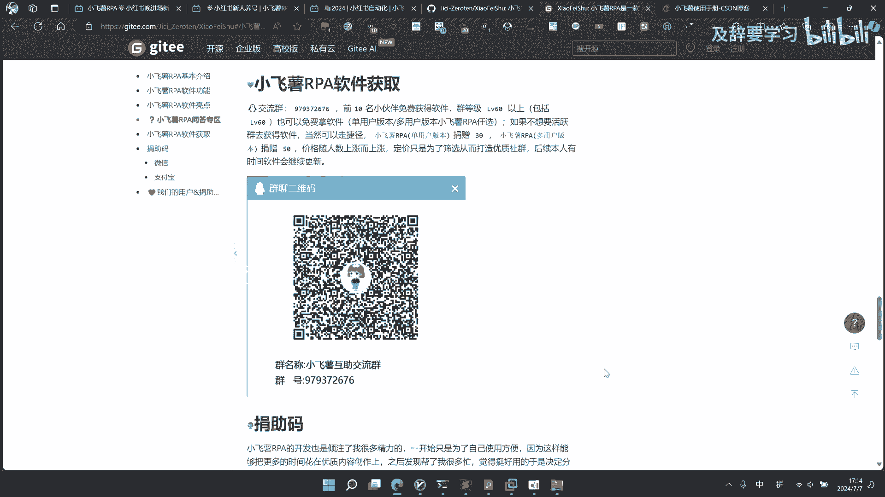

那我们来看一下啊，配置性的问题我们来看一下，好比如说你已经拿到了我们的这个许可证啊，那我们给他剪切对吧，粘贴到粘贴到这个呃文件夹里面啊，那么我们在演示这个视频的时候，我们把它放在这个桌面上对吧。

那么有些小伙伴就有疑问啊，是只能放在桌面上吗，不是的啊，因为有一些人的他的电脑呃，它桌面全都是这个工作文档或者怎么样的，或者这个桌面没有内存啦，对不对，那么我们呃就可能不能放在桌面上，这是可以的。

你可以把它移动剪切移动到任何的位置啊，只需要保证这个完整的目录结构就可以了，好吧，那么你在这里面的这个MIIN的目录啊，也就是我们的main目录下面啊，可以找到我们这个啊软件的启动啊，启动文件啊。

这样就行了，你这至于这外面这个文件夹，你可以移动到你电脑上任何一个位置，只要你能找到就可以啊，那我们建议你放在桌面上啊，一个是便于你找到啊，一个是啊也便于我们的一个演示啊，OK好。

那么怎么样就代表软件配置好了，那么你添加我们许可证之后呢，来到MIN页面啊，我们还是用这个大图标点击我们的小飞鼠，点EXE就是这个作者的小人。

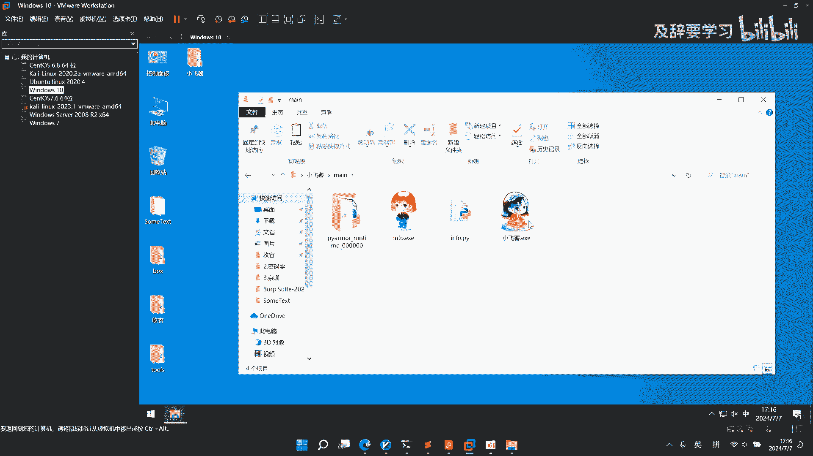

双击它，好他就会启动做第一次的配置。

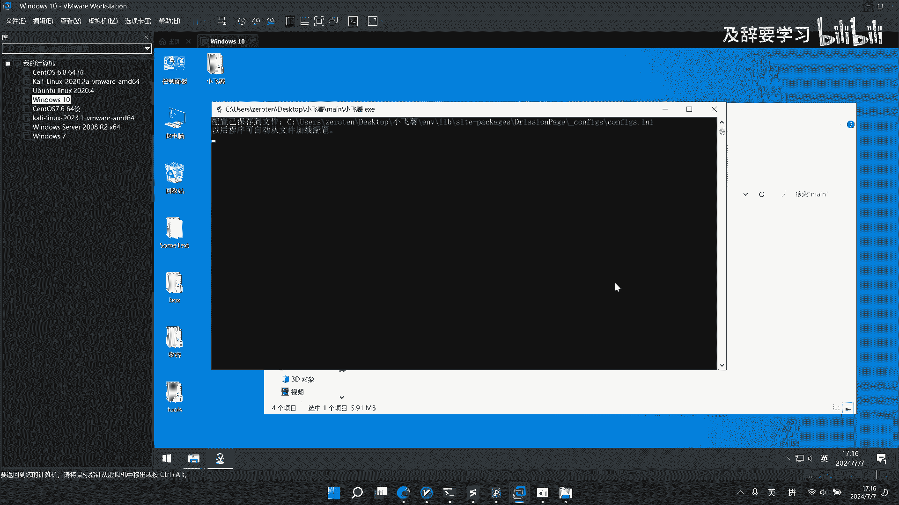

并且检查你的许可证，好如果你的它弹出了这个滑块验证对吧，这也是很多第一次启动遇到了这个的情况对吧，验证码嘛，你无论做任何的这个网站，你都是需要做一个验证码的啊，好那么他这里也有相应提示信息对吧啊。

检测到这个验证码页面，请你完成这个验证码对吧，那你我们只要完成一下就行了，好就完成这个绘制码的操作，那么你把这个验证码过了之后呢，他就会进入到这个登录的页面对吧，那就弹出一个二维码进行一个呃扫描啊。

好那么我们又会出现一条新的提示信息啊，提示你当前的网页是没有登录的啊，那么你需要做一个扫码操作啊，当然你用这个密码登录也是可以的对吧，那我们这里就用我们的呃扫码进行一个操作啊。

全程不需要你输入任何的这个凭据，不需要你敲任何的键盘，而我们扫码手机扫码，然后进行一个登录，登录之后呢就来到了这个页面啊。

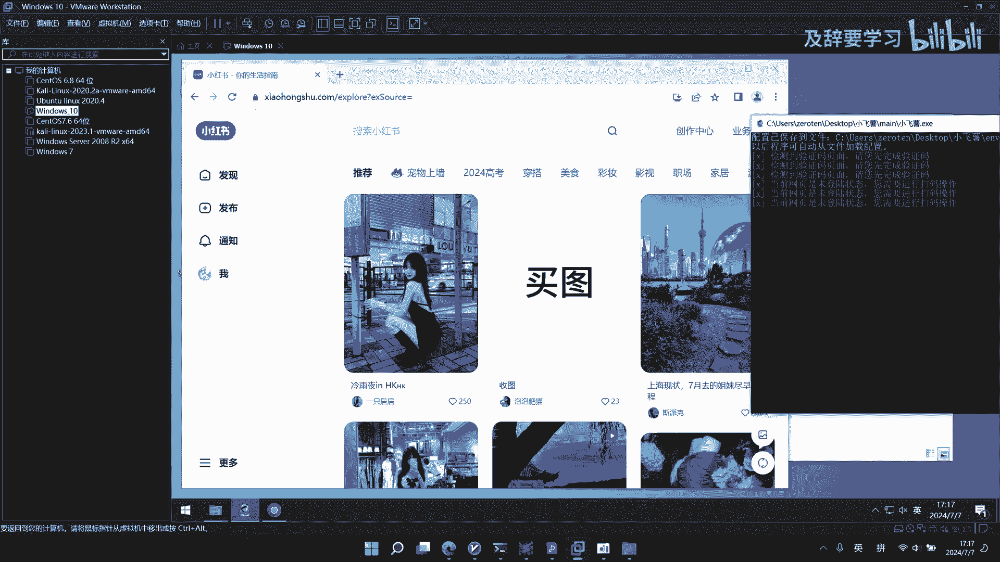

那我们把它放在旁边啊，这样子更好的来查看啊，两边啊，那么当你登录进去之后呢，他这里会检查你的这个账号的一些呃，你想做的一个内容，或者说会检查你的这个额账号的一个导向啊，好那么等到他这里扫描。

他说你的网页已经是登录状态了，即将进行下一步操作啊，那么软件已经自动化跑起来了，那么就说明你软件已经配置好了啊，好那么下一个问题呃，怎么样啊，每次运行多久比较合适好。

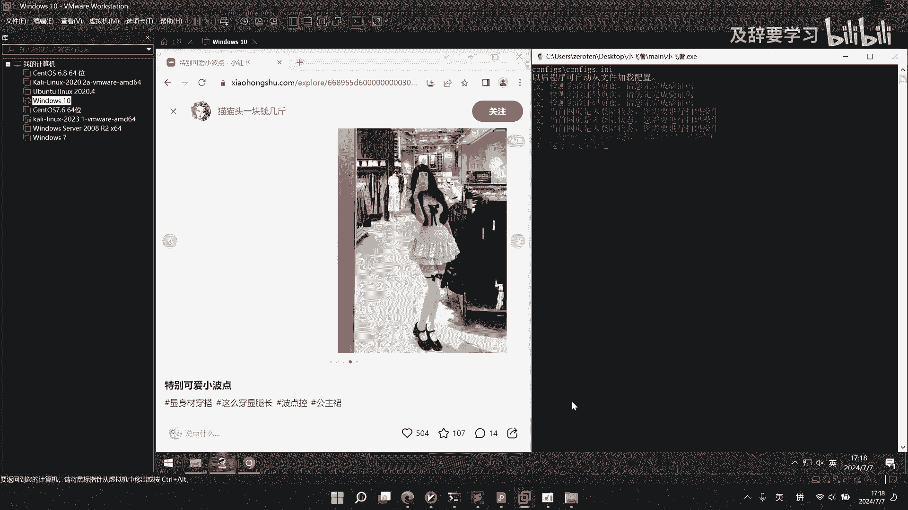

我们在手册里面啊说的很清楚啊。

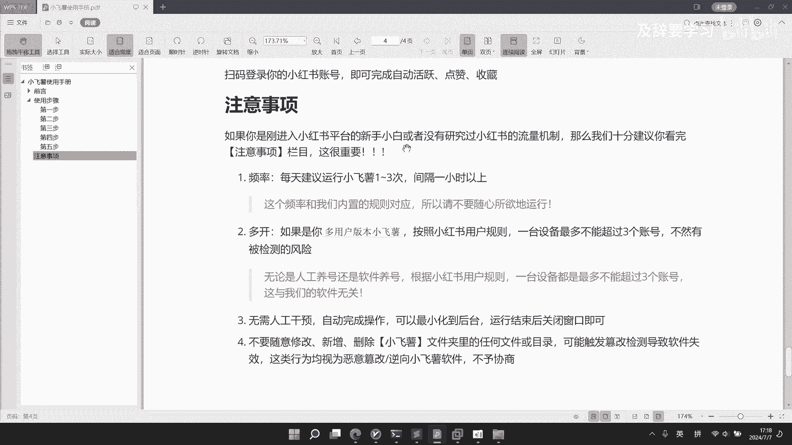

包括我们在这个网站网站上啊。

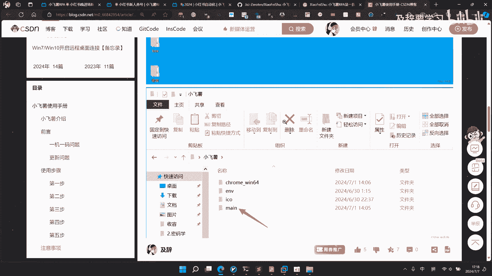

有也有在线的一个文档，说的非常清楚啊，你只需要每天运行1~3次就可以，每次间隔一小时以上啊，你只要保证这个频率就可以了啊，因为这个频率和我们内置的这个定制的，这个规则是相对应的啊。

你不需要去懂小红书的流量机制还是怎么样的，还是怎么样的一个规则啊，你只要保证这个频率，就可以和我们的规则对上啊，保证这个频率就可以正常的进行一个养号，而且是或者说是正常的符合要求的养号啊，有效养号啊。

所以请不要随心所欲的运行，比如说我今天点个十几次啊，我们这是不建议的啊，因为你这样子就没有把我们的规则呃，我们定制的这个精心定制的规则发挥出来对吧，而且你这样子也属于一个无效的一个养号啊，好。

那我这里说了，你只要保证这个频率就可以了啊，就是每次运行多久啊，那么下一个是单独一次呃的运行有没有要求啊。

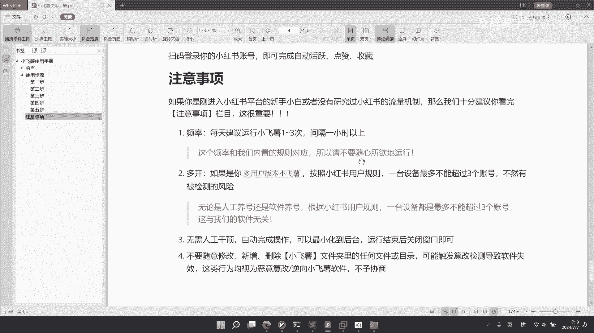

好那么回到这个页面。

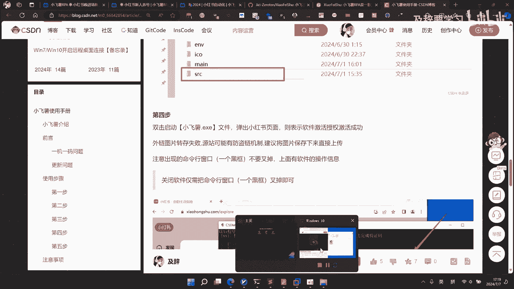

它已经是在这里正常正常跑着的，好正常跑着了之后，额他这里说了啊，单独一次要多久啊，你不需要去管单独的一次要多久，比如说你这个呃网页这个位置。

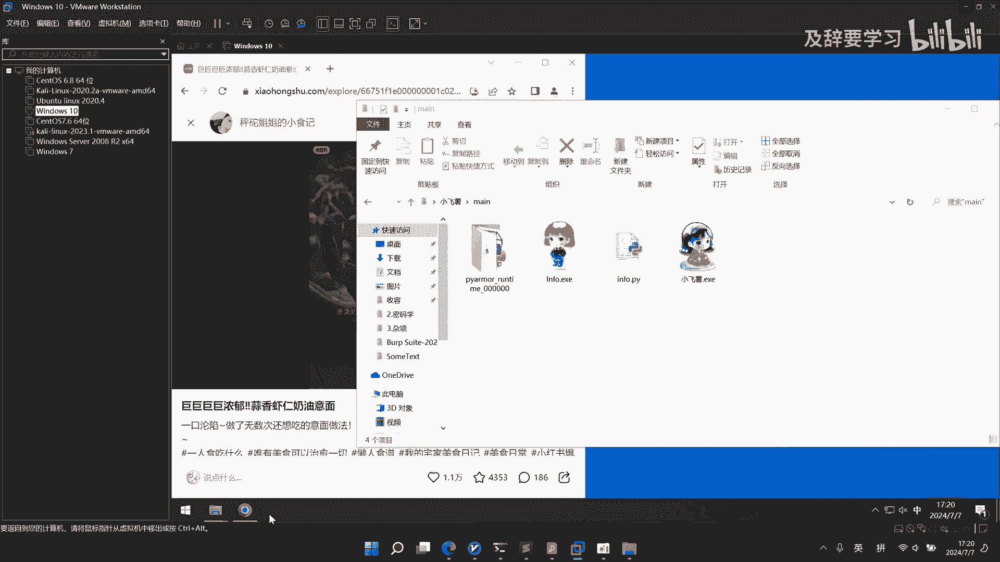

我们的这个黑框像刚刚的一个，我们在呃，我们网页的右侧，有一个黑色的这个提示信息的一个窗口，那么它已经关掉了啊，只留下了我们内置的这个浏览器的。

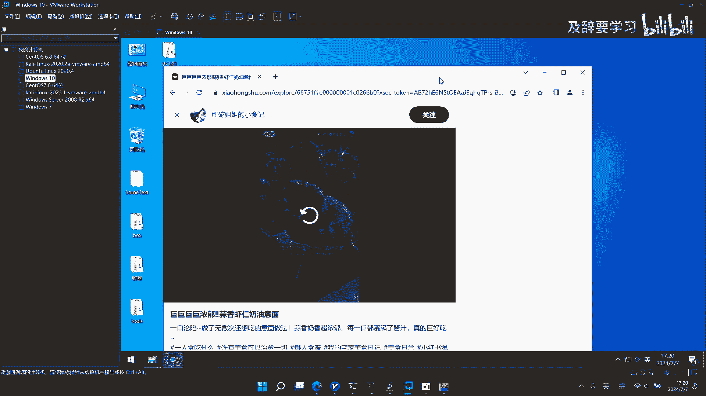

一个窗口对吧，那么就说明你单次运行结束了啊，那么你可以把这个窗口最小化，或者把这个窗口直接叉掉啊，都是可以的啊，都是可以的啊，那么你只要保证啊一个小时之后啊，比如说我一个小时到了。

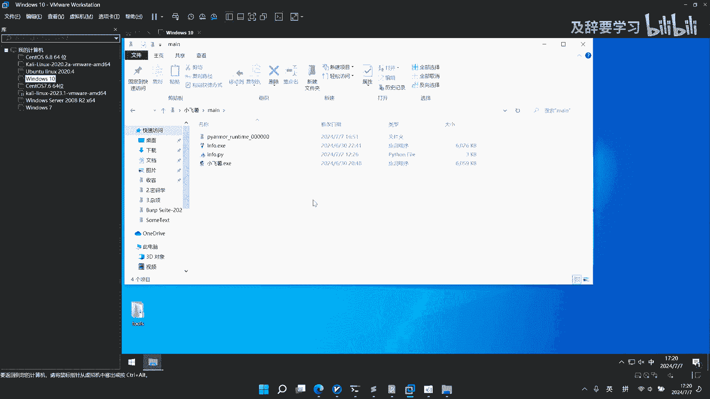

那我们重新点击它啊，重新点击它啊。

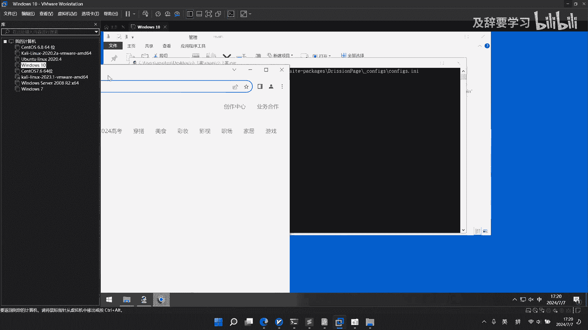

那我们因为刚刚已经扫过码了对吧，所以我们不需要再做任何扫码操作了啊，你点击它之后呢，他又会重新的一个啊运行啊，进行一个第二次的一个运行啊，好这就是单次运行的时间没有要求，我们软件已经设置好了。

你只需要呃点击运行。

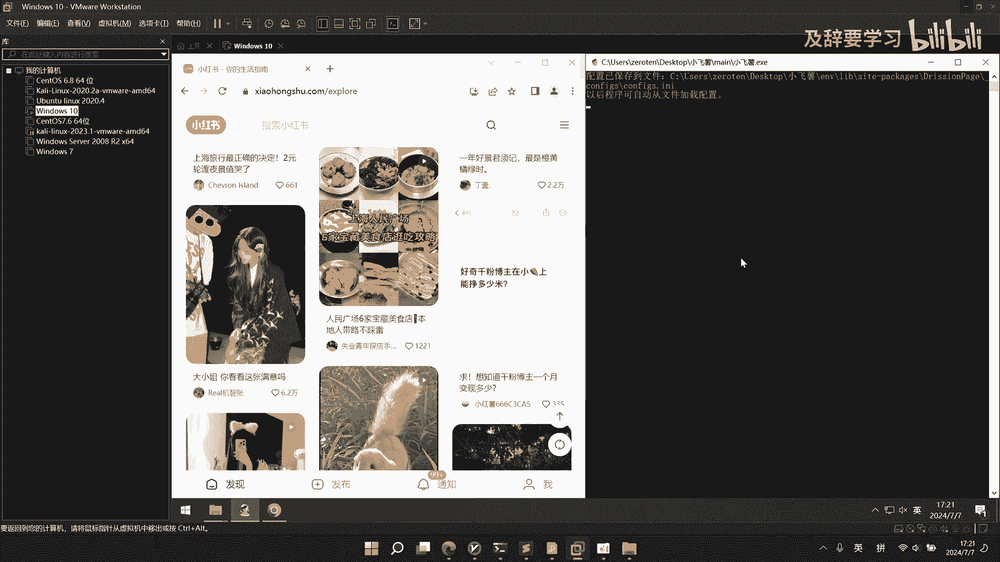

控制它的频率就可以了，控制这个一天1~3次，一次间隔一小时以上的频率就可以啊。

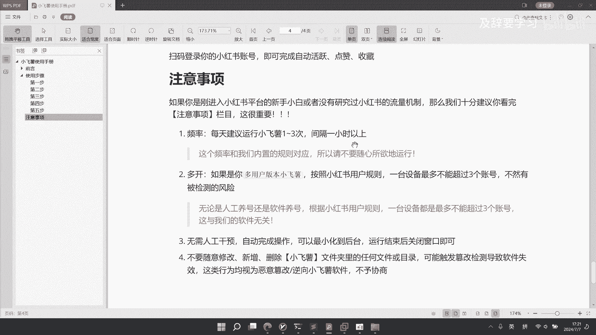

啊这个给大家讲清楚好呃，下一个感觉刷的是一些我不专业，我不是我专业范围内容的内容啊，比如说这个人他是想做这个呃服装的啊，但是你他在这里刷的这些内容啊，不是服装的，比如说是一些啊拍照的。

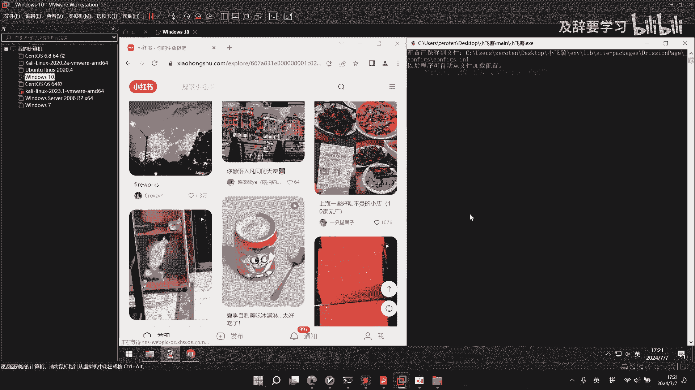

比如说是一些啊这些化妆品的啊。

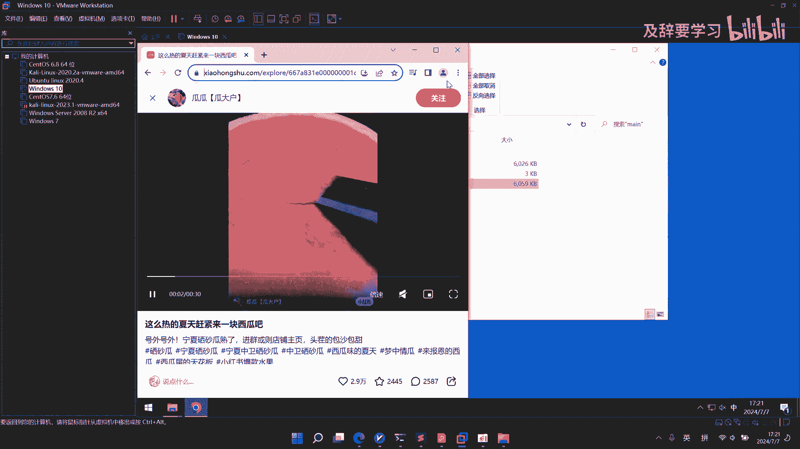

化妆品的啊。

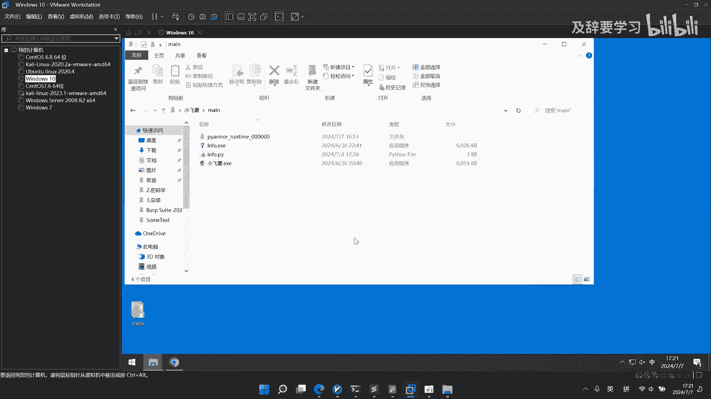

那么我们这里给大家关掉先啊，那么这属于你你的一个养号的一个呃问题啊，就是说你的平台刚开始起号就没有起号好，就比如说你要专门做这个啊服装类的内容，那么你应该要，经常性或者频繁的。

按照我们的这个小红书的这个流量机制来说，你应该频繁性的去呃访问这个服装类的内容到，然后我们账我们的这个软件检测啊，到你的这个呃，检测到你的这个常看的内容之后呢，就会去来刷你专业内容的一些。

就是你想做的这个呃方向的一些内容啊，这样子就可以呃增加我们账号的权重，以及提升我们在呃这这一个呃区，比如说我们呃化化妆区，或者说服装区的一些账号的权重啊，达到我们针对这个区来养号的一个目的啊。

这是属于起号的一种，我们的软件只能帮你做自动化操作啊，起号是你要自己确定好你自己做什么方向啊，来做的好，下一个是电脑和手机不冲突吗，啊电脑和手机是不冲突的，但是我们不建议你两边同时操作啊。

因为根据小红书的这个呃规则啊，你两边操作啊，它就可能会出现一些检测性的问题啊，就像你相当于异地登录一样，所以我们不建议你呃，电脑上正在这边跑的小红书啊，然后你自己手机上啊，还是啊在那里手动的刷着小红书。

我们这是不建议的，好额目前我们说的就是这些内容啊，那么呃针对所有的一个介绍流程，我们详细的解介绍了一遍啊，希望大家能够更加的了解我们的一个程序啊，也减少了大家呃，对我们一些重复问题的一些提问啊。

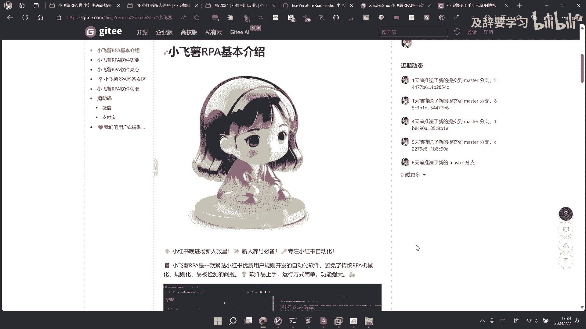