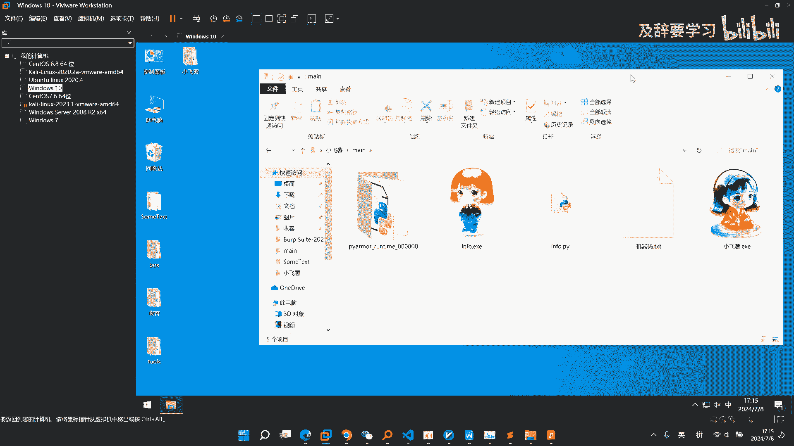

# 2024小红书自动化工具 ｜ 小飞薯RPA如何更新许可 - P1 - 及辞要学习 - BV1yghZegEta

那么这个视频讲一下小飞鼠RPA怎么进行，软件更新，在我们的这个使用手册里面，写的已经非常清楚了啊，还是带着大家呃来实际操作一遍，呃我们默认会发送到你的这个QQ邮箱里面啊，如果你是使用其他邮箱的话。

那么一开始要告知呃，当软件发布更新的时候啊，会收到如下的一封邮件啊，你可以访问这个QQ邮箱的网址，或者你电脑有登录了你当前使用的这个QQ，或者你手机有这个我们QQ邮箱的app，都是能收到邮件通知的啊。

QQ邮箱在我们国内还是非常非常普及的啊，会收到这么一封邮箱，那么你点击邮箱之后呢，呃就可以收到一个附件，那么你下载这个附件，点击下载，它是一个压缩包，里面就是你的更新许可解压出来啊。

然后呢直接替换就可以了，那么下面带着大家来演示一下，比如说你已经从邮箱里面下载了，我们的这个附件，那么你给它解压出来，解压出来之后呢，来到我们的这个小飞鼠的目录下面啊，你直接选择它剪切到这个位置。

然后粘贴它会提示你是否要替换啊，手册里面说的很清楚，选择替换啊，选择替换，点击这个确定要替换好，替换完成之后呢，他就被加载进去了啊，那么我们这个压缩包也就没什么用了，我给它删掉。

让我们进到MIN下面去运行一下我们的软件。

那么每次更新我们都会设计一个新的一个logo啊，那么这一次以这个火箭为例啊，那么logo的变更就说明你这个软件更新成功了啊，以及你这个程序能正常的打开啊。

然后你扫码之后能进行一个自动化操作。

就说明我们的这个程序已经更新完成了啊，那么我们每次发布这个更新。

我们每次发布更新都是要么是规则的变化，要么就是一些额免检测，或者是一些非常呃重大的bug啊，都是很重要的更新，不是说像手机应用一样，你不痛不痒的不更新也可以用，非常非常建议你更新到我们的最新版本。

因为这是这是跟进这个小红书平台规则，的一个呃更新啊，而不是我们随便发布的，所以当你收到这个更新邮箱的时候，一定要尽快的去完成我们软件的一个更新啊，避免后续给你的这个账号，或者是给你的这个平台带来麻烦。

我们的更新不是随便发布的，这里再次强调一下，一定要更新到最新的版本啊，以适应小红书的最新规则啊。

