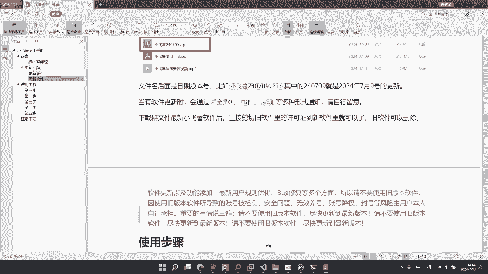
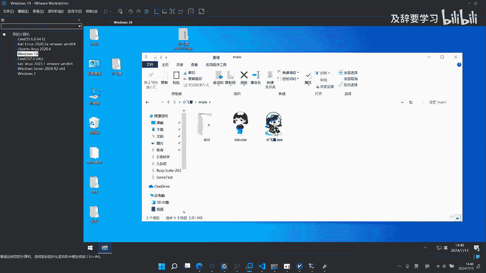
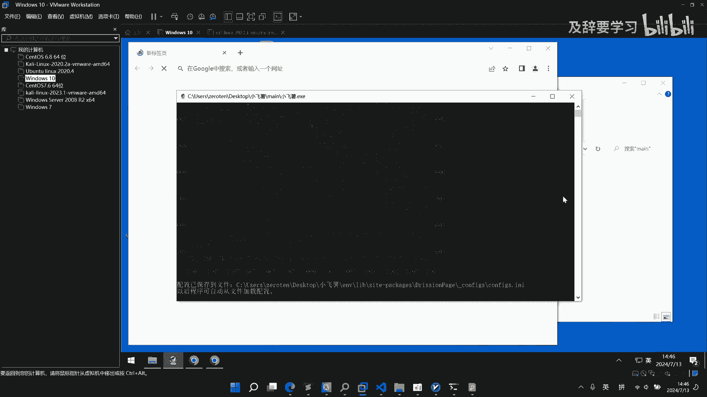
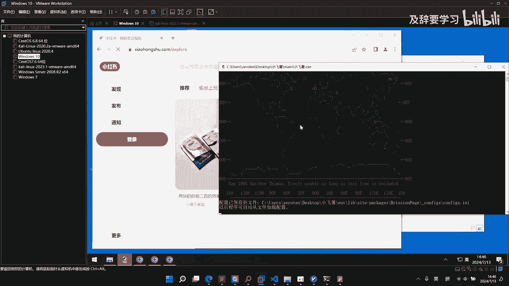
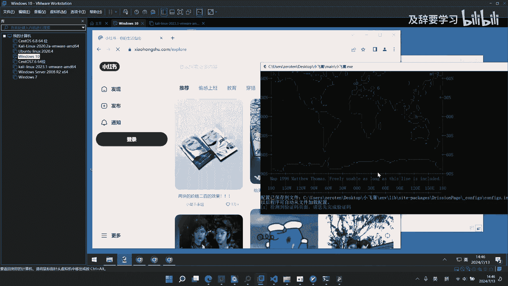

# 2024小红书自动化运营工具 ｜ 小飞薯RPA如何更新软件 - P1 - 及辞要学习 - BV1xibNeREwt

好那么讲完了更新许可，那下面讲一下怎么更新，软件手册里面呢也写的非常清楚了，呃，在每一个小飞鼠优质用户QQ群的群文件里面呢，都会有最新的小飞鼠软件啊，那么它的命名呢都是以呃小飞鼠后面跟上日期。

版本号来命名的，比如240709就是24年7月9号的更新，那么在群文件里面的小飞鼠呢，它都是最新版本的啊，那比如说你之前下载的是这个七呃，7月9号的更新，那么呃当你查看群文件的时候啊。

他可能是呃有更新的更新了，那你就把它下载下来就可以了啊，当然了通在这个软件有更新的时候呢，会通过群成员艾特或者是邮件啊，或者是私聊这种多种形式进行一个通知啊，但是您要自行的一个留意啊。

然后呃这个更新方法呢也非常的简单啊，就是直接把我们的最新版，小飞鼠软件下载下来之后啊，剪切旧软件里面的许可证，到新软件里面就可以了啊，那么这里要说一下啊，软件更新是涉及到啊功能添加。

用户规则优化和bug修复等多个方面的啊，请不要使用旧版本的软件啊，我们在手册里面已经说的非常清楚了。

好那么下面就来演示一下怎么更新啊，比如说这个是一个7月9号的一个小飞鼠版本，那么在24年的7月13号啊，就是一个新的版本，那我们给他先解压出来啊，这个文件你可以在小飞鼠，优质用户群的群文件里面下载到啊。

可以下载到我们的最新版本软件好，我们先将它解压出来，好解压出来之后呢，就是这么一个文件夹还是一样的，那么我们来到旧版本软件的这个文件夹里面啊，把我们的许可证给他剪切，剪切完之后呢。

来到我们的新版本的小飞鼠软件里面，进行一个粘贴，粘贴上之后呢，啊这个旧版本的小飞鼠啊就可以删除了，好他删除之后呢，我们还是在MIN上面，可以找到我们的软件进行一个启动。

那么当软件能够正常启动啊，出现我们的一个新版本的logo啊，并且弹出了这个登录窗口的时候啊。

那说明你的软件已经更新完成了啊。

