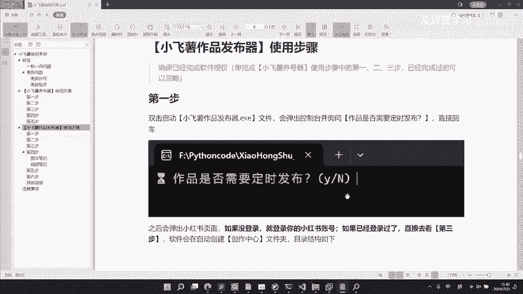
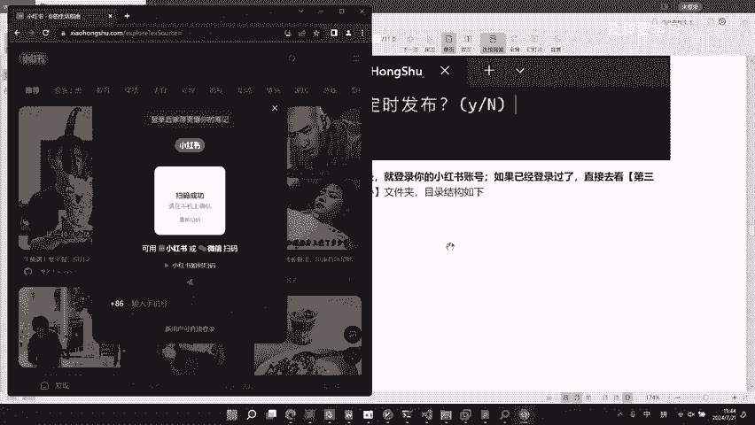

# 2024小红书自动化运营工具 ｜ 小飞薯作品发布器详解 - P1 - 及辞要学习 - BV1EL8mePEVb

好，那么这个视频来给大家讲一下小飞鼠作品发布器的使用啊，同样是需要更新我们的软件至最新版本。那么更新软件的方法手册里面已经写的非常详细了，我们也制作了配套的。

视频在我们小飞鼠RP的合集里面就可以进行查看了啊，更新方法也非常简单，就是在你所在的那个小飞鼠优质用户QQ群的群文件里面，就有我们最新版的小飞鼠软件了。那么更新方法。手册里面已经说的非常清楚了啊。

那么刚刚也提到我们有相应的这个视频啊，如果不清楚的，可以进行一个查看。那么我们下面直接进入我们的正题。就是小飞鼠作品发布器的一个使用。

那么当你。更新完我们的软件之后呢，在MAIN页面下面就有。呃，一个名为小飞鼠作品发布器的一个软件啊。

好，那么在使用小飞鼠作品发布器的时候呢啊你需要确保你已经完成了这个软件授权啊。那么老用户啊已经是完成过这个软件授权了，也就是我们小飞鼠养号器的123步123步。如果你是新用户的话呢。

你就需要完成一下这个软件的一个授权啊。如果老用户已经完成过的，就可以忽略了啊好。

那么我们下面开始讲第一步。

第一步。双击启动小飞鼠作品发布器啊，会弹出控制台，并且询问作品是否要定时发布啊，直接回车啊。

好，那么我们现在演示一下。好，弹出这个询问对吧？我们先不用管，直接回车。

好。之后会弹出这个小红书的一个页面，对吧？如果没有登录，就登录你的小红书账号。如果已经登录过了呢，就直接去看我们的第三步啊。那么我们这是带着大家一步一步演示，我们就是做一个没登录的一个演示啊。

那么这里遇到一个验证码，那不用说啊，给大家过一下。

好，那么弹出了一个登录的一个扫码，那么我们没登录，对吧？那就登录我们的小红书账号。

。打开手机。学锁嘛。

好，扫码登录。那么。登录成功之后呢，你会发现我们这个程序啊已经退出来了。

啊，那么它就会在我们的这个小飞鼠文件夹上面呢创建一个名为创作中心的一个文件夹啊，我们可以看一下。那么在我们小飞鼠的这个呃文件夹下面就会多了一个创作中心的一个文件夹。

好，那么第二步同样是双击启动这个小飞鼠作品发布器啊，同样是弹出这个是否需要定时发布的时候，也是先不用管，直接回车。那么这时候这个软件就会检测你的这个账号，并且在创作中心。

也就是刚刚这个文件夹下面现在是空的嘛，因为还没有检测账号。

创建一个以账号名称命名的这个文件夹啊。

那么我们现在来运行一下。

啊，弹出页面离撤。

啊，回车之后呢，它这个软件它就会。

退掉啊，同样是会自己退掉。那么检它就是在检测完我们的软件。和你的账号信息，然后会在下面出现一个。以这个用户名啊命名的一个这个文件夹。

好，我们这是一样的。那么在以这个账号命名的这个文件夹下面呢，就会有一个已提交的这个。

作品。那我们进去看一下，对吧？下面就有一个已提交的作品，那么它当然也是空的，因为目前还没有提交过任何作品。

那么这个已提交作品，这个文件夹会收录你提交过的作品啊，并以这个提交时间点命名。这个后面会详细讲到啊。好，那么我们就直接进行第三步。

来到这个文件夹下面啊。直接给它新建一个文件夹，命名呢就叫作品。一。

命名格式为作品NN是数字啊，一一直到多少10001万都是可以的啊。那么我们正常就按照这个顺序1234这样子进行一个命名。好，那就类似于这样。那么做这个以这个作品一为例啊。

那么我们进入到这个作品一的文件夹下面啊。

新建。一个文本文件。啊，取名为toto。也就是我们的标题，对吧？对吧取名为我们的toto，以及我们的body。Okay。好，新建这两个文件来我们这里盯一下。

啊，新建这两个文件，那么就和这个是一样的对吧？那这样子就可以了。

第三步就完成了。那么。进入到我们的第四步。好。大家都知道啊，这个小红书平台它是分为两种笔记类型，一种是图文笔记啊，还有一种是什么视频笔记，对吧？那么你只要在这个作品。

下面放上你要展示的这个图像资源就行了。如果你是这个图文笔记，那么你就在下面放入这个图片，对吧？那么你要是小红书支持的图片啊，比如说我们的PNG啊，JPG图片，对吧？那么最多是可以放18张。

这个是小红书规定的啊，大家可以详见这个小红书的用户手册里面可以看得到啊。如果你是这个视频笔记呢，那么你就只要在这个作品下面啊放一个视频就行了啊，放一个视频就行了。那么。

视频支持的格式呢就是MP4MOVFLV这些啊，那也是小红书规定的嗯。

好，那么视频还有一个功能就是可以支持修改封面。因为嗯大家如果是参与过运营，或者是正在从业的运营人员，也知道我们直接发布的一些视频。那么我们可能需要呃在PS啊，或者是在其他的一些软件上面制作一个封面啊。

然后将这个封面啊，用来嗯当做我们视频的这个呃更直观一点啊，让这个用户增加这个用户的浏览量，对吧？这个相信。对于这个职业运营的这个小伙伴们，应该是轻车熟路的。那么如果你有这个。呃，需要制作封面的需求。

那么你就只要把你制作好的封面。啊，直接放到这个作品的这个文件夹下面啊，同样也是直接把封面放在这个位置。就可以了。那么这个封面图呢，那么你就要命名为封面啊，那么它的后缀呢同样也就是正常的这个图片后缀。

比如说PNGJPG这些啊。如果你没有这个封面的这个需求，那么也不影响不要这张图和上面这样一样，就直接放一个视频。那么你按照小红说的这个提交来说，它就会按照你这个视频的第一帧作为封面，对吧？

也是不影响的这一点只是主要是照顾到呃，根据我们的这个嗯。

实际项目呃对接的时候，很多职业运营的这些人士啊，他是需要做这个定制封面的一些需求的啊，所以我们就添加这个功能。如果你是不需要这个呃添加封面的话，那么。

呃，你就可以直接放一个视频就可以了。好吧。好，那么这是第四步。

好，那么第五步嗯。就是在total。文件里面写笔记的标题，bodyy文件里面呢写笔记的主体。那么bodyy是支持这个小红书的语法的。比如说标签井号和这个用户at的啊。好，那么我们来到这个演示。

我这里已经做好了两个相应的这个演示。那么我给他。

呃，直接复制过来。好。那么我们这个作品给它删掉就好。这个刚刚做演示的，那么这里也做一个呃做一个这个小技巧，对吧？那比如说你这里已经写好了，那你比如说你要做这个作品二的时候，你是不是要这样子去输入啊？

作品二对吧？那你又要按照呃刚刚所说的新建一个total，新建一个包底啊，对吧？那这里。因为大家都是这个从业人员，大家应该也知道，直接我们直接做好了一个啊，那么以它作为一个模板。

我们就直接给它这样子复制一下，对吧？那么每一个下面。都有这个的文件，就不要我们一个个文件夹去新建了，对吧？那么我们要做的只是把这个进行一个命名。比如说二啊。三啊这样的一个命名就可以了，对吧？

也是一个小技巧，复制粘贴嘛。好，那么我们不把这些我们给它删除掉。啊刚刚。刚刚从这个我们已经准备好了这个演示的这个作提交要提交的作品啊，给它复制过来啊，对吧？同样还是以这个作品一作品二进行一个命名啊。

那么作品一呢？是一个视频啊，它是带封面的啊。那么作品二呢是一个图文笔记啊，它只是一张图片，然后呃。加上一个这个total和 body啊都是一样的。好，这就是我们刚刚给大家说到的。

好，那么这里就带着大家给大家看一下这个第五步啊，就是total和body里面。

是写这个主体啊，那么body底支持这个小奥数语法是什么意思？

好。那么进入这个作品啊，那你用你的这个文本编辑器，什么是文本编辑器？就是比如说我们windows自带的记事本，或者你自己安装。比如说我自己就安装了一个。这个叫做sub test的一个文本编辑器。

都是可以用来查看这个TXT文本的。当然你用记事本也可以，对吧？呃，大家按需选择就行。那么我们先看totototo呢它写的是这个笔记的标题，那么。

就类似于这样子写啊，就是比如说视频笔记提交演示好，就这样子写的就行了。那么你需要有一些emo表情也可以打上去啊。然后呢，再看这个body，body里面呢。是我们笔记的一个主体。

那么笔记的主体就是写一些描述性的内容啊。比如说我们在这个随便浏览一篇。

好。那比如说这篇笔记对吧这个。雨天蓝色情绪碎片，那么这个就是它的total。对吧那么降降温包括这下面的一堆啊，就是它的 body，对吧？这个也相信大家应该是很明白了啊。

比如说你toal就会展示到这个位置，对吧？toal就会展示到这个位置。那么bodyy呢就是要点进页面之后，这一这一大串都是我们的body底，就是我们的笔记内容啊，那么其实就就是把。

这个。标题填写到这个total。文件里面啊，那么你要。填写了这个笔记内容啊，填写到我们这个呃bodyy里面就可以了。那么这里还说到，那么bodyy是支持小红书语法的，什么是支持小红书语法啊？

那么比如说找还是找一个这个对吧？

你会看到它这里有一些label，就是我们的标签，对吧？比如说你是打哪一个分区，比如说你是打艺术区，那就是要插画情绪啊，来似于这样子。那么这是不是一个标签，那么标签它的格式，小红书语法的格式是什么？

都是一个井号后面跟上我们的这个标签，比如井号、笔基灵感井号插画井号情绪这样子，对吧？那么你同样是在这个。

bodying里面就可以这样子。去写。那么。我们的软件就会把它识别成你是小红书的标签。那么你就只需要和这个。正常来说的提交是一样的啊，是支持小红书语法的。直接是井号，加上一个标签名，井号。

加上一个标签名，那么它就会作为一个标签输入到我们的作品里面去。OK好，那么还有一个是用户艾特，比如说你要艾特谁观看，对吧？那比如说像。

啊，这位小红书博主，他就是要艾特这个艺术鼠那你同样的。

你这里直接是艾特谁艺术署对吧？就可以了。那么你要艾特其他人，对吧？你就艾特叉叉叉吧怎么这样子。啊，那比如说你要艾特第三个人，那就。这样子就可以了，对吧？那么同样是一样的，其实是一样的啊。

只是我们这里要讲的比较细致一点啊，因为照顾到一些呃老的运营或者是呃没有接触过这些自动化软件的这些运营啊，和小红书是完全一致的啊，我们这个程序和小红书的语法是完全一致的啊。那么我们就按照这样去写。

那么这个第五步给大家讲的应该是讲清楚了啊。

好。那么我们制作好之后呢，那么我们就第二第六步就是进行我们的一个发布，就是真正的进行一个发布了。那么。

我们下面就进行一个发布，我们已经准备好了这些内容，那么回到我们的。这个。看安的。

这个小飞鼠作品发布器的这个位置给大家双击。

好，那么它会弹出是否需要定时发布啊，那么你不要定时发布呢，你就直接回车就行了。如果你要呢，就输入一个Y，对吧？

那么。如果你是不要定时发布，就直接回车啊。如果你是需要定时发布呢，你就输入一个Y啊。那么为了给大家演示的全面点，我们就输入一个Y。因为定时发布，你如果是做运营的，大家。

懂的都懂，我们需要在一个时间段啊去打那个时间段的流量，对吧？所以呃就需要定时发布的功能。比如说呃11点半甚至是凌晨，对吧？那么大家肯定是嗯。就是没有这个呃时间点会是熬夜。

那么你就直接交给我们的作品发布器就可以使用了。那么这个定时功能呢也是嗯相信大家运营经常使用到的一个功能啊，那么自己业内人士大家懂得都懂啊，就是打那个时期的一个流量好，那么我们输入Y之后呢。

它就会提示我们输入发布的一个时间点。时间点呢是24小时制的对吧？那你。

比如说你21点20，那就是晚上的9点20，对吧？那如果你是9点20，那就是早上的9点20啊，那就24小时制对吧？那你这里比如说我们就输入一个。

21点20，那么这里也说到了这个冒号啊，对吧？这个冒号啊它是英文状态下的冒号，对吧？那你不要输入成是中文的冒号了啊，那么这里注意一下，那么没什么问题，输入这个时间点之后呢，进行一个回车。

好，那么回车之后呢。就会。自动的。填写我们的这个作品啊。这里等待点写一下。嗯。好，那么也替换了我们的这个封面，对吧？那么。他就会填写标题，从我们的这个total文件里面去填写。啊。然后呢。

去填写我们的bodyy，就是从我们的bodyy文件里面去填写，并且支持小红书的标签啊。那么我们刚刚的这个标签对吧？也已经。输入上去。并且呢它的颜色啊已经是不一样的，说明这个不是一个文本，而是一个标签啊。

那么语法是。

对应上。好，那么因为我们刚刚选择的。

是这个。要定时发布，所以他会告诉我们啊，这个定时任务已经部署啊，那么。

你这时候就可以最小化控制台，对吧？直接最小化做你该做的事情去。那么他到点之后，他就会。

定时发布了。那么你这也不需要管，就给它放到最小化就可以了。好，如果你选择的是不要定时发布呢，那么它会直接提示啊。内容填充完毕，然后呢请您仔细核对。那么比如说你需要进行一个核对的，比如说你可能。

进行一个核对，可能需要添加一些什么内容，对吧？那么你自己进行一个添加，然后你可能嗯还需要看一下这个效果如何如何，对吧？

那么你可能需要做一个最后的一个检查，对吧？那么你可以做一下最后的一个核对，那么没有问题，对吧？所以就可以直接回车。那么出现这个页面之后呢，直接回车就提交上去了啊。

好，那么这就是我们这个小飞鼠作品提交器的一个使用啊，那么先把这个关了。

然后后面呢还有几点说明。

好，我们回到这个。

作品页面啊。那么讲一下这个其他的一个说明。那么如果说用户已经提交过的这个文件夹。或者是提交过作品啊，就会存放在这个。

已提交作品的这个文件夹下面。

那他是会以这个时间点进行一个命名的，方便你日后进行一些查看。比如说你要打某一个的标签。那一天的流量是比较好的，那一天数据是比较好的。那么你可以进行一个复刻，或者是进行一个呃总结，对吧？

可以在我们这个已提交作品文件夹里面进行一个查看，查看以往的这个作品。好，这是第一点。第二点呢是以账号名称命名的这个作品中啊，如果说你这个下面啊是没有作品的啊，如果这下面是没有作品的话啊，那么就不会发布。

对吧？所以你可以制作这个大量的作品，比如说你日常的这个工作旅游工作区，对吧？那你就可以在这下面。

制作一个作品，然后呢填写这个。标题以及笔记内容。那么你要做封面，那么你把封面在PS啊，或者是在这个制作的这个软件里面给它做好图之后呢，给它粘贴到这里去啊，那么把你要上传这个视频也粘贴到这里去啊。

这个图文也是一样的道理，你就可以制作大量这个作品文件夹啊，做完之后呢，比如说你要做下一个，对吧？那你又新建一个。

作品3对吧？所以然后在下面再进行作品，就可以制作大量的作品放在我们的这个呃用户的这个文件夹下面啊，那么它就可以进行一个定时的一个发布，或者是进行一个嗯就是不会让你的作品呃中断啊。

这样子就可以搭配我们的一个工作流进行一个使用。好，以上就是我们全部的这个小飞鼠作品发布器的一个使用啊。

