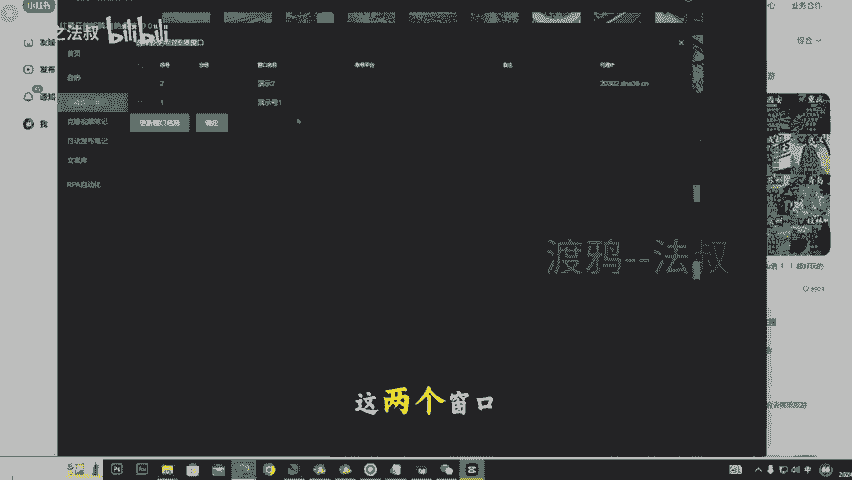

# 2024年10月最新小红书矩阵克隆系统 一人操作100+账号 小红书引流获客必备工具 轻松克隆爆款笔记分发系统 私域运营必备工具 全自动克隆分发软件 - P1 - 渡鸦之法叔 - BV17LyKYAEWJ

🎼最新的小红书AI矩阵克隆获克系统10。0版本在开始之前先给你们看一下效果。

可以看到这个是做宠物赛道的。🎼年金10万多。🎼这是做奢侈比赛道的，引睛36万多，效果非常的好，非常的猛。还有这个做APP拉新的眼睛18000多，可以看到这个效果是非常好的。因为我们克隆的是爆款笔记。

爆款笔记爆货之后，它还是会再爆的。它爆的概率是非常高的。下面我们看一下它的原理，通过一键克隆我们的爆款笔记，再进行一键改写，进行委员创，然后进行矩阵发布，它的优点是什么？全行业可用。

不管你是打创业粉旅游粉还是大健康粉，小果粉宠物粉等等。全行业都可以用，可以一键获取最新热门笔记的标题内容和图片，内置AI模型，一键改写进行委员创，可以一键克隆爆款视频。第五次对接指纹浏览器。

每一篇的笔记IP都是独立的。第六，支持多线程操作。一次性克隆分发100个账号都是没问题的。第七，可以自定义修改我们的封面，文案标题话题可以自由组合进行矩阵发布。第八，加入了采集系统联合使用。

🎼下面看一下我们的系统。🎼大家在使用之前一定要仔细看一下免责声明，使用的时候一定要规范使用。下面看一下第一个功能，克隆图片笔记。

🎼在比特浏览器这边，我们点击创建窗口。🎼这里可以输入我们的窗口名称。🎼然后一键随机指纹。🎼然后配置一下我们的代理ID。🎼然后把我们准备好的群庆IP复制进来。🎼点这里可以检测一下。

🎼可以看到我们这个IP是没有问题的，然后点击确定。🎼然后点击打开。

🎼我们可以返回看一下我们的IP。🎼可以看到这2个IP都是不一样的，每个窗口独立IP。然后我们把小红书创作者服务中心的链接复制一下。

🎼然后回到我们刚才的窗口。🎼把它粘贴进来。

🎼然后登录一下。🎼登录好之后，这个窗口就可以删掉了。🎼然后回到我们的克隆系统，找到我们要克隆的作品链接，我们去小红书首页找。🎼这边随便找一个笔记，也是，比如说旅游赛道的。🎼你如这个。

🎼把上面的链接复制下来。🎼打开我们的客隆系统。🎼把链接粘贴进来，一键获取。🎼可以看到很快，这些内容就获取下来了。这里可以选择我们的AI模型。🎼这些AI模型都是经过调试的，专注于小红书的爆款标题爆款文案。

🎼点击AI改写。🎼文章内容AI改写。🎼可以看到这个改写速度是非常快的。🎼然后我们点击一下交换内容。🎼这里可以设置发布地点，有的兄弟是想打同城笔记的，就可以在这里设置地点，然后需要定时发布的。

可以在这里输入时间，然后选择浏览器窗口，更新窗口信息。这两个窗口就对应我们比特浏览器的窗口。

🎼这边这两个窗口，然后我们选择需要发布笔记的窗口，点击确定。🎼这里的智能模式可以给我们的图片加水印。🎼比如加上我们的名字，这个也可以起到一个去虫的效果。🎼选择MD5模式，然后点击开始发布。

🎼可以看到已经在上传图片。🎼开始编辑文案。🎼服务标签。🎼可以看到已经发布完成了。🎼这个就是我们刚才发的笔记。

🎼然后我们看下一个功能，克隆视频笔记，找到我们想要克隆视频的链接。🎼这边随便找一个视频。🎼你叫这。🎼我们复制这个链接。🎼张贴镜。🎼一键获取。🎼可以看到内容已经获取出来，视频已经保存在这个路径底下了。

我们可以去看一下。🎼这个就是我们刚才的视频。🎼这些是我们刚才获取的一个图片，也都保存在这里了。🎼然后这些文章标题文章内容，我们可以进行一个修改。🎼然后选择浏览器窗口。🎼选择MD5模式。

可以对我们的视频进行1个MD5值修改。🎼点击开始发布。

🎼可以看到已经在上传视频了。🎼天机完蛋。🎼已经发布成功了。🎼可以看到这个就是我们刚才发的视频，这个刚才发的图文笔记已经28个小眼睛了，然后看到我们的自动发布笔记功能。首先我们要添加我们的文案库。

这里添加标题。

🎼添加图片。🎼添加文章内容。🎼添张标签。🎼我这里已经添加有内容了，我就不给你们演示了，然后点击自动发布笔记。🎼选择标题。🎼我这边就随便选择几个。

🎼选择图片。🎼选择内容。

🎼选择标签。🎼选择要发布的浏览器，我们可以选择多个账号，选择多个账号，做多个账号同时发布。

🎼点击确定选择随机组合，就是标题图片、内容、标签进行一个随机的组合，组合出多少篇笔记，它就发布多少篇笔记。🎼点击开始发布。

🎼可以看到两个窗口已经开始发布笔记了。🎼第一篇笔记已经发布成功了，现在发布第二篇，它组合出多少篇笔记，就发布多少篇笔记。🎼我这边就不一一演示了。

🎼然后看到我们的RRP自动化采集，首先设置我们的文章关键词。🎼比如说兼职。🎼这里可以进行一个筛选，比如文章日期、文章点赞数。🎼文章评论数。🎼为了方便，也示这些我就不填了。🎼然后点击开始采集。

🎼登录一下我们的账号。🎼可以看到，很快就采集出文章了。🎼方便演示，我就采集这么多。🎼这个文章我们可以进行一个导出。🎼点击这里。🎼这个就是我们导出之后的一个文件夹，可以看到这些作品链接，作品标题。

🎼文章内容、文章标签。🎼还有图片都采集下来了，图片都保存在这个文件底下了，然后看一下文章的评论采集。首先要选择我们要采集的文章。🎼我这边就穿爽。🎼拿到设置关键字。🎼比如说球带。🎼怎么做等等？

只要带有这两个关键字的评论，就可以被我们采集出来。

🎼这个评论时间。🎼440分钟，就是一天，就是我们采集一天内的评论，采集最新的评论，点击开始采集。

🎼已经采集出十几个，由于时间关系，我这边就不采集这么多了，点击停止采集，然后我们点击导出。🎼这个就是我们刚才导出的一个文件，然后这个UID我们就可以配合我们的小红书曝光炮机去进行一个截流。

