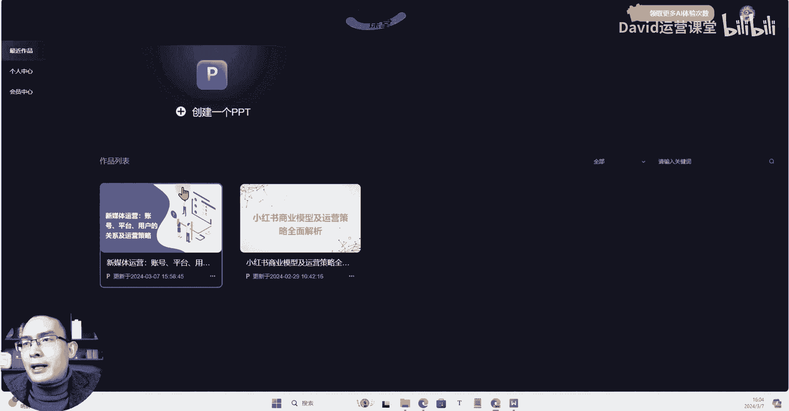

# 2024年B站首发新媒体运营全套教程！小红书运营0基础入门到精通／抖音直播／短视频运营保姆级自学课程／新手起号从0到1自媒体运营必学课！ - P17：02.2：工具篇-Ai生成PPT 最好用的PPT生成工具 - 方老师运营课堂 - BV1Si421m7Kh

Hello，大家好，这一节课呢我们来给大家分享一个非常实用的，用AI来生成PPT的一个工具，那么这个工具呢，它可以根据你给他提供了一个主题，或者说呢你给他提供一个你现有的文档，或者说TXT文件。

PDF的文章的这样的一个文件，你把这个文件提供给他，它可以根据你提供的内容，自动梳理出你这个内容，它一个大纲，结合这个内容大纲，再自动为你生成详细的PPT的一个内容，那么这个工具呢是我使用过很多。

用AI来生成PPT这么一个所有的工具当中呢，我觉得是非常好用的一个呃，那么我们来看一下这个工具哈，这个工具呢呃它有两种模式，一个就是我们刚才说的，我们输入一个主题，那么它根据你输入的主题呢。

来自动生成一个PPT的全文，这个呢其实也是结合我们ChatGPT，它的一个生成式的来来做的一个内容，然后呢是文章，你可以上传一篇文档，AI智能助手呢将自动为你总结成大纲。

并且基于这个大纲来为你生成PPT的内容，那么呢呃我试过这个PPT的这个主题是生成呢，呃非常非常nice啊，但是呢它的生成那个页数非常多，可能有六七十页，七八十页啊，做的这个东西呢非常详细。

可能有的呢也有一定的重复，然后呢我们呢就有呃这里演示啊，我就上传一篇这个我准备好的一个文章哈，呃我们来看一下我准备好的这样的一个文章。

那么这是之前写的关于新媒体运营流量，以及这个创作标签这一块的一个问题呃。

一篇文章我们就基于这篇文章，我们来让他测试一下，它生成这个PPT的一个能力，那我们这里呢点击继续，然后呢我们上传我们的一个文件，好他会解读我们这个文档，然后在下面呢列出这个大纲，首先新媒体运营的本质。

平台运营的角度，还有呢账号运营的策略，用户行为的分析与应用，创作激励与流量分配，数据分析在运营中的作用，因为案例的一个解析啊还是挺多的，他分析的挺细啊，分析的非常细，OK那么这个大纲应该是上传好了啊。

那么呢我们回到这里。

点击开始制作，好他就进入到这个PPT的一个生成页面，我们要稍等一下，这个应该是在读取，正常情况下是非常快的。

好他已经读取完成了，那么这个时候呢正在生成内容，它基于他的一个理解，和我们提供的一个大致的内容呢，来生成这样的一个PPT里面的主体内容，好我们来看一下，等它生成完毕，好我们来看一下。

那么这个PPT呢生成的差不多了啊，生成的差不多了，这个呢应该是有点bug啊，有点bug，那么他还在重新生成，还得重新生成，应该是重复的，这个呢基于什么呢，我们自己的一个网络环境，还有呢我们这个网速啊。

我们的这个这个这个他平台的一个，有时候你使用的频率。

我们先返回一下，然后的话呢我们再点击这个查看和编辑。

那这一块内容还没生成完啊，有一点的bug，我们正常使用的话呢，你在这个要等它生成完了之后，我们再去做调整，那我们这里呢就不等了。

我们把这个呃这是它的一个主体内容，然后的话呢这右边呢有一个更换模板，它目前呢提供的这个模板倒并不是很多啊，我们找到一个合适的，我们觉得合适的，我们来试一下，模板的切换倒是非常迅速啊。

模板的切换倒是非常迅速，他这个有一点非常不错的点是什么呢，就这个工具呢它可以基于你提供的大纲，或者是我们提供的这个文章内容，它能够分析你的内容，并且归类到不同的这个大纲节点下面，那么我使用的很多AI。

生成PPT的这样的一个工具，它都只能说你把所有的内容全部都把它写好，然后它基于你提供的内容呢来生成PPT，那么如果说内容做好了，我再来做PPT的话，那其实呃呃难度并不是特别大，对不对。

我而且我自己呢还可以把细节把控的非常好，那么我们更多情况下面用这个生成PPT，可能是基于我们只有一个大纲对吧，我们只有一些用AI写的，或者我们用I写的这样的一个呃列表，我们需要基于这个列表呢。

来完善它的一个具体的内容，那么这个才是我觉得AI应应用在这个PPT，上面的一个生成方面最好用的东西，而不是说我把所有的东西都准备好了，你再基于我提供的全部的内容，来生成一个格式啊，或者PPT什么的。

它这个地方呢虽然提供的模板比较少哈，但是正常情况下我们也可以自己去调啊，我们可以自己去调，那么相信呢这个工具后面呢，它提供的这个模板应该也会越来越多，那么我们当下呢它这里边生成的这些内容。

我们也可以自己去调整，那么在它的这个右侧啊。

我们看一下嗯，有一些相应的这个调整的方式啊，文字啊，还有他的一些形状，我们来做替换等等，这些都是可以的，好吧都是可以的，甚至说我们把这个PPT，我们把大致的模板替换好了之后，下载到本地。

我们再来做调整，这个也是OK的，我觉得最关键的就是它能够基于这个小节点，来生成详细的内容，这一点非常关键，OK那么这个工具呢就是我们分享给大家的一个，AI宣传PPT的一个工具。

那么呢其实这个是基于我们提供的文章，还有什么呀。

还有我们可以我们可以输入一个主题，那么你这个主题呢，呃也许你自己暂时还没有思路，你把这个思路呢告诉他，他可以基于你提供的这个思路来快速的生成，能够令你满意的详细的这样的一个PPT的内容，OK好的。

那么关于这个工具呢，领取的方式，我放在了这个视频下方的这个评论区的，置顶评论，还有我们视频下方的一个，本视频的视频简介信息里边都有，需要这个工具的。

