# 2024年B站首发新媒体运营全套教程！小红书运营0基础入门到精通／抖音直播／短视频运营保姆级自学课程／新手起号从0到1自媒体运营必学课！ - P30：12：新媒体运营-小红书关键词搜索排名的机制-1 - 方老师运营课堂 - BV1Si421m7Kh

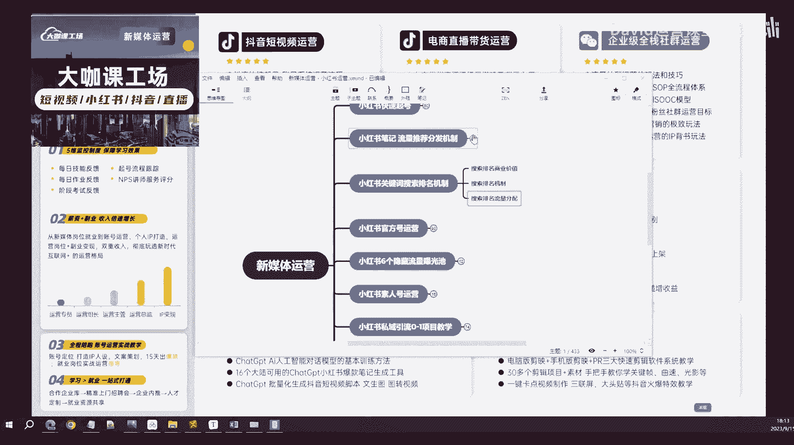

OK好欢迎大家来到我们这一堂课，那么这一堂课呢，我们又开始讲另外一个非常重要的干货点，那么这个内容呢是关于小红书的关键词的搜索，排名机制的解析，好，那么搜索排名这个东西呢其实不限于小红书。

任何一个就当下任何一个你能去搜索的平台，其实只要涉及到搜索，它都会有这样一个搜索排名的机制，像抖音抖音里边一样有搜索框，对不对，搜索出来的结果它一样有先后顺序啊，就是有一个排名，那么小红书也一样啊。

淘宝抖音啊，不那个拼多多啊，还有这个百度等等等等，只要有搜索的这种平台，它都有关键词的一个搜索排名，也就是说下面出来的内容呢，他肯定是有一个排名先后顺序的好吧，那么我们今天呢就重点来研究小红书。

它的搜索排名跟我们也就是我们博主，我们做笔记，做账号会给我们带来哪些影响，以及给我们带来的这些价值，Ok，那么首先我们来看一下搜索这样的一个界面啊。

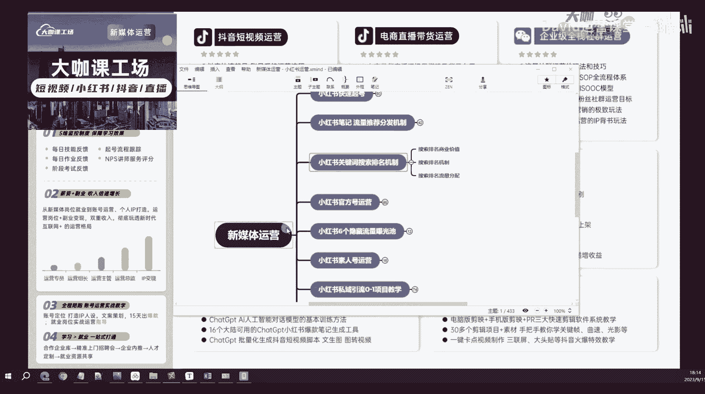

呃我们知道很多人呢，其实现在拿小红书当成一个，就是类似于百科这样的一个东西，对不对，那么当我们在这个搜索框当中，输入我们想要的关键词啊，比如哈这个眉笔啊哪个好用，OK然后呢我们点击搜索按钮。

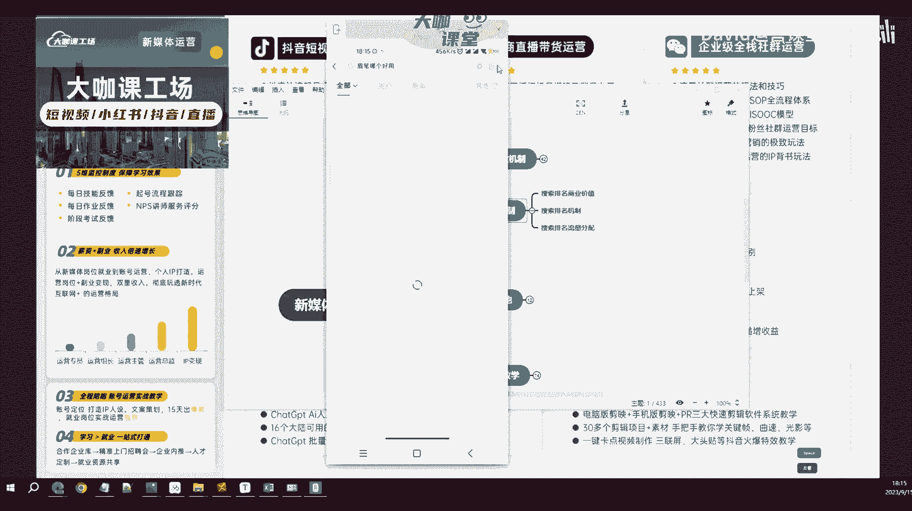

这样的一个步骤完成了之后，下面推给我们推荐这些东西啊。

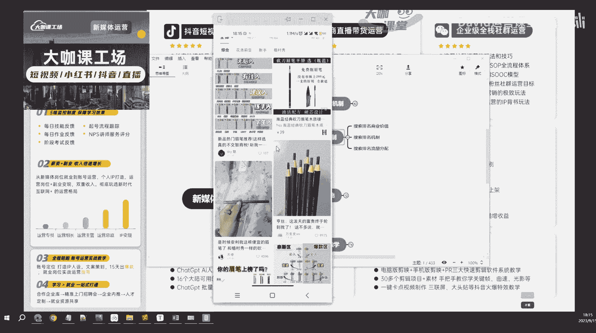

像由商品的排名对吧啊，然后还有这个笔记智商税啊。

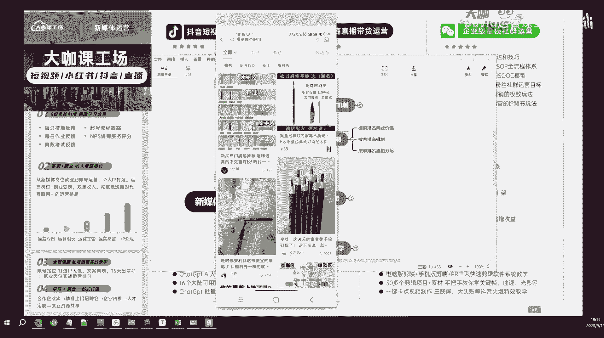

这样的一个种草的避坑的，还有下面出现的这些笔记呢，首先这个呢就是排在第一名的啊。

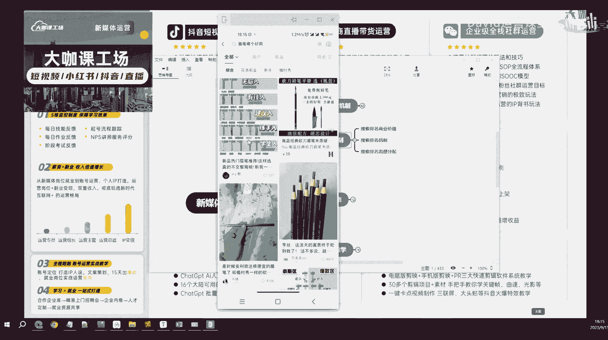

这个呢商品还排在第二名的，但是这个商品呢它是有广告的好吧，这个商品呢他是投了投流的，这个呢是可以不用计算到一个。

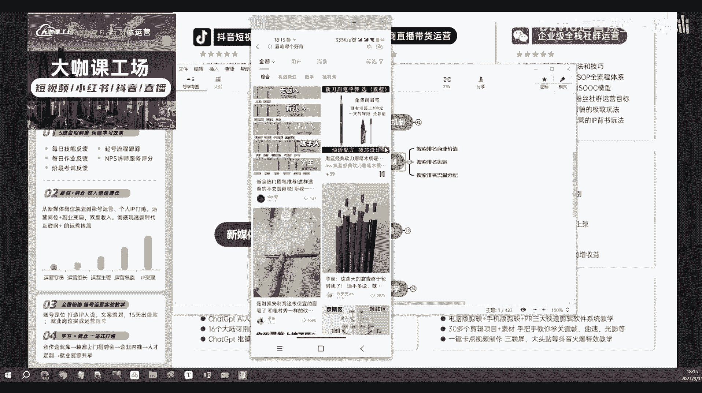

正常的排名当中的，那么这个是第一名啊，这个第二名，第三名，第四名。

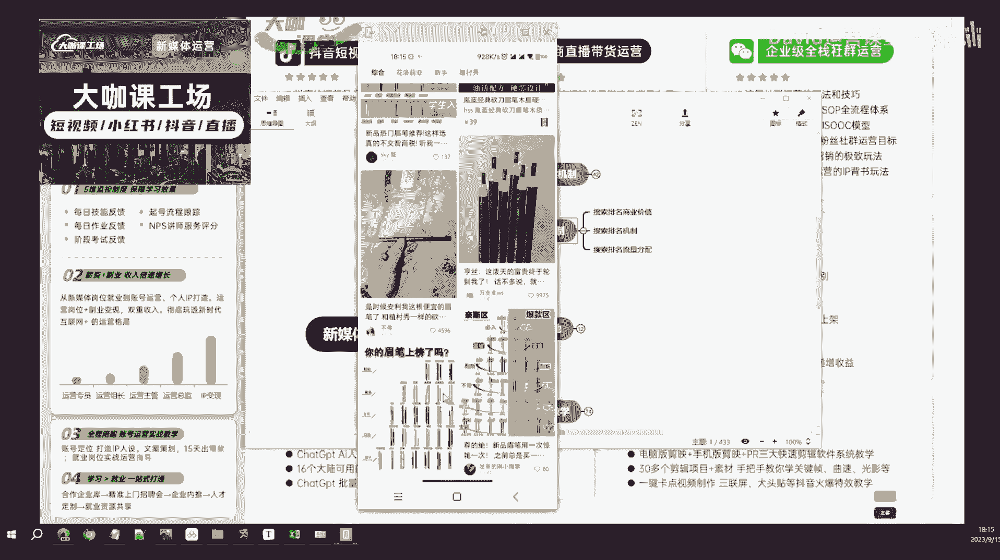

第五名，一直这样的一个顺序下去，它是有一个排序的啊，有一个排序的规则。

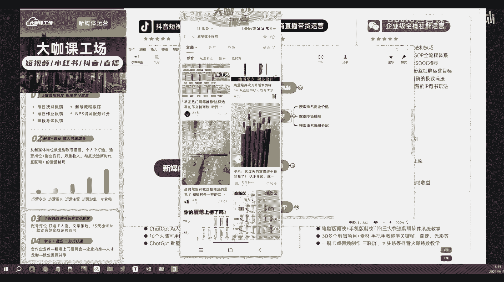

那么我们的笔记越靠前，是不是我们所获得的这个流量它就越高，对不对，那么这个时候很多人啊，我们的这个同学就可能会有疑虑。

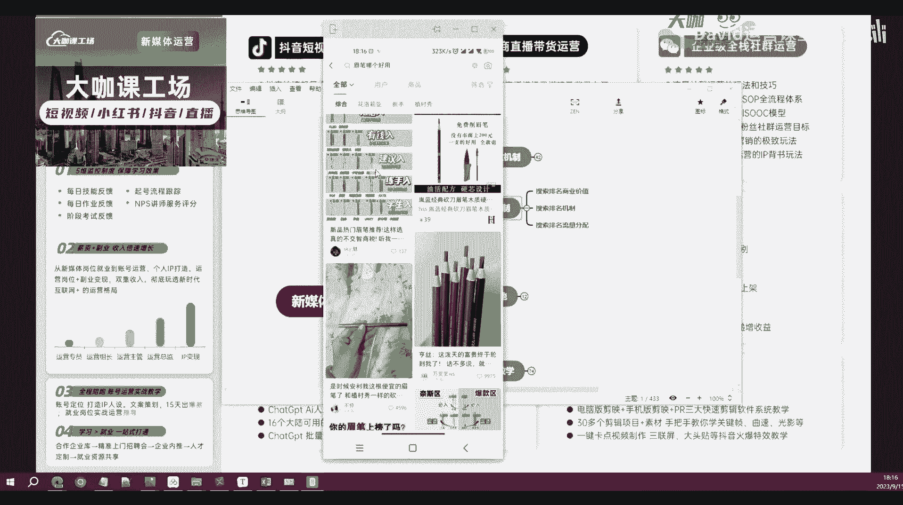

比如说老师搜的这个没比哪个好用对吧，我们看排在第一的啊。

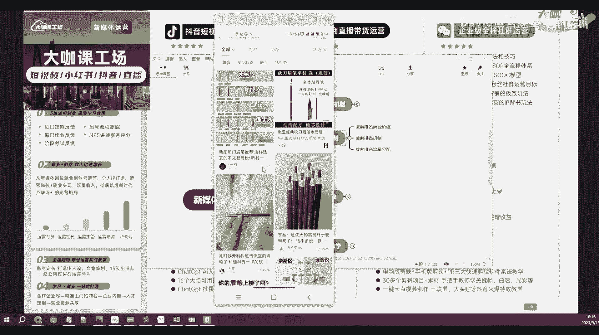

它只有137个赞啊，我们点进去看一下它的数据，哎它的数据其实并不怎么样。

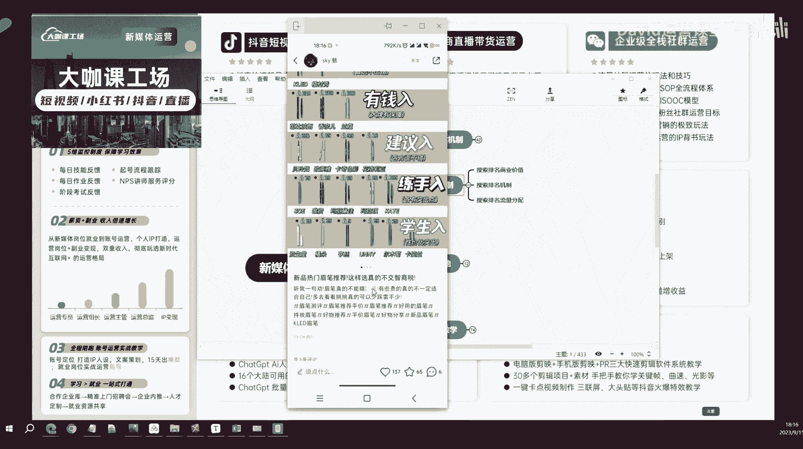

是不是，那么这个时候我们由此可以得出一个什么样的，一个结果啊，就是很多人他有一个误区，觉得啊我这个笔记点赞收藏评论数据越高，我排名就越高，那么这个时候你们就已经发现了，其实不是这样的。

那么我们今天呢就来带大家研究一下小红书。

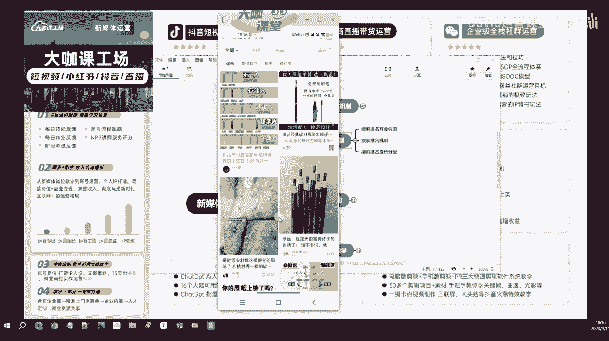

他这样的一个搜索机制到底是怎么形成的，为什么有时候我们的笔记没有办法被搜索到，OK好。

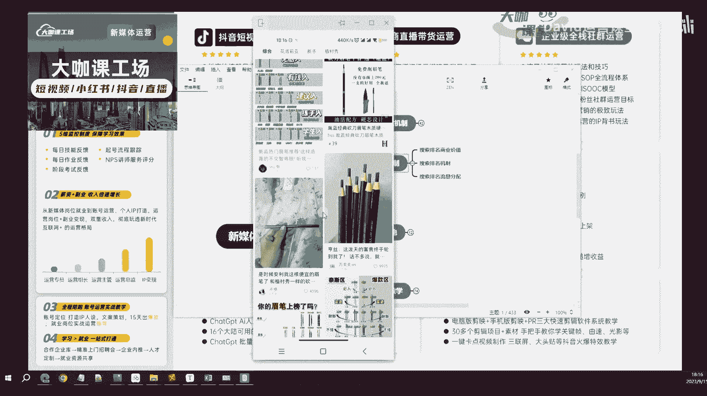

那我们正式开始，首先第一个我们来聊一下，就是搜索这样一个排名啊，它给我们呃，就是个人以及品牌带来的一个商业价值，首先呢呃对于企业来讲，这个搜索呢它是可以提高我们的一个商，也就是我们品牌的一个知名度啊。

更高的这个搜索排名就意味着我们的内容，我们的品牌更容易被用户发现啊，用户呢他至少看的更多，比如说你的品牌在搜索了之后呢，它排在100多位啊，或者说也不说夸张了啊，甚至说50多位。

那么你的展现数量基本上就非常少了啊，非常少了，尤其是像新品牌新产品，那么很多时候我们需要在搜索这个时候呢，去打打响我们的品牌对吧，那么很多人呢就可能类似于老师刚才搜索的。

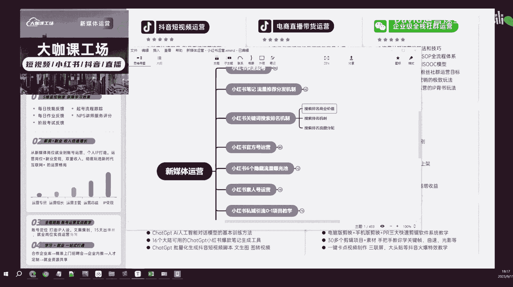

我们会要想办法去提高一下排名，那么自然排名我们短时间内做不上去怎么办。

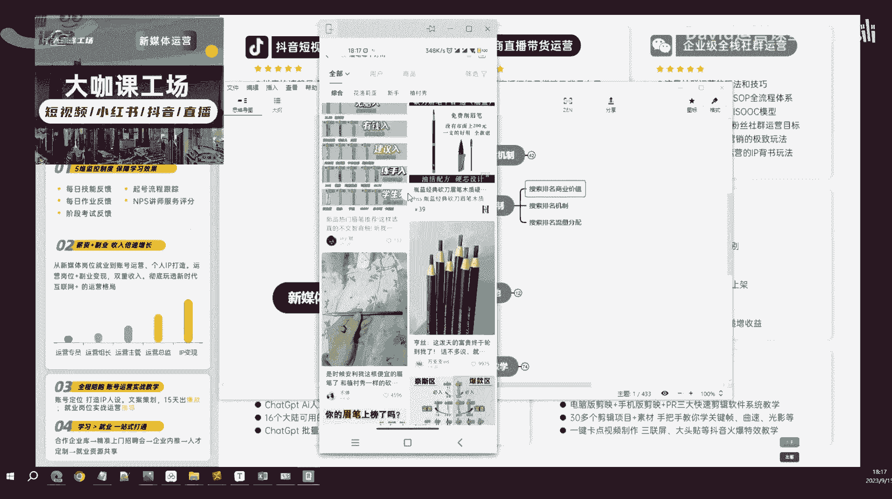

我们就要去投一下付费啊，如果说你有这个实力的话，我们就把我们的品牌往上投，那么一个是可以提高销量，第二个呢也可以提升我们品牌在这一块的一个，影响力和展示曝光好。

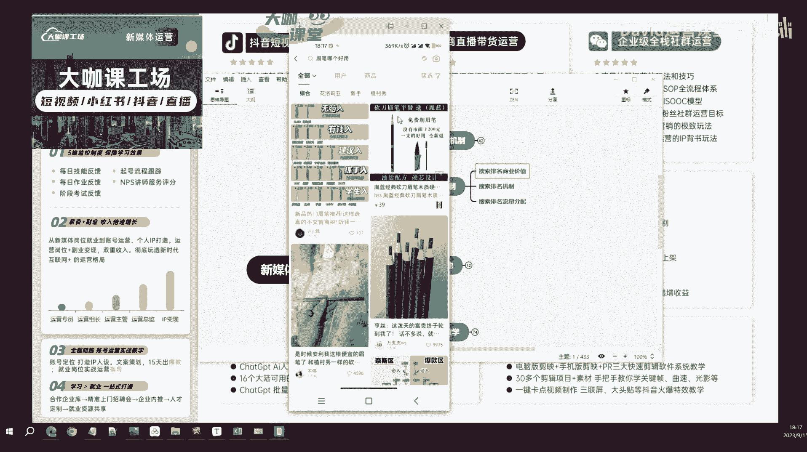

那么第二个啊就是我们刚才说到的，增加一个交易机会对吧，你的笔记啊，你的产品在搜索的时候，它的排名更加靠前，那么它就更有可能被用户点击啊，也就是说用户点击了之后，也就是说你的笔记越靠前。

用户呢他点击的概率也越高，对不对，那么你相对靠后，点击率也就啊更低，这以前呢是在这个我们做百度，搜索引擎的这个优化的时候，它其实是有一个热力图的，那么热力图呢，热点图就是用户更关注的是哪一块。

那么搜索排名排的越高的，那肯定点击的概率也越高，越越大对吧，然后第二个呢就是通过搜索排名，其实我们可以发现一个东西啊，就是我我先来记一下啊，首先第一个啊，嗯第一个就是提升我们品牌的知名度啊。

提升品牌的知名度。

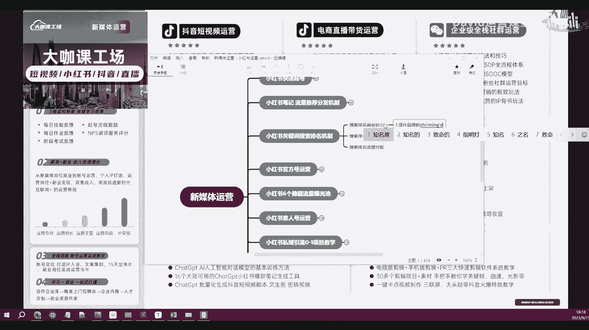

那么第二点呢就是老师刚才提到的啊，被点击概率提升啊。

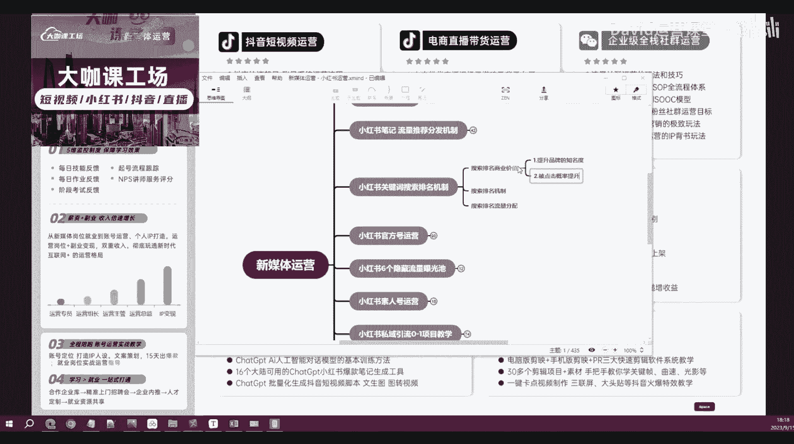

被点击的概率提升，那么第三点就是我我现在要讲的就是，可以通过搜索排名展现出来的内容，让我们知道我们笔记还有哪些优化的方向，或者说我们今后在做这一块的内容，我该做啊，我该做什么样的东西给用户展现啊。

我该做什么样的东西，那么搜索结果当中出来的必然就是啊，我这里告诉你啊，搜索出来的东西必然就是用户对于这个关键词，对于这个领域当中他最关心的内容，那么这些内容我们是可以铺垫，已经覆盖到我们自己的账号里边。

好吧，这个呢就是我们强调的优化笔记内容啊，优化笔记内容和结构，那么在这个出来的很多像我们的竞争对手，对不对，我们的竞争对手，还有一些比较其他的博主做的比较好的笔记，都可以给我们用来做参考。

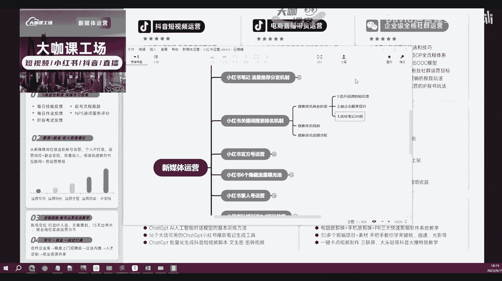

像我们刚才搜索的，如果说你是卖眉笔的，对不对，那么说不定诶你还可以找稍微靠的前一点。

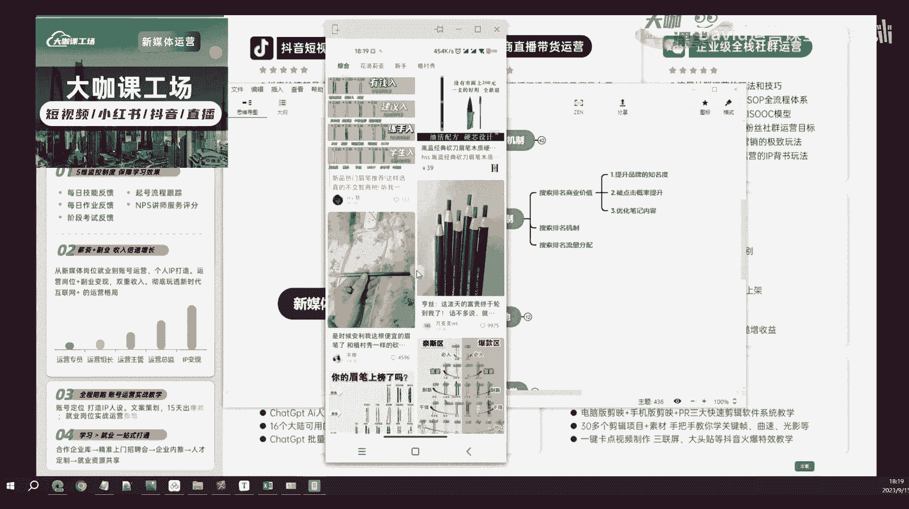

这种博主来做一些合作，对不对，那么这个时候如果说商家想去合作的时候。

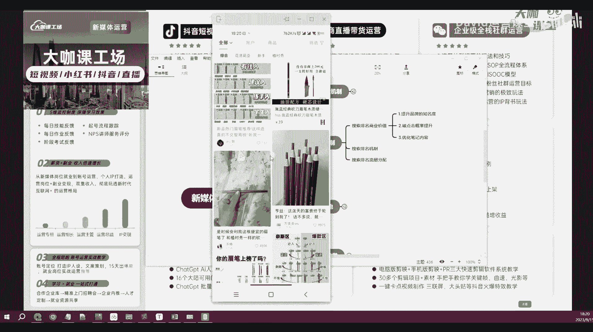

你是作为一个个人博主，你发的笔记在这块排名不错，那么你增加合作的机会啊，也就越大，那么像商品对吧。

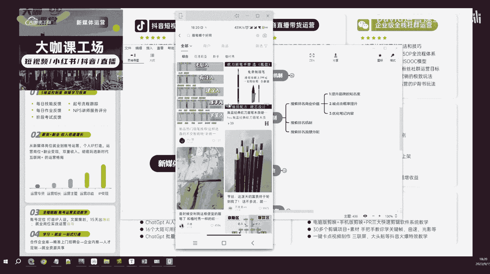

如果说你做的商品的话，我们可以看一下这个眉笔对吧，呃我并不知道这个眉笔，它具体因为我不用这个产品啊，我不知道它的优点在哪里，但是就我看来，这个眉笔的这个以及推广的这个产品。

还有还是有非常大的可以优化的空间的好吧。

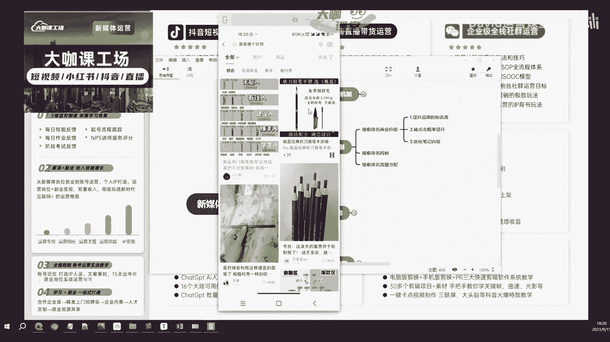

那么我具体的就不做点评了，呃呃这就是我们给大家讲的，在这个地方我们可以找到一个关键词搜索结果。

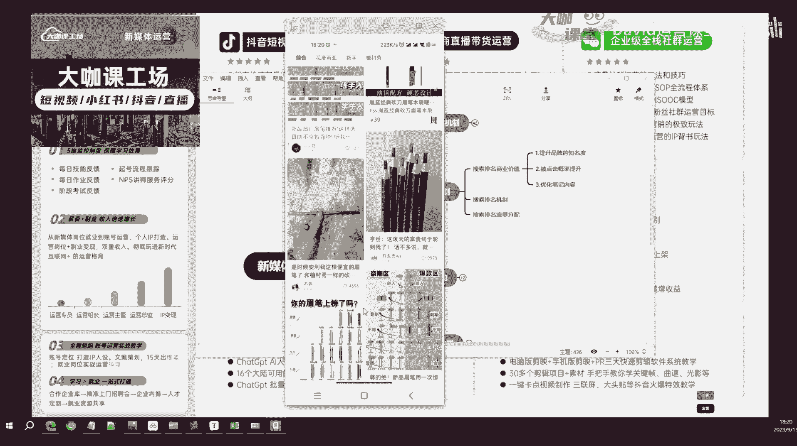

下面我们可以搜索到非常多非常多。

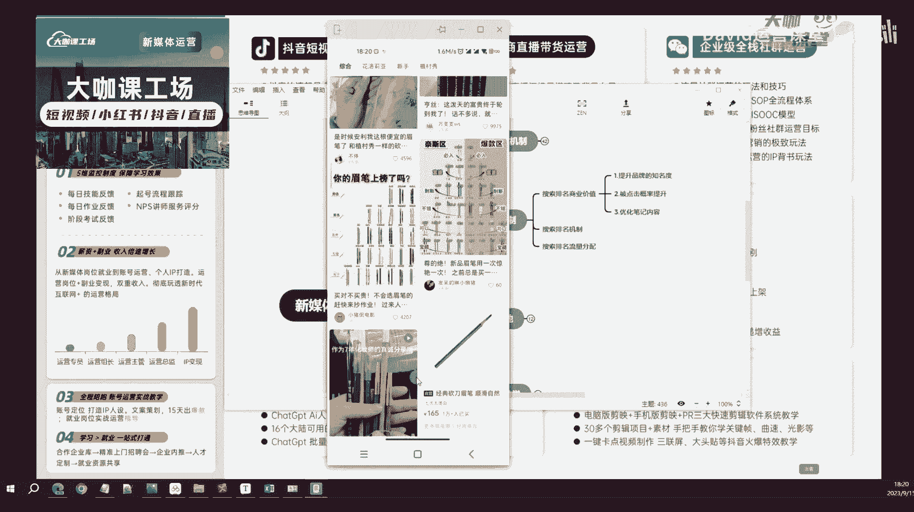

也是非常垂直的内容，他们可以给我们提供一个我们做内容的方向啊。

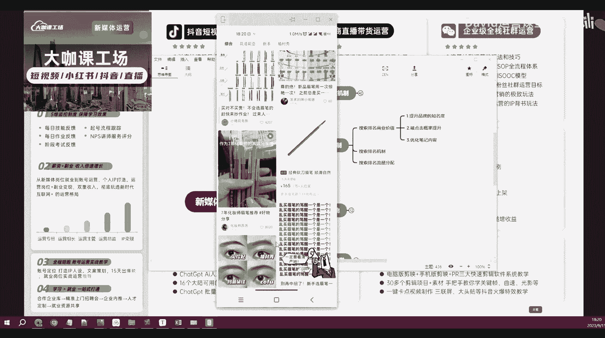

我们做内容的方向和参考，那么这是第三点，那么其实还有一点，也就是我们很多有时候像会做私域引流的，会做社区运营的，以及我们会做这种啊知识付费类的。

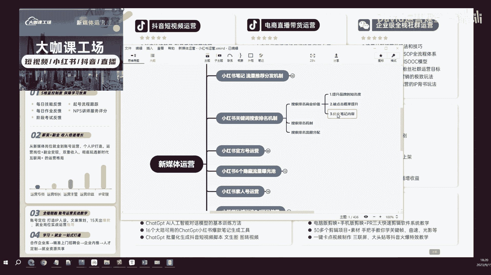

这种内容的话，会有一个好处，就是什么呢，就是我们可以通过搜索得到非常多啊，通过搜索结果这样啊，我们可以得到非常多的高价值，高意向的用户啊，为什么这么说呢，我相信大家应该明白这个道理，我们去搜索一个东西。

那必然是我们有一个需求，对不对，那么在我们搜索的出来的结果当中，如果说这个笔记能解决我的需求，那我是不是就有可能成为他的一个用户，或者说成为他的一个客户，那么搜索的人群就代表了某个领域。

某个产品里边具体的高意向的用户，那我们以前其实对于搜索关键词，做了很多的分类啊，这个关键词呢可能有A类，有B类还是C类，A类的呢可能就搜索一些呃相关的，比如说我们以前有做设备的。

那么可能搜索一些呃这个设备怎么使用啊，这个设备的一些注意事项等等，这样的一个用户，他可能就是了解一下这个用户的一些基本常识，可能他自己本身都已经有了这个产品，那么B类的啊。

或者说A类的这个用户他可能搜索什么呢，他可能直接去搜索哎这个设备多少钱，这个设备费用啊，这个设备厂家等等，那这样是不是就代表着这个用户，他的这个意图诶，他现在就是想了解这个东西多少钱。

是不是代表着他就是在一个购买阶段，那如果说在这个时候你的笔记更靠前对吧，你的笔记更靠前，你也增加提升了用户的点击率，那么用户跟你之间形成成交的关系，是不是就越大，那么这就是一个搜索排名的商业价值。

那么在任何一个平台。

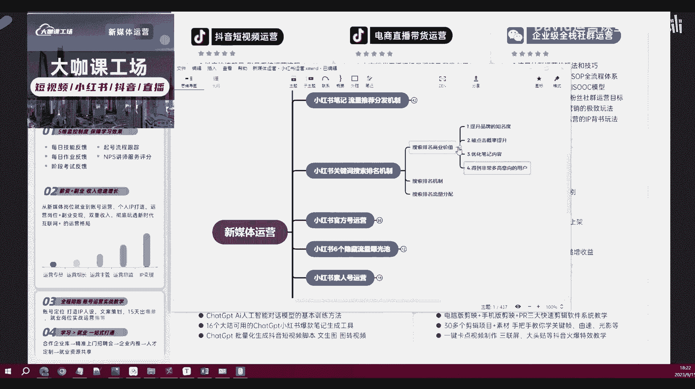

搜索排名的一个付费广告永远是最多的啊，这一块的商业战也是打的最猛的啊，它的价值比信息流推送的，这种正常的广告的价值还要高啊，还要高，那么呢我们还有第二个就是搜索排名机制啊，以及我们的搜索排名流量分配。

那么这个呢我调一下顺序啊，嗯我们来讲一下排名流量分配这个东西，就是说我们小红书博主啊，就是我们自己在做账号的时候，我们得了解一下呃，在这个搜索排名当中，它能给我们带来什么样的一个，流量的分配和规划。

好吧。

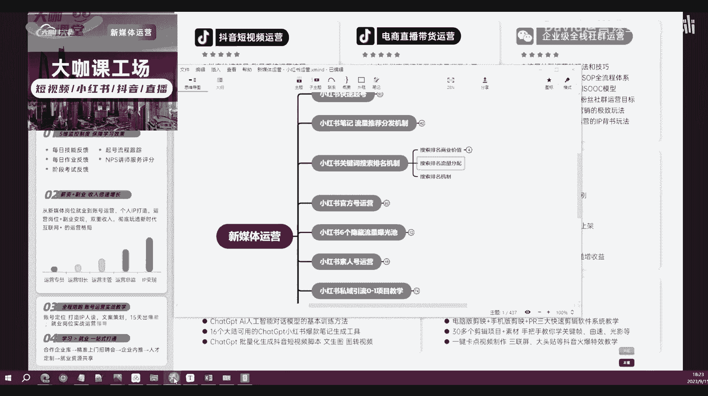

OK说到排名机制，排名额的一个流量分配啊，首先我们是需要知道，就是有一个东西叫做关键词关键词，这个里面呢我们需要区分一个东西啊，区分一个东西，这个东西呢就是一个叫核心关键词啊，一个就是长尾关键词。

不好意思，使用习惯啊，然后一个是长尾关键词，很多同学应该呃应该没有听说过啊，应该没听说过呃，在流量互联网流量平台的分配比例当中，那么核心关键词和长尾关键词，他们的流量比比例是20比80。

也就是二比八的一个概念，我们的核心关键词所占据的流量差不多是呃，可以有20%，也就是说这个领域当中，占据了20%的流量，还有的呢，剩下的80%的流量，其实是集中在长尾关键词上面，好吧。

其实集中在长尾关键词，这是我跟大家讲了一个非常重要的概念，有些人啊，有些特殊行业，他可能会觉得诶，核心关键词不是应该占据八成的流量吗，其实我告诉你不是的啊，在很多很多行业里边，我们所集中的。

能够真正给我们带来消费意向的用户，他们的比例大部分是站在长尾关键词里，什么叫长尾关键词，就是我刚才告诉大家的啊，你搜索一个设备的名称，那么这个用户搜索这个产品名称的时候，他可能有很多种意图。

他可能只想了解一下这个产品它是怎么使用的，这个产品它是个什么东西，但是长尾关键词里边就有很多种形式，比如说他可能会搜索一些类似于啊价格啊对吧，这个东西多少钱唉，然后这个价格怎么使啊。

这个价格多少钱费用啊，然后这个这个价格的哪个品牌的这个产品，哪个品牌的更好，对不对，这些其实就是在长尾词这一块所带来的一种，高价高价值，高意向的一个用户群体，那么我们在流量分配这一块，我们讲究。

如果说热门关键词啊，我们做笔记，如果你不是做产品的话，你不是做产品，那么这个时候你需要捕捉的一个点，就是比较核心的，就是我们要去做核心关键词啊，我们需需要去做核心关键词。

核心关键词的意思就是比如说你是做美甲的，那么你每一篇笔记里边，你就得去啊包含美甲这个词啊，你就得包含美甲这个词，我还是给大家举个例子啊，比如说嗯，比如说我们现在做的是一个美甲的产品对吧，美甲的产品。

那么我们每一个笔记的标题里边，可能都包含了美甲，那么如果说我们要去做长尾词的分布，比如说诶我有很多个账号，我现在做矩阵，我要做几十个账号，每一个账号可能要做很多很多篇笔记。

那么笔记呢就这些笔记的内容怎么去分配，标题里面包含哪些，比如说啊我们这里举个例子啊，美甲造型推荐对吧，然后呢美甲注意事项啊，美甲分享，好吧，那么额其实我这里想啊，我对这个东西可能还了解的不够透。

那么我们就直接去看好吧，我们在这里搜美甲，美甲作为一个核心词，那么我们做核心词的时候，你很多东西你都需要去包含美甲，但是如果说你需要去做长尾词的时候，你做长尾词的流量，你就得考虑像美甲款式诶。

秋天的美甲款式，美甲的款式推荐美甲的短款，那么这些其实我告诉你们，这些都是长尾词，好吧，这些都是长尾词，核心词一定是就是浏览量和，就是用户的流量分配，也就是没这个核心词，一定是就是所有的你长尾词的一个。

流量的集中点好吧，但是它不代表着它不代表着你的最终的一个，成交意向的比例，OK能理解这个意思，那么就是说我们做后期做内容，如果是做流量对吧，如果是做流量，那么你的你的这个笔记。

你所有的笔记必须包含这个核心词，必须包含这个核心词，美甲你可以围绕它来做很多的内容，那如果说你是做长尾词，做产品做成交的时候，你就要考虑跟对你的这个美甲所延伸出来的，这些常规词做分类，做A级。

B级的分类来，去找到那些专门去做那些用户成交意向，高的价格费用，秋天款式高级感显白等等这一类的内容啊，我们去怼着做，我们去怼着做好，OK这是我跟大家讲的一个关于呃，核心关键词和长尾关键词的一个内容。

那么呢其实呃我们在关键词这一块，排名流量的分配这一块，其实有时候，可能还会涉及到一些就人工干预的情况啊，人工干预的情况，那么这些情况呢比较罕见对吧，这些比如说平台上面有个某个呃热点。

或者说嗯最近也要上一个某个活动啊，平台要上小红书，平台要上一个活动，小红书平台呢有一个这个呃，最近跟大家分享的这个运营的课程啊，跟这个大家分享的这个某个技巧啊，他可能会把这些内容人工靠前对吧。

这就是平台的一些特权和机制，但是涉及到商品啊，涉及到一些特殊的分类，小红书官方他是不会这样去做的好吧，这个是有些东西呢嗯是可以去干预的，有些东西呢它又不可以干预啊，这是我们讲这个平台的干预。

那么其次还有一个东西就是我们的用户干预，等会啊，我们的用户干预会影响我们的一个流量分配，怎么理解呢，那像我们刚才所看到的呃，你的这个排名数据，我们来看这个案例啊，这个是我们眉笔下面的一个案例啊。

我们可以看到就是，比如说我现在作为一个正常用户，诶，这个笔记它排名第一，但是呢我对它不感兴趣，搜索了之后我不会点击它，诶，我发现这个挺好看的，我点击了一下这个笔记，那么这个时候我我这个用户。

就相当于是对这个笔记的排名，做了一个系统上面的一些干预啊，怎么什么怎么理解呢，比如说啊现在有这么十个用户，十个用户当中只有一个用户点击了第一页啊，第一个笔记排名第一的，剩下的九个用户他们都点击了啊。

这个笔记，那么就系统就会认为哎我的这个算法，我推荐的这个笔记可能有问题，大部分用户他不喜欢这个东西，没有用户去点击，或者说用户点击了一下哎这个内容不行，立马就退出了，这个就退出率就非常非常高。

那么这个时候用户就会，系统就会根据用户的一些行为，来对这个排名进行调整，那么我们之前其实在做这个SU的优化和排名，的时候啊，嗯那就打一下啊，我们之前在做SEO优化排名的时候，其实会用到这种手段。

就是模拟啊，就是用一些呃这个呃模拟真实用户的这种流量，或者虚假点击行为啊，去干预这个排名，那么那个时候百度的这个搜索算法，能在这一块还是非常占比非常重的，就是我们会通过一些特定的这个工具。

去模拟人工的点击，然后比如说我们现在排名排在这对吧，我们排在比较靠后，排在第五，第六第十名，那么我们想提升排名，就安排一大批的这个假人，一天点他个千次啊，或者说1万次啊，但点多了可能就行。

我做个我做个假设啊，就是说点很多次，我搜索出来的结果，我前面的就是不点，我就是专门所有的用户我都来点这，那么系统就会对系统造成一个错觉，就是所有的用户他都喜欢这个笔记内容，那么啊没办法啊。

用户喜欢的那个平台一定要去做调整，那么这个时候呢平台就会把你的笔记往上排，名往上提，这是之前我们做的很多的一个呃，搜索引擎下面那个排名优化的一个算法啊，这样的一个干预，那么这里呢就是给大家讲一下。

就是呃在这个流量分配这一块，你一定要明白，如果说你的笔记单独是做这种曝光啊，做这种用户的围观的啊，做这种价值引导的，那么你就需要去关注，这个时候，你的核心关键词和长尾关键词的流量比例，就是八比二。

那如果是你是需要去做这个销售，需要去做这个产品的时候，那么这个时候你的长尾关键词，和你的核心关键词之间的用户关注的比例，一定是核心关键词只占两成，剩下的内容全部围绕你的长尾关键词来做。

产品的价格费用一类的内容啊，你的成交率会提升很多，会提升很多，OK那么这是我们这一节给大家讲的搜索引擎啊，也就是我们小红书它的一个搜索排名的机制。

