# 2024年b站最新最牛的0基础小红书新媒体电商运营开店干货课程---从入门到精通如何卖货如何起号如何打造个人ip - P1 - 颖哥爱分享 - BV14S411F71X

我们这节课大家认识一下为什么要去做小红书啊，我们先认识一下小红书。

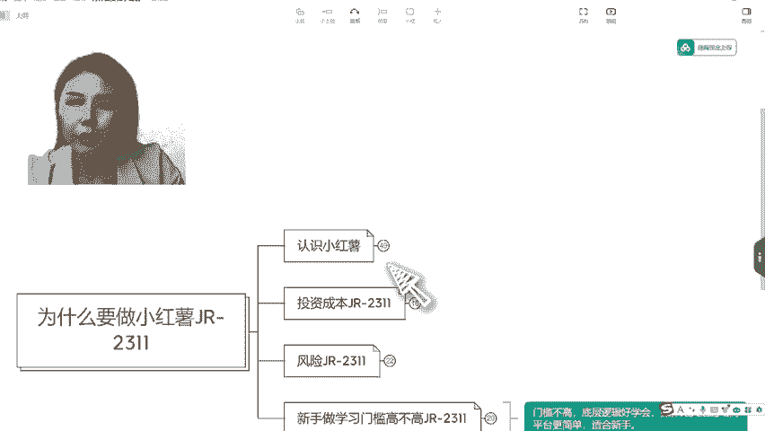

小红书的一个月活群体有两个亿啊，然后大部分都是对美好事物的追求去做一个经验分享。然后呢，消费人群呢主要是1个20到40岁的一个女性群体啊。

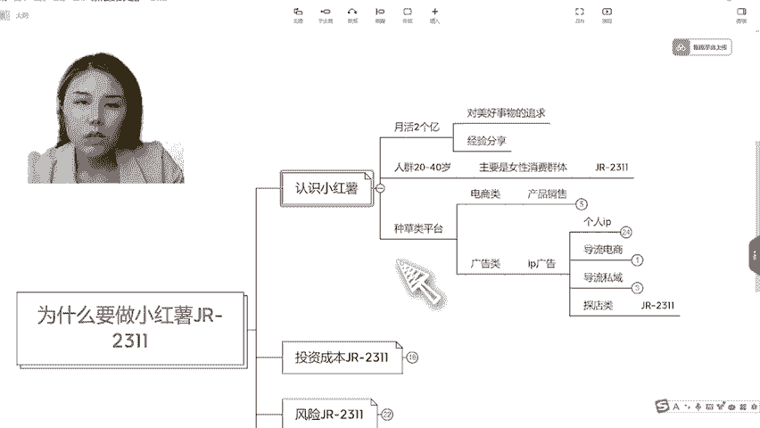

种草它是一个种草类的平台，然后跟我们的传统电商也是有一些区别的啊。

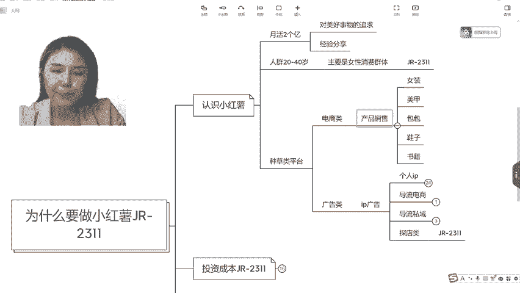

电商类的一个属性啊，比如产品销售，它可以卖女装、美甲、包包、鞋子、书籍等这些啊，其他的没有一一列举啊，大家可以去搜集一下，还有广告类的，它可以去做1个IP广告。比如说。

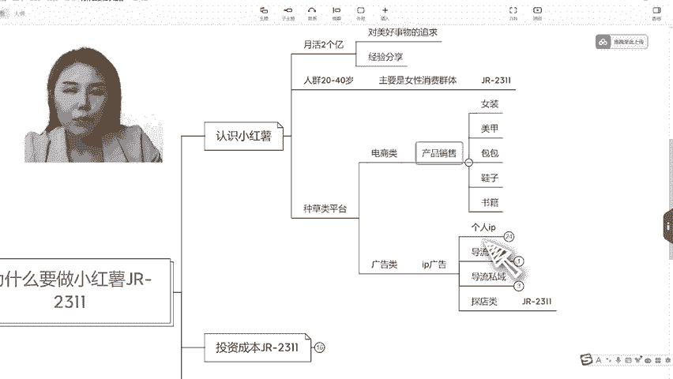

个人的IP啊个人IP大家可以去通过蒲公英去接单啊。蒲公英的话后面我们会讲到。个人IP呢有分享经验，怎么育儿，比如怎么化妆，怎么赚钱，职场经验，还有很多啊分享观点到底要不要辞职，要不要买房？

分享一些例子的话，比如说电商属性，还有粉丝属性，分享一些例子的话，我们可以比如说一些心灵鸡汤。然后它会挂一些书籍啊，在橱窗上，这就是电商属性。粉丝属性呢，它就只是单纯的想去涨粉丝啊。

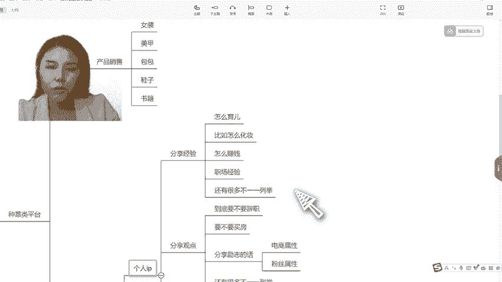

还有很多分享观点的，我们在这里就不一一去列举了啊。好有分享技术类的。比如说烹饪技术，有很多在小红书去分享美食的博主啊，成为美食博主。他们后面可能会去带货一些。比如说有关烹饪的产品。

或者是去焦烹饪的技术啊，剪辑拍摄类的技术。嗯，很多人比如说教呃一天的vlog怎么拍。还有一些啊怎么剪辑等等等等啊，这些不一一去列举了。因为这些都是去做一个导流的啊。

他们分享技术肯定是通过利他来为自己去做一些事情的啊，去做一个个人的一个IP还有分享工具类的，很多人会看到，比如说自媒体好用的什么什么什么工具啊。

免费分享给大家什么总结给大家什么什么100个好用的什么职场经验啊啊，职场工具啊等等，还有什么啊AI写作啊，什么还有AI剪辑的一些工具等等等等。这些都是属于一个个人IP类的。

只不过他们是一个工具导向型的工具导向型的，他们后期可能会通过比如说做简历收费，这样培训收费，或者是做论文指导变现收费啊，你们可以也往这方面去做啊。

当然我们现在这这一堂课主要去讲的这一系列课主要是讲的一个是电商属性啊，电商方面的。

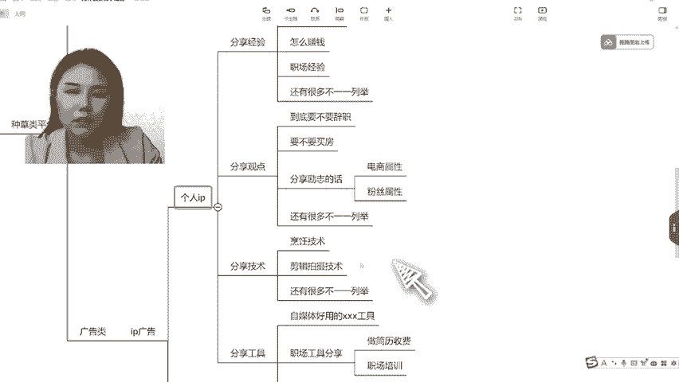

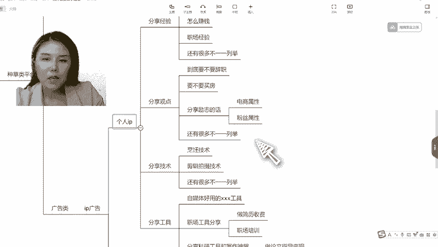

后面我们会去展开去做1个IP的一个一个详细的一个解析啊。导流电商啊，有你会看到一些文章或视频本身是没有挂商品的。但是它它在置顶的评论，你告诉你去哪里买，这就是通过种草回流到的传统电商里面啊。

这也是一种软广的形式啊，可能是你回流到你自己店铺，也可能是回流到你接的广告的啊那个店铺里面啊。

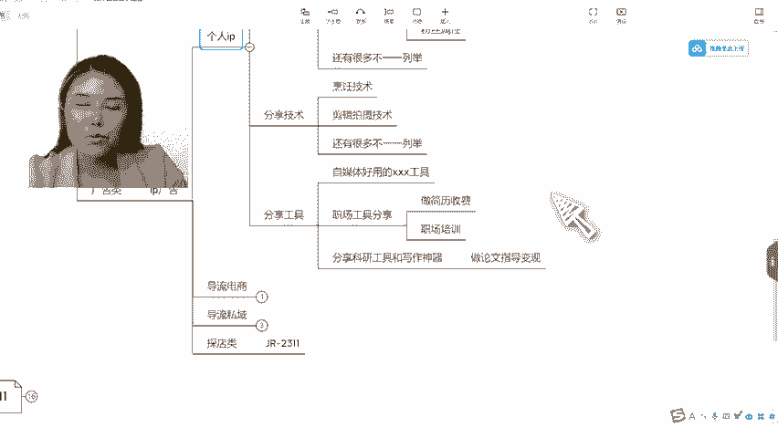

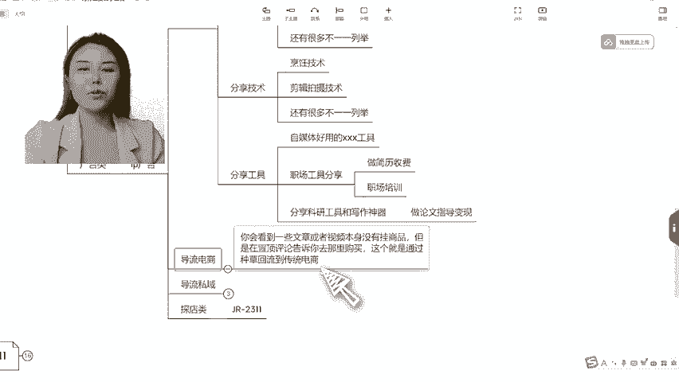

这种形式呢这种评论的形式呢会呃不会影响流量。为什么？因为我们相相对于我们挂车的一个链接来说，挂车的一个博文来说，它是比较会影响流量的。但是我们现在是这种评论形式的，没有挂车的呃图文，它是比较好的啊。

流量会给予倾倾斜的啊。

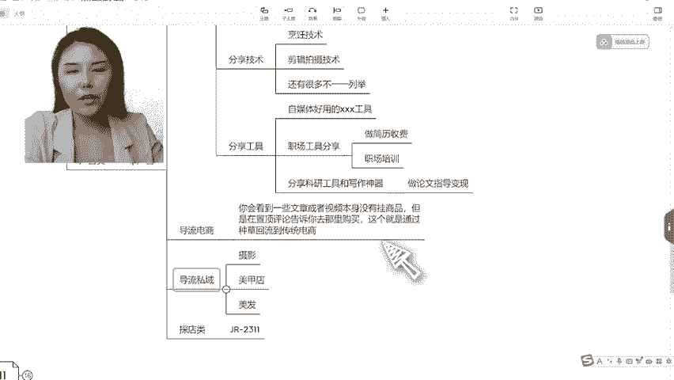

流量私域啊会导流到私域的情况。比如说摄影店、美甲店、美发店都会去导流到他们自己私域。比如说你会看到一些。嗯，给别人去弄美发的啊，然后呢加微信怎么怎么样的，这就导流到C域的。还有探店类的，探店类的。

要么就是探自己店，要么就是去做跟别人去合作接。去做接的接广的啊，摊店类就怎么摊自己店。就比如说模仿嘛，自己模仿用户嘛，去探这家店嘛。哎，就说这家店怎么怎么好，其实你发现一直在探这家店。

就相当这就是店主自己在探自己店。

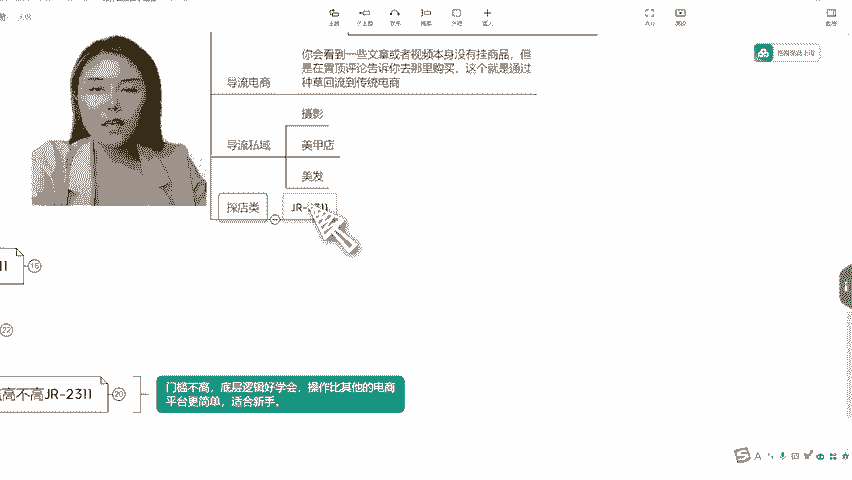

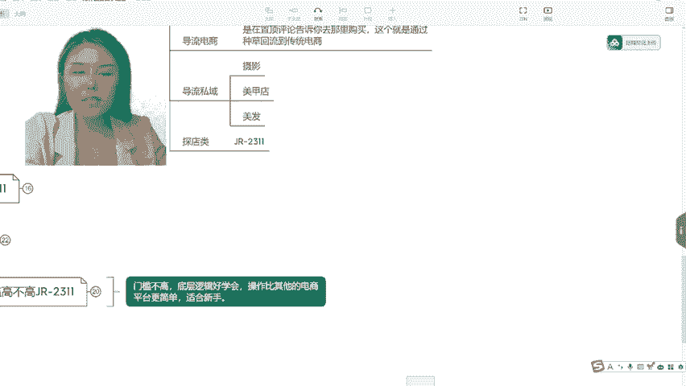

我们来看投资成本啊，投资成本保证金呢前期是可以不用交的。但是后期在你卖出去商品之后，是一定要交的。回款呢呃小红书是T加7天，其他平台是15天。相对于其他平台，小红书的压力要小一点啊，回款压力要小一点。

我们来看以看看看看看开店啊，开店的话，个人店呢是1000的保证金。销售额呢不能超过1010年啊，同时一张身份证呢只能看一家店啊，个体户呢是1000保证金没有限制，销售额是没有限制的。

一个身份证呢可以开三家店，我们再看一下企业店，企业店分为企业店、专卖店、旗舰店、集合店和卖展性旗舰店啊，这都是2万的保证金，同时还需要商标啊。

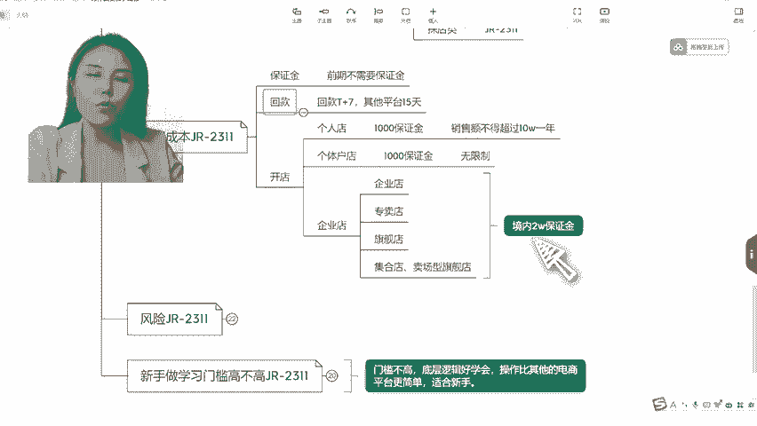

我们来看一下风险啊，风险呢项目呢其实可以长期做的啊，为什么？因为小红书是国内种草的代表啊，有很多玩法可以去深耕。目前小红书电商还属于发展的阶段啊，商家逐渐在增多，但是呢专业性的啊并没有很多啊。

我们还是可以去进入到里面的啊。

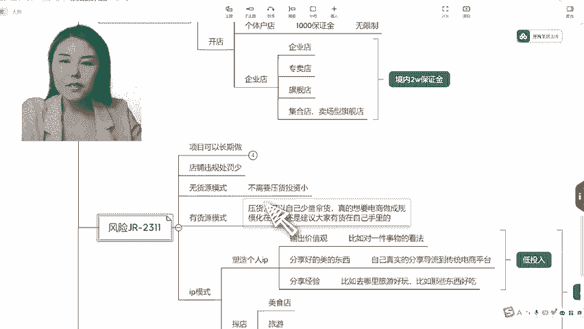

同时呢店铺的违规罚款比较少啊，不像抖音最近的新规啊，你随便放一个摆件，没有授权，就直接啊把你的保证金动了，直接罚罚罚罚多少多少分，对不对？啊？还有一些，比如说像你的真真不求禁也会罚款等等等等。

现在但是小红说的，目前对于因为他嗯它的电商属性还比较弱，所以它的处罚是相对来说比较少的啊。

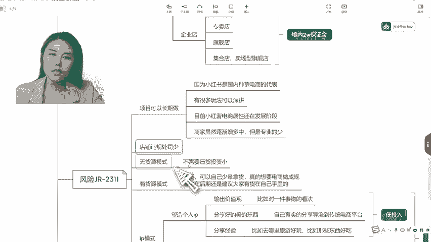

分两种形式，一个无会员形式，还有一个有会员形式啊，无会员形式呢就是不需要压货啊，相对来说它的投资偏小一点啊，可以去代发。后面我们会去说到去哪些平台怎么去找货，怎么去代发啊，还有有会员模式呢。

压货就是自己少量少量拿货啊，真的想把电商做成规模啊，其实后期还是建议自己有一些货在手里面的。当然这是后期后话呃关于IP模式啊，塑造个人IP啊，输出价值观啊，你可以说出一些对一件事的看法啊。

比如最近比较火的一个胖猫事件啊，你可以去发表自己的观点。对于感情对各方面的一些观点，还有分享好的美的事物啊，比如分享自己的真实用的东西导流到呃你接的广告的电商平台也好，还有你自己的电商平台也是可以的。

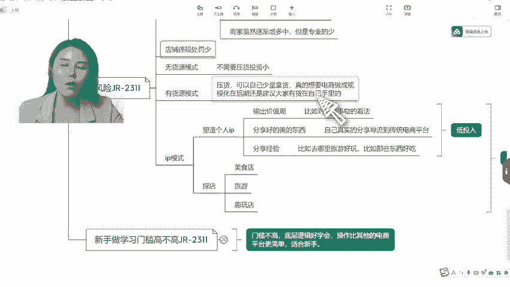

分享经验，比如去哪里玩啊，然后有什么好吃的好用的啊，好的穿搭都可以导流到这边啊，都可以做去做一个探店的一个1个IP的一个合作。

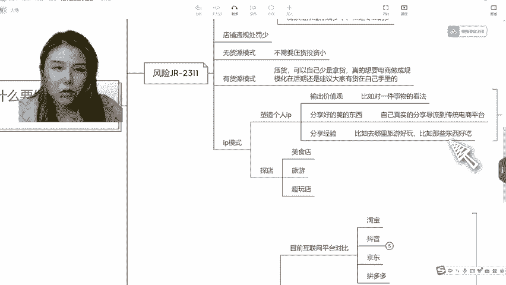

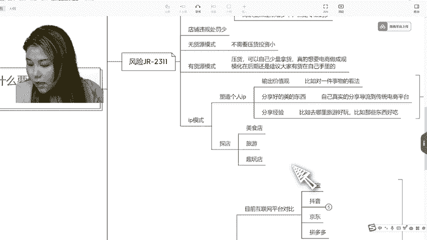

我们再看一下新新手做门槛啊，做学习门槛都。我们来看一下新手做这个门槛高不高啊。目前互联网平台的一些对比啊，淘宝、抖音、京东、拼多多，我们可以看一下淘宝啊，短视频、中视频、直播带货、图文种草。

这个和小红书是是有点类似的啊，这个和小红书是有点类似的。

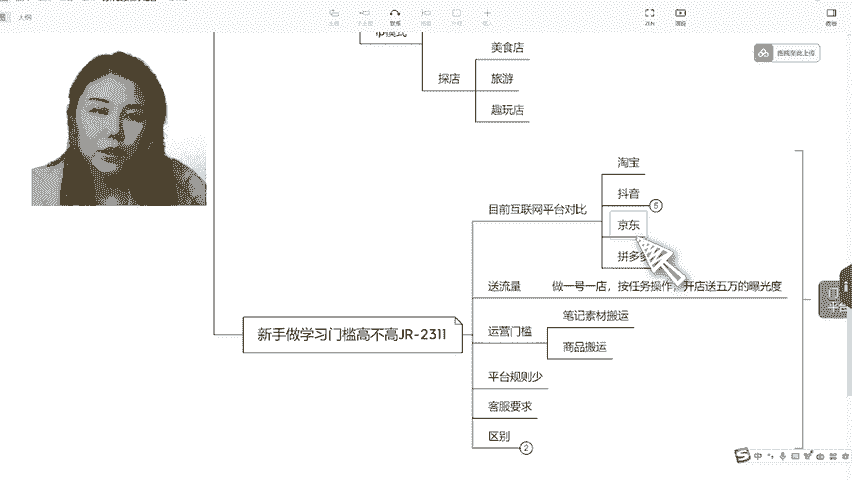

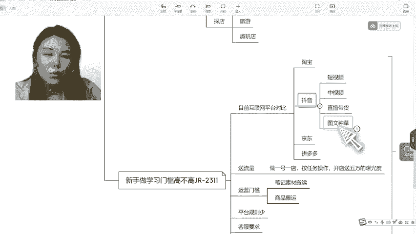

目前的小红书是送流量的啊，做一号一店啊，然后按照任务来说，它是有5万曝光度的。运营门槛呢素材搬运和商品搬运，后面我们会给大家详细去讲到目前的平台规则是比较少的啊，客户要求也是不高的啊，区别啊。

它是跟其他平台区别是在于种草为主啊，以视频和文章输出，而非传统的画家电商啊，就现在的小红书的门槛做起来是比较低的啊，很适合新手啊，不像不像拼夕夕，还有还有抖音，现在目前是比较考验供应链的啊。

然后像小红书来说，它主要是以呃你你图片看着好看，让大家觉得很美啊，愉悦，大家就会去购买啊，还是有有稍微有一些些区别的啊。所以建议大家可以从小红书入手入手。当然大家想去做抖音或拼夕夕。

后面我们也会教给大家的啊。那我们接下来进行下一课啊。

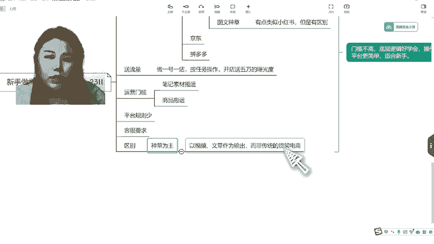

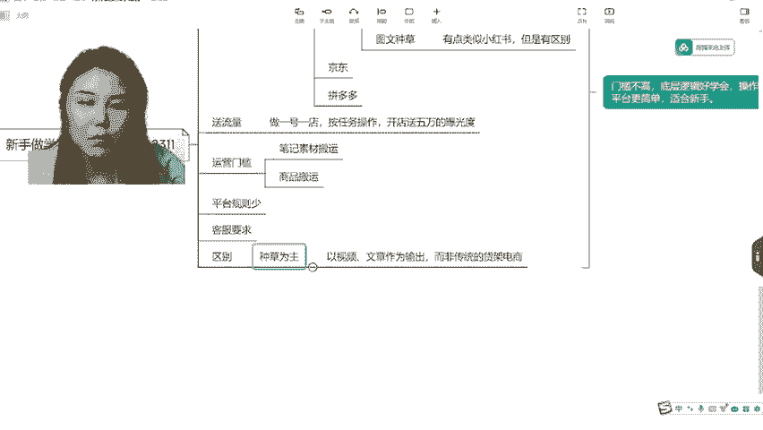

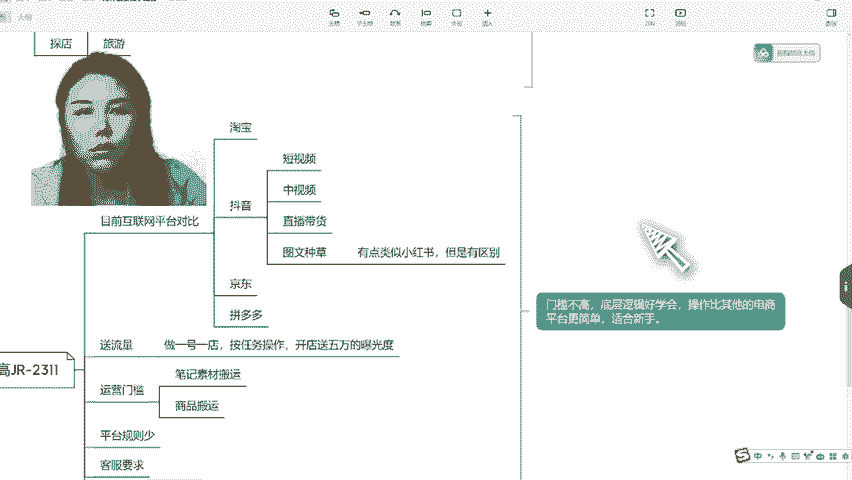

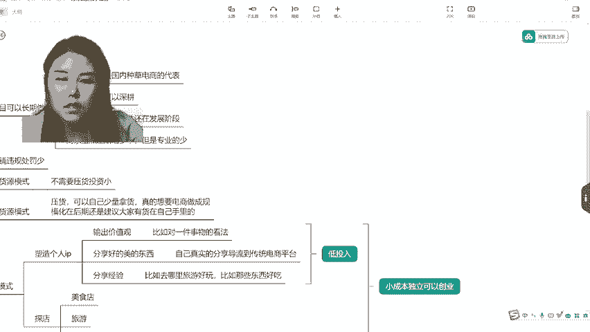

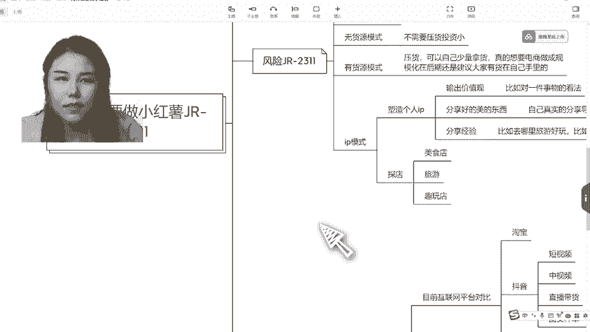

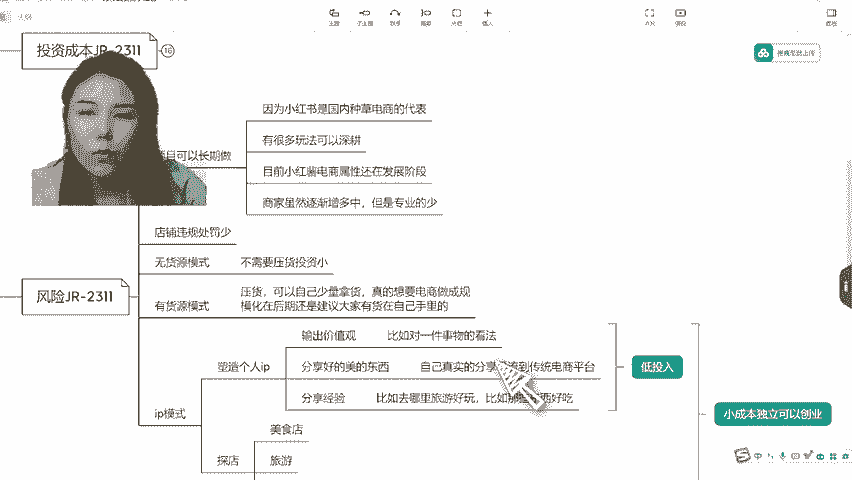

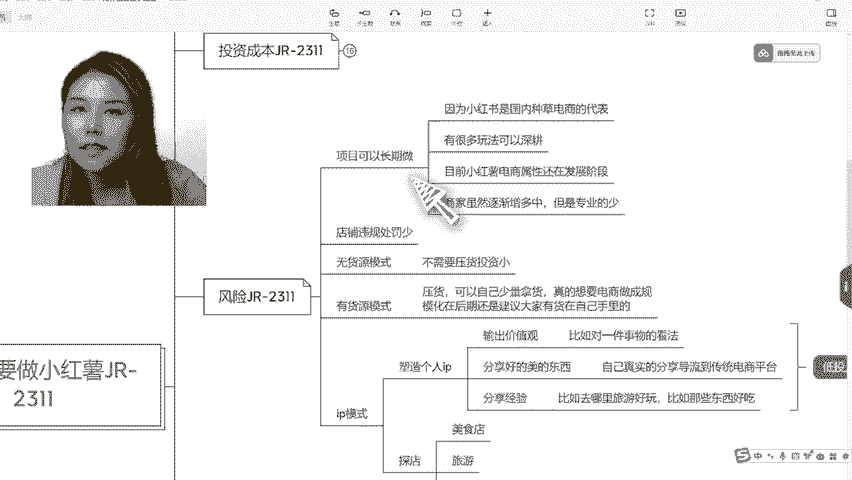

大家再见，拜拜。