# 2024年亚马逊跨境电商开店教程，零基础亚马逊运营课程【合集】Amazon亚马逊跨境电商入门到精通教程（纯干货，超详细！） - P12：11.选品方法：跟款 - 蛋哥说亚马逊 - BV1Ux2ZYPEFB

还有一个点呢，就是你看你的一个评价数啊，智能号啊等等等等等。好好，那接下来我给大家讲一个该怎么样进行选产品的一个方法。好，首先呢就是你要选产品的时候好。选产品。当然了，这节课是第一节课啊。

因为到周五的话还有一节课，因为你们店铺还没有出来，所以说我跟你讲的时候会有很多新概念，这节课会有很多新概念，就是你可能第一次听。你以为第一次听的话，你不懂的话也很正常，知道吧？这个请同学们理解。

因为你毕竟刚刚接触这个东西嘛，有很多新概念，你不懂不知道是很正常的。😡，所以说因为当你店铺下来之后，老师到时候在演示你这个也更更容易效率高嘛。你现在凭空听的话，哪得让地方不明白，这也很正常。好。

到时候你再回看一遍就行。好，你比如说选品的时候，你首先第一个，我第一个要有这几个原则。原则。第一个就是要同行，我要首先我要做的是根款。我首先要做到跟款，这是第一种选款方法，就是我要跟款。什么叫跟款？

就是别人卖的好的，我也要跟跟着卖。😡，我也要卖。我也要跟着卖。好，那首先你要判断，那为什么别人卖的好的，我我还要跟着卖呢？因为那老师还能卖得出去吗？好，能卖的出去，为什么？因为同有同款很正常。😡。

很正常能理解吗？有同款很正常。第二个，同款，即使它是同款，但是价格有可能不同款。而且你选这个产品，选同行卖的好的产品，你成功的概率更大。就换句话说，你选到好款的指标，选到好款的几几率更大。能理解吗？

因为什么？因为别的同行已经卖这个东西卖的很好了，说明他他在亚马逊市场上表现很好。那我就直接跟着他来进行卖，分析他一杯羹。这也是你们入手的一个其中的一个一个环节。好，那比如说老师，那怎么入手嘞？好。

我给大家举例，声音还小吗？不可能小啊。😡，你用电脑看好吧，用微信的话，有可能你看不到。好。现在呢现在呢现在呢同学。

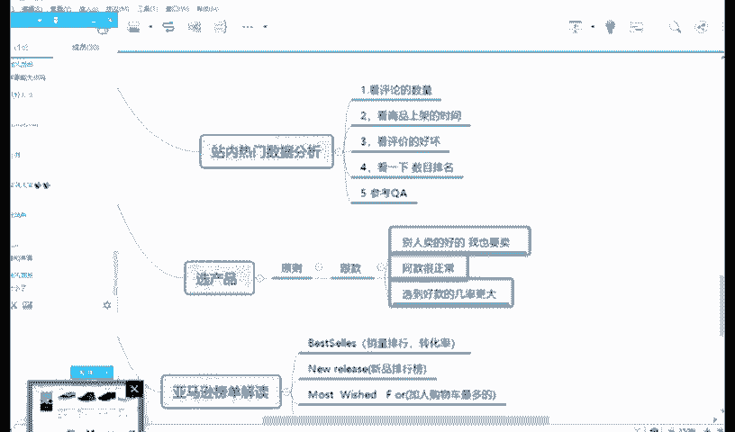

好，比如说你打开亚马逊官网。好，假设啊我告诉大家一个网址，这个叫WIZ点123点com这个网址呢是。😡。

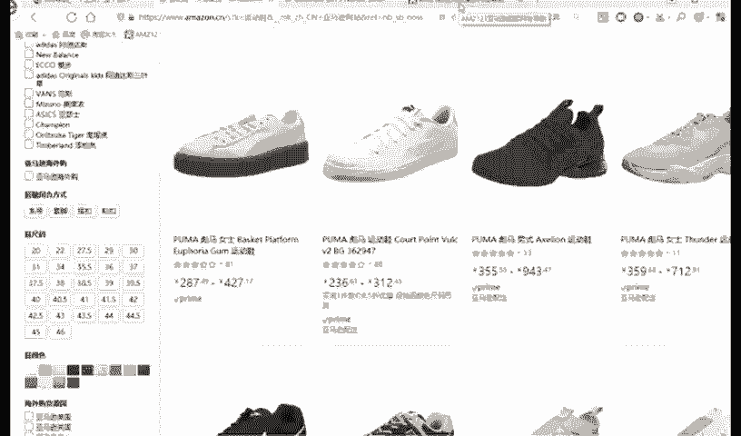

你你里面的亚马逊的一个就是一个综合的一个平台，就是里面有很多你做亚马逊常用的工具都会有。比如说你打开这个网站，里面有一个全球开店，比如说你想注册店铺，直接打点击啊，就可以根据它注册了。😡。

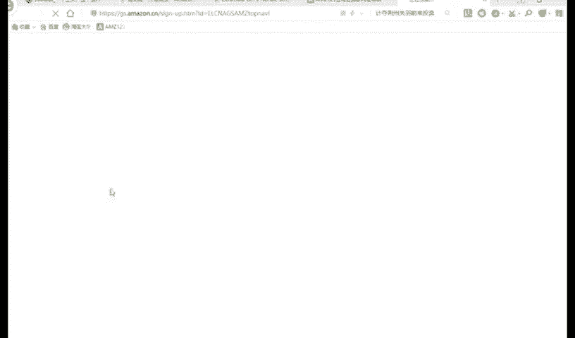

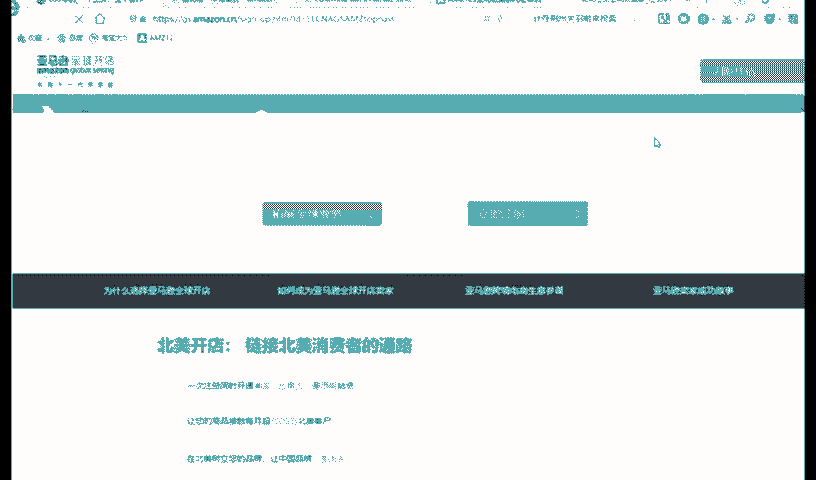

你懂我意思吗？好，比如说哎比如说我想单位换算，比如说我想邮费什么什候换算或者单位换算。好，比如FBR什么邮费计算，那我直接点击进去，然后开始填上相应的一个信息，开始查询一下。

好比如说哎我想这个美国站是什么样子的。好，我会把它打开。😊。

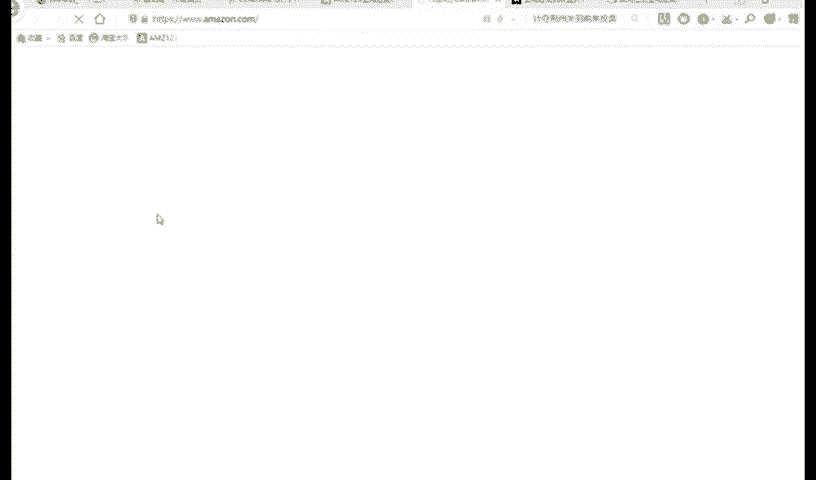

你这里面有很多快捷的一个进入方式，你懂我意思吗？快捷的进入方式都会在这里面。😡，好，这个网址发给大家，你们到时候保存一下，记录一下。好。能理解吧？我告诉你一个小技巧，假如说你发到这里的时候。

把它收藏到浏览器上，怎么收藏？假如说你浏览器一般都有个收藏，老师用的是360安全浏览器。好，你点击下收藏，然后点击添加到桌面，这个地方就在这个地方添加好了，能理解吗？😡，好，然后你点一下，下次你点一下。

直接就网站上就有了。能理解吗？这个是小技巧，你稍微懂点电脑人人基本上都知道。😡，好，我已经发给你了，然后你们自己保存到自己浏览器上就可以了。😊，好，我我还最近听老师讲说，有同学技术比较弱。

人家电脑什么一些相关的一些小功能都不会。这今天的话给大家再讲一遍哈。如果你不知道的话，你就学一下，好吧，就这样方便你以后工作嘛。😊，你后工作，你后学习。好，这是一个点。好，这是一个点。好，讲到哪了哦。

讲到这里。对，选产品。好。假如说运动鞋对不对？好，那首先我应该选什么产品的？假如设我举个例子。好，假设说我好，假设我就按运动鞋吧。好，比如说呃我怎么写呢？叫运动鞋冬季。好，假如说搜索运动鞋。😊。

Mao绒。

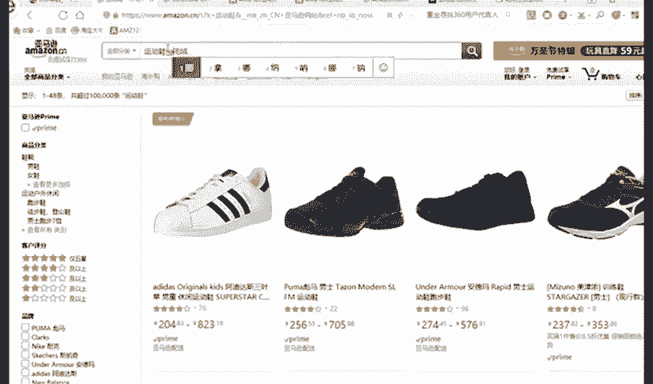

好，男毛绒搜索这个关键词。好。这个词应该是不符合。好，晕好，你看还有下拉框，运动鞋难。运动鞋南冬好，是这个关键词。

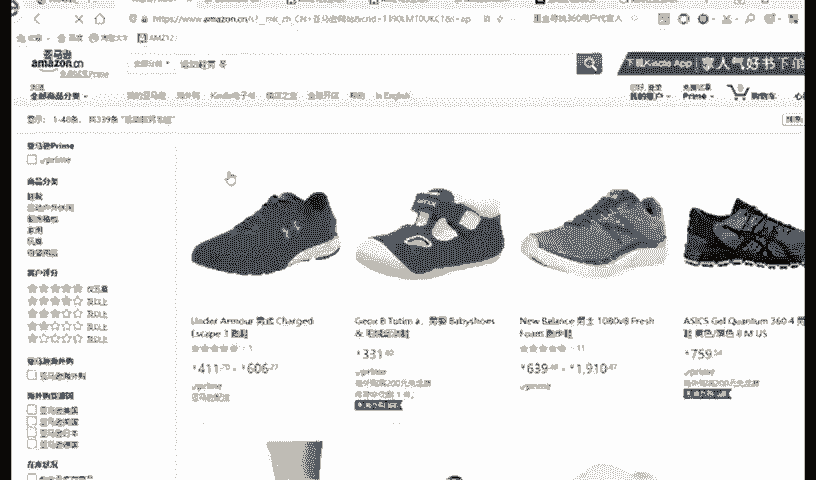

好。

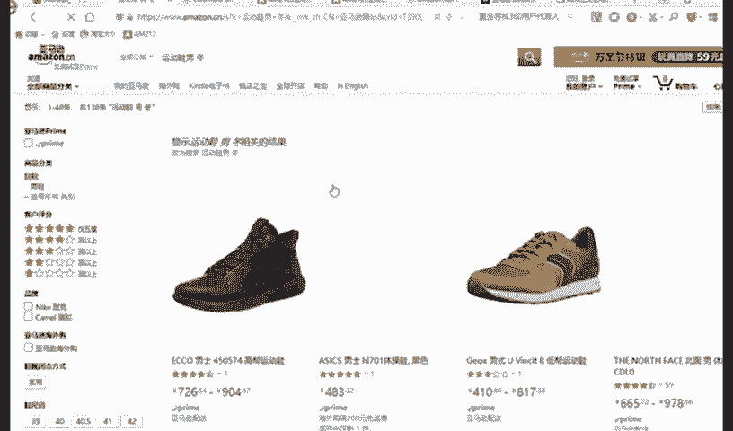

啊，假如说你开美国站，你就打开美国站点来搜。好，比如说叫运动鞋。男。

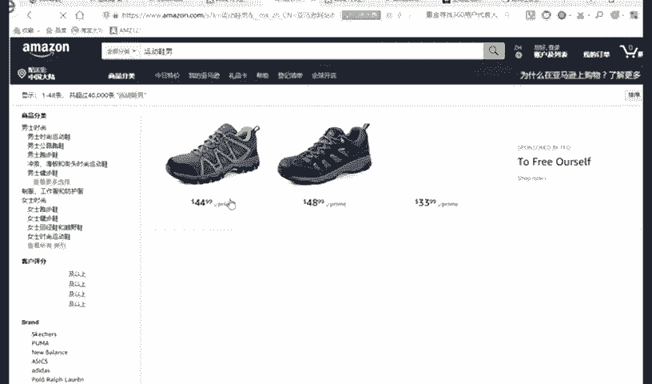

这个有一个小技巧啊，就是你假如说你是卖美国站，你要从美国站的官网来搜。😡，能理解吗？好，美国站的官网，你看运动鞋男大概有4万条运动鞋难。换句话说，有4万个宝贝，大概有4万多个宝贝，超过4万的宝贝。好。

那老师如果是超过4万的宝贝，那运动鞋还能不能卖嘞？然，我给大家讲运动鞋能不能在亚马逊上卖，就是竞争大不大？或者说它能不能卖。啊，我声音已经很大了，还不行吗？😡，能不能卖？

我刚刚讲的运动鞋是属于大类目还是小类目？😡，啊，是是大类目还是小类目？😊，好，大类目对不对？因为服饰鞋包是大类幕，我刚刚讲了，大类目是永远都有市场，永远都有市场。好，那我应该。😡，怎么选呢？

你首先要选款，你要首先要找到销量比较高的款。好，比如说第一个点击运动一鞋难，对不对？好，这里面有一个叫。😡。

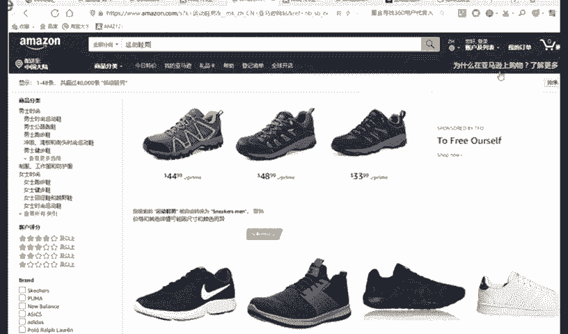

好，你可能看不到，我给你看一下啊。把它缩小这里面是有个综合，看到没有？综合有一个叫价格有高到低，运运费评分，还有上架时间。好，比如说用户评分点一下。

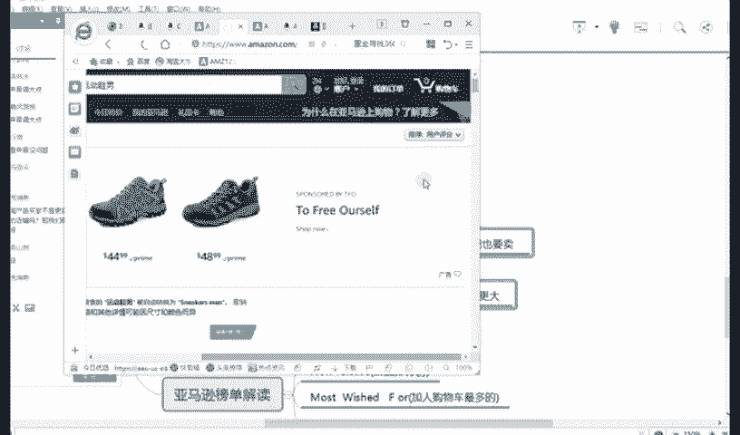

用户评分就是他评分比较高的，来排名靠前。好，看到没有？这边全是五星。

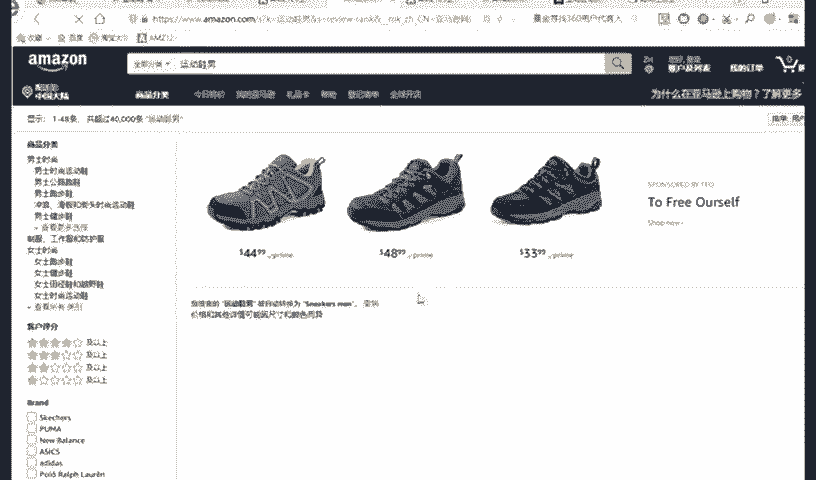

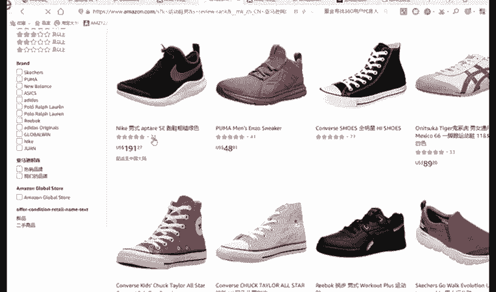

好，五星说明这个产品质量比较好，看到没有？基本上全是五星。😡。

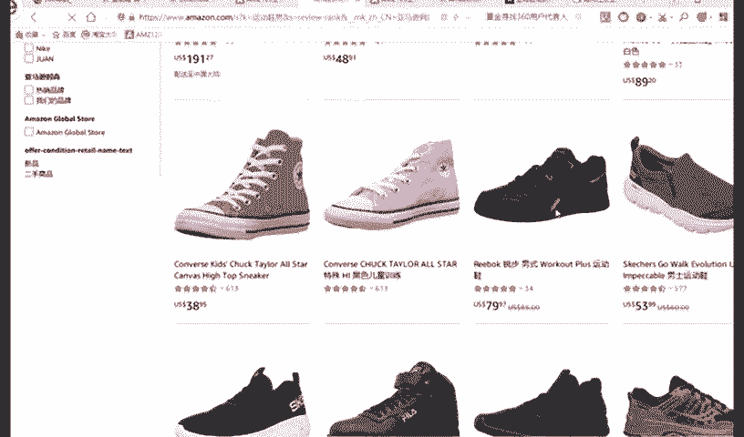

好，你看这边就补锌的就比较少了。好，假如说那你要怎么选呢？你要选，首先第一你要选尽可能。😡。

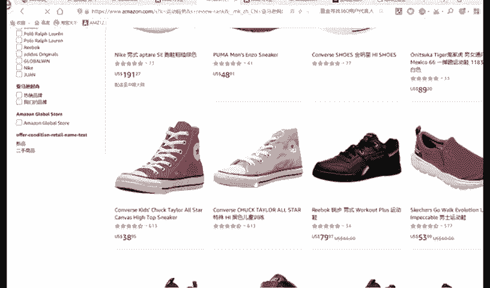

是评价比较好，但是他这评价数量是比较多的。好，因为它一般情况下是显示3个月的一个一个一个数据。好，比如说啊，比如说我点击这个，你看这个卖3938。95美元。

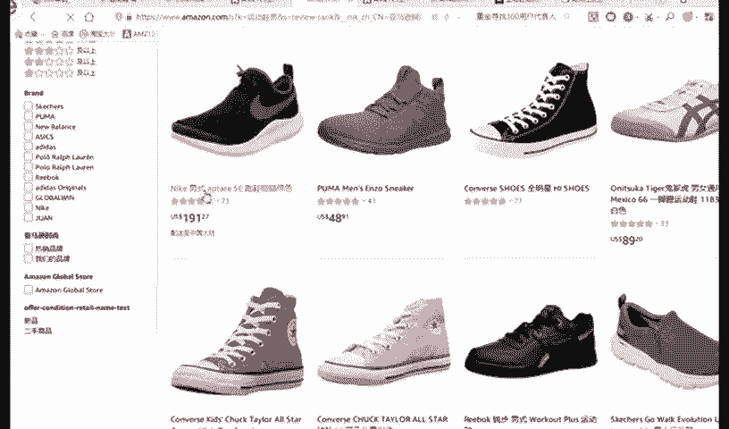

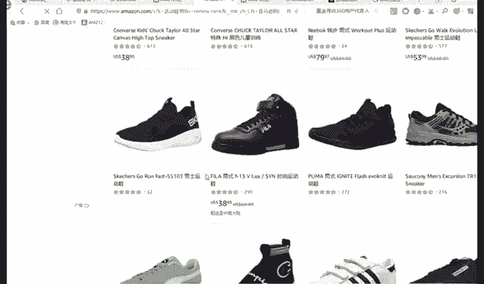

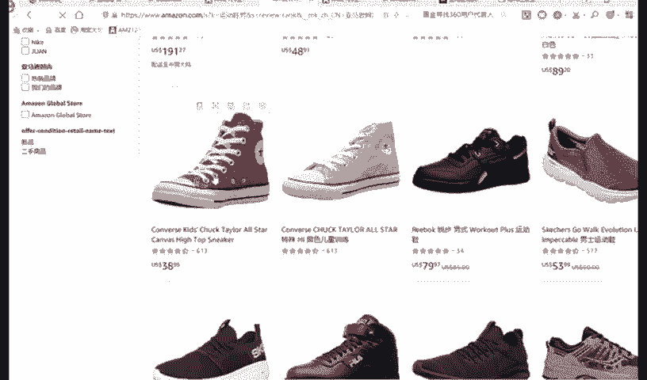

好，这个如果是折合人民币，大概是。呃，404624大概是200多块钱啊。那这个对于这个鞋子还是非常贵的啊，对中国人来讲还是非常贵的。我不知道对美国人来讲是贵不贵。好，美国人应该是有几10块钱。😊，好。

稍等。

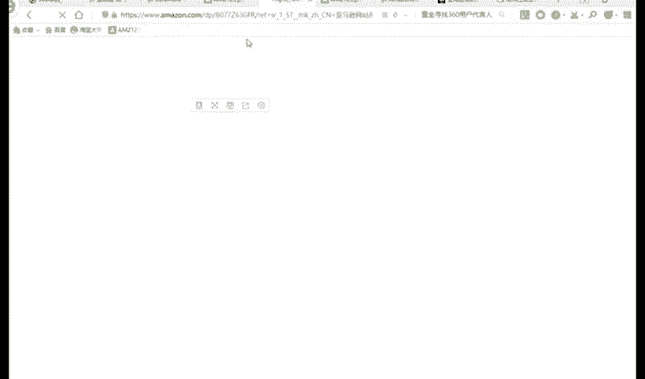