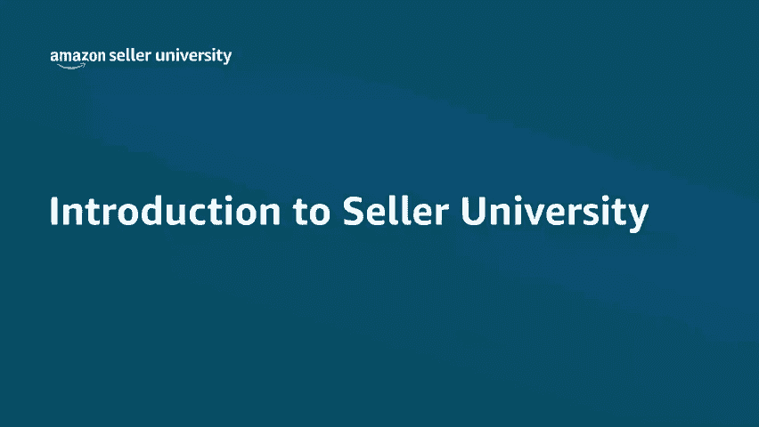
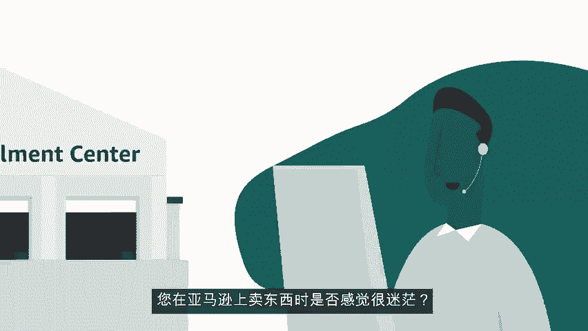
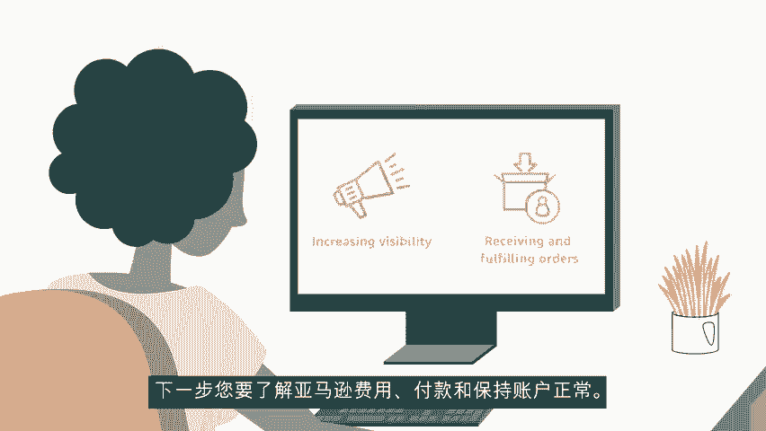
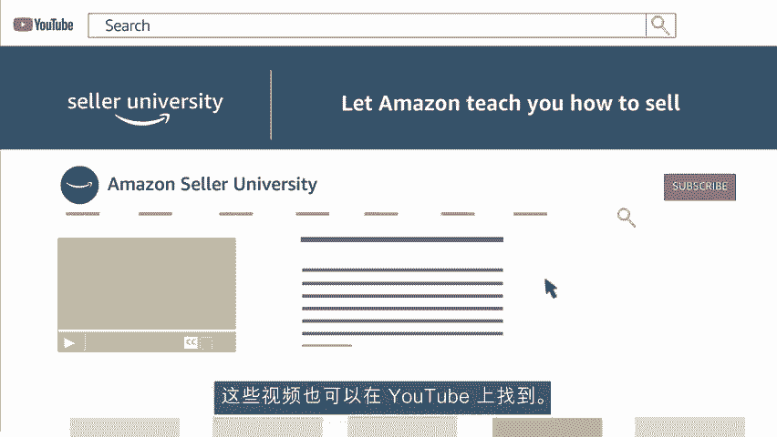
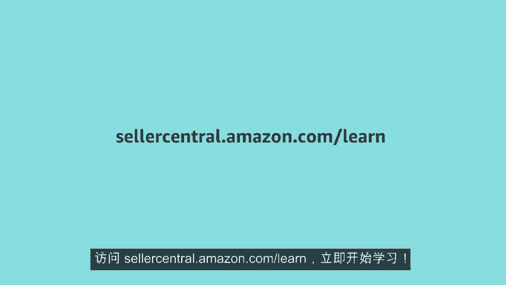

# 2024年亚马逊跨境电商开店教程，零基础亚马逊运营课程【合集】Amazon亚马逊跨境电商入门到精通教程（纯干货，超详细！） - P13：1.1、卖家大学简介 - 蛋哥说亚马逊 - BV1Ux2ZYPEFB

🎼您在亚马逊上卖东西时，是否感觉很迷茫？在进行卖家注册，浏览卖家中心，了解商品标识符和获得类别审批的过程中，浏览所有选项和工具可能需要一些时间。

🎼并且您可能发现自己陷入一大堆问题中。🎼卖家大学旨在帮助您解答这些问题。🎼要想成功的开展业务并坚持下去，请按照免费的视频教程操作。他们涵盖了每个销售步骤，并揭开了在亚马逊上销售商品的神秘面纱。

通过学习关键工具和应用，掌握卖家中心的操作。卖家大学的课程，会教卖家何时需要知道什么。🎼从添加商品到管理价格，到提高曝光度，然后接收和配送订单。下一步，您要了解亚马逊费用付款和保持账户正常。

选择诸如由亚马逊配送之类的计划，可以帮助卖家专心经营业务，让亚马逊负责储存发货、退货和客户服务。您可以了解广告品牌注册优惠和优惠券，亚马逊手工制品等。

🎼可以访问卖家大学，了解各种亚马逊计划，以及他们为何对您的业务至关重要，然后开始您的运营。🎼了解和使用您可以获得的工具只是开始。

🎼亚马逊会不断添加创意，并提供机会，使您的业务更上一层楼，准备好了解这些了吗？在卖家中心主页上将鼠标悬停在performance绩效选项卡上，选择sellereller university麦家大学。

然后单击start here，从这里开始来查看快速入门指南。🎼这将帮助您启动您的业务。🎼您还可以浏览其他主题来充实您的知识。🎼这些视频也可以在youtube上找到。

🎼欢迎订阅我们的亚马逊卖家大学频道，访问sellercent doamazon点tcomm for slash learn，立即开始学习，非常感谢，祝您销售愉快。

