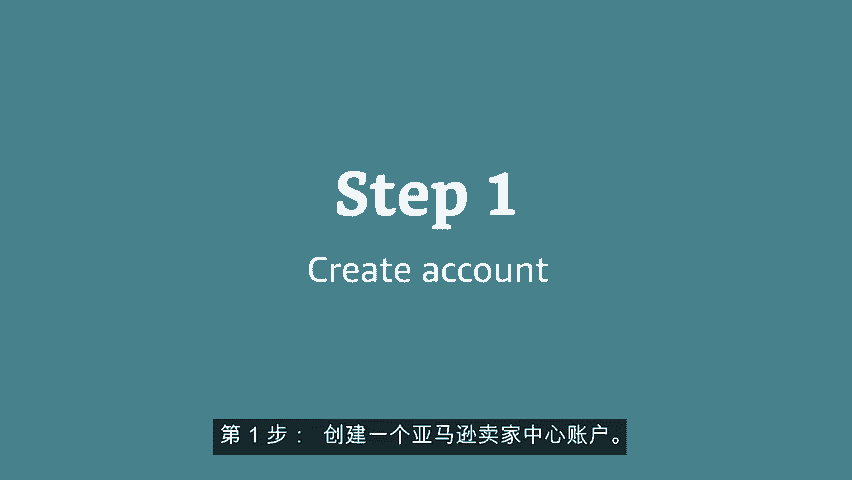
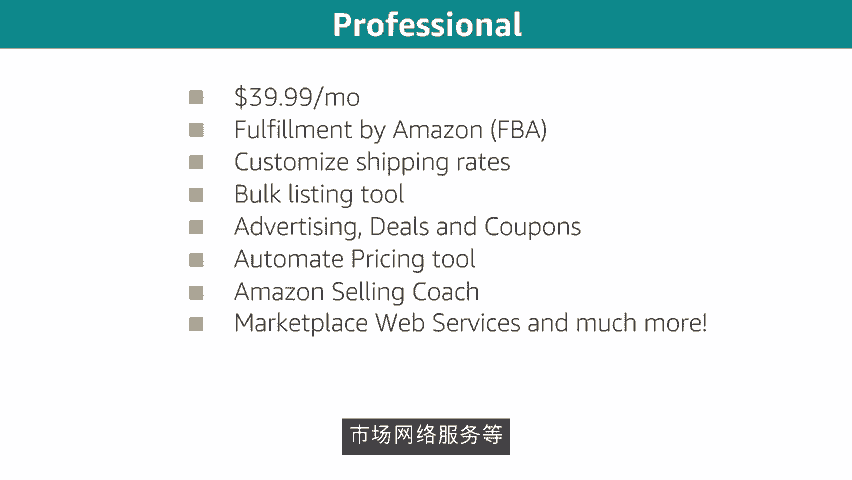
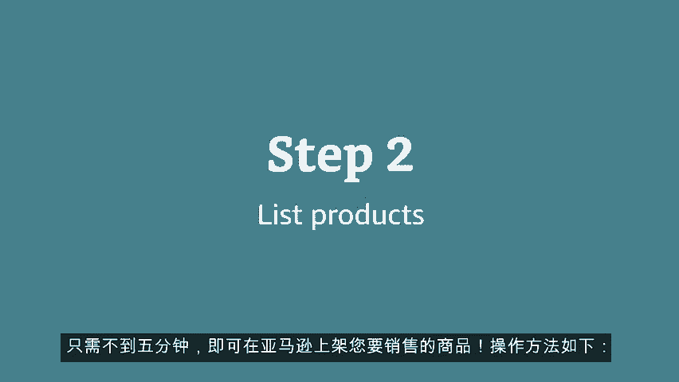
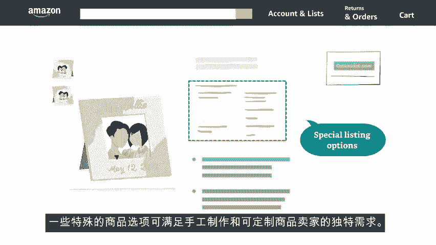
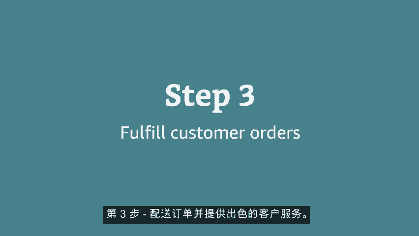
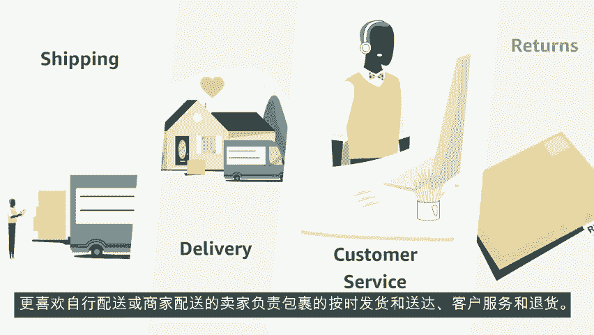
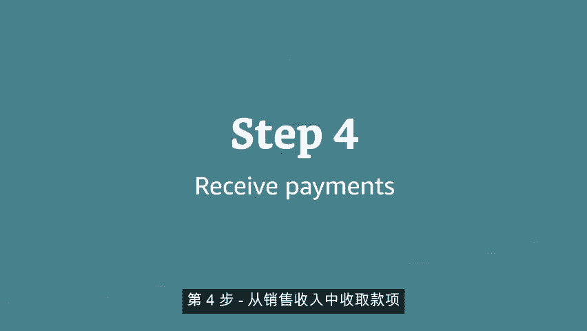
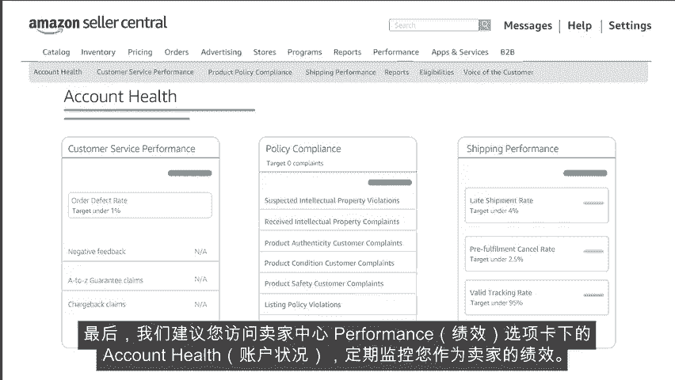

# 2024年亚马逊跨境电商开店教程，零基础亚马逊运营课程【合集】Amazon亚马逊跨境电商入门到精通教程（纯干货，超详细！） - P14：2.2、我要开店的运作原理 - 蛋哥说亚马逊 - BV1Ux2ZYPEFB

🎼欢迎观看介绍如何在亚马逊上销售商品的视频。在亚马逊上销售商品可以分为四步。第一步，在sll dot amazon dotcomm上创建一个亚马逊卖家中心账户。第二步，将要销售的商品上架。第三步。

配送客户订单，并提供出色的客户服务。第四步，从销售收入中收取款项，并保持账户正常。

🎼让我们更详细的介绍这四个步骤。第一步，创建一个亚马逊卖家中心账户。

🎼在亚马逊上注册账户之前，需要选择职业还是个人销售计划？🎼不知道哪种计划最适合您的业务。🎼这两种计划有一些重要区别，让我们比较一下，职业账户有39。99美元的每月固定订阅费用。无论您销售多少商品。

如果您计划销售很多商品，这种账户最适合您。🎼如果您计划每月只销售几次，个人账户是更好的选择。🎼您无需支付每月的固定订阅费，只需为您销售的每件商品支付99美分的费用。

🎼个人和职业卖家账户都可以使用FBA服务。🎼现在让我们看看哪些功能是职业销售账户才有的，自定义运费、批量上架工具、广告优惠和优惠券。🎼自动定价工具销售指导。🎼市场网络服务等。

🎼现在让我们看看第二步，将商品上架，只需不到5分钟，即可在亚马逊上架。您要销售的商品。

🎼操作方法如下，如果有人已在销售同款商品，亚马逊的product listing商品页面允许卖家匹配一个现有列表。或者如果您是第一位或唯一的卖家，可以创建一个新的商品页面。

🎼如果您要转售亚马逊目录中已有的商品，这是一种向您的账户添加选品的快速方法。如果我的选品与现有优惠不符怎么办？如果您要销售自己品牌私有品牌的商品，或将新选品添加到一个类别中。

您需要在亚马逊上创建一个新的详细信息页面，🎼要创建新商品页面，您需要一个商品标识符，也成为条形码常用的标识符术语包括UPCGTIN。🎼EAN或ISBN不知道条形码是什么，在一些您喜欢的商品上寻找条形码。

🎼或者观察商店店员扫描什么来获取商品价格。

🎼查看条形码下方打印的数字，12位数是UPC13位数是EAN。🎼如果您打算销售的商品没有条形码，请申请GITN豁免。🎼然后无需条形码也能添加全品。🎼使用ad a product，添加新产品选项。

将商品逐个添加到您的账户，使用ad products via upload批量上传商品选项，依次添加全部库存。一些特殊的商品选项可满足手工制作和可定制商品卖家的独特需求。第三步。

配送订单并提供出色的客户服务。完成商品页面后，下面选择如何最有效的配送订单。

🎼FBA计划使卖家有机会利用亚马逊世界一流的发货物流和客户服务合作伙伴，让买家受益。使用FBA的卖家，将其商品发送到亚马逊的配送中心。我们负责打包、发货、退货和客户服务问题。商品可享受prime服务。

具有prime徽章徽标，更喜欢自行配送或商家配送的卖家负责包裹的按时发货和送达客户服务和退货。

🎼第四步，从销售收入中收取款项。

🎼亚马逊每两周通过自动清算中心，将符合条件的销售收入支付到您的银行账户。为了确定销售收入和利润率，卖家应熟悉亚马逊的收费表。🎼在卖家中心主页上，在搜索栏中输入按亚马逊收费表销售，这会将您引导至帮助页面。

🎼帮助页面列出了与在亚马逊上销售商品有关的所有费用。最后我们建议您访问卖家中心performance绩效选项卡下的account health账户状况。定期监控您作为卖家的绩效。

关于如何在亚马逊上销售商品，就介绍到这里，非常感谢祝您销售愉快。

