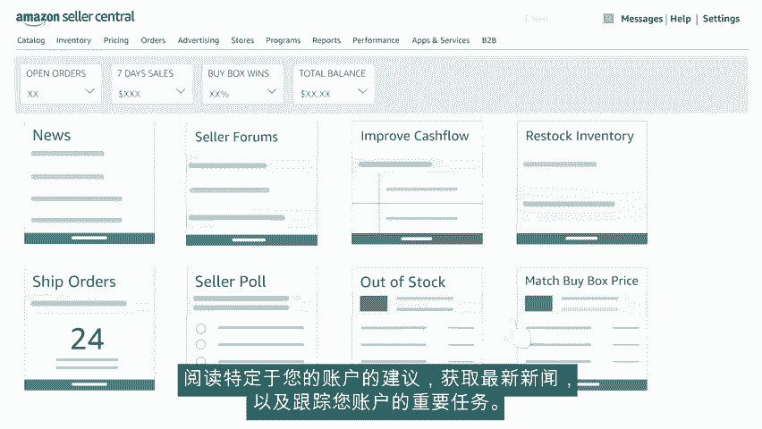

# 2024年亚马逊跨境电商开店教程，零基础亚马逊运营课程【合集】Amazon亚马逊跨境电商入门到精通教程（纯干货，超详细！） - P15：3.3、了解亚马逊平台l - 蛋哥说亚马逊 - BV1Ux2ZYPEFB

🎼欢迎观看亚马逊卖家中心简介。亚马逊卖家中心允许卖家管理其销售账户，并在亚马逊上开展业务。

🎼让我们开始吧，使用您注册的电子邮件ID和密码，登录亚马逊卖家中心。🎼使用卖家中心顶部的选项卡，浏览亚马逊卖家中心的功能。第一个是catalog目录选项卡。🎼您可在此处添加商品，完成草稿。

以及查看销售申请状态。🎼如果您需要通过其他审批才能销售某些商品或某些类别，此处将列出这些审批。🎼在inventory库存选项卡上，您可以找到需密切关注的库存信息，逐个添加或批量上传商品以及执行报告分类。

来帮助您更好的管理目录。🎼您还可以了解有关在亚马逊上向全球销售商品的信息，priing定价选项卡，可帮助了解定价情况。🎼了解定价状况，定价仪表板和固定价格警报。🎼自动定价选项可帮助您创建定价规则。

orders订单选项卡，提供已收订单的详细信息，管理退货，下载订单报告，以供进一步审核adverising广告选项卡，帮助您确定商品促销方式，了解广告活动管理器，您会在这里找到竞价商品。

这是亚马逊按点击付费的商品广告展示计划。🎼您还可以使用优惠优惠券和促销。🎼品牌拥有者可以使用A加内容管理器，向其商品页面中添加功能强大的描述，使用亚马逊的自助商店构建器创建或编辑您的商店。

🎼接下来是programs计划选项卡，您可在集中发现注册和管理亚马逊配送计划。🎼卖家可以在report报告选项卡中下载付款、业务和税务报告。performance绩效选项卡可帮助您大致了解账户的状况。

您可以检查反馈和任何未解决的索赔。客户之声部分有助于确定客户强调的商品问题。🎼我们强烈建议您访问卖家大学，并观看可帮助您在亚马逊上大获成功的参考视频。

🎼apps and services应用和服务选项卡包括一个应用列表。🎼这些应用可自动完成您的日常任务，搜索亚马逊信赖的服务提供商提供的图片处理、定价、边幕等服务，以提高您的商品质量。

并让您在亚马逊上的业务不断增长。🎼B to B选项卡可帮助您为经常以企业折扣价批量订购的亚马逊企业客户提供服务。🎼您可以在右上角的搜索栏输入关键词来查找所需内容，可以使用messages消息。

轻松与客户沟通，单击help帮助，可以获得亚马逊提供的支持。访问settings设置选项卡，可以获得您的所有账户信息的链接，包括您的付款业务发货、退货和税收信息。

您还可以更新通知首选用户权限并管理商店的信息和政策。🎼在navigation导航选项卡下，您可以查看卖家论坛。🎼阅读特定于您的账户的建议。🎼获取最新新闻以及跟踪您账户的重要任务。

我们的卖家中心介绍视频到此结束，非常感谢祝您在亚马逊上销售愉快。

