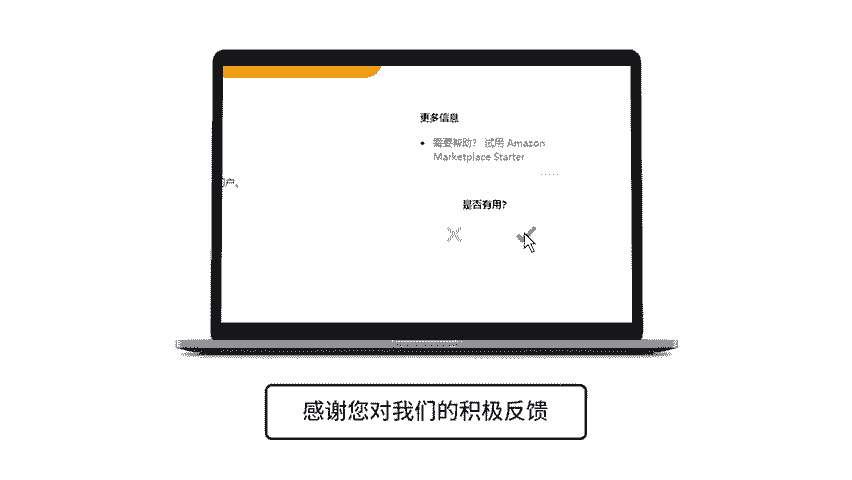

# 2024年亚马逊跨境电商开店教程，零基础亚马逊运营课程【合集】Amazon亚马逊跨境电商入门到精通教程（纯干货，超详细！） - P16：4.4、账户信息 - 蛋哥说亚马逊 - BV1Ux2ZYPEFB

。

Yeah。Now that you have completed your seller central account registration， first things first。

 setting up your account information After watching this video。

 you'll know how to set vacation status for your listings。 Edit your seller information。

 add your legal entity， add deposit and charge methods， and add your return address for customers。

 You can make changes to your account anytime through the settings tab。

 You'll see the account info in the drop down。On the account info page。

 you'll first see the Va Se section。If you take a vacation。

 you can use the listing status page to temporarily remove your open listings from Amazon。

 You can still create and edit listings while they are inactive。

 Those changes will be reflected on the website once you reactivate them。

Note that once you change your listings to inactive， it takes an hour to process。Further down。

 you'll see the seller information section。 Click editit， and you can edit your display name。

 customer service information and your storefront link。

Your display name is the seller nameCustom C when they purchase products from you on Amazon。

 This name is also available on pages with your seller information and policies。 In addition。

 you can keep your contact information up to date here in case customers have questions about your products。

Any messages from customers will be forwarded to the customer service email that you provide through the buyer。

 seller messaging service and seller Central。This service masks private email addresses。

 increasing the security of buyer seller communication。The customer service phone number is optional。

 but can be helpful for customers that have urgent issues or prefer to talk to someone instead of using the buyer seller messaging service。

You can also create a storefront link Amazon hosts this web URL so you can market and advertise your products inside or outside Amazon。

Back on the account info main page， you'll see the legal En section。

Your legal entity name reflects the information you provide to us for IRS reporting purposes。 Next。

 you'll see the depositpo methods section Before you can receive a payment。

 you'll need to click add and provide a US checking account or a bank account located in a country supported by the Amazon currency converter for sellers。

For example， for US checking accounts， we require a9 digit routing number and an account number。

 Amazon generally remits funds to the bank account that you provide every 14 days subject to the limitations described in your seller agreement。

Below the depositpo Me section， you'll see the chargege method section。

 which you can update by clicking editit。Amazon needs to have a valid credit card on file。

 we may charge your credit card to offset a negative balance for your seller account。

 among other reasons。Negative balances may be caused by account fees， order refunds。

 or other charges or fees。Lastly， you'll see the returnturn information section。

 click Edit and you can specify your product return address。For more information。

 search for account information in sellerar Central Help。

。